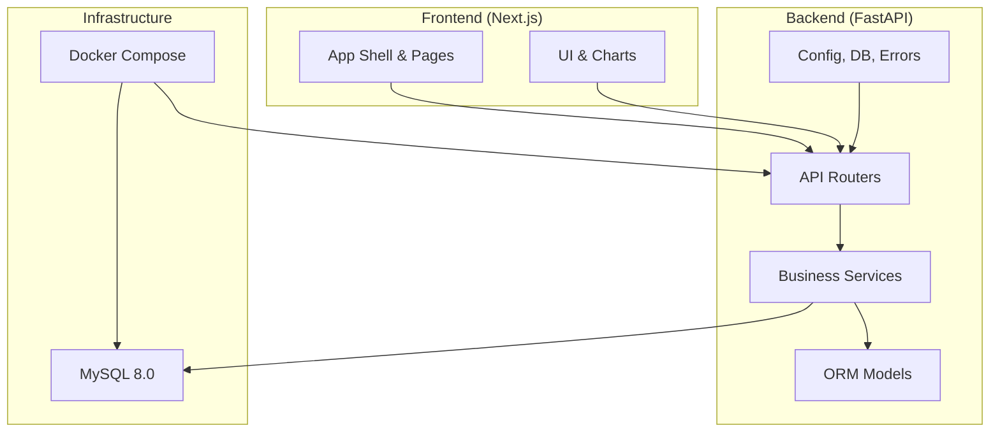
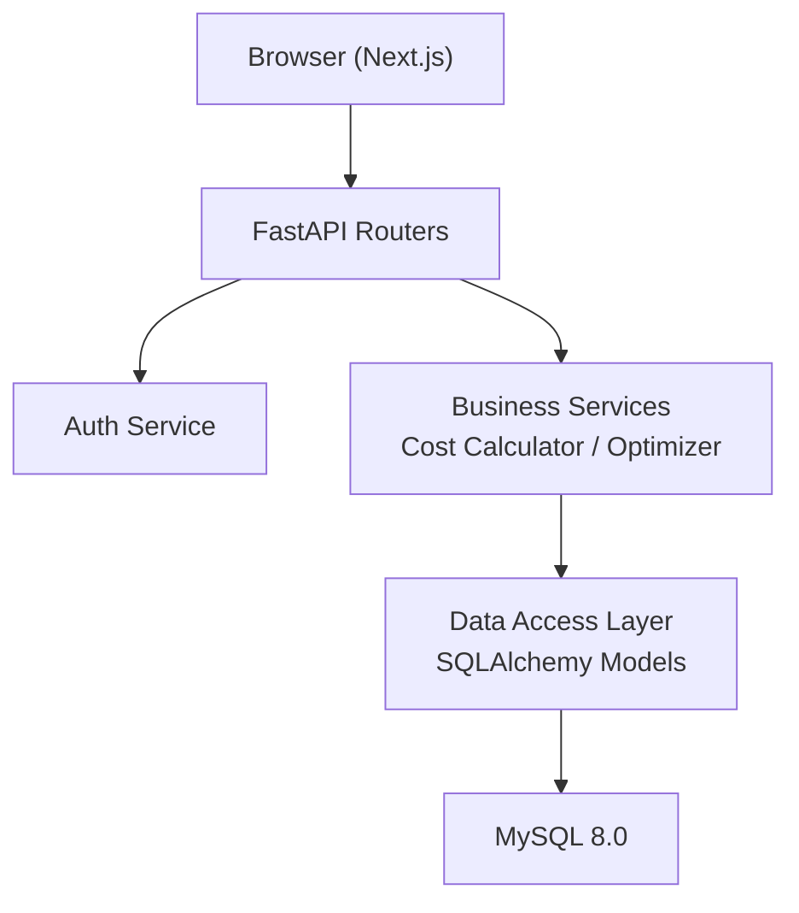
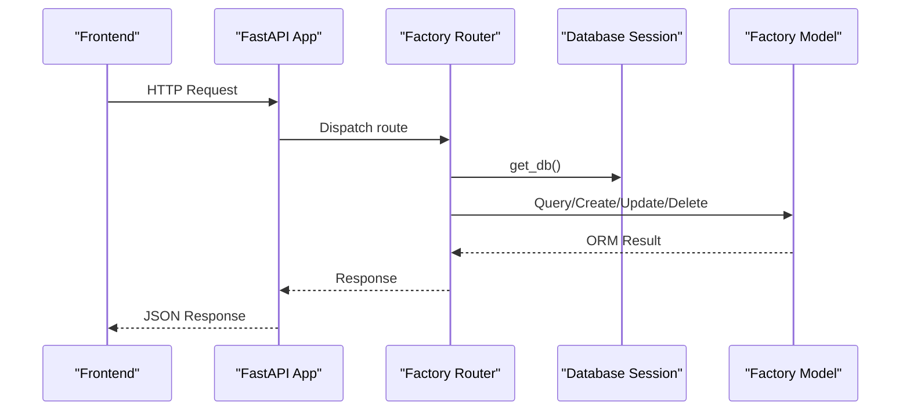
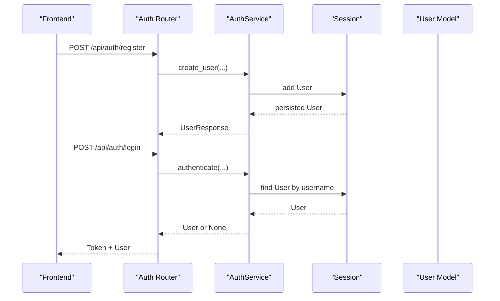
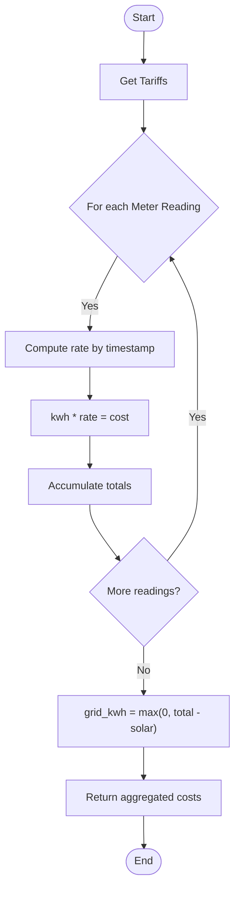
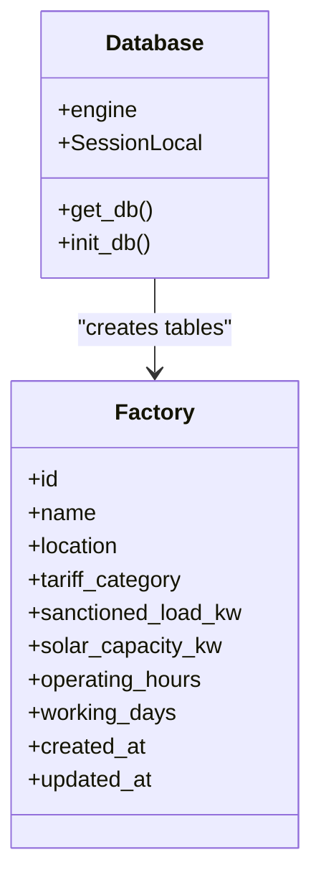
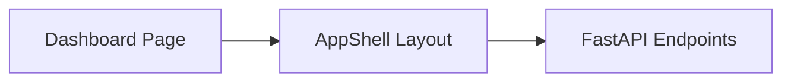
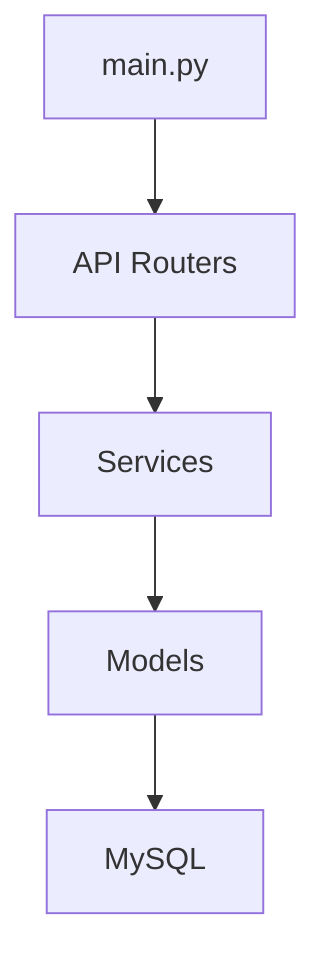
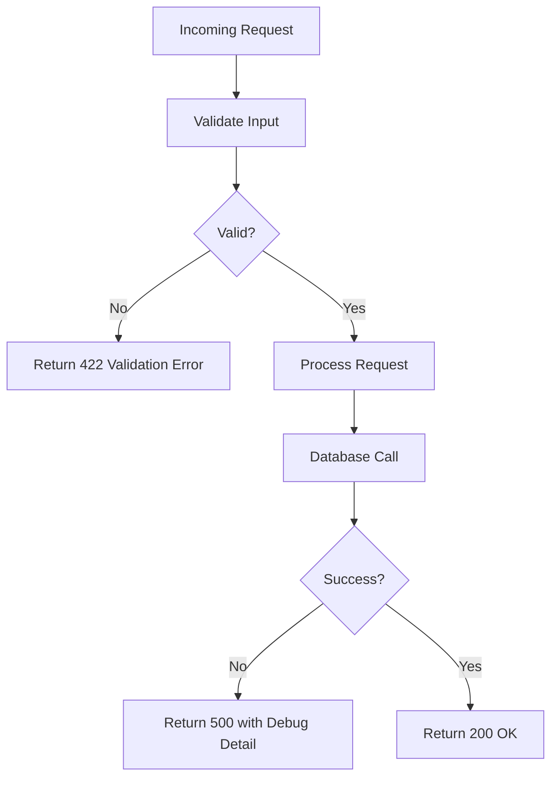
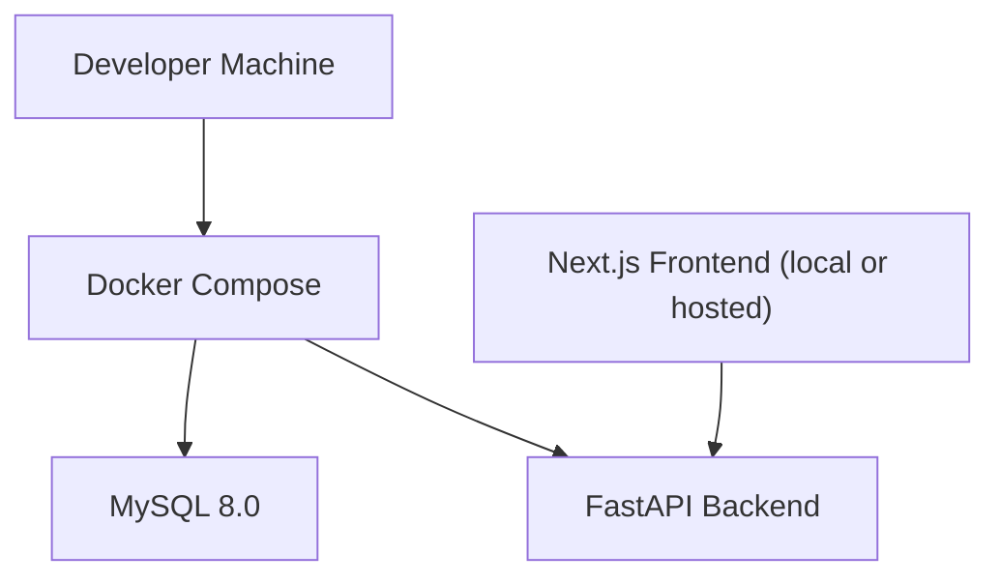

# Architecture Overview

<cite>
**Referenced Files in This Document**
- [main.py](file://backend/main.py)
- [config.py](file://backend/app/core/config.py)
- [database.py](file://backend/app/core/database.py)
- [error_handlers.py](file://backend/app/core/error_handlers.py)
- [factory.py](file://backend/app/api/factory.py)
- [auth.py](file://backend/app/api/auth.py)
- [optimizer.py](file://backend/app/services/optimizer.py)
- [cost_calculator.py](file://backend/app/services/cost_calculator.py)
- [factory_model.py](file://backend/app/models/factory.py)
- [docker-compose.yml](file://docker-compose.yml)
- [package.json](file://frontend/package.json)
- [dashboard_layout.tsx](file://frontend/app/dashboard/layout.tsx)
- [README.md](file://README.md)
</cite>

## Table of Contents
1. [Introduction](#introduction)
2. [Project Structure](#project-structure)
3. [Core Components](#core-components)
4. [Architecture Overview](#architecture-overview)
5. [Detailed Component Analysis](#detailed-component-analysis)
6. [Dependency Analysis](#dependency-analysis)
7. [Performance Considerations](#performance-considerations)
8. [Troubleshooting Guide](#troubleshooting-guide)
9. [Conclusion](#conclusion)
10. [Appendices](#appendices)

## Introduction
TariffGuard is a decision-support platform for small textile factories that converts electricity tariffs, production requirements, solar availability, and maximum-demand constraints into actionable production schedules. The system follows a microservices-inspired layered architecture with clear separation between a FastAPI backend and a Next.js frontend. It uses MySQL for persistence, Docker and Docker Compose for containerization, and integrates Alibaba Cloud services (RDS, OSS, ECS) and the Qwen model via API keys.

Key goals:
- Provide factory, machine, order, tariff, meter reading, optimization, alerting, and dashboard capabilities.
- Enforce role-based access control and secure authentication.
- Offer schedule optimization to minimize energy costs based on time-of-use tariffs.
- Support local development and cloud deployment through containerized services.

**Section sources**
- [README.md:1-228](file://README.md#L1-L228)

## Project Structure
The repository is organized into two primary application layers:
- Backend (FastAPI): REST APIs, business logic, data models, configuration, error handling, and database integration.
- Frontend (Next.js): Dashboard UI, charts, forms, layout components, and client-side state management.

High-level structure:
- backend/app/api: Route handlers for domain features (factories, machines, orders, tariffs, meter readings, dashboard, optimization, alerts, auth, users).
- backend/app/services: Business logic (authentication, cost calculation, schedule optimization).
- backend/app/models: SQLAlchemy ORM models.
- backend/app/schemas: Pydantic request/response schemas.
- backend/app/core: Configuration, database engine/session, global error handlers, utilities.
- frontend: Next.js app with pages, components, context, types, tests, and build scripts.



**Diagram sources**
- [main.py:1-91](file://backend/main.py#L1-L91)
- [docker-compose.yml:1-53](file://docker-compose.yml#L1-L53)
- [package.json:1-38](file://frontend/package.json#L1-L38)

**Section sources**
- [README.md:184-205](file://README.md#L184-L205)
- [docker-compose.yml:1-53](file://docker-compose.yml#L1-L53)

## Core Components
- Application entrypoint and routing: FastAPI app initializes routers, CORS, static files, health endpoints, and startup events.
- Configuration: Centralized settings for environment, database URL, and Alibaba Cloud keys.
- Database layer: Engine creation (MySQL or SQLite fallback), session management, and table initialization.
- Authentication and authorization: Token-based login/logout, user registration, and role enforcement via dependencies.
- Business services: Cost calculator and schedule optimizer that use tariffs, machines, and orders to produce optimized schedules and cost insights.
- Frontend shell: Next.js dashboard layout composing reusable shell and page content.

**Section sources**
- [main.py:19-68](file://backend/main.py#L19-L68)
- [config.py:4-21](file://backend/app/core/config.py#L4-L21)
- [database.py:1-37](file://backend/app/core/database.py#L1-L37)
- [auth.py:15-89](file://backend/app/api/auth.py#L15-L89)
- [cost_calculator.py:12-110](file://backend/app/services/cost_calculator.py#L12-L110)
- [optimizer.py:14-238](file://backend/app/services/optimizer.py#L14-L238)
- [dashboard_layout.tsx:1-11](file://frontend/app/dashboard/layout.tsx#L1-L11)

## Architecture Overview
The system adopts a layered architecture pattern:
- API Layer: FastAPI routers expose REST endpoints for each domain feature. They validate inputs, enforce authentication/authorization, and delegate to services.
- Service Layer: Encapsulates business logic such as cost calculations and schedule optimization.
- Data Access Layer: SQLAlchemy models and sessions interact with MySQL; engines are configured per environment.
- Frontend Layer: Next.js dashboard consumes the API to render dashboards, charts, forms, and scheduling views.



**Diagram sources**
- [main.py:48-58](file://backend/main.py#L48-L58)
- [auth.py:15-89](file://backend/app/api/auth.py#L15-L89)
- [cost_calculator.py:12-110](file://backend/app/services/cost_calculator.py#L12-L110)
- [optimizer.py:14-238](file://backend/app/services/optimizer.py#L14-L238)
- [database.py:1-37](file://backend/app/core/database.py#L1-L37)

## Detailed Component Analysis

### API Layer and Routing
- The FastAPI application mounts routers for factories, machines, orders, tariffs, meter readings, dashboard, optimization, alerts, auth, and users.
- Global exception handlers standardize error responses for validation and database errors.
- CORS is enabled to allow frontend requests during development.



**Diagram sources**
- [main.py:48-58](file://backend/main.py#L48-L58)
- [factory.py:13-81](file://backend/app/api/factory.py#L13-L81)
- [database.py:27-37](file://backend/app/core/database.py#L27-L37)
- [factory_model.py:5-17](file://backend/app/models/factory.py#L5-L17)

**Section sources**
- [main.py:25-68](file://backend/main.py#L25-L68)
- [factory.py:1-81](file://backend/app/api/factory.py#L1-L81)

### Authentication and Authorization
- Registration creates users with hashed passwords and roles.
- Login issues an in-memory token bound to the user ID; logout removes the token.
- Role-based access control enforces permissions at route level using dependency injection.



**Diagram sources**
- [auth.py:15-89](file://backend/app/api/auth.py#L15-L89)
- [auth_service.py:8-53](file://backend/app/services/auth.py#L8-L53)

**Section sources**
- [auth.py:15-89](file://backend/app/api/auth.py#L15-L89)
- [auth_service.py:8-53](file://backend/app/services/auth.py#L8-L53)

### Cost Calculation Service
- Determines applicable tariff rate for a timestamp considering overnight periods.
- Computes slot-level and total costs across meter readings, including solar consumption and peak demand tracking.
- Estimates machine run costs given power, duration, and start time.



**Diagram sources**
- [cost_calculator.py:12-110](file://backend/app/services/cost_calculator.py#L12-L110)

**Section sources**
- [cost_calculator.py:12-110](file://backend/app/services/cost_calculator.py#L12-L110)

### Schedule Optimization Service
- Generates time slots over a window and computes rates per slot using tariffs.
- Selects cheapest consecutive slots for each pending order while respecting machine availability and locked slots.
- Produces an optimized schedule with estimated costs and kWh, plus baseline vs optimized comparison.

```mermaid
sequenceDiagram
participant API as "Optimization Router"
participant Opt as "ScheduleOptimizer"
participant CC as "CostCalculator"
participant DB as "Session"
participant Models as "Models"
API->>Opt : create_optimized_schedule(factory_id, start, end)
Opt->>DB : query Tariffs, Machines, Orders
DB-->>Opt : datasets
Opt->>CC : get_tariff_rate(tariffs, slot)
CC-->>Opt : rate
Opt->>Opt : find_optimal_slots(sorted by rate)
Opt-->>API : {schedule, costs, kwh}
```

**Diagram sources**
- [optimizer.py:14-238](file://backend/app/services/optimizer.py#L14-L238)
- [cost_calculator.py:12-110](file://backend/app/services/cost_calculator.py#L12-L110)

**Section sources**
- [optimizer.py:14-238](file://backend/app/services/optimizer.py#L14-L238)

### Data Access Layer
- Uses SQLAlchemy with configurable engine for MySQL or SQLite fallback.
- Provides a session generator and table initialization function called at startup.



**Diagram sources**
- [database.py:1-37](file://backend/app/core/database.py#L1-L37)
- [factory_model.py:5-17](file://backend/app/models/factory.py#L5-L17)

**Section sources**
- [database.py:1-37](file://backend/app/core/database.py#L1-L37)
- [factory_model.py:5-17](file://backend/app/models/factory.py#L5-L17)

### Frontend Integration
- Next.js dashboard composes an app shell and renders feature pages.
- The frontend communicates with the FastAPI backend via HTTP calls (not shown here) to display live monitoring, cost analysis, alerts, and schedule optimization results.



**Diagram sources**
- [dashboard_layout.tsx:1-11](file://frontend/app/dashboard/layout.tsx#L1-L11)
- [main.py:48-58](file://backend/main.py#L48-L58)

**Section sources**
- [dashboard_layout.tsx:1-11](file://frontend/app/dashboard/layout.tsx#L1-L11)
- [package.json:1-38](file://frontend/package.json#L1-L38)

## Dependency Analysis
- The FastAPI application wires multiple routers and middleware, centralizing cross-cutting concerns like CORS and error handling.
- Services depend on models and database sessions; they do not directly handle HTTP concerns.
- Frontend depends on the backend API surface defined by routers.



**Diagram sources**
- [main.py:48-58](file://backend/main.py#L48-L58)
- [database.py:1-37](file://backend/app/core/database.py#L1-L37)

**Section sources**
- [main.py:48-58](file://backend/main.py#L48-L58)

## Performance Considerations
- Database connection pooling: Engine uses pool_pre_ping and pool_recycle for MySQL to maintain healthy connections under load.
- Time-slot generation: Optimization service generates hourly slots; consider adjusting interval_minutes for finer granularity if needed.
- Sorting and selection: Optimization sorts slots by rate; for large windows, consider indexing or caching frequently accessed tariff data.
- Frontend rendering: Use efficient chart libraries and lazy loading for heavy visualizations.

[No sources needed since this section provides general guidance]

## Troubleshooting Guide
- Validation errors: Standardized 422 responses with structured error details.
- Database errors: Centralized 500 responses; detailed messages exposed only in debug mode.
- Health checks: Root and health endpoints confirm service status and environment configuration.



**Diagram sources**
- [error_handlers.py:11-44](file://backend/app/core/error_handlers.py#L11-L44)
- [main.py:25-38](file://backend/main.py#L25-L38)

**Section sources**
- [error_handlers.py:11-44](file://backend/app/core/error_handlers.py#L11-L44)
- [main.py:25-38](file://backend/main.py#L25-L38)

## Conclusion
TariffGuard’s architecture cleanly separates concerns across API, service, and data layers, enabling maintainability and testability. The FastAPI backend exposes robust endpoints with consistent error handling and role-based security, while the Next.js frontend delivers an interactive dashboard. Containerization via Docker Compose simplifies local development and supports scalable deployment to Alibaba Cloud. The optimization and cost calculation services provide actionable insights to reduce energy expenses and improve production planning.

[No sources needed since this section summarizes without analyzing specific files]

## Appendices

### Infrastructure Requirements and Deployment Topology
- Services:
  - MySQL 8.0 with persistent volume and health checks.
  - FastAPI backend with hot reload for development, exposing port 8000.
  - Environment variables for database URL, environment flags, and Alibaba Cloud keys.
- Networking: Bridge network isolates services within the compose stack.
- Volumes: Persistent storage for MySQL data.



**Diagram sources**
- [docker-compose.yml:1-53](file://docker-compose.yml#L1-L53)

**Section sources**
- [docker-compose.yml:1-53](file://docker-compose.yml#L1-L53)
- [config.py:4-21](file://backend/app/core/config.py#L4-L21)

### Technology Stack Decisions
- Backend: Python 3.11 with FastAPI for high-performance async APIs and automatic OpenAPI docs.
- Database: MySQL 8.0 for relational data modeling and robust querying.
- Containerization: Docker and Docker Compose for reproducible environments and simplified orchestration.
- Cloud: Alibaba Cloud integration via environment-configured keys for AI and infrastructure services.
- Frontend: Next.js with React and modern tooling for a responsive dashboard experience.

**Section sources**
- [README.md:10-18](file://README.md#L10-L18)
- [package.json:1-38](file://frontend/package.json#L1-L38)