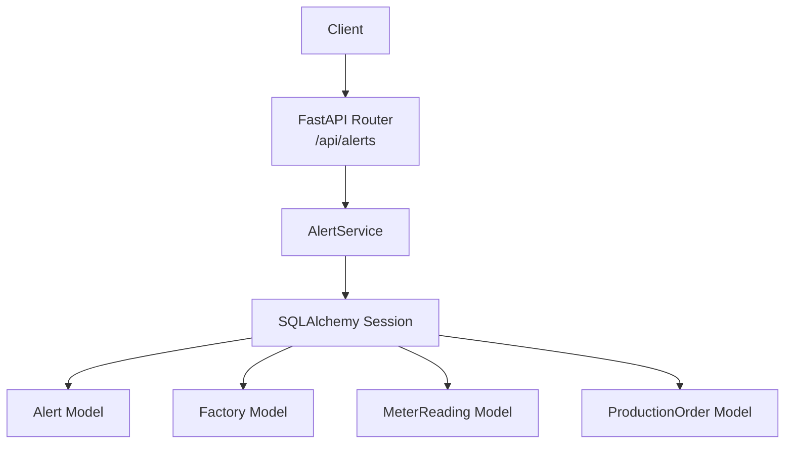
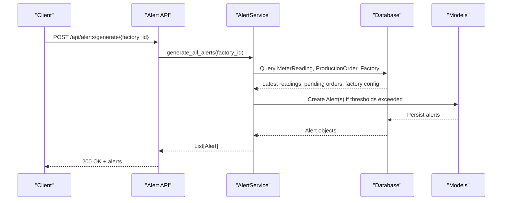
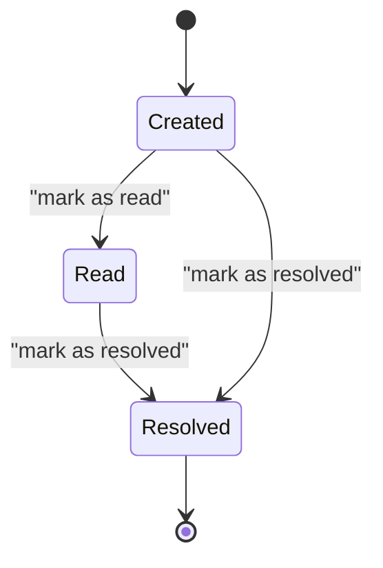
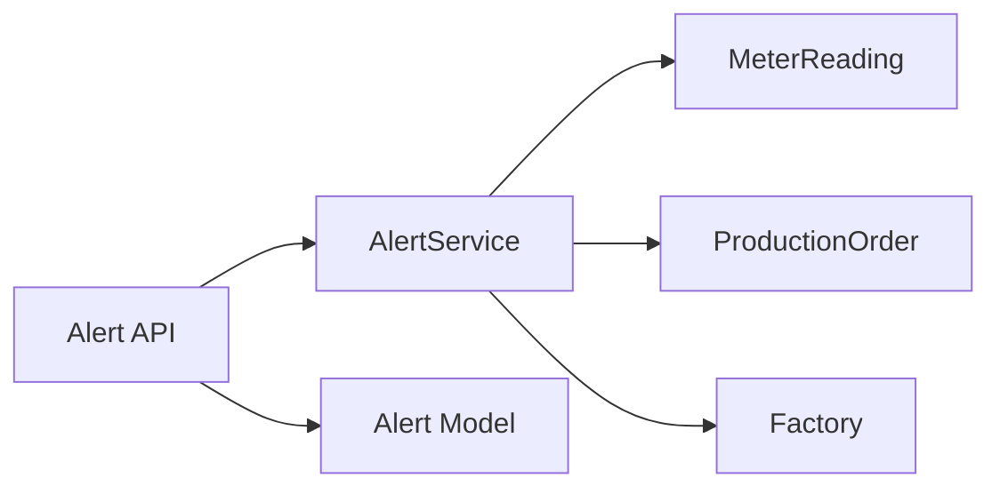

# Alert Management API

<cite>
**Referenced Files in This Document**
- [alert.py](file://backend/app/api/alert.py)
- [alert_service.py](file://backend/app/services/alert_service.py)
- [alert.py (model)](file://backend/app/models/alert.py)
- [alert.py (schema)](file://backend/app/schemas/alert.py)
- [factory.py](file://backend/app/models/factory.py)
- [meter_reading.py](file://backend/app/models/meter_reading.py)
- [production_order.py](file://backend/app/models/production_order.py)
- [main.py](file://backend/main.py)
</cite>

## Table of Contents
1. Introduction
2. Project Structure
3. Core Components
4. Architecture Overview
5. Detailed Component Analysis
6. Dependency Analysis
7. Performance Considerations
8. Troubleshooting Guide
9. Conclusion

## Introduction
This document provides comprehensive API documentation for the Alert Management endpoints. It covers proactive alert generation, retrieval and filtering of alerts, status updates, and alert resolution workflows. The system integrates with deadline monitoring, energy consumption limits, and automated alert generation services to proactively notify managers about critical operational conditions.

## Project Structure
The alert management feature is implemented as a FastAPI router mounted at /api/alerts. It uses SQLAlchemy models for persistence, Pydantic schemas for request/response validation, and a service layer that encapsulates business logic for generating alerts based on meter readings, production deadlines, and solar generation checks.

**Diagram sources**
- [main.py:48-58](file://backend/main.py#L48-L58)
- [alert.py (api):12-107](file://backend/app/api/alert.py#L12-L107)
- [alert_service.py:16-140](file://backend/app/services/alert_service.py#L16-L140)
- [alert.py (model):5-18](file://backend/app/models/alert.py#L5-L18)
- [factory.py:5-17](file://backend/app/models/factory.py#L5-L17)
- [meter_reading.py:5-17](file://backend/app/models/meter_reading.py#L5-L17)
- [production_order.py:5-20](file://backend/app/models/production_order.py#L5-L20)

**Section sources**
- [main.py:48-58](file://backend/main.py#L48-L58)
- [alert.py (api):12-107](file://backend/app/api/alert.py#L12-L107)

## Core Components
- API Layer: FastAPI endpoints under /api/alerts for listing, generating, retrieving unresolved alerts, updating alert status, and fetching statistics.
- Service Layer: AlertService implements proactive checks for peak demand, upcoming deadlines, and low solar generation.
- Data Models: Alert model stores alert metadata; Factory, MeterReading, and ProductionOrder provide context for alert generation.
- Schemas: Pydantic models define request/response structures for creating and updating alerts.

Key responsibilities:
- Proactive alert generation via POST /api/alerts/generate/{factory_id}
- Filtering and listing alerts via GET /api/alerts
- Retrieving unresolved alerts via GET /api/alerts/unresolved/{factory_id}
- Updating alert status via PUT /api/alerts/{alert_id}
- Aggregating alert metrics via GET /api/alerts/stats/{factory_id}

**Section sources**
- [alert.py (api):14-107](file://backend/app/api/alert.py#L14-L107)
- [alert_service.py:19-140](file://backend/app/services/alert_service.py#L19-L140)
- [alert.py (model):5-18](file://backend/app/models/alert.py#L5-L18)
- [alert.py (schema):5-28](file://backend/app/schemas/alert.py#L5-L28)

## Architecture Overview
The alert system follows a layered architecture:
- API endpoints receive requests, validate inputs using Pydantic schemas, and delegate to the service layer.
- AlertService queries related entities (MeterReading, ProductionOrder, Factory) to determine if an alert should be created or updated.
- Alerts are persisted via SQLAlchemy and returned as structured responses.

**Diagram sources**
- [alert.py (api):35-43](file://backend/app/api/alert.py#L35-L43)
- [alert_service.py:124-140](file://backend/app/services/alert_service.py#L124-L140)
- [alert.py (model):5-18](file://backend/app/models/alert.py#L5-L18)

## Detailed Component Analysis

### Endpoints

#### List Alerts
- Method: GET
- Path: /api/alerts
- Query Parameters:
  - factory_id: int (optional)
  - severity: string (optional)
  - is_resolved: boolean (optional)
  - limit: integer (default 50)
- Authentication: Requires current user
- Response: Array of AlertResponse

Behavior:
- Filters alerts by optional parameters
- Orders by creation time descending
- Limits results

Example Request:
- GET /api/alerts?factory_id=1&severity=critical&is_resolved=false&limit=20

Example Response:
- Array of AlertResponse objects

**Section sources**
- [alert.py (api):14-33](file://backend/app/api/alert.py#L14-L33)
- [alert.py (schema):20-28](file://backend/app/schemas/alert.py#L20-L28)

#### Generate Alerts (Proactive)
- Method: POST
- Path: /api/alerts/generate/{factory_id}
- Authentication: Requires manager role
- Response: Array of AlertResponse

Behavior:
- Triggers proactive checks for peak demand, upcoming deadlines, and low solar generation
- Creates new alerts only when conditions are met and no recent duplicate exists

Example Request:
- POST /api/alerts/generate/1

Example Response:
- Array of newly created AlertResponse objects

**Section sources**
- [alert.py (api):35-43](file://backend/app/api/alert.py#L35-L43)
- [alert_service.py:124-140](file://backend/app/services/alert_service.py#L124-L140)

#### Get Unresolved Alerts
- Method: GET
- Path: /api/alerts/unresolved/{factory_id}
- Authentication: Requires current user
- Response: Array of AlertResponse

Behavior:
- Returns unresolved alerts for a specific factory
- Orders by severity descending then creation time descending

Example Request:
- GET /api/alerts/unresolved/1

Example Response:
- Array of AlertResponse objects

**Section sources**
- [alert.py (api):45-57](file://backend/app/api/alert.py#L45-L57)

#### Update Alert Status
- Method: PUT
- Path: /api/alerts/{alert_id}
- Authentication: Requires manager role
- Request Body: AlertUpdate schema
- Response: AlertResponse

Behavior:
- Updates read/resolved flags
- Automatically sets resolved_at timestamp when marking as resolved

Example Request:
- PUT /api/alerts/123
- Body: { "is_resolved": true }

Example Response:
- Updated AlertResponse object

**Section sources**
- [alert.py (api):59-80](file://backend/app/api/alert.py#L59-L80)
- [alert.py (schema):16-18](file://backend/app/schemas/alert.py#L16-L18)

#### Alert Statistics
- Method: GET
- Path: /api/alerts/stats/{factory_id}
- Authentication: Requires current user
- Response: Object with total, unresolved, critical, resolved counts

Behavior:
- Aggregates counts for dashboard metrics

Example Request:
- GET /api/alerts/stats/1

Example Response:
- { "total": 10, "unresolved": 3, "critical": 1, "resolved": 7 }

**Section sources**
- [alert.py (api):82-107](file://backend/app/api/alert.py#L82-L107)

### Alert Model and Schemas

#### Alert Model
Fields:
- id: integer primary key
- factory_id: integer foreign key to factories
- type: string (peak_demand, deadline, low_solar, high_consumption)
- severity: string (info, warning, critical), default "warning"
- message: string
- value: float (optional)
- threshold: float (optional)
- is_read: boolean, default false
- is_resolved: boolean, default false
- created_at: datetime server default
- resolved_at: datetime nullable

**Section sources**
- [alert.py (model):5-18](file://backend/app/models/alert.py#L5-L18)

#### Alert Schemas
- AlertBase: Base fields for create/update/response
- AlertCreate: Inherits AlertBase
- AlertUpdate: Optional fields is_read, is_resolved
- AlertResponse: Includes id, timestamps, and flags

**Section sources**
- [alert.py (schema):5-28](file://backend/app/schemas/alert.py#L5-L28)

### Alert Generation Logic

#### Peak Demand Check
- Reads latest MeterReading for the factory
- If kw exceeds threshold, creates a peak_demand alert
- Severity is critical if exceeding threshold by more than 20%, else warning
- Prevents duplicate alerts within one hour

**Section sources**
- [alert_service.py:19-50](file://backend/app/services/alert_service.py#L19-L50)
- [meter_reading.py:5-17](file://backend/app/models/meter_reading.py#L5-L17)

#### Deadline Monitoring
- Queries pending ProductionOrders with deadlines within configured hours ahead
- For each order, calculates hours left and creates a deadline alert
- Severity is critical if less than 2 hours remain, else warning
- Avoids duplicates per order number

**Section sources**
- [alert_service.py:52-91](file://backend/app/services/alert_service.py#L52-L91)
- [production_order.py:5-20](file://backend/app/models/production_order.py#L5-L20)

#### Solar Generation Check
- Retrieves Factory solar capacity
- During daytime (8 AM–5 PM), checks latest solar_kwh
- If below minimum threshold, creates low_solar alert with warning severity

**Section sources**
- [alert_service.py:93-122](file://backend/app/services/alert_service.py#L93-L122)
- [factory.py:5-17](file://backend/app/models/factory.py#L5-L17)
- [meter_reading.py:5-17](file://backend/app/models/meter_reading.py#L5-L17)

#### Unified Generation
- Orchestrates peak demand, deadline, and solar checks
- Returns list of all generated alerts for the factory

**Section sources**
- [alert_service.py:124-140](file://backend/app/services/alert_service.py#L124-L140)

### Alert Lifecycle States
- Created: New alert inserted into database
- Read: Marked via update endpoint (is_read flag)
- Resolved: Marked via update endpoint (is_resolved flag), resolved_at set automatically
- Active vs Inactive: Determined by is_resolved flag in queries

[No sources needed since this diagram shows conceptual lifecycle, not actual code structure]

## Dependency Analysis
The alert system depends on several domain models and services:
- Alert API depends on AlertService and authentication middleware
- AlertService depends on MeterReading, ProductionOrder, and Factory models
- All components use SQLAlchemy sessions for data access

**Diagram sources**
- [alert.py (api):1-107](file://backend/app/api/alert.py#L1-L107)
- [alert_service.py:1-140](file://backend/app/services/alert_service.py#L1-L140)
- [meter_reading.py:5-17](file://backend/app/models/meter_reading.py#L5-L17)
- [production_order.py:5-20](file://backend/app/models/production_order.py#L5-L20)
- [factory.py:5-17](file://backend/app/models/factory.py#L5-L17)
- [alert.py (model):5-18](file://backend/app/models/alert.py#L5-L18)

**Section sources**
- [alert.py (api):1-107](file://backend/app/api/alert.py#L1-L107)
- [alert_service.py:1-140](file://backend/app/services/alert_service.py#L1-L140)

## Performance Considerations
- Pagination: Use limit parameter to avoid large result sets
- Filtering: Leverage query filters (factory_id, severity, is_resolved) to reduce payload size
- Duplicate Prevention: AlertService avoids creating duplicate alerts within short windows (e.g., one hour for peak demand)
- Ordering: Results ordered by creation time or severity to prioritize critical items
- Database Queries: Ensure indexes on factory_id, created_at, severity, and is_resolved for efficient filtering

[No sources needed since this section provides general guidance]

## Troubleshooting Guide
Common issues and resolutions:
- 404 Not Found: When updating an alert, ensure the alert_id exists
- Authentication Errors: Ensure proper roles (manager for write operations) and valid session
- No Alerts Generated: Verify presence of meter readings, pending orders, and factory configuration (solar capacity)
- Duplicate Alerts: Check existing unresolved alerts and time windows used to prevent duplication

Error handling:
- Validation errors handled globally
- SQLAlchemy errors mapped to appropriate HTTP responses
- Generic exception handler for unexpected errors

**Section sources**
- [alert.py (api):67-70](file://backend/app/api/alert.py#L67-L70)
- [main.py:25-38](file://backend/main.py#L25-L38)

## Conclusion
The Alert Management API provides robust capabilities for proactive alert generation, filtering, and resolution tracking. It integrates seamlessly with energy consumption monitoring, production deadlines, and solar generation checks to keep operators informed of critical conditions. Use the listed endpoints to manage alerts efficiently and maintain operational visibility across factories.

[No sources needed since this section summarizes without analyzing specific files]