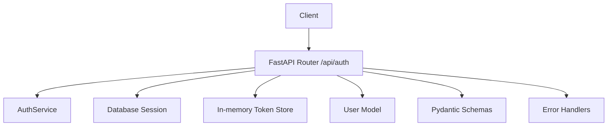
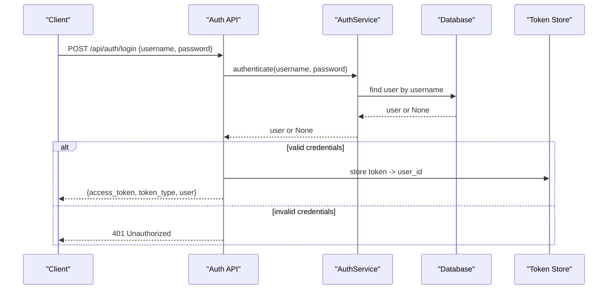
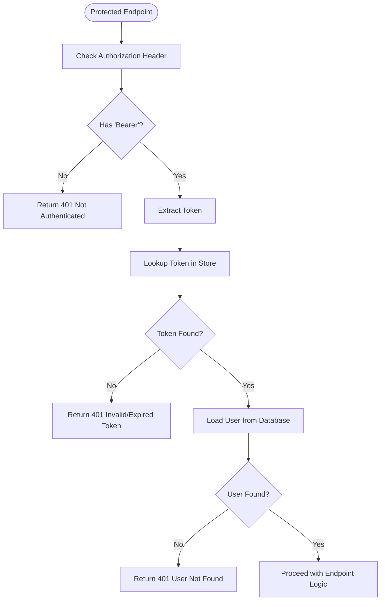
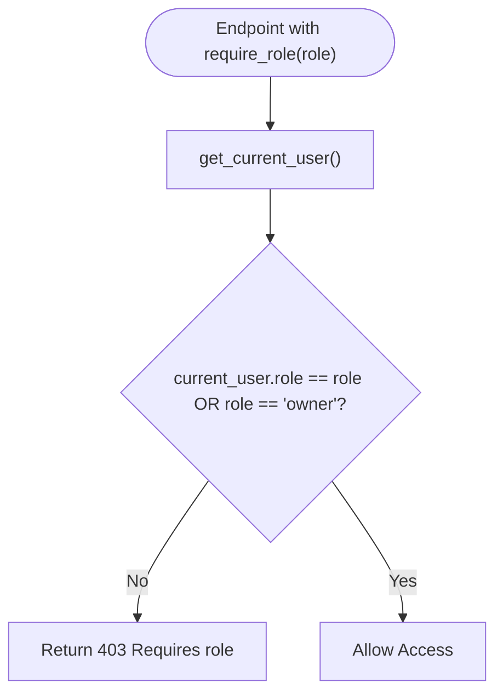
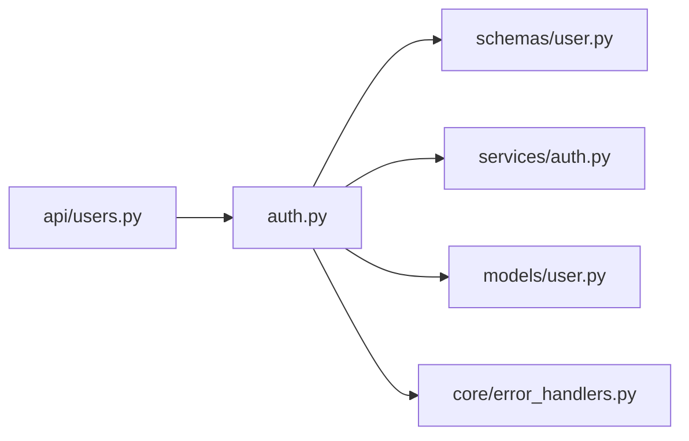

# Authentication API

<cite>
**Referenced Files in This Document**
- [auth.py](file://backend/app/api/auth.py)
- [user.py (schemas)](file://backend/app/schemas/user.py)
- [auth_service.py](file://backend/app/services/auth.py)
- [user_model.py](file://backend/app/models/user.py)
- [error_handlers.py](file://backend/app/core/error_handlers.py)
- [users_api.py](file://backend/app/api/users.py)
- [test_auth.py](file://backend/test_auth.py)
</cite>

## Table of Contents
1. [Introduction](#introduction)
2. [Project Structure](#project-structure)
3. [Core Components](#core-components)
4. [Architecture Overview](#architecture-overview)
5. [Detailed Component Analysis](#detailed-component-analysis)
6. [Dependency Analysis](#dependency-analysis)
7. [Performance Considerations](#performance-considerations)
8. [Troubleshooting Guide](#troubleshooting-guide)
9. [Conclusion](#conclusion)
10. [Appendices](#appendices)

## Introduction
This document provides detailed API documentation for the authentication endpoints and related security mechanisms. It covers user registration, login, logout, Bearer token-based authentication flow, role-based access control, error handling patterns, token storage, security considerations, and client integration patterns.

## Project Structure
The authentication feature is implemented across several modules:
- API layer defines routes for register, login, logout, and reusable dependencies for current user and role checks.
- Schemas define request/response models for users and tokens.
- Services encapsulate password hashing, verification, user creation, and authentication logic.
- Models define the database schema for users.
- Error handlers standardize error responses.
- Example tests demonstrate usage of the auth endpoints.

**Diagram sources**
- [auth.py:1-89](file://backend/app/api/auth.py#L1-L89)
- [auth_service.py:1-53](file://backend/app/services/auth.py#L1-L53)
- [user_model.py:1-16](file://backend/app/models/user.py#L1-L16)
- [user.py (schemas):1-30](file://backend/app/schemas/user.py#L1-L30)
- [error_handlers.py:1-44](file://backend/app/core/error_handlers.py#L1-L44)

**Section sources**
- [auth.py:1-89](file://backend/app/api/auth.py#L1-L89)
- [user.py (schemas):1-30](file://backend/app/schemas/user.py#L1-L30)
- [auth_service.py:1-53](file://backend/app/services/auth.py#L1-L53)
- [user_model.py:1-16](file://backend/app/models/user.py#L1-L16)
- [error_handlers.py:1-44](file://backend/app/core/error_handlers.py#L1-L44)

## Core Components
- Endpoints:
  - POST /api/auth/register: Creates a new user with validated input and returns user details.
  - POST /api/auth/login: Authenticates credentials and returns an access token along with user info.
  - POST /api/auth/logout: Invalidates the provided Bearer token.
- Dependencies:
  - get_current_user: Validates Bearer token and resolves the current authenticated user from the token store and database.
  - require_role: A dependency factory that enforces role-based access on protected endpoints.
- Schemas:
  - UserCreate: Request body for registration including username, email, password, and optional role.
  - UserLogin: Request body for login with username and password.
  - UserResponse: Response model for user data.
  - Token: Response model containing access_token, token_type, and user object.
- Service:
  - AuthService: Handles password hashing/verification, user creation, and authentication.

**Section sources**
- [auth.py:15-89](file://backend/app/api/auth.py#L15-L89)
- [user.py (schemas):5-30](file://backend/app/schemas/user.py#L5-L30)
- [auth_service.py:8-53](file://backend/app/services/auth.py#L8-L53)

## Architecture Overview
Authentication uses a simple in-memory token store to map tokens to user IDs. Clients authenticate via username/password, receive a token, and include it as a Bearer token in subsequent requests. Protected endpoints use get_current_user to validate the token and resolve the user. Role-based protection is achieved using require_role.

**Diagram sources**
- [auth.py:37-52](file://backend/app/api/auth.py#L37-L52)
- [auth_service.py:40-53](file://backend/app/services/auth.py#L40-L53)

**Section sources**
- [auth.py:37-61](file://backend/app/api/auth.py#L37-L61)
- [auth_service.py:40-53](file://backend/app/services/auth.py#L40-L53)

## Detailed Component Analysis

### Register Endpoint: POST /api/auth/register
- Purpose: Create a new user account.
- Request:
  - Body: UserCreate schema fields: username, email, password, role (optional).
  - Validation: Email format enforced; unique constraints checked against existing users.
- Response:
  - UserResponse with id, is_active, created_at, last_login, etc.
- Behavior:
  - Checks for duplicate username/email.
  - Uses AuthService.create_user to hash password and persist user.
- Errors:
  - 400 if username or email already exists.
  - 422 for validation errors.

Example request:
- Method: POST
- URL: /api/auth/register
- Body: {"username": "alice", "email": "alice@example.com", "password": "securepass", "role": "viewer"}

Example response:
- Status: 200 OK
- Body: UserResponse object with user details.

**Section sources**
- [auth.py:15-35](file://backend/app/api/auth.py#L15-L35)
- [user.py (schemas):5-13](file://backend/app/schemas/user.py#L5-L13)
- [auth_service.py:25-38](file://backend/app/services/auth.py#L25-L38)

### Login Endpoint: POST /api/auth/login
- Purpose: Authenticate a user and issue an access token.
- Request:
  - Body: UserLogin schema fields: username, password.
- Response:
  - Token schema: access_token, token_type ("bearer"), user (UserResponse).
- Behavior:
  - Authenticates via AuthService.authenticate.
  - Generates a secure random token and stores mapping token -> user_id.
  - Returns token and user info.
- Errors:
  - 401 if credentials are invalid.
  - 422 for validation errors.

Example request:
- Method: POST
- URL: /api/auth/login
- Body: {"username": "alice", "password": "securepass"}

Example response:
- Status: 200 OK
- Body: {"access_token": "...", "token_type": "bearer", "user": {...}}

**Section sources**
- [auth.py:37-52](file://backend/app/api/auth.py#L37-L52)
- [user.py (schemas):14-30](file://backend/app/schemas/user.py#L14-L30)
- [auth_service.py:40-53](file://backend/app/services/auth.py#L40-L53)

### Logout Endpoint: POST /api/auth/logout
- Purpose: Invalidate the current session by removing the token from the active token store.
- Request:
  - Header: Authorization: Bearer <token>.
- Response:
  - Success message indicating logout.
- Behavior:
  - Extracts token from Authorization header and removes it from the in-memory store.
- Errors:
  - No explicit error; safe to call even without a token.

Example request:
- Method: POST
- URL: /api/auth/logout
- Header: Authorization: Bearer <token>

Example response:
- Status: 200 OK
- Body: {"message": "Logged out successfully"}

**Section sources**
- [auth.py:54-61](file://backend/app/api/auth.py#L54-L61)

### Authentication Flow with Bearer Tokens
- Clients obtain a token via login.
- Subsequent requests must include Authorization: Bearer <token>.
- Protected endpoints use get_current_user to validate the token and retrieve the user.
- If token is missing, malformed, or not found in the store, a 401 error is returned.

**Diagram sources**
- [auth.py:63-81](file://backend/app/api/auth.py#L63-L81)

**Section sources**
- [auth.py:63-81](file://backend/app/api/auth.py#L63-L81)

### Role-Based Access Control: require_role Decorator
- Purpose: Enforce that only users with a specific role can access an endpoint.
- Usage:
  - Apply as a FastAPI dependency: Depends(require_role("manager")) or similar.
- Behavior:
  - Calls get_current_user to ensure authentication.
  - Compares current_user.role against required role; allows "owner" as super-role.
  - Raises 403 Forbidden if unauthorized.
- Notes:
  - The decorator is a dependency factory returning a checker function that depends on get_current_user.

**Diagram sources**
- [auth.py:83-89](file://backend/app/api/auth.py#L83-L89)

**Section sources**
- [auth.py:83-89](file://backend/app/api/auth.py#L83-L89)

### get_current_user Dependency Function
- Purpose: Resolve the current authenticated user from the Bearer token.
- Input:
  - Authorization header with "Bearer <token>".
  - Database session.
- Output:
  - User object if token is valid and user exists.
- Errors:
  - 401 if no token, malformed token, token not found, or user not found.

**Section sources**
- [auth.py:63-81](file://backend/app/api/auth.py#L63-L81)

### Data Models and Schemas
- UserCreate:
  - Fields: username, email, password, role (default viewer).
- UserLogin:
  - Fields: username, password.
- UserResponse:
  - Fields: id, username, email, role, factory_id, is_active, created_at, last_login.
- Token:
  - Fields: access_token, token_type ("bearer"), user (UserResponse).

**Section sources**
- [user.py (schemas):5-30](file://backend/app/schemas/user.py#L5-L30)

### Password Hashing and Verification
- Implementation:
  - Passwords are hashed with SHA-256 and a random salt.
  - Stored as "salt:hash".
  - Verification recomputes hash with stored salt and compares.
- Security note:
  - For production, consider stronger algorithms (e.g., bcrypt) and dedicated libraries.

**Section sources**
- [auth_service.py:11-23](file://backend/app/services/auth.py#L11-L23)
- [auth_service.py:25-38](file://backend/app/services/auth.py#L25-L38)
- [auth_service.py:40-53](file://backend/app/services/auth.py#L40-L53)

### Database Model: User
- Fields:
  - id (primary key), username (unique), email (unique), password_hash, role (default "viewer"), factory_id (nullable), is_active (default True), created_at, last_login.

**Section sources**
- [user_model.py:1-16](file://backend/app/models/user.py#L1-L16)

### Example Tests
- Demonstrates registering a user and logging in with username vs email.
- Shows expected behavior differences when using email instead of username for login.

**Section sources**
- [test_auth.py:1-25](file://backend/test_auth.py#L1-L25)

## Dependency Analysis
The authentication module has clear separation of concerns:
- API layer depends on schemas, services, models, and core utilities.
- Services encapsulate business logic for authentication and password handling.
- Models represent persistent entities.
- Error handlers provide consistent error responses.

**Diagram sources**
- [auth.py:1-89](file://backend/app/api/auth.py#L1-L89)
- [users_api.py:1-109](file://backend/app/api/users.py#L1-L109)
- [user.py (schemas):1-30](file://backend/app/schemas/user.py#L1-L30)
- [auth_service.py:1-53](file://backend/app/services/auth.py#L1-L53)
- [user_model.py:1-16](file://backend/app/models/user.py#L1-L16)
- [error_handlers.py:1-44](file://backend/app/core/error_handlers.py#L1-L44)

**Section sources**
- [auth.py:1-89](file://backend/app/api/auth.py#L1-L89)
- [users_api.py:1-109](file://backend/app/api/users.py#L1-L109)

## Performance Considerations
- In-memory token store:
  - Pros: Simple and fast for development/testing.
  - Cons: Not suitable for production; tokens are lost on process restart and do not scale across processes.
- Recommendations:
  - Replace with a distributed cache (e.g., Redis) for token storage to support horizontal scaling and persistence.
  - Add token expiration and refresh mechanisms to improve security and reduce long-lived sessions.
  - Use rate limiting on login/register endpoints to mitigate brute-force attacks.
  - Consider asynchronous operations for high-throughput scenarios.

[No sources needed since this section provides general guidance]

## Troubleshooting Guide
Common issues and resolutions:
- 401 Not Authenticated:
  - Ensure Authorization header is present and formatted as "Bearer <token>".
  - Verify token was issued by login and still exists in the token store.
- 401 Invalid or Expired Token:
  - Token may have been removed via logout or expired if expiration is implemented.
  - Re-authenticate to obtain a new token.
- 401 User Not Found:
  - Token maps to a user ID that does not exist in the database.
  - Check database integrity and token store consistency.
- 403 Requires Role:
  - Current user lacks the required role; "owner" acts as a super-role.
  - Adjust user roles or endpoint requirements accordingly.
- 400 Username or Email Already Exists:
  - Registration failed due to duplicates; choose different username/email.
- 422 Validation Error:
  - Request body did not match schema; check field types and formats (e.g., email).

Global error handling:
- Validation errors return structured JSON with status, message, and errors.
- Database and generic errors return structured JSON with status, message, and optional detail in debug mode.

**Section sources**
- [auth.py:15-89](file://backend/app/api/auth.py#L15-L89)
- [error_handlers.py:11-44](file://backend/app/core/error_handlers.py#L11-L44)

## Conclusion
The authentication system provides a straightforward implementation for user registration, login, logout, and protected endpoints using Bearer tokens and role-based access control. While suitable for development and MVP, production deployments should adopt robust token storage, expiration, and stronger password hashing. Clients should handle token lifecycle and errors gracefully, ensuring secure integration patterns.

[No sources needed since this section summarizes without analyzing specific files]

## Appendices

### API Reference Summary
- POST /api/auth/register
  - Request: UserCreate
  - Response: UserResponse
  - Errors: 400 (duplicate), 422 (validation)
- POST /api/auth/login
  - Request: UserLogin
  - Response: Token
  - Errors: 401 (invalid credentials), 422 (validation)
- POST /api/auth/logout
  - Request: Authorization: Bearer <token>
  - Response: Success message
  - Errors: None (safe to call)

### Client Integration Patterns
- Obtain token via login and store securely (e.g., httpOnly cookies or secure storage).
- Include Authorization: Bearer <token> in all protected requests.
- Handle 401 by prompting re-login and refreshing token.
- Implement logout to invalidate server-side token.
- Respect role-based restrictions and display appropriate UI based on user role.

[No sources needed since this section provides general guidance]