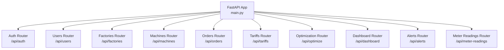
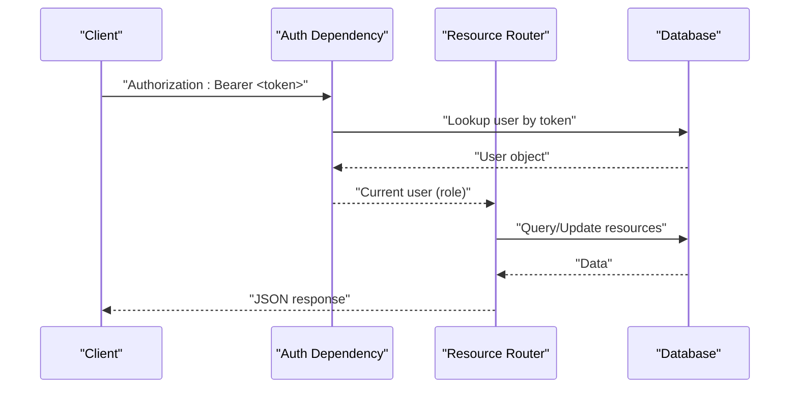
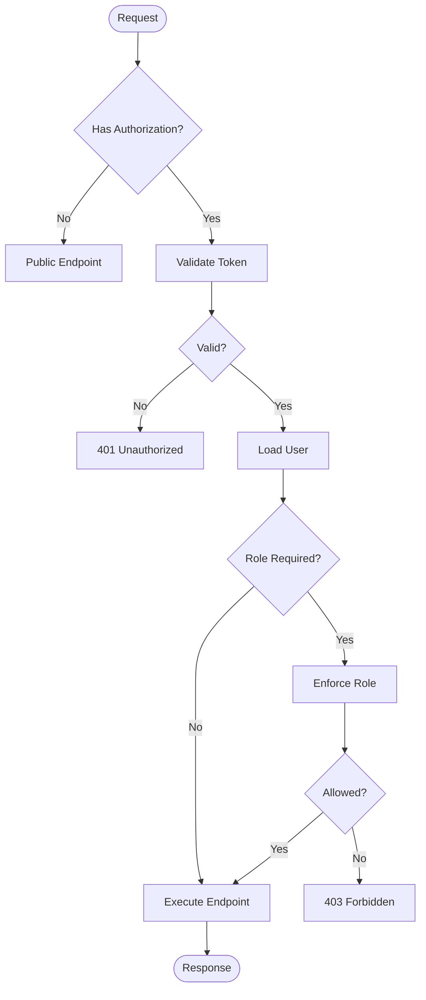
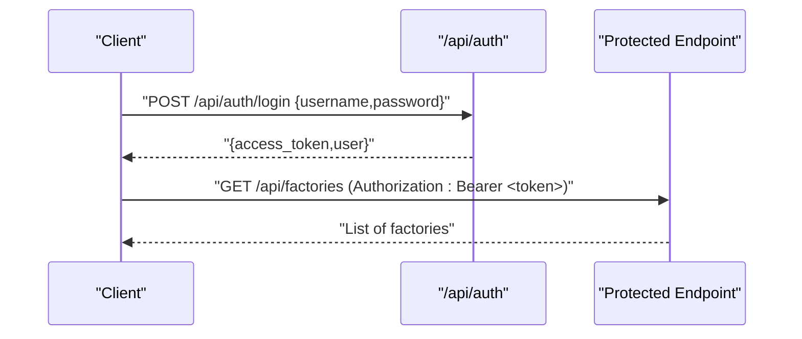

# Backend API Documentation

<cite>
**Referenced Files in This Document**
- [main.py](file://backend/main.py)
- [auth.py](file://backend/app/api/auth.py)
- [factory.py](file://backend/app/api/factory.py)
- [machine.py](file://backend/app/api/machine.py)
- [production_order.py](file://backend/app/api/production_order.py)
- [tariff.py](file://backend/app/api/tariff.py)
- [optimization.py](file://backend/app/api/optimization.py)
- [dashboard.py](file://backend/app/api/dashboard.py)
- [alert.py](file://backend/app/api/alert.py)
- [meter_reading.py](file://backend/app/api/meter_reading.py)
- [users.py](file://backend/app/api/users.py)
- [user.py](file://backend/app/schemas/user.py)
- [factory.py](file://backend/app/schemas/factory.py)
- [machine.py](file://backend/app/schemas/machine.py)
- [production_order.py](file://backend/app/schemas/production_order.py)
- [tariff.py](file://backend/app/schemas/tariff.py)
</cite>

## Table of Contents
1. [Introduction](#introduction)
2. [Project Structure](#project-structure)
3. [Core Components](#core-components)
4. [Architecture Overview](#architecture-overview)
5. [Detailed Component Analysis](#detailed-component-analysis)
6. [Dependency Analysis](#dependency-analysis)
7. [Performance Considerations](#performance-considerations)
8. [Troubleshooting Guide](#troubleshooting-guide)
9. [Conclusion](#conclusion)
10. [Appendices](#appendices)

## Introduction
This document provides comprehensive API documentation for TariffGuard’s backend REST API. It covers authentication, factory and machine management, production orders, tariffs, optimization endpoints, dashboard analytics, alerts, and meter readings. For each endpoint, you will find HTTP methods, URL patterns, request/response schemas, authentication requirements, role-based access controls, example payloads/responses, error handling patterns, and integration guidance.

## Project Structure
The FastAPI application registers routers for each feature area and mounts global middleware and exception handlers. The root application also exposes health and test endpoints and serves static assets.

**Diagram sources**
- [main.py:48-58](file://backend/main.py#L48-L58)

**Section sources**
- [main.py:19-58](file://backend/main.py#L19-L58)

## Core Components
- Authentication and authorization: token-based auth with in-memory active tokens, role checks via dependency.
- Resource routers: factories, machines, orders, tariffs, meter readings, alerts, users.
- Optimization: schedule generation and comparison using a service layer.
- Dashboard: aggregated metrics across entities.
- Schemas: Pydantic models defining request/response contracts.

Key behaviors:
- Auth endpoints return tokens; protected endpoints require Authorization: Bearer <token>.
- Role-based access: manager/owner required for write operations on factories, machines, orders, alerts; owner-only for deletions where specified.
- Public or read-only endpoints may not require authentication unless otherwise noted.

**Section sources**
- [auth.py:10-89](file://backend/app/api/auth.py#L10-L89)
- [factory.py:11-81](file://backend/app/api/factory.py#L11-L81)
- [machine.py:11-65](file://backend/app/api/machine.py#L11-L65)
- [production_order.py:11-66](file://backend/app/api/production_order.py#L11-L66)
- [tariff.py:10-90](file://backend/app/api/tariff.py#L10-L90)
- [optimization.py:9-48](file://backend/app/api/optimization.py#L9-L48)
- [dashboard.py:13-79](file://backend/app/api/dashboard.py#L13-L79)
- [alert.py:12-107](file://backend/app/api/alert.py#L12-L107)
- [meter_reading.py:12-141](file://backend/app/api/meter_reading.py#L12-L141)
- [users.py:12-109](file://backend/app/api/users.py#L12-L109)

## Architecture Overview
High-level flow for authenticated requests:
- Client sends request with Authorization header.
- get_current_user extracts token, validates against active_tokens, loads user from DB.
- require_role enforces role constraints.
- Endpoint logic executes and returns response.

**Diagram sources**
- [auth.py:63-89](file://backend/app/api/auth.py#L63-L89)

## Detailed Component Analysis

### Authentication
- Base path: /api/auth
- Endpoints:
  - POST /api/auth/register
    - Auth: None
    - Request: UserCreate schema
    - Response: UserResponse
    - Notes: Creates user; rejects duplicates
  - POST /api/auth/login
    - Auth: None
    - Request: UserLogin schema
    - Response: Token (access_token + user)
    - Notes: Returns bearer token stored in memory
  - POST /api/auth/logout
    - Auth: Requires Authorization header
    - Request: None
    - Response: Message
    - Notes: Removes token from active set

Role-based access:
- Protected endpoints use get_current_user and require_role dependencies.

Error handling:
- 400 for duplicate registration
- 401 for invalid credentials or missing/invalid token
- 403 when role is insufficient

Example request/response schemas:
- UserCreate: username, email, password, optional role and factory_id
- UserLogin: username, password
- Token: access_token, token_type, user

**Section sources**
- [auth.py:15-61](file://backend/app/api/auth.py#L15-L61)
- [user.py:5-30](file://backend/app/schemas/user.py#L5-L30)

### Factory Management
- Base path: /api/factories
- Endpoints:
  - POST /api/factories
    - Auth: Manager or Owner
    - Request: FactoryCreate
    - Response: FactoryResponse
  - GET /api/factories
    - Auth: Any authenticated user
    - Query: skip, limit
    - Response: List[FactoryResponse]
  - GET /api/factories/{factory_id}
    - Auth: Any authenticated user
    - Response: FactoryResponse
  - PUT /api/factories/{factory_id}
    - Auth: Manager or Owner
    - Request: FactoryUpdate (partial fields allowed)
    - Response: FactoryResponse
  - DELETE /api/factories/{factory_id}
    - Auth: Owner only
    - Response: Success message

Notes:
- Pagination supported via skip/limit on list.
- Partial updates supported via exclude_unset behavior.

**Section sources**
- [factory.py:13-81](file://backend/app/api/factory.py#L13-L81)
- [factory.py:1-31](file://backend/app/schemas/factory.py#L1-L31)

### Machine Management
- Base path: /api/machines
- Endpoints:
  - POST /api/machines
    - Auth: Manager or Owner
    - Request: MachineCreate (includes factory_id)
    - Response: MachineResponse
  - GET /api/machines
    - Auth: Any authenticated user
    - Query: factory_id (optional), skip, limit
    - Response: List[MachineResponse]
  - GET /api/machines/{machine_id}
    - Auth: Any authenticated user
    - Response: MachineResponse
  - DELETE /api/machines/{machine_id}
    - Auth: Manager or Owner
    - Response: Success message

Notes:
- Filtering by factory_id supported on list.

**Section sources**
- [machine.py:13-65](file://backend/app/api/machine.py#L13-L65)
- [machine.py:1-26](file://backend/app/schemas/machine.py#L1-L26)

### Production Order Management
- Base path: /api/orders
- Endpoints:
  - POST /api/orders
    - Auth: Manager or Owner
    - Request: ProductionOrderCreate (includes factory_id)
    - Response: ProductionOrderResponse
  - GET /api/orders
    - Auth: Any authenticated user
    - Query: factory_id (optional), status (optional)
    - Response: List[ProductionOrderResponse]
  - GET /api/orders/{order_id}
    - Auth: Any authenticated user
    - Response: ProductionOrderResponse
  - DELETE /api/orders/{order_id}
    - Auth: Manager or Owner
    - Response: Success message

Notes:
- Status filtering supported on list.

**Section sources**
- [production_order.py:13-66](file://backend/app/api/production_order.py#L13-L66)
- [production_order.py:1-26](file://backend/app/schemas/production_order.py#L1-L26)

### Tariff Management
- Base path: /api/tariffs
- Endpoints:
  - POST /api/tariffs
    - Auth: None (public create)
    - Request: TariffCreate
    - Response: TariffResponse
  - GET /api/tariffs
    - Auth: None
    - Query: category (optional), active_only (bool), skip, limit
    - Response: List[TariffResponse]
  - GET /api/tariffs/{tariff_id}
    - Auth: None
    - Response: TariffResponse
  - PUT /api/tariffs/{tariff_id}
    - Auth: None
    - Request: TariffUpdate (partial fields allowed)
    - Response: TariffResponse
  - DELETE /api/tariffs/{tariff_id}
    - Auth: None
    - Response: Success message
  - GET /api/tariffs/active/{category}
    - Auth: None
    - Response: TariffResponse (currently active for category)

Notes:
- Active tariff lookup uses effective date ranges.

**Section sources**
- [tariff.py:12-90](file://backend/app/api/tariff.py#L12-L90)
- [tariff.py:1-35](file://backend/app/schemas/tariff.py#L1-L35)

### Optimization Endpoints
- Base path: /api/optimize
- Endpoints:
  - POST /api/optimize/schedule/{factory_id}
    - Auth: None (unless extended later)
    - Query: start_time (datetime, optional), end_time (datetime, optional)
    - Behavior: Defaults to next 24 hours if not provided
    - Response: Optimized schedule result
  - POST /api/optimize/compare/{factory_id}
    - Auth: None (unless extended later)
    - Query: start_time, end_time (same defaults)
    - Response: Comparison between baseline and optimized schedules

Notes:
- Uses ScheduleOptimizer service to compute results.

**Section sources**
- [optimization.py:11-48](file://backend/app/api/optimization.py#L11-L48)

### Dashboard Endpoints
- Base path: /api/dashboard
- Endpoints:
  - GET /api/dashboard/summary
    - Auth: None
    - Response: Totals and order status breakdown
  - GET /api/dashboard/factory/{factory_id}
    - Auth: None
    - Response: Factory details, counts, energy stats

Notes:
- Aggregates data from factories, machines, orders, tariffs, meter readings.

**Section sources**
- [dashboard.py:15-79](file://backend/app/api/dashboard.py#L15-L79)

### Alert Management
- Base path: /api/alerts
- Endpoints:
  - GET /api/alerts
    - Auth: Any authenticated user
    - Query: factory_id (optional), severity (optional), is_resolved (optional), limit
    - Response: List[AlertResponse]
  - POST /api/alerts/generate/{factory_id}
    - Auth: Manager or Owner
    - Response: List[AlertResponse]
  - GET /api/alerts/unresolved/{factory_id}
    - Auth: Any authenticated user
    - Response: List[AlertResponse]
  - PUT /api/alerts/{alert_id}
    - Auth: Manager or Owner
    - Request: AlertUpdate (partial fields allowed)
    - Response: AlertResponse
  - GET /api/alerts/stats/{factory_id}
    - Auth: Any authenticated user
    - Response: Stats (total, unresolved, critical, resolved)

Notes:
- Updating alert to resolved sets resolved_at timestamp automatically.

**Section sources**
- [alert.py:14-107](file://backend/app/api/alert.py#L14-L107)

### Meter Reading Endpoints
- Base path: /api/meter-readings
- Endpoints:
  - POST /api/meter-readings
    - Auth: None
    - Request: MeterReadingCreate
    - Response: MeterReadingResponse
  - POST /api/meter-readings/bulk
    - Auth: None
    - Request: MeterReadingBulkCreate (list of readings with shared factory_id)
    - Response: List[MeterReadingResponse]
  - POST /api/meter-readings/import-csv
    - Auth: None
    - Request: multipart/form-data with file (CSV) and factory_id query param
    - Response: Import summary with count
  - GET /api/meter-readings
    - Auth: None
    - Query: factory_id (optional), start_date (datetime, optional), end_date (datetime, optional), skip, limit
    - Response: List[MeterReadingResponse]
  - GET /api/meter-readings/stats/{factory_id}
    - Auth: None
    - Response: Aggregated stats (totals, averages, peaks)

Notes:
- CSV import requires columns: timestamp, kwh; optional kw, solar_kwh, voltage, current, power_factor.

**Section sources**
- [meter_reading.py:14-141](file://backend/app/api/meter_reading.py#L14-L141)

### Users Management
- Base path: /api/users
- Endpoints:
  - GET /api/users
    - Auth: Owner or Manager
    - Query: factory_id (optional)
    - Response: List[UserResponse]
  - POST /api/users/invite
    - Auth: Owner or Manager
    - Request: UserCreate (password included)
    - Response: UserResponse
  - DELETE /api/users/{user_id}
    - Auth: Owner or Manager
    - Response: Success message
  - PUT /api/users/{user_id}/role
    - Auth: Owner only
    - Request: { role }
    - Response: Updated UserResponse

Notes:
- Managers cannot create or delete owners; owners can update roles.

**Section sources**
- [users.py:17-109](file://backend/app/api/users.py#L17-L109)
- [user.py:5-30](file://backend/app/schemas/user.py#L5-L30)

## Dependency Analysis
- Global app wiring:
  - Routers are included in main application.
  - CORS middleware allows cross-origin requests.
  - Exception handlers centralize validation and database errors.
- Auth dependency chain:
  - get_current_user reads Authorization header, validates token, fetches user.
  - require_role enforces role constraints.

**Diagram sources**
- [auth.py:63-89](file://backend/app/api/auth.py#L63-L89)
- [main.py:36-58](file://backend/main.py#L36-L58)

**Section sources**
- [main.py:36-58](file://backend/main.py#L36-L58)
- [auth.py:63-89](file://backend/app/api/auth.py#L63-L89)

## Performance Considerations
- Use pagination (skip/limit) on list endpoints to avoid large payloads.
- Filter queries by factory_id, status, or date ranges to reduce dataset size.
- Bulk imports for meter readings improve throughput over single inserts.
- Avoid unnecessary joins; rely on aggregated queries for dashboard and stats endpoints.
- Consider caching frequently accessed data (e.g., active tariffs) at the application layer if needed.

## Troubleshooting Guide
Common errors and causes:
- 400 Bad Request: Duplicate username/email during registration or invite; invalid CSV columns; self-deletion attempts; managers attempting to create/delete owners.
- 401 Unauthorized: Missing or malformed Authorization header; invalid or expired token; wrong credentials on login.
- 403 Forbidden: Insufficient role for the requested operation.
- 404 Not Found: Resource not found (factory, machine, order, tariff, alert, user).
- 500 Internal Server Error: Unexpected server-side exceptions (e.g., CSV import failures).

Integration tips:
- Always include Authorization: Bearer <token> for protected endpoints.
- Handle 401 by refreshing or re-authenticating.
- Validate inputs client-side to reduce 400 errors.
- For bulk operations, ensure payload structure matches schemas.

**Section sources**
- [auth.py:15-61](file://backend/app/api/auth.py#L15-L61)
- [users.py:33-109](file://backend/app/api/users.py#L33-L109)
- [meter_reading.py:41-88](file://backend/app/api/meter_reading.py#L41-L88)

## Conclusion
TariffGuard’s backend provides a well-structured REST API covering core operational domains: authentication, resource management, optimization, analytics, alerts, and metering. Role-based access control protects sensitive operations, while public endpoints enable flexible integrations. Use the documented schemas and endpoints to build robust clients and automate workflows.

## Appendices

### Authentication Flow Example

**Diagram sources**
- [auth.py:37-52](file://backend/app/api/auth.py#L37-L52)
- [factory.py:26-35](file://backend/app/api/factory.py#L26-L35)

### Request/Response Schema References
- User schemas: [user.py:5-30](file://backend/app/schemas/user.py#L5-L30)
- Factory schemas: [factory.py:1-31](file://backend/app/schemas/factory.py#L1-L31)
- Machine schemas: [machine.py:1-26](file://backend/app/schemas/machine.py#L1-L26)
- Production order schemas: [production_order.py:1-26](file://backend/app/schemas/production_order.py#L1-L26)
- Tariff schemas: [tariff.py:1-35](file://backend/app/schemas/tariff.py#L1-L35)