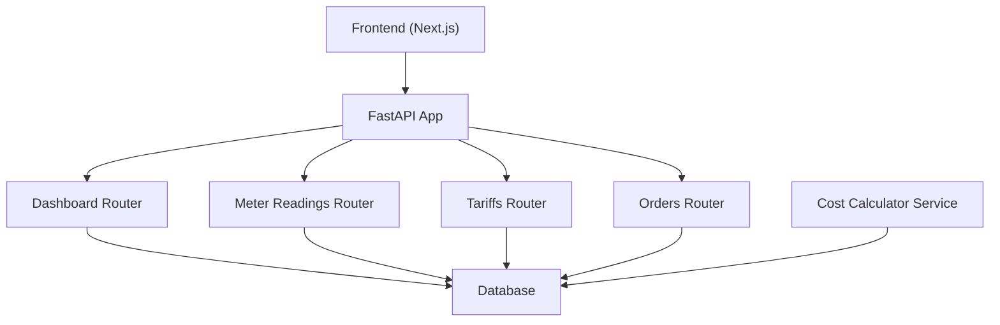
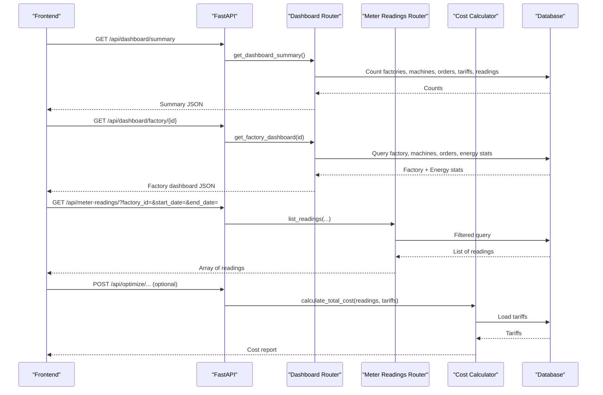
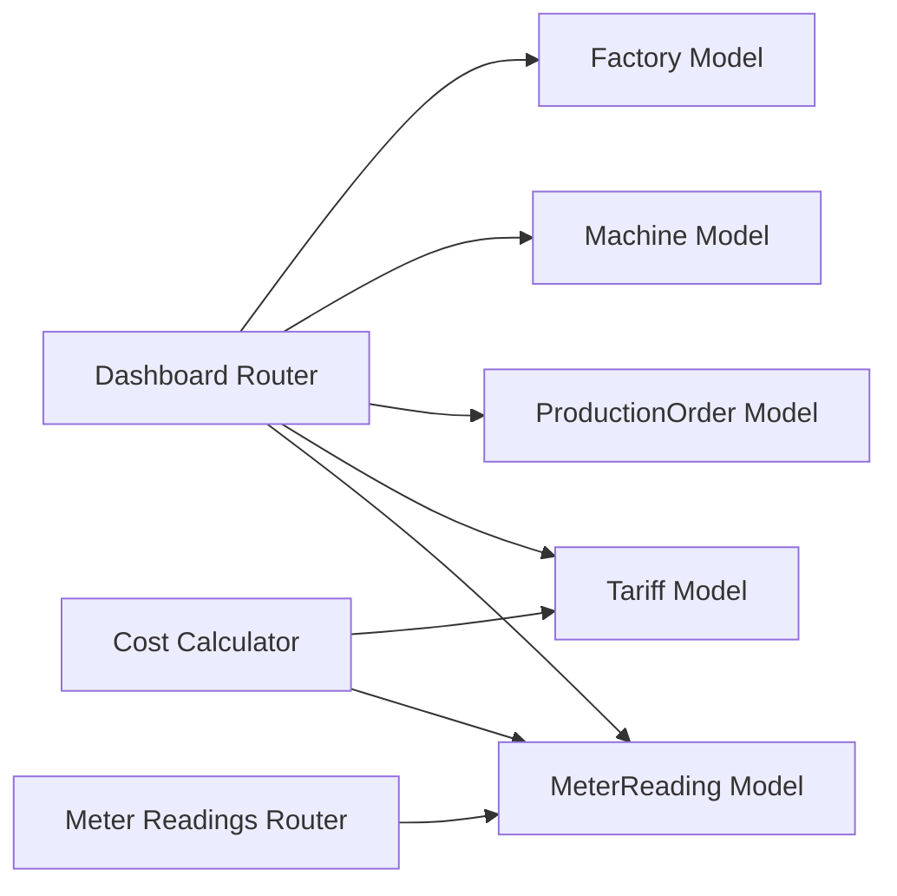

# Dashboard API

<cite>
**Referenced Files in This Document**
- [main.py](file://backend/main.py)
- [dashboard.py](file://backend/app/api/dashboard.py)
- [meter_reading.py](file://backend/app/api/meter_reading.py)
- [cost_calculator.py](file://backend/app/services/cost_calculator.py)
- [meter_reading_model.py](file://backend/app/models/meter_reading.py)
- [meter_reading_schema.py](file://backend/app/schemas/meter_reading.py)
- [production_order_model.py](file://backend/app/models/production_order.py)
- [factory_model.py](file://backend/app/models/factory.py)
- [machine_model.py](file://backend/app/models/machine.py)
- [tariff_model.py](file://backend/app/models/tariff.py)
- [API.md](file://docs/API.md)
- [dashboard_page.tsx](file://frontend/app/dashboard/page.tsx)
- [energy_consumption_chart.tsx](file://frontend/components/charts/energy_consumption_chart.tsx)
</cite>

## Table of Contents
1. Introduction
2. Project Structure
3. Core Components
4. Architecture Overview
5. Detailed Component Analysis
6. Dependency Analysis
7. Performance Considerations
8. Troubleshooting Guide
9. Conclusion
10. Appendices

## Introduction
This document provides detailed API documentation for the dashboard analytics endpoints, focusing on KPI visualization data, energy consumption patterns, cost analysis reports, and summary statistics. It specifies HTTP methods for retrieving dashboard metrics, generating reports, and accessing aggregated data. It also includes request/response schemas, examples of KPI structures, chart data formats, real-time update strategies, caching recommendations, and integration points with meter readings, production data, and cost calculations.

## Project Structure
The backend exposes FastAPI routers for dashboard, meter readings, tariffs, production orders, and more. The dashboard router aggregates counts and energy stats across factories, machines, orders, tariffs, and meter readings. Meter reading endpoints support CRUD, bulk import, filtering, and statistics. A cost calculation service computes energy costs based on tariff periods and consumption. The frontend consumes these APIs to render KPIs and charts.

**Diagram sources**
- [main.py:48-58](file://backend/main.py#L48-L58)
- [dashboard.py:13-79](file://backend/app/api/dashboard.py#L13-L79)
- [meter_reading.py:12-141](file://backend/app/api/meter_reading.py#L12-L141)
- [cost_calculator.py:12-110](file://backend/app/services/cost_calculator.py#L12-L110)

**Section sources**
- [main.py:48-58](file://backend/main.py#L48-L58)
- [API.md:55-59](file://docs/API.md#L55-L59)

## Core Components
- Dashboard Summary: Aggregates totals for factories, machines, orders, tariffs, and meter readings; includes order status breakdown.
- Factory Dashboard: Returns factory details, machine/order counts, and energy stats (total kWh, peak kW, solar kWh).
- Meter Readings: Create single/bulk readings, import CSV, list with filters, and compute statistics per factory.
- Cost Calculation: Computes slot-level and total costs using tariff rates and meter readings; supports machine cost estimation.

Key models and schemas:
- MeterReading model defines fields like timestamp, kwh, kw, solar_kwh, voltage, current, power_factor.
- MeterReading schemas define create, response, and bulk create payloads.
- ProductionOrder, Factory, Machine, Tariff models provide context for dashboard aggregation and cost calculations.

**Section sources**
- [dashboard.py:15-79](file://backend/app/api/dashboard.py#L15-L79)
- [meter_reading.py:14-141](file://backend/app/api/meter_reading.py#L14-L141)
- [cost_calculator.py:15-110](file://backend/app/services/cost_calculator.py#L15-L110)
- [meter_reading_model.py:5-17](file://backend/app/models/meter_reading.py#L5-L17)
- [meter_reading_schema.py:5-27](file://backend/app/schemas/meter_reading.py#L5-L27)
- [production_order_model.py:5-20](file://backend/app/models/production_order.py#L5-L20)
- [factory_model.py:5-17](file://backend/app/models/factory.py#L5-L17)
- [machine_model.py:5-20](file://backend/app/models/machine.py#L5-L20)
- [tariff_model.py:5-19](file://backend/app/models/tariff.py#L5-L19)

## Architecture Overview
The dashboard endpoints aggregate data from multiple models and expose concise summaries for UI rendering. Meter readings feed energy profiles and cost computations. Tariffs determine time-based pricing. Production orders contribute operational KPIs.

**Diagram sources**
- [dashboard.py:15-79](file://backend/app/api/dashboard.py#L15-L79)
- [meter_reading.py:90-141](file://backend/app/api/meter_reading.py#L90-L141)
- [cost_calculator.py:52-90](file://backend/app/services/cost_calculator.py#L52-L90)
- [main.py:48-58](file://backend/main.py#L48-L58)

## Detailed Component Analysis

### Dashboard Endpoints
- GET /api/dashboard/summary
  - Purpose: Overall dashboard summary including totals and order status breakdown.
  - Response schema:
    - totals: object with keys factories, machines, orders, tariffs, meter_readings (numbers)
    - order_status: object with keys pending, running, completed (numbers)
  - Example usage: Frontend calls this endpoint to populate top-level KPIs and order compliance metrics.

- GET /api/dashboard/factory/{factory_id}
  - Purpose: Factory-specific dashboard with counts and energy stats.
  - Path parameter: factory_id (integer)
  - Response schema:
    - factory: object with id, name, location, sanctioned_load_kw, solar_capacity_kw
    - counts: object with machines, orders (numbers)
    - energy: object with total_kwh, peak_kw, total_solar_kwh (numbers)
  - Error handling: Returns 404 if factory not found.

- Integration notes:
  - Uses Factory, Machine, ProductionOrder, Tariff, and MeterReading models for aggregation.
  - Energy stats are computed via SQL aggregations over MeterReading filtered by factory_id.

**Section sources**
- [dashboard.py:15-79](file://backend/app/api/dashboard.py#L15-L79)
- [factory_model.py:5-17](file://backend/app/models/factory.py#L5-L17)
- [machine_model.py:5-20](file://backend/app/models/machine.py#L5-L20)
- [production_order_model.py:5-20](file://backend/app/models/production_order.py#L5-L20)
- [meter_reading_model.py:5-17](file://backend/app/models/meter_reading.py#L5-L17)

### Meter Readings Endpoints
- POST /api/meter-readings/
  - Purpose: Create a single meter reading.
  - Request schema: MeterReadingCreate
    - Required: timestamp (datetime), kwh (float)
    - Optional: kw (float), solar_kwh (float), voltage (float), current (float), power_factor (float)
    - Must include factory_id at payload level (see schema definition)
  - Response: MeterReadingResponse with id, factory_id, created_at, and base fields.

- POST /api/meter-readings/bulk
  - Purpose: Create multiple meter readings at once.
  - Request schema: MeterReadingBulkCreate
    - factory_id (int)
    - readings (array of MeterReadingBase)
  - Response: Array of MeterReadingResponse.

- POST /api/meter-readings/import-csv
  - Purpose: Import meter readings from CSV file.
  - Parameters:
    - factory_id (int)
    - file (multipart/form-data)
  - Behavior: Parses CSV, validates required columns (timestamp, kwh), converts timestamps, creates records, commits transaction.
  - Response: { message, count }

- GET /api/meter-readings/
  - Purpose: List meter readings with filters and pagination.
  - Query parameters:
    - factory_id (int, optional)
    - start_date (datetime, optional)
    - end_date (datetime, optional)
    - skip (int, default 0)
    - limit (int, default 1000)
  - Response: Array of MeterReadingResponse ordered by timestamp descending.

- GET /api/meter-readings/stats/{factory_id}
  - Purpose: Get statistics for meter readings of a factory.
  - Response schema:
    - total_readings (int)
    - total_kwh (float)
    - avg_kwh (float)
    - peak_kw (float)
    - total_solar_kwh (float)

**Section sources**
- [meter_reading.py:14-141](file://backend/app/api/meter_reading.py#L14-L141)
- [meter_reading_schema.py:5-27](file://backend/app/schemas/meter_reading.py#L5-L27)
- [meter_reading_model.py:5-17](file://backend/app/models/meter_reading.py#L5-L17)

### Cost Analysis Reports
- Service: CostCalculator
  - Methods:
    - get_tariff_rate(tariffs, timestamp): Determines applicable rate based on tariff period windows, including overnight ranges.
    - calculate_slot_cost(kwh, timestamp, tariffs): Returns slot-level cost info with timestamp, kwh, rate, cost.
    - calculate_total_cost(readings, tariffs): Aggregates total kWh, grid kWh, solar kWh, peak kW, total cost, average rate, and slot_costs array.
    - estimate_machine_cost(power_kw, duration_hours, start_time, tariffs): Estimates cost for running a machine for a specified duration.

- Usage:
  - Integrate with meter readings and tariffs to produce cost reports for dashboards or scheduled jobs.
  - Supports both historical analysis and planning estimations.

**Section sources**
- [cost_calculator.py:15-110](file://backend/app/services/cost_calculator.py#L15-L110)
- [tariff_model.py:5-19](file://backend/app/models/tariff.py#L5-L19)
- [meter_reading_model.py:5-17](file://backend/app/models/meter_reading.py#L5-L17)

### KPI Visualization Data and Chart Formats
- KPIs derived from dashboard responses:
  - Daily energy cost: Derived from factory energy total_kwh multiplied by an estimated rate (e.g., 35 PKR/kWh).
  - Peak demand kW: From factory energy peak_kw.
  - Solar utilization: Computed as ratio of solar_kwh to total generation (total_kwh + solar_kwh).
  - Orders on time: Ratio of completed orders to total orders (completed + running + pending).

- Chart data format:
  - EnergyConsumptionChart expects an array of objects with:
    - time (string, formatted time label)
    - grid_kw (number)
    - solar_kw (number)
  - Frontend maps meter readings to this format for visualization.

**Section sources**
- [dashboard_page.tsx:16-88](file://frontend/app/dashboard/page.tsx#L16-L88)
- [energy_consumption_chart.tsx:5-65](file://frontend/components/charts/energy_consumption_chart.tsx#L5-L65)
- [dashboard.py:44-79](file://backend/app/api/dashboard.py#L44-L79)
- [meter_reading.py:90-111](file://backend/app/api/meter_reading.py#L90-L111)

## Dependency Analysis
The dashboard endpoints depend on multiple models and services:
- Dashboard depends on Factory, Machine, ProductionOrder, Tariff, and MeterReading models for aggregation.
- Meter readings endpoints depend on MeterReading model and schemas for validation and persistence.
- Cost calculator depends on Tariff and MeterReading models to compute costs.

**Diagram sources**
- [dashboard.py:15-79](file://backend/app/api/dashboard.py#L15-L79)
- [meter_reading.py:90-141](file://backend/app/api/meter_reading.py#L90-L141)
- [cost_calculator.py:52-90](file://backend/app/services/cost_calculator.py#L52-L90)
- [factory_model.py:5-17](file://backend/app/models/factory.py#L5-L17)
- [machine_model.py:5-20](file://backend/app/models/machine.py#L5-L20)
- [production_order_model.py:5-20](file://backend/app/models/production_order.py#L5-L20)
- [tariff_model.py:5-19](file://backend/app/models/tariff.py#L5-L19)
- [meter_reading_model.py:5-17](file://backend/app/models/meter_reading.py#L5-L17)

**Section sources**
- [dashboard.py:15-79](file://backend/app/api/dashboard.py#L15-L79)
- [meter_reading.py:90-141](file://backend/app/api/meter_reading.py#L90-L141)
- [cost_calculator.py:52-90](file://backend/app/services/cost_calculator.py#L52-L90)

## Performance Considerations
- Aggregation queries: Use SQL functions (sum, max, count) directly in database queries to minimize data transfer and processing overhead.
- Pagination: Meter readings listing supports skip and limit to control payload size and improve responsiveness.
- Filtering: Apply date range and factory filters to reduce result sets.
- Cost computation: Batch process meter readings and tariffs to compute total costs efficiently; avoid per-request heavy loops when possible.
- Real-time updates: For live dashboards, consider polling intervals or WebSocket upgrades to push updated meter readings and alerts without full page reloads.
- Caching strategy:
  - Cache dashboard summary and factory stats for short TTLs (e.g., 30–60 seconds) since they change infrequently.
  - Cache meter reading lists per factory/date ranges with appropriate invalidation on new imports.
  - Cache tariff lookups and cost calculations keyed by timestamp windows to reuse results.

[No sources needed since this section provides general guidance]

## Troubleshooting Guide
- Common errors:
  - Factory not found: GET /api/dashboard/factory/{id} returns 404 when factory does not exist.
  - Validation errors: Invalid request payloads trigger validation error handlers configured in the app.
  - Import failures: CSV import rolls back on exceptions and returns a 500 error with details.

- Debugging tips:
  - Verify required fields in meter reading payloads (timestamp, kwh).
  - Ensure correct factory_id is passed for scoped queries.
  - Check tariff definitions for valid time windows to ensure accurate cost calculations.

**Section sources**
- [dashboard.py:44-50](file://backend/app/api/dashboard.py#L44-L50)
- [meter_reading.py:41-88](file://backend/app/api/meter_reading.py#L41-L88)
- [main.py:25-38](file://backend/main.py#L25-L38)

## Conclusion
The dashboard API provides essential endpoints for summarizing operational metrics, analyzing energy consumption, and computing costs based on tariffs. Integration with meter readings and production orders enables rich KPI visualizations and actionable insights. By applying pagination, filtering, and caching strategies, the system can deliver responsive dashboards suitable for real-time monitoring and reporting.

[No sources needed since this section summarizes without analyzing specific files]

## Appendices

### API Reference Tables

#### Dashboard
- GET /api/dashboard/summary
  - Response: { totals: { factories, machines, orders, tariffs, meter_readings }, order_status: { pending, running, completed } }

- GET /api/dashboard/factory/{factory_id}
  - Path param: factory_id (int)
  - Response: { factory: { id, name, location, sanctioned_load_kw, solar_capacity_kw }, counts: { machines, orders }, energy: { total_kwh, peak_kw, total_solar_kwh } }

#### Meter Readings
- POST /api/meter-readings/
  - Request: { factory_id, timestamp, kwh, kw?, solar_kwh?, voltage?, current?, power_factor? }
  - Response: { id, factory_id, timestamp, kwh, kw?, solar_kwh?, voltage?, current?, power_factor?, created_at }

- POST /api/meter-readings/bulk
  - Request: { factory_id, readings: [ { timestamp, kwh, kw?, solar_kwh?, voltage?, current?, power_factor? } ] }
  - Response: Array of MeterReadingResponse

- POST /api/meter-readings/import-csv
  - Parameters: factory_id (int), file (CSV)
  - Response: { message, count }

- GET /api/meter-readings/
  - Query params: factory_id?, start_date?, end_date?, skip=0, limit=1000
  - Response: Array of MeterReadingResponse

- GET /api/meter-readings/stats/{factory_id}
  - Response: { total_readings, total_kwh, avg_kwh, peak_kw, total_solar_kwh }

**Section sources**
- [dashboard.py:15-79](file://backend/app/api/dashboard.py#L15-L79)
- [meter_reading.py:14-141](file://backend/app/api/meter_reading.py#L14-L141)
- [meter_reading_schema.py:5-27](file://backend/app/schemas/meter_reading.py#L5-L27)
- [API.md:48-59](file://docs/API.md#L48-L59)

### Real-Time Updates and Caching Strategy
- Polling: Frontend periodically fetches /api/meter-readings/ with date filters to refresh charts.
- WebSockets: Consider upgrading to WebSocket channels for live meter readings and alerts to reduce latency.
- Caching:
  - In-memory cache for dashboard summary and factory stats with TTL.
  - Cache meter reading lists per factory/date window.
  - Cache tariff rate lookups by time windows to speed up cost calculations.

[No sources needed since this section provides general guidance]

### Integration Examples
- KPI derivation:
  - Daily cost = total_kwh * estimated rate (e.g., 35 PKR/kWh)
  - Peak demand = peak_kw
  - Solar utilization = solar_kwh / (total_kwh + solar_kwh)
  - Orders on time = completed / (completed + running + pending)

- Chart data mapping:
  - Map meter readings to { time, grid_kw, solar_kw } for EnergyConsumptionChart.

**Section sources**
- [dashboard_page.tsx:72-98](file://frontend/app/dashboard/page.tsx#L72-L98)
- [energy_consumption_chart.tsx:5-65](file://frontend/components/charts/energy_consumption_chart.tsx#L5-L65)
- [dashboard.py:44-79](file://backend/app/api/dashboard.py#L44-L79)
- [meter_reading.py:90-111](file://backend/app/api/meter_reading.py#L90-L111)