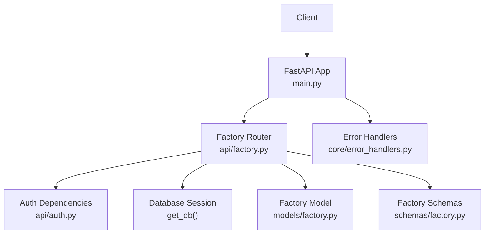
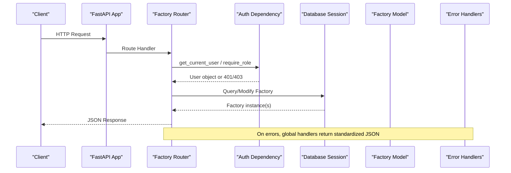
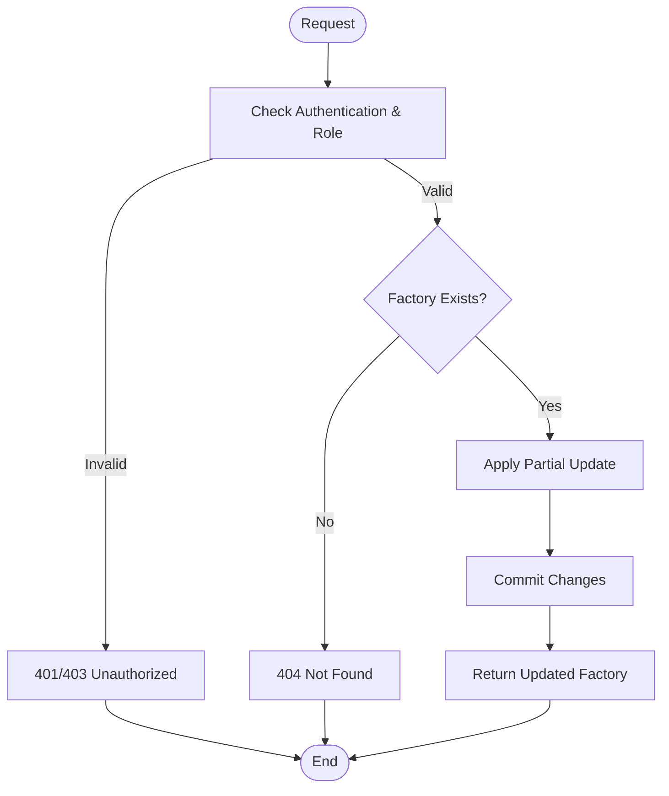
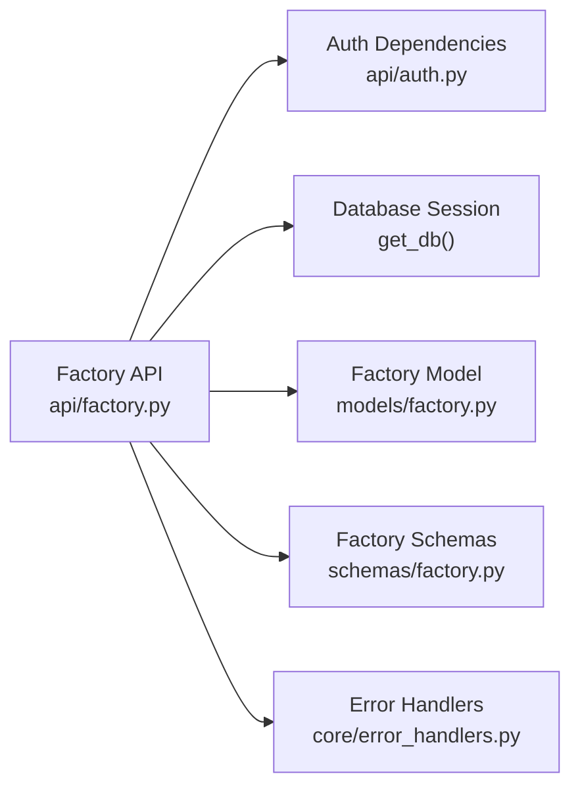

# Factory Management API

<cite>
**Referenced Files in This Document**
- [factory.py](file://backend/app/api/factory.py)
- [factory.py](file://backend/app/models/factory.py)
- [factory.py](file://backend/app/schemas/factory.py)
- [auth.py](file://backend/app/api/auth.py)
- [error_handlers.py](file://backend/app/core/error_handlers.py)
- [main.py](file://backend/main.py)
- [cost_calculator.py](file://backend/app/services/cost_calculator.py)
- [optimizer.py](file://backend/app/services/optimizer.py)
</cite>

## Table of Contents
1. [Introduction](#introduction)
2. [Project Structure](#project-structure)
3. [Core Components](#core-components)
4. [Architecture Overview](#architecture-overview)
5. [Detailed Component Analysis](#detailed-component-analysis)
6. [Dependency Analysis](#dependency-analysis)
7. [Performance Considerations](#performance-considerations)
8. [Troubleshooting Guide](#troubleshooting-guide)
9. [Conclusion](#conclusion)
10. [Appendices](#appendices)

## Introduction
This document provides comprehensive API documentation for factory management endpoints. It covers CRUD operations for factories, including creation, retrieval, updates, and deletion. It also documents location-based tariff categorization features, capacity planning parameters, and factory configuration options. Concrete examples of request/response schemas are provided based on the Factory model and Pydantic schemas. Error handling is documented for duplicate factories (via validation), invalid configurations, and permission checks.

## Project Structure
The factory management feature is implemented as a FastAPI router with associated models and schemas:
- API endpoints: backend/app/api/factory.py
- Data model: backend/app/models/factory.py
- Request/Response schemas: backend/app/schemas/factory.py
- Authentication and authorization: backend/app/api/auth.py
- Global error handlers: backend/app/core/error_handlers.py
- Application bootstrap and router registration: backend/main.py
- Related services for cost calculation and optimization that consume factory-related data: backend/app/services/cost_calculator.py, backend/app/services/optimizer.py

**Diagram sources**
- [main.py:48-58](file://backend/main.py#L48-L58)
- [factory.py:1-11](file://backend/app/api/factory.py#L1-L11)
- [auth.py:63-89](file://backend/app/api/auth.py#L63-L89)
- [factory.py:5-17](file://backend/app/models/factory.py#L5-L17)
- [factory.py:5-31](file://backend/app/schemas/factory.py#L5-L31)
- [error_handlers.py:11-44](file://backend/app/core/error_handlers.py#L11-L44)

**Section sources**
- [main.py:48-58](file://backend/main.py#L48-L58)
- [factory.py:1-11](file://backend/app/api/factory.py#L1-L11)

## Core Components
- Factory Model: Defines the database schema for factories, including name, location, tariff_category, sanctioned_load_kw, solar_capacity_kw, operating_hours, working_days, and timestamps.
- Factory Schemas: Define request and response structures for creating, updating, and responding to factory resources. Includes default values and optional fields for updates.
- Factory Endpoints: Provide full CRUD functionality with role-based access control.
- Authentication and Authorization: Enforce authentication via bearer tokens and restrict certain operations to specific roles (manager, owner).
- Error Handling: Centralized handlers for validation errors, database errors, and generic exceptions.

Key responsibilities:
- Create: POST /api/factories/ — Manager or Owner only
- Read: GET /api/factories/, GET /api/factories/{id} — Any authenticated user
- Update: PUT /api/factories/{id} — Manager or Owner only
- Delete: DELETE /api/factories/{id} — Owner only

**Section sources**
- [factory.py:13-81](file://backend/app/api/factory.py#L13-L81)
- [factory.py:5-17](file://backend/app/models/factory.py#L5-L17)
- [factory.py:5-31](file://backend/app/schemas/factory.py#L5-L31)
- [auth.py:63-89](file://backend/app/api/auth.py#L63-L89)
- [error_handlers.py:11-44](file://backend/app/core/error_handlers.py#L11-L44)

## Architecture Overview
The factory management API follows a layered architecture:
- HTTP layer: FastAPI routers define endpoints and handle request/response serialization.
- Business logic layer: Minimal business logic resides in endpoints; more complex logic is delegated to services where applicable.
- Data access layer: SQLAlchemy ORM models interact with the database through sessions.
- Security layer: Bearer token authentication and role-based authorization protect endpoints.
- Error handling: Global exception handlers standardize error responses.

**Diagram sources**
- [factory.py:13-81](file://backend/app/api/factory.py#L13-L81)
- [auth.py:63-89](file://backend/app/api/auth.py#L63-L89)
- [error_handlers.py:11-44](file://backend/app/core/error_handlers.py#L11-L44)

## Detailed Component Analysis

### Factory Endpoints
- POST /api/factories/
  - Purpose: Create a new factory
  - Authorization: Requires manager or owner role
  - Request body: FactoryCreate schema
  - Response: FactoryResponse
  - Notes: Uses default values for optional fields from schema

- GET /api/factories/
  - Purpose: List factories with pagination
  - Authorization: Any authenticated user
  - Query params: skip (int), limit (int)
  - Response: Array of FactoryResponse

- GET /api/factories/{factory_id}
  - Purpose: Retrieve a single factory by ID
  - Authorization: Any authenticated user
  - Path param: factory_id (int)
  - Response: FactoryResponse or 404 if not found

- PUT /api/factories/{factory_id}
  - Purpose: Update a factory
  - Authorization: Requires manager or owner role
  - Path param: factory_id (int)
  - Request body: FactoryUpdate schema (partial update supported)
  - Response: FactoryResponse or 404 if not found

- DELETE /api/factories/{factory_id}
  - Purpose: Delete a factory
  - Authorization: Requires owner role
  - Path param: factory_id (int)
  - Response: Success message or 404 if not found

**Diagram sources**
- [factory.py:37-81](file://backend/app/api/factory.py#L37-L81)
- [auth.py:63-89](file://backend/app/api/auth.py#L63-L89)

**Section sources**
- [factory.py:13-81](file://backend/app/api/factory.py#L13-L81)

### Factory Model and Schemas
- Factory Model:
  - Fields: id (PK), name, location, tariff_category, sanctioned_load_kw, solar_capacity_kw, operating_hours, working_days, created_at, updated_at
  - Defaults: location defaults to "Faisalabad", tariff_category defaults to "Industrial", operating_hours defaults to "08:00-22:00", working_days defaults to "Mon-Sat", solar_capacity_kw defaults to 0

- Factory Schemas:
  - FactoryBase: Base fields with defaults
  - FactoryCreate: Inherits base fields for creation
  - FactoryUpdate: Optional fields for partial updates
  - FactoryResponse: Adds id and created_at for responses

Validation rules:
- Required fields enforced by Pydantic (e.g., name, sanctioned_load_kw)
- Default values applied when omitted in requests
- Type constraints enforced (string, float, datetime)

Business logic constraints:
- Role-based access control for create/update/delete
- Existence checks for read/update/delete operations

**Section sources**
- [factory.py:5-17](file://backend/app/models/factory.py#L5-L17)
- [factory.py:5-31](file://backend/app/schemas/factory.py#L5-L31)
- [factory.py:13-81](file://backend/app/api/factory.py#L13-L81)

### Authentication and Authorization
- get_current_user: Validates bearer token and returns current user
- require_role: Ensures user has required role (manager or owner); owner can perform manager actions

Permission matrix:
- Create factory: manager or owner
- List factories: any authenticated user
- Get factory: any authenticated user
- Update factory: manager or owner
- Delete factory: owner only

Error responses:
- 401 Unauthorized: Missing or invalid token
- 403 Forbidden: Insufficient role

**Section sources**
- [auth.py:63-89](file://backend/app/api/auth.py#L63-L89)

### Error Handling
Global error handlers provide consistent error responses:
- Validation errors: 422 with structured error details
- Database errors: 500 with optional debug detail
- Generic errors: 500 with safe messages

Endpoint-specific errors:
- 404 Not Found: When factory does not exist
- 401/403: Authentication/authorization failures

**Section sources**
- [error_handlers.py:11-44](file://backend/app/core/error_handlers.py#L11-L44)
- [factory.py:37-81](file://backend/app/api/factory.py#L37-L81)

## Dependency Analysis
The factory module depends on:
- Authentication dependencies for security
- Database session for persistence
- Models and schemas for data representation
- Global error handlers for consistent error responses

**Diagram sources**
- [factory.py:1-11](file://backend/app/api/factory.py#L1-L11)
- [auth.py:63-89](file://backend/app/api/auth.py#L63-L89)
- [factory.py:5-17](file://backend/app/models/factory.py#L5-L17)
- [factory.py:5-31](file://backend/app/schemas/factory.py#L5-L31)
- [error_handlers.py:11-44](file://backend/app/core/error_handlers.py#L11-L44)

**Section sources**
- [factory.py:1-11](file://backend/app/api/factory.py#L1-L11)

## Performance Considerations
- Pagination: Use skip and limit query parameters to efficiently list factories
- Indexing: Ensure database indexes on frequently queried fields (e.g., id)
- Connection pooling: Configure appropriate database connection pool settings
- Caching: Consider caching factory listings for read-heavy scenarios
- Batch operations: For bulk updates, consider batch endpoints to reduce round trips

[No sources needed since this section provides general guidance]

## Troubleshooting Guide
Common issues and resolutions:
- 401 Unauthorized: Ensure valid bearer token is included in Authorization header
- 403 Forbidden: Verify user has required role (manager/owner)
- 404 Not Found: Confirm factory exists before attempting updates/deletes
- 422 Validation Error: Check request payload against schema requirements
- 500 Internal Server Error: Review application logs for database or unexpected errors

Debugging tips:
- Enable debug mode to receive detailed error messages
- Validate request payloads using schema definitions
- Check database connectivity and credentials
- Verify role assignments in user records

**Section sources**
- [error_handlers.py:11-44](file://backend/app/core/error_handlers.py#L11-L44)
- [auth.py:63-89](file://backend/app/api/auth.py#L63-L89)
- [factory.py:37-81](file://backend/app/api/factory.py#L37-L81)

## Conclusion
The Factory Management API provides a robust foundation for managing factory entities with proper authentication, authorization, and error handling. The implementation follows best practices for API design, including clear separation of concerns, consistent error responses, and role-based access control. Future enhancements could include additional validation rules, advanced filtering options, and integration with cost calculation and optimization services.

[No sources needed since this section summarizes without analyzing specific files]

## Appendices

### API Reference

#### Create Factory
- Method: POST
- URL: /api/factories/
- Authorization: Manager or Owner
- Request Body: FactoryCreate schema
- Response: FactoryResponse
- Example Request:
  - name: string
  - location: string (default: "Faisalabad")
  - tariff_category: string (default: "Industrial")
  - sanctioned_load_kw: number
  - solar_capacity_kw: number (default: 0)
  - operating_hours: string (default: "08:00-22:00")
  - working_days: string (default: "Mon-Sat")

#### List Factories
- Method: GET
- URL: /api/factories/?skip=0&limit=100
- Authorization: Any authenticated user
- Query Parameters:
  - skip: integer (default: 0)
  - limit: integer (default: 100)
- Response: Array of FactoryResponse

#### Get Factory
- Method: GET
- URL: /api/factories/{factory_id}
- Authorization: Any authenticated user
- Path Parameters:
  - factory_id: integer
- Response: FactoryResponse or 404

#### Update Factory
- Method: PUT
- URL: /api/factories/{factory_id}
- Authorization: Manager or Owner
- Path Parameters:
  - factory_id: integer
- Request Body: FactoryUpdate schema (partial update)
- Response: FactoryResponse or 404

#### Delete Factory
- Method: DELETE
- URL: /api/factories/{factory_id}
- Authorization: Owner
- Path Parameters:
  - factory_id: integer
- Response: Success message or 404

### Location-Based Tariff Categorization
- tariff_category field determines applicable tariff rates
- Default category: "Industrial"
- Used in conjunction with tariff periods for cost calculations

### Capacity Planning Parameters
- sanctioned_load_kw: Maximum authorized power load
- solar_capacity_kw: Installed solar generation capacity
- operating_hours: Time window for operations
- working_days: Days of operation

### Factory Configuration Options
- name: Unique identifier for the factory
- location: Geographic location (affects tariff categories)
- tariff_category: Determines energy pricing structure
- operational settings: Hours and days of operation

**Section sources**
- [factory.py:5-31](file://backend/app/schemas/factory.py#L5-L31)
- [factory.py:5-17](file://backend/app/models/factory.py#L5-L17)
- [cost_calculator.py:15-33](file://backend/app/services/cost_calculator.py#L15-L33)