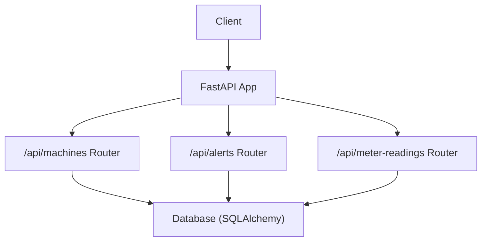
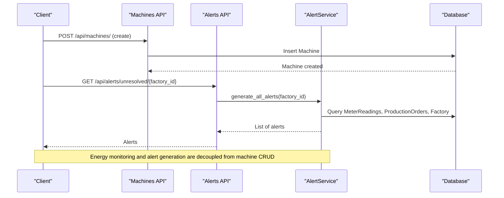
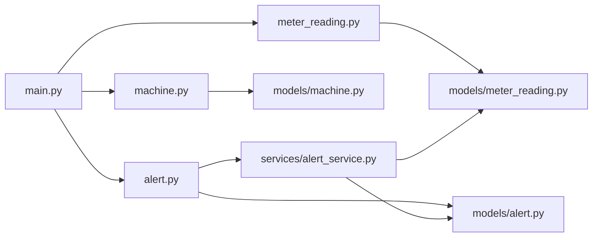

# Machine Management API

<cite>
**Referenced Files in This Document**
- [main.py](file://backend/main.py)
- [machine.py](file://backend/app/api/machine.py)
- [machine.py](file://backend/app/models/machine.py)
- [machine.py](file://backend/app/schemas/machine.py)
- [meter_reading.py](file://backend/app/models/meter_reading.py)
- [meter_reading.py](file://backend/app/schemas/meter_reading.py)
- [alert.py](file://backend/app/api/alert.py)
- [alert_service.py](file://backend/app/services/alert_service.py)
- [alert.py](file://backend/app/models/alert.py)
- [cost_calculator.py](file://backend/app/services/cost_calculator.py)
- [API.md](file://docs/API.md)
</cite>

## Table of Contents
1. [Introduction](#introduction)
2. [Project Structure](#project-structure)
3. [Core Components](#core-components)
4. [Architecture Overview](#architecture-overview)
5. [Detailed Component Analysis](#detailed-component-analysis)
6. [Dependency Analysis](#dependency-analysis)
7. [Performance Considerations](#performance-considerations)
8. [Troubleshooting Guide](#troubleshooting-guide)
9. [Conclusion](#conclusion)
10. [Appendices](#appendices)

## Introduction
This document provides detailed API documentation for machine management endpoints, focusing on:
- Machine registration and specification tracking
- Power consumption monitoring integration via meter readings
- Alert generation for maintenance needs and energy anomalies
- Lifecycle operations (create, list, retrieve, delete) with role-based access control

It also outlines request/response schemas derived from the Machine model and related components, including type-based categorization fields that support process matching and scheduling.

## Project Structure
The backend exposes REST endpoints through FastAPI routers. The machine management functionality is implemented under the machines router, while power monitoring and alerting are provided by meter reading and alert modules.

**Diagram sources**
- [main.py:48-58](file://backend/main.py#L48-L58)
- [machine.py:11-65](file://backend/app/api/machine.py#L11-L65)
- [alert.py:12-107](file://backend/app/api/alert.py#L12-L107)

**Section sources**
- [main.py:48-58](file://backend/main.py#L48-L58)
- [API.md:25-31](file://docs/API.md#L25-L31)

## Core Components
- Machine CRUD endpoints: create, list, get, delete
- Machine data model with power specifications and availability windows
- Meter readings for energy monitoring and peak demand detection
- Alert service to generate alerts for maintenance needs and energy anomalies
- Cost calculation utilities to estimate machine running costs based on tariffs

Key responsibilities:
- Machine endpoints manage machine lifecycle and specifications
- Meter readings capture real-time or batched energy metrics
- Alert service monitors thresholds and generates actionable alerts
- Cost calculator estimates energy cost per machine run using tariff periods

**Section sources**
- [machine.py:13-65](file://backend/app/api/machine.py#L13-L65)
- [machine.py:5-20](file://backend/app/models/machine.py#L5-L20)
- [meter_reading.py:5-17](file://backend/app/models/meter_reading.py#L5-L17)
- [alert_service.py:16-140](file://backend/app/services/alert_service.py#L16-L140)
- [cost_calculator.py:12-110](file://backend/app/services/cost_calculator.py#L12-L110)

## Architecture Overview
The system integrates machine management with energy monitoring and alerting:

**Diagram sources**
- [machine.py:13-24](file://backend/app/api/machine.py#L13-L24)
- [alert.py:35-43](file://backend/app/api/alert.py#L35-L43)
- [alert_service.py:124-140](file://backend/app/services/alert_service.py#L124-L140)

## Detailed Component Analysis

### Machine Endpoints
- Create machine
  - Method: POST
  - Path: /api/machines/
  - Role: manager or owner
  - Request body: MachineCreate schema
  - Response: MachineResponse schema
- List machines
  - Method: GET
  - Path: /api/machines/
  - Query params: factory_id (optional), skip, limit
  - Response: List[MachineResponse]
- Get machine
  - Method: GET
  - Path: /api/machines/{machine_id}
  - Response: MachineResponse
- Delete machine
  - Method: DELETE
  - Path: /api/machines/{machine_id}
  - Role: manager or owner
  - Response: success message

Notes:
- Authentication and authorization are enforced via dependencies
- Pagination supported via skip and limit parameters
- Filtering by factory_id available in list endpoint

**Section sources**
- [machine.py:13-24](file://backend/app/api/machine.py#L13-L24)
- [machine.py:26-38](file://backend/app/api/machine.py#L26-L38)
- [machine.py:40-50](file://backend/app/api/machine.py#L40-L50)
- [machine.py:52-65](file://backend/app/api/machine.py#L52-L65)

### Machine Data Model and Schemas
- Machine model fields include:
  - Identifier and factory association
  - Name and machine_type (used for process matching)
  - power_kw (for energy estimation)
  - min_run_minutes, setup_minutes (for scheduling constraints)
  - shiftable, priority (for optimization)
  - available_from, available_to (operational windows)
  - maintenance_windows (JSON list of time ranges)
  - created_at timestamp
- Schemas:
  - MachineBase: shared fields for create and response
  - MachineCreate: includes factory_id
  - MachineResponse: includes id, factory_id, created_at

Type-based categorization:
- machine_type supports categorization for process matching and scheduling logic
- priority and shiftable influence optimization and rescheduling decisions

**Section sources**
- [machine.py:5-20](file://backend/app/models/machine.py#L5-L20)
- [machine.py:5-26](file://backend/app/schemas/machine.py#L5-L26)

### Power Consumption Monitoring Integration
- MeterReading model captures:
  - timestamp, kwh, kw (instantaneous power), solar_kwh, voltage, current, power_factor
- Use cases:
  - Track energy usage per factory
  - Detect peak demand and trigger alerts
  - Integrate with cost calculations to estimate machine running costs

Integration points:
- AlertService uses latest meter readings to detect peak demand and low solar generation
- CostCalculator estimates machine cost based on power_kw and duration, applying tariff rates at start_time

**Section sources**
- [meter_reading.py:5-17](file://backend/app/models/meter_reading.py#L5-L17)
- [alert_service.py:19-50](file://backend/app/services/alert_service.py#L19-L50)
- [cost_calculator.py:92-110](file://backend/app/services/cost_calculator.py#L92-L110)

### Alert Generation for Maintenance Needs
- Alert types include peak_demand, deadline, low_solar, high_consumption
- AlertService methods:
  - check_peak_demand: creates critical/warning alerts when kW exceeds threshold
  - check_deadlines: warns about upcoming order deadlines
  - check_solar_generation: warns if solar output is below expected during daytime
  - generate_all_alerts: aggregates all checks for a factory
- Alert model fields:
  - type, severity, message, value, threshold, is_read, is_resolved, timestamps

Operational flow:
- Clients can generate alerts for a factory via /api/alerts/generate/{factory_id}
- Unresolved alerts can be retrieved and updated to mark them resolved

**Section sources**
- [alert_service.py:19-140](file://backend/app/services/alert_service.py#L19-L140)
- [alert.py:14-107](file://backend/app/api/alert.py#L14-L107)
- [alert.py:5-18](file://backend/app/models/alert.py#L5-L18)

### Maintenance Windows and Scheduling
- Machine.maintenance_windows stores JSON list of time ranges indicating when machines are unavailable
- Combined with available_from/available_to to define operational windows
- Used by scheduling and optimization features to avoid conflicts

Best practices:
- Define maintenance windows before generating optimized schedules
- Ensure maintenance windows do not overlap with production deadlines

**Section sources**
- [machine.py:17-19](file://backend/app/models/machine.py#L17-L19)

## Dependency Analysis
- Routers are mounted in the main application
- Machine endpoints depend on Machine model and schemas
- Alert endpoints depend on AlertService and Alert model
- Meter readings feed into alert generation and cost calculations

**Diagram sources**
- [main.py:48-58](file://backend/main.py#L48-L58)
- [machine.py:1-65](file://backend/app/api/machine.py#L1-L65)
- [alert.py:1-107](file://backend/app/api/alert.py#L1-L107)
- [alert_service.py:1-140](file://backend/app/services/alert_service.py#L1-L140)

**Section sources**
- [main.py:48-58](file://backend/main.py#L48-L58)
- [machine.py:1-65](file://backend/app/api/machine.py#L1-L65)
- [alert.py:1-107](file://backend/app/api/alert.py#L1-L107)

## Performance Considerations
- Pagination: use skip and limit to control list performance
- Filtering: apply factory_id filter to reduce dataset size
- Batch meter readings: prefer bulk creation where supported to minimize overhead
- Alert generation: run periodically per factory to avoid excessive queries
- Cost estimation: leverage tariff rate lookup to compute accurate costs efficiently

[No sources needed since this section provides general guidance]

## Troubleshooting Guide
Common issues and resolutions:
- 404 Not Found: machine or alert not found; verify IDs and existence
- Validation errors: ensure request payloads match schemas (e.g., required fields, types)
- Authorization errors: ensure user has required roles (manager/owner) for write operations
- Alert thresholds: adjust thresholds in AlertService calls to reduce noise
- Database connectivity: check initialization and connection settings

Error handling:
- Global exception handlers registered in main application
- Specific HTTPException raised for missing resources

**Section sources**
- [machine.py:47-50](file://backend/app/api/machine.py#L47-L50)
- [machine.py:59-65](file://backend/app/api/machine.py#L59-L65)
- [alert.py:67-70](file://backend/app/api/alert.py#L67-L70)
- [main.py:25-38](file://backend/main.py#L25-L38)

## Conclusion
The Machine Management API provides robust endpoints for registering and managing machines, capturing power consumption via meter readings, and generating alerts for maintenance and energy anomalies. Type-based categorization and scheduling fields enable process matching and optimized production planning. Integrations with alert services and cost calculators support proactive maintenance and cost-aware scheduling.

[No sources needed since this section summarizes without analyzing specific files]

## Appendices

### API Reference: Machine Endpoints
- Create machine
  - Method: POST
  - Path: /api/machines/
  - Request: MachineCreate
  - Response: MachineResponse
- List machines
  - Method: GET
  - Path: /api/machines/
  - Query: factory_id, skip, limit
  - Response: List[MachineResponse]
- Get machine
  - Method: GET
  - Path: /api/machines/{machine_id}
  - Response: MachineResponse
- Delete machine
  - Method: DELETE
  - Path: /api/machines/{machine_id}
  - Response: success message

**Section sources**
- [machine.py:13-65](file://backend/app/api/machine.py#L13-L65)
- [API.md:25-31](file://docs/API.md#L25-L31)

### Request/Response Schemas
- MachineBase fields: name, machine_type, power_kw, min_run_minutes, setup_minutes, shiftable, priority, available_from, available_to, maintenance_windows
- MachineCreate adds: factory_id
- MachineResponse adds: id, factory_id, created_at

**Section sources**
- [machine.py:5-26](file://backend/app/schemas/machine.py#L5-L26)

### Meter Readings and Energy Monitoring
- MeterReading fields: timestamp, kwh, kw, solar_kwh, voltage, current, power_factor
- Usage: track consumption, detect peaks, integrate with cost calculations

**Section sources**
- [meter_reading.py:5-17](file://backend/app/models/meter_reading.py#L5-L17)
- [meter_reading.py:5-27](file://backend/app/schemas/meter_reading.py#L5-L27)

### Alert Endpoints and Service
- Generate alerts: POST /api/alerts/generate/{factory_id}
- List unresolved alerts: GET /api/alerts/unresolved/{factory_id}
- Update alert: PUT /api/alerts/{alert_id}
- Alert stats: GET /api/alerts/stats/{factory_id}

**Section sources**
- [alert.py:14-107](file://backend/app/api/alert.py#L14-L107)
- [alert_service.py:19-140](file://backend/app/services/alert_service.py#L19-L140)

### Cost Estimation for Machines
- Estimate machine cost: uses power_kw, duration_hours, start_time, tariffs
- Returns kwh, rate, estimated_cost

**Section sources**
- [cost_calculator.py:92-110](file://backend/app/services/cost_calculator.py#L92-L110)