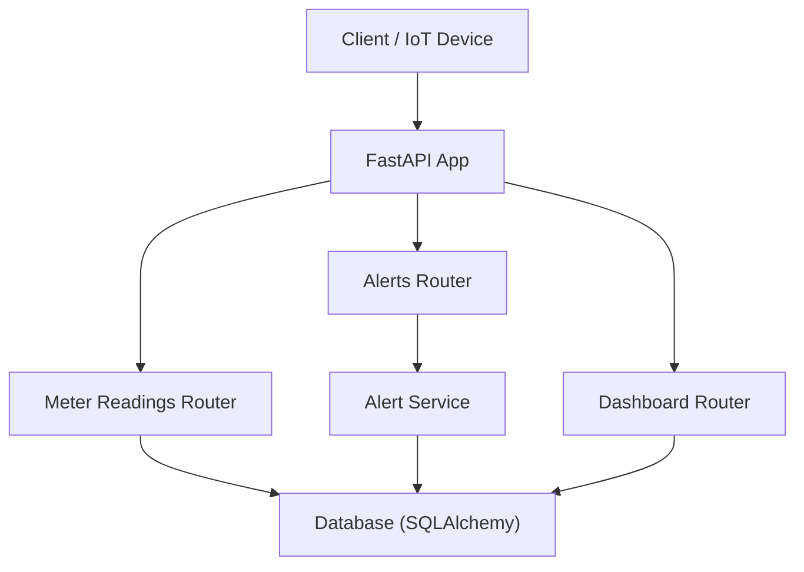
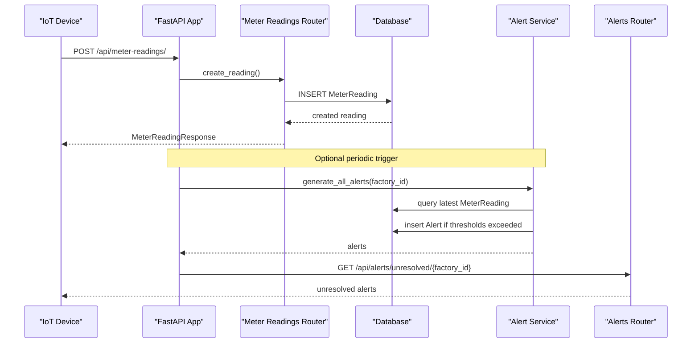
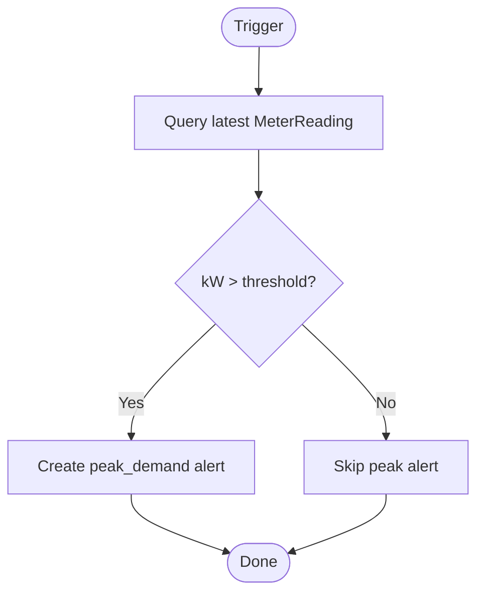
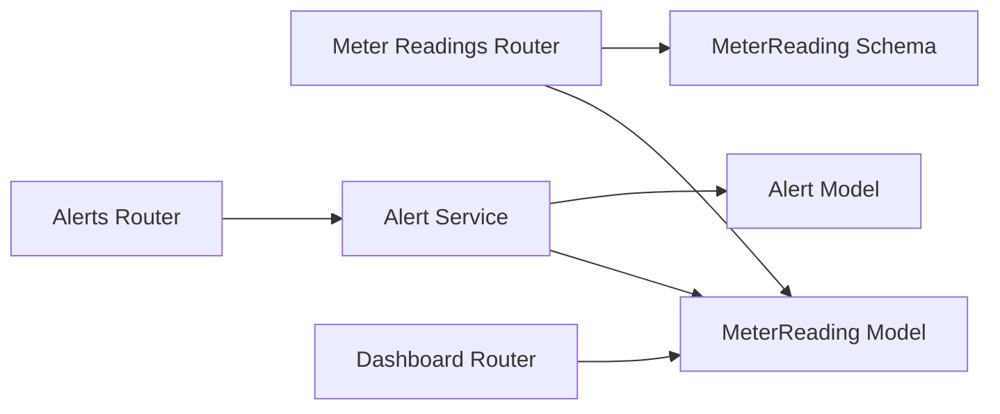

# Meter Reading API

<cite>
**Referenced Files in This Document**
- [main.py](file://backend/main.py)
- [meter_reading.py](file://backend/app/api/meter_reading.py)
- [meter_reading_model.py](file://backend/app/models/meter_reading.py)
- [meter_reading_schema.py](file://backend/app/schemas/meter_reading.py)
- [alert_api.py](file://backend/app/api/alert.py)
- [alert_service.py](file://backend/app/services/alert_service.py)
- [dashboard_api.py](file://backend/app/api/dashboard.py)
- [API.md](file://docs/API.md)
</cite>

## Table of Contents
1. Introduction
2. Project Structure
3. Core Components
4. Architecture Overview
5. Detailed Component Analysis
6. Dependency Analysis
7. Performance Considerations
8. Troubleshooting Guide
9. Conclusion
10. Appendices

## Introduction
This document provides detailed API documentation for meter reading endpoints that support real-time energy consumption tracking, solar generation monitoring, and peak demand management. It covers HTTP methods to record meter readings, retrieve consumption data, and access energy analytics. The documentation defines request/response schemas based on the MeterReading model and includes examples of data structures, consumption patterns, and queries suitable for IoT integrations and real-time monitoring systems. It also documents alert generation for consumption anomalies and peak demand events.

## Project Structure
The meter reading functionality is implemented as a FastAPI router with models and schemas defined separately. The application mounts routers under a base URL and exposes endpoints for creating, importing, listing, and analyzing meter readings. Alerts are generated via a service layer and exposed through an alerts API.

**Diagram sources**
- [main.py:48-58](file://backend/main.py#L48-L58)
- [meter_reading.py:12-141](file://backend/app/api/meter_reading.py#L12-L141)
- [alert_api.py:12-107](file://backend/app/api/alert.py#L12-L107)
- [alert_service.py:16-140](file://backend/app/services/alert_service.py#L16-L140)
- [dashboard_api.py:13-79](file://backend/app/api/dashboard.py#L13-L79)

**Section sources**
- [main.py:18-58](file://backend/main.py#L18-L58)
- [API.md:48-65](file://docs/API.md#L48-L65)

## Core Components
- Meter Reading Endpoints: Create single/bulk readings, import CSV, list with filters, and compute statistics.
- Data Model: MeterReading stores per-timestamp energy metrics including kWh, kW, solar kWh, voltage, current, and power factor.
- Schemas: Pydantic models define input and output contracts for meter readings.
- Alerts: Service-driven detection of peak demand, low solar generation, and deadlines; exposed via alerts API.
- Dashboard: Aggregated energy stats for factory-level dashboards.

**Section sources**
- [meter_reading.py:14-141](file://backend/app/api/meter_reading.py#L14-L141)
- [meter_reading_model.py:5-17](file://backend/app/models/meter_reading.py#L5-L17)
- [meter_reading_schema.py:5-27](file://backend/app/schemas/meter_reading.py#L5-L27)
- [alert_service.py:19-140](file://backend/app/services/alert_service.py#L19-L140)
- [alert_api.py:14-107](file://backend/app/api/alert.py#L14-L107)
- [dashboard_api.py:44-79](file://backend/app/api/dashboard.py#L44-L79)

## Architecture Overview
The system follows a layered architecture:
- API Layer: FastAPI routers expose REST endpoints for meter readings, alerts, and dashboard.
- Service Layer: Business logic for alert generation and analysis.
- Data Layer: SQLAlchemy models interact with the database.

**Diagram sources**
- [meter_reading.py:14-21](file://backend/app/api/meter_reading.py#L14-L21)
- [alert_service.py:125-140](file://backend/app/services/alert_service.py#L125-L140)
- [alert_api.py:45-57](file://backend/app/api/alert.py#L45-L57)

## Detailed Component Analysis

### Meter Reading Endpoints
- Create a single meter reading
  - Method: POST
  - Path: /api/meter-readings/
  - Request body: MeterReadingCreate schema
  - Response: MeterReadingResponse
  - Notes: Stores timestamp, kwh, kw, solar_kwh, voltage, current, power_factor; associates with factory_id.

- Create multiple meter readings
  - Method: POST
  - Path: /api/meter-readings/bulk
  - Request body: MeterReadingBulkCreate schema
  - Response: List[MeterReadingResponse]
  - Notes: Efficiently inserts many readings for the same factory_id.

- Import meter readings from CSV
  - Method: POST
  - Path: /api/meter-readings/import-csv
  - Parameters: factory_id (query), file (multipart/form-data)
  - Required CSV columns: timestamp, kwh
  - Optional CSV columns: kw, solar_kwh, voltage, current, power_factor
  - Response: { message, count }
  - Notes: Validates required columns, converts timestamps, handles optional fields safely.

- List meter readings with filters
  - Method: GET
  - Path: /api/meter-readings/
  - Query parameters: factory_id, start_date, end_date, skip, limit
  - Response: List[MeterReadingResponse]
  - Notes: Orders by timestamp descending; supports pagination via skip/limit.

- Get reading statistics
  - Method: GET
  - Path: /api/meter-readings/stats/{factory_id}
  - Response: { total_readings, total_kwh, avg_kwh, peak_kw, total_solar_kwh }
  - Notes: Aggregates energy totals, averages, peak demand, and solar generation.

Request/Response Schemas
- MeterReadingBase: timestamp, kwh, kw (optional), solar_kwh, voltage (optional), current (optional), power_factor (optional)
- MeterReadingCreate: adds factory_id
- MeterReadingResponse: adds id, factory_id, created_at
- MeterReadingBulkCreate: factory_id + array of MeterReadingBase

Timestamp Handling
- Timestamps are ISO-formatted datetime values in requests/responses.
- CSV import parses timestamps into datetime objects before persisting.

Consumption Patterns and Queries
- Filter by date range using start_date and end_date to analyze consumption trends.
- Use stats endpoint to summarize total consumption, average per reading, peak demand, and solar contribution.

Examples
- Record a single reading: send a JSON object with factory_id, timestamp, kwh, and optional kw, solar_kwh, voltage, current, power_factor.
- Bulk upload: provide an array of readings under the readings field along with factory_id.
- CSV import: upload a CSV with at least timestamp and kwh columns; optional columns enhance analytics.
- Retrieve recent readings: call list endpoint with factory_id and desired time window.
- Compute stats: call stats endpoint for a factory to obtain aggregated metrics.

**Section sources**
- [meter_reading.py:14-141](file://backend/app/api/meter_reading.py#L14-L141)
- [meter_reading_schema.py:5-27](file://backend/app/schemas/meter_reading.py#L5-L27)
- [meter_reading_model.py:5-17](file://backend/app/models/meter_reading.py#L5-L17)

### Real-Time Monitoring and IoT Integration
- IoT devices can stream meter readings via POST /api/meter-readings/ or batch via POST /api/meter-readings/bulk.
- For high-throughput ingestion, prefer bulk uploads or CSV imports to reduce overhead.
- Use list endpoint with pagination to fetch recent readings for live dashboards.
- Integrate with alert generation to detect anomalies and peak demand events.

Integration Points
- Database persistence via SQLAlchemy ensures durability and consistency.
- CORS is enabled to allow browser-based dashboards and external clients.

**Section sources**
- [main.py:40-46](file://backend/main.py#L40-L46)
- [meter_reading.py:23-39](file://backend/app/api/meter_reading.py#L23-L39)
- [meter_reading.py:41-88](file://backend/app/api/meter_reading.py#L41-L88)
- [meter_reading.py:90-111](file://backend/app/api/meter_reading.py#L90-L111)

### Peak Demand Management and Alerts
- Peak demand detection:
  - Service checks the latest meter reading’s kW against a threshold.
  - If exceeded, creates an alert with severity based on how much it exceeds the threshold.
- Low solar generation detection:
  - During daytime hours, compares solar_kwh against expected minimums.
  - Creates warnings when generation is below expectations.
- Deadline alerts:
  - Monitors upcoming production order deadlines and generates warnings/critical alerts.

Alert Generation Flow

**Diagram sources**
- [alert_service.py:19-50](file://backend/app/services/alert_service.py#L19-L50)

Alert Endpoints
- List alerts with filters: GET /api/alerts/
- Generate alerts for a factory: POST /api/alerts/generate/{factory_id}
- Unresolved alerts: GET /api/alerts/unresolved/{factory_id}
- Update alert status: PUT /api/alerts/{alert_id}
- Alert statistics: GET /api/alerts/stats/{factory_id}

**Section sources**
- [alert_service.py:19-140](file://backend/app/services/alert_service.py#L19-L140)
- [alert_api.py:14-107](file://backend/app/api/alert.py#L14-L107)

### Energy Analytics and Dashboard
- Factory dashboard aggregates energy stats:
  - Total kWh, peak kW, total solar kWh.
- Overall summary includes counts across factories, machines, orders, tariffs, and meter readings.

Usage
- Call GET /api/dashboard/factory/{factory_id} to retrieve energy metrics for visualization.
- Use GET /api/dashboard/summary for platform-wide overview.

**Section sources**
- [dashboard_api.py:15-79](file://backend/app/api/dashboard.py#L15-L79)

## Dependency Analysis
- Routers depend on models and schemas for validation and persistence.
- Alert service depends on meter readings and production orders to generate alerts.
- Dashboard depends on meter readings and other entities for aggregated views.

**Diagram sources**
- [meter_reading.py:1-141](file://backend/app/api/meter_reading.py#L1-L141)
- [meter_reading_model.py:5-17](file://backend/app/models/meter_reading.py#L5-L17)
- [meter_reading_schema.py:5-27](file://backend/app/schemas/meter_reading.py#L5-L27)
- [alert_service.py:16-140](file://backend/app/services/alert_service.py#L16-L140)
- [alert_api.py:1-107](file://backend/app/api/alert.py#L1-L107)
- [dashboard_api.py:1-79](file://backend/app/api/dashboard.py#L1-L79)

**Section sources**
- [meter_reading.py:1-141](file://backend/app/api/meter_reading.py#L1-L141)
- [alert_service.py:16-140](file://backend/app/services/alert_service.py#L16-L140)
- [dashboard_api.py:1-79](file://backend/app/api/dashboard.py#L1-L79)

## Performance Considerations
- Prefer bulk endpoints for high-volume ingestion to minimize request overhead.
- Use pagination (skip/limit) when listing readings to avoid large payloads.
- CSV import batches records and commits once, improving throughput.
- Stats endpoint uses SQL aggregations for efficient summaries.
- Ensure indexes on timestamp and factory_id for faster filtering and ordering.

[No sources needed since this section provides general guidance]

## Troubleshooting Guide
Common issues and resolutions:
- Missing required CSV columns:
  - Ensure timestamp and kwh are present; otherwise, import fails with a 400 error.
- Invalid timestamps:
  - Provide valid ISO datetime strings; parsing errors will cause import failure.
- No data for stats:
  - If no readings exist for a factory, stats return zeros; verify data ingestion.
- Alert not generated:
  - Confirm latest readings meet threshold conditions and that triggers are invoked.

Error handling:
- Validation errors return structured JSON responses.
- Database errors are handled centrally and return consistent error formats.

**Section sources**
- [meter_reading.py:41-88](file://backend/app/api/meter_reading.py#L41-L88)
- [main.py:25-38](file://backend/main.py#L25-L38)

## Conclusion
The Meter Reading API provides robust capabilities for recording, importing, querying, and analyzing energy consumption data. It supports real-time monitoring via streaming or batch ingestion, integrates with alert services for anomaly detection and peak demand management, and offers analytics endpoints for dashboards. By leveraging bulk operations, pagination, and SQL aggregations, the system scales efficiently for industrial IoT use cases.

[No sources needed since this section summarizes without analyzing specific files]

## Appendices

### API Reference Summary
- Base URL: http://localhost:8000
- Interactive docs: http://localhost:8000/docs

Endpoints
- Meter Readings
  - POST /api/meter-readings/
  - POST /api/meter-readings/bulk
  - POST /api/meter-readings/import-csv?factory_id=...
  - GET /api/meter-readings/?factory_id=&start_date=&end_date=&skip=&limit=
  - GET /api/meter-readings/stats/{factory_id}
- Alerts
  - GET /api/alerts/
  - POST /api/alerts/generate/{factory_id}
  - GET /api/alerts/unresolved/{factory_id}
  - PUT /api/alerts/{alert_id}
  - GET /api/alerts/stats/{factory_id}
- Dashboard
  - GET /api/dashboard/summary
  - GET /api/dashboard/factory/{factory_id}

**Section sources**
- [API.md:48-65](file://docs/API.md#L48-L65)
- [meter_reading.py:14-141](file://backend/app/api/meter_reading.py#L14-L141)
- [alert_api.py:14-107](file://backend/app/api/alert.py#L14-L107)
- [dashboard_api.py:15-79](file://backend/app/api/dashboard.py#L15-L79)