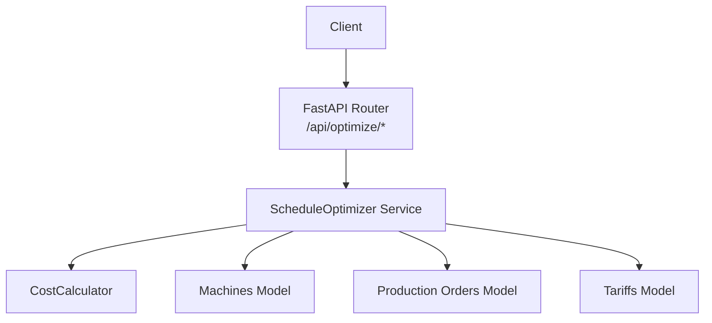
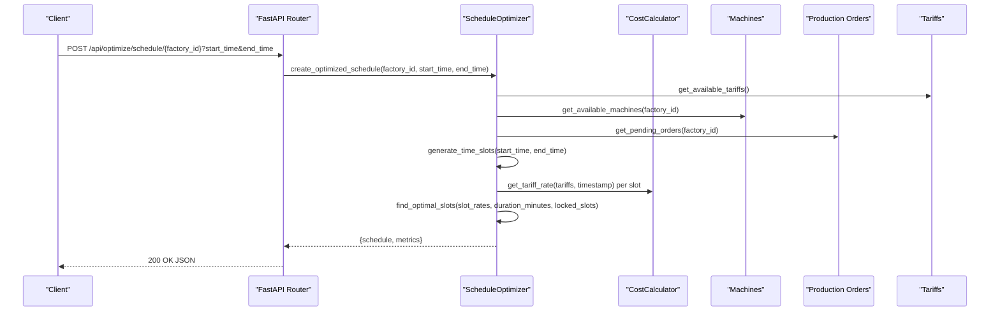
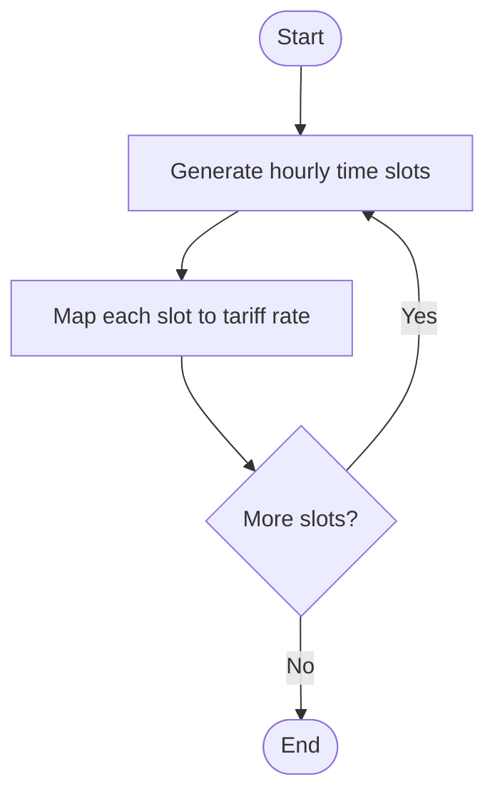
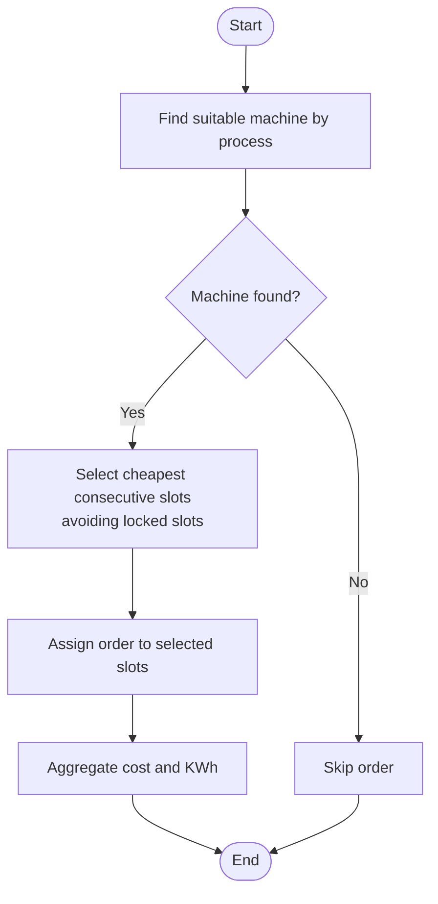
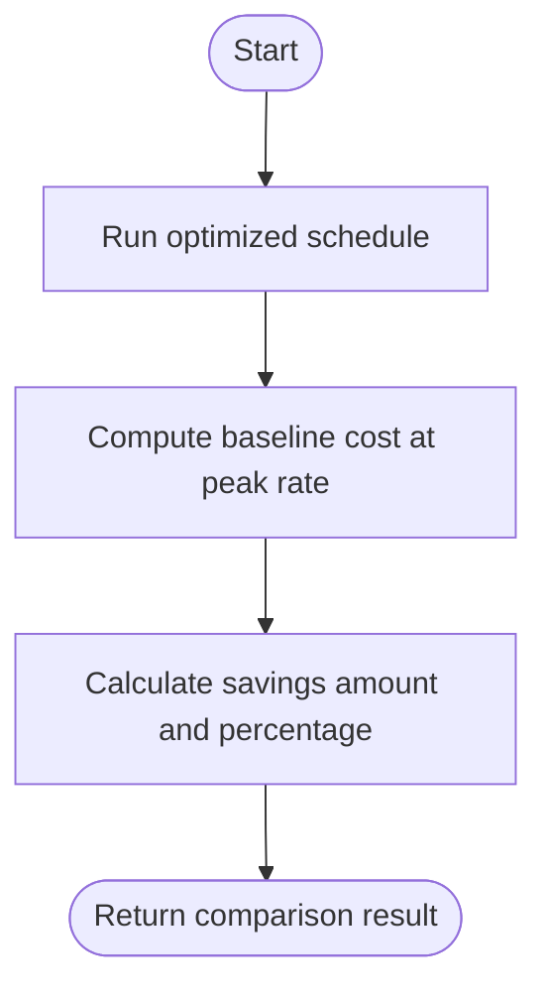
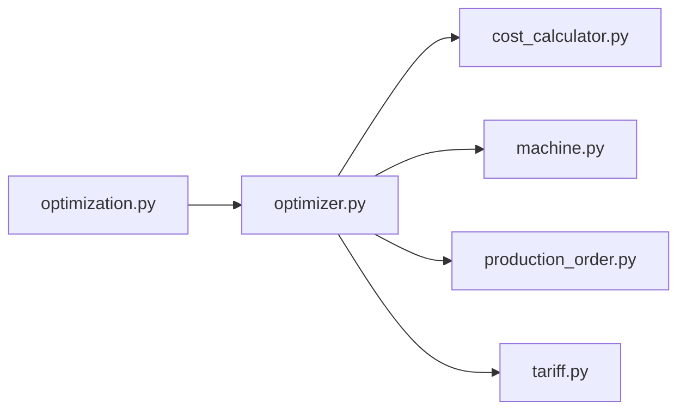

# Optimization API

<cite>
**Referenced Files in This Document**
- [main.py](file://backend/main.py)
- [optimization.py](file://backend/app/api/optimization.py)
- [optimizer.py](file://backend/app/services/optimizer.py)
- [cost_calculator.py](file://backend/app/services/cost_calculator.py)
- [production_order.py](file://backend/app/models/production_order.py)
- [machine.py](file://backend/app/models/machine.py)
- [tariff.py](file://backend/app/models/tariff.py)
- [API.md](file://docs/API.md)
</cite>

## Table of Contents
1. [Introduction](#introduction)
2. [Project Structure](#project-structure)
3. [Core Components](#core-components)
4. [Architecture Overview](#architecture-overview)
5. [Detailed Component Analysis](#detailed-component-analysis)
6. [Dependency Analysis](#dependency-analysis)
7. [Performance Considerations](#performance-considerations)
8. [Troubleshooting Guide](#troubleshooting-guide)
9. [Conclusion](#conclusion)

## Introduction
This document provides comprehensive API documentation for the schedule optimization endpoints that generate AI-powered production schedules, minimize energy costs using tariff-aware algorithms, and satisfy operational constraints such as machine availability and order deadlines. It covers HTTP methods for generating optimized schedules, comparing baseline versus optimized scenarios, and retrieving optimization results. It also specifies request/response schemas, example parameters, constraint definitions, and performance metrics, along with integration points to production orders, machines, and tariff rates.

## Project Structure
The optimization feature is implemented as a FastAPI router mounted into the main application. The core logic resides in a service layer that orchestrates data retrieval from models (orders, machines, tariffs), cost calculations, and scheduling heuristics.

**Diagram sources**
- [main.py:48-58](file://backend/main.py#L48-L58)
- [optimization.py:1-48](file://backend/app/api/optimization.py#L1-L48)
- [optimizer.py:14-238](file://backend/app/services/optimizer.py#L14-L238)
- [cost_calculator.py:12-110](file://backend/app/services/cost_calculator.py#L12-L110)
- [machine.py:5-20](file://backend/app/models/machine.py#L5-L20)
- [production_order.py:5-20](file://backend/app/models/production_order.py#L5-L20)
- [tariff.py:5-19](file://backend/app/models/tariff.py#L5-L19)

**Section sources**
- [main.py:48-58](file://backend/main.py#L48-L58)
- [API.md:61-65](file://docs/API.md#L61-L65)

## Core Components
- Schedule Optimizer: Builds time slots, computes per-slot tariff rates, assigns pending orders to suitable machines, selects cheapest consecutive slots while respecting locked slots, and aggregates cost/KWh metrics.
- Cost Calculator: Determines applicable tariff rate by time-of-day windows (including overnight periods) and estimates slot-level or total energy costs.
- Data Models: Production orders define job requirements; machines define capability and power; tariffs define time-based pricing.

Key responsibilities:
- Generate hourly time slots across a requested window.
- Map each slot to its tariff rate.
- Match orders to compatible machines by process type.
- Select optimal consecutive slots per machine avoiding conflicts.
- Compute estimated costs and KWh usage per order and totals.
- Provide baseline vs optimized comparison including savings.

**Section sources**
- [optimizer.py:14-238](file://backend/app/services/optimizer.py#L14-L238)
- [cost_calculator.py:12-110](file://backend/app/services/cost_calculator.py#L12-L110)
- [production_order.py:5-20](file://backend/app/models/production_order.py#L5-L20)
- [machine.py:5-20](file://backend/app/models/machine.py#L5-L20)
- [tariff.py:5-19](file://backend/app/models/tariff.py#L5-L19)

## Architecture Overview
The optimization endpoints expose two primary operations:
- Generate an optimized schedule for a factory within a time window.
- Compare baseline (unoptimized) versus optimized schedules to quantify savings.

**Diagram sources**
- [optimization.py:11-29](file://backend/app/api/optimization.py#L11-L29)
- [optimizer.py:97-190](file://backend/app/services/optimizer.py#L97-L190)
- [cost_calculator.py:15-33](file://backend/app/services/cost_calculator.py#L15-L33)

## Detailed Component Analysis

### Endpoints

#### Generate Optimized Schedule
- Method: POST
- Path: /api/optimize/schedule/{factory_id}
- Query Parameters:
  - start_time: Optional datetime; defaults to current hour-aligned time
  - end_time: Optional datetime; defaults to start_time + 24 hours
- Behavior:
  - Retrieves tariffs, machines, and pending orders for the factory.
  - Generates hourly time slots and maps each to a tariff rate.
  - Assigns each order to a suitable machine by process type.
  - Selects the cheapest consecutive slots per machine while avoiding already-locked slots.
  - Computes estimated cost and KWh per order and aggregates totals.
- Response Schema:
  - factory_id: integer
  - start_time: datetime
  - end_time: datetime
  - total_orders_scheduled: integer
  - total_estimated_cost: number
  - total_estimated_kwh: number
  - average_rate: number
  - schedule: array of objects with fields:
    - order_id: integer
    - order_no: string
    - process: string
    - quantity: number
    - machine_id: integer
    - machine_name: string
    - machine_power_kw: number
    - duration_minutes: integer
    - start_time: datetime
    - end_time: datetime
    - slots: array of datetimes
    - estimated_cost: number
    - estimated_kwh: number
    - priority: integer
  - slot_rates: array of objects with fields:
    - timestamp: datetime
    - rate: number
    - hour: integer

Example Request:
- POST /api/optimize/schedule/1?start_time=2025-01-01T00:00:00&end_time=2025-01-02T00:00:00

Example Response:
- See response schema above; includes schedule entries and aggregated metrics.

**Section sources**
- [optimization.py:11-29](file://backend/app/api/optimization.py#L11-L29)
- [optimizer.py:97-190](file://backend/app/services/optimizer.py#L97-L190)

#### Compare Baseline vs Optimized
- Method: POST
- Path: /api/optimize/compare/{factory_id}
- Query Parameters:
  - start_time: Optional datetime; defaults to current hour-aligned time
  - end_time: Optional datetime; defaults to start_time + 24 hours
- Behavior:
  - Runs optimized schedule generation.
  - Calculates baseline cost assuming all orders run at a fixed peak rate.
  - Computes savings amount and percentage.
- Response Schema:
  - baseline: object with total_cost and total_kwh
  - optimized: object with total_cost and total_kwh
  - savings: object with amount and percentage
  - schedule: same structure as optimized schedule endpoint

Example Request:
- POST /api/optimize/compare/1?start_time=2025-01-01T00:00:00&end_time=2025-01-02T00:00:00

Example Response:
- baseline.total_cost: number
- baseline.total_kwh: number
- optimized.total_cost: number
- optimized.total_kwh: number
- savings.amount: number
- savings.percentage: number
- schedule: array of scheduled orders with metrics

**Section sources**
- [optimization.py:31-48](file://backend/app/api/optimization.py#L31-L48)
- [optimizer.py:192-238](file://backend/app/services/optimizer.py#L192-L238)

### Underlying Algorithms and Logic

#### Time Slot Generation and Tariff Mapping
- Generates hourly slots between start_time and end_time.
- For each slot, determines the applicable tariff rate based on time-of-day windows, including overnight ranges.

**Diagram sources**
- [optimizer.py:36-64](file://backend/app/services/optimizer.py#L36-L64)
- [cost_calculator.py:15-33](file://backend/app/services/cost_calculator.py#L15-L33)

#### Order-to-Machine Matching and Slot Selection
- Matches orders to machines by process type; falls back to first available machine if none match.
- Selects cheapest consecutive slots per machine while skipping locked slots to avoid conflicts.

**Diagram sources**
- [optimizer.py:120-179](file://backend/app/services/optimizer.py#L120-L179)

#### Baseline vs Optimized Comparison
- Baseline assumes all orders run at a fixed peak rate; optimized uses dynamic tariff-aware slot selection.
- Savings are computed as difference in total cost and expressed as a percentage.

**Diagram sources**
- [optimizer.py:192-238](file://backend/app/services/optimizer.py#L192-L238)

### Constraint Satisfaction Features
- Machine compatibility: Orders are matched to machines by process type.
- Conflict avoidance: Locked slots per machine prevent double-booking.
- Duration alignment: Consecutive hourly slots are selected to meet order duration.
- Availability windows: Machines have configured availability times; these can be used to constrain scheduling further.
- Maintenance windows: JSON field allows specifying maintenance periods to exclude from scheduling.

These constraints influence slot selection and assignment logic in the optimizer.

**Section sources**
- [machine.py:5-20](file://backend/app/models/machine.py#L5-L20)
- [production_order.py:5-20](file://backend/app/models/production_order.py#L5-L20)
- [optimizer.py:66-95](file://backend/app/services/optimizer.py#L66-L95)

### Integration Points
- Production Orders: Pending orders drive scheduling; order attributes include process, duration, earliest start, deadline, priority, and optional machine options.
- Machines: Define capability (type), power consumption, minimum run time, setup time, shiftable flag, availability windows, and maintenance windows.
- Tariffs: Time-based pricing with start/end times and effective date ranges; supports overnight periods.

**Section sources**
- [production_order.py:5-20](file://backend/app/models/production_order.py#L5-L20)
- [machine.py:5-20](file://backend/app/models/machine.py#L5-L20)
- [tariff.py:5-19](file://backend/app/models/tariff.py#L5-L19)

## Dependency Analysis
The optimization module depends on:
- FastAPI router for HTTP exposure.
- Service layer for algorithmic logic.
- Cost calculator for tariff rate determination and cost estimation.
- Data models for querying orders, machines, and tariffs.

**Diagram sources**
- [optimization.py:1-48](file://backend/app/api/optimization.py#L1-L48)
- [optimizer.py:14-238](file://backend/app/services/optimizer.py#L14-L238)
- [cost_calculator.py:12-110](file://backend/app/services/cost_calculator.py#L12-L110)
- [machine.py:5-20](file://backend/app/models/machine.py#L5-L20)
- [production_order.py:5-20](file://backend/app/models/production_order.py#L5-L20)
- [tariff.py:5-19](file://backend/app/models/tariff.py#L5-L19)

**Section sources**
- [main.py:48-58](file://backend/main.py#L48-L58)
- [API.md:61-65](file://docs/API.md#L61-L65)

## Performance Considerations
- Time granularity: Hourly slots balance accuracy and performance; consider reducing interval for finer control at potential computational cost.
- Sorting complexity: Slot selection sorts by rate; complexity grows with number of slots.
- Machine matching: Process-based matching is efficient; fallback to first machine avoids expensive searches.
- Lock tracking: Used slots per machine are tracked to prevent conflicts; ensure minimal overhead in large schedules.
- Baseline assumption: Fixed peak rate simplifies baseline calculation; adjust if more realistic baselines are needed.

[No sources needed since this section provides general guidance]

## Troubleshooting Guide
Common issues and resolutions:
- No pending orders: Ensure orders exist with status "pending" for the factory; otherwise, schedule will be empty.
- No suitable machines: Verify machine types match order processes; configure appropriate machines or update order processes.
- Tariff misconfiguration: Check tariff start/end times and effective dates; ensure coverage for the requested time window.
- Overlapping schedules: Conflicts arise if multiple orders target the same slots; review locked slots logic and machine availability windows.
- Default peak rate in baseline: If baseline savings seem unrealistic, adjust the peak rate assumption to reflect actual conditions.

Error handling:
- Validation errors return structured JSON with status, message, and detail.
- Database errors are handled centrally and returned as standardized error responses.

**Section sources**
- [API.md:76-80](file://docs/API.md#L76-L80)
- [main.py:25-38](file://backend/main.py#L25-L38)

## Conclusion
The Optimization API provides robust, tariff-aware scheduling that minimizes energy costs while respecting operational constraints. By integrating production orders, machine capabilities, and dynamic tariff rates, it enables factories to shift energy-intensive tasks to cheaper periods, achieving measurable savings. The compare endpoint offers clear insights into baseline versus optimized outcomes, supporting data-driven decisions for production planning.

[No sources needed since this section summarizes without analyzing specific files]