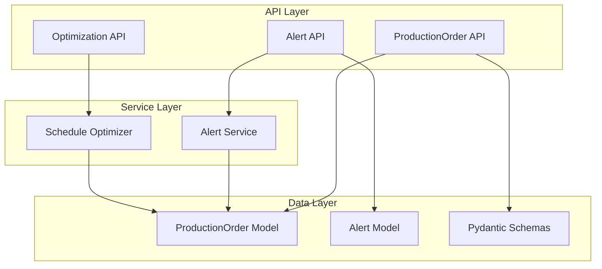
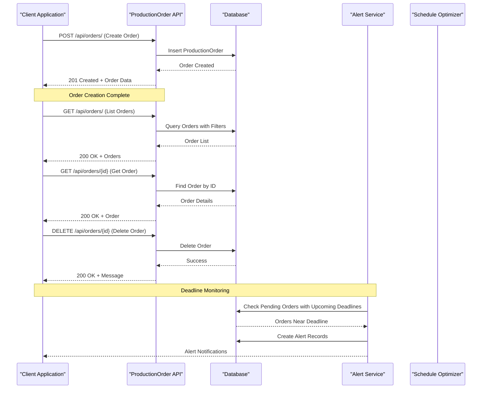
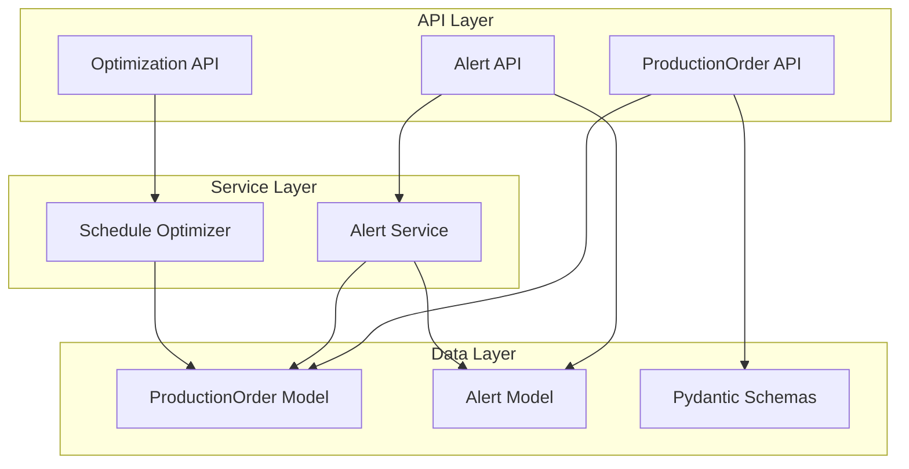
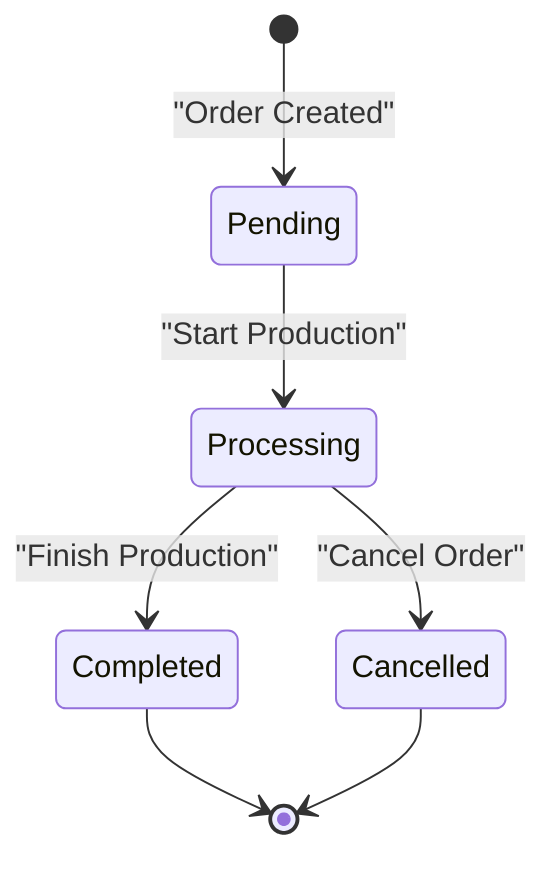

# Production Order API

<cite>
**Referenced Files in This Document**
- [production_order.py](file://backend/app/api/production_order.py)
- [production_order.py](file://backend/app/models/production_order.py)
- [production_order.py](file://backend/app/schemas/production_order.py)
- [alert.py](file://backend/app/api/alert.py)
- [alert_service.py](file://backend/app/services/alert_service.py)
- [alert.py](file://backend/app/models/alert.py)
- [alert.py](file://backend/app/schemas/alert.py)
- [optimizer.py](file://backend/app/services/optimizer.py)
- [optimization.py](file://backend/app/api/optimization.py)
</cite>

## Table of Contents
1. [Introduction](#introduction)
2. [Project Structure](#project-structure)
3. [Core Components](#core-components)
4. [Architecture Overview](#architecture-overview)
5. [Detailed Component Analysis](#detailed-component-analysis)
6. [Dependency Analysis](#dependency-analysis)
7. [Performance Considerations](#performance-considerations)
8. [Troubleshooting Guide](#troubleshooting-guide)
9. [Conclusion](#conclusion)
10. [Appendices](#appendices)

## Introduction
This document provides comprehensive API documentation for production order management endpoints, focusing on order creation with priority levels, deadline tracking, status workflow from pending to completion, and lifecycle management. It also documents integration points with schedule optimization and alert systems for approaching deadlines. The API is implemented using FastAPI with SQLAlchemy models and Pydantic schemas.

## Project Structure
The production order system consists of:
- **API Layer**: FastAPI routers handling HTTP requests
- **Service Layer**: Business logic for order processing and optimization
- **Data Layer**: SQLAlchemy models and Pydantic schemas
- **Integration**: Alert service and schedule optimizer

**Diagram sources**
- [production_order.py:1-66](file://backend/app/api/production_order.py#L1-L66)
- [alert.py:1-107](file://backend/app/api/alert.py#L1-L107)
- [optimization.py:1-48](file://backend/app/api/optimization.py#L1-L48)

**Section sources**
- [production_order.py:1-66](file://backend/app/api/production_order.py#L1-L66)
- [optimization.py:1-48](file://backend/app/api/optimization.py#L1-L48)

## Core Components

### Production Order Model
The `ProductionOrder` model defines the core data structure for production orders with fields for order identification, process details, scheduling constraints, priority levels, and status tracking.

### Order Management Endpoints
The API provides CRUD operations for production orders with role-based access control and filtering capabilities.

### Alert System Integration
The alert service monitors order deadlines and generates notifications for approaching deadlines based on configurable thresholds.

### Schedule Optimization
The optimizer service creates cost-effective production schedules by analyzing energy tariffs and machine availability.

**Section sources**
- [production_order.py:5-20](file://backend/app/models/production_order.py#L5-L20)
- [production_order.py:13-24](file://backend/app/api/production_order.py#L13-L24)
- [alert_service.py:52-91](file://backend/app/services/alert_service.py#L52-L91)
- [optimizer.py:97-190](file://backend/app/services/optimizer.py#L97-L190)

## Architecture Overview

**Diagram sources**
- [production_order.py:13-66](file://backend/app/api/production_order.py#L13-L66)
- [alert_service.py:52-91](file://backend/app/services/alert_service.py#L52-L91)

## Detailed Component Analysis

### Production Order Endpoints

#### Create Order
- **HTTP Method**: POST
- **Endpoint**: `/api/orders/`
- **Authentication**: Manager or Owner role required
- **Request Body**: `ProductionOrderCreate` schema
- **Response**: `ProductionOrderResponse` schema

#### List Orders
- **HTTP Method**: GET
- **Endpoint**: `/api/orders/`
- **Authentication**: Any authenticated user
- **Query Parameters**: 
  - `factory_id`: Filter by factory
  - `status`: Filter by order status
- **Response**: Array of `ProductionOrderResponse` objects

#### Get Order Details
- **HTTP Method**: GET
- **Endpoint**: `/api/orders/{order_id}`
- **Authentication**: Any authenticated user
- **Path Parameter**: `order_id`
- **Response**: `ProductionOrderResponse` object

#### Delete Order
- **HTTP Method**: DELETE
- **Endpoint**: `/api/orders/{order_id}`
- **Authentication**: Manager or Owner role required
- **Path Parameter**: `order_id`
- **Response**: Success message

**Section sources**
- [production_order.py:13-24](file://backend/app/api/production_order.py#L13-L24)
- [production_order.py:26-39](file://backend/app/api/production_order.py#L26-L39)
- [production_order.py:41-51](file://backend/app/api/production_order.py#L41-L51)
- [production_order.py:53-66](file://backend/app/api/production_order.py#L53-L66)

### Order Data Models and Schemas

#### ProductionOrder Model
The database model includes:
- Unique order number (`order_no`)
- Process type (`process`)
- Quantity and duration specifications
- Scheduling constraints (`earliest_start`, `deadline`)
- Priority levels (integer, default 2)
- Machine options (JSON array)
- Lock status for immutability
- Status tracking (default: "pending")
- Creation timestamp

#### Pydantic Schemas
- `ProductionOrderBase`: Common fields for validation
- `ProductionOrderCreate`: Request schema with factory association
- `ProductionOrderResponse`: Response schema with computed fields

**Section sources**
- [production_order.py:5-20](file://backend/app/models/production_order.py#L5-L20)
- [production_order.py:5-26](file://backend/app/schemas/production_order.py#L5-L26)

### Alert System Integration

#### Deadline Monitoring
The alert service automatically monitors production orders for approaching deadlines:
- Checks pending orders within configurable time windows
- Generates warnings for deadlines within 2 hours
- Creates critical alerts for imminent deadlines
- Prevents duplicate alert generation

#### Alert Types and Severity Levels
- **Deadline Alerts**: Monitor order completion deadlines
- **Severity Levels**: Warning (2+ hours), Critical (<2 hours)
- **Factory-specific**: Alerts are scoped to individual factories

**Section sources**
- [alert_service.py:52-91](file://backend/app/services/alert_service.py#L52-L91)
- [alert.py:5-18](file://backend/app/models/alert.py#L5-L18)
- [alert.py:5-28](file://backend/app/schemas/alert.py#L5-L28)

### Schedule Optimization Integration

#### Optimized Scheduling
The schedule optimizer creates cost-effective production plans:
- Analyzes energy tariff rates across time slots
- Considers machine availability and power consumption
- Respects order priorities and deadlines
- Minimizes total energy costs while meeting production requirements

#### Optimization Features
- **Time Slot Generation**: Creates hourly intervals for scheduling
- **Cost Calculation**: Computes energy costs based on tariff rates
- **Machine Assignment**: Matches orders to compatible machines
- **Constraint Handling**: Respects locked slots and order dependencies

**Section sources**
- [optimizer.py:29-34](file://backend/app/services/optimizer.py#L29-L34)
- [optimizer.py:97-190](file://backend/app/services/optimizer.py#L97-L190)
- [optimization.py:11-29](file://backend/app/api/optimization.py#L11-L29)

## Dependency Analysis

**Diagram sources**
- [production_order.py:1-66](file://backend/app/api/production_order.py#L1-L66)
- [alert.py:1-107](file://backend/app/api/alert.py#L1-L107)
- [optimization.py:1-48](file://backend/app/api/optimization.py#L1-L48)
- [alert_service.py:1-140](file://backend/app/services/alert_service.py#L1-L140)
- [optimizer.py:1-238](file://backend/app/services/optimizer.py#L1-L238)

**Section sources**
- [production_order.py:1-66](file://backend/app/api/production_order.py#L1-L66)
- [alert_service.py:1-140](file://backend/app/services/alert_service.py#L1-L140)
- [optimizer.py:1-238](file://backend/app/services/optimizer.py#L1-L238)

## Performance Considerations

### Database Query Optimization
- Use indexed queries for order filtering by factory_id and status
- Implement pagination for large order lists
- Optimize alert checking with appropriate time window limits

### Alert System Efficiency
- Prevent duplicate alert generation with existing alert checks
- Use efficient database queries for deadline monitoring
- Implement batch processing for multiple order checks

### Schedule Optimization Performance
- Cache tariff rate calculations for repeated queries
- Limit optimization time windows to reasonable ranges
- Use efficient algorithms for slot selection and cost calculation

## Troubleshooting Guide

### Common Issues and Solutions

#### Order Creation Failures
- **Validation Errors**: Ensure all required fields are provided
- **Duplicate Order Numbers**: Verify unique order_no values
- **Permission Denied**: Check user role requirements (manager/owner)

#### Alert System Issues
- **Missing Alerts**: Verify deadline timestamps are in the future
- **Duplicate Alerts**: Check existing alert resolution status
- **Incorrect Severity**: Validate time calculations for deadline proximity

#### Optimization Problems
- **No Schedule Generated**: Check machine availability and order compatibility
- **High Costs**: Review tariff rates and optimize time windows
- **Conflicting Slots**: Ensure proper slot locking mechanisms

**Section sources**
- [production_order.py:47-51](file://backend/app/api/production_order.py#L47-L51)
- [alert_service.py:66-71](file://backend/app/services/alert_service.py#L66-L71)
- [optimizer.py:120-133](file://backend/app/services/optimizer.py#L120-L133)

## Conclusion

The Production Order API provides a comprehensive solution for managing manufacturing workflows with integrated deadline monitoring and schedule optimization. The system supports:

- **Complete Order Lifecycle**: From creation through completion with proper status tracking
- **Priority Management**: Flexible priority levels affecting scheduling and alerting
- **Deadline Tracking**: Automated monitoring with configurable alert thresholds
- **Cost Optimization**: Intelligent scheduling based on energy tariff analysis
- **Role-based Access**: Secure API endpoints with appropriate permissions

The architecture follows clean separation of concerns with distinct API, service, and data layers, making it maintainable and scalable for production environments.

## Appendices

### API Endpoint Reference

| Endpoint | Method | Description | Authentication |
|----------|--------|-------------|----------------|
| `/api/orders/` | POST | Create new production order | Manager/Owner |
| `/api/orders/` | GET | List orders with filters | Authenticated User |
| `/api/orders/{id}` | GET | Get order details | Authenticated User |
| `/api/orders/{id}` | DELETE | Delete order | Manager/Owner |
| `/api/alerts/generate/{factory_id}` | POST | Generate alerts for factory | Manager |
| `/api/optimize/schedule/{factory_id}` | POST | Create optimized schedule | Authenticated User |

### Order Status Workflow

### Alert Threshold Configuration

| Alert Type | Threshold | Severity | Description |
|------------|-----------|----------|-------------|
| Deadline Warning | 2+ hours remaining | Warning | Order deadline approaching |
| Deadline Critical | <2 hours remaining | Critical | Immediate action required |
| Peak Demand | >200 kW | Warning/Critical | Energy consumption exceeds threshold |

**Section sources**
- [production_order.py:13-66](file://backend/app/api/production_order.py#L13-L66)
- [alert.py:35-43](file://backend/app/api/alert.py#L35-L43)
- [optimization.py:11-29](file://backend/app/api/optimization.py#L11-L29)
- [alert_service.py:19-50](file://backend/app/services/alert_service.py#L19-L50)