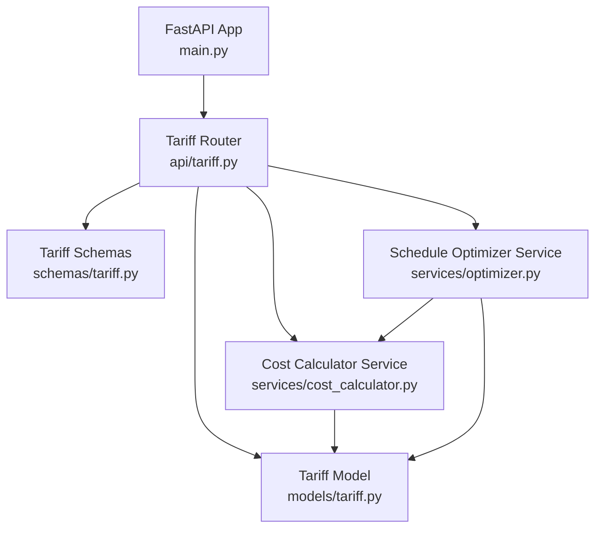
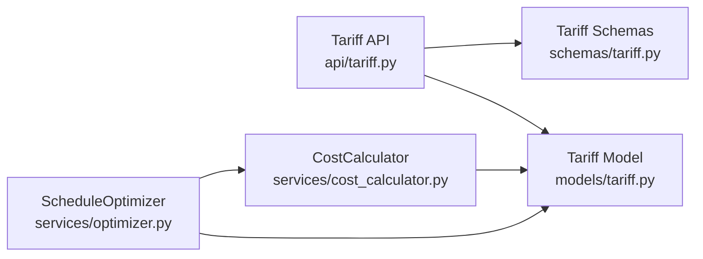
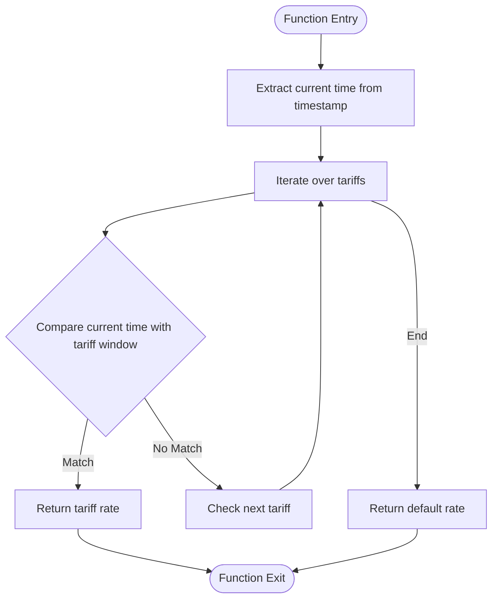

# Tariff Management API

<cite>
**Referenced Files in This Document**
- [main.py](file://backend/main.py)
- [tariff.py](file://backend/app/api/tariff.py)
- [tariff.py](file://backend/app/models/tariff.py)
- [tariff.py](file://backend/app/schemas/tariff.py)
- [cost_calculator.py](file://backend/app/services/cost_calculator.py)
- [optimizer.py](file://backend/app/services/optimizer.py)
- [API.md](file://docs/API.md)
</cite>

## Table of Contents
1. [Introduction](#introduction)
2. [Project Structure](#project-structure)
3. [Core Components](#core-components)
4. [Architecture Overview](#architecture-overview)
5. [Detailed Component Analysis](#detailed-component-analysis)
6. [Dependency Analysis](#dependency-analysis)
7. [Performance Considerations](#performance-considerations)
8. [Troubleshooting Guide](#troubleshooting-guide)
9. [Conclusion](#conclusion)
10. [Appendices](#appendices)

## Introduction
This document provides detailed API documentation for tariff management endpoints that enable time-based electricity pricing configuration, rate plan management, and seasonal adjustments. It covers HTTP methods to create tariff rates, define peak/off-peak/night periods, update rate schedules, and retrieve tariff information. The request/response schemas are based on the Tariff model and Pydantic schemas. It also explains integration with the cost calculation engine and schedule optimization algorithms used to compute energy costs and optimize production scheduling based on tariffs.

## Project Structure
The tariff management functionality is implemented as a FastAPI router under the backend application. The core pieces include:
- API endpoints for CRUD operations on tariffs and active tariff lookup
- Data models defining the tariff entity and its fields
- Schemas for request validation and response serialization
- Services for cost calculation and schedule optimization that consume tariffs



**Diagram sources**
- [main.py:48-58](file://backend/main.py#L48-L58)
- [tariff.py:1-90](file://backend/app/api/tariff.py#L1-L90)
- [tariff.py:1-19](file://backend/app/models/tariff.py#L1-L19)
- [tariff.py:1-35](file://backend/app/schemas/tariff.py#L1-L35)
- [cost_calculator.py:1-110](file://backend/app/services/cost_calculator.py#L1-L110)
- [optimizer.py:1-238](file://backend/app/services/optimizer.py#L1-L238)

**Section sources**
- [main.py:48-58](file://backend/main.py#L48-L58)
- [API.md:39-46](file://docs/API.md#L39-L46)

## Core Components
- Tariff Model: Defines the database schema for tariffs including category, period name, time windows, rates, effective dates, source, and timestamps.
- Tariff Schemas: Define request and response structures for creating, updating, and returning tariff data.
- Tariff API Endpoints: Provide RESTful endpoints to create, list, get, update, delete tariffs, and query currently active tariffs by category.
- Cost Calculator: Computes applicable tariff rates for given timestamps and calculates slot-level and total energy costs.
- Schedule Optimizer: Generates optimized production schedules using tariff rates to minimize energy costs.

**Section sources**
- [tariff.py:1-19](file://backend/app/models/tariff.py#L1-L19)
- [tariff.py:1-35](file://backend/app/schemas/tariff.py#L1-L35)
- [tariff.py:1-90](file://backend/app/api/tariff.py#L1-L90)
- [cost_calculator.py:1-110](file://backend/app/services/cost_calculator.py#L1-L110)
- [optimizer.py:1-238](file://backend/app/services/optimizer.py#L1-L238)

## Architecture Overview
The tariff system exposes a set of REST endpoints under /api/tariffs. Clients can manage time-based rate plans (e.g., Peak, Off-Peak, Night) with effective date ranges to support seasonal adjustments. The cost calculator uses these tariffs to determine the applicable rate at any timestamp, handling overnight periods. The optimizer leverages these rates to find the cheapest consecutive slots for production tasks.

```mermaid
sequenceDiagram
participant Client as "Client"
participant API as "Tariff API<br/>api/tariff.py"
participant DB as "Database"
participant Calc as "CostCalculator<br/>services/cost_calculator.py"
participant Opt as "ScheduleOptimizer<br/>services/optimizer.py"
Client->>API : POST /api/tariffs/ (create)
API->>DB : Insert Tariff
DB-->>API : Created Tariff
API-->>Client : TariffResponse
Client->>API : GET /api/tariffs/?category=&active_only=
API->>DB : Query Tariffs (filters)
DB-->>API : List[Tariff]
API-->>Client : List[TariffResponse]
Client->>API : GET /api/tariffs/active/{category}
API->>DB : Find Active Tariff (date range)
DB-->>API : Tariff
API-->>Client : TariffResponse
Note over Client,Opt : Optimization flow uses tariffs via services
Client->>Opt : Create optimized schedule
Opt->>Calc : Get tariff rate per slot
Calc-->>Opt : Rate per timestamp
Opt-->>Client : Optimized schedule with costs
```

**Diagram sources**
- [tariff.py:12-90](file://backend/app/api/tariff.py#L12-L90)
- [cost_calculator.py:15-50](file://backend/app/services/cost_calculator.py#L15-L50)
- [optimizer.py:21-64](file://backend/app/services/optimizer.py#L21-L64)

## Detailed Component Analysis

### Tariff Model and Schemas
- Tariff model fields:
  - id: integer primary key
  - category: string (e.g., Industrial TOU — A-1, Commercial)
  - period_name: string (e.g., Peak, Off-Peak, Night)
  - start_time: string (HH:MM format)
  - end_time: string (HH:MM format)
  - rate_pkr_per_kwh: float (energy rate)
  - fixed_charge_pkr_per_kw: float (optional demand charge)
  - effective_from: date (start of validity)
  - effective_to: optional date (end of validity; None means ongoing)
  - source: string (default NEPRA)
  - last_verified_at: optional datetime
  - created_at: auto-generated datetime

- Request/response schemas:
  - TariffBase: defines required fields for creation and responses
  - TariffCreate: inherits base fields for POST payloads
  - TariffUpdate: all fields optional for PATCH-like updates
  - TariffResponse: includes id and created_at

Example usage patterns:
- Create a tariff rate for a specific period and category with effective dates
- Update an existing tariff’s rate or time window
- Retrieve currently active tariffs for a category

**Section sources**
- [tariff.py:1-19](file://backend/app/models/tariff.py#L1-L19)
- [tariff.py:1-35](file://backend/app/schemas/tariff.py#L1-L35)

### Tariff API Endpoints
Base path: /api/tariffs

- POST /api/tariffs/
  - Purpose: Create a new tariff period/rate
  - Request body: TariffCreate schema
  - Response: TariffResponse
  - Notes: Stores category, period_name, time window, rate, effective dates, source

- GET /api/tariffs/
  - Purpose: List tariffs with optional filters
  - Query parameters:
    - category: Optional filter by category
    - active_only: Boolean to return only tariffs effective today
    - skip: Pagination offset
    - limit: Pagination limit
  - Response: List[TariffResponse]

- GET /api/tariffs/{tariff_id}
  - Purpose: Retrieve a specific tariff by ID
  - Response: TariffResponse
  - Error: 404 if not found

- PUT /api/tariffs/{tariff_id}
  - Purpose: Update a tariff’s fields
  - Request body: TariffUpdate schema (partial updates supported)
  - Response: TariffResponse
  - Error: 404 if not found

- DELETE /api/tariffs/{tariff_id}
  - Purpose: Delete a tariff
  - Response: JSON message
  - Error: 404 if not found

- GET /api/tariffs/active/{category}
  - Purpose: Get currently active tariff for a category
  - Behavior: Filters by effective_from <= today and (effective_to is None or effective_to >= today)
  - Response: TariffResponse
  - Error: 404 if no active tariff found

Examples of typical requests/responses:
- Create a Peak period tariff for Industrial TOU — A-1 with effective dates spanning a season
- List tariffs filtered by category and active_only=true to see current rates
- Update a tariff’s rate during a seasonal adjustment

**Section sources**
- [tariff.py:12-90](file://backend/app/api/tariff.py#L12-L90)
- [API.md:39-46](file://docs/API.md#L39-L46)

### Time-Based Rate Definitions and Seasonal Adjustments
- Time windows:
  - start_time and end_time define the daily period (supports overnight spans where start_time > end_time)
  - Example categories: Industrial TOU — A-1, Industrial TOU — A-2, Commercial
  - Example period names: Peak, Off-Peak, Night

- Seasonal adjustments:
  - Use effective_from and effective_to to control when a tariff applies
  - Multiple overlapping tariffs can be managed by setting appropriate date ranges
  - Active filtering supports retrieving tariffs valid for the current date

Rate calculation logic:
- The cost calculator determines the applicable rate for a timestamp by matching the time against tariff windows
- Overnight tariffs are handled correctly (e.g., 22:00–00:00)
- Default fallback rate is applied if no tariff matches

Integration points:
- Optimization service consumes tariff rates to schedule jobs in cheaper periods
- Dashboard and meter reading analysis use cost calculations to report average rates and total costs

**Section sources**
- [cost_calculator.py:15-50](file://backend/app/services/cost_calculator.py#L15-L50)
- [tariff.py:1-19](file://backend/app/models/tariff.py#L1-L19)
- [tariff.py:1-35](file://backend/app/schemas/tariff.py#L1-L35)

### Integration with Cost Calculation Engine
The cost calculation engine computes:
- Applicable tariff rate for a given timestamp
- Slot-level cost for consumption values
- Total cost across multiple meter readings, including grid vs solar consumption and peak demand
- Estimated machine run cost based on power and duration

Key behaviors:
- get_tariff_rate selects the correct tariff based on time windows
- calculate_slot_cost multiplies kWh by the selected rate
- calculate_total_cost aggregates costs and metrics across readings
- estimate_machine_cost estimates cost for running equipment over a duration

**Section sources**
- [cost_calculator.py:15-110](file://backend/app/services/cost_calculator.py#L15-L110)

### Integration with Schedule Optimization Algorithms
The schedule optimizer:
- Retrieves available tariffs and generates time slots within a specified window
- Calculates slot rates using the cost calculator
- Finds optimal consecutive slots for each order, respecting locked slots per machine
- Produces an optimized schedule with estimated costs and kWh
- Compares baseline vs optimized costs to quantify savings

Key behaviors:
- generate_time_slots creates hourly intervals
- calculate_slot_rates maps timestamps to tariff rates
- find_optimal_slots selects cheapest consecutive slots while avoiding conflicts
- create_optimized_schedule builds the final schedule with cost breakdowns
- compare_baseline_vs_optimized provides savings metrics

**Section sources**
- [optimizer.py:21-238](file://backend/app/services/optimizer.py#L21-L238)

## Dependency Analysis
The tariff system has clear separation between API, models, schemas, and services:
- API depends on models and schemas for persistence and validation
- Services depend on models for data access and on each other for computation
- No circular dependencies observed among these components



**Diagram sources**
- [tariff.py:1-90](file://backend/app/api/tariff.py#L1-L90)
- [tariff.py:1-19](file://backend/app/models/tariff.py#L1-L19)
- [tariff.py:1-35](file://backend/app/schemas/tariff.py#L1-L35)
- [cost_calculator.py:1-110](file://backend/app/services/cost_calculator.py#L1-L110)
- [optimizer.py:1-238](file://backend/app/services/optimizer.py#L1-L238)

**Section sources**
- [tariff.py:1-90](file://backend/app/api/tariff.py#L1-L90)
- [cost_calculator.py:1-110](file://backend/app/services/cost_calculator.py#L1-L110)
- [optimizer.py:1-238](file://backend/app/services/optimizer.py#L1-L238)

## Performance Considerations
- Filtering active tariffs by date reduces query scope and improves performance
- Pagination parameters (skip, limit) help manage large datasets
- Cost calculation iterates through tariffs per timestamp; ensure tariff sets are appropriately scoped to avoid unnecessary computations
- Optimization algorithm sorts slots by rate; consider limiting time windows to reduce processing overhead

[No sources needed since this section provides general guidance]

## Troubleshooting Guide
Common issues and resolutions:
- 404 Not Found: Ensure tariff IDs exist before update/delete; verify category exists for active tariff queries
- Validation errors: Check request payload conforms to TariffCreate/TariffUpdate schemas (required fields, types)
- No active tariff: Confirm effective_from and effective_to cover the current date for the requested category
- Unexpected default rate: Verify all relevant tariffs have correct time windows; default rate is applied when no match is found

Error handling:
- Global exception handlers are registered for validation and SQLAlchemy errors
- API returns consistent error structures with status, message, and optional detail

**Section sources**
- [tariff.py:44-75](file://backend/app/api/tariff.py#L44-L75)
- [main.py:25-38](file://backend/main.py#L25-L38)

## Conclusion
The Tariff Management API provides robust endpoints to configure and manage time-based electricity pricing, including peak/off-peak/night periods and seasonal adjustments via effective date ranges. Integrated cost calculation and schedule optimization services enable accurate cost estimation and production scheduling aligned with tariff rates. The system supports flexible rate plan management and offers practical tools for minimizing energy costs through intelligent scheduling.

[No sources needed since this section summarizes without analyzing specific files]

## Appendices

### API Reference Summary
- Base URL: http://localhost:8000
- Tariff endpoints:
  - POST /api/tariffs/
  - GET /api/tariffs/
  - GET /api/tariffs/{id}
  - PUT /api/tariffs/{id}
  - DELETE /api/tariffs/{id}
  - GET /api/tariffs/active/{category}

**Section sources**
- [API.md:39-46](file://docs/API.md#L39-L46)

### Example Tariff Structures
- Category examples: Industrial TOU — A-1, Industrial TOU — A-2, Commercial
- Period names: Peak, Off-Peak, Night
- Time windows: HH:MM format supporting overnight spans
- Effective dates: Date ranges to control seasonal applicability

**Section sources**
- [tariff.py:1-19](file://backend/app/models/tariff.py#L1-L19)
- [tariff.py:1-35](file://backend/app/schemas/tariff.py#L1-L35)

### Rate Calculation Logic Flow


**Diagram sources**
- [cost_calculator.py:15-33](file://backend/app/services/cost_calculator.py#L15-L33)