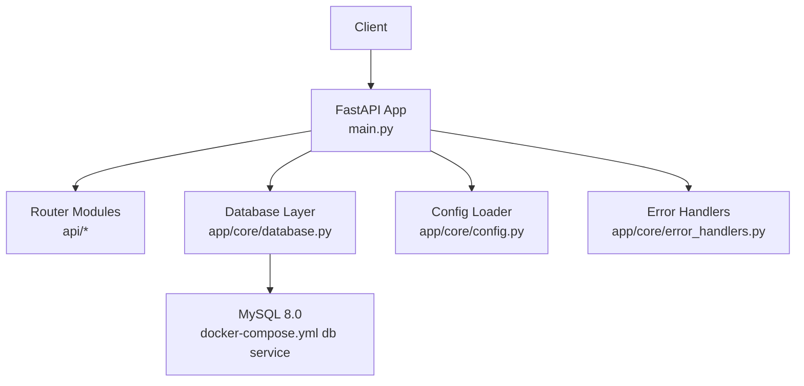
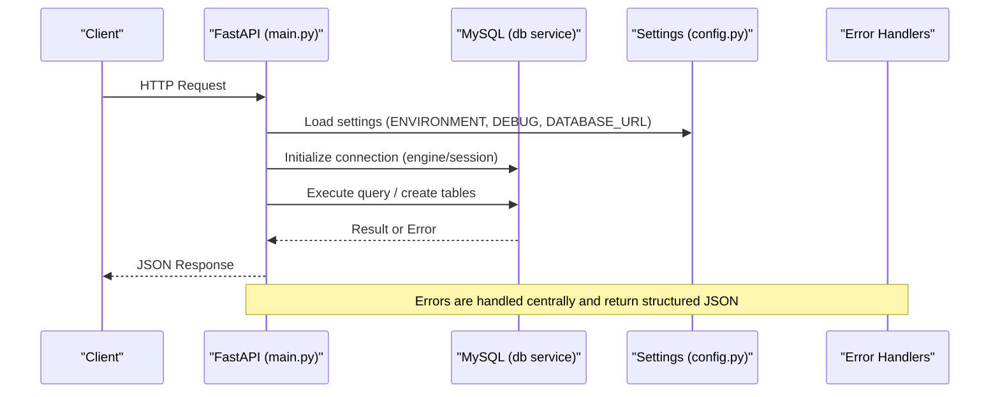
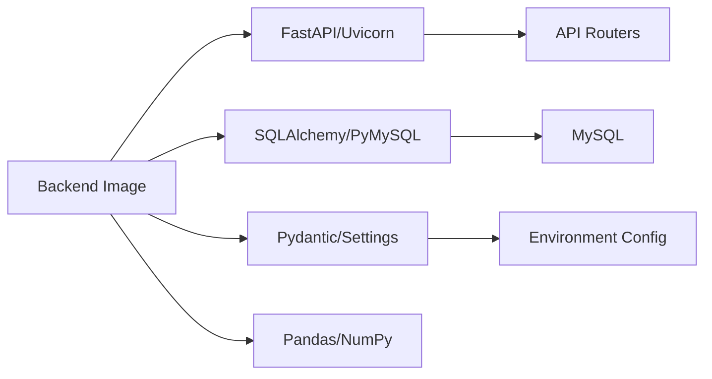
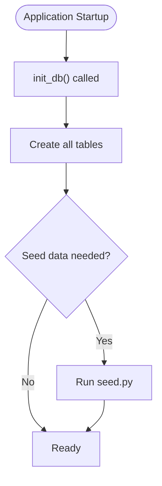

# Configuration & Deployment

<cite>
**Referenced Files in This Document**
- [docker-compose.yml](file://docker-compose.yml)
- [backend/Dockerfile](file://backend/Dockerfile)
- [backend/requirements.txt](file://backend/requirements.txt)
- [backend/main.py](file://backend/main.py)
- [backend/app/core/config.py](file://backend/app/core/config.py)
- [backend/app/core/database.py](file://backend/app/core/database.py)
- [backend/app/core/error_handlers.py](file://backend/app/core/error_handlers.py)
- [backend/seed.py](file://backend/seed.py)
- [README.md](file://README.md)
</cite>

## Table of Contents
1. [Introduction](#introduction)
2. [Project Structure](#project-structure)
3. [Core Components](#core-components)
4. [Architecture Overview](#architecture-overview)
5. [Detailed Component Analysis](#detailed-component-analysis)
6. [Dependency Analysis](#dependency-analysis)
7. [Performance Considerations](#performance-considerations)
8. [Troubleshooting Guide](#troubleshooting-guide)
9. [Conclusion](#conclusion)
10. [Appendices](#appendices)

## Introduction
This document provides comprehensive configuration and deployment guidance for TariffGuard, covering environment variables, Docker containerization with docker-compose, MySQL database setup and initialization, production considerations (scaling, monitoring, logging, security), environment-specific configuration management, Alibaba Cloud deployment guidance (RDS, OSS, ECS), deployment checklists, rollback procedures, troubleshooting, performance tuning, and resource allocation guidelines.

## Project Structure
TariffGuard is a FastAPI backend with a Next.js frontend. The backend runs inside a Python 3.11 container using Uvicorn, connects to a MySQL 8.0 database via SQLAlchemy, and exposes REST endpoints. Docker Compose orchestrates the backend and database services for local development and can be adapted for production deployments.

**Diagram sources**
- [backend/main.py:1-91](file://backend/main.py#L1-L91)
- [backend/app/core/database.py:1-37](file://backend/app/core/database.py#L1-L37)
- [backend/app/core/config.py:1-21](file://backend/app/core/config.py#L1-L21)
- [backend/app/core/error_handlers.py:1-44](file://backend/app/core/error_handlers.py#L1-L44)
- [docker-compose.yml:1-53](file://docker-compose.yml#L1-L53)

**Section sources**
- [README.md:1-228](file://README.md#L1-L228)
- [docker-compose.yml:1-53](file://docker-compose.yml#L1-L53)

## Core Components
- Application entrypoint and routing: FastAPI app mounts routers and static files, initializes DB on startup, and exposes health and test endpoints.
- Configuration: Centralized settings loaded from environment variables with defaults and an .env file support.
- Database: SQLAlchemy engine configured for MySQL or SQLite fallback; connection pooling parameters set for MySQL; table creation on startup.
- Error handling: Global handlers for validation and database errors that respect DEBUG mode for sensitive details.

Key responsibilities:
- Environment-driven behavior via Settings and DATABASE_URL.
- Containerized runtime via Dockerfile and docker-compose.
- Seed data script for demo datasets and schema initialization.

**Section sources**
- [backend/main.py:1-91](file://backend/main.py#L1-L91)
- [backend/app/core/config.py:1-21](file://backend/app/core/config.py#L1-L21)
- [backend/app/core/database.py:1-37](file://backend/app/core/database.py#L1-L37)
- [backend/app/core/error_handlers.py:1-44](file://backend/app/core/error_handlers.py#L1-L44)
- [backend/seed.py:1-455](file://backend/seed.py#L1-L455)

## Architecture Overview
The system consists of:
- Backend API (FastAPI + Uvicorn)
- MySQL 8.0 database
- Optional external integrations (Alibaba Cloud keys)
- Static frontend served by the backend during development

**Diagram sources**
- [backend/main.py:1-91](file://backend/main.py#L1-L91)
- [backend/app/core/config.py:1-21](file://backend/app/core/config.py#L1-L21)
- [backend/app/core/database.py:1-37](file://backend/app/core/database.py#L1-L37)
- [backend/app/core/error_handlers.py:1-44](file://backend/app/core/error_handlers.py#L1-L44)
- [docker-compose.yml:1-53](file://docker-compose.yml#L1-L53)

## Detailed Component Analysis

### Environment Variables and Configuration Management
- Supported variables:
  - DATABASE_URL: Connection string for MySQL or SQLite fallback.
  - ENVIRONMENT: Application environment (development, staging, production).
  - DEBUG: Enables verbose error details and debug behaviors.
  - ALCHEMY_KEY, QWEN_API_KEY: Optional keys for Alibaba Cloud integrations.
- Defaults and precedence:
  - Settings class defines defaults and reads from .env when present.
  - docker-compose passes environment variables to the backend service.
- Best practices:
  - Use separate .env files per environment (e.g., .env.development.local, .env.production.local) and ensure they are not committed to version control.
  - In production, inject secrets via platform secret managers or orchestration tools rather than plaintext files.

Environment variable usage points:
- Settings loader: centralizes all config access.
- Database layer: uses DATABASE_URL to configure engine and pool settings.
- Error handlers: use DEBUG to decide whether to expose internal details.

**Section sources**
- [backend/app/core/config.py:1-21](file://backend/app/core/config.py#L1-L21)
- [backend/app/core/database.py:1-37](file://backend/app/core/database.py#L1-L37)
- [backend/app/core/error_handlers.py:1-44](file://backend/app/core/error_handlers.py#L1-L44)
- [docker-compose.yml:26-46](file://docker-compose.yml#L26-L46)
- [README.md:207-213](file://README.md#L207-L213)

### Docker Containerization and Local Development
- Backend image:
  - Base: python:3.11-slim
  - Installs system dependencies and Python packages from requirements.txt
  - Runs as non-root user
  - Exposes port 8000 and starts Uvicorn
- Compose services:
  - db: MySQL 8.0 with persistent volume and healthcheck
  - backend: depends on db, mounts code for hot reload, sets environment variables, runs Uvicorn with reload for development
- Networking:
  - Services communicate over a bridge network named tariffguard_network
- Ports:
  - Host 3306 maps to MySQL container
  - Host 8000 maps to backend API

Local development workflow:
- Start services with docker-compose up -d --build
- Seed demo data via docker-compose exec backend python seed.py
- Access Swagger UI at http://localhost:8000/docs and dashboard at http://localhost:8000/dashboard

**Section sources**
- [backend/Dockerfile:1-39](file://backend/Dockerfile#L1-L39)
- [docker-compose.yml:1-53](file://docker-compose.yml#L1-L53)
- [backend/requirements.txt:1-16](file://backend/requirements.txt#L1-L16)
- [README.md:51-82](file://README.md#L51-L82)

### Database Configuration (MySQL)
- Connection string:
  - DATABASE_URL must point to MySQL instance reachable by the backend container (e.g., host=db within compose network).
- Engine and pooling:
  - For MySQL, pool_pre_ping=True and pool_recycle=3600 are configured to maintain healthy connections.
- Schema initialization:
  - Tables are created on application startup via init_db().
  - Seed script clears and re-populates sample data for demonstration.
- Backup strategies:
  - Use MySQL native tools (mysqldump) or cloud provider backups for RDS.
  - Schedule periodic snapshots/backups and store them securely offsite.
  - Test restore procedures regularly.

Operational notes:
- Ensure credentials and hostnames match your environment (local vs cloud).
- Validate connectivity from the backend container to the database host.
- Monitor connection pool metrics and adjust pool sizes based on workload.

**Section sources**
- [backend/app/core/database.py:1-37](file://backend/app/core/database.py#L1-L37)
- [backend/seed.py:1-455](file://backend/seed.py#L1-L455)
- [docker-compose.yml:4-24](file://docker-compose.yml#L4-L24)

### Production Deployment Considerations
- Scaling:
  - Run multiple backend replicas behind a reverse proxy/load balancer.
  - Scale horizontally based on CPU/memory utilization and request latency.
  - Use stateless design; persist state in MySQL and object storage if needed.
- Monitoring:
  - Enable application logs (structured JSON preferred) and ship to centralized logging.
  - Expose health endpoint (/health) for liveness/readiness probes.
  - Collect metrics (request rate, error rate, latency) and set alerts.
- Logging:
  - Configure Uvicorn to output structured logs.
  - Include correlation IDs and request context in logs.
- Security hardening:
  - Disable DEBUG in production.
  - Restrict CORS origins and enable HTTPS termination at the reverse proxy.
  - Rotate secrets regularly and use secret management solutions.
  - Enforce least privilege for database users and restrict network access.
- Reverse proxy:
  - Place Nginx/Traefik in front of Uvicorn for TLS, compression, caching, and rate limiting.

**Section sources**
- [backend/main.py:62-91](file://backend/main.py#L62-L91)
- [backend/app/core/error_handlers.py:1-44](file://backend/app/core/error_handlers.py#L1-L44)
- [backend/app/core/config.py:1-21](file://backend/app/core/config.py#L1-L21)

### Environment-Specific Configuration
- Development:
  - DEBUG=true, ENVIRONMENT=development
  - Local MySQL via docker-compose
  - Hot reload enabled for rapid iteration
- Staging:
  - DEBUG=false, ENVIRONMENT=staging
  - Use staging MySQL (could be managed service)
  - Enable stricter CORS and logging
- Production:
  - DEBUG=false, ENVIRONMENT=production
  - Use managed MySQL (RDS), secure secrets, hardened containers
  - Enable monitoring, alerting, and log aggregation

Configuration injection methods:
- docker-compose environment section
- Platform environment variables (ECS, Kubernetes)
- Secret managers (Alibaba Cloud Secrets Manager, etc.)

**Section sources**
- [docker-compose.yml:26-46](file://docker-compose.yml#L26-L46)
- [backend/app/core/config.py:1-21](file://backend/app/core/config.py#L1-L21)

### Alibaba Cloud Deployment (RDS, OSS, ECS)
- RDS (MySQL):
  - Create a MySQL instance and configure a dedicated user for TariffGuard.
  - Set DATABASE_URL to connect to the RDS endpoint.
  - Enable automated backups and point-in-time recovery.
  - Configure VPC and security groups to allow backend access only.
- OSS (Object Storage):
  - Use for storing reports, exports, or large assets.
  - Configure bucket policies and IAM roles for least privilege access.
  - Integrate via SDKs and environment variables for credentials.
- ECS (Elastic Container Service):
  - Build and push images to a container registry.
  - Define tasks with appropriate CPU/memory and scaling policies.
  - Use ALB/NLB for load balancing and health checks.
  - Inject secrets via environment variables or secret managers.

Integration keys:
- ALCHEMY_KEY, QWEN_API_KEY: Provide via environment variables for AI features.

**Section sources**
- [backend/app/core/config.py:1-21](file://backend/app/core/config.py#L1-L21)
- [README.md:10-18](file://README.md#L10-L18)

### Deployment Checklist
- Pre-deployment
  - Verify DATABASE_URL points to correct host and credentials
  - Confirm ENVIRONMENT and DEBUG values per target environment
  - Ensure all required ports are open and networks configured
  - Validate health endpoint responds
- Post-deployment
  - Run seed script if needed (development/staging)
  - Verify API docs and core endpoints
  - Check logs for errors and warnings
  - Confirm monitoring and alerting are active
- Security
  - Disable DEBUG in production
  - Restrict CORS and enforce HTTPS
  - Rotate secrets and verify permissions

**Section sources**
- [backend/main.py:62-91](file://backend/main.py#L62-L91)
- [backend/app/core/config.py:1-21](file://backend/app/core/config.py#L1-L21)
- [docker-compose.yml:26-46](file://docker-compose.yml#L26-L46)

### Rollback Procedures
- Strategy
  - Maintain previous image tags and configurations
  - Use blue/green or rolling updates to minimize downtime
- Steps
  - Stop new deployment
  - Revert to previous stable image and configuration
  - Verify database compatibility (schema changes should be backward compatible or applied via migrations)
  - Restore backups if data corruption occurred
  - Validate health and key endpoints before resuming traffic

**Section sources**
- [backend/main.py:62-91](file://backend/main.py#L62-L91)

### Troubleshooting Guide
Common issues and resolutions:
- Database connection failures
  - Verify DATABASE_URL format and reachability
  - Check firewall/security group rules between backend and database
  - Inspect connection pool settings and timeouts
- Health check failures
  - Ensure /health endpoint is accessible
  - Review application logs for startup errors
- Validation errors
  - Check request payloads against API schemas
  - Use DEBUG to get detailed error messages in development
- CORS issues
  - Adjust allowed origins in production to specific domains
- Performance bottlenecks
  - Tune database pool size and timeouts
  - Profile slow queries and optimize indexes
  - Add caching where appropriate

Diagnostic endpoints:
- /health: returns status and timestamp
- /api/test: returns backend status and configured DATABASE_URL

**Section sources**
- [backend/main.py:62-91](file://backend/main.py#L62-L91)
- [backend/app/core/error_handlers.py:1-44](file://backend/app/core/error_handlers.py#L1-L44)
- [backend/app/core/database.py:1-37](file://backend/app/core/database.py#L1-L37)

## Dependency Analysis
Runtime dependencies and their roles:
- FastAPI and Uvicorn: Web framework and ASGI server
- SQLAlchemy and PyMySQL: ORM and MySQL driver
- Pydantic and pydantic-settings: Configuration and validation
- Pandas and NumPy: Data processing for analytics
- pytest: Testing framework

Container build dependencies:
- System packages: gcc, g++, curl
- Python packages installed from requirements.txt

Service dependencies:
- Backend depends on MySQL for persistence
- Optional integration with Alibaba Cloud services via environment keys

**Diagram sources**
- [backend/Dockerfile:1-39](file://backend/Dockerfile#L1-L39)
- [backend/requirements.txt:1-16](file://backend/requirements.txt#L1-L16)
- [docker-compose.yml:1-53](file://docker-compose.yml#L1-L53)

**Section sources**
- [backend/requirements.txt:1-16](file://backend/requirements.txt#L1-L16)
- [backend/Dockerfile:1-39](file://backend/Dockerfile#L1-L39)

## Performance Considerations
- Database
  - Tune pool size and timeouts based on concurrent requests
  - Use connection pooling parameters already set (pool_pre_ping, pool_recycle)
  - Optimize queries and add indexes for frequent filters
- Application
  - Disable DEBUG in production to reduce overhead
  - Use structured logging to avoid excessive I/O
  - Consider async patterns for I/O-bound operations
- Infrastructure
  - Right-size CPU and memory for backend tasks
  - Use horizontal scaling behind a load balancer
  - Cache frequently accessed data where appropriate
- Observability
  - Track request latency, error rates, and throughput
  - Alert on anomalies and resource saturation

[No sources needed since this section provides general guidance]

## Troubleshooting Guide
- Startup failures
  - Check environment variables and secrets
  - Validate database connectivity and credentials
  - Review application logs for exceptions
- Runtime errors
  - Use /health and /api/test to validate service state
  - Inspect global error handlers for structured error responses
  - Enable DEBUG temporarily in non-production environments for details
- Database issues
  - Verify schema initialization and seed data
  - Check connection pool exhaustion and timeouts
  - Review backup and restore procedures

**Section sources**
- [backend/main.py:62-91](file://backend/main.py#L62-L91)
- [backend/app/core/error_handlers.py:1-44](file://backend/app/core/error_handlers.py#L1-L44)
- [backend/seed.py:1-455](file://backend/seed.py#L1-L455)

## Conclusion
TariffGuard’s configuration and deployment model centers on environment-driven settings, containerized services via Docker Compose, and a robust database layer with MySQL. By following the guidance in this document—environment configuration, container orchestration, database setup, production hardening, and observability—you can reliably deploy TariffGuard locally and in production, including on Alibaba Cloud services such as RDS, OSS, and ECS.

[No sources needed since this section summarizes without analyzing specific files]

## Appendices

### Environment Variables Reference
- DATABASE_URL: MySQL or SQLite connection string
- ENVIRONMENT: development | staging | production
- DEBUG: true | false
- ALCHEMY_KEY: optional Alibaba Cloud key
- QWEN_API_KEY: optional Alibaba Cloud AI key

**Section sources**
- [backend/app/core/config.py:1-21](file://backend/app/core/config.py#L1-L21)
- [docker-compose.yml:26-46](file://docker-compose.yml#L26-L46)
- [README.md:207-213](file://README.md#L207-L213)

### Docker Compose Quickstart
- Start services: docker-compose up -d --build
- Seed data: docker-compose exec backend python seed.py
- Access API docs: http://localhost:8000/docs
- Access dashboard: http://localhost:8000/dashboard

**Section sources**
- [README.md:51-82](file://README.md#L51-L82)
- [docker-compose.yml:1-53](file://docker-compose.yml#L1-L53)

### Database Initialization Flow

**Diagram sources**
- [backend/main.py:66-69](file://backend/main.py#L66-L69)
- [backend/app/core/database.py:34-37](file://backend/app/core/database.py#L34-L37)
- [backend/seed.py:393-455](file://backend/seed.py#L393-L455)