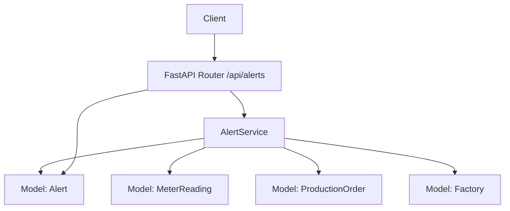
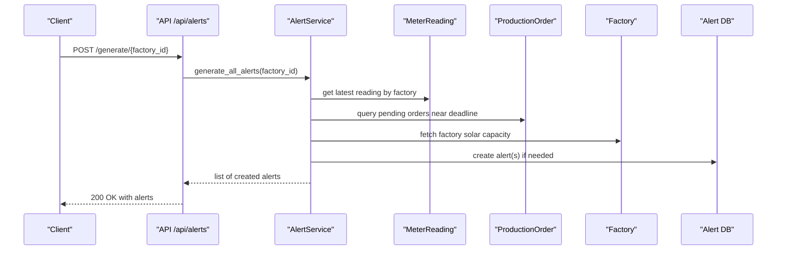
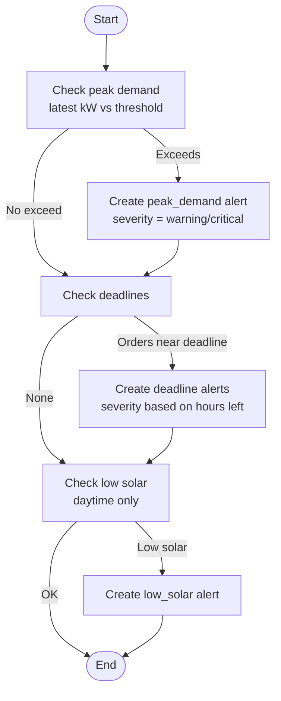
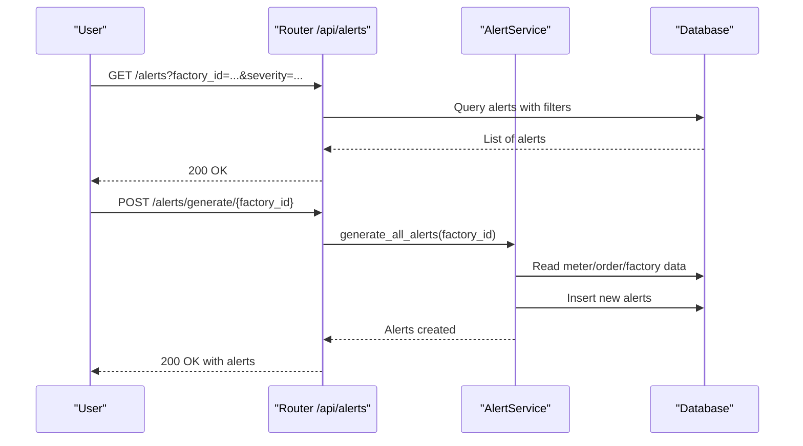
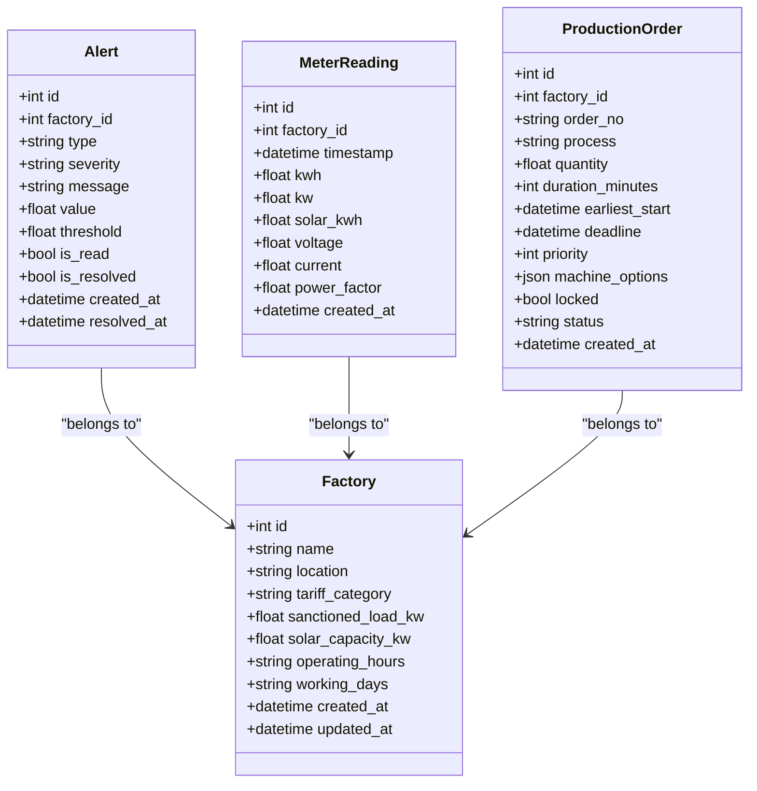
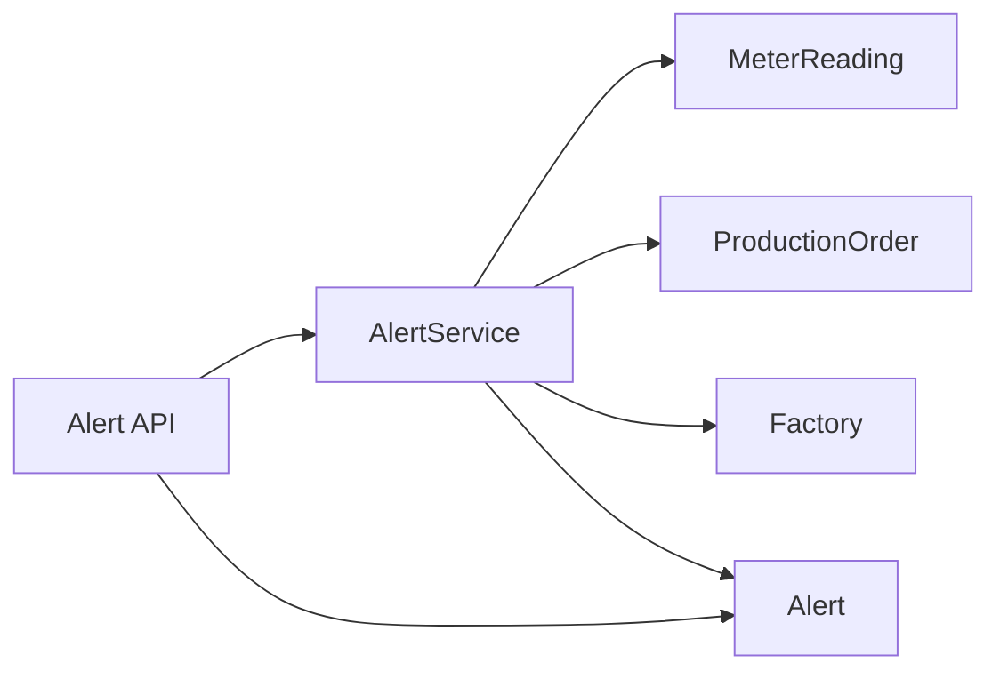

# Alert Service

<cite>
**Referenced Files in This Document**
- [alert_service.py](file://backend/app/services/alert_service.py)
- [alert.py](file://backend/app/api/alert.py)
- [alert.py](file://backend/app/models/alert.py)
- [alert.py](file://backend/app/schemas/alert.py)
- [meter_reading.py](file://backend/app/models/meter_reading.py)
- [production_order.py](file://backend/app/models/production_order.py)
- [factory.py](file://backend/app/models/factory.py)
- [main.py](file://backend/main.py)
</cite>

## Table of Contents
1. [Introduction](#introduction)
2. [Project Structure](#project-structure)
3. [Core Components](#core-components)
4. [Architecture Overview](#architecture-overview)
5. [Detailed Component Analysis](#detailed-component-analysis)
6. [Dependency Analysis](#dependency-analysis)
7. [Performance Considerations](#performance-considerations)
8. [Troubleshooting Guide](#troubleshooting-guide)
9. [Conclusion](#conclusion)
10. [Appendices](#appendices)

## Introduction
This document describes the Alert Service that proactively monitors production schedules, energy consumption patterns, and system metrics to generate actionable alerts. It covers alert generation algorithms, notification triggers, escalation mechanisms, alert types, severity levels, API endpoints for managing alerts, and operational considerations such as filtering, deduplication, and performance.

The service focuses on:
- Deadline warnings for pending production orders
- Peak demand limit exceedances based on meter readings
- Solar generation anomalies during daytime hours

Alerts are persisted with metadata (type, severity, value, threshold), support filtering and resolution workflows, and can be generated via a dedicated API endpoint.

## Project Structure
The Alert Service is implemented as part of the backend FastAPI application. Key components include:
- API layer exposing endpoints for listing, generating, updating, and retrieving alert statistics
- Service layer implementing alert detection logic
- Data models representing alerts, meter readings, production orders, and factories
- Application bootstrap registering routers and middleware

**Diagram sources**
- [alert.py:1-107](file://backend/app/api/alert.py#L1-L107)
- [alert_service.py:1-140](file://backend/app/services/alert_service.py#L1-L140)
- [alert.py:1-18](file://backend/app/models/alert.py#L1-L18)
- [meter_reading.py:1-17](file://backend/app/models/meter_reading.py#L1-L17)
- [production_order.py:1-20](file://backend/app/models/production_order.py#L1-L20)
- [factory.py:1-17](file://backend/app/models/factory.py#L1-L17)

**Section sources**
- [main.py:48-58](file://backend/main.py#L48-L58)
- [alert.py:12-12](file://backend/app/api/alert.py#L12-L12)

## Core Components
- Alert model: Stores alert records with fields for type, severity, message, value, threshold, read/resolved flags, and timestamps.
- Alert schemas: Define request/response structures for creating, updating, and returning alerts.
- Alert service: Implements detection algorithms for peak demand, deadline proximity, and low solar generation; includes deduplication checks.
- Alert API: Exposes endpoints to list, generate, update, and retrieve stats for alerts.

Key responsibilities:
- Detect conditions requiring attention using current data from meter readings and production orders
- Create alerts with appropriate severity and thresholds
- Prevent duplicate active alerts within defined windows or scopes
- Provide APIs for operators to manage alerts

**Section sources**
- [alert.py:5-18](file://backend/app/models/alert.py#L5-L18)
- [alert.py:5-28](file://backend/app/schemas/alert.py#L5-L28)
- [alert_service.py:16-140](file://backend/app/services/alert_service.py#L16-L140)
- [alert.py:14-107](file://backend/app/api/alert.py#L14-L107)

## Architecture Overview
The Alert Service integrates with existing domain models to monitor factory operations:
- Reads latest meter readings to evaluate peak demand and solar generation
- Queries pending production orders to detect upcoming deadlines
- Persists alerts and exposes management endpoints

**Diagram sources**
- [alert.py:35-43](file://backend/app/api/alert.py#L35-L43)
- [alert_service.py:124-140](file://backend/app/services/alert_service.py#L124-L140)
- [meter_reading.py:5-17](file://backend/app/models/meter_reading.py#L5-L17)
- [production_order.py:5-20](file://backend/app/models/production_order.py#L5-L20)
- [factory.py:5-17](file://backend/app/models/factory.py#L5-L17)
- [alert.py:5-18](file://backend/app/models/alert.py#L5-L18)

## Detailed Component Analysis

### Alert Model and Schemas
- Alert model defines persistence schema including type, severity, value/threshold, and lifecycle flags.
- Schemas define:
  - AlertBase: core fields shared across create/update/response
  - AlertCreate: minimal creation payload
  - AlertUpdate: partial updates for read/resolved status
  - AlertResponse: full response shape including IDs and timestamps

These ensure consistent validation and clear contracts between API consumers and the service.

**Section sources**
- [alert.py:5-18](file://backend/app/models/alert.py#L5-L18)
- [alert.py:5-28](file://backend/app/schemas/alert.py#L5-L28)

### Alert Service Algorithms
- Peak demand check:
  - Retrieves the latest meter reading per factory
  - Compares instantaneous power (kW) against a configurable threshold
  - Escalates severity to critical when exceeding a higher multiplier of the threshold
  - Deduplicates by checking for an unresolved alert of the same type within a recent time window
- Deadline check:
  - Finds pending orders with deadlines within a configured look-ahead window
  - Computes hours remaining to determine severity (critical vs warning)
  - Deduplicates by matching order number in the alert message and unresolved state
- Low solar generation check:
  - Only runs during daytime hours
  - Compares latest solar_kwh against a minimum threshold
  - Uses factory’s solar capacity for context in the alert message
- Aggregation:
  - Orchestrates all checks and returns a consolidated list of newly created alerts

**Diagram sources**
- [alert_service.py:19-50](file://backend/app/services/alert_service.py#L19-L50)
- [alert_service.py:52-91](file://backend/app/services/alert_service.py#L52-L91)
- [alert_service.py:93-122](file://backend/app/services/alert_service.py#L93-L122)
- [alert_service.py:124-140](file://backend/app/services/alert_service.py#L124-L140)

**Section sources**
- [alert_service.py:19-50](file://backend/app/services/alert_service.py#L19-L50)
- [alert_service.py:52-91](file://backend/app/services/alert_service.py#L52-L91)
- [alert_service.py:93-122](file://backend/app/services/alert_service.py#L93-L122)
- [alert_service.py:124-140](file://backend/app/services/alert_service.py#L124-L140)

### API Endpoints
- List alerts: GET /api/alerts
  - Filters: factory_id, severity, is_resolved
  - Pagination: limit parameter
  - Requires authentication
- Generate alerts: POST /api/alerts/generate/{factory_id}
  - Triggers all detection rules for a factory
  - Requires manager role
- Unresolved alerts: GET /api/alerts/unresolved/{factory_id}
  - Returns unresolved alerts sorted by severity then recency
- Update alert: PUT /api/alerts/{alert_id}
  - Updates read/resolved status; sets resolved_at when marking resolved
  - Requires manager role
- Stats: GET /api/alerts/stats/{factory_id}
  - Returns counts for total, unresolved, critical, and resolved

**Diagram sources**
- [alert.py:14-33](file://backend/app/api/alert.py#L14-L33)
- [alert.py:35-43](file://backend/app/api/alert.py#L35-L43)
- [alert.py:45-57](file://backend/app/api/alert.py#L45-L57)
- [alert.py:59-80](file://backend/app/api/alert.py#L59-L80)
- [alert.py:82-107](file://backend/app/api/alert.py#L82-L107)
- [alert_service.py:124-140](file://backend/app/services/alert_service.py#L124-L140)

**Section sources**
- [alert.py:14-33](file://backend/app/api/alert.py#L14-L33)
- [alert.py:35-43](file://backend/app/api/alert.py#L35-L43)
- [alert.py:45-57](file://backend/app/api/alert.py#L45-L57)
- [alert.py:59-80](file://backend/app/api/alert.py#L59-L80)
- [alert.py:82-107](file://backend/app/api/alert.py#L82-L107)

### Monitoring Inputs and Data Sources
- Meter readings: Latest kW and solar_kwh values drive peak demand and solar anomaly checks
- Production orders: Pending orders with upcoming deadlines trigger deadline alerts
- Factories: Solar capacity informs low solar generation messages

**Diagram sources**
- [alert.py:5-18](file://backend/app/models/alert.py#L5-L18)
- [meter_reading.py:5-17](file://backend/app/models/meter_reading.py#L5-L17)
- [production_order.py:5-20](file://backend/app/models/production_order.py#L5-L20)
- [factory.py:5-17](file://backend/app/models/factory.py#L5-L17)

**Section sources**
- [meter_reading.py:5-17](file://backend/app/models/meter_reading.py#L5-L17)
- [production_order.py:5-20](file://backend/app/models/production_order.py#L5-L20)
- [factory.py:5-17](file://backend/app/models/factory.py#L5-L17)

### Alert Types, Severity, and Resolution Workflow
- Alert types:
  - peak_demand: Instantaneous power exceeds configured threshold
  - deadline: Pending order approaching its deadline
  - low_solar: Solar generation below expected during daytime
- Severity levels:
  - info, warning, critical (default warning)
  - Dynamic escalation:
    - Peak demand becomes critical when exceeding a higher multiplier of the threshold
    - Deadline becomes critical when fewer than a set number of hours remain
- Resolution workflow:
  - Mark alert as resolved via update endpoint
  - System sets resolved_at timestamp automatically upon resolution
  - Unresolved alerts are prioritized by severity and recency

**Section sources**
- [alert.py:5-18](file://backend/app/models/alert.py#L5-L18)
- [alert_service.py:19-50](file://backend/app/services/alert_service.py#L19-L50)
- [alert_service.py:52-91](file://backend/app/services/alert_service.py#L52-L91)
- [alert_service.py:93-122](file://backend/app/services/alert_service.py#L93-L122)
- [alert.py:59-80](file://backend/app/api/alert.py#L59-L80)

### Notification Channels and External Integrations
- Current implementation persists alerts and provides APIs for retrieval and management.
- No built-in external notification channels (e.g., email, SMS, webhooks) are present in the analyzed code.
- Integration points:
  - Consumers can poll the alert APIs to push notifications through external systems
  - Future enhancements could add outbound integrations triggered by alert creation or updates

[No sources needed since this section summarizes integration possibilities without analyzing specific files]

### Alert Configuration and Custom Rules
- Configurable parameters observed in the service:
  - Peak demand threshold (default provided in function signature)
  - Deadline look-ahead window in hours (default provided in function signature)
  - Minimum solar generation threshold (default provided in function signature)
- Extensibility:
  - New alert types can be added by extending the service with additional checks
  - Thresholds can be parameterized or sourced from configuration for different factories

**Section sources**
- [alert_service.py:19-50](file://backend/app/services/alert_service.py#L19-L50)
- [alert_service.py:52-91](file://backend/app/services/alert_service.py#L52-L91)
- [alert_service.py:93-122](file://backend/app/services/alert_service.py#L93-L122)

### Triggering Mechanisms
- Manual trigger:
  - POST /api/alerts/generate/{factory_id} invokes all checks for a given factory
- Automated scheduling:
  - No background scheduler is present in the analyzed code; periodic execution would require adding a task scheduler or cron job to call the generate endpoint

**Section sources**
- [alert.py:35-43](file://backend/app/api/alert.py#L35-L43)
- [main.py:48-58](file://backend/main.py#L48-L58)

## Dependency Analysis
The Alert Service depends on:
- Database session for querying and persisting data
- Models for meter readings, production orders, factories, and alerts
- Authentication/authorization middleware for protected endpoints

**Diagram sources**
- [alert.py:1-107](file://backend/app/api/alert.py#L1-L107)
- [alert_service.py:1-140](file://backend/app/services/alert_service.py#L1-L140)
- [meter_reading.py:1-17](file://backend/app/models/meter_reading.py#L1-L17)
- [production_order.py:1-20](file://backend/app/models/production_order.py#L1-L20)
- [factory.py:1-17](file://backend/app/models/factory.py#L1-L17)
- [alert.py:1-18](file://backend/app/models/alert.py#L1-L18)

**Section sources**
- [alert.py:1-107](file://backend/app/api/alert.py#L1-L107)
- [alert_service.py:1-140](file://backend/app/services/alert_service.py#L1-L140)

## Performance Considerations
- Query efficiency:
  - Latest meter reading queries use ordering by timestamp descending and limiting to one row
  - Deadline checks filter by factory, status, and deadline range to reduce result sets
- Deduplication:
  - Peak demand alerts avoid duplicates within a short time window
  - Deadline alerts avoid duplicates by matching order number in message and unresolved state
- Batch operations:
  - Multiple alerts can be created in a single transaction when deadline alerts are batched
- Recommendations:
  - Add indexes on frequently filtered columns (e.g., factory_id, timestamp, status)
  - Consider caching recent meter readings for repeated checks
  - Introduce rate limiting on the generate endpoint to prevent excessive re-evaluation

[No sources needed since this section provides general guidance]

## Troubleshooting Guide
Common issues and resolutions:
- No alerts generated:
  - Ensure meter readings exist and have valid kW/solar_kwh values
  - Verify production orders are pending and have deadlines within the look-ahead window
  - Confirm the generate endpoint is called with the correct factory_id
- Duplicate alerts:
  - Check deduplication logic windows and message matching
  - Validate that alerts are marked resolved after remediation
- Unauthorized access:
  - Ensure proper authentication and roles (manager for write operations)
- Data inconsistencies:
  - Validate that factory has solar capacity configured for solar checks
  - Confirm timezone consistency for timestamps

**Section sources**
- [alert_service.py:19-50](file://backend/app/services/alert_service.py#L19-L50)
- [alert_service.py:52-91](file://backend/app/services/alert_service.py#L52-L91)
- [alert_service.py:93-122](file://backend/app/services/alert_service.py#L93-L122)
- [alert.py:35-43](file://backend/app/api/alert.py#L35-L43)
- [alert.py:59-80](file://backend/app/api/alert.py#L59-L80)

## Conclusion
The Alert Service provides robust, rule-based monitoring for peak demand, deadline proximity, and solar generation anomalies. It persists structured alerts with clear severity and supports filtering, resolution, and statistics. While external notifications are not implemented in the analyzed code, the API-first design enables straightforward integration with downstream notification systems. Operational best practices include indexing, deduplication, and scheduled invocations to ensure timely and efficient alerting.

[No sources needed since this section summarizes without analyzing specific files]

## Appendices

### API Reference Summary
- GET /api/alerts
  - Query params: factory_id, severity, is_resolved, limit
  - Response: List of alerts
- POST /api/alerts/generate/{factory_id}
  - Body: none
  - Response: List of newly created alerts
- GET /api/alerts/unresolved/{factory_id}
  - Response: List of unresolved alerts
- PUT /api/alerts/{alert_id}
  - Body: AlertUpdate (is_read, is_resolved)
  - Response: Updated alert
- GET /api/alerts/stats/{factory_id}
  - Response: Counts for total, unresolved, critical, resolved

**Section sources**
- [alert.py:14-33](file://backend/app/api/alert.py#L14-L33)
- [alert.py:35-43](file://backend/app/api/alert.py#L35-L43)
- [alert.py:45-57](file://backend/app/api/alert.py#L45-L57)
- [alert.py:59-80](file://backend/app/api/alert.py#L59-L80)
- [alert.py:82-107](file://backend/app/api/alert.py#L82-L107)