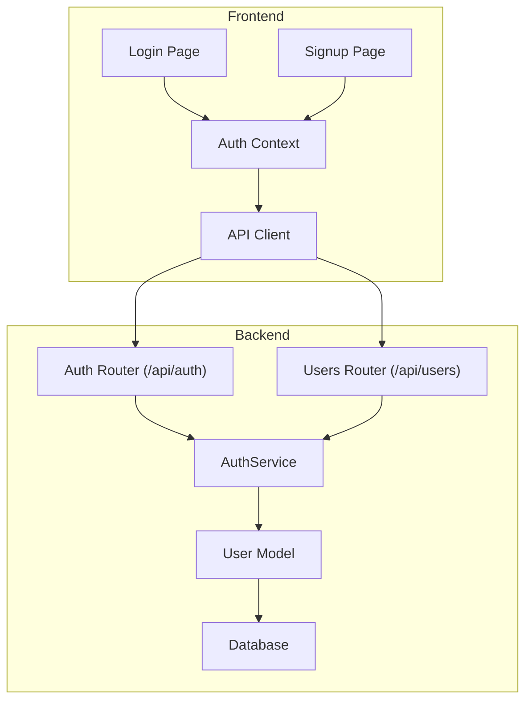
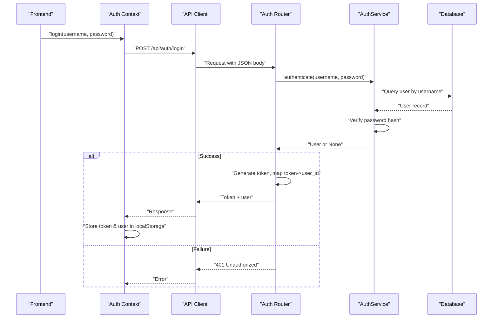
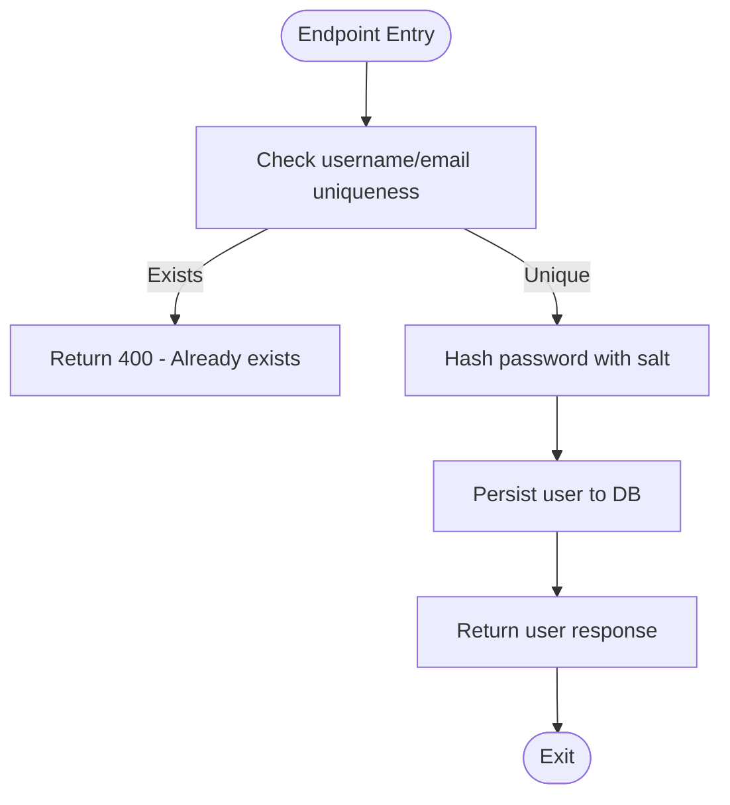
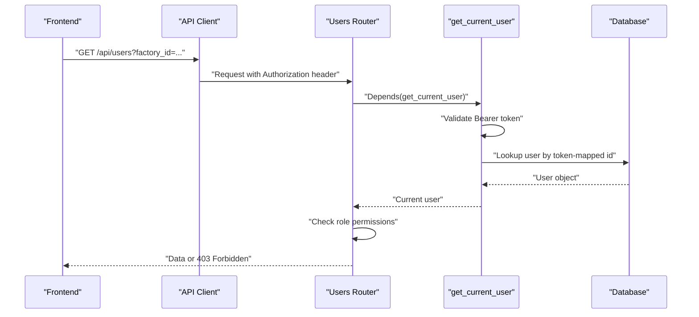
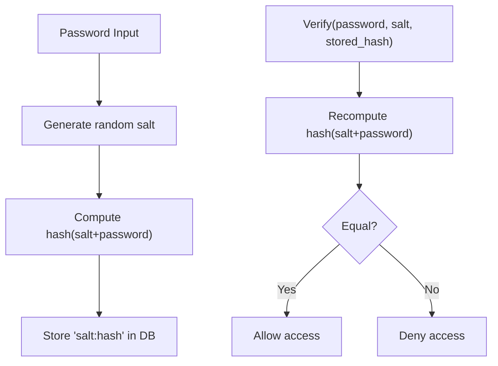
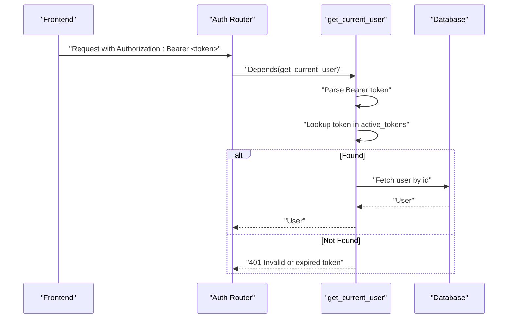
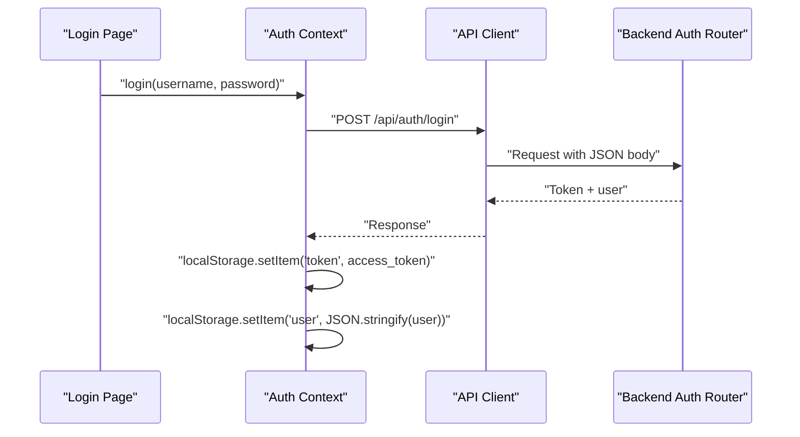
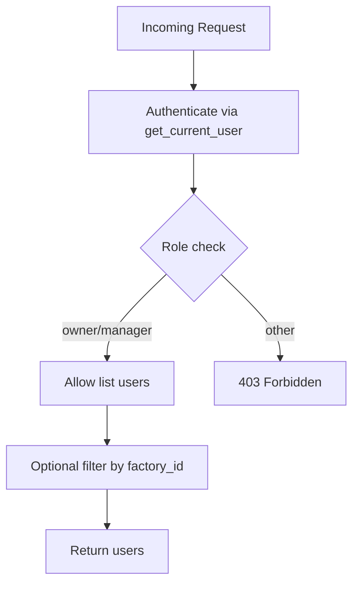
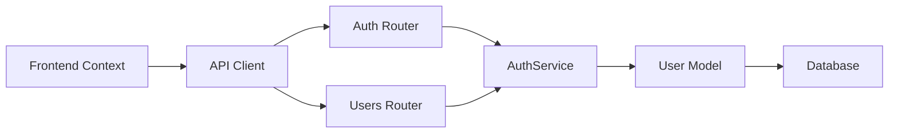

# Authentication Service

<cite>
**Referenced Files in This Document**
- [auth.py](file://backend/app/api/auth.py)
- [auth_service.py](file://backend/app/services/auth.py)
- [user_model.py](file://backend/app/models/user.py)
- [user_schemas.py](file://backend/app/schemas/user.py)
- [users_api.py](file://backend/app/api/users.py)
- [database.py](file://backend/app/core/database.py)
- [config.py](file://backend/app/core/config.py)
- [auth_context.tsx](file://frontend/context/auth_context.tsx)
- [api_client.ts](file://frontend/lib/api.ts)
- [login_page.tsx](file://frontend/app/(auth)/login/page.tsx)
- [signup_page.tsx](file://frontend/app/(auth)/signup/page.tsx)
- [test_auth.py](file://backend/test_auth.py)
</cite>

## Table of Contents
1. [Introduction](#introduction)
2. [Project Structure](#project-structure)
3. [Core Components](#core-components)
4. [Architecture Overview](#architecture-overview)
5. [Detailed Component Analysis](#detailed-component-analysis)
6. [Dependency Analysis](#dependency-analysis)
7. [Performance Considerations](#performance-considerations)
8. [Troubleshooting Guide](#troubleshooting-guide)
9. [Conclusion](#conclusion)
10. [Appendices](#appendices)

## Introduction
This document provides comprehensive documentation for the Authentication Service that handles user registration, login/logout, token management, and role-based authorization. It explains security implementations including password hashing, session/token handling, access control mechanisms, and the integration between backend APIs and frontend authentication context. It also covers API methods for authentication flows, token refresh strategies, security best practices, common vulnerabilities and mitigations, compliance considerations, and examples for implementing protected routes and role-based access control.

## Project Structure
The authentication system spans both backend (FastAPI) and frontend (Next.js). The backend exposes REST endpoints under /api/auth and uses a service layer for authentication logic, SQLAlchemy models for persistence, and Pydantic schemas for request/response validation. The frontend manages authentication state via a React context, persists tokens locally, and attaches Authorization headers to API calls.

**Diagram sources**
- [auth.py:10-89](file://backend/app/api/auth.py#L10-L89)
- [users_api.py:12-109](file://backend/app/api/users.py#L12-L109)
- [auth_service.py:8-53](file://backend/app/services/auth.py#L8-L53)
- [user_model.py:5-16](file://backend/app/models/user.py#L5-L16)
- [auth_context.tsx:19-88](file://frontend/context/auth_context.tsx#L19-L88)
- [api_client.ts:7-49](file://frontend/lib/api.ts#L7-L49)

**Section sources**
- [auth.py:10-89](file://backend/app/api/auth.py#L10-L89)
- [users_api.py:12-109](file://backend/app/api/users.py#L12-L109)
- [auth_service.py:8-53](file://backend/app/services/auth.py#L8-L53)
- [user_model.py:5-16](file://backend/app/models/user.py#L5-L16)
- [auth_context.tsx:19-88](file://frontend/context/auth_context.tsx#L19-L88)
- [api_client.ts:7-49](file://frontend/lib/api.ts#L7-L49)

## Core Components
- Auth Router: Exposes endpoints for register, login, logout, and dependency functions for current user and role checks.
- AuthService: Implements password hashing/verification, user creation, and authentication.
- User Model: Defines the persisted user entity with fields like username, email, password_hash, role, factory_id, is_active, timestamps.
- Schemas: Define request/response structures for user creation, login, responses, and tokens.
- Users Router: Demonstrates protected endpoints using dependencies for authentication and role-based authorization.
- Frontend Auth Context: Manages login/register flows, stores tokens and user info in localStorage, and exposes helper methods.
- API Client: Attaches Authorization header to requests and normalizes error handling.

Key responsibilities:
- Registration: Validate uniqueness, hash password, persist user.
- Login: Authenticate credentials, generate token, store mapping server-side.
- Logout: Invalidate token from server-side storage.
- Authorization: Enforce roles on protected endpoints.

**Section sources**
- [auth.py:15-89](file://backend/app/api/auth.py#L15-L89)
- [auth_service.py:11-53](file://backend/app/services/auth.py#L11-L53)
- [user_model.py:5-16](file://backend/app/models/user.py#L5-L16)
- [user_schemas.py:5-30](file://backend/app/schemas/user.py#L5-L30)
- [users_api.py:17-109](file://backend/app/api/users.py#L17-L109)
- [auth_context.tsx:19-88](file://frontend/context/auth_context.tsx#L19-L88)
- [api_client.ts:7-49](file://frontend/lib/api.ts#L7-L49)

## Architecture Overview
The authentication flow integrates FastAPI routers, service logic, database persistence, and frontend state management. Tokens are stored in-memory on the server and in localStorage on the client. Role-based access control is enforced via FastAPI dependencies.

**Diagram sources**
- [auth.py:37-52](file://backend/app/api/auth.py#L37-L52)
- [auth_service.py:40-53](file://backend/app/services/auth.py#L40-L53)
- [api_client.ts:7-49](file://frontend/lib/api.ts#L7-L49)
- [auth_context.tsx:35-44](file://frontend/context/auth_context.tsx#L35-L44)

**Section sources**
- [auth.py:37-52](file://backend/app/api/auth.py#L37-L52)
- [auth_service.py:40-53](file://backend/app/services/auth.py#L40-L53)
- [api_client.ts:7-49](file://frontend/lib/api.ts#L7-L49)
- [auth_context.tsx:35-44](file://frontend/context/auth_context.tsx#L35-L44)

## Detailed Component Analysis

### Authentication Endpoints (Register, Login, Logout)
- Register: Validates unique username/email, creates user with hashed password, returns user response.
- Login: Authenticates user, generates a random token, maps token to user id in memory, returns token and user.
- Logout: Reads Authorization header, removes token from in-memory store if present.

Security notes:
- Passwords are hashed with salt before storage.
- Token generation uses secure random.
- In-memory token store is not persistent across restarts; suitable for development but not production.

**Diagram sources**
- [auth.py:15-35](file://backend/app/api/auth.py#L15-L35)
- [auth_service.py:25-38](file://backend/app/services/auth.py#L25-L38)

**Section sources**
- [auth.py:15-35](file://backend/app/api/auth.py#L15-L35)
- [auth_service.py:25-38](file://backend/app/services/auth.py#L25-L38)

### Current User and Role-Based Access Control
- get_current_user: Extracts Bearer token from Authorization header, validates against in-memory store, retrieves user from DB.
- require_role: Dependency wrapper that enforces specific role or allows owner override.

Protected usage example:
- Users endpoint requires owner/manager roles explicitly checked after authentication.

**Diagram sources**
- [auth.py:63-89](file://backend/app/api/auth.py#L63-L89)
- [users_api.py:17-31](file://backend/app/api/users.py#L17-L31)

**Section sources**
- [auth.py:63-89](file://backend/app/api/auth.py#L63-L89)
- [users_api.py:17-31](file://backend/app/api/users.py#L17-L31)

### Password Hashing and Verification
- Uses SHA-256 with a per-user random salt. Salt and hash are stored together in a single field separated by a delimiter.
- Verification recomputes hash with stored salt and compares.

Recommendation:
- For production, consider bcrypt or argon2 for stronger resistance to brute-force attacks.

**Diagram sources**
- [auth_service.py:11-23](file://backend/app/services/auth.py#L11-L23)
- [auth_service.py:25-38](file://backend/app/services/auth.py#L25-L38)

**Section sources**
- [auth_service.py:11-23](file://backend/app/services/auth.py#L11-L23)
- [auth_service.py:25-38](file://backend/app/services/auth.py#L25-L38)

### Token Management and Session Handling
- Login generates a random token and stores mapping token -> user_id in an in-memory dictionary.
- get_current_user validates token presence and existence in the dictionary, then fetches user from DB.
- Logout removes token from the dictionary.

Limitations:
- In-memory store does not survive process restarts and is not shared across processes.
- No token expiration or refresh mechanism implemented.

**Diagram sources**
- [auth.py:12-13](file://backend/app/api/auth.py#L12-L13)
- [auth.py:37-52](file://backend/app/api/auth.py#L37-L52)
- [auth.py:54-61](file://backend/app/api/auth.py#L54-L61)
- [auth.py:63-81](file://backend/app/api/auth.py#L63-L81)

**Section sources**
- [auth.py:12-13](file://backend/app/api/auth.py#L12-L13)
- [auth.py:37-52](file://backend/app/api/auth.py#L37-L52)
- [auth.py:54-61](file://backend/app/api/auth.py#L54-L61)
- [auth.py:63-81](file://backend/app/api/auth.py#L63-L81)

### Frontend Authentication Context and API Integration
- Auth Context stores token and user in localStorage, exposes login/register/logout methods, and initializes state from storage.
- API Client automatically attaches Authorization header when token exists and normalizes errors based on HTTP status codes.

**Diagram sources**
- [auth_context.tsx:35-44](file://frontend/context/auth_context.tsx#L35-L44)
- [api_client.ts:7-49](file://frontend/lib/api.ts#L7-L49)
- [auth.py:37-52](file://backend/app/api/auth.py#L37-L52)

**Section sources**
- [auth_context.tsx:35-44](file://frontend/context/auth_context.tsx#L35-L44)
- [api_client.ts:7-49](file://frontend/lib/api.ts#L7-L49)
- [auth.py:37-52](file://backend/app/api/auth.py#L37-L52)

### Protected Routes and Role-Based Access Control Examples
- Users listing requires owner/manager roles.
- Invite user requires owner/manager roles and prevents managers from creating owners.
- Delete user requires owner/manager roles and prevents self-deletion and manager deleting owners.
- Update user role restricted to owners only.

**Diagram sources**
- [users_api.py:17-31](file://backend/app/api/users.py#L17-L31)

**Section sources**
- [users_api.py:17-31](file://backend/app/api/users.py#L17-L31)

## Dependency Analysis
The authentication system has clear separation of concerns:
- Routers depend on services for business logic.
- Services depend on models and database sessions.
- Frontend depends on context and API client for state and network communication.

**Diagram sources**
- [auth.py:1-89](file://backend/app/api/auth.py#L1-L89)
- [users_api.py:1-109](file://backend/app/api/users.py#L1-L109)
- [auth_service.py:1-53](file://backend/app/services/auth.py#L1-L53)
- [user_model.py:1-16](file://backend/app/models/user.py#L1-L16)
- [auth_context.tsx:1-88](file://frontend/context/auth_context.tsx#L1-L88)
- [api_client.ts:1-71](file://frontend/lib/api.ts#L1-L71)

**Section sources**
- [auth.py:1-89](file://backend/app/api/auth.py#L1-L89)
- [users_api.py:1-109](file://backend/app/api/users.py#L1-L109)
- [auth_service.py:1-53](file://backend/app/services/auth.py#L1-L53)
- [user_model.py:1-16](file://backend/app/models/user.py#L1-L16)
- [auth_context.tsx:1-88](file://frontend/context/auth_context.tsx#L1-L88)
- [api_client.ts:1-71](file://frontend/lib/api.ts#L1-L71)

## Performance Considerations
- In-memory token store: Fast but non-persistent and not scalable across multiple processes. For production, use a distributed cache (e.g., Redis) with TTL for tokens.
- Password hashing: SHA-256 is fast; consider slower algorithms (bcrypt/argon2) to mitigate brute-force attacks at the cost of CPU time.
- Database queries: Ensure indexes on username and email for faster lookups.
- Token size: Random tokens are short-lived; implement expiration and refresh to reduce long-lived token risks.

[No sources needed since this section provides general guidance]

## Troubleshooting Guide
Common issues and resolutions:
- Invalid or expired token: Ensure Authorization header includes Bearer token and that the token exists in active_tokens. Implement token refresh and expiration handling.
- Permission denied (403): Verify user role meets endpoint requirements. Use require_role or explicit role checks.
- Duplicate user registration: Check uniqueness constraints on username/email.
- Login failures: Confirm credentials match stored hash and salt format.

Operational tips:
- Add logging around authentication attempts and failures.
- Implement rate limiting on login/register endpoints to prevent abuse.
- Centralize error messages and ensure consistent client handling.

**Section sources**
- [auth.py:63-81](file://backend/app/api/auth.py#L63-L81)
- [users_api.py:17-31](file://backend/app/api/users.py#L17-L31)
- [api_client.ts:27-49](file://frontend/lib/api.ts#L27-L49)

## Conclusion
The Authentication Service provides a functional foundation for user registration, login/logout, token management, and role-based authorization. While suitable for development, production deployments should adopt robust token storage with expiration, stronger password hashing, centralized session management, and comprehensive security controls such as rate limiting, CSRF protection, and secure cookie handling. Frontend integration is straightforward with context-driven state and automatic header injection.

[No sources needed since this section summarizes without analyzing specific files]

## Appendices

### API Methods Summary
- POST /api/auth/register: Create a new user with hashed password.
- POST /api/auth/login: Authenticate and return token plus user.
- POST /api/auth/logout: Invalidate token from server-side store.
- GET /api/users: List users (requires owner/manager).
- POST /api/users/invite: Invite a new user (requires owner/manager).
- DELETE /api/users/{user_id}: Delete a user (requires owner/manager).
- PUT /api/users/{user_id}/role: Update user role (requires owner).

**Section sources**
- [auth.py:15-61](file://backend/app/api/auth.py#L15-L61)
- [users_api.py:17-109](file://backend/app/api/users.py#L17-L109)

### Security Best Practices
- Replace in-memory token store with secure, persistent session store with expiration.
- Use bcrypt or argon2 for password hashing.
- Enforce HTTPS everywhere.
- Implement rate limiting on auth endpoints.
- Add CSRF protection for state-changing operations.
- Sanitize and validate all inputs.
- Log security events and monitor anomalies.

[No sources needed since this section provides general guidance]

### Compliance Considerations
- Data minimization: Only store necessary user data.
- Secure storage: Encrypt sensitive fields at rest where appropriate.
- Audit trails: Record login/logout and privilege changes.
- Privacy controls: Provide mechanisms for users to view/update/delete their data.
- Regulatory alignment: Align with applicable data protection regulations.

[No sources needed since this section provides general guidance]

### Example: Protected Route Implementation
- Use get_current_user dependency to enforce authentication.
- Apply require_role or explicit role checks to restrict actions.
- Handle unauthorized and forbidden responses consistently.

**Section sources**
- [auth.py:63-89](file://backend/app/api/auth.py#L63-L89)
- [users_api.py:17-31](file://backend/app/api/users.py#L17-L31)

### Example: Token Refresh Strategy
- Issue short-lived access tokens with expiration.
- Maintain refresh tokens securely (httpOnly cookies or secure storage).
- On access token expiry, use refresh token to obtain a new access token.
- Revoke refresh tokens on logout or suspicious activity.

[No sources needed since this section provides general guidance]

### Testing Authentication Flows
- Use provided test script to verify register and login endpoints.
- Validate error cases like duplicate registration and invalid credentials.
- Test role-based access by switching roles and checking 403 responses.

**Section sources**
- [test_auth.py:1-24](file://backend/test_auth.py#L1-L24)