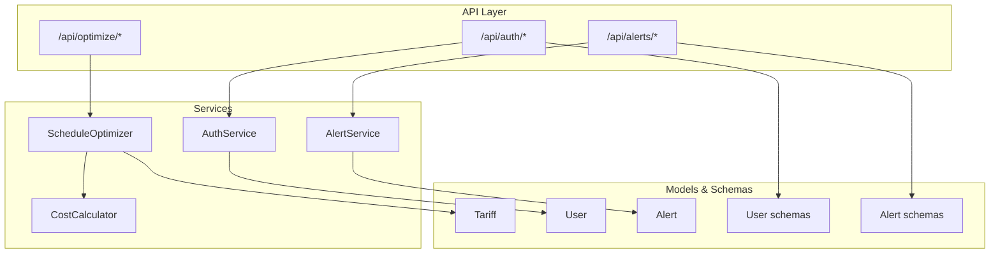
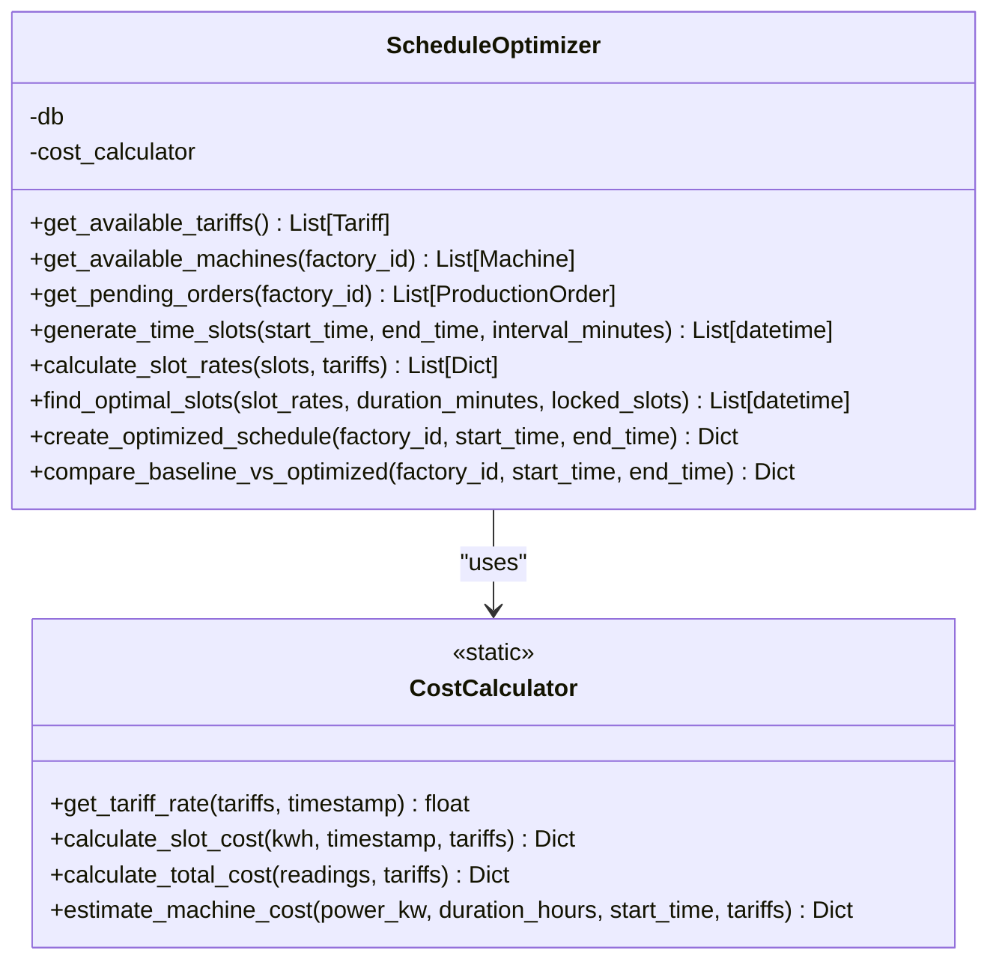
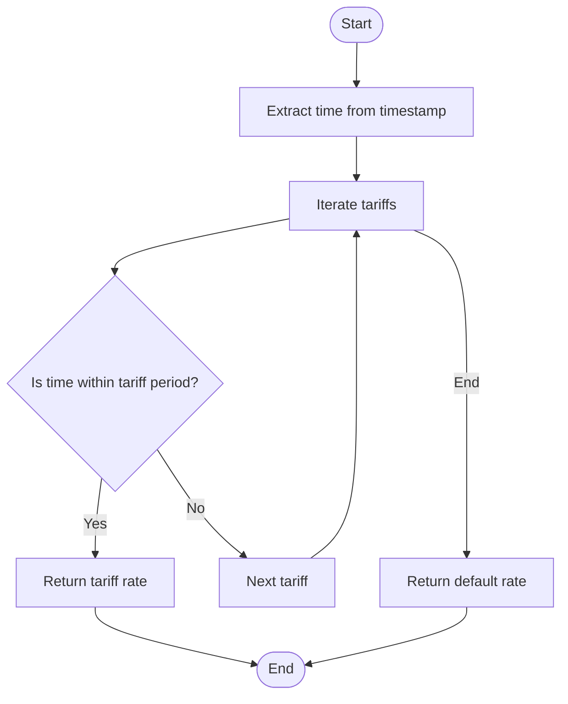
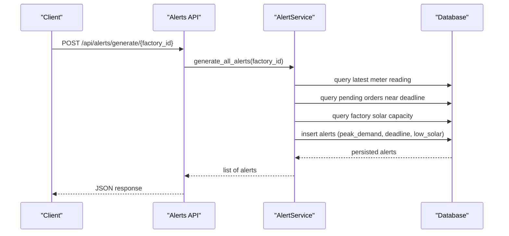
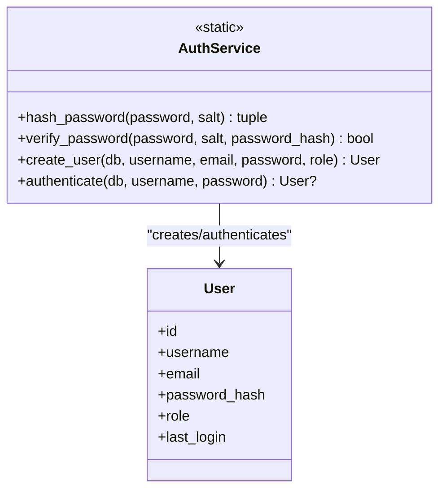
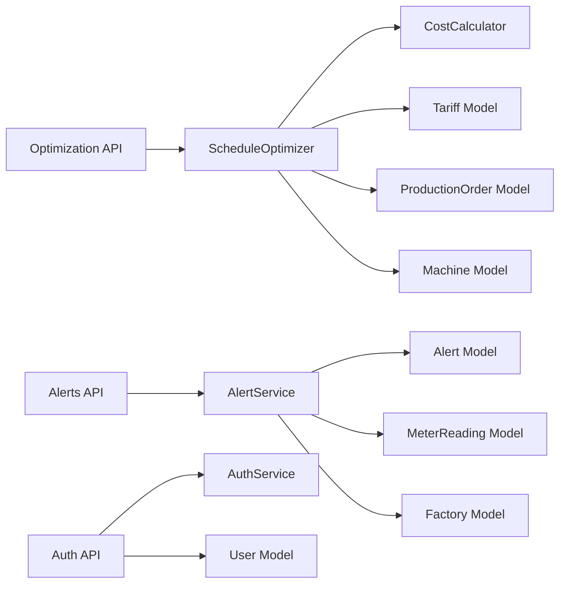

# Core Business Services

<cite>
**Referenced Files in This Document**
- [optimizer.py](file://backend/app/services/optimizer.py)
- [cost_calculator.py](file://backend/app/services/cost_calculator.py)
- [alert_service.py](file://backend/app/services/alert_service.py)
- [auth.py](file://backend/app/services/auth.py)
- [optimization.py](file://backend/app/api/optimization.py)
- [alert.py](file://backend/app/api/alert.py)
- [auth_api.py](file://backend/app/api/auth.py)
- [tariff_model.py](file://backend/app/models/tariff.py)
- [user_model.py](file://backend/app/models/user.py)
- [alert_model.py](file://backend/app/models/alert.py)
- [user_schema.py](file://backend/app/schemas/user.py)
- [alert_schema.py](file://backend/app/schemas/alert.py)
</cite>

## Table of Contents
1. [Introduction](#introduction)
2. [Project Structure](#project-structure)
3. [Core Components](#core-components)
4. [Architecture Overview](#architecture-overview)
5. [Detailed Component Analysis](#detailed-component-analysis)
6. [Dependency Analysis](#dependency-analysis)
7. [Performance Considerations](#performance-considerations)
8. [Troubleshooting Guide](#troubleshooting-guide)
9. [Conclusion](#conclusion)
10. [Appendices](#appendices)

## Introduction
This document describes TariffGuard’s core business services that power AI-driven production scheduling, energy cost computation, proactive alerting, and user authentication with role-based authorization. It explains algorithms, input/output specifications, performance characteristics, integration patterns, configuration options, and error handling strategies. The goal is to help developers and operators understand how the system schedules production during low-cost tariff windows, computes accurate energy expenses (including solar offsets), generates actionable alerts, and secures access via tokens and roles.

## Project Structure
The backend exposes FastAPI endpoints that delegate to service modules:
- Schedule Optimization: API routes under optimization call the ScheduleOptimizer service.
- Cost Calculation: Used by optimizer and available for meter reading analysis.
- Alert Service: Generates and persists alerts based on thresholds and deadlines.
- Authentication: Handles registration, login/logout, token management, and role checks.



**Diagram sources**
- [optimization.py:11-48](file://backend/app/api/optimization.py#L11-L48)
- [alert.py:14-107](file://backend/app/api/alert.py#L14-L107)
- [auth_api.py:15-89](file://backend/app/api/auth.py#L15-L89)
- [optimizer.py:14-238](file://backend/app/services/optimizer.py#L14-L238)
- [cost_calculator.py:12-110](file://backend/app/services/cost_calculator.py#L12-L110)
- [alert_service.py:16-140](file://backend/app/services/alert_service.py#L16-L140)
- [auth.py:8-53](file://backend/app/services/auth.py#L8-L53)
- [tariff_model.py:5-19](file://backend/app/models/tariff.py#L5-L19)
- [user_model.py:5-16](file://backend/app/models/user.py#L5-L16)
- [alert_model.py:5-18](file://backend/app/models/alert.py#L5-L18)
- [user_schema.py:5-30](file://backend/app/schemas/user.py#L5-L30)
- [alert_schema.py:5-28](file://backend/app/schemas/alert.py#L5-L28)

**Section sources**
- [optimization.py:11-48](file://backend/app/api/optimization.py#L11-L48)
- [alert.py:14-107](file://backend/app/api/alert.py#L14-L107)
- [auth_api.py:15-89](file://backend/app/api/auth.py#L15-L89)

## Core Components
- Schedule Optimizer: Builds time slots, evaluates tariff rates, assigns orders to cheapest consecutive slots per machine, and compares baseline vs optimized costs.
- Cost Calculator: Determines applicable tariff rate at a timestamp, computes slot-level and total costs, and estimates machine run costs including solar offsets.
- Alert Service: Detects peak demand breaches, upcoming order deadlines, and low solar generation anomalies; persists alerts and provides stats.
- Authentication Service: Hashes/verifies passwords, creates users, authenticates logins, manages in-memory tokens, and enforces role-based access.

**Section sources**
- [optimizer.py:14-238](file://backend/app/services/optimizer.py#L14-L238)
- [cost_calculator.py:12-110](file://backend/app/services/cost_calculator.py#L12-L110)
- [alert_service.py:16-140](file://backend/app/services/alert_service.py#L16-L140)
- [auth.py:8-53](file://backend/app/services/auth.py#L8-L53)

## Architecture Overview
The system follows a layered architecture:
- API layer validates inputs and delegates to services.
- Services encapsulate business logic and interact with models via SQLAlchemy sessions.
- Models define persistent entities; schemas define request/response contracts.

```mermaid
sequenceDiagram
participant Client as "Client"
participant API as "FastAPI Router"
participant Opt as "ScheduleOptimizer"
participant Cost as "CostCalculator"
participant DB as "Database"
Client->>API : POST /api/optimize/schedule/{factory_id}
API->>Opt : create_optimized_schedule(factory_id, start_time, end_time)
Opt->>DB : query tariffs, machines, pending orders
Opt->>Opt : generate_time_slots()
Opt->>Cost : get_tariff_rate(tariffs, timestamp)
Cost-->>Opt : rate
Opt->>Opt : find_optimal_slots()
Opt-->>API : schedule + cost summary
API-->>Client : JSON response
```

**Diagram sources**
- [optimization.py:11-48](file://backend/app/api/optimization.py#L11-L48)
- [optimizer.py:97-190](file://backend/app/services/optimizer.py#L97-L190)
- [cost_calculator.py:15-33](file://backend/app/services/cost_calculator.py#L15-L33)

## Detailed Component Analysis

### Schedule Optimizer
Purpose:
- Generate hourly time slots within a window.
- Compute tariff rates per slot using CostCalculator.
- Assign each pending order to the cheapest consecutive slots on a suitable machine while avoiding conflicts.
- Provide baseline vs optimized comparison highlighting savings.

Key methods and responsibilities:
- Time slot generation and rate calculation.
- Consecutive slot selection excluding locked slots per machine.
- Order-to-machine matching by process type.
- Aggregation of estimated kWh and cost per order and overall.

Algorithm overview:
- Sort all slots by rate ascending.
- For each order, select the minimum number of consecutive slots equal to duration in hours, skipping locked slots already assigned to the same machine.
- Accumulate used slots per machine to prevent double booking.
- Compute per-order cost by summing power_kw × rate over selected slots.

Input/Output:
- Inputs: factory_id, start_time, end_time; internally uses tariffs, machines, and pending orders from DB.
- Outputs: schedule entries with order details, assigned machine, start/end times, slots, estimated cost/kWh, plus aggregate totals and average rate.

Performance characteristics:
- Complexity dominated by sorting slots O(n log n) and iterating orders and slots.
- Memory usage scales with number of slots and orders.
- Suitable for daily planning windows; consider batching or caching for very large factories.

Integration points:
- Uses CostCalculator for tariff lookup.
- Reads/writes via SQLAlchemy session for Tariff, Machine, ProductionOrder.

Error handling:
- Gracefully handles missing suitable machines by falling back to first available.
- Skips orders when no machine is found.

Configuration options:
- Interval_minutes defaults to 60 minutes for slot granularity.
- Locked slots per machine are enforced to avoid overlaps.

Usage example (conceptual):
- Call optimize endpoint with factory_id and optional time window; receive schedule and cost summary.

**Section sources**
- [optimizer.py:21-95](file://backend/app/services/optimizer.py#L21-L95)
- [optimizer.py:97-190](file://backend/app/services/optimizer.py#L97-L190)
- [optimizer.py:192-238](file://backend/app/services/optimizer.py#L192-L238)
- [optimization.py:11-48](file://backend/app/api/optimization.py#L11-L48)

#### Class Diagram


**Diagram sources**
- [optimizer.py:14-238](file://backend/app/services/optimizer.py#L14-L238)
- [cost_calculator.py:12-110](file://backend/app/services/cost_calculator.py#L12-L110)

### Cost Calculator
Purpose:
- Determine the applicable tariff rate for any timestamp, including overnight periods.
- Compute per-slot and total energy costs, accounting for solar generation and peak demand.
- Estimate machine run costs given power and duration.

Key methods and responsibilities:
- Rate lookup across tariff periods.
- Slot cost aggregation across meter readings.
- Solar offset subtraction to compute grid consumption.
- Peak demand tracking across readings.

Algorithm overview:
- For a given timestamp, iterate tariffs to find the period containing the current time; handle wrap-around periods.
- Multiply kwh by rate to get cost; accumulate totals and track peak kW.
- Subtract solar_kwh from total to estimate grid consumption.

Input/Output:
- Inputs: list of tariffs, timestamps, meter readings, machine power and duration.
- Outputs: per-slot cost objects, totals (kWh, grid kWh, solar kWh, peak kW, cost, average rate), and machine cost estimates.

Performance characteristics:
- Linear scan over tariffs per timestamp; linear over readings for totals.
- Efficient for typical batch sizes; consider indexing tariffs by time ranges for very large datasets.

Integration points:
- Consumed by ScheduleOptimizer for rate evaluation.
- Works with MeterReading and Tariff models.

Error handling:
- Returns a default rate if no tariff matches a timestamp.

Configuration options:
- No runtime parameters beyond inputs; tariff definitions drive behavior.

Usage example (conceptual):
- Pass meter readings and tariffs to calculate total cost; use estimate_machine_cost for planning.

**Section sources**
- [cost_calculator.py:15-110](file://backend/app/services/cost_calculator.py#L15-L110)
- [tariff_model.py:5-19](file://backend/app/models/tariff.py#L5-L19)

#### Flowchart: Tariff Rate Lookup


**Diagram sources**
- [cost_calculator.py:15-33](file://backend/app/services/cost_calculator.py#L15-L33)

### Alert Service
Purpose:
- Proactively detect operational issues: peak demand exceedances, upcoming order deadlines, and low solar generation.
- Persist alerts with severity levels and thresholds; provide listing, filtering, and statistics.

Key methods and responsibilities:
- Peak demand check against threshold with deduplication within an hour.
- Deadline warnings for pending orders approaching due dates.
- Low solar detection during daytime hours relative to capacity.
- Aggregated alert generation and stats.

Algorithm overview:
- Query latest meter reading; if kW exceeds threshold, create critical or warning alert depending on severity multiplier.
- Scan pending orders with deadlines within a configurable window; create deadline alerts with severity based on remaining hours.
- During daytime, compare solar_kwh to a minimum threshold; create low_solar alert if below expected.

Input/Output:
- Inputs: factory_id, thresholds (kW, hours_ahead, min_solar_kw).
- Outputs: created Alert instances; list of unresolved alerts; stats counts.

Performance characteristics:
- Queries are filtered by factory_id and ordered by timestamp; efficient with proper indexes.
- Deduplication prevents alert storms.

Integration points:
- Persists via Alert model; reads Factory, MeterReading, ProductionOrder.

Error handling:
- Returns None when conditions not met; safe when factory lacks solar capacity.

Configuration options:
- Thresholds are parameterized; can be tuned per factory.

Usage example (conceptual):
- Call generate endpoint with manager role to produce alerts; fetch unresolved alerts for dashboard.

**Section sources**
- [alert_service.py:19-140](file://backend/app/services/alert_service.py#L19-L140)
- [alert.py:35-43](file://backend/app/api/alert.py#L35-L43)
- [alert_model.py:5-18](file://backend/app/models/alert.py#L5-L18)

#### Sequence Diagram: Alert Generation


**Diagram sources**
- [alert.py:35-43](file://backend/app/api/alert.py#L35-L43)
- [alert_service.py:124-140](file://backend/app/services/alert_service.py#L124-L140)

### Authentication Service
Purpose:
- Secure user registration, login/logout, token management, and role-based authorization.

Key methods and responsibilities:
- Password hashing with salt and verification.
- User creation with role assignment.
- Login flow issuing in-memory tokens mapped to user IDs.
- Logout invalidates tokens.
- Role enforcement via dependency.

Algorithm overview:
- Registration: hash password with random salt; store combined salt:hash.
- Authentication: retrieve user, split stored hash, verify password, update last_login.
- Token management: generate secure token; store mapping in memory; validate on requests.

Input/Output:
- Inputs: username, email, password, role; credentials for login; Bearer token for protected endpoints.
- Outputs: user objects, token responses, and HTTP errors for invalid auth.

Performance characteristics:
- In-memory token store is fast but non-persistent across processes; suitable for single-process deployments.
- Password hashing uses SHA-256 with salts; consider stronger schemes for production.

Integration points:
- Protects endpoints via get_current_user and require_role dependencies.
- Uses User model and Pydantic schemas.

Error handling:
- Raises HTTP exceptions for duplicates, invalid credentials, unauthorized access, and missing tokens.

Configuration options:
- Roles: viewer, manager, owner; owner bypasses specific role requirements.

Usage example (conceptual):
- Register a new user; login to obtain token; include Authorization header for protected calls; logout to invalidate token.

**Section sources**
- [auth.py:8-53](file://backend/app/services/auth.py#L8-L53)
- [auth_api.py:15-89](file://backend/app/api/auth.py#L15-L89)
- [user_model.py:5-16](file://backend/app/models/user.py#L5-L16)
- [user_schema.py:5-30](file://backend/app/schemas/user.py#L5-L30)

#### Class Diagram: Auth


**Diagram sources**
- [auth.py:8-53](file://backend/app/services/auth.py#L8-L53)
- [user_model.py:5-16](file://backend/app/models/user.py#L5-L16)

## Dependency Analysis
High-level dependencies among components:
- ScheduleOptimizer depends on CostCalculator and database models (Tariff, Machine, ProductionOrder).
- AlertService depends on database models (MeterReading, ProductionOrder, Factory, Alert).
- Authentication depends on User model and in-memory token storage.
- API routers depend on services and schemas for validation and response modeling.



**Diagram sources**
- [optimization.py:11-48](file://backend/app/api/optimization.py#L11-L48)
- [alert.py:14-107](file://backend/app/api/alert.py#L14-L107)
- [auth_api.py:15-89](file://backend/app/api/auth.py#L15-L89)
- [optimizer.py:14-238](file://backend/app/services/optimizer.py#L14-L238)
- [alert_service.py:16-140](file://backend/app/services/alert_service.py#L16-L140)
- [auth.py:8-53](file://backend/app/services/auth.py#L8-L53)

**Section sources**
- [optimization.py:11-48](file://backend/app/api/optimization.py#L11-L48)
- [alert.py:14-107](file://backend/app/api/alert.py#L14-L107)
- [auth_api.py:15-89](file://backend/app/api/auth.py#L15-L89)

## Performance Considerations
- Schedule Optimizer: Sorting time slots dominates complexity; ensure reasonable time windows and slot intervals. Consider caching tariff rates if reusing across multiple runs.
- Cost Calculator: Linear scans over tariffs and readings; index tariff periods by start/end times for faster lookups if needed.
- Alert Service: Deduplication reduces repeated writes; ensure database indexes on factory_id, timestamp, and status fields for efficient queries.
- Authentication: In-memory token store is fast but volatile; for multi-process deployments, externalize token storage (e.g., Redis).

## Troubleshooting Guide
Common issues and resolutions:
- No optimal slots found:
  - Ensure sufficient time window and appropriate interval_minutes.
  - Verify machines exist and match order process types.
  - Check for locked slots causing conflicts; adjust scheduling window.
- Unexpected default tariff rate:
  - Confirm tariff periods cover the timestamp; handle overnight periods correctly.
  - Validate tariff start/end times and effective date ranges.
- Alerts not generated:
  - Verify thresholds and time windows; ensure recent meter readings exist.
  - Check factory solar capacity for low_solar alerts.
- Authentication failures:
  - Ensure correct Bearer token format and active token.
  - Confirm user exists and credentials match stored hash.
  - Validate role requirements for protected endpoints.

**Section sources**
- [optimizer.py:120-178](file://backend/app/services/optimizer.py#L120-L178)
- [cost_calculator.py:15-33](file://backend/app/services/cost_calculator.py#L15-L33)
- [alert_service.py:20-122](file://backend/app/services/alert_service.py#L20-L122)
- [auth_api.py:15-89](file://backend/app/api/auth.py#L15-L89)

## Conclusion
TariffGuard’s core services provide a cohesive platform for cost-aware production scheduling, precise energy cost calculations, proactive alerting, and secure access control. The Schedule Optimizer leverages tariff data to minimize energy expenses while respecting machine constraints and deadlines. The Cost Calculator offers granular insights into consumption and solar offsets. The Alert Service ensures timely notifications for operational risks. The Authentication Service secures the system with robust user management and role-based authorization. Together, these services enable data-driven decisions that reduce costs and improve operational reliability.

## Appendices

### API Usage Examples (Conceptual)
- Optimize schedule:
  - Endpoint: POST /api/optimize/schedule/{factory_id}
  - Parameters: start_time, end_time (optional)
  - Response: schedule entries, total cost, total kWh, average rate
- Compare baseline vs optimized:
  - Endpoint: POST /api/optimize/compare/{factory_id}
  - Parameters: start_time, end_time (optional)
  - Response: baseline and optimized costs, savings amount and percentage
- Generate alerts:
  - Endpoint: POST /api/alerts/generate/{factory_id}
  - Authorization: Bearer token with manager role
  - Response: list of created alerts
- List unresolved alerts:
  - Endpoint: GET /api/alerts/unresolved/{factory_id}
  - Authorization: Bearer token
  - Response: unresolved alerts sorted by severity and time
- Register/Login/Logout:
  - POST /api/auth/register: create user
  - POST /api/auth/login: obtain token
  - POST /api/auth/logout: invalidate token

**Section sources**
- [optimization.py:11-48](file://backend/app/api/optimization.py#L11-L48)
- [alert.py:35-57](file://backend/app/api/alert.py#L35-L57)
- [auth_api.py:15-61](file://backend/app/api/auth.py#L15-L61)