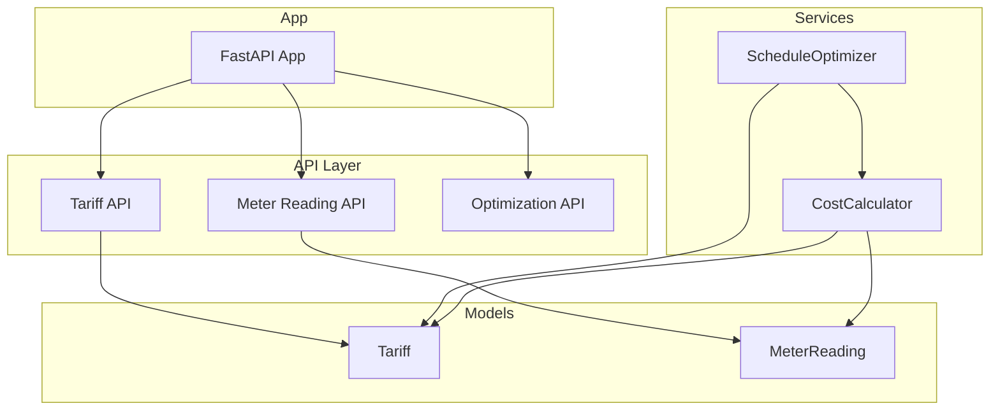
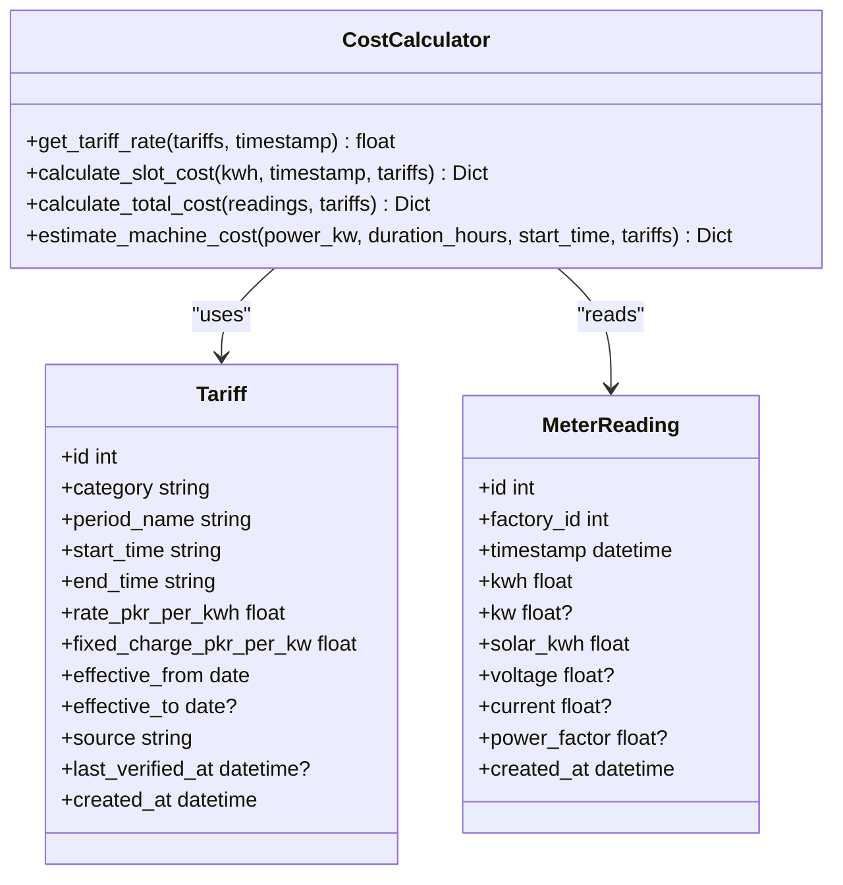
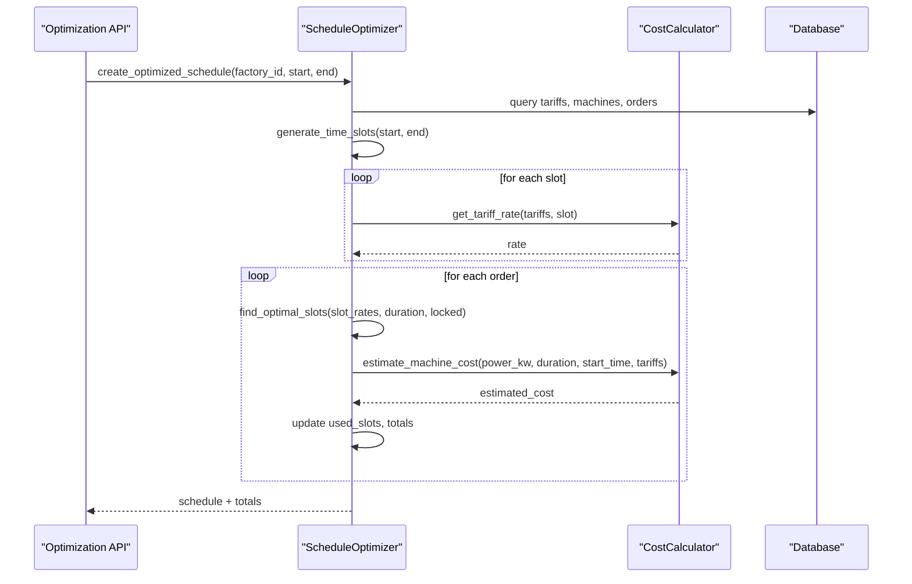
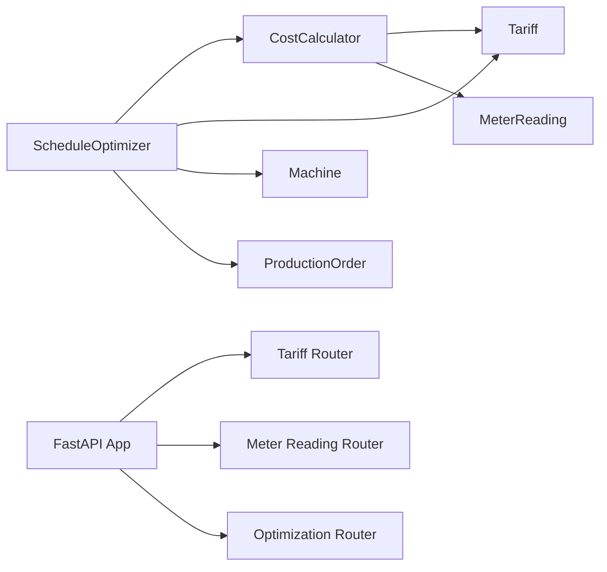
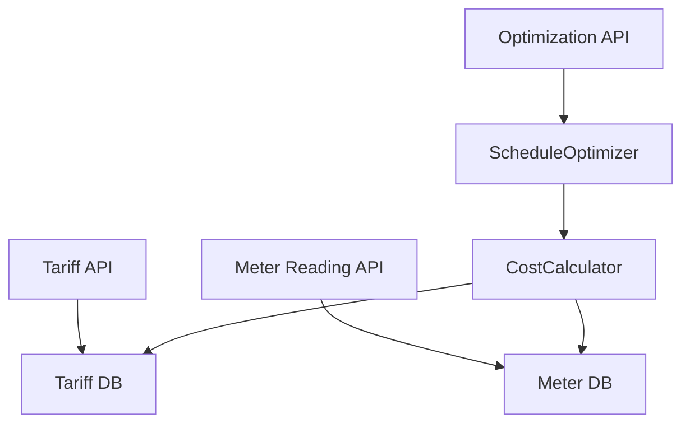

# Cost Calculator Service

<cite>
**Referenced Files in This Document**
- [cost_calculator.py](file://backend/app/services/cost_calculator.py)
- [tariff.py](file://backend/app/models/tariff.py)
- [meter_reading.py](file://backend/app/models/meter_reading.py)
- [optimizer.py](file://backend/app/services/optimizer.py)
- [utils.py](file://backend/app/core/utils.py)
- [main.py](file://backend/main.py)
</cite>

## Table of Contents
1. [Introduction](#introduction)
2. [Project Structure](#project-structure)
3. [Core Components](#core-components)
4. [Architecture Overview](#architecture-overview)
5. [Detailed Component Analysis](#detailed-component-analysis)
6. [Dependency Analysis](#dependency-analysis)
7. [Performance Considerations](#performance-considerations)
8. [Troubleshooting Guide](#troubleshooting-guide)
9. [Conclusion](#conclusion)
10. [Appendices](#appendices)

## Introduction
This document provides comprehensive documentation for the Cost Calculator service that computes energy expenses based on tariff periods, consumption data, and solar generation offsets. It explains how tariff rates are determined for different time windows (including peak/off-peak/night), how consumption costs are calculated per slot and aggregated, and how renewable energy credits (solar generation) reduce grid consumption. It also documents integration with the Schedule Optimizer service, method signatures, parameter specifications, return structures, rounding policies, accuracy considerations, and performance optimization techniques.

## Project Structure
The Cost Calculator is implemented as a standalone service module and integrates with:
- Tariff definitions (time-based rate tables)
- Meter readings (consumption, peak demand, and solar generation)
- The Schedule Optimizer service (for cost-aware scheduling)



**Diagram sources**
- [main.py:48-58](file://backend/main.py#L48-L58)
- [cost_calculator.py:12-110](file://backend/app/services/cost_calculator.py#L12-L110)
- [optimizer.py:14-238](file://backend/app/services/optimizer.py#L14-L238)
- [tariff.py:5-19](file://backend/app/models/tariff.py#L5-L19)
- [meter_reading.py:5-17](file://backend/app/models/meter_reading.py#L5-L17)

**Section sources**
- [main.py:48-58](file://backend/main.py#L48-L58)

## Core Components
- CostCalculator: Computes applicable tariff rates by time-of-day, calculates per-slot costs, aggregates totals, tracks peak demand, and accounts for solar generation offsets.
- Tariff model: Defines time windows, rates, fixed charges, and effective date ranges.
- MeterReading model: Stores consumption (kWh), instantaneous power (kW), and solar generation (kWh).
- ScheduleOptimizer: Uses CostCalculator to find optimal production slots minimizing energy costs.

Key responsibilities:
- Rate selection by timestamp across overlapping or overnight tariff windows
- Per-slot cost computation and aggregation
- Peak demand tracking across readings
- Solar offset handling to compute grid consumption
- Machine cost estimation for planning

**Section sources**
- [cost_calculator.py:12-110](file://backend/app/services/cost_calculator.py#L12-L110)
- [tariff.py:5-19](file://backend/app/models/tariff.py#L5-L19)
- [meter_reading.py:5-17](file://backend/app/models/meter_reading.py#L5-L17)
- [optimizer.py:14-238](file://backend/app/services/optimizer.py#L14-L238)

## Architecture Overview
The Cost Calculator is invoked directly by services and indirectly via APIs. The optimizer uses it to evaluate slot-wise costs when generating schedules.

```mermaid
sequenceDiagram
participant Client as "Client"
participant API as "FastAPI"
participant Opt as "ScheduleOptimizer"
participant CC as "CostCalculator"
participant DB as "Database"
Client->>API : Request optimized schedule
API->>Opt : create_optimized_schedule(factory_id, start, end)
Opt->>DB : Load tariffs, machines, orders
Opt->>CC : get_tariff_rate(tariffs, slot_time)
CC-->>Opt : rate (PKR/kWh)
Opt->>Opt : select cheapest consecutive slots
Opt->>CC : estimate_machine_cost(power_kw, duration, start_time, tariffs)
CC-->>Opt : estimated_cost
Opt-->>API : schedule + cost summary
API-->>Client : JSON response
```

**Diagram sources**
- [optimizer.py:97-190](file://backend/app/services/optimizer.py#L97-L190)
- [cost_calculator.py:15-110](file://backend/app/services/cost_calculator.py#L15-L110)
- [main.py:48-58](file://backend/main.py#L48-L58)

## Detailed Component Analysis

### CostCalculator
Responsibilities:
- Determine the applicable tariff rate for a given timestamp using tariff time windows
- Compute per-slot cost from kWh and rate
- Aggregate total cost, track peak kW, and account for solar generation
- Estimate machine running cost over a duration at a specific start time

Key methods:
- get_tariff_rate(tariffs, timestamp) -> float
  - Parameters:
    - tariffs: List[Tariff] — time-windowed tariff definitions
    - timestamp: datetime — point-in-time to evaluate
  - Behavior:
    - Extracts current time from timestamp
    - Iterates tariffs to match time within start_time..end_time
    - Supports overnight windows where start_time > end_time
    - Returns matching tariff.rate_pkr_per_kwh; otherwise returns default 25.0
  - Returns: float (rate in PKR/kWh)

- calculate_slot_cost(kwh, timestamp, tariffs) -> Dict
  - Parameters:
    - kwh: float — energy consumed in this slot
    - timestamp: datetime — slot timestamp
    - tariffs: List[Tariff]
  - Behavior:
    - Retrieves rate via get_tariff_rate
    - Computes cost = kwh * rate
  - Returns: {timestamp, kwh, rate, cost}

- calculate_total_cost(readings, tariffs) -> Dict
  - Parameters:
    - readings: List[MeterReading]
    - tariffs: List[Tariff]
  - Behavior:
    - Sums total_kwh and solar_kwh
    - Tracks peak_kw across readings
    - Aggregates per-slot costs
    - Computes grid_kwh = max(0, total_kwh - solar_kwh)
    - Computes average_rate = total_cost / total_kwh (if total_kwh > 0)
  - Returns: {total_kwh, grid_kwh, solar_kwh, peak_kw, total_cost, average_rate, slot_costs}

- estimate_machine_cost(power_kw, duration_hours, start_time, tariffs) -> Dict
  - Parameters:
    - power_kw: float
    - duration_hours: float
    - start_time: datetime
    - tariffs: List[Tariff]
  - Behavior:
    - Computes kwh = power_kw * duration_hours
    - Gets rate at start_time
    - Computes cost = kwh * rate
  - Returns: {power_kw, duration_hours, kwh, rate, estimated_cost}

Rounding policy:
- All numeric outputs are rounded to two decimal places using standard rounding.

Accuracy considerations:
- Time window matching uses Python time comparisons; ensure tariff windows do not overlap ambiguously.
- Overnight windows are supported; validate start_time/end_time semantics.
- Default fallback rate ensures no unhandled timestamps.

Performance characteristics:
- O(n) per call over tariffs for rate lookup; consider caching tariffs if called frequently.
- Aggregation over readings is O(m); batch operations benefit from vectorization at higher layers.

**Section sources**
- [cost_calculator.py:15-110](file://backend/app/services/cost_calculator.py#L15-L110)

#### Class Diagram


**Diagram sources**
- [cost_calculator.py:12-110](file://backend/app/services/cost_calculator.py#L12-L110)
- [tariff.py:5-19](file://backend/app/models/tariff.py#L5-L19)
- [meter_reading.py:5-17](file://backend/app/models/meter_reading.py#L5-L17)

### Tariff Model and Period Handling
- Tariff defines time windows with start_time and end_time as strings representing HH:MM.
- Supports overnight periods where start_time > end_time.
- Includes fixed_charge_pkr_per_kw field for potential demand charges; currently not applied in cost calculations.
- Effective date range fields allow temporal validity of tariffs.

Rate selection algorithm:
- For each tariff, parse start_time and end_time to time objects.
- If start_time > end_time (overnight), match if current_time >= start_time OR current_time < end_time.
- Else, match if start_time <= current_time < end_time.
- Return first matching tariff’s rate; otherwise return default 25.0.

Period classification helper:
- A utility function maps hour-of-day to period names Off-Peak, Peak, Night for display or reporting.

**Section sources**
- [tariff.py:5-19](file://backend/app/models/tariff.py#L5-L19)
- [cost_calculator.py:15-33](file://backend/app/services/cost_calculator.py#L15-L33)
- [utils.py:37-44](file://backend/app/core/utils.py#L37-L44)

### Meter Reading Model and Solar Offsets
- Stores per-interval consumption (kWh), instantaneous power (kW), and solar generation (kWh).
- Grid consumption is derived as total consumption minus solar generation, floored at zero.
- Peak demand is tracked as the maximum kW observed across readings.

Data flow:
- Readings are ingested via API endpoints and used by CostCalculator to compute costs and metrics.

**Section sources**
- [meter_reading.py:5-17](file://backend/app/models/meter_reading.py#L5-L17)
- [cost_calculator.py:52-90](file://backend/app/services/cost_calculator.py#L52-L90)

### Integration with Schedule Optimizer
The ScheduleOptimizer uses CostCalculator to:
- Generate time slots over a planning horizon
- Calculate slot-wise rates
- Select cheapest consecutive slots for each order while respecting locked slots per machine
- Estimate costs per order and aggregate totals

Sequence of operations:
- Load tariffs, machines, pending orders
- Generate time slots and compute slot rates
- For each order, find suitable machine and optimal slots
- Summarize schedule with estimated costs and kWh

Comparison mode:
- Provides baseline vs optimized comparison assuming a fixed peak rate for baseline, computing savings amount and percentage.

**Section sources**
- [optimizer.py:21-238](file://backend/app/services/optimizer.py#L21-L238)
- [cost_calculator.py:15-110](file://backend/app/services/cost_calculator.py#L15-L110)

#### Sequence Diagram: Optimized Schedule Creation


**Diagram sources**
- [optimizer.py:97-190](file://backend/app/services/optimizer.py#L97-L190)
- [cost_calculator.py:15-110](file://backend/app/services/cost_calculator.py#L15-L110)

## Dependency Analysis
- CostCalculator depends on Tariff and MeterReading models.
- ScheduleOptimizer depends on CostCalculator and database models (Tariff, Machine, ProductionOrder).
- FastAPI app wires routers for tariffs, meter readings, and optimization.



**Diagram sources**
- [cost_calculator.py:12-110](file://backend/app/services/cost_calculator.py#L12-L110)
- [optimizer.py:14-238](file://backend/app/services/optimizer.py#L14-L238)
- [main.py:48-58](file://backend/main.py#L48-L58)

**Section sources**
- [main.py:48-58](file://backend/main.py#L48-L58)

## Performance Considerations
- Rate lookup complexity: O(n) over tariffs per timestamp. For high-frequency calls, cache tariffs in memory or precompute a time-to-rate map for the planning horizon.
- Aggregation over readings: O(m). Use efficient queries and avoid unnecessary object conversions.
- Rounding: Consistent two-decimal rounding reduces floating-point noise but should be applied consistently across modules.
- Memory: Avoid loading excessively large reading sets into memory; paginate or stream where possible.
- Concurrency: Ensure thread-safe access to shared tariff caches if introduced.

[No sources needed since this section provides general guidance]

## Troubleshooting Guide
Common issues and resolutions:
- No tariff matches timestamp:
  - Verify tariff windows cover the entire day without gaps.
  - Check overnight window definitions (start_time > end_time).
  - Confirm default fallback behavior is acceptable.
- Unexpected peak demand values:
  - Validate kw presence and units in meter readings.
  - Ensure readings span the intended time range.
- Solar offsets not reducing grid consumption:
  - Confirm solar_kwh is populated in readings.
  - Verify grid_kwh calculation floors at zero.
- Inconsistent rounding:
  - Ensure all cost computations round to two decimals consistently.

**Section sources**
- [cost_calculator.py:15-110](file://backend/app/services/cost_calculator.py#L15-L110)
- [meter_reading.py:5-17](file://backend/app/models/meter_reading.py#L5-L17)

## Conclusion
The Cost Calculator service provides robust, time-based energy cost computation with support for peak/off-peak/night tariffs, solar generation offsets, and peak demand tracking. It integrates seamlessly with the Schedule Optimizer to enable cost-aware production scheduling. While fixed demand charges exist in the tariff model, they are not yet applied in cost calculations; future enhancements can incorporate them for more accurate billing. The service adheres to consistent rounding and offers clear extension points for advanced tariff rules and optimizations.

[No sources needed since this section summarizes without analyzing specific files]

## Appendices

### Method Signatures and Specifications
- get_tariff_rate(tariffs: List[Tariff], timestamp: datetime) -> float
  - Purpose: Find applicable rate for a timestamp
  - Notes: Supports overnight windows; default fallback rate applies

- calculate_slot_cost(kwh: float, timestamp: datetime, tariffs: List[Tariff]) -> Dict
  - Output keys: timestamp, kwh, rate, cost

- calculate_total_cost(readings: List[MeterReading], tariffs: List[Tariff]) -> Dict
  - Output keys: total_kwh, grid_kwh, solar_kwh, peak_kw, total_cost, average_rate, slot_costs

- estimate_machine_cost(power_kw: float, duration_hours: float, start_time: datetime, tariffs: List[Tariff]) -> Dict
  - Output keys: power_kw, duration_hours, kwh, rate, estimated_cost

**Section sources**
- [cost_calculator.py:15-110](file://backend/app/services/cost_calculator.py#L15-L110)

### Calculation Examples
- Single slot cost:
  - Input: kwh=10, timestamp=“2026-01-01 19:00”, tariffs include Peak window covering 19:00–22:00
  - Expected: rate = Peak rate; cost = 10 * rate

- Total cost with solar:
  - Inputs: readings with total_kwh=100, solar_kwh=20, peak_kw=50
  - Expected: grid_kwh = 80; total_cost = sum of per-slot costs; average_rate = total_cost / 100

- Machine cost estimation:
  - Input: power_kw=5, duration_hours=2, start_time=“2026-01-01 23:00”
  - Expected: kwh=10; rate = Night rate; estimated_cost = 10 * Night rate

[No sources needed since this section provides conceptual examples]

### Data Flow Patterns
- Tariff management: CRUD via API; active filtering by effective dates
- Meter reading ingestion: single/bulk/CSV import; statistics endpoint
- Optimization: schedule creation and baseline comparison



**Diagram sources**
- [main.py:48-58](file://backend/main.py#L48-L58)
- [optimizer.py:97-190](file://backend/app/services/optimizer.py#L97-L190)
- [cost_calculator.py:15-110](file://backend/app/services/cost_calculator.py#L15-L110)