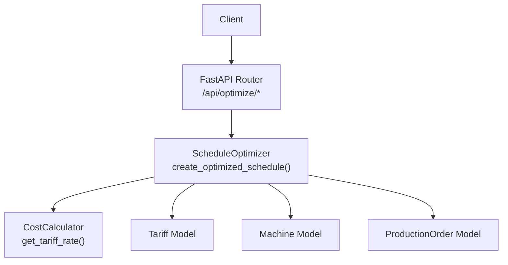
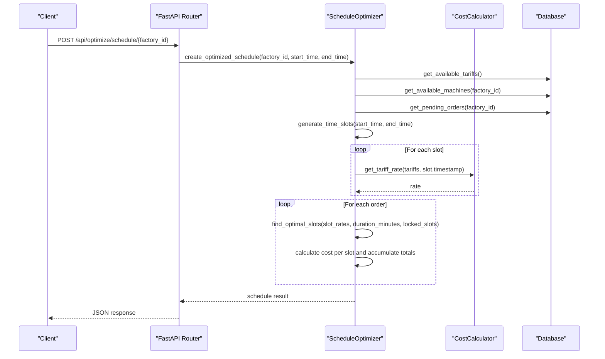
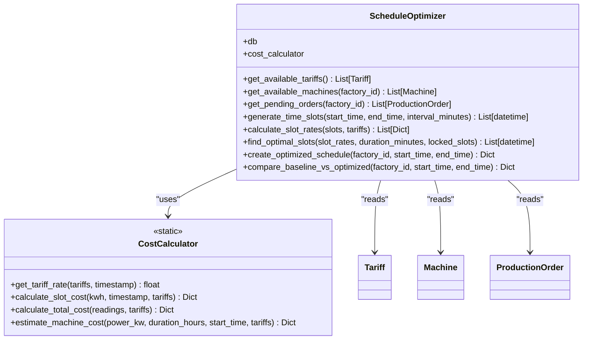
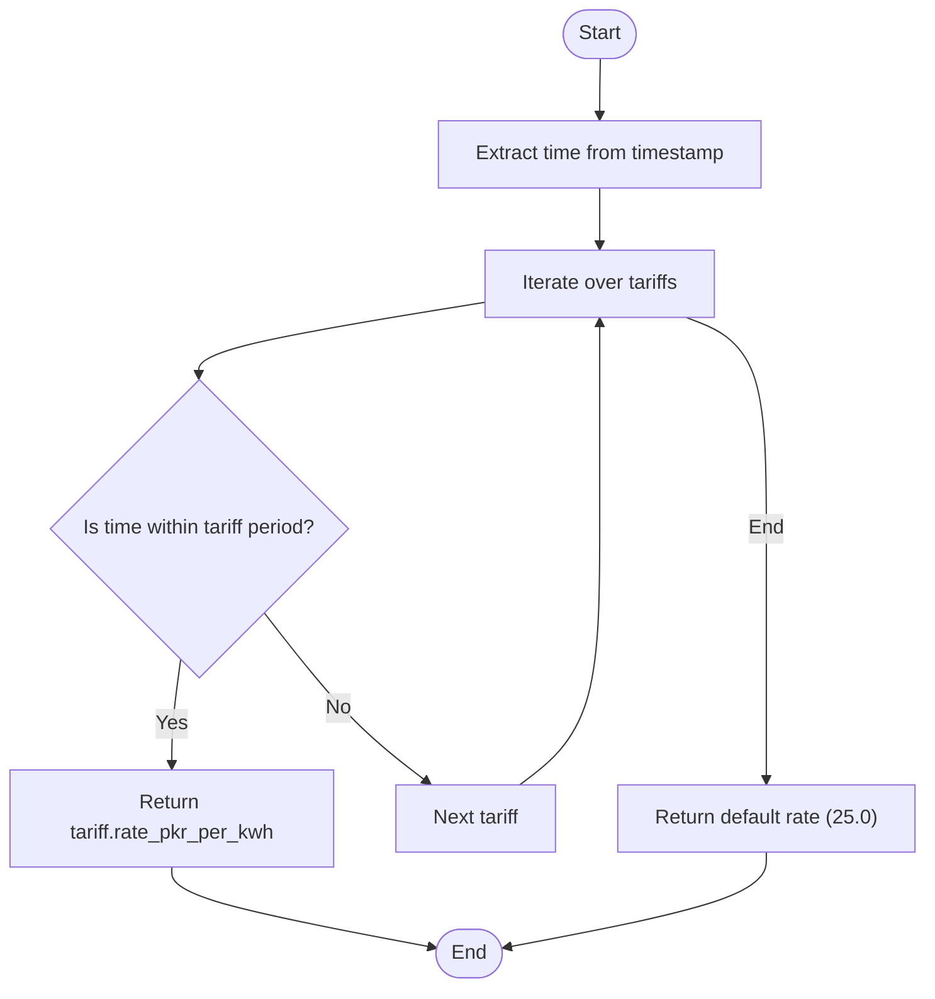
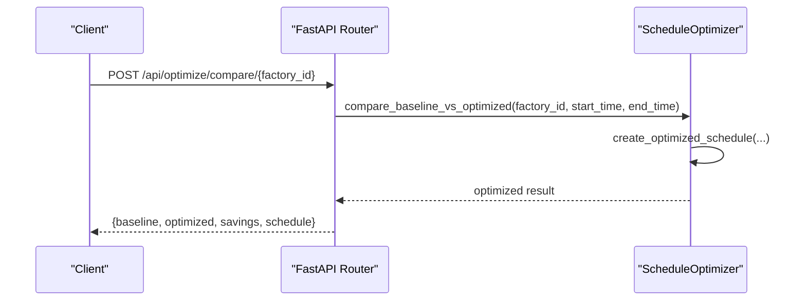
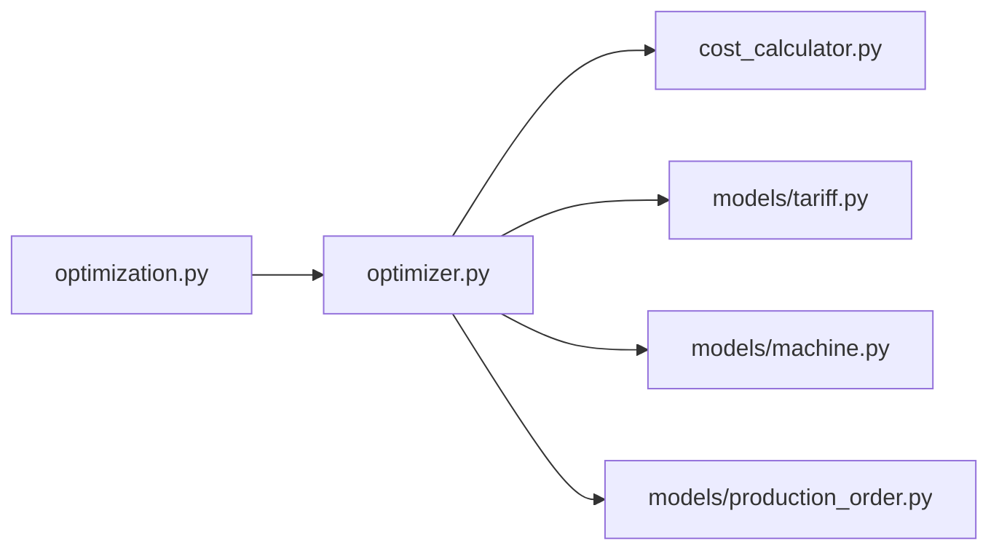

# Schedule Optimizer Service

<cite>
**Referenced Files in This Document**
- [optimizer.py](file://backend/app/services/optimizer.py)
- [cost_calculator.py](file://backend/app/services/cost_calculator.py)
- [optimization.py](file://backend/app/api/optimization.py)
- [main.py](file://backend/main.py)
- [tariff.py](file://backend/app/models/tariff.py)
- [machine.py](file://backend/app/models/machine.py)
- [production_order.py](file://backend/app/models/production_order.py)
- [tariff_schema.py](file://backend/app/schemas/tariff.py)
- [production_order_schema.py](file://backend/app/schemas/production_order.py)
- [test_complete.py](file://backend/tests/test_complete.py)
</cite>

## Table of Contents
1. [Introduction](#introduction)
2. [Project Structure](#project-structure)
3. [Core Components](#core-components)
4. [Architecture Overview](#architecture-overview)
5. [Detailed Component Analysis](#detailed-component-analysis)
6. [Dependency Analysis](#dependency-analysis)
7. [Performance Considerations](#performance-considerations)
8. [Troubleshooting Guide](#troubleshooting-guide)
9. [Conclusion](#conclusion)
10. [Appendices](#appendices)

## Introduction
This document explains the Schedule Optimizer service that finds cost-effective production time slots by combining tariff rates, machine availability, and order constraints. It details how the optimizer generates hourly slots, calculates applicable tariff rates per slot, selects the cheapest consecutive slots for each order while respecting machine assignments, and produces a complete schedule with cost estimates. It also documents the API endpoints, input/output structures, performance characteristics, constraint handling, and integration patterns.

## Project Structure
The optimization feature is implemented as a FastAPI service with:
- API layer exposing endpoints to generate optimized schedules and compare baseline vs optimized plans
- Service layer implementing scheduling algorithms and cost calculations
- Data models for tariffs, machines, and production orders
- Schemas for request/response validation
- Tests validating key endpoints

**Diagram sources**
- [optimization.py:11-29](file://backend/app/api/optimization.py#L11-L29)
- [optimizer.py:97-190](file://backend/app/services/optimizer.py#L97-L190)
- [cost_calculator.py:15-33](file://backend/app/services/cost_calculator.py#L15-L33)
- [tariff.py:5-19](file://backend/app/models/tariff.py#L5-L19)
- [machine.py:5-20](file://backend/app/models/machine.py#L5-L20)
- [production_order.py:5-20](file://backend/app/models/production_order.py#L5-L20)

**Section sources**
- [main.py:48-58](file://backend/main.py#L48-L58)
- [optimization.py:1-48](file://backend/app/api/optimization.py#L1-L48)

## Core Components
- ScheduleOptimizer: Orchestrates slot generation, rate calculation, optimal slot selection, and schedule creation.
- CostCalculator: Determines the applicable tariff rate for any timestamp and computes costs.
- Data Models: Tariff, Machine, ProductionOrder define the domain entities used by the optimizer.
- API Endpoints: Provide HTTP interfaces to trigger optimization and comparison.

Key responsibilities:
- Slot generation: Create hourly intervals within a specified window.
- Rate calculation: Map each slot to its tariff rate using tariff periods.
- Optimal slot selection: Choose the cheapest available slots for each order’s duration, avoiding conflicts on the same machine.
- Schedule creation: Build a structured output including start/end times, estimated energy consumption, and cost.

**Section sources**
- [optimizer.py:14-190](file://backend/app/services/optimizer.py#L14-L190)
- [cost_calculator.py:12-110](file://backend/app/services/cost_calculator.py#L12-L110)
- [tariff.py:5-19](file://backend/app/models/tariff.py#L5-L19)
- [machine.py:5-20](file://backend/app/models/machine.py#L5-L20)
- [production_order.py:5-20](file://backend/app/models/production_order.py#L5-L20)

## Architecture Overview
The service follows a layered architecture:
- API Layer: Receives requests, validates parameters, and delegates to the service.
- Service Layer: Implements business logic (scheduling algorithms).
- Data Access: Uses SQLAlchemy ORM via models to read tariffs, machines, and orders.
- Utilities: CostCalculator provides deterministic rate lookup and cost computations.

**Diagram sources**
- [optimization.py:11-29](file://backend/app/api/optimization.py#L11-L29)
- [optimizer.py:97-190](file://backend/app/services/optimizer.py#L97-L190)
- [cost_calculator.py:15-33](file://backend/app/services/cost_calculator.py#L15-L33)

## Detailed Component Analysis

### ScheduleOptimizer
Responsibilities:
- Retrieve tariffs, machines, and pending orders for a factory.
- Generate hourly time slots across the requested window.
- Compute tariff rates for each slot.
- Select the cheapest consecutive slots per order while avoiding machine conflicts.
- Produce a schedule with cost and energy estimates.

Algorithm highlights:
- Slot generation uses fixed 60-minute intervals.
- Rate calculation delegates to CostCalculator.get_tariff_rate().
- Optimal slot selection sorts all slots by rate ascending and picks the first N slots needed for the order’s duration, skipping already-locked slots per machine.
- Machine matching prefers machines whose type matches the order’s process; otherwise falls back to the first available machine.

Input parameters:
- factory_id: int
- start_time: datetime
- end_time: datetime

Output structure:
- factory_id, start_time, end_time
- total_orders_scheduled, total_estimated_cost, total_estimated_kwh, average_rate
- schedule: list of order entries with machine assignment, timing, slots, estimated cost/kWh, and priority
- slot_rates: list of timestamps with their rates

Example usage:
- create_optimized_schedule(): Returns an optimized plan for all pending orders in the given window.
- compare_baseline_vs_optimized(): Compares the optimized plan against a baseline that assumes peak-rate operation, returning savings amount and percentage along with the optimized schedule.

Error handling:
- If no suitable machine exists for an order, it is skipped.
- If no optimal slots are found, the order is not scheduled.
- The API returns results even if some orders cannot be scheduled; clients should inspect the schedule length and fields.

**Section sources**
- [optimizer.py:21-190](file://backend/app/services/optimizer.py#L21-L190)

#### Class Diagram

**Diagram sources**
- [optimizer.py:14-190](file://backend/app/services/optimizer.py#L14-L190)
- [cost_calculator.py:12-110](file://backend/app/services/cost_calculator.py#L12-L110)
- [tariff.py:5-19](file://backend/app/models/tariff.py#L5-L19)
- [machine.py:5-20](file://backend/app/models/machine.py#L5-L20)
- [production_order.py:5-20](file://backend/app/models/production_order.py#L5-L20)

### CostCalculator
Responsibilities:
- Determine the applicable tariff rate for a timestamp based on tariff period start/end times.
- Handle overnight periods where start_time > end_time.
- Compute slot-level and aggregate costs.

Key method:
- get_tariff_rate(tariffs, timestamp): Iterates through tariffs and checks whether the current time falls within the tariff’s period, returning the corresponding rate or a default value if none match.

Complexity:
- O(T) per timestamp lookup where T is the number of tariffs.

**Section sources**
- [cost_calculator.py:15-33](file://backend/app/services/cost_calculator.py#L15-L33)

#### Flowchart: Tariff Rate Lookup

**Diagram sources**
- [cost_calculator.py:15-33](file://backend/app/services/cost_calculator.py#L15-L33)

### API Endpoints
- POST /api/optimize/schedule/{factory_id}: Generates an optimized schedule for the next 24 hours by default, or for a custom window if start_time and end_time are provided.
- POST /api/optimize/compare/{factory_id}: Compares baseline vs optimized schedules and returns savings metrics plus the optimized schedule.

Behavior:
- Defaults to a 24-hour window starting at the current hour if not specified.
- Delegates to ScheduleOptimizer methods described above.

Validation and errors:
- Validation handled by FastAPI; invalid inputs raise validation errors.
- Missing resources (e.g., no tariffs or machines) result in empty or partial schedules; clients should handle such cases.

**Section sources**
- [optimization.py:11-48](file://backend/app/api/optimization.py#L11-L48)

#### Sequence Diagram: Compare Baseline vs Optimized

**Diagram sources**
- [optimization.py:31-48](file://backend/app/api/optimization.py#L31-L48)
- [optimizer.py:192-238](file://backend/app/services/optimizer.py#L192-L238)

## Dependency Analysis
- API depends on the optimizer service.
- Optimizer depends on:
  - CostCalculator for rate lookups and cost computations.
  - Data models for reading tariffs, machines, and orders.
- Models are independent but represent shared domain concepts.

**Diagram sources**
- [optimization.py:1-48](file://backend/app/api/optimization.py#L1-L48)
- [optimizer.py:1-190](file://backend/app/services/optimizer.py#L1-L190)
- [cost_calculator.py:1-110](file://backend/app/services/cost_calculator.py#L1-L110)
- [tariff.py:1-19](file://backend/app/models/tariff.py#L1-L19)
- [machine.py:1-20](file://backend/app/models/machine.py#L1-L20)
- [production_order.py:1-20](file://backend/app/models/production_order.py#L1-L20)

**Section sources**
- [main.py:48-58](file://backend/main.py#L48-L58)

## Performance Considerations
- Time slot granularity: Fixed 60-minute intervals balance accuracy and performance. Finer intervals increase computation linearly.
- Rate lookup complexity: O(T) per slot where T is the number of tariffs. With typical small T, this is negligible.
- Slot selection complexity: Sorting slot_rates is O(S log S) where S is the number of slots. Selection then scans sorted list once.
- Machine conflict avoidance: Per-machine locked slots prevent double-booking; tracking is O(1) per check due to set-like membership.
- Overall complexity: Dominated by sorting slot rates; acceptable for daily windows (S ~ 24–168 depending on range).

Optimization opportunities:
- Precompute slot rates once per window and reuse across orders.
- Cache tariff periods by hour-of-day to avoid repeated parsing.
- Use more sophisticated scheduling heuristics (e.g., deadline-aware ordering) if needed.

[No sources needed since this section provides general guidance]

## Troubleshooting Guide
Common issues and resolutions:
- No tariffs configured: get_tariff_rate returns a default rate; ensure tariffs exist for accurate optimization.
- No machines for factory: Orders may be skipped; verify machine setup and factory association.
- No pending orders: Schedule will be empty; confirm order status and factory linkage.
- Overnight tariff periods: Ensure tariff start_time and end_time correctly reflect overnight ranges; the calculator handles wrap-around.
- Validation errors: FastAPI returns detailed messages for invalid inputs; check request payloads.

Integration points:
- Database session dependency via FastAPI Depends(get_db).
- Global error handlers registered in main application for validation and SQL exceptions.

**Section sources**
- [main.py:25-38](file://backend/main.py#L25-L38)
- [cost_calculator.py:15-33](file://backend/app/services/cost_calculator.py#L15-L33)
- [optimizer.py:120-178](file://backend/app/services/optimizer.py#L120-L178)

## Conclusion
The Schedule Optimizer service provides a practical approach to minimizing energy costs by aligning production runs with low-tariff periods while respecting machine capabilities and order durations. It exposes simple APIs to generate optimized schedules and quantify savings versus a baseline. The design is modular, testable, and extensible for more advanced scheduling constraints and strategies.

[No sources needed since this section summarizes without analyzing specific files]

## Appendices

### API Reference
- POST /api/optimize/schedule/{factory_id}
  - Query params: start_time (optional), end_time (optional)
  - Response includes total_estimated_cost, total_estimated_kwh, average_rate, schedule, slot_rates
- POST /api/optimize/compare/{factory_id}
  - Query params: start_time (optional), end_time (optional)
  - Response includes baseline, optimized, savings (amount, percentage), and schedule

**Section sources**
- [optimization.py:11-48](file://backend/app/api/optimization.py#L11-L48)
- [test_complete.py:184-199](file://backend/tests/test_complete.py#L184-L199)

### Data Models Summary
- Tariff: category, period_name, start_time, end_time, rate_pkr_per_kwh, effective_from/to, source
- Machine: name, machine_type, power_kw, min_run_minutes, shiftable, available_from/to, maintenance_windows
- ProductionOrder: order_no, process, quantity, duration_minutes, earliest_start, deadline, priority, machine_options, locked, status

**Section sources**
- [tariff.py:5-19](file://backend/app/models/tariff.py#L5-L19)
- [machine.py:5-20](file://backend/app/models/machine.py#L5-L20)
- [production_order.py:5-20](file://backend/app/models/production_order.py#L5-L20)

### Example Scenarios
- Create optimized schedule: Call the schedule endpoint for a factory to obtain a plan that assigns each pending order to the cheapest available hourly slots on suitable machines, with estimated costs and kWh.
- Compare baseline vs optimized: Call the compare endpoint to receive baseline cost assumptions (peak rate), optimized cost, and savings metrics, enabling decision-making on operational shifts.

**Section sources**
- [test_complete.py:184-199](file://backend/tests/test_complete.py#L184-L199)