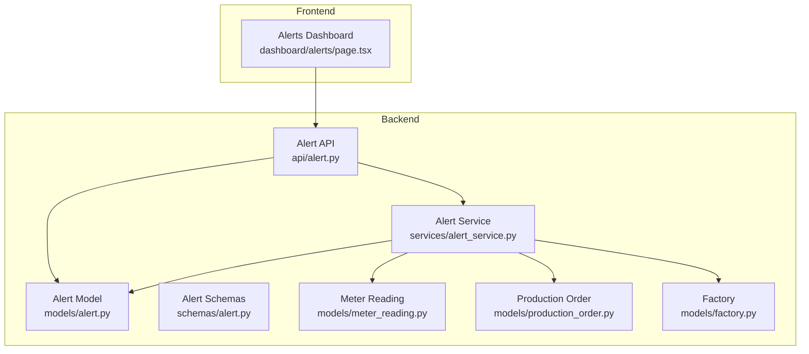
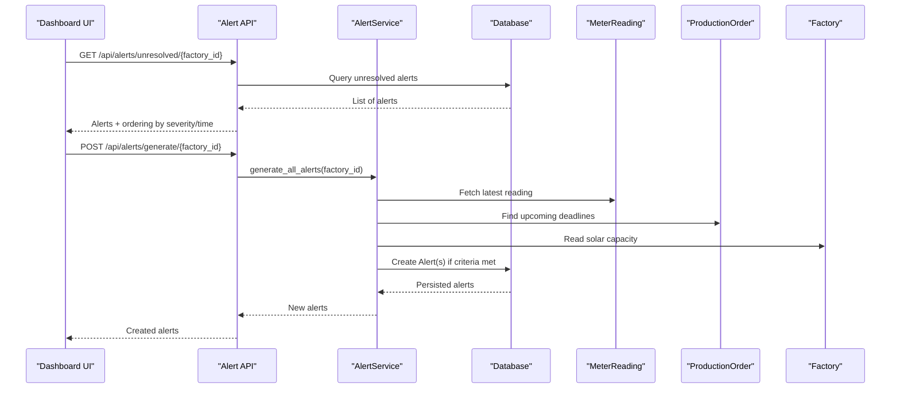
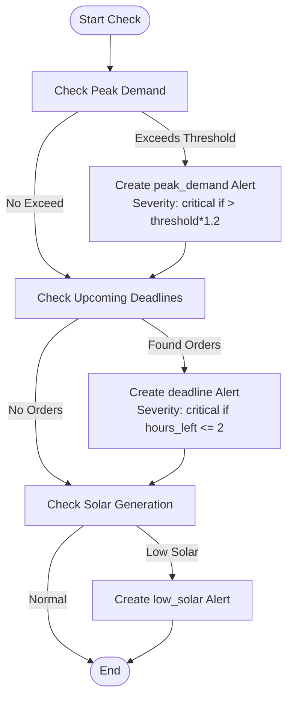
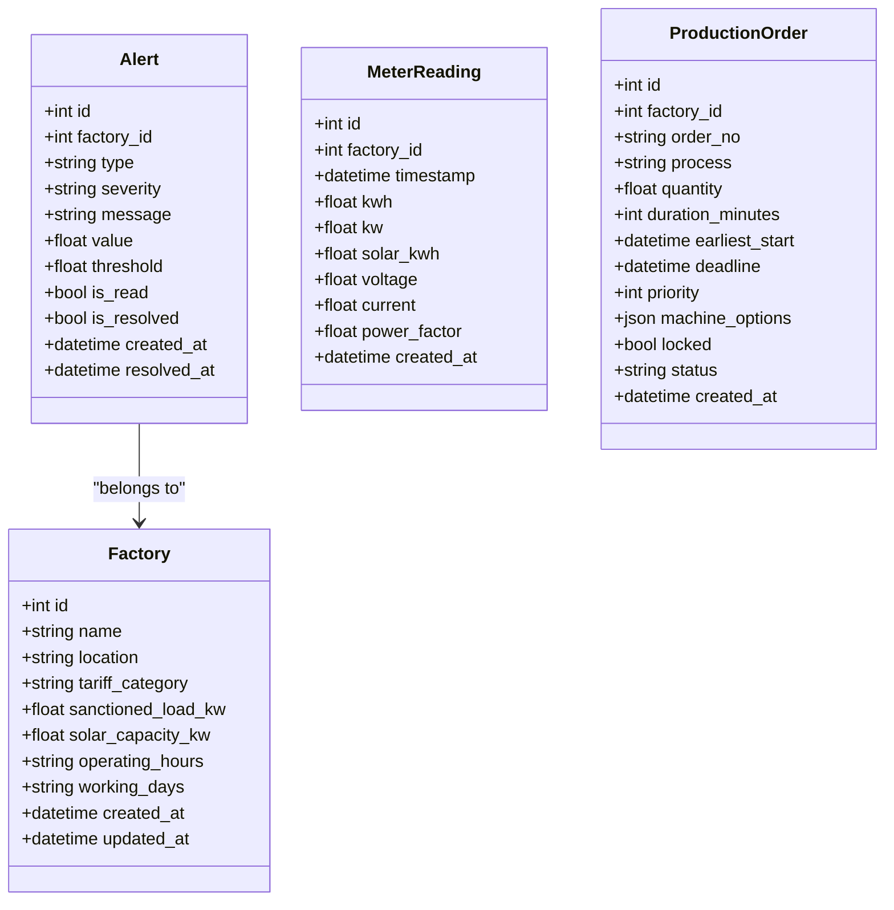

# Alert Model

<cite>
**Referenced Files in This Document**
- [alert.py](file://backend/app/models/alert.py)
- [alert.py](file://backend/app/schemas/alert.py)
- [alert_service.py](file://backend/app/services/alert_service.py)
- [alert.py](file://backend/app/api/alert.py)
- [meter_reading.py](file://backend/app/models/meter_reading.py)
- [production_order.py](file://backend/app/models/production_order.py)
- [factory.py](file://backend/app/models/factory.py)
- [page.tsx](file://frontend/app/dashboard/alerts/page.tsx)
</cite>

## Table of Contents
1. Introduction
2. Project Structure
3. Core Components
4. Architecture Overview
5. Detailed Component Analysis
6. Dependency Analysis
7. Performance Considerations
8. Troubleshooting Guide
9. Conclusion
10. Appendices

## Introduction
This document provides a comprehensive data model and integration guide for the Alert entity in TariffGuard. It explains alert types, severity levels, status management, timestamps, and how alerts are generated from system events such as peak demand spikes, approaching production deadlines, and low solar generation. It also documents validation rules used during alert creation, escalation policies based on thresholds, and integration patterns with the API and dashboard components.

## Project Structure
The Alert feature spans backend models, schemas, services, API endpoints, and a frontend dashboard page:
- Data model and persistence: backend/app/models/alert.py
- Request/response contracts: backend/app/schemas/alert.py
- Alert generation logic: backend/app/services/alert_service.py
- REST endpoints: backend/app/api/alert.py
- Related domain models: meter readings, production orders, factories
- Frontend consumption: frontend/app/dashboard/alerts/page.tsx

**Diagram sources**
- [alert.py:5-18](file://backend/app/models/alert.py#L5-L18)
- [alert.py:5-28](file://backend/app/schemas/alert.py#L5-L28)
- [alert_service.py:16-140](file://backend/app/services/alert_service.py#L16-L140)
- [alert.py:12-107](file://backend/app/api/alert.py#L12-L107)
- [meter_reading.py:5-17](file://backend/app/models/meter_reading.py#L5-L17)
- [production_order.py:5-20](file://backend/app/models/production_order.py#L5-L20)
- [factory.py:5-17](file://backend/app/models/factory.py#L5-L17)
- [page.tsx:25-84](file://frontend/app/dashboard/alerts/page.tsx#L25-L84)

**Section sources**
- [alert.py:5-18](file://backend/app/models/alert.py#L5-L18)
- [alert.py:5-28](file://backend/app/schemas/alert.py#L5-L28)
- [alert_service.py:16-140](file://backend/app/services/alert_service.py#L16-L140)
- [alert.py:12-107](file://backend/app/api/alert.py#L12-L107)
- [meter_reading.py:5-17](file://backend/app/models/meter_reading.py#L5-L17)
- [production_order.py:5-20](file://backend/app/models/production_order.py#L5-L20)
- [factory.py:5-17](file://backend/app/models/factory.py#L5-L17)
- [page.tsx:25-84](file://frontend/app/dashboard/alerts/page.tsx#L25-L84)

## Core Components
- Alert entity (database model): stores alert classification, severity, message, numeric value/threshold, read/resolved flags, and timestamps.
- Pydantic schemas: define input validation for creating/updating alerts and response serialization.
- Alert service: implements business rules to generate alerts from meter readings, production deadlines, and solar generation checks; includes deduplication and escalation logic.
- API endpoints: expose listing, filtering, generation, updating, and statistics for alerts.
- Frontend dashboard: consumes unresolved alerts and stats, supports marking alerts resolved.

Key responsibilities:
- Generate alerts when conditions are met (peak demand, deadline proximity, low solar).
- Prevent duplicate active alerts within time windows or by matching messages.
- Escalate severity based on thresholds (e.g., critical vs warning).
- Track lifecycle via is_read and is_resolved flags and timestamps.

**Section sources**
- [alert.py:5-18](file://backend/app/models/alert.py#L5-L18)
- [alert.py:5-28](file://backend/app/schemas/alert.py#L5-L28)
- [alert_service.py:16-140](file://backend/app/services/alert_service.py#L16-L140)
- [alert.py:12-107](file://backend/app/api/alert.py#L12-L107)
- [page.tsx:25-84](file://frontend/app/dashboard/alerts/page.tsx#L25-L84)

## Architecture Overview
The alert pipeline integrates real-time monitoring data and scheduling constraints to produce actionable notifications.

**Diagram sources**
- [alert.py:14-43](file://backend/app/api/alert.py#L14-L43)
- [alert_service.py:19-140](file://backend/app/services/alert_service.py#L19-L140)
- [meter_reading.py:5-17](file://backend/app/models/meter_reading.py#L5-L17)
- [production_order.py:5-20](file://backend/app/models/production_order.py#L5-L20)
- [factory.py:5-17](file://backend/app/models/factory.py#L5-L17)

## Detailed Component Analysis

### Alert Data Model
- Identifier and scope:
  - id: primary key
  - factory_id: foreign key linking alert to a factory
- Classification:
  - type: string indicating alert category (e.g., peak_demand, deadline, low_solar)
  - severity: info, warning, critical
  - message: human-readable description
- Metrics:
  - value: current measured or computed value
  - threshold: boundary that triggered the alert
- Lifecycle:
  - is_read: boolean flag for read state
  - is_resolved: boolean flag for resolution state
  - created_at: auto-set timestamp at creation
  - resolved_at: optional timestamp set when resolved

Complexity considerations:
- Queries typically filter by factory_id, severity, and is_resolved; indexes on these fields improve performance.
- Deduplication uses time-bounded queries and message matching to avoid repeated alerts.

**Section sources**
- [alert.py:5-18](file://backend/app/models/alert.py#L5-L18)

### Alert Schemas and Validation
- AlertBase: defines required fields for creation and common attributes.
- AlertCreate: inherits base fields for creation payloads.
- AlertUpdate: allows partial updates for read/resolved states.
- AlertResponse: serializes full alert objects including timestamps and IDs.

Validation rules enforced by schemas:
- factory_id must be an integer.
- type must be provided (string).
- severity defaults to warning if not specified.
- message is required.
- value and threshold are optional floats.
- Update operations only allow toggling is_read and is_resolved.

**Section sources**
- [alert.py:5-28](file://backend/app/schemas/alert.py#L5-L28)

### Alert Generation Logic
The service generates alerts based on three triggers:

- Peak demand check:
  - Reads the latest meter reading for the factory.
  - If instantaneous power (kw) exceeds a threshold, creates a peak_demand alert.
  - Severity escalates to critical when kw exceeds threshold * 1.2; otherwise warning.
  - Deduplicates by checking for existing unresolved peak_demand alerts within the last hour.

- Deadline check:
  - Finds pending production orders with deadlines within a configurable window (default hours_ahead).
  - For each order, computes hours_left and sets severity to critical if hours_left <= 2, else warning.
  - Deduplicates by matching order number in message to avoid duplicates.

- Low solar generation check:
  - Only runs during daytime hours (8 AM–5 PM).
  - Compares latest solar_kwh against a minimum threshold.
  - Creates a low_solar alert with warning severity when below threshold.

All generated alerts include value and threshold fields to support dashboards and analytics.

**Diagram sources**
- [alert_service.py:19-140](file://backend/app/services/alert_service.py#L19-L140)

**Section sources**
- [alert_service.py:19-140](file://backend/app/services/alert_service.py#L19-L140)

### API Endpoints
- List alerts: GET /api/alerts/?factory_id=&severity=&is_resolved=&limit=
  - Filters by factory, severity, and resolution status; returns sorted by created_at descending.
- Generate alerts: POST /api/alerts/generate/{factory_id}
  - Requires manager role; calls service to create new alerts.
- Unresolved alerts: GET /api/alerts/unresolved/{factory_id}
  - Returns unresolved alerts ordered by severity then created_at.
- Update alert: PUT /api/alerts/{alert_id}
  - Allows setting is_read and/or is_resolved; automatically sets resolved_at when resolved.
- Stats: GET /api/alerts/stats/{factory_id}
  - Returns total, unresolved, critical, and resolved counts.

Authentication and authorization:
- Some endpoints require authentication and specific roles (e.g., manager for generation and updates).

Error handling:
- 404 returned when updating a non-existent alert.
- General HTTP exceptions handled centrally by the application.

**Section sources**
- [alert.py:14-107](file://backend/app/api/alert.py#L14-L107)

### Frontend Integration
The dashboard page:
- Loads unresolved alerts and stats concurrently.
- Displays summary cards for total, high severity, medium severity, and resolved counts.
- Supports dismissing individual alerts and marking all as read.
- Uses icons and color coding based on alert type and severity.

Integration points:
- GET /api/alerts/unresolved/{factory_id}
- GET /api/alerts/stats/{factory_id}
- PUT /api/alerts/{alert_id} with { is_resolved: true }

**Section sources**
- [page.tsx:25-84](file://frontend/app/dashboard/alerts/page.tsx#L25-L84)
- [page.tsx:59-89](file://frontend/app/dashboard/alerts/page.tsx#L59-L89)
- [page.tsx:91-104](file://frontend/app/dashboard/alerts/page.tsx#L91-L104)

## Dependency Analysis
Alert generation depends on related domain models:
- MeterReading: provides latest kw and solar_kwh values.
- ProductionOrder: provides pending orders with deadlines.
- Factory: provides solar_capacity_kw for solar checks.

Relationships:
- Alert references Factory via factory_id.
- Alert generation reads MeterReading and ProductionOrder to evaluate conditions.
- Alert service composes multiple checks into a single generate_all_alerts call.

**Diagram sources**
- [alert.py:5-18](file://backend/app/models/alert.py#L5-L18)
- [meter_reading.py:5-17](file://backend/app/models/meter_reading.py#L5-L17)
- [production_order.py:5-20](file://backend/app/models/production_order.py#L5-L20)
- [factory.py:5-17](file://backend/app/models/factory.py#L5-L17)

**Section sources**
- [alert_service.py:19-140](file://backend/app/services/alert_service.py#L19-L140)
- [meter_reading.py:5-17](file://backend/app/models/meter_reading.py#L5-L17)
- [production_order.py:5-20](file://backend/app/models/production_order.py#L5-L20)
- [factory.py:5-17](file://backend/app/models/factory.py#L5-L17)

## Performance Considerations
- Deduplication windows:
  - Peak demand alerts avoid duplicates within the last hour.
  - Deadline alerts avoid duplicates by matching order number in message.
- Query efficiency:
  - Filtering by factory_id and is_resolved reduces dataset size.
  - Ordering by severity and created_at prioritizes critical issues.
- Batch updates:
  - Marking all alerts as read performs parallel PUT requests; consider rate limiting or batching on the client side if needed.
- Time-based checks:
  - Solar checks run only during daytime hours to reduce unnecessary queries.

[No sources needed since this section provides general guidance]

## Troubleshooting Guide
Common issues and resolutions:
- No alerts generated:
  - Ensure meter readings exist and have valid kw/solar_kwh values.
  - Verify production orders have deadlines within the configured window.
  - Confirm factory has solar_capacity_kw set for solar checks.
- Duplicate alerts:
  - Check deduplication logic in service; ensure thresholds and time windows are appropriate.
- Unable to update alert:
  - Verify user has required role (manager) for update endpoints.
  - Confirm alert exists before updating; 404 indicates not found.
- Dashboard shows stale data:
  - Re-fetch unresolved alerts and stats after actions like mark-all-read.

**Section sources**
- [alert_service.py:19-140](file://backend/app/services/alert_service.py#L19-L140)
- [alert.py:59-80](file://backend/app/api/alert.py#L59-L80)
- [page.tsx:59-89](file://frontend/app/dashboard/alerts/page.tsx#L59-L89)

## Conclusion
The Alert entity provides a robust foundation for monitoring energy usage, production schedules, and renewable generation. Its design supports clear classification, scalable generation logic, and straightforward lifecycle management. The API exposes flexible querying and control, while the dashboard offers intuitive interaction for operators. Future enhancements can include additional alert types, richer notification channels, and advanced anomaly detection.

[No sources needed since this section summarizes without analyzing specific files]

## Appendices

### Alert Types, Severity Levels, and Status Management
- Types:
  - peak_demand: triggered when instantaneous power exceeds threshold.
  - deadline: triggered when production order deadlines approach.
  - low_solar: triggered when solar generation falls below expected levels during daytime.
- Severity levels:
  - info: informational context.
  - warning: notable condition requiring attention.
  - critical: urgent condition requiring immediate action.
- Status management:
  - is_read: marks alert as viewed.
  - is_resolved: marks alert as addressed; resolved_at set automatically upon resolution.

**Section sources**
- [alert.py:5-18](file://backend/app/models/alert.py#L5-L18)
- [alert_service.py:19-140](file://backend/app/services/alert_service.py#L19-L140)
- [alert.py:59-80](file://backend/app/api/alert.py#L59-L80)

### Validation Rules and Escalation Policies
- Validation:
  - Required fields enforced by schemas (factory_id, type, message).
  - Optional numeric fields (value, threshold) allow contextual metrics.
  - Updates restricted to read/resolved flags.
- Escalation:
  - Peak demand: critical if kw > threshold * 1.2; otherwise warning.
  - Deadline: critical if hours_left <= 2; otherwise warning.
  - Solar: warning when below minimum during operational hours.

**Section sources**
- [alert.py:5-28](file://backend/app/schemas/alert.py#L5-L28)
- [alert_service.py:19-140](file://backend/app/services/alert_service.py#L19-L140)

### Sample Alert Structures and Scenarios
- Approaching deadline:
  - type: deadline
  - severity: warning or critical depending on hours_left
  - value: hours_left
  - threshold: hours_ahead
  - message: includes order number and time remaining
- Peak demand warning:
  - type: peak_demand
  - severity: warning or critical depending on kw vs threshold
  - value: latest kw
  - threshold: configured threshold
  - message: describes exceeded demand
- Low solar generation:
  - type: low_solar
  - severity: warning
  - value: latest solar_kwh
  - threshold: minimum solar_kw
  - message: compares actual generation to capacity

These structures align with the Alert model and schemas and are produced by the alert service under defined conditions.

**Section sources**
- [alert.py:5-18](file://backend/app/models/alert.py#L5-L18)
- [alert.py:5-28](file://backend/app/schemas/alert.py#L5-L28)
- [alert_service.py:19-140](file://backend/app/services/alert_service.py#L19-L140)

### Integration Patterns with Notification System and Dashboard
- API-driven generation:
  - Trigger generation via POST /api/alerts/generate/{factory_id}.
  - Retrieve unresolved alerts via GET /api/alerts/unresolved/{factory_id}.
- Dashboard interactions:
  - Display alerts with severity-based styling and icons.
  - Dismiss or mark all as read using PUT /api/alerts/{alert_id}.
- Notification channels:
  - Frontend settings show options for Email and WhatsApp; backend does not implement channel dispatch in the analyzed code.
  - To integrate external notifications, extend AlertService to send messages after creating alerts.

**Section sources**
- [alert.py:35-80](file://backend/app/api/alert.py#L35-L80)
- [page.tsx:59-89](file://frontend/app/dashboard/alerts/page.tsx#L59-L89)
- [page.tsx:479-503](file://frontend/app/dashboard/settings/page.tsx#L479-L503)