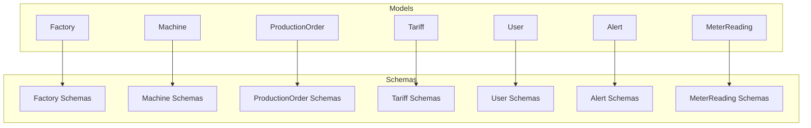
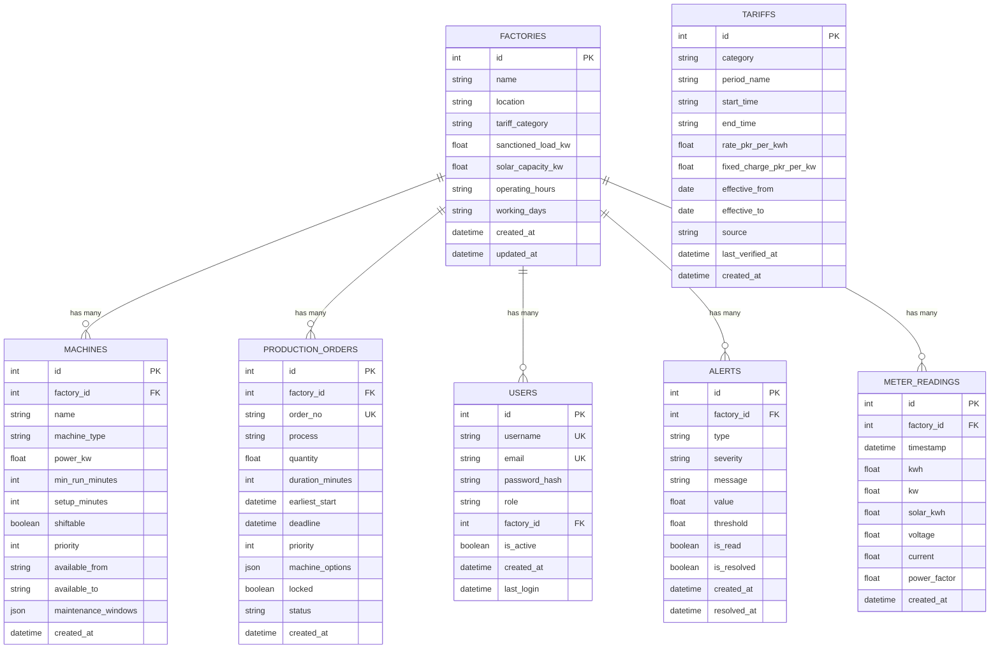
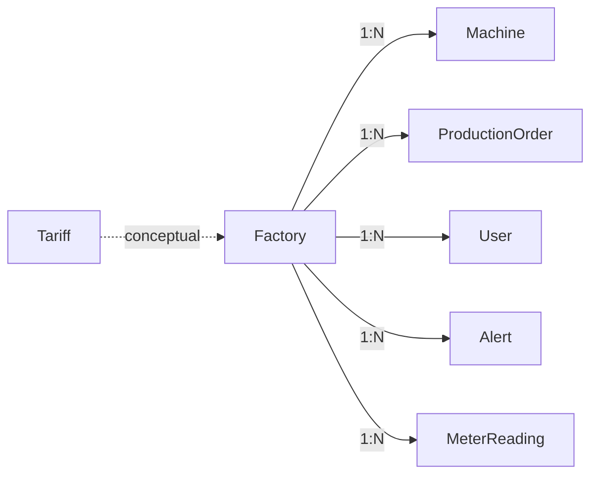

# Data Models & Database Schema

<cite>
**Referenced Files in This Document**
- [models/__init__.py](file://backend/app/models/__init__.py)
- [models/factory.py](file://backend/app/models/factory.py)
- [models/machine.py](file://backend/app/models/machine.py)
- [models/production_order.py](file://backend/app/models/production_order.py)
- [models/tariff.py](file://backend/app/models/tariff.py)
- [models/user.py](file://backend/app/models/user.py)
- [models/alert.py](file://backend/app/models/alert.py)
- [models/meter_reading.py](file://backend/app/models/meter_reading.py)
- [schemas/__init__.py](file://backend/app/schemas/__init__.py)
- [schemas/factory.py](file://backend/app/schemas/factory.py)
- [schemas/machine.py](file://backend/app/schemas/machine.py)
- [schemas/production_order.py](file://backend/app/schemas/production_order.py)
- [schemas/tariff.py](file://backend/app/schemas/tariff.py)
- [schemas/user.py](file://backend/app/schemas/user.py)
- [schemas/alert.py](file://backend/app/schemas/alert.py)
- [schemas/meter_reading.py](file://backend/app/schemas/meter_reading.py)
</cite>

## Table of Contents
1. [Introduction](#introduction)
2. [Project Structure](#project-structure)
3. [Core Components](#core-components)
4. [Architecture Overview](#architecture-overview)
5. [Detailed Component Analysis](#detailed-component-analysis)
6. [Dependency Analysis](#dependency-analysis)
7. [Performance Considerations](#performance-considerations)
8. [Troubleshooting Guide](#troubleshooting-guide)
9. [Conclusion](#conclusion)
10. [Appendices](#appendices)

## Introduction
This document provides a comprehensive data model and database schema reference for TariffGuard’s backend. It details the entity relationships among Factory, Machine, ProductionOrder, Tariff, User, Alert, and MeterReading; documents field definitions, types, constraints, keys, and validation rules enforced by Pydantic schemas and SQLAlchemy; and explains indexing strategies, query optimization patterns, performance considerations, data lifecycle, retention policies, and migration strategies. It also includes sample data structures and common query patterns used across the application.

## Project Structure
The data models are defined as SQLAlchemy ORM classes under app/models, while request/response validation is handled by Pydantic schemas under app/schemas. The models package exposes core entities for import throughout the application.

**Diagram sources**
- [models/__init__.py:1-16](file://backend/app/models/__init__.py#L1-L16)
- [schemas/__init__.py:1-15](file://backend/app/schemas/__init__.py#L1-L15)

**Section sources**
- [models/__init__.py:1-16](file://backend/app/models/__init__.py#L1-L16)
- [schemas/__init__.py:1-15](file://backend/app/schemas/__init__.py#L1-L15)

## Core Components
This section summarizes each entity’s purpose, key fields, constraints, and relationships.

- Factory
  - Purpose: Represents a manufacturing site with tariff category and capacity metadata.
  - Key fields: id (PK), name (required), location (default), tariff_category (required), sanctioned_load_kw (required), solar_capacity_kw (default), operating_hours (default), working_days (default), created_at, updated_at.
  - Relationships: One-to-many with Machine, ProductionOrder, User, Alert, MeterReading.

- Machine
  - Purpose: Represents production equipment within a factory.
  - Key fields: id (PK), factory_id (FK to Factory), name (required), machine_type (required), power_kw (required), min_run_minutes (default), setup_minutes (default), shiftable (default), priority (default), available_from/to (defaults), maintenance_windows (JSON), created_at.
  - Relationships: Belongs to Factory; referenced by ProductionOrder via machine_options.

- ProductionOrder
  - Purpose: Represents a scheduled or planned production job.
  - Key fields: id (PK), factory_id (FK), order_no (unique, required), process (required), quantity (required), duration_minutes (required), earliest_start (optional), deadline (required), priority (default), machine_options (JSON), locked (default), status (default), created_at.
  - Relationships: Belongs to Factory; references machines via JSON array of IDs.

- Tariff
  - Purpose: Defines time-based electricity tariffs and charges.
  - Key fields: id (PK), category (required), period_name (required), start_time/end_time (required), rate_pkr_per_kwh (required), fixed_charge_pkr_per_kw (default), effective_from (required), effective_to (nullable), source (default), last_verified_at (nullable), created_at.
  - Relationships: Conceptually associated with Factory via tariff_category; no direct FK.

- User
  - Purpose: Application user account with role and optional factory association.
  - Key fields: id (PK), username (unique, required), email (unique, required), password_hash (required), role (default), factory_id (nullable FK), is_active (default), created_at, last_login (nullable).
  - Relationships: Optional many-to-one with Factory.

- Alert
  - Purpose: System-generated notifications about factory conditions or events.
  - Key fields: id (PK), factory_id (FK), type (required), severity (default), message (required), value/threshold (nullable), is_read/is_resolved (defaults), created_at, resolved_at (nullable).
  - Relationships: Belongs to Factory.

- MeterReading
  - Purpose: Time-series energy consumption and quality metrics per factory.
  - Key fields: id (PK), factory_id (FK), timestamp (required), kwh (required), kw (nullable), solar_kwh (default), voltage/current/power_factor (nullable), created_at.
  - Relationships: Belongs to Factory.

**Section sources**
- [models/factory.py:5-17](file://backend/app/models/factory.py#L5-L17)
- [models/machine.py:5-20](file://backend/app/models/machine.py#L5-L20)
- [models/production_order.py:5-20](file://backend/app/models/production_order.py#L5-L20)
- [models/tariff.py:5-19](file://backend/app/models/tariff.py#L5-L19)
- [models/user.py:5-16](file://backend/app/models/user.py#L5-L16)
- [models/alert.py:5-18](file://backend/app/models/alert.py#L5-L18)
- [models/meter_reading.py:5-17](file://backend/app/models/meter_reading.py#L5-L17)

## Architecture Overview
The data layer uses SQLAlchemy ORM models with explicit foreign keys and indexes on primary keys. Pydantic schemas enforce input validation and shape API payloads. Relationships are primarily one-to-many from Factory to other entities, with additional associations through JSON arrays for flexible scheduling.

**Diagram sources**
- [models/factory.py:5-17](file://backend/app/models/factory.py#L5-L17)
- [models/machine.py:5-20](file://backend/app/models/machine.py#L5-L20)
- [models/production_order.py:5-20](file://backend/app/models/production_order.py#L5-L20)
- [models/tariff.py:5-19](file://backend/app/models/tariff.py#L5-L19)
- [models/user.py:5-16](file://backend/app/models/user.py#L5-L16)
- [models/alert.py:5-18](file://backend/app/models/alert.py#L5-L18)
- [models/meter_reading.py:5-17](file://backend/app/models/meter_reading.py#L5-L17)

## Detailed Component Analysis

### Factory
- Fields and constraints:
  - id: integer primary key, indexed.
  - name: string, not null.
  - location: string, default “Faisalabad”.
  - tariff_category: string, not null, default “Industrial”.
  - sanctioned_load_kw: float, not null.
  - solar_capacity_kw: float, default 0.
  - operating_hours: string, default “08:00-22:00”.
  - working_days: string, default “Mon-Sat”.
  - created_at/updated_at: timestamps with server defaults and auto-update.
- Validation (Pydantic):
  - FactoryBase requires name and numeric load; optional fields have defaults.
  - FactoryCreate inherits base fields; FactoryUpdate allows partial updates.
  - FactoryResponse includes id and created_at; enables ORM serialization.
- Indexing: Primary key index on id.
- Relationships: Referenced by Machine, ProductionOrder, User, Alert, MeterReading via foreign keys.

**Section sources**
- [models/factory.py:5-17](file://backend/app/models/factory.py#L5-L17)
- [schemas/factory.py:5-31](file://backend/app/schemas/factory.py#L5-L31)

### Machine
- Fields and constraints:
  - id: integer primary key, indexed.
  - factory_id: integer foreign key to factories.id, not null.
  - name: string, not null.
  - machine_type: string, not null.
  - power_kw: float, not null.
  - min_run_minutes: integer, default 60.
  - setup_minutes: integer, default 0.
  - shiftable: boolean, default true.
  - priority: integer, default 1.
  - available_from/to: strings, defaults.
  - maintenance_windows: JSON, nullable.
  - created_at: timestamp with server default.
- Validation (Pydantic):
  - MachineBase enforces required fields and sensible defaults.
  - MachineCreate requires factory_id; MachineResponse adds id, factory_id, created_at.
- Indexing: Primary key index on id; foreign key on factory_id (implicit).
- Relationships: Many-to-one with Factory; referenced by ProductionOrder via machine_options JSON.

**Section sources**
- [models/machine.py:5-20](file://backend/app/models/machine.py#L5-L20)
- [schemas/machine.py:5-26](file://backend/app/schemas/machine.py#L5-L26)

### ProductionOrder
- Fields and constraints:
  - id: integer primary key, indexed.
  - factory_id: integer foreign key to factories.id, not null.
  - order_no: string, unique, not null.
  - process: string, not null.
  - quantity: float, not null.
  - duration_minutes: integer, not null.
  - earliest_start: datetime, nullable.
  - deadline: datetime, not null.
  - priority: integer, default 2.
  - machine_options: JSON, nullable (list of machine ids).
  - locked: boolean, default false.
  - status: string, default “pending”.
  - created_at: timestamp with server default.
- Validation (Pydantic):
  - ProductionOrderBase enforces required fields and types; optional earliest_start.
  - ProductionOrderCreate requires factory_id; Response adds id, factory_id, status, created_at.
- Indexing: Primary key index on id; unique constraint on order_no; foreign key on factory_id (implicit).
- Relationships: Many-to-one with Factory; references machines via JSON array of ids.

**Section sources**
- [models/production_order.py:5-20](file://backend/app/models/production_order.py#L5-L20)
- [schemas/production_order.py:5-26](file://backend/app/schemas/production_order.py#L5-L26)

### Tariff
- Fields and constraints:
  - id: integer primary key, indexed.
  - category: string, not null.
  - period_name: string, not null.
  - start_time/end_time: strings, not null.
  - rate_pkr_per_kwh: float, not null.
  - fixed_charge_pkr_per_kw: float, default 0.
  - effective_from: date, not null.
  - effective_to: date, nullable.
  - source: string, default “NEPRA”.
  - last_verified_at: datetime, nullable.
  - created_at: timestamp with server default.
- Validation (Pydantic):
  - TariffBase enforces required fields and date/time formats; optional effective_to.
  - TariffCreate/TariffUpdate allow create/update; Response includes id and created_at.
- Indexing: Primary key index on id.
- Relationships: No direct FK; conceptually linked to Factory via tariff_category.

**Section sources**
- [models/tariff.py:5-19](file://backend/app/models/tariff.py#L5-L19)
- [schemas/tariff.py:5-35](file://backend/app/schemas/tariff.py#L5-L35)

### User
- Fields and constraints:
  - id: integer primary key, indexed.
  - username: string, unique, not null.
  - email: string, unique, not null.
  - password_hash: string, not null.
  - role: string, default “viewer”.
  - factory_id: integer foreign key to factories.id, nullable.
  - is_active: boolean, default true.
  - created_at: timestamp with server default.
  - last_login: datetime, nullable.
- Validation (Pydantic):
  - UserBase validates email format and role; UserCreate requires password; UserResponse omits sensitive fields.
  - Token wraps access_token and user payload.
- Indexing: Primary key index on id; unique constraints on username and email; foreign key on factory_id (implicit).
- Relationships: Optional many-to-one with Factory.

**Section sources**
- [models/user.py:5-16](file://backend/app/models/user.py#L5-L16)
- [schemas/user.py:5-30](file://backend/app/schemas/user.py#L5-L30)

### Alert
- Fields and constraints:
  - id: integer primary key, indexed.
  - factory_id: integer foreign key to factories.id, not null.
  - type: string, not null (e.g., peak_demand, deadline, low_solar, high_consumption).
  - severity: string, default “warning” (info, warning, critical).
  - message: string, not null.
  - value/threshold: floats, nullable.
  - is_read/is_resolved: booleans, default false.
  - created_at: timestamp with server default.
  - resolved_at: datetime, nullable.
- Validation (Pydantic):
  - AlertBase enforces required fields; AlertUpdate toggles read/resolved flags; AlertResponse includes lifecycle timestamps.
- Indexing: Primary key index on id; foreign key on factory_id (implicit).
- Relationships: Many-to-one with Factory.

**Section sources**
- [models/alert.py:5-18](file://backend/app/models/alert.py#L5-L18)
- [schemas/alert.py:5-28](file://backend/app/schemas/alert.py#L5-L28)

### MeterReading
- Fields and constraints:
  - id: integer primary key, indexed.
  - factory_id: integer foreign key to factories.id, not null.
  - timestamp: datetime, not null.
  - kwh: float, not null.
  - kw/voltage/current/power_factor: floats, nullable.
  - solar_kwh: float, default 0.
  - created_at: timestamp with server default.
- Validation (Pydantic):
  - MeterReadingBase enforces required fields and defaults; MeterReadingCreate requires factory_id; MeterReadingBulkCreate supports batch ingestion.
- Indexing: Primary key index on id; foreign key on factory_id (implicit).
- Relationships: Many-to-one with Factory.

**Section sources**
- [models/meter_reading.py:5-17](file://backend/app/models/meter_reading.py#L5-L17)
- [schemas/meter_reading.py:5-27](file://backend/app/schemas/meter_reading.py#L5-L27)

## Dependency Analysis
- Foreign key dependencies:
  - Machine.factory_id -> Factory.id
  - ProductionOrder.factory_id -> Factory.id
  - User.factory_id -> Factory.id
  - Alert.factory_id -> Factory.id
  - MeterReading.factory_id -> Factory.id
- Unique constraints:
  - ProductionOrder.order_no
  - User.username, User.email
- JSON fields:
  - Machine.maintenance_windows (list of time ranges)
  - ProductionOrder.machine_options (list of machine ids)
- Cardinality:
  - Factory has many Machines, ProductionOrders, Users, Alerts, MeterReadings.
  - Tariff is independent but conceptually tied to Factory via tariff_category.

**Diagram sources**
- [models/machine.py:5-20](file://backend/app/models/machine.py#L5-L20)
- [models/production_order.py:5-20](file://backend/app/models/production_order.py#L5-L20)
- [models/user.py:5-16](file://backend/app/models/user.py#L5-L16)
- [models/alert.py:5-18](file://backend/app/models/alert.py#L5-L18)
- [models/meter_reading.py:5-17](file://backend/app/models/meter_reading.py#L5-L17)
- [models/tariff.py:5-19](file://backend/app/models/tariff.py#L5-L19)

**Section sources**
- [models/machine.py:5-20](file://backend/app/models/machine.py#L5-L20)
- [models/production_order.py:5-20](file://backend/app/models/production_order.py#L5-L20)
- [models/user.py:5-16](file://backend/app/models/user.py#L5-L16)
- [models/alert.py:5-18](file://backend/app/models/alert.py#L5-L18)
- [models/meter_reading.py:5-17](file://backend/app/models/meter_reading.py#L5-L17)
- [models/tariff.py:5-19](file://backend/app/models/tariff.py#L5-L19)

## Performance Considerations
- Indexing strategy:
  - Primary key indexes exist on all tables.
  - Recommended additional indexes:
    - MeterReading(factory_id, timestamp) for time-series queries per factory.
    - Alert(factory_id, created_at) for recent alerts per factory.
    - ProductionOrder(factory_id, deadline) for scheduling queries.
    - User(username), User(email) already unique; consider index on factory_id if frequently filtered.
- Query optimization patterns:
  - Use factory-scoped queries to limit result sets.
  - For meter readings, aggregate by hour/day using timestamp truncation functions supported by your database.
  - For production orders, filter by status and deadline to prioritize scheduling.
- Storage considerations:
  - MeterReading grows rapidly; consider partitioning by month or year and archiving old data.
  - JSON fields (maintenance_windows, machine_options) should be kept concise; validate structure at the API layer.
- Concurrency:
  - Ensure transactions around multi-step operations like creating an order and generating alerts.
  - Use optimistic locking or versioned rows where necessary for production orders.

[No sources needed since this section provides general guidance]

## Troubleshooting Guide
- Validation errors:
  - Missing required fields in requests will fail Pydantic validation before reaching the database.
  - Email format invalid in UserCreate will raise a validation error.
- Constraint violations:
  - Duplicate order_no or user credentials will trigger unique constraint errors.
  - Inserting a Machine or Order without a valid factory_id will fail due to foreign key constraints.
- Common issues:
  - Timezone mismatches: ensure timestamps are stored consistently (UTC recommended).
  - JSON parsing: malformed maintenance_windows or machine_options will cause serialization errors.
- Diagnostics:
  - Log failed validations and constraint errors with context (factory_id, order_no).
  - Use alert thresholds to detect anomalies in meter readings and production deadlines.

**Section sources**
- [schemas/user.py:5-30](file://backend/app/schemas/user.py#L5-L30)
- [schemas/meter_reading.py:5-27](file://backend/app/schemas/meter_reading.py#L5-L27)
- [schemas/production_order.py:5-26](file://backend/app/schemas/production_order.py#L5-L26)
- [models/production_order.py:5-20](file://backend/app/models/production_order.py#L5-L20)
- [models/user.py:5-16](file://backend/app/models/user.py#L5-L16)

## Conclusion
TariffGuard’s data model centers on Factory as the root entity, with related entities for machines, orders, users, alerts, and meter readings. SQLAlchemy enforces referential integrity and basic constraints, while Pydantic schemas provide robust input validation and consistent API contracts. With appropriate indexing, partitioning, and transactional practices, the system can scale to handle high-frequency meter readings and complex scheduling workflows.

[No sources needed since this section summarizes without analyzing specific files]

## Appendices

### Sample Data Structures
- Factory
  - Example payload: name, location, tariff_category, sanctioned_load_kw, solar_capacity_kw, operating_hours, working_days.
  - Reference: [schemas/factory.py:5-31](file://backend/app/schemas/factory.py#L5-L31)
- Machine
  - Example payload: factory_id, name, machine_type, power_kw, min_run_minutes, setup_minutes, shiftable, priority, available_from/to, maintenance_windows.
  - Reference: [schemas/machine.py:5-26](file://backend/app/schemas/machine.py#L5-L26)
- ProductionOrder
  - Example payload: factory_id, order_no, process, quantity, duration_minutes, earliest_start, deadline, priority, machine_options, locked, status.
  - Reference: [schemas/production_order.py:5-26](file://backend/app/schemas/production_order.py#L5-L26)
- Tariff
  - Example payload: category, period_name, start_time, end_time, rate_pkr_per_kwh, fixed_charge_pkr_per_kw, effective_from, effective_to, source.
  - Reference: [schemas/tariff.py:5-35](file://backend/app/schemas/tariff.py#L5-L35)
- User
  - Example payload: username, email, password (create), role, factory_id.
  - Reference: [schemas/user.py:5-30](file://backend/app/schemas/user.py#L5-L30)
- Alert
  - Example payload: factory_id, type, severity, message, value, threshold.
  - Reference: [schemas/alert.py:5-28](file://backend/app/schemas/alert.py#L5-L28)
- MeterReading
  - Example payload: factory_id, timestamp, kwh, kw, solar_kwh, voltage, current, power_factor.
  - Reference: [schemas/meter_reading.py:5-27](file://backend/app/schemas/meter_reading.py#L5-L27)

### Common Query Patterns
- List recent alerts for a factory:
  - Filter by factory_id and order by created_at descending; mark as read upon retrieval.
- Schedule production orders:
  - Query pending orders with upcoming deadlines; select eligible machines based on availability windows and priorities.
- Analyze energy consumption:
  - Aggregate MeterReading by hour/day per factory; compute peak demand and average consumption.
- Validate tariff applicability:
  - Match current time against tariff periods; apply rates based on category and effective dates.

[No sources needed since this section provides general guidance]

### Data Lifecycle, Retention, and Migration Strategies
- Lifecycle:
  - MeterReading: continuous ingestion; archive or purge older records based on retention policy.
  - Alert: resolve and optionally archive after resolution; keep historical alerts for auditing.
  - ProductionOrder: progress through statuses; lock finalized orders to prevent changes.
- Retention:
  - Implement periodic jobs to archive MeterReading beyond a configurable window.
  - Purge resolved Alerts after a retention period to control growth.
- Migration:
  - Use migrations to add indexes (e.g., MeterReading(factory_id, timestamp)) and new columns safely.
  - Backfill JSON fields where necessary and validate existing data during migrations.

[No sources needed since this section provides general guidance]