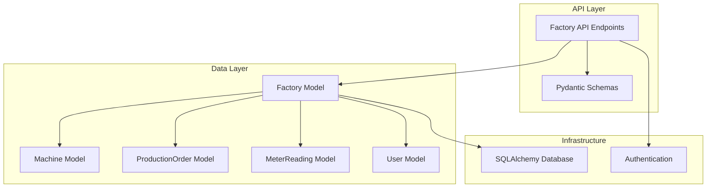
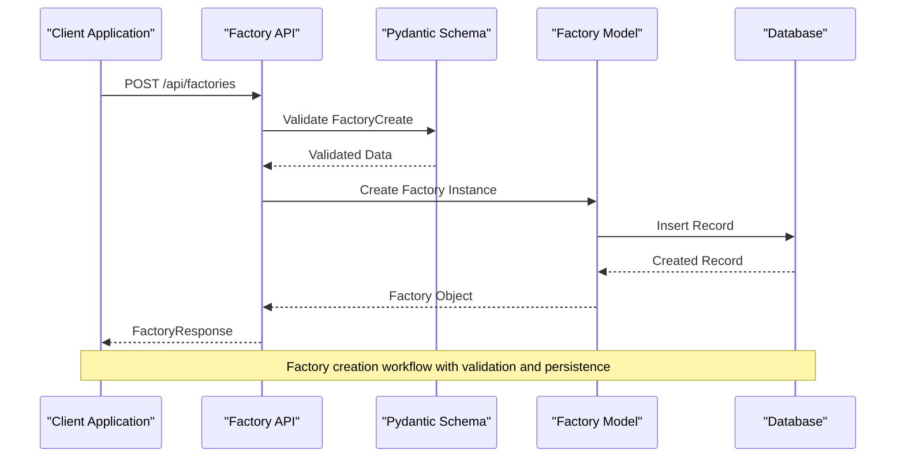
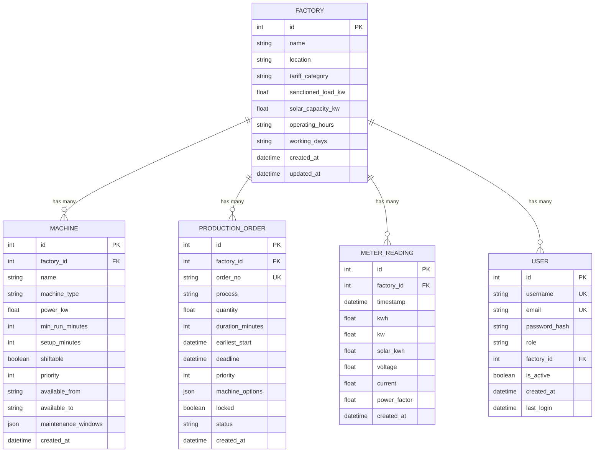
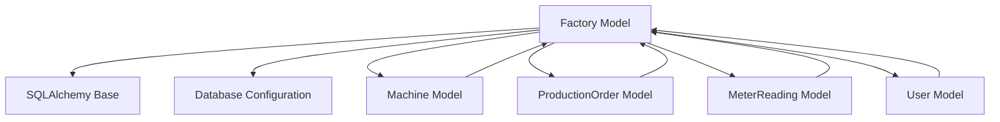

# Factory Model

<cite>
**Referenced Files in This Document**
- [factory.py](file://backend/app/models/factory.py)
- [factory.py](file://backend/app/schemas/factory.py)
- [factory.py](file://backend/app/api/factory.py)
- [machine.py](file://backend/app/models/machine.py)
- [production_order.py](file://backend/app/models/production_order.py)
- [meter_reading.py](file://backend/app/models/meter_reading.py)
- [user.py](file://backend/app/models/user.py)
- [database.py](file://backend/app/core/database.py)
- [seed.py](file://backend/seed.py)
</cite>

## Table of Contents
1. [Introduction](#introduction)
2. [Project Structure](#project-structure)
3. [Core Components](#core-components)
4. [Architecture Overview](#architecture-overview)
5. [Detailed Component Analysis](#detailed-component-analysis)
6. [Dependency Analysis](#dependency-analysis)
7. [Performance Considerations](#performance-considerations)
8. [Troubleshooting Guide](#troubleshooting-guide)
9. [Conclusion](#conclusion)
10. [Appendices](#appendices)

## Introduction
This document provides comprehensive data model documentation for the Factory entity, which serves as the root entity representing manufacturing facilities and their operational parameters. The Factory model defines core attributes such as capacity limits, tariff classification, operating schedules, and location details that govern energy consumption patterns and cost optimization across machines, orders, and meter readings within a facility.

## Project Structure
The Factory entity is implemented using SQLAlchemy ORM with Pydantic schemas for API validation. The implementation follows a clean separation between database models, API schemas, and business logic layers.



**Diagram sources**
- [factory.py:5-17](file://backend/app/models/factory.py#L5-L17)
- [machine.py:5-20](file://backend/app/models/machine.py#L5-L20)
- [production_order.py:5-20](file://backend/app/models/production_order.py#L5-L20)
- [meter_reading.py:5-17](file://backend/app/models/meter_reading.py#L5-L17)
- [user.py:5-16](file://backend/app/models/user.py#L5-L16)

**Section sources**
- [factory.py:1-17](file://backend/app/models/factory.py#L1-L17)
- [database.py:1-37](file://backend/app/core/database.py#L1-L37)

## Core Components
The Factory entity consists of several key components working together to provide comprehensive factory management capabilities:

### Database Model
The Factory class extends the SQLAlchemy Base class and defines the database schema with appropriate constraints and relationships.

### API Schemas
Pydantic schemas provide request/response validation and serialization for Factory-related API endpoints.

### Business Logic
Factory operations are exposed through RESTful API endpoints with proper authentication and authorization controls.

**Section sources**
- [factory.py:5-17](file://backend/app/models/factory.py#L5-L17)
- [factory.py:5-31](file://backend/app/schemas/factory.py#L5-L31)
- [factory.py:13-81](file://backend/app/api/factory.py#L13-L81)

## Architecture Overview
The Factory entity serves as the central hub in the TariffGuard system architecture, connecting various operational components and providing the foundation for energy monitoring, cost optimization, and production scheduling.



**Diagram sources**
- [factory.py:13-24](file://backend/app/api/factory.py#L13-L24)
- [factory.py:5-17](file://backend/app/models/factory.py#L5-L17)
- [factory.py:14-15](file://backend/app/schemas/factory.py#L14-L15)

## Detailed Component Analysis

### Factory Entity Definition
The Factory model represents a manufacturing facility with its operational characteristics and capacity constraints.

#### Field Definitions and Constraints

| Field | Type | Constraints | Default Value | Description |
|-------|------|-------------|---------------|-------------|
| id | Integer | Primary Key, Indexed | Auto-increment | Unique identifier for the factory |
| name | String(100) | NOT NULL | None | Factory name (required) |
| location | String(100) | Nullable | "Faisalabad" | Geographic location of the factory |
| tariff_category | String(50) | NOT NULL | "Industrial" | Energy tariff classification |
| sanctioned_load_kw | Float | NOT NULL | None | Maximum authorized power load in kilowatts |
| solar_capacity_kw | Float | Nullable | 0 | Installed solar power capacity in kilowatts |
| operating_hours | String(50) | Nullable | "08:00-22:00" | Daily operating time range |
| working_days | String(50) | Nullable | "Mon-Sat" | Days when factory operates |
| created_at | DateTime | Server Default | Current timestamp | Record creation timestamp |
| updated_at | DateTime | On Update | Current timestamp | Last modification timestamp |

#### Data Types and Validation Rules
- **Integer fields**: Used for numeric identifiers and counts with automatic indexing for performance
- **String fields**: Limited to specific lengths to ensure data consistency and storage efficiency
- **Float fields**: Support decimal precision for power measurements and capacity calculations
- **DateTime fields**: Automatically managed by database server for audit trails

**Section sources**
- [factory.py:8-16](file://backend/app/models/factory.py#L8-L16)

### Factory Relationships
The Factory entity maintains one-to-many relationships with other core entities, establishing it as the root of the operational hierarchy.

#### Relationship Diagram


**Diagram sources**
- [factory.py:5-17](file://backend/app/models/factory.py#L5-L17)
- [machine.py:5-20](file://backend/app/models/machine.py#L5-L20)
- [production_order.py:5-20](file://backend/app/models/production_order.py#L5-L20)
- [meter_reading.py:5-17](file://backend/app/models/meter_reading.py#L5-L17)
- [user.py:5-16](file://backend/app/models/user.py#L5-L16)

### API Endpoints and Operations
The Factory entity exposes comprehensive CRUD operations through RESTful API endpoints with proper authentication and authorization controls.

#### Available Operations
- **Create Factory**: POST /api/factories - Requires manager or owner role
- **List Factories**: GET /api/factories - Supports pagination with skip/limit parameters
- **Get Factory**: GET /api/factories/{factory_id} - Retrieve specific factory details
- **Update Factory**: PUT /api/factories/{factory_id} - Modify factory properties
- **Delete Factory**: DELETE /api/factories/{factory_id} - Remove factory (owner only)

#### Authentication and Authorization
- **Manager Role**: Required for creating and updating factories
- **Owner Role**: Required for deleting factories
- **Authenticated Users**: Can list and view factory information

**Section sources**
- [factory.py:13-81](file://backend/app/api/factory.py#L13-L81)

### Example Factory Configurations
Based on the seed data and model structure, here are example configurations for different industrial scenarios:

#### Textile Manufacturing Factory
```json
{
  "name": "Faisalabad Textile Unit 01",
  "location": "Faisalabad, Pakistan",
  "tariff_category": "Industrial",
  "sanctioned_load_kw": 250,
  "solar_capacity_kw": 200,
  "operating_hours": "08:00-22:00",
  "working_days": "Mon-Sat"
}
```

#### Industrial Processing Plant
```json
{
  "name": "Industrial Processing Center",
  "location": "Karachi Industrial Zone",
  "tariff_category": "Commercial",
  "sanctioned_load_kw": 500,
  "solar_capacity_kw": 150,
  "operating_hours": "06:00-23:00",
  "working_days": "Mon-Fri"
}
```

#### Small Scale Manufacturing Unit
```json
{
  "name": "Small Manufacturing Unit",
  "location": "Lahore Industrial Area",
  "tariff_category": "Industrial",
  "sanctioned_load_kw": 100,
  "solar_capacity_kw": 50,
  "operating_hours": "09:00-18:00",
  "working_days": "Mon-Sat"
}
```

**Section sources**
- [seed.py:24-40](file://backend/seed.py#L24-L40)

## Dependency Analysis
The Factory entity has well-defined dependencies and relationships throughout the application architecture.

### Direct Dependencies
- **SQLAlchemy Base**: Inherits from the declarative base for ORM functionality
- **Database Configuration**: Uses centralized database connection management
- **Pydantic Models**: Leverages schema validation for API requests and responses

### Relationship Dependencies
- **Machines**: Each factory can have multiple machines with power specifications
- **Production Orders**: Factory-specific production planning and scheduling
- **Meter Readings**: Energy consumption tracking per facility
- **Users**: User accounts associated with specific factories



**Diagram sources**
- [factory.py:1-3](file://backend/app/models/factory.py#L1-L3)
- [machine.py:1-3](file://backend/app/models/machine.py#L1-L3)
- [production_order.py:1-3](file://backend/app/models/production_order.py#L1-L3)
- [meter_reading.py:1-3](file://backend/app/models/meter_reading.py#L1-L3)
- [user.py:1-3](file://backend/app/models/user.py#L1-L3)

**Section sources**
- [factory.py:1-3](file://backend/app/models/factory.py#L1-L3)
- [database.py:1-37](file://backend/app/core/database.py#L1-L37)

## Performance Considerations
Several performance optimizations are built into the Factory model implementation:

### Database Optimization
- **Primary Key Indexing**: Automatic indexing on the `id` field for fast lookups
- **Efficient Query Patterns**: Simple filter operations for common queries
- **Connection Management**: Proper session handling with automatic cleanup

### Schema Design Benefits
- **Fixed-Length Strings**: Pre-allocated string lengths reduce memory overhead
- **Appropriate Data Types**: Using Float for power measurements ensures precision without excessive storage
- **Timestamp Management**: Server-side timestamps reduce client-server communication overhead

### Query Performance
- **Pagination Support**: List operations support skip/limit parameters for large datasets
- **Selective Updates**: Partial updates using exclude_unset pattern minimize database writes
- **Relationship Queries**: Foreign key relationships enable efficient joins and filtering

## Troubleshooting Guide

### Common Issues and Solutions

#### Factory Creation Errors
- **Validation Failures**: Ensure all required fields (name, tariff_category, sanctioned_load_kw) are provided
- **Duplicate Names**: While not explicitly constrained, consider implementing unique constraints for factory names
- **Invalid Power Values**: Sanctioned load must be positive; negative values will cause validation errors

#### Relationship Integrity
- **Orphaned Records**: Deleting a factory may leave related records if foreign key constraints aren't properly configured
- **Missing References**: Ensure factory_id references exist before creating related entities

#### Performance Issues
- **Large Dataset Queries**: Use pagination parameters (skip, limit) when listing factories
- **N+1 Query Problems**: Implement eager loading when fetching factories with related entities

### Error Handling Patterns
The API implements consistent error handling with HTTP status codes:
- **404 Not Found**: When attempting to access non-existent factories
- **401 Unauthorized**: For unauthenticated access attempts
- **403 Forbidden**: When users lack required roles for operations

**Section sources**
- [factory.py:44-47](file://backend/app/api/factory.py#L44-L47)
- [factory.py:57-60](file://backend/app/api/factory.py#L57-L60)
- [factory.py:75-78](file://backend/app/api/factory.py#L75-L78)

## Conclusion
The Factory entity serves as the foundational component in the TariffGuard system, providing essential infrastructure for managing manufacturing facilities and their operational parameters. Its design emphasizes scalability, maintainability, and clear separation of concerns across database, API, and business logic layers. The entity's relationships with machines, orders, meter readings, and users create a comprehensive framework for energy monitoring, cost optimization, and production planning.

The implementation demonstrates best practices in modern web application development, including proper validation, authentication, error handling, and performance optimization. The Factory model's flexibility in handling different industrial scenarios while maintaining data integrity makes it suitable for diverse manufacturing environments.

## Appendices

### Common Query Patterns

#### Basic Factory Operations
```python
# Get all factories
factories = db.query(Factory).all()

# Get factory by ID
factory = db.query(Factory).filter(Factory.id == factory_id).first()

# Create new factory
new_factory = Factory(name="New Factory", ...)
db.add(new_factory)
db.commit()
```

#### Related Entity Queries
```python
# Get machines for a factory
machines = db.query(Machine).filter(Machine.factory_id == factory_id).all()

# Get production orders for a factory
orders = db.query(ProductionOrder).filter(ProductionOrder.factory_id == factory_id).all()

# Get meter readings for a factory
readings = db.query(MeterReading).filter(MeterReading.factory_id == factory_id).all()
```

### JSON Response Structure
Factory API responses follow a consistent structure:
```json
{
  "id": 1,
  "name": "Factory Name",
  "location": "Location",
  "tariff_category": "Industrial",
  "sanctioned_load_kw": 250.0,
  "solar_capacity_kw": 200.0,
  "operating_hours": "08:00-22:00",
  "working_days": "Mon-Sat",
  "created_at": "2024-01-01T00:00:00",
  "updated_at": "2024-01-01T00:00:00"
}
```

**Section sources**
- [factory.py:26-31](file://backend/app/schemas/factory.py#L26-L31)
- [seed.py:27-35](file://backend/seed.py#L27-L35)