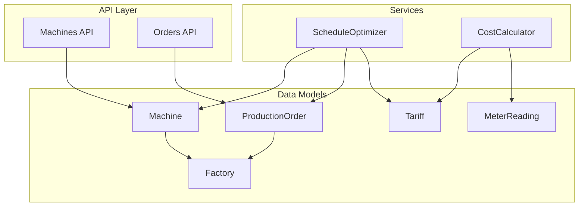
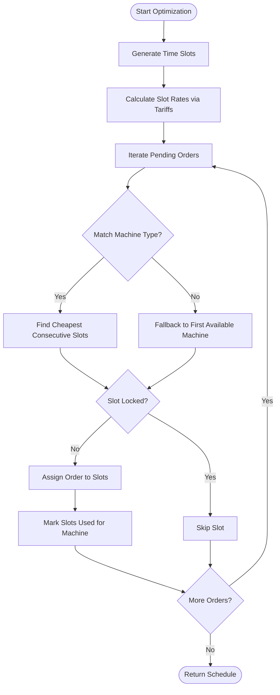
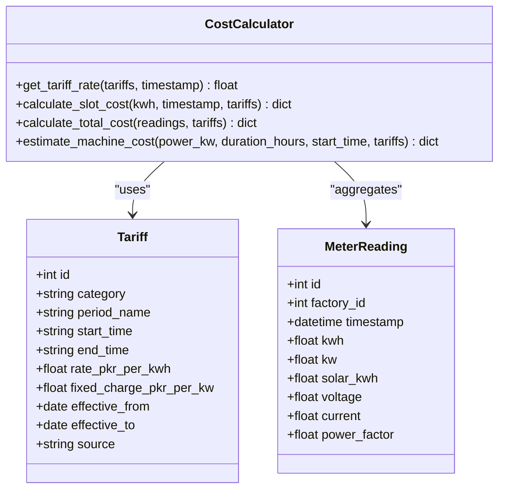
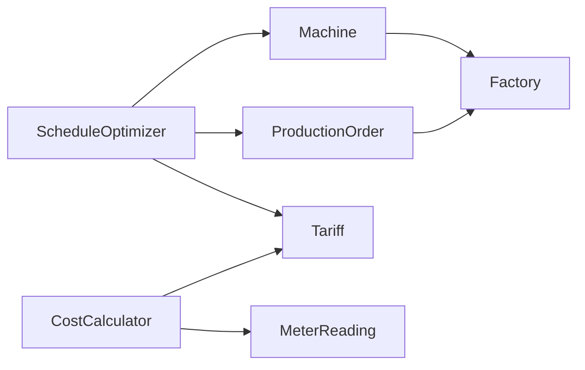

# Machine Model

<cite>
**Referenced Files in This Document**
- [machine.py](file://backend/app/models/machine.py)
- [machine.py](file://backend/app/schemas/machine.py)
- [machine.py](file://backend/app/api/machine.py)
- [factory.py](file://backend/app/models/factory.py)
- [production_order.py](file://backend/app/models/production_order.py)
- [production_order.py](file://backend/app/schemas/production_order.py)
- [optimizer.py](file://backend/app/services/optimizer.py)
- [cost_calculator.py](file://backend/app/services/cost_calculator.py)
- [meter_reading.py](file://backend/app/models/meter_reading.py)
- [tariff.py](file://backend/app/models/tariff.py)
</cite>

## Table of Contents
1. Introduction
2. Project Structure
3. Core Components
4. Architecture Overview
5. Detailed Component Analysis
6. Dependency Analysis
7. Performance Considerations
8. Troubleshooting Guide
9. Conclusion
10. Appendices

## Introduction
This document provides a comprehensive data model reference for the Machine entity and its relationships within the TariffGuard system. It explains machine specifications, power consumption ratings, type categorization, availability windows, maintenance windows, and status tracking. It also details how machines are linked to factories, how they participate in production scheduling and energy monitoring, and how machine availability influences scheduling algorithms. Examples cover different machine types (spinning, weaving, processing), validation rules for power ratings and operational constraints, sample data structures, and query patterns for machine management operations.

## Project Structure
The Machine entity is defined as a database model and exposed via API endpoints with Pydantic schemas for request/response validation. It participates in scheduling through an optimizer service that considers tariffs, pending orders, and machine attributes. Energy monitoring integrates via meter readings and tariff-based cost calculations.



**Diagram sources**
- [machine.py:5-20](file://backend/app/models/machine.py#L5-L20)
- [factory.py:5-17](file://backend/app/models/factory.py#L5-L17)
- [production_order.py:5-20](file://backend/app/models/production_order.py#L5-L20)
- [tariff.py:5-19](file://backend/app/models/tariff.py#L5-L19)
- [meter_reading.py:5-17](file://backend/app/models/meter_reading.py#L5-L17)
- [optimizer.py:14-190](file://backend/app/services/optimizer.py#L14-L190)
- [cost_calculator.py:12-110](file://backend/app/services/cost_calculator.py#L12-L110)
- [machine.py:11-65](file://backend/app/api/machine.py#L11-L65)
- [production_order.py:11-66](file://backend/app/api/production_order.py#L11-L66)

**Section sources**
- [machine.py:5-20](file://backend/app/models/machine.py#L5-L20)
- [machine.py:11-65](file://backend/app/api/machine.py#L11-L65)
- [optimizer.py:14-190](file://backend/app/services/optimizer.py#L14-L190)
- [cost_calculator.py:12-110](file://backend/app/services/cost_calculator.py#L12-L110)

## Core Components
- Machine model defines identity, factory linkage, type, power rating, minimum run time, setup time, shiftability, priority, availability windows, maintenance windows, and creation timestamp.
- Factory model provides organizational context and capacity constraints such as sanctioned load and operating hours.
- ProductionOrder model represents jobs with duration, deadlines, priorities, and optional machine options.
- ScheduleOptimizer uses Machine, ProductionOrder, and Tariff to generate cost-optimal schedules.
- CostCalculator computes energy costs using Tariff periods and MeterReading consumption data.

Key responsibilities:
- Machine: store physical and operational attributes; link to factory; provide availability and constraints for scheduling.
- ProductionOrder: define work to be scheduled; constrain timing via earliest start and deadline; indicate priority and lock status.
- Tariff: define time-of-use rates used by optimizer and cost calculator.
- MeterReading: record actual energy usage for monitoring and cost accounting.

**Section sources**
- [machine.py:5-20](file://backend/app/models/machine.py#L5-L20)
- [factory.py:5-17](file://backend/app/models/factory.py#L5-L17)
- [production_order.py:5-20](file://backend/app/models/production_order.py#L5-L20)
- [optimizer.py:25-190](file://backend/app/services/optimizer.py#L25-L190)
- [cost_calculator.py:15-110](file://backend/app/services/cost_calculator.py#L15-L110)
- [meter_reading.py:5-17](file://backend/app/models/meter_reading.py#L5-L17)
- [tariff.py:5-19](file://backend/app/models/tariff.py#L5-L19)

## Architecture Overview
The Machine entity sits at the center of production scheduling and energy cost optimization. Scheduling queries available machines per factory, matches orders to suitable machine types, and assigns time slots based on tariff-driven costs while respecting machine availability and previously locked slots. Energy monitoring aggregates meter readings against tariff periods to compute costs and peak demand.

```mermaid
sequenceDiagram
participant Client as "Client"
participant API as "Machines API"
participant DB as "Database"
participant OPT as "ScheduleOptimizer"
participant COST as "CostCalculator"
participant T as "Tariff"
participant M as "Machine"
participant O as "ProductionOrder"
Client->>API : GET /api/machines?factory_id=...
API->>DB : Query Machines by factory_id
DB-->>API : List[Machine]
API-->>Client : Response[Machine]
Client->>OPT : create_optimized_schedule(factory_id, start, end)
OPT->>DB : Get Tariffs, Machines, Pending Orders
OPT->>COST : calculate_slot_rates(slots, tariffs)
loop For each order
OPT->>OPT : find suitable machine by process/type
OPT->>OPT : find_optimal_slots(duration, locked_slots)
OPT->>COST : estimate cost per slot
OPT->>DB : Mark slots used per machine
end
OPT-->>Client : Schedule with costs and KWh estimates
```

**Diagram sources**
- [machine.py:11-65](file://backend/app/api/machine.py#L11-L65)
- [optimizer.py:25-190](file://backend/app/services/optimizer.py#L25-L190)
- [cost_calculator.py:15-110](file://backend/app/services/cost_calculator.py#L15-L110)
- [tariff.py:5-19](file://backend/app/models/tariff.py#L5-L19)
- [production_order.py:5-20](file://backend/app/models/production_order.py#L5-L20)

## Detailed Component Analysis

### Machine Data Model
- Identity and linkage:
  - id: primary key
  - factory_id: foreign key linking to Factory
- Specifications and ratings:
  - name: descriptive identifier
  - machine_type: category string used to match orders (e.g., spinning, weaving, processing)
  - power_kw: continuous power rating used to estimate energy consumption
  - min_run_minutes: minimum continuous runtime constraint
  - setup_minutes: non-productive setup time before operation
  - shiftable: boolean indicating whether the job can be shifted across time slots
  - priority: integer priority for scheduling preference
- Availability and maintenance:
  - available_from, available_to: daily time window strings representing operational hours
  - maintenance_windows: JSON list of time ranges when the machine is unavailable
- Metadata:
  - created_at: automatic timestamp

Validation and constraints:
- Required fields: factory_id, name, machine_type, power_kw
- Defaults: min_run_minutes=60, setup_minutes=0, shiftable=True, priority=1, available_from="08:00", available_to="22:00"
- Type enforcement via Pydantic schemas ensures numeric and string formats for requests

Example machine types and attributes:
- Spinning: typical high-power continuous process; ensure min_run_minutes aligns with process stability
- Weaving: moderate power with potential setup overhead; consider setup_minutes for scheduling
- Processing: may include dyeing or finishing; adjust shiftable and priority based on urgency

Operational constraints:
- Ensure power_kw does not exceed factory sanctioned_load_kw when multiple machines run concurrently
- Respect available_from/available_to and maintenance_windows when generating schedules
- Use min_run_minutes to enforce contiguous scheduling blocks

**Section sources**
- [machine.py:5-20](file://backend/app/models/machine.py#L5-L20)
- [machine.py:5-26](file://backend/app/schemas/machine.py#L5-L26)
- [factory.py:5-17](file://backend/app/models/factory.py#L5-L17)

### Factory Relationship
- Machines belong to a Factory via factory_id.
- Factory-level constraints influence machine utilization:
  - sanctioned_load_kw: total allowable concurrent power draw
  - operating_hours: overall factory availability window
  - working_days: days when production is allowed

Scheduling implications:
- The optimizer filters machines by factory_id and respects per-machine availability windows within factory constraints.

**Section sources**
- [machine.py:9](file://backend/app/models/machine.py#L9)
- [factory.py:5-17](file://backend/app/models/factory.py#L5-L17)

### Production Order Relationship
- Orders specify process (matching machine_type), quantity, duration, earliest_start, deadline, priority, and optional machine_options.
- The optimizer matches orders to machines where machine_type equals order.process (case-insensitive).
- Locked orders or locked slots are excluded from reassignment during optimization.

Availability effects on scheduling:
- If no suitable machine exists, fallback behavior selects the first available machine (if any).
- Shiftable flag allows moving jobs to cheaper slots; non-shiftable jobs may be constrained to specific times.

**Section sources**
- [production_order.py:5-20](file://backend/app/models/production_order.py#L5-L20)
- [production_order.py:5-26](file://backend/app/schemas/production_order.py#L5-L26)
- [optimizer.py:120-175](file://backend/app/services/optimizer.py#L120-L175)

### Scheduling Algorithm and Machine Availability
Core algorithm steps:
- Generate hourly time slots between start and end times.
- Compute tariff rate per slot using CostCalculator.
- For each pending order:
  - Find suitable machines by matching process to machine_type.
  - Select cheapest consecutive slots for the required duration, skipping locked slots.
  - Estimate energy consumption and cost using machine.power_kw and slot rates.
  - Mark selected slots as used for that machine to prevent conflicts.



**Diagram sources**
- [optimizer.py:36-190](file://backend/app/services/optimizer.py#L36-L190)
- [cost_calculator.py:15-50](file://backend/app/services/cost_calculator.py#L15-L50)

**Section sources**
- [optimizer.py:36-190](file://backend/app/services/optimizer.py#L36-L190)
- [cost_calculator.py:15-50](file://backend/app/services/cost_calculator.py#L15-L50)

### Energy Monitoring Integration
- MeterReading records factory-level energy metrics including kWh, kW, solar contribution, voltage, current, and power factor.
- CostCalculator aggregates readings to compute total cost, grid consumption, peak demand, and average rate using tariff periods.
- Machine power_kw and duration inform estimated consumption; actual consumption is validated against meter readings for monitoring and anomaly detection.



**Diagram sources**
- [meter_reading.py:5-17](file://backend/app/models/meter_reading.py#L5-L17)
- [tariff.py:5-19](file://backend/app/models/tariff.py#L5-L19)
- [cost_calculator.py:15-110](file://backend/app/services/cost_calculator.py#L15-L110)

**Section sources**
- [meter_reading.py:5-17](file://backend/app/models/meter_reading.py#L5-L17)
- [cost_calculator.py:15-110](file://backend/app/services/cost_calculator.py#L15-L110)

### API Operations for Machine Management
- Create machine: requires manager role; validates payload via MachineCreate schema.
- List machines: supports filtering by factory_id; pagination via skip/limit.
- Get machine: returns single machine by id; 404 if not found.
- Delete machine: requires manager role; removes machine record.

Authentication and authorization:
- Manager or owner roles required for write operations.
- Any authenticated user can read machines.

**Section sources**
- [machine.py:11-65](file://backend/app/api/machine.py#L11-L65)

## Dependency Analysis
- Machine depends on Factory via foreign key.
- ProductionOrder depends on Factory via foreign key.
- ScheduleOptimizer depends on Machine, ProductionOrder, and Tariff models.
- CostCalculator depends on Tariff and MeterReading models.
- APIs depend on models and schemas for validation and persistence.



**Diagram sources**
- [machine.py:5-20](file://backend/app/models/machine.py#L5-L20)
- [production_order.py:5-20](file://backend/app/models/production_order.py#L5-L20)
- [optimizer.py:14-190](file://backend/app/services/optimizer.py#L14-L190)
- [cost_calculator.py:12-110](file://backend/app/services/cost_calculator.py#L12-L110)

**Section sources**
- [machine.py:5-20](file://backend/app/models/machine.py#L5-L20)
- [production_order.py:5-20](file://backend/app/models/production_order.py#L5-L20)
- [optimizer.py:14-190](file://backend/app/services/optimizer.py#L14-L190)
- [cost_calculator.py:12-110](file://backend/app/services/cost_calculator.py#L12-L110)

## Performance Considerations
- Filtering machines by factory_id reduces query scope and improves performance.
- Pagination parameters (skip, limit) prevent large result sets.
- Scheduling complexity grows with number of orders, machines, and time slots; consider limiting optimization horizon and using efficient slot selection strategies.
- Avoid excessive recalculations by caching tariff rates per slot when possible.
- Monitor peak kW from meter readings to detect overloads relative to factory sanctioned_load_kw.

[No sources needed since this section provides general guidance]

## Troubleshooting Guide
Common issues and resolutions:
- 404 Not Found: Occurs when querying non-existent machine or order IDs; verify IDs and existence.
- Role errors: Write operations require manager or owner roles; ensure correct authentication.
- Scheduling conflicts: Locked slots or overlapping assignments cause skipped slots; review used_slots logic and machine availability windows.
- Power overload: If concurrent machine runs exceed factory sanctioned_load_kw, reschedule or reduce simultaneous operations.
- Invalid time windows: Ensure available_from/available_to and maintenance_windows do not conflict with order deadlines.

Error handling references:
- API endpoints raise HTTPException for missing resources.
- Optimizer skips locked slots and handles edge cases when no suitable machine is found.

**Section sources**
- [machine.py:40-65](file://backend/app/api/machine.py#L40-L65)
- [production_order.py:41-66](file://backend/app/api/production_order.py#L41-L66)
- [optimizer.py:120-175](file://backend/app/services/optimizer.py#L120-L175)

## Conclusion
The Machine entity encapsulates critical operational and energy-related attributes that drive production scheduling and cost optimization. Its linkage to Factory, alignment with ProductionOrder processes, and integration with Tariff and MeterReading enable robust scheduling and energy monitoring. By enforcing validation rules and leveraging availability constraints, the system minimizes energy costs while respecting operational limits.

[No sources needed since this section summarizes without analyzing specific files]

## Appendices

### Sample Data Structures
- Machine creation payload:
  - factory_id: int
  - name: string
  - machine_type: string (e.g., spinning, weaving, processing)
  - power_kw: float
  - min_run_minutes: int (default 60)
  - setup_minutes: int (default 0)
  - shiftable: bool (default True)
  - priority: int (default 1)
  - available_from: string (default "08:00")
  - available_to: string (default "22:00")
  - maintenance_windows: array of strings (optional)

- ProductionOrder creation payload:
  - factory_id: int
  - order_no: string (unique)
  - process: string (matches machine_type)
  - quantity: float
  - duration_minutes: int
  - earliest_start: datetime (optional)
  - deadline: datetime
  - priority: int (default 2)
  - machine_options: array of ints (optional)
  - locked: bool (default False)

**Section sources**
- [machine.py:5-26](file://backend/app/schemas/machine.py#L5-L26)
- [production_order.py:5-26](file://backend/app/schemas/production_order.py#L5-L26)

### Query Patterns for Machine Management
- List machines for a factory:
  - GET /api/machines?factory_id={id}&skip={n}&limit={m}
- Retrieve a specific machine:
  - GET /api/machines/{machine_id}
- Create a machine:
  - POST /api/machines with MachineCreate payload (manager role)
- Delete a machine:
  - DELETE /api/machines/{machine_id} (manager role)

**Section sources**
- [machine.py:11-65](file://backend/app/api/machine.py#L11-L65)

### Validation Rules and Operational Constraints
- Required fields enforced by schemas: factory_id, name, machine_type, power_kw for machines; factory_id, order_no, process, quantity, duration_minutes, deadline for orders.
- Defaults applied for optional fields to ensure consistent behavior.
- Operational constraints:
  - Respect min_run_minutes for contiguous scheduling.
  - Honor available_from/available_to and maintenance_windows.
  - Align machine_type with order.process for suitable assignment.
  - Avoid exceeding factory sanctioned_load_kw by coordinating concurrent machine runs.

**Section sources**
- [machine.py:5-26](file://backend/app/schemas/machine.py#L5-L26)
- [production_order.py:5-26](file://backend/app/schemas/production_order.py#L5-L26)
- [factory.py:5-17](file://backend/app/models/factory.py#L5-L17)
- [optimizer.py:120-175](file://backend/app/services/optimizer.py#L120-L175)