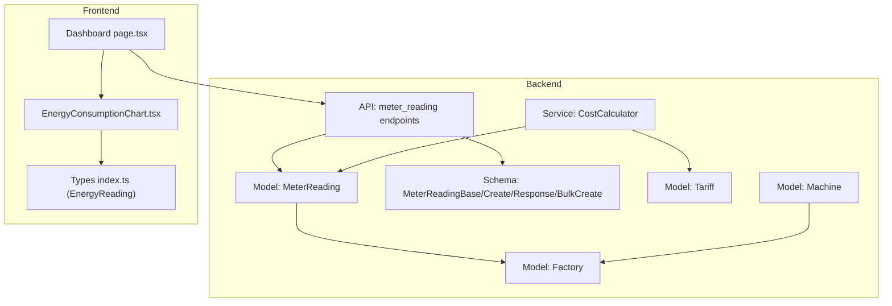
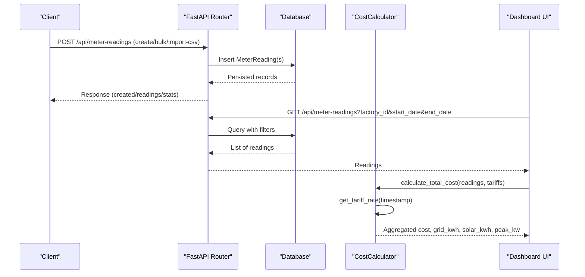
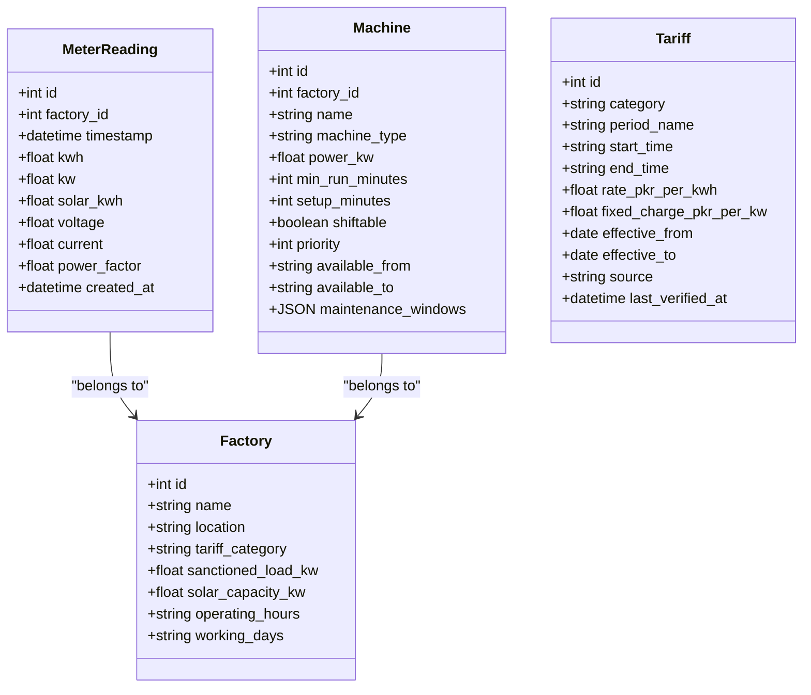

# Meter Reading Model

<cite>
**Referenced Files in This Document**
- [meter_reading.py](file://backend/app/models/meter_reading.py)
- [meter_reading.py](file://backend/app/schemas/meter_reading.py)
- [meter_reading.py](file://backend/app/api/meter_reading.py)
- [cost_calculator.py](file://backend/app/services/cost_calculator.py)
- [factory.py](file://backend/app/models/factory.py)
- [machine.py](file://backend/app/models/machine.py)
- [tariff.py](file://backend/app/models/tariff.py)
- [page.tsx](file://frontend/app/dashboard/page.tsx)
- [energy_consumption_chart.tsx](file://frontend/components/charts/energy_consumption_chart.tsx)
- [index.ts](file://frontend/types/index.ts)
</cite>

## Table of Contents
1. [Introduction](#introduction)
2. [Project Structure](#project-structure)
3. [Core Components](#core-components)
4. [Architecture Overview](#architecture-overview)
5. [Detailed Component Analysis](#detailed-component-analysis)
6. [Dependency Analysis](#dependency-analysis)
7. [Performance Considerations](#performance-considerations)
8. [Troubleshooting Guide](#troubleshooting-guide)
9. [Conclusion](#conclusion)
10. [Appendices](#appendices)

## Introduction
This document provides comprehensive data model documentation for the MeterReading entity used to track energy consumption, solar generation, and peak demand across factories and machines. It explains field semantics, timestamp precision, aggregation patterns, validation rules, and query strategies for cost calculations and reporting. It also describes how meter readings integrate with real-time monitoring dashboards and relate to factories and machines.

## Project Structure
The MeterReading entity is implemented as a database model, validated via Pydantic schemas, exposed through REST endpoints, consumed by cost calculation services, and visualized in frontend dashboards.

**Diagram sources**
- [meter_reading.py:1-17](file://backend/app/models/meter_reading.py#L1-L17)
- [meter_reading.py:1-27](file://backend/app/schemas/meter_reading.py#L1-L27)
- [meter_reading.py:1-141](file://backend/app/api/meter_reading.py#L1-L141)
- [cost_calculator.py:1-110](file://backend/app/services/cost_calculator.py#L1-L110)
- [factory.py:1-17](file://backend/app/models/factory.py#L1-L17)
- [machine.py:1-20](file://backend/app/models/machine.py#L1-L20)
- [tariff.py:1-19](file://backend/app/models/tariff.py#L1-L19)
- [page.tsx:31-47](file://frontend/app/dashboard/page.tsx#L31-L47)
- [energy_consumption_chart.tsx:1-65](file://frontend/components/charts/energy_consumption_chart.tsx#L1-L65)
- [index.ts:41-45](file://frontend/types/index.ts#L41-L45)

**Section sources**
- [meter_reading.py:1-17](file://backend/app/models/meter_reading.py#L1-L17)
- [meter_reading.py:1-27](file://backend/app/schemas/meter_reading.py#L1-L27)
- [meter_reading.py:1-141](file://backend/app/api/meter_reading.py#L1-L141)
- [cost_calculator.py:1-110](file://backend/app/services/cost_calculator.py#L1-L110)
- [factory.py:1-17](file://backend/app/models/factory.py#L1-L17)
- [machine.py:1-20](file://backend/app/models/machine.py#L1-L20)
- [tariff.py:1-19](file://backend/app/models/tariff.py#L1-L19)
- [page.tsx:31-47](file://frontend/app/dashboard/page.tsx#L31-L47)
- [energy_consumption_chart.tsx:1-65](file://frontend/components/charts/energy_consumption_chart.tsx#L1-L65)
- [index.ts:41-45](file://frontend/types/index.ts#L41-L45)

## Core Components
- Data model: MeterReading stores per-interval energy metrics tied to a factory.
- Schemas: Pydantic models define input/output contracts and optional fields.
- API: Endpoints support single/bulk creation, CSV import, listing with filters, and stats.
- Service: CostCalculator aggregates readings to compute costs, grid vs solar usage, and peak demand.
- Relationships: MeterReading belongs to Factory; Machines belong to Factory and can be correlated with readings for analysis.

Key responsibilities:
- Capture cumulative kWh per interval and instantaneous kW when available.
- Track solar generation separately to derive grid consumption.
- Record electrical parameters (voltage, current, power factor) for diagnostics.
- Provide statistics and filtered queries for reporting.

**Section sources**
- [meter_reading.py:1-17](file://backend/app/models/meter_reading.py#L1-L17)
- [meter_reading.py:1-27](file://backend/app/schemas/meter_reading.py#L1-L27)
- [meter_reading.py:1-141](file://backend/app/api/meter_reading.py#L1-L141)
- [cost_calculator.py:1-110](file://backend/app/services/cost_calculator.py#L1-L110)
- [factory.py:1-17](file://backend/app/models/factory.py#L1-L17)
- [machine.py:1-20](file://backend/app/models/machine.py#L1-L20)

## Architecture Overview
Meter readings flow from ingestion (single, bulk, or CSV) into the database, then are consumed by analytics and cost services. The dashboard fetches recent readings to visualize grid and solar usage and KPIs like peak demand and utilization.

**Diagram sources**
- [meter_reading.py:14-141](file://backend/app/api/meter_reading.py#L14-L141)
- [cost_calculator.py:15-90](file://backend/app/services/cost_calculator.py#L15-L90)
- [page.tsx:31-47](file://frontend/app/dashboard/page.tsx#L31-L47)

## Detailed Component Analysis

### MeterReading Data Model
- Purpose: Store time-series energy consumption and related measurements per factory.
- Fields:
  - id: Primary key.
  - factory_id: Foreign key linking to Factory.
  - timestamp: Time of reading (precision depends on DB DateTime).
  - kwh: Cumulative energy consumed during the interval.
  - kw: Optional instantaneous power (peak demand tracking).
  - solar_kwh: Solar generation during the interval.
  - voltage, current, power_factor: Optional electrical parameters.
  - created_at: Server-side insertion timestamp.

Notes:
- kwh represents interval consumption; kw captures instantaneous load if available.
- solar_kwh enables separation of grid vs renewable usage.
- Timestamps should be consistent and ordered; use timezone-aware values where applicable.

**Section sources**
- [meter_reading.py:1-17](file://backend/app/models/meter_reading.py#L1-L17)

### Pydantic Schemas and Validation
- MeterReadingBase: Defines core fields including timestamp, kwh, optional kw, solar_kwh, and optional electrical parameters.
- MeterReadingCreate: Adds required factory_id for creation.
- MeterReadingResponse: Exposes id, factory_id, created_at along with base fields.
- MeterReadingBulkCreate: Enables batch ingestion with a list of base readings under one factory_id.

Validation highlights:
- Type enforcement ensures numeric and datetime correctness.
- Optional fields allow partial telemetry (e.g., missing kw or power_factor).
- Bulk schema supports efficient ingestion of multiple intervals.

**Section sources**
- [meter_reading.py:1-27](file://backend/app/schemas/meter_reading.py#L1-L27)

### API Endpoints and Data Ingestion Patterns
- Create single reading: Accepts a MeterReadingCreate payload.
- Bulk create: Accepts MeterReadingBulkCreate to insert many readings atomically.
- CSV import: Validates required columns (timestamp, kwh), converts timestamps, maps optional fields, and inserts all rows.
- List readings: Supports filtering by factory_id, start_date, end_date with pagination (skip/limit).
- Stats: Aggregates total readings, total kwh, average kwh, peak kw, and total solar kwh per factory.

Ingestion examples:
- Real-time telemetry: Single or small batches at short intervals (e.g., every minute/hour).
- Historical import: CSV with hourly or daily intervals for backfilling.
- Batch scheduling: Periodic jobs pushing aggregated intervals.

**Section sources**
- [meter_reading.py:14-141](file://backend/app/api/meter_reading.py#L14-L141)

### Cost Calculation and Aggregation
- Tariff rate selection: Determines applicable rate based on timestamp and tariff periods.
- Slot cost: Multiplies kwh by rate for each reading.
- Total cost: Sums costs across readings, tracks peak kw, computes grid_kwh as total minus solar.
- Machine cost estimation: Estimates cost given power_kw, duration_hours, and start_time using tariff rates.

Aggregation outputs include:
- total_kwh, grid_kwh, solar_kwh, peak_kw, total_cost, average_rate, and slot_costs.

**Section sources**
- [cost_calculator.py:15-110](file://backend/app/services/cost_calculator.py#L15-L110)

### Relationship to Factories and Machines
- Factory: MeterReading ties to a specific factory via factory_id. Factory metadata includes sanctioned load and solar capacity, which inform limits and utilization metrics.
- Machine: Machines belong to a factory and have power ratings and availability windows. While not directly linked to MeterReading, machine schedules and statuses can be correlated with readings to attribute consumption to specific assets.

Operational implications:
- Use factory_id to segment readings per site.
- Correlate spikes in kw with machine run times to identify high-demand events.
- Compare solar_kwh against factory’s solar_capacity_kw to assess generation performance.

**Section sources**
- [factory.py:1-17](file://backend/app/models/factory.py#L1-L17)
- [machine.py:1-20](file://backend/app/models/machine.py#L1-L20)

### Real-Time Monitoring Integration
- Dashboard fetches recent readings and transforms them into chart data showing grid usage and solar generation over time.
- EnergyConsumptionChart renders area charts for grid_kw and solar_kw series.
- Types define EnergyReading with time, grid_kw, and solar_kw for consistent visualization.

Usage pattern:
- Fetch last N readings (e.g., limit=24) and map to time series for live charts.
- Derive KPIs such as peak_demand_kw and solar_utilization from aggregated stats.

**Section sources**
- [page.tsx:31-47](file://frontend/app/dashboard/page.tsx#L31-L47)
- [energy_consumption_chart.tsx:1-65](file://frontend/components/charts/energy_consumption_chart.tsx#L1-L65)
- [index.ts:41-45](file://frontend/types/index.ts#L41-L45)

### Field Semantics and Measurement Units
- kwh: Kilowatt-hours consumed during the interval.
- kw: Instantaneous kilowatts (if available); useful for peak demand detection.
- solar_kwh: Kilowatt-hours generated by solar during the interval.
- voltage: Volts (optional).
- current: Amps (optional).
- power_factor: Dimensionless ratio (optional).
- timestamp: Interval start or measurement time; ensure consistent granularity.

Precision considerations:
- Ensure timestamps align with intended collection intervals (e.g., hourly).
- Avoid duplicate timestamps within the same factory unless explicitly allowed.

**Section sources**
- [meter_reading.py:1-17](file://backend/app/models/meter_reading.py#L1-L17)
- [meter_reading.py:1-27](file://backend/app/schemas/meter_reading.py#L1-L27)

### Validation Rules and Data Integrity Checks
- Required fields: timestamp and kwh must be present and valid types.
- CSV import validates presence of required columns and converts timestamps.
- Optional fields are handled safely with defaults or nulls.
- Rollback on import errors to maintain consistency.

Recommended integrity checks:
- Non-negative kwh and solar_kwh.
- Reasonable ranges for voltage/current/power_factor.
- Monotonic timestamps per factory to prevent overlaps/gaps.
- Consistency between kw and kwh (e.g., kw approximates kwh for 1-hour intervals).

**Section sources**
- [meter_reading.py:41-88](file://backend/app/api/meter_reading.py#L41-L88)
- [meter_reading.py:1-27](file://backend/app/schemas/meter_reading.py#L1-L27)

### Sample Reading Structures and Query Patterns
- Create single: Provide factory_id, timestamp, kwh, and optional kw/solar_kwh/electrical fields.
- Bulk create: Provide factory_id and an array of readings.
- Import CSV: Upload file with at least timestamp and kwh columns.
- List with filters: Use factory_id, start_date, end_date, skip, limit.
- Stats: Retrieve aggregated metrics per factory.

Example query patterns:
- Last 24 hours for a factory: filter by start_date/end_date and order by timestamp desc with limit.
- Daily totals: group by date and sum kwh and solar_kwh.
- Peak demand: max(kw) per day or hour.
- Grid consumption: total_kwh - total_solar_kwh.

**Section sources**
- [meter_reading.py:90-141](file://backend/app/api/meter_reading.py#L90-L141)
- [cost_calculator.py:52-90](file://backend/app/services/cost_calculator.py#L52-L90)

### Consumption Reporting and Cost Calculations
- Per-slot cost: Multiply kwh by applicable tariff rate determined by timestamp.
- Total cost: Sum across slots; compute average rate.
- Grid vs solar: Subtract solar_kwh from total_kwh to estimate grid draw.
- Peak demand: Track maximum kw across readings.

Reporting outputs:
- total_kwh, grid_kwh, solar_kwh, peak_kw, total_cost, average_rate, and detailed slot_costs.

**Section sources**
- [cost_calculator.py:15-110](file://backend/app/services/cost_calculator.py#L15-L110)

## Dependency Analysis
MeterReading depends on Factory via foreign key. CostCalculator depends on Tariff to determine rates. Frontend consumes API responses and renders charts using typed structures.

**Diagram sources**
- [meter_reading.py:1-17](file://backend/app/models/meter_reading.py#L1-L17)
- [factory.py:1-17](file://backend/app/models/factory.py#L1-L17)
- [machine.py:1-20](file://backend/app/models/machine.py#L1-L20)
- [tariff.py:1-19](file://backend/app/models/tariff.py#L1-L19)

**Section sources**
- [meter_reading.py:1-17](file://backend/app/models/meter_reading.py#L1-L17)
- [factory.py:1-17](file://backend/app/models/factory.py#L1-L17)
- [machine.py:1-20](file://backend/app/models/machine.py#L1-L20)
- [tariff.py:1-19](file://backend/app/models/tariff.py#L1-L19)

## Performance Considerations
- Indexing: Ensure indexes on factory_id and timestamp for efficient filtering and ordering.
- Pagination: Use skip/limit to avoid large result sets.
- Bulk operations: Prefer bulk create or CSV import for high-volume ingestion.
- Aggregation: Offload heavy computations (e.g., daily/monthly rollups) to background jobs.
- Timezone handling: Normalize timestamps to a consistent timezone to avoid misalignment.

[No sources needed since this section provides general guidance]

## Troubleshooting Guide
Common issues and resolutions:
- Missing required columns in CSV: Validate presence of timestamp and kwh before import.
- Invalid timestamps: Ensure proper datetime format; convert using robust parsers.
- Duplicate or overlapping intervals: Enforce uniqueness or detect gaps/duplicates post-import.
- Negative or zero kwh: Validate non-negative values; investigate sensor errors.
- High peak kw exceeding sanctioned load: Alert and flag for demand management.

Error handling in API:
- CSV import wraps processing in try/except and rolls back on failure.
- HTTP exceptions return descriptive details for client-side handling.

**Section sources**
- [meter_reading.py:41-88](file://backend/app/api/meter_reading.py#L41-L88)

## Conclusion
The MeterReading model provides a robust foundation for energy consumption tracking, solar generation accounting, and peak demand monitoring across factories. With clear schemas, flexible ingestion methods, and integrated cost calculations, it supports both operational dashboards and analytical reporting. Proper validation, indexing, and aggregation practices ensure accuracy and performance at scale.

[No sources needed since this section summarizes without analyzing specific files]

## Appendices

### Example Reading Sources and Collection Intervals
- Real-time meters: Minute-level or 5-minute intervals for granular monitoring.
- SCADA systems: Hourly or sub-hourly intervals depending on system capabilities.
- CSV imports: Daily or hourly historical data for backfilling and audits.
- Solar inverters: Interval-aligned generation data to match consumption intervals.

[No sources needed since this section provides general guidance]

### Query Patterns for Energy Analysis
- Daily consumption: Group by date and sum kwh.
- Solar utilization: Sum solar_kwh divided by total_kwh + solar_kwh.
- Peak demand trends: Max kw per day/hour.
- Cost attribution: Apply tariff rates per timestamp and sum costs.

[No sources needed since this section provides general guidance]