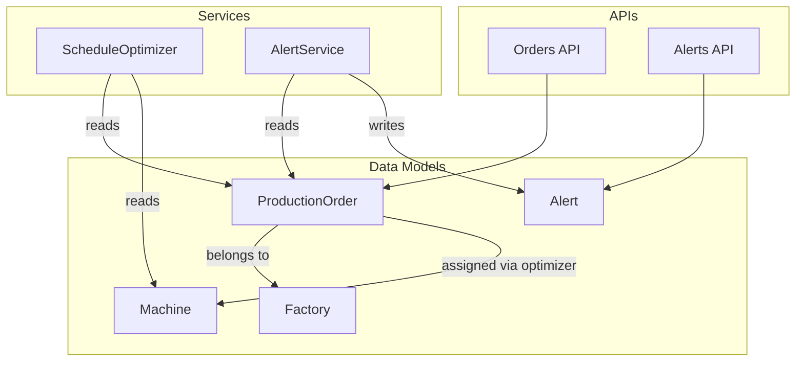
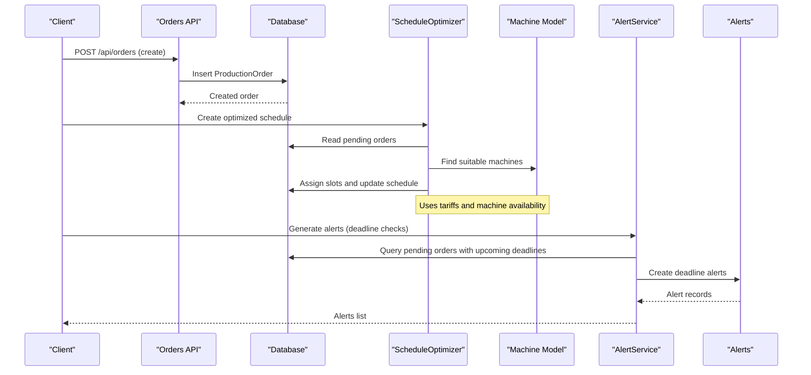
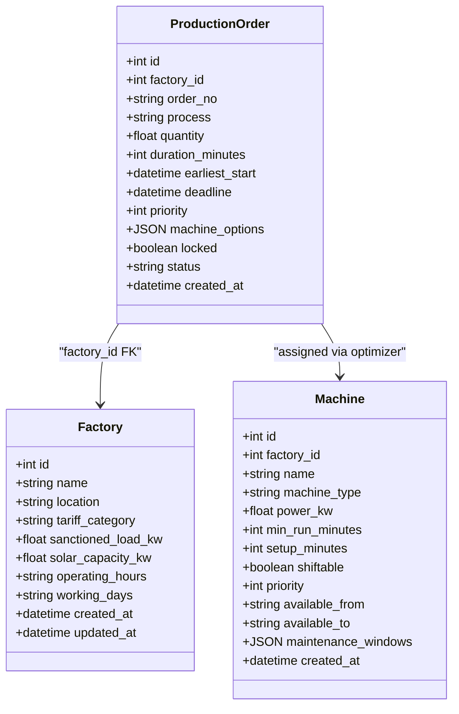
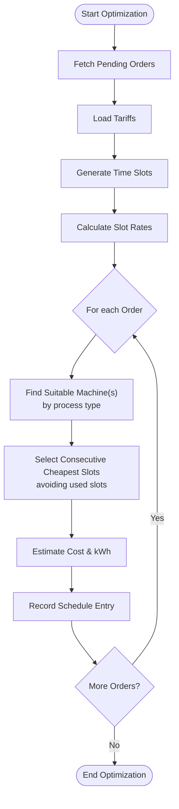
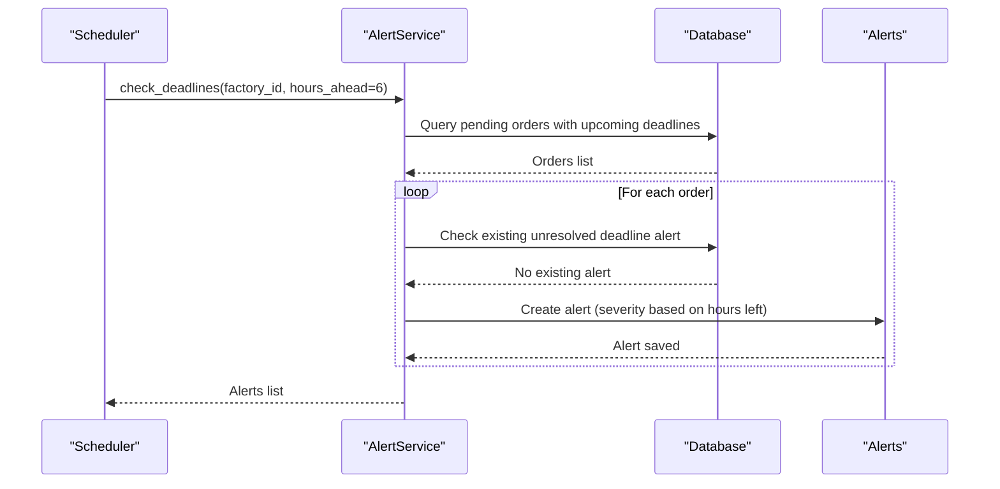
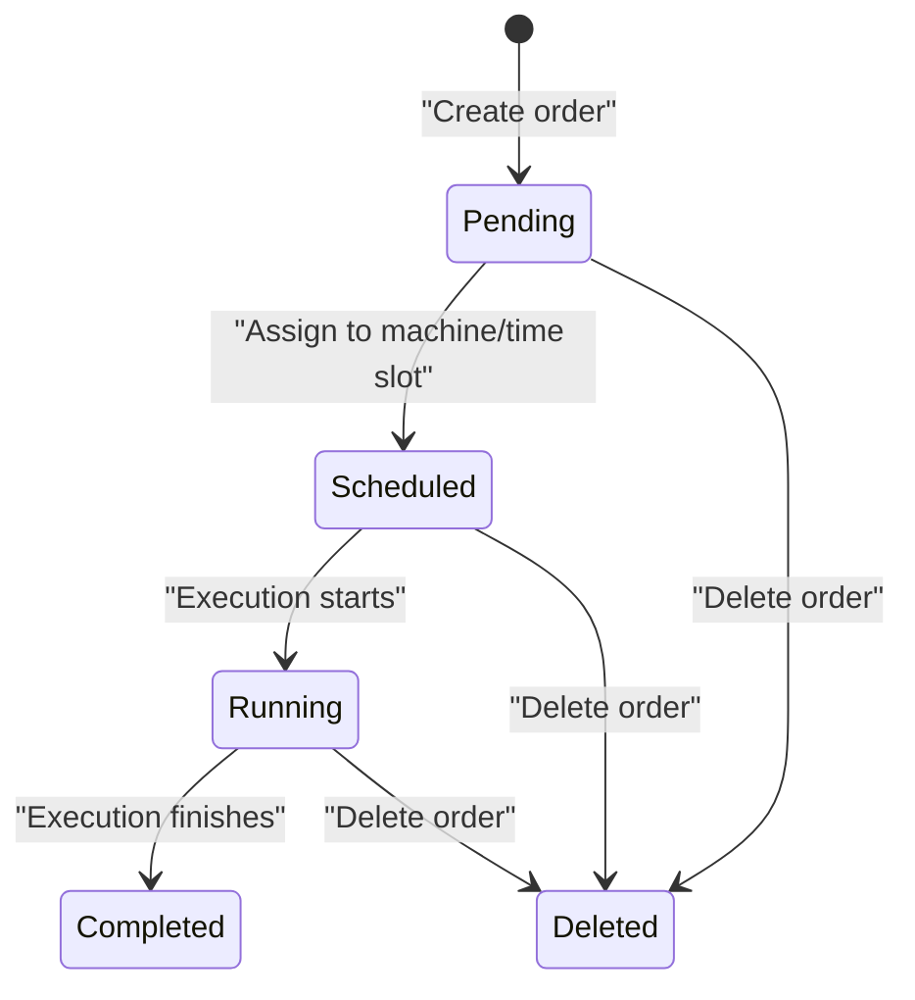
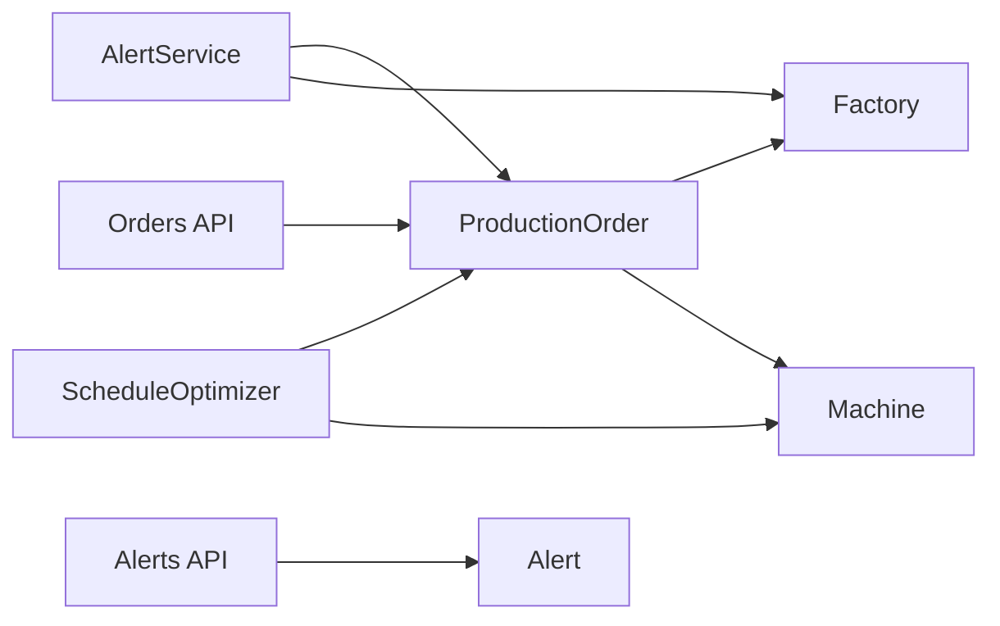

# Production Order Model

<cite>
**Referenced Files in This Document**
- [production_order.py](file://backend/app/models/production_order.py)
- [production_order.py](file://backend/app/schemas/production_order.py)
- [production_order.py](file://backend/app/api/production_order.py)
- [machine.py](file://backend/app/models/machine.py)
- [factory.py](file://backend/app/models/factory.py)
- [alert_service.py](file://backend/app/services/alert_service.py)
- [alert.py](file://backend/app/models/alert.py)
- [optimizer.py](file://backend/app/services/optimizer.py)
- [seed.py](file://backend/seed.py)
</cite>

## Table of Contents
1. [Introduction](#introduction)
2. [Project Structure](#project-structure)
3. [Core Components](#core-components)
4. [Architecture Overview](#architecture-overview)
5. [Detailed Component Analysis](#detailed-component-analysis)
6. [Dependency Analysis](#dependency-analysis)
7. [Performance Considerations](#performance-considerations)
8. [Troubleshooting Guide](#troubleshooting-guide)
9. [Conclusion](#conclusion)
10. [Appendices](#appendices)

## Introduction
This document provides comprehensive data model documentation for the ProductionOrder entity, including fields, relationships, lifecycle, validation rules, and operational workflows. It explains how orders are created, scheduled, monitored, and how alerts are generated when deadlines approach. It also covers machine assignments, factory context, priority handling, and common query patterns used for production planning and tracking.

## Project Structure
The ProductionOrder is modeled as a database entity with Pydantic schemas for API input/output and FastAPI endpoints for CRUD operations. Related components include:
- Machine and Factory models that define resource and organizational context
- Alert service that monitors deadlines and generates alerts
- Optimizer service that schedules pending orders based on tariffs and machine availability



**Diagram sources**
- [production_order.py:5-20](file://backend/app/models/production_order.py#L5-L20)
- [machine.py:5-20](file://backend/app/models/machine.py#L5-L20)
- [factory.py:5-17](file://backend/app/models/factory.py#L5-L17)
- [alert.py:5-18](file://backend/app/models/alert.py#L5-L18)
- [optimizer.py:14-190](file://backend/app/services/optimizer.py#L14-L190)
- [alert_service.py:16-140](file://backend/app/services/alert_service.py#L16-L140)
- [production_order.py:11-66](file://backend/app/api/production_order.py#L11-L66)
- [alert.py:12-107](file://backend/app/api/alert.py#L12-L107)

**Section sources**
- [production_order.py:5-20](file://backend/app/models/production_order.py#L5-L20)
- [machine.py:5-20](file://backend/app/models/machine.py#L5-L20)
- [factory.py:5-17](file://backend/app/models/factory.py#L5-L17)
- [alert_service.py:16-140](file://backend/app/services/alert_service.py#L16-L140)
- [optimizer.py:14-190](file://backend/app/services/optimizer.py#L14-L190)
- [production_order.py:11-66](file://backend/app/api/production_order.py#L11-L66)
- [alert.py:12-107](file://backend/app/api/alert.py#L12-L107)

## Core Components
- ProductionOrder: Represents a manufacturing order with specifications, scheduling constraints, and status.
- Machine: Represents production equipment with capabilities and availability windows.
- Factory: Represents the production site and its energy/tariff context.
- Alert: Captures system events such as deadline proximity or peak demand warnings.
- ScheduleOptimizer: Schedules pending orders into optimal time slots based on tariffs and machine availability.
- AlertService: Generates alerts for upcoming deadlines and other conditions.

Key responsibilities:
- Data modeling and persistence for orders
- API exposure for creating, listing, retrieving, and deleting orders
- Scheduling logic to assign orders to machines and time slots
- Alert generation for deadline proximity and other operational concerns

**Section sources**
- [production_order.py:5-20](file://backend/app/models/production_order.py#L5-L20)
- [machine.py:5-20](file://backend/app/models/machine.py#L5-L20)
- [factory.py:5-17](file://backend/app/models/factory.py#L5-L17)
- [alert.py:5-18](file://backend/app/models/alert.py#L5-L18)
- [optimizer.py:14-190](file://backend/app/services/optimizer.py#L14-L190)
- [alert_service.py:16-140](file://backend/app/services/alert_service.py#L16-L140)

## Architecture Overview
The ProductionOrder lifecycle spans creation, scheduling, execution, and completion. The optimizer assigns orders to suitable machines and time slots based on tariff rates and constraints. Alerts are generated when deadlines are near, helping operators prioritize work.



**Diagram sources**
- [production_order.py:11-66](file://backend/app/api/production_order.py#L11-L66)
- [optimizer.py:97-190](file://backend/app/services/optimizer.py#L97-L190)
- [alert_service.py:52-91](file://backend/app/services/alert_service.py#L52-L91)
- [alert.py:12-107](file://backend/app/api/alert.py#L12-L107)

## Detailed Component Analysis

### ProductionOrder Entity
- Purpose: Stores order specifications, scheduling constraints, and status.
- Key fields:
  - Identifier and ownership: id, factory_id
  - Specifications: order_no (unique), process, quantity, duration_minutes
  - Scheduling constraints: earliest_start, deadline, priority, locked
  - Resource hints: machine_options (list of machine IDs)
  - Lifecycle: status (default "pending"), created_at
- Relationships:
  - Belongs to a Factory via factory_id
  - Assigned to Machines during optimization (via process matching and machine_options)
- Validation notes:
  - Required fields enforced by schema and DB constraints
  - Unique order_no prevents duplicates
  - Status defaults to "pending" at creation



**Diagram sources**
- [production_order.py:5-20](file://backend/app/models/production_order.py#L5-L20)
- [factory.py:5-17](file://backend/app/models/factory.py#L5-L17)
- [machine.py:5-20](file://backend/app/models/machine.py#L5-L20)

**Section sources**
- [production_order.py:5-20](file://backend/app/models/production_order.py#L5-L20)
- [production_order.py:5-26](file://backend/app/schemas/production_order.py#L5-L26)

### API Endpoints for Orders
- Create order: Requires manager role; persists new order with default status "pending".
- List orders: Supports filtering by factory_id and status.
- Get order: Retrieves single order by ID.
- Delete order: Requires manager role; removes order from DB.

```mermaid
flowchart TD
Start([Request]) --> Auth["Auth & Role Check"]
Auth --> Route{"Endpoint"}
Route --> |POST /api/orders| Create["Create ProductionOrder"]
Route --> |GET /api/orders| List["List Orders<br/>Filter by factory_id/status"]
Route --> |GET /api/orders/{id}| Get["Get Order by ID"]
Route --> |DELETE /api/orders/{id}| Delete["Delete Order"]
Create --> Commit["Commit & Refresh"]
List --> ReturnList["Return Orders"]
Get --> ReturnOne["Return Order"]
Delete --> CommitDel["Delete & Commit"]
Commit --> End([Response])
ReturnList --> End
ReturnOne --> End
CommitDel --> End
```

**Diagram sources**
- [production_order.py:11-66](file://backend/app/api/production_order.py#L11-L66)

**Section sources**
- [production_order.py:11-66](file://backend/app/api/production_order.py#L11-L66)

### Machine Assignment and Scheduling
- Matching logic: Orders are matched to machines by process type (case-insensitive). If no exact match exists, fallback to first available machine.
- Time slot selection: The optimizer selects consecutive hourly slots based on cheapest tariff rates while avoiding already-used slots per machine.
- Constraints considered:
  - Machine availability windows (available_from/available_to)
  - Maintenance windows (JSON)
  - Minimum run times and setup minutes
  - Locked orders (locked flag) influence scheduling decisions
- Output includes estimated cost and energy usage per order.



**Diagram sources**
- [optimizer.py:29-190](file://backend/app/services/optimizer.py#L29-L190)
- [machine.py:5-20](file://backend/app/models/machine.py#L5-L20)

**Section sources**
- [optimizer.py:29-190](file://backend/app/services/optimizer.py#L29-L190)
- [machine.py:5-20](file://backend/app/models/machine.py#L5-L20)

### Deadline Proximity Alerts
- Trigger: AlertService scans pending orders with deadlines within a configurable window (default 6 hours ahead).
- Severity:
  - Critical if fewer than 2 hours remain
  - Warning otherwise
- Deduplication: Avoids creating duplicate unresolved alerts for the same order within the check cycle.
- Integration: Alerts are persisted and can be queried via Alerts API.



**Diagram sources**
- [alert_service.py:52-91](file://backend/app/services/alert_service.py#L52-L91)
- [alert.py:5-18](file://backend/app/models/alert.py#L5-L18)

**Section sources**
- [alert_service.py:52-91](file://backend/app/services/alert_service.py#L52-L91)
- [alert.py:5-18](file://backend/app/models/alert.py#L5-L18)

### Order Lifecycle and Status Transitions
- Creation: Orders are created with status "pending".
- Scheduling: Optimizer processes pending orders and assigns them to machines/time slots. While the current code does not explicitly update order status during scheduling, the workflow implies progression from pending to scheduled/running upon assignment.
- Completion: Not explicitly implemented in the provided files; typically would involve updating status to "completed" after execution.
- Deletion: Orders can be deleted by authorized users.



[No sources needed since this diagram shows conceptual workflow, not actual code structure]

### Example Order Types and Priority Handling
- Process types observed in seed data include Dyeing, Spinning, Weaving, Finishing, Packaging.
- Priority levels:
  - 1 = High
  - 2 = Medium (default)
  - 3 = Low
- Scenarios:
  - High-priority orders with tight deadlines generate critical alerts quickly.
  - Locked orders may be prioritized or excluded from re-scheduling depending on implementation.
  - Machine options allow specifying preferred machines for certain processes.

Examples referenced in seed data demonstrate varied quantities, durations, earliest start times, deadlines, priorities, and machine options.

**Section sources**
- [seed.py:245-324](file://backend/seed.py#L245-L324)
- [machine.py:16-16](file://backend/app/models/machine.py#L16-L16)

## Dependency Analysis
- ProductionOrder depends on Factory for organizational context and on Machine indirectly through scheduling.
- AlertService depends on ProductionOrder and Factory to generate relevant alerts.
- ScheduleOptimizer depends on ProductionOrder, Machine, and Tariff to create cost-effective schedules.
- APIs depend on models and services to expose functionality.



**Diagram sources**
- [production_order.py:5-20](file://backend/app/models/production_order.py#L5-L20)
- [factory.py:5-17](file://backend/app/models/factory.py#L5-L17)
- [machine.py:5-20](file://backend/app/models/machine.py#L5-L20)
- [alert_service.py:16-140](file://backend/app/services/alert_service.py#L16-L140)
- [optimizer.py:14-190](file://backend/app/services/optimizer.py#L14-L190)
- [production_order.py:11-66](file://backend/app/api/production_order.py#L11-L66)
- [alert.py:12-107](file://backend/app/api/alert.py#L12-L107)

**Section sources**
- [production_order.py:5-20](file://backend/app/models/production_order.py#L5-L20)
- [alert_service.py:16-140](file://backend/app/services/alert_service.py#L16-L140)
- [optimizer.py:14-190](file://backend/app/services/optimizer.py#L14-L190)
- [production_order.py:11-66](file://backend/app/api/production_order.py#L11-L66)
- [alert.py:12-107](file://backend/app/api/alert.py#L12-L107)

## Performance Considerations
- Query efficiency: Filtering orders by factory_id and status reduces result sets for listing endpoints.
- Scheduling complexity: The optimizer sorts time slots and finds consecutive sequences; ensure time ranges and intervals are reasonable to avoid excessive computations.
- Alert deduplication: Prevents redundant alert creation, reducing database writes and noise.
- Indexes: Ensure indexes on factory_id, status, and deadline improve query performance for listing and alert checks.

[No sources needed since this section provides general guidance]

## Troubleshooting Guide
- Duplicate order numbers: The unique constraint on order_no will prevent duplicates; handle errors accordingly.
- Missing machine matches: If no machine matches the order process, the optimizer falls back to the first available machine; verify machine types and order processes align.
- Deadline alerts not appearing: Confirm that orders are in "pending" status and deadlines fall within the configured window; check alert deduplication logic.
- Authorization errors: Creating or deleting orders requires manager role; ensure user roles are correctly assigned.

**Section sources**
- [production_order.py:11-66](file://backend/app/api/production_order.py#L11-L66)
- [alert_service.py:52-91](file://backend/app/services/alert_service.py#L52-L91)
- [optimizer.py:120-140](file://backend/app/services/optimizer.py#L120-L140)

## Conclusion
The ProductionOrder entity encapsulates order specifications, scheduling constraints, and lifecycle state. Through integration with Machine and Factory models, it supports efficient scheduling and alerting. The optimizer leverages tariff data to minimize costs, while the alert service ensures timely attention to impending deadlines. Proper use of filters, roles, and constraints enables robust production planning and tracking.

[No sources needed since this section summarizes without analyzing specific files]

## Appendices

### Field Reference Summary
- ProductionOrder fields:
  - id: Primary key
  - factory_id: Foreign key to Factory
  - order_no: Unique identifier
  - process: Manufacturing process type
  - quantity: Amount to produce
  - duration_minutes: Estimated runtime
  - earliest_start: Earliest possible start time
  - deadline: Hard deadline for completion
  - priority: 1=High, 2=Medium (default), 3=Low
  - machine_options: Preferred machine IDs
  - locked: Locks order from changes
  - status: Workflow state (default "pending")
  - created_at: Timestamp of creation

**Section sources**
- [production_order.py:5-20](file://backend/app/models/production_order.py#L5-L20)
- [production_order.py:5-26](file://backend/app/schemas/production_order.py#L5-L26)

### Common Query Patterns
- List orders by factory and status: Use GET /api/orders?factory_id={id}&status={status}
- Retrieve single order: GET /api/orders/{order_id}
- Filter pending orders for scheduling: Query ProductionOrder where status="pending" and factory_id={id}
- Check upcoming deadlines: Query ProductionOrder where status="pending" and deadline between now and now+hours_ahead

**Section sources**
- [production_order.py:26-39](file://backend/app/api/production_order.py#L26-L39)
- [alert_service.py:52-62](file://backend/app/services/alert_service.py#L52-L62)

### Sample Order Structures
Seed data demonstrates various order types and priorities, including different processes, quantities, durations, earliest start times, deadlines, and machine options. These examples illustrate how orders can be structured for diverse production scenarios.

**Section sources**
- [seed.py:245-324](file://backend/seed.py#L245-L324)