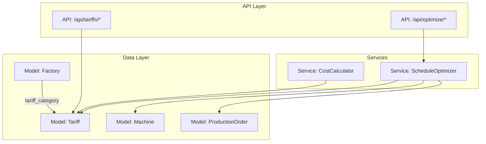
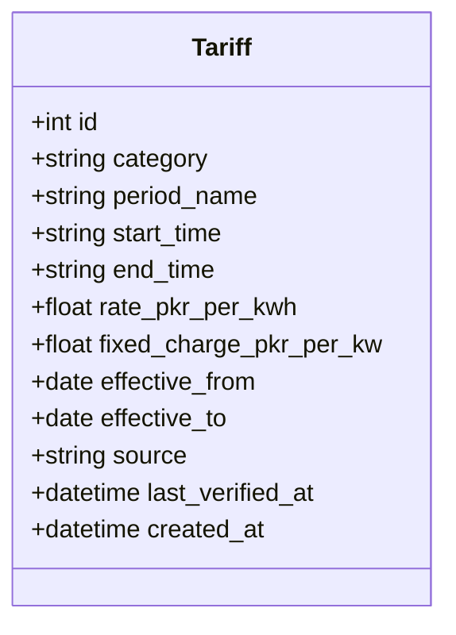
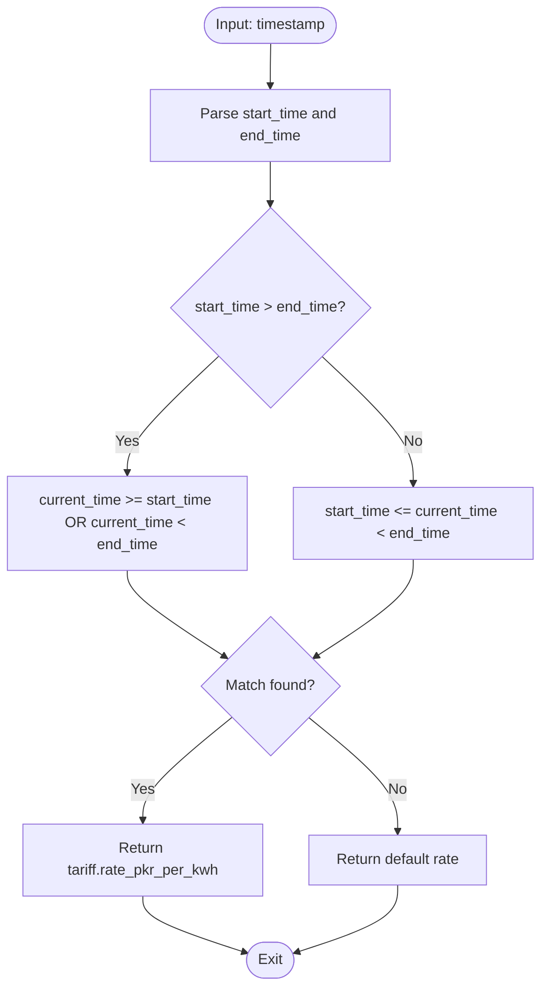
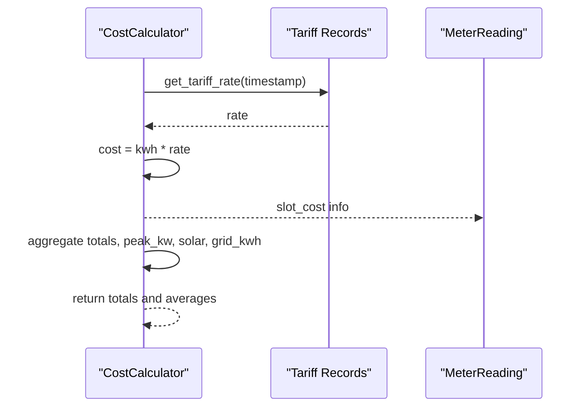
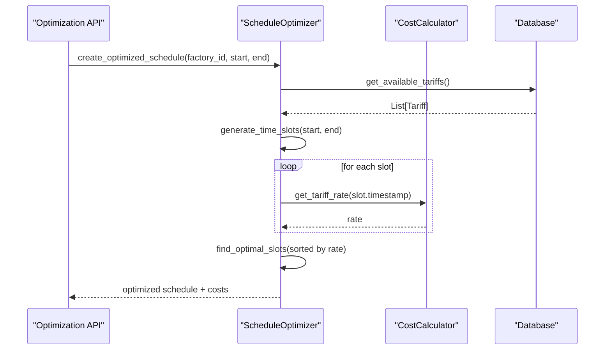
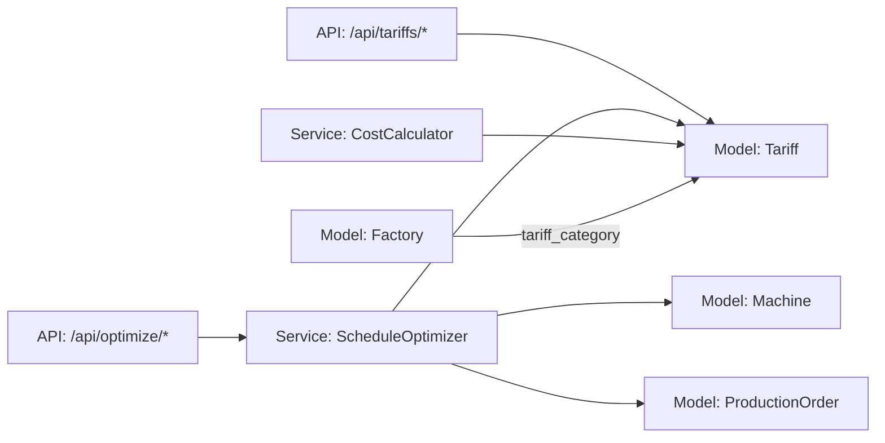

# Tariff Model

<cite>
**Referenced Files in This Document**
- [tariff.py](file://backend/app/models/tariff.py)
- [tariff.py](file://backend/app/schemas/tariff.py)
- [tariff.py](file://backend/app/api/tariff.py)
- [cost_calculator.py](file://backend/app/services/cost_calculator.py)
- [optimizer.py](file://backend/app/services/optimizer.py)
- [optimization.py](file://backend/app/api/optimization.py)
- [factory.py](file://backend/app/models/factory.py)
- [machine.py](file://backend/app/models/machine.py)
- [production_order.py](file://backend/app/models/production_order.py)
- [utils.py](file://backend/app/core/utils.py)
</cite>

## Table of Contents
1. [Introduction](#introduction)
2. [Project Structure](#project-structure)
3. [Core Components](#core-components)
4. [Architecture Overview](#architecture-overview)
5. [Detailed Component Analysis](#detailed-component-analysis)
6. [Dependency Analysis](#dependency-analysis)
7. [Performance Considerations](#performance-considerations)
8. [Troubleshooting Guide](#troubleshooting-guide)
9. [Conclusion](#conclusion)
10. [Appendices](#appendices)

## Introduction
This document provides detailed data model documentation for the Tariff entity and explains how time-based electricity pricing is modeled, queried, and used to influence cost calculation and production scheduling optimization. It covers rate fields, time periods, effective date ranges, tariff categories, seasonal adjustments via effective dates, and integration with the cost calculator and schedule optimizer. It also includes validation considerations and example configurations aligned with industrial scenarios.

## Project Structure
The Tariff domain spans models, schemas, API endpoints, and services:
- Data model defines the persistent tariff record structure.
- Schemas define request/response contracts for CRUD operations.
- API endpoints expose listing, filtering by category and active status, and retrieval by ID.
- Services implement cost calculation and schedule optimization using tariffs.
- Factory model links a location to a tariff category, enabling per-location tariff selection.



**Diagram sources**
- [tariff.py:5-19](file://backend/app/models/tariff.py#L5-L19)
- [factory.py:5-17](file://backend/app/models/factory.py#L5-L17)
- [machine.py:5-20](file://backend/app/models/machine.py#L5-L20)
- [production_order.py:5-20](file://backend/app/models/production_order.py#L5-L20)
- [tariff.py:10-90](file://backend/app/api/tariff.py#L10-L90)
- [optimization.py:9-48](file://backend/app/api/optimization.py#L9-L48)
- [cost_calculator.py:12-110](file://backend/app/services/cost_calculator.py#L12-L110)
- [optimizer.py:14-238](file://backend/app/services/optimizer.py#L14-L238)

**Section sources**
- [tariff.py:5-19](file://backend/app/models/tariff.py#L5-L19)
- [factory.py:5-17](file://backend/app/models/factory.py#L5-L17)
- [tariff.py:10-90](file://backend/app/api/tariff.py#L10-L90)
- [optimization.py:9-48](file://backend/app/api/optimization.py#L9-L48)
- [cost_calculator.py:12-110](file://backend/app/services/cost_calculator.py#L12-L110)
- [optimizer.py:14-238](file://backend/app/services/optimizer.py#L14-L238)

## Core Components
- Tariff model stores time-of-use (TOU) rates with category, period name, start/end times, energy rate, optional fixed charge, effective date range, source, and timestamps.
- Tariff schemas enforce input/output shapes for creation, updates, and responses.
- Tariff API supports CRUD and filtering by category and active date range.
- CostCalculator uses tariffs to determine applicable rates at specific timestamps and compute costs from meter readings or machine run estimates.
- ScheduleOptimizer generates hourly slots, computes slot rates, selects cheapest consecutive slots for orders, and builds optimized schedules that minimize energy cost.
- Factory ties a site to a tariff category; this drives which tariffs are considered when optimizing or costing for that factory.

Key relationships:
- Factory.tariff_category selects the relevant subset of Tariff records.
- ScheduleOptimizer reads Tariff records to build slot rates and optimize order scheduling across machines and pending orders.
- CostCalculator applies Tariff rules to meter readings to calculate total energy cost.

**Section sources**
- [tariff.py:5-19](file://backend/app/models/tariff.py#L5-L19)
- [tariff.py:5-35](file://backend/app/schemas/tariff.py#L5-L35)
- [tariff.py:10-90](file://backend/app/api/tariff.py#L10-L90)
- [cost_calculator.py:12-110](file://backend/app/services/cost_calculator.py#L12-L110)
- [optimizer.py:14-238](file://backend/app/services/optimizer.py#L14-L238)
- [factory.py:5-17](file://backend/app/models/factory.py#L5-L17)

## Architecture Overview
The system uses tariffs as the central pricing reference for both cost accounting and production scheduling.

```mermaid
sequenceDiagram
participant Client as "Client"
participant API as "FastAPI Router"
participant Opt as "ScheduleOptimizer"
participant Cost as "CostCalculator"
participant DB as "Database"
Client->>API : POST /api/optimize/schedule/{factory_id}
API->>Opt : create_optimized_schedule(factory_id, start_time, end_time)
Opt->>DB : get_available_tariffs()
DB-->>Opt : List[Tariff]
Opt->>Opt : generate_time_slots(start_time, end_time)
Opt->>Cost : get_tariff_rate(tariffs, slot_timestamp)
Cost->>Cost : match start_time <= current < end_time
Cost-->>Opt : rate
Opt->>Opt : find_optimal_slots(sorted by rate)
Opt-->>API : optimized schedule + costs
API-->>Client : JSON response
```

**Diagram sources**
- [optimization.py:11-29](file://backend/app/api/optimization.py#L11-L29)
- [optimizer.py:97-190](file://backend/app/services/optimizer.py#L97-L190)
- [cost_calculator.py:15-33](file://backend/app/services/cost_calculator.py#L15-L33)

## Detailed Component Analysis

### Tariff Entity Data Model
- id: Primary key identifier.
- category: Groups tariffs by customer type or region (e.g., Industrial TOU — A-1).
- period_name: Human-readable label such as Off-Peak, Peak, Night.
- start_time, end_time: Time-of-day boundaries defining the period; supports overnight ranges where start_time > end_time.
- rate_pkr_per_kwh: Energy consumption rate in Pakistani Rupees per kilowatt-hour.
- fixed_charge_pkr_per_kw: Optional demand or capacity charge in PKR per kilowatt.
- effective_from, effective_to: Date range indicating when the tariff is valid; enables seasonal or regulatory changes over time.
- source: Origin of the tariff (e.g., NEPRA).
- last_verified_at: Timestamp of last verification.
- created_at: Record creation timestamp.



**Diagram sources**
- [tariff.py:5-19](file://backend/app/models/tariff.py#L5-L19)

**Section sources**
- [tariff.py:5-19](file://backend/app/models/tariff.py#L5-L19)

### Tariff Schemas and API
- TariffBase/TariffCreate/TariffUpdate/TariffResponse define the contract for creating, updating, and returning tariff records.
- Endpoints:
  - Create tariff
  - List tariffs with optional filters: category and active_only (based on effective dates)
  - Get tariff by ID
  - Update tariff
  - Delete tariff
  - Get active tariff for a category

Active filtering logic:
- Returns tariffs where effective_from <= today and (effective_to is null or effective_to >= today).

**Section sources**
- [tariff.py:5-35](file://backend/app/schemas/tariff.py#L5-L35)
- [tariff.py:12-90](file://backend/app/api/tariff.py#L12-L90)

### Relationship to Factory Locations
- Factory has a tariff_category field that determines which set of tariffs apply to that factory’s operations.
- The optimizer retrieves all tariffs but uses factory context to scope queries and decisions when integrating with business logic (e.g., selecting active tariffs by category).

**Section sources**
- [factory.py:5-17](file://backend/app/models/factory.py#L5-L17)
- [optimizer.py:21-34](file://backend/app/services/optimizer.py#L21-L34)

### Time-Based Pricing Logic
- Rate selection: For a given timestamp, the system finds the tariff whose time window contains the current time. Overnight windows are supported by comparing start_time and end_time.
- Default fallback: If no tariff matches, a default rate is used.



**Diagram sources**
- [cost_calculator.py:15-33](file://backend/app/services/cost_calculator.py#L15-L33)

**Section sources**
- [cost_calculator.py:15-33](file://backend/app/services/cost_calculator.py#L15-L33)

### Seasonal Adjustments
- Effective date ranges allow tariffs to be rotated seasonally or upon regulatory changes.
- Active-only queries filter by today’s date against effective_from and effective_to.

**Section sources**
- [tariff.py:21-42](file://backend/app/api/tariff.py#L21-L42)
- [tariff.py:77-90](file://backend/app/api/tariff.py#L77-L90)

### Integration with Cost Calculation Engine
- Slot cost calculation multiplies kWh by the applicable tariff rate for the reading’s timestamp.
- Total cost aggregates slot costs, tracks peak kW, solar generation, grid consumption, average rate, and per-slot details.
- Machine cost estimation computes kwh from power_kw and duration, then applies the tariff rate at the start time.



**Diagram sources**
- [cost_calculator.py:35-110](file://backend/app/services/cost_calculator.py#L35-L110)

**Section sources**
- [cost_calculator.py:35-110](file://backend/app/services/cost_calculator.py#L35-L110)

### Integration with Schedule Optimizer
- Generates hourly time slots within a planning horizon.
- Computes slot rates using the cost calculator.
- Selects the cheapest consecutive slots for each order while respecting locked slots per machine.
- Builds an optimized schedule including estimated costs and energy usage per order.



**Diagram sources**
- [optimization.py:11-29](file://backend/app/api/optimization.py#L11-L29)
- [optimizer.py:36-190](file://backend/app/services/optimizer.py#L36-L190)
- [cost_calculator.py:15-33](file://backend/app/services/cost_calculator.py#L15-L33)

**Section sources**
- [optimizer.py:36-190](file://backend/app/services/optimizer.py#L36-L190)
- [optimization.py:11-29](file://backend/app/api/optimization.py#L11-L29)

### Validation Rules and Constraints
Current implementation notes:
- No explicit server-side validation beyond Pydantic schema types and database constraints.
- Time windows are interpreted as strings; overnight support exists in rate selection logic.
- Effective date filtering is enforced at query time for active tariffs.

Recommended validations to strengthen integrity:
- Rate ranges:
  - Enforce non-negative rate_pkr_per_kwh and fixed_charge_pkr_per_kw.
  - Optionally cap maximum rates to prevent outliers.
- Time periods:
  - Validate HH:MM format for start_time and end_time.
  - Ensure end_time is after start_time unless representing overnight; if overnight, ensure logical consistency.
  - Prevent overlapping periods within the same category and date range.
- Effective dates:
  - Ensure effective_from <= effective_to when effective_to is provided.
  - Disallow future-dated effective_from without explicit approval workflow.
- Category consistency:
  - Ensure category values align with known sets (e.g., Industrial TOU — A-1, Commercial).

These validations can be added in Pydantic validators and/or database-level checks to ensure robustness.

**Section sources**
- [tariff.py:5-35](file://backend/app/schemas/tariff.py#L5-L35)
- [cost_calculator.py:15-33](file://backend/app/services/cost_calculator.py#L15-L33)
- [tariff.py:21-42](file://backend/app/api/tariff.py#L21-L42)

### Example Tariff Structures for Industrial Scenarios
Examples below illustrate typical configurations aligned with the model fields. These are conceptual examples based on the available fields and do not quote code.

- Standard Industrial TOU (A-1):
  - Off-Peak: 00:00–18:00 at a lower rate.
  - Peak: 18:00–22:00 at a higher rate.
  - Night: 22:00–00:00 at a low overnight rate.
  - Effective dates: Annual cycle with summer/winter variants via effective_from/effective_to.

- High-Demand Manufacturing:
  - Off-Peak: 00:00–06:00 lowest rate.
  - Mid-Peak: 06:00–14:00 moderate rate.
  - Peak: 14:00–22:00 highest rate.
  - Night: 22:00–00:00 low rate.
  - Include fixed_charge_pkr_per_kw to reflect demand charges.

- Facility with Solar Generation:
  - Similar TOU bands with emphasis on shifting loads to off-peak and night to maximize self-consumption and reduce grid purchases.
  - Use solar_kwh tracking in cost calculations to adjust grid consumption.

These structures map directly to category, period_name, start_time, end_time, rate_pkr_per_kwh, and effective dates.

[No sources needed since this section provides conceptual examples]

## Dependency Analysis
The following diagram shows how components depend on each other around the Tariff entity.



**Diagram sources**
- [tariff.py:10-90](file://backend/app/api/tariff.py#L10-L90)
- [optimization.py:9-48](file://backend/app/api/optimization.py#L9-L48)
- [optimizer.py:14-238](file://backend/app/services/optimizer.py#L14-L238)
- [cost_calculator.py:12-110](file://backend/app/services/cost_calculator.py#L12-L110)
- [factory.py:5-17](file://backend/app/models/factory.py#L5-L17)

**Section sources**
- [tariff.py:10-90](file://backend/app/api/tariff.py#L10-L90)
- [optimization.py:9-48](file://backend/app/api/optimization.py#L9-L48)
- [optimizer.py:14-238](file://backend/app/services/optimizer.py#L14-L238)
- [cost_calculator.py:12-110](file://backend/app/services/cost_calculator.py#L12-L110)
- [factory.py:5-17](file://backend/app/models/factory.py#L5-L17)

## Performance Considerations
- Rate lookup is linear over tariffs per timestamp; consider indexing by category and effective dates for large datasets.
- Overlap detection and validation should be performed at write time to avoid runtime ambiguity.
- Caching active tariffs per category and date could reduce repeated queries during optimization runs.
- Batch processing of meter readings benefits from precomputing slot rates for the planning horizon.

[No sources needed since this section provides general guidance]

## Troubleshooting Guide
Common issues and resolutions:
- No active tariff found:
  - Ensure effective_from <= today and (effective_to is null or effective_to >= today) for the target category.
  - Verify category spelling and alignment with factory.tariff_category.
- Unexpected default rate applied:
  - Confirm that time windows cover the timestamp; check overnight handling where start_time > end_time.
- Overlapping periods causing ambiguous rates:
  - Implement overlap validation to prevent multiple matching tariffs for the same time window.
- Incorrect cost results:
  - Validate meter_reading timestamps and ensure they fall within defined tariff windows.
  - Review solar_kwh handling to correctly compute grid_kwh.

**Section sources**
- [tariff.py:77-90](file://backend/app/api/tariff.py#L77-L90)
- [cost_calculator.py:15-33](file://backend/app/services/cost_calculator.py#L15-L33)
- [cost_calculator.py:52-90](file://backend/app/services/cost_calculator.py#L52-L90)

## Conclusion
The Tariff model provides a flexible, time-based pricing structure that supports peak/off-peak/night definitions, seasonal adjustments through effective dates, and categorization by industry or region. It integrates tightly with the cost calculation engine and schedule optimizer to enable accurate energy costing and production scheduling that minimizes costs. Strengthening validation rules and adding overlap checks will further improve reliability and clarity.

[No sources needed since this section summarizes without analyzing specific files]

## Appendices

### Field Reference Summary
- id: Unique identifier for the tariff record.
- category: Grouping for tariffs (e.g., Industrial TOU — A-1).
- period_name: Label for the time band (Off-Peak, Peak, Night).
- start_time, end_time: Time-of-day boundaries; supports overnight ranges.
- rate_pkr_per_kwh: Energy rate in PKR per kWh.
- fixed_charge_pkr_per_kw: Optional demand/capacity charge in PKR per kW.
- effective_from, effective_to: Validity dates for seasonal/regulatory changes.
- source: Source of the tariff data.
- last_verified_at: Last verification timestamp.
- created_at: Creation timestamp.

**Section sources**
- [tariff.py:5-19](file://backend/app/models/tariff.py#L5-L19)

### API Endpoints Summary
- POST /api/tariffs/: Create a new tariff.
- GET /api/tariffs/: List tariffs with optional category and active_only filters.
- GET /api/tariffs/{id}: Retrieve a specific tariff.
- PUT /api/tariffs/{id}: Update a tariff.
- DELETE /api/tariffs/{id}: Delete a tariff.
- GET /api/tariffs/active/{category}: Get currently active tariff for a category.

**Section sources**
- [tariff.py:12-90](file://backend/app/api/tariff.py#L12-L90)

### Optimization Endpoints Summary
- POST /api/optimize/schedule/{factory_id}: Generate optimized schedule for a factory within a time window.
- POST /api/optimize/compare/{factory_id}: Compare baseline vs optimized schedule and savings.

**Section sources**
- [optimization.py:11-48](file://backend/app/api/optimization.py#L11-L48)

### Utility Helpers
- get_tariff_period(hour): Maps hour to Off-Peak/Peak/Night labels for UI or reporting.

**Section sources**
- [utils.py:37-44](file://backend/app/core/utils.py#L37-L44)