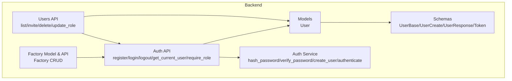
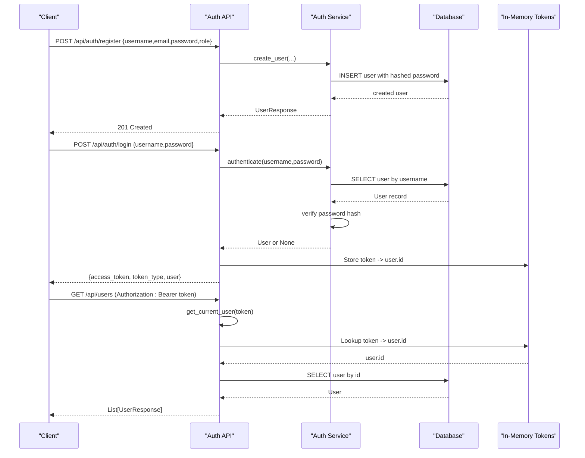
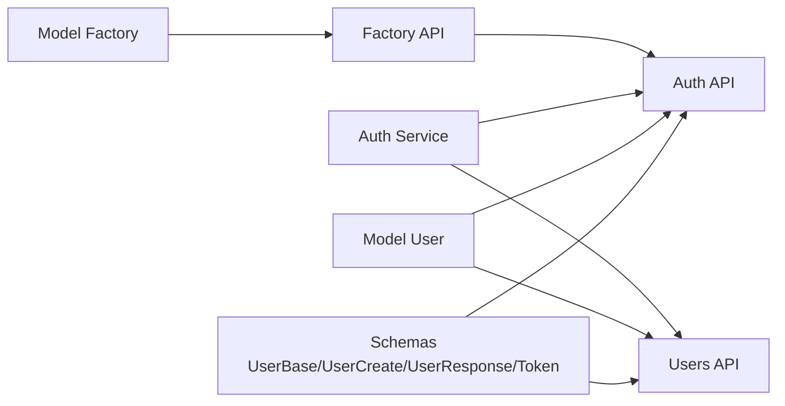

# User Model

<cite>
**Referenced Files in This Document**
- [user.py](file://backend/app/models/user.py)
- [user.py](file://backend/app/schemas/user.py)
- [auth.py](file://backend/app/api/auth.py)
- [auth.py](file://backend/app/services/auth.py)
- [users.py](file://backend/app/api/users.py)
- [factory.py](file://backend/app/models/factory.py)
- [factory.py](file://backend/app/api/factory.py)
- [alert.py](file://backend/app/api/alert.py)
- [test_auth.py](file://backend/test_auth.py)
</cite>

## Table of Contents
1. [Introduction](#introduction)
2. [Project Structure](#project-structure)
3. [Core Components](#core-components)
4. [Architecture Overview](#architecture-overview)
5. [Detailed Component Analysis](#detailed-component-analysis)
6. [Dependency Analysis](#dependency-analysis)
7. [Performance Considerations](#performance-considerations)
8. [Troubleshooting Guide](#troubleshooting-guide)
9. [Conclusion](#conclusion)
10. [Appendices](#appendices)

## Introduction
This document provides comprehensive data model documentation for the User entity, including authentication fields, role-based access control (RBAC), permissions, and account management features. It explains security considerations such as password hashing, session management via tokens, and authorization patterns used across endpoints. It also details relationships with factory access and administrative privileges, enumerates supported roles and their permissions, documents validation rules and security constraints, and outlines sample user structures and authentication flow patterns used throughout the application.

## Project Structure
The User model and related functionality are implemented in the backend FastAPI application:
- Data model: SQLAlchemy ORM definition for users
- Schemas: Pydantic models for request/response validation
- Authentication API: Registration, login, logout, current user resolution, and role-based dependency
- Services: Password hashing/verification and user creation/authentication logic
- User management API: Invite, list, delete, and role update operations
- Factory relationship: Users can be scoped to a factory via foreign key
- Authorization usage: Role checks applied across multiple feature APIs

**Diagram sources**
- [user.py:1-16](file://backend/app/models/user.py#L1-L16)
- [user.py:1-30](file://backend/app/schemas/user.py#L1-L30)
- [auth.py:1-89](file://backend/app/api/auth.py#L1-L89)
- [auth.py:1-53](file://backend/app/services/auth.py#L1-L53)
- [users.py:1-109](file://backend/app/api/users.py#L1-L109)
- [factory.py:1-17](file://backend/app/models/factory.py#L1-L17)
- [factory.py:1-81](file://backend/app/api/factory.py#L1-L81)

**Section sources**
- [user.py:1-16](file://backend/app/models/user.py#L1-L16)
- [user.py:1-30](file://backend/app/schemas/user.py#L1-L30)
- [auth.py:1-89](file://backend/app/api/auth.py#L1-L89)
- [auth.py:1-53](file://backend/app/services/auth.py#L1-L53)
- [users.py:1-109](file://backend/app/api/users.py#L1-L109)
- [factory.py:1-17](file://backend/app/models/factory.py#L1-L17)
- [factory.py:1-81](file://backend/app/api/factory.py#L1-L81)

## Core Components
- User data model defines identity, credentials, role, factory association, status, and timestamps.
- Pydantic schemas validate inputs and shape responses, including token payloads.
- Auth service implements secure password hashing and verification, user creation, and authentication.
- Auth API exposes registration, login, logout, and reusable dependencies for current user and role enforcement.
- Users API provides administrative operations for inviting, listing, deleting, and updating roles.
- Factory relationship scopes users to a specific factory when present.

Key responsibilities:
- Secure credential storage and verification
- Token-based session management
- RBAC enforcement at endpoint level
- Factory-scoped user management

**Section sources**
- [user.py:1-16](file://backend/app/models/user.py#L1-L16)
- [user.py:1-30](file://backend/app/schemas/user.py#L1-L30)
- [auth.py:1-53](file://backend/app/services/auth.py#L1-L53)
- [auth.py:1-89](file://backend/app/api/auth.py#L1-L89)
- [users.py:1-109](file://backend/app/api/users.py#L1-L109)
- [factory.py:1-17](file://backend/app/models/factory.py#L1-L17)

## Architecture Overview
The authentication and authorization architecture centers on:
- In-memory token store for active sessions
- Role-based dependency injection to protect endpoints
- Factory scoping via user.factory_id where applicable

**Diagram sources**
- [auth.py:15-89](file://backend/app/api/auth.py#L15-L89)
- [auth.py:11-53](file://backend/app/services/auth.py#L11-L53)
- [users.py:17-31](file://backend/app/api/users.py#L17-L31)

## Detailed Component Analysis

### User Data Model
- Identity fields: unique username and email
- Credentials: password_hash stored as salted hash string
- Role: default viewer; supports owner, manager, and viewer
- Factory association: optional foreign key to factories table
- Status and timestamps: is_active flag, created_at, last_login updated on successful login

Security notes:
- Passwords are never stored in plaintext; they are hashed with a random salt per user
- Login updates last_login timestamp upon success

**Section sources**
- [user.py:1-16](file://backend/app/models/user.py#L1-L16)
- [auth.py:40-53](file://backend/app/services/auth.py#L40-L53)

### Schemas and Validation Rules
- UserBase: validates username, email (must be valid email format), role defaulting to viewer, and optional factory_id
- UserCreate: extends base with required password field
- UserLogin: requires username and password
- UserResponse: includes id, is_active, created_at, last_login; configured to serialize from ORM objects
- Token: wraps access_token, token_type, and user payload

Validation highlights:
- Email format enforced by schema
- Unique constraints enforced at database level for username and email
- Role defaults to viewer if not provided during creation

**Section sources**
- [user.py:1-30](file://backend/app/schemas/user.py#L1-L30)
- [user.py:8-13](file://backend/app/models/user.py#L8-L13)

### Authentication Service
- Password hashing: generates a random salt and stores salt prefixed to the hash
- Verification: recomputes hash using stored salt and compares
- Create user: hashes password, persists user with role
- Authenticate: finds user by username, verifies password, updates last_login on success

Security considerations:
- Uses a per-user salt to prevent rainbow table attacks
- Stores salt alongside hash for verification
- Avoids timing-safe comparison in verification; consider adopting constant-time comparison for production

**Section sources**
- [auth.py:11-53](file://backend/app/services/auth.py#L11-L53)

### Authentication API and Session Management
- Register: prevents duplicate username/email, delegates user creation to service
- Login: authenticates user, issues an in-memory token bound to user.id
- Logout: removes token from in-memory store
- Current user dependency: extracts token from Authorization header, resolves user by token
- Role requirement dependency: enforces that current user has required role or is owner

Session characteristics:
- In-memory token store means sessions are lost on process restart
- No explicit expiration; tokens remain valid until logout or server restart

Authorization patterns:
- Endpoint-level role checks via require_role("manager"/"owner")
- Additional custom checks in users API for hierarchical restrictions (e.g., managers cannot create/delete owners)

**Section sources**
- [auth.py:15-89](file://backend/app/api/auth.py#L15-L89)

### User Management API
- List users: restricted to owner/manager; supports filtering by factory_id
- Invite user: restricted to owner/manager; prevents managers from creating owner accounts; ensures uniqueness
- Delete user: restricted to owner/manager; prevents self-deletion; prevents managers from deleting owners
- Update role: restricted to owner only

Access control nuances:
- Case-insensitive role checks include both lowercase and capitalized variants in some endpoints
- Hierarchical constraints enforce that lower-tier roles cannot modify higher-tier roles

**Section sources**
- [users.py:17-109](file://backend/app/api/users.py#L17-L109)

### Factory Relationship and Scoped Access
- Users may belong to a factory via factory_id
- Some endpoints filter or scope resources by factory_id
- Factories have their own CRUD endpoints protected by roles

Example usage:
- Listing users filtered by factory_id
- Generating alerts for a specific factory requiring manager role

**Section sources**
- [user.py:13-13](file://backend/app/models/user.py#L13-L13)
- [users.py:27-31](file://backend/app/api/users.py#L27-L31)
- [alert.py:35-43](file://backend/app/api/alert.py#L35-L43)
- [factory.py:1-17](file://backend/app/models/factory.py#L1-L17)
- [factory.py:13-81](file://backend/app/api/factory.py#L13-L81)

### Role-Based Access Control and Permissions
Supported roles observed in code:
- owner: highest privilege; can manage factories (delete), change user roles, and typically perform all actions
- manager: can manage factories (create/update), generate alerts, update alert status, invite users, but cannot create/delete owners
- viewer: default role; limited read access unless otherwise specified

Permission matrix derived from endpoints:
- owner:
  - Delete factories
  - Change user roles
  - Manage users (invite, delete)
- manager:
  - Create/update factories
  - Generate alerts
  - Update alert status
  - Invite users
  - List users (with optional factory filter)
- viewer:
  - Read-only access where explicitly allowed (e.g., list factories, view alerts)

Note: The require_role dependency allows any role to bypass if the current user is owner, enabling owner overrides.

**Section sources**
- [auth.py:83-89](file://backend/app/api/auth.py#L83-L89)
- [factory.py:13-81](file://backend/app/api/factory.py#L13-L81)
- [alert.py:35-80](file://backend/app/api/alert.py#L35-L80)
- [users.py:17-109](file://backend/app/api/users.py#L17-L109)

### Security Considerations
- Password hashing: salted SHA-256 hashing with per-user salt; stored as "salt:hash"
- Session management: in-memory token store; no persistence beyond process lifetime
- Authorization: role checks via dependency injection; additional hierarchical checks in user management
- Input validation: Pydantic schemas enforce email format and required fields; database constraints ensure uniqueness
- Risks and recommendations:
  - Replace in-memory token store with persistent, expirable tokens (e.g., JWT with signing and expiry)
  - Use constant-time comparison for password verification
  - Enforce consistent role casing to avoid case-sensitivity gaps
  - Add rate limiting and account lockout policies for login attempts
  - Consider adding password strength validation and rotation policies

**Section sources**
- [auth.py:11-23](file://backend/app/services/auth.py#L11-L23)
- [auth.py:12-13](file://backend/app/api/auth.py#L12-L13)
- [auth.py:63-89](file://backend/app/api/auth.py#L63-L89)
- [users.py:23-25](file://backend/app/api/users.py#L23-L25)

## Dependency Analysis
The following diagram shows how components depend on each other for user-related operations:

**Diagram sources**
- [user.py:1-30](file://backend/app/schemas/user.py#L1-L30)
- [user.py:1-16](file://backend/app/models/user.py#L1-L16)
- [auth.py:1-89](file://backend/app/api/auth.py#L1-L89)
- [auth.py:1-53](file://backend/app/services/auth.py#L1-L53)
- [users.py:1-109](file://backend/app/api/users.py#L1-L109)
- [factory.py:1-17](file://backend/app/models/factory.py#L1-L17)
- [factory.py:1-81](file://backend/app/api/factory.py#L1-L81)

**Section sources**
- [user.py:1-30](file://backend/app/schemas/user.py#L1-L30)
- [user.py:1-16](file://backend/app/models/user.py#L1-L16)
- [auth.py:1-89](file://backend/app/api/auth.py#L1-L89)
- [auth.py:1-53](file://backend/app/services/auth.py#L1-L53)
- [users.py:1-109](file://backend/app/api/users.py#L1-L109)
- [factory.py:1-17](file://backend/app/models/factory.py#L1-L17)
- [factory.py:1-81](file://backend/app/api/factory.py#L1-L81)

## Performance Considerations
- In-memory token lookup is O(1) but volatile; suitable for development but not production
- Database queries for user retrieval are simple lookups by id or username; ensure indexes exist on primary keys and frequently queried columns (e.g., username)
- Password hashing uses SHA-256; while fast, consider stronger algorithms (e.g., bcrypt, argon2) for improved resistance to brute-force attacks
- Batch operations (e.g., listing users) should use pagination to limit memory and response size

[No sources needed since this section provides general guidance]

## Troubleshooting Guide
Common issues and resolutions:
- Invalid credentials: Ensure username exists and password matches stored hash; check last_login update behavior
- Duplicate registration: Username or email already exists; verify uniqueness constraints
- Unauthorized access: Verify Authorization header contains a valid Bearer token and that the token exists in the active store
- Role mismatch: Confirm current user’s role meets endpoint requirements; note that owner can override certain role checks
- Case sensitivity: Some endpoints accept both lowercase and capitalized role names; normalize roles to avoid confusion

Operational tips:
- After server restart, in-memory tokens are cleared; clients must re-authenticate
- When testing, use the provided test script to exercise register and login flows

**Section sources**
- [auth.py:37-61](file://backend/app/api/auth.py#L37-L61)
- [auth.py:63-89](file://backend/app/api/auth.py#L63-L89)
- [users.py:46-52](file://backend/app/api/users.py#L46-L52)
- [test_auth.py:1-25](file://backend/test_auth.py#L1-L25)

## Conclusion
The User entity is central to the application’s security model, providing robust authentication and flexible role-based authorization. While the current implementation offers clear separation of concerns and straightforward RBAC, production deployments should adopt persistent, expirable tokens, stronger hashing algorithms, and normalized role handling to enhance security and reliability. Factory scoping enables multi-tenant-like isolation, and the existing permission matrix supports typical operational workflows for owners, managers, and viewers.

[No sources needed since this section summarizes without analyzing specific files]

## Appendices

### Sample User Structures
- Registration payload: username, email, password, role (default viewer)
- Login payload: username, password
- Response payload: id, username, email, role, factory_id, is_active, created_at, last_login
- Token payload: access_token, token_type, user

These structures align with the Pydantic schemas and are validated before processing.

**Section sources**
- [user.py:5-30](file://backend/app/schemas/user.py#L5-L30)

### Authentication Flow Patterns
- Register -> Create user with hashed password
- Login -> Authenticate -> Issue token -> Store in memory
- Protected requests -> Validate token -> Resolve user -> Apply role checks

**Section sources**
- [auth.py:15-89](file://backend/app/api/auth.py#L15-L89)
- [auth.py:25-53](file://backend/app/services/auth.py#L25-L53)