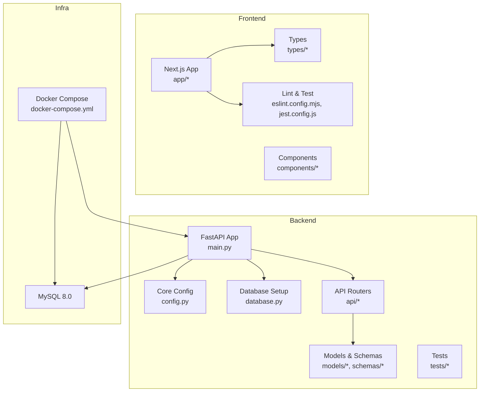
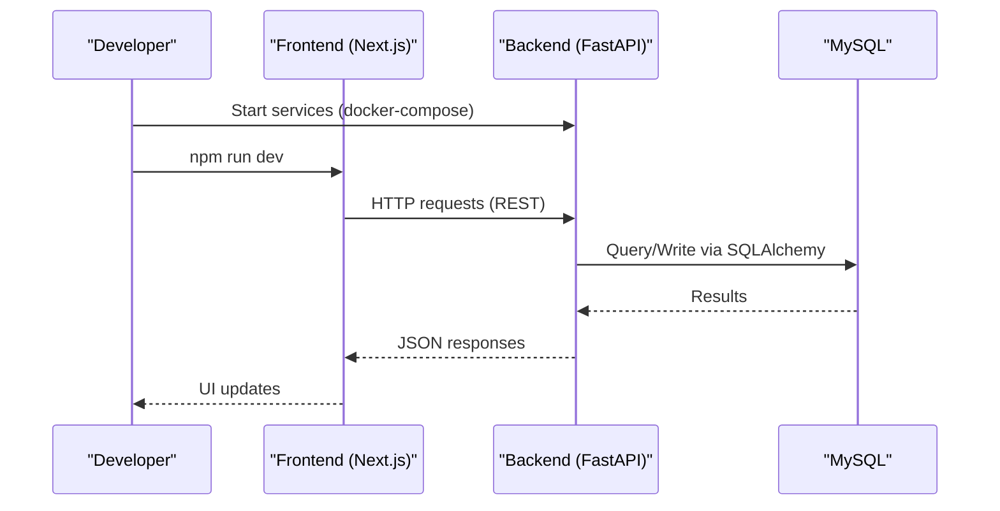
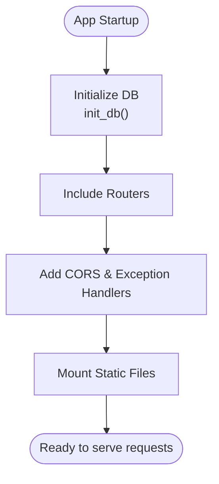
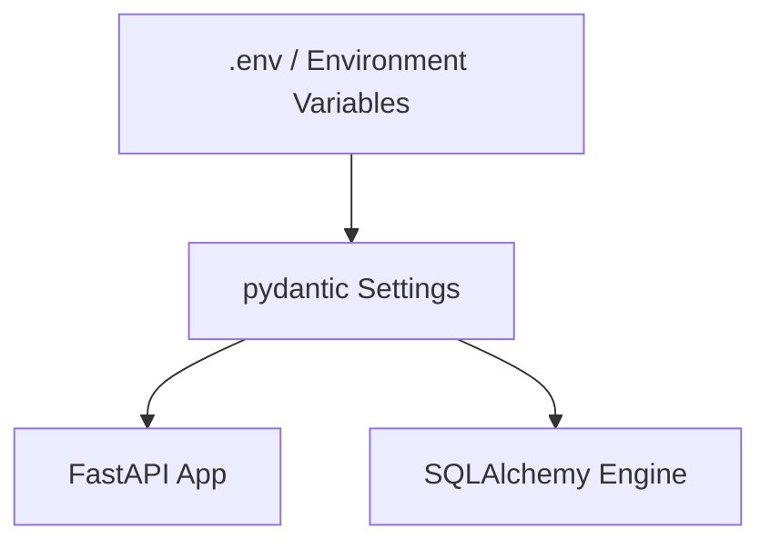
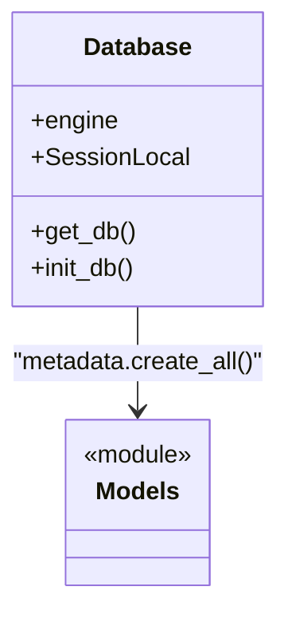
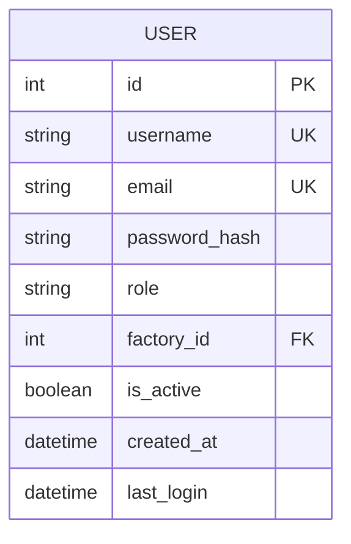
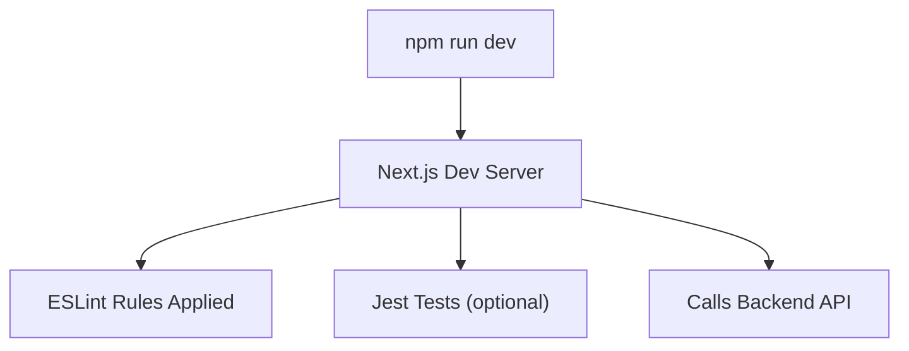
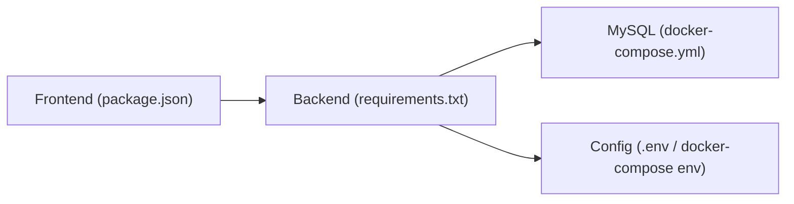

# Developer Guide

<cite>
**Referenced Files in This Document**
- [README.md](file://README.md)
- [docker-compose.yml](file://docker-compose.yml)
- [backend/main.py](file://backend/main.py)
- [backend/requirements.txt](file://backend/requirements.txt)
- [backend/app/core/config.py](file://backend/app/core/config.py)
- [backend/app/core/database.py](file://backend/app/core/database.py)
- [backend/app/models/user.py](file://backend/app/models/user.py)
- [backend/app/schemas/user.py](file://backend/app/schemas/user.py)
- [frontend/package.json](file://frontend/package.json)
- [frontend/eslint.config.mjs](file://frontend/eslint.config.mjs)
- [frontend/jest.config.js](file://frontend/jest.config.js)
- [frontend/types/index.ts](file://frontend/types/index.ts)
- [docs/API.md](file://docs/API.md)
- [backend/tests/test_health.py](file://backend/tests/test_health.py)
</cite>

## Table of Contents
1. Introduction
2. Project Structure
3. Core Components
4. Architecture Overview
5. Detailed Component Analysis
6. Dependency Analysis
7. Performance Considerations
8. Troubleshooting Guide
9. Conclusion
10. Appendices

## Introduction
This Developer Guide is a comprehensive reference for contributors to TariffGuard, an AI-powered energy and production optimization platform for small textile factories. It covers development environment setup (IDE configuration, debugging tools, workflows), coding standards and naming conventions, contribution workflow (branching, commits, pull requests), code review and quality gates, testing requirements, guidelines for adding features and maintaining backward compatibility, documentation practices, and onboarding materials.

TariffGuard consists of:
- Backend: Python FastAPI with SQLAlchemy and MySQL
- Frontend: Next.js application with TypeScript, Tailwind CSS, and Jest tests
- Infrastructure: Docker Compose orchestrating backend and MySQL

The guide provides actionable steps to set up the environment locally, run and debug services, write and test code following project conventions, and contribute changes through standard Git workflows.

**Section sources**
- [README.md:1-228](file://README.md#L1-L228)

## Project Structure
High-level layout:
- backend: FastAPI application, models, schemas, services, API routes, tests, static assets
- frontend: Next.js app with pages, components, types, tests, linting, and build scripts
- docs: API documentation
- docker-compose.yml: Local orchestration for DB and backend

**Diagram sources**
- [backend/main.py:1-91](file://backend/main.py#L1-L91)
- [backend/app/core/config.py:1-21](file://backend/app/core/config.py#L1-L21)
- [backend/app/core/database.py:1-37](file://backend/app/core/database.py#L1-L37)
- [docker-compose.yml:1-53](file://docker-compose.yml#L1-L53)
- [frontend/package.json:1-38](file://frontend/package.json#L1-L38)

**Section sources**
- [README.md:184-205](file://README.md#L184-L205)
- [docker-compose.yml:1-53](file://docker-compose.yml#L1-L53)

## Core Components
- Application entrypoint and routing: The FastAPI app registers routers, CORS middleware, exception handlers, and serves static content.
- Configuration: Centralized settings via pydantic-settings with environment variables and .env support.
- Database: SQLAlchemy engine/session management with MySQL or SQLite fallback; table initialization at startup.
- Data contracts: Pydantic schemas define request/response shapes; SQLAlchemy models map to database tables.
- Frontend: Next.js app with TypeScript, ESLint rules, and Jest tests; shared type definitions mirror backend data structures.

Key responsibilities:
- main.py: App lifecycle, middleware, router inclusion, health/root endpoints
- config.py: Environment-driven configuration
- database.py: Engine creation, session factory, init_db
- models/* and schemas/*: Domain entities and validation contracts
- frontend types: Shared interfaces between UI and API payloads

**Section sources**
- [backend/main.py:1-91](file://backend/main.py#L1-L91)
- [backend/app/core/config.py:1-21](file://backend/app/core/config.py#L1-L21)
- [backend/app/core/database.py:1-37](file://backend/app/core/database.py#L1-L37)
- [backend/app/models/user.py:1-16](file://backend/app/models/user.py#L1-L16)
- [backend/app/schemas/user.py:1-30](file://backend/app/schemas/user.py#L1-L30)
- [frontend/types/index.ts:1-46](file://frontend/types/index.ts#L1-L46)

## Architecture Overview
The system follows a layered architecture:
- Presentation: Next.js dashboard served by FastAPI during development and standalone in production
- API Layer: FastAPI routers exposing REST endpoints
- Service Layer: Business logic encapsulated in services
- Data Access: SQLAlchemy models and sessions
- Storage: MySQL database managed via Docker Compose

**Diagram sources**
- [docker-compose.yml:26-46](file://docker-compose.yml#L26-L46)
- [backend/main.py:48-68](file://backend/main.py#L48-L68)
- [backend/app/core/database.py:23-37](file://backend/app/core/database.py#L23-L37)

## Detailed Component Analysis

### Backend Application Bootstrap
- Registers routers for all domains (factories, machines, orders, tariffs, meter readings, dashboard, optimization, auth, users, alerts)
- Adds CORS middleware and global exception handlers
- Mounts static files and serves dashboard page
- Initializes database on startup

**Diagram sources**
- [backend/main.py:19-68](file://backend/main.py#L19-L68)

**Section sources**
- [backend/main.py:1-91](file://backend/main.py#L1-L91)

### Configuration Management
- Uses pydantic-settings to load environment variables and .env file
- Provides defaults for development; overrides via environment
- Keys include APP_NAME, ENVIRONMENT, DEBUG, DATABASE_URL, cloud keys

**Diagram sources**
- [backend/app/core/config.py:1-21](file://backend/app/core/config.py#L1-L21)
- [docker-compose.yml:35-40](file://docker-compose.yml#L35-L40)

**Section sources**
- [backend/app/core/config.py:1-21](file://backend/app/core/config.py#L1-L21)
- [docker-compose.yml:35-40](file://docker-compose.yml#L35-L40)

### Database Layer
- Creates SQLAlchemy engine based on DATABASE_URL (MySQL or SQLite fallback)
- Provides session factory and dependency for request-scoped DB access
- Initializes tables on startup

**Diagram sources**
- [backend/app/core/database.py:1-37](file://backend/app/core/database.py#L1-L37)

**Section sources**
- [backend/app/core/database.py:1-37](file://backend/app/core/database.py#L1-L37)

### Data Contracts (Models and Schemas)
- Models define persistent entities (e.g., User) with columns and relationships
- Schemas define validated request/response payloads using Pydantic
- Types in frontend mirror backend contracts for strong typing across layers

**Diagram sources**
- [backend/app/models/user.py:1-16](file://backend/app/models/user.py#L1-L16)
- [backend/app/schemas/user.py:1-30](file://backend/app/schemas/user.py#L1-L30)
- [frontend/types/index.ts:1-46](file://frontend/types/index.ts#L1-L46)

**Section sources**
- [backend/app/models/user.py:1-16](file://backend/app/models/user.py#L1-L16)
- [backend/app/schemas/user.py:1-30](file://backend/app/schemas/user.py#L1-L30)
- [frontend/types/index.ts:1-46](file://frontend/types/index.ts#L1-L46)

### Frontend Development Workflow
- Scripts: dev, build, start, lint, test
- Linting: ESLint configured with Next.js recommended rules
- Testing: Jest with jsdom environment and custom setup
- Types: Shared interfaces ensure consistency with backend payloads

**Diagram sources**
- [frontend/package.json:5-11](file://frontend/package.json#L5-L11)
- [frontend/eslint.config.mjs:1-19](file://frontend/eslint.config.mjs#L1-L19)
- [frontend/jest.config.js:1-16](file://frontend/jest.config.js#L1-L16)

**Section sources**
- [frontend/package.json:1-38](file://frontend/package.json#L1-L38)
- [frontend/eslint.config.mjs:1-19](file://frontend/eslint.config.mjs#L1-L19)
- [frontend/jest.config.js:1-16](file://frontend/jest.config.js#L1-L16)

## Dependency Analysis
- Backend dependencies are pinned in requirements.txt (FastAPI, Uvicorn, SQLAlchemy, PyMySQL, Pydantic, pytest, etc.)
- Frontend dependencies are declared in package.json (Next.js, React, Recharts, Tailwind utilities, Jest, ESLint)
- Docker Compose defines service dependencies and networking

**Diagram sources**
- [backend/requirements.txt:1-16](file://backend/requirements.txt#L1-L16)
- [frontend/package.json:12-36](file://frontend/package.json#L12-L36)
- [docker-compose.yml:4-46](file://docker-compose.yml#L4-L46)

**Section sources**
- [backend/requirements.txt:1-16](file://backend/requirements.txt#L1-L16)
- [frontend/package.json:1-38](file://frontend/package.json#L1-L38)
- [docker-compose.yml:1-53](file://docker-compose.yml#L1-L53)

## Performance Considerations
- Use connection pooling and recycling for MySQL (configured in database layer)
- Keep database queries efficient; avoid N+1 patterns in services
- Cache frequently accessed read-only data where appropriate
- Profile hot paths in optimization and cost calculation services
- Monitor container resource limits and adjust CPU/memory as needed
- Use pagination and filtering on list endpoints to reduce payload sizes

[No sources needed since this section provides general guidance]

## Troubleshooting Guide
Common issues and resolutions:
- Database connectivity: Ensure DATABASE_URL matches docker-compose credentials and network; verify MySQL healthcheck passes before backend starts
- CORS errors: Confirm allow_origins and methods in middleware match frontend origin during development
- Missing environment variables: Provide required keys (e.g., cloud API keys) via .env or docker-compose environment
- Port conflicts: Change exposed ports in docker-compose if host ports are already in use
- Frontend build/lint failures: Run lint and fix issues; ensure Node version matches project expectations
- Test failures: Check test client imports and database state; reset containers if necessary

Debugging tips:
- Enable DEBUG mode and verbose logging in backend
- Use Swagger UI at /docs to inspect endpoints and payloads
- Inspect container logs for stack traces
- Validate schema mismatches between frontend types and backend responses

**Section sources**
- [backend/app/core/database.py:1-37](file://backend/app/core/database.py#L1-L37)
- [backend/main.py:39-46](file://backend/main.py#L39-L46)
- [docker-compose.yml:9-24](file://docker-compose.yml#L9-L24)
- [docs/API.md:67-70](file://docs/API.md#L67-L70)

## Conclusion
This guide consolidates environment setup, coding standards, contribution workflows, testing, and troubleshooting for TariffGuard contributors. By following these practices, teams can maintain high code quality, ensure backward compatibility, and deliver features efficiently across the full stack.

[No sources needed since this section summarizes without analyzing specific files]

## Appendices

### Development Environment Setup
- Prerequisites: Docker Desktop, Git, Node.js (as per Next.js toolchain), Python 3.11
- Start services: docker-compose up -d --build
- Seed demo data: docker-compose exec backend python seed.py
- Access endpoints:
  - Swagger UI: http://localhost:8000/docs
  - Dashboard: http://localhost:8000/dashboard
  - Health check: http://localhost:8000/health
- Frontend dev server: npm run dev in frontend directory

**Section sources**
- [README.md:51-82](file://README.md#L51-L82)
- [docker-compose.yml:26-46](file://docker-compose.yml#L26-L46)

### IDE Configuration
- Backend (Python/FastAPI):
  - Use a Python interpreter that matches requirements.txt versions
  - Configure debugger to launch uvicorn with reload enabled
  - Set environment variables from .env or docker-compose
- Frontend (Next.js/TypeScript):
  - Install dependencies with npm/yarn/pnpm/bun
  - Enable ESLint integration and format on save
  - Configure Jest runner for component tests

**Section sources**
- [backend/requirements.txt:1-16](file://backend/requirements.txt#L1-L16)
- [frontend/package.json:5-11](file://frontend/package.json#L5-L11)
- [frontend/eslint.config.mjs:1-19](file://frontend/eslint.config.mjs#L1-L19)

### Coding Standards and Naming Conventions
- Python:
  - Follow PEP 8 style
  - Use descriptive module and function names
  - Group imports: stdlib, third-party, local
  - Prefer type hints and Pydantic schemas for validation
- Frontend:
  - Use TypeScript interfaces for data contracts
  - Organize components by feature folders
  - Apply consistent naming for props, hooks, and utilities
- Database:
  - Use singular table names and snake_case columns
  - Define clear primary keys and foreign keys

[No sources needed since this section provides general guidance]

### Contribution Process
- Branching strategy:
  - Create feature branches from main (e.g., feature/add-cost-calculation)
  - Keep branches focused on single concerns
- Commit messages:
  - Use conventional commits (feat, fix, chore, docs)
  - Keep messages concise and descriptive
- Pull requests:
  - Link related issues
  - Include description of changes and rationale
  - Ensure tests pass and linting is clean
- Code review:
  - Require at least one reviewer
  - Address feedback promptly
  - Merge after approvals and CI checks pass

[No sources needed since this section provides general guidance]

### Quality Gates and Testing Requirements
- Backend tests:
  - Run pytest within the backend container or locally with virtual environment
  - Verify health and core endpoints
- Frontend tests:
  - Run Jest tests for components and utilities
  - Ensure no regressions in UI behavior
- Linting:
  - Enforce ESLint rules for frontend
  - Use pre-commit hooks to enforce formatting and linting

**Section sources**
- [backend/tests/test_health.py:1-25](file://backend/tests/test_health.py#L1-L25)
- [frontend/jest.config.js:1-16](file://frontend/jest.config.js#L1-L16)
- [frontend/eslint.config.mjs:1-19](file://frontend/eslint.config.mjs#L1-L19)

### Adding New Features and Maintaining Backward Compatibility
- Define new endpoints under api/* with clear routes
- Add corresponding schemas in schemas/* for input/output validation
- Implement business logic in services/*
- Update models/* only when necessary; prefer additive changes
- Maintain backward compatibility:
  - Avoid breaking changes to existing endpoints
  - Deprecate fields gradually with versioning strategies if needed
  - Update API documentation accordingly

**Section sources**
- [backend/main.py:48-58](file://backend/main.py#L48-L58)
- [backend/app/schemas/user.py:1-30](file://backend/app/schemas/user.py#L1-L30)

### Documentation Standards and Changelog Maintenance
- API documentation:
  - Keep docs/API.md aligned with actual endpoints
  - Use Swagger UI for interactive exploration
- Changelog:
  - Track notable changes, deprecations, and migrations
  - Reference PR numbers and issue links

**Section sources**
- [docs/API.md:1-88](file://docs/API.md#L1-L88)

### Onboarding Materials
- Review README for overview, tech stack, and quick start
- Explore backend structure and key modules
- Familiarize yourself with frontend pages and components
- Run tests and explore Swagger UI
- Read architectural decisions and design patterns used in services and models

**Section sources**
- [README.md:1-228](file://README.md#L1-L228)