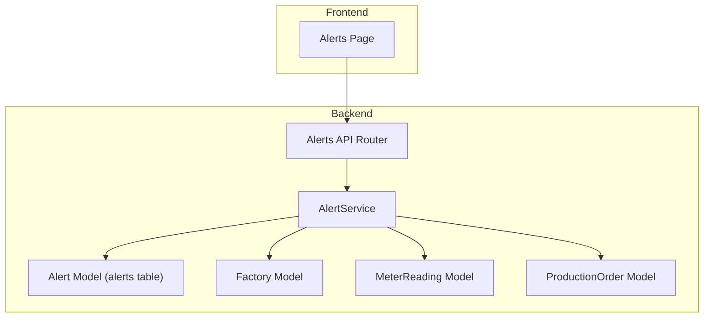
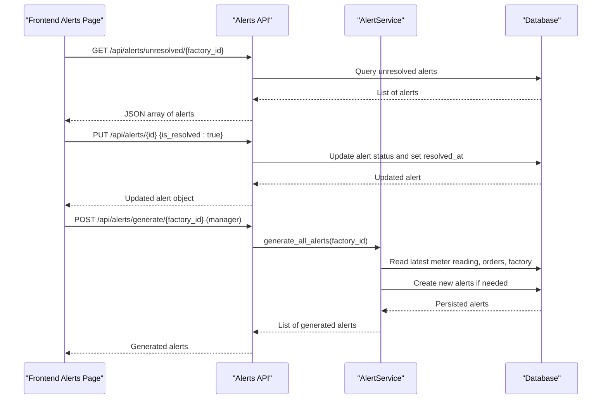
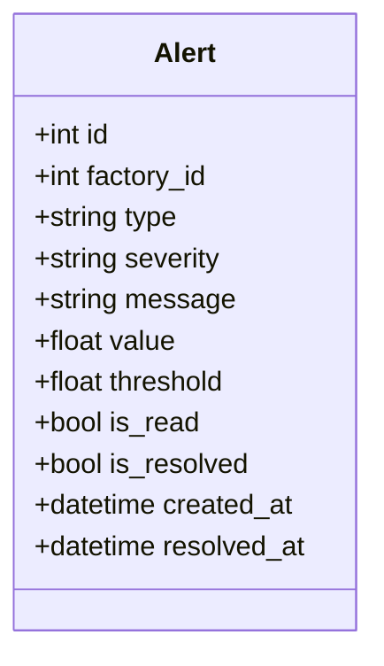
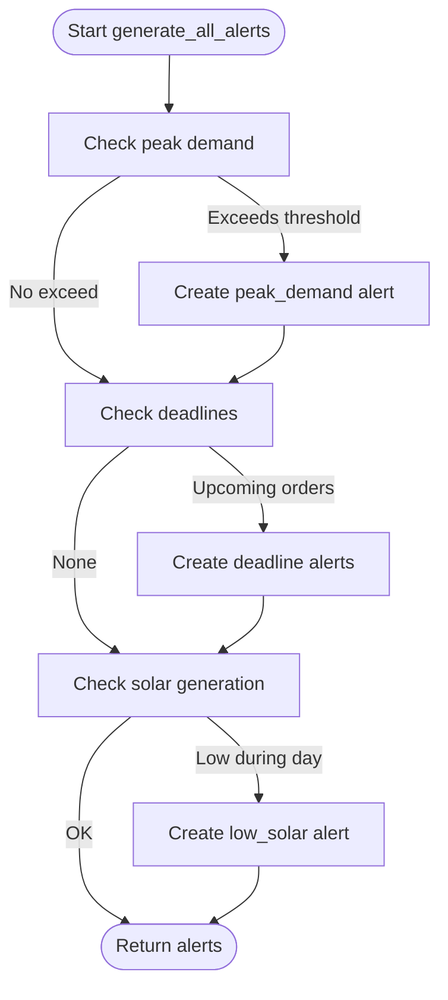
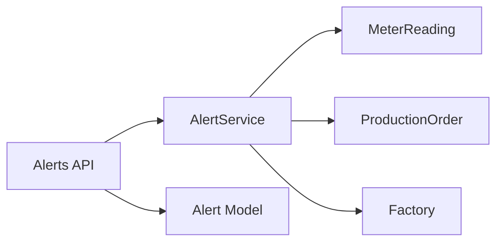

# Alert System

<cite>
**Referenced Files in This Document**
- [alert.py](file://backend/app/models/alert.py)
- [alert.py](file://backend/app/schemas/alert.py)
- [alert.py](file://backend/app/api/alert.py)
- [alert_service.py](file://backend/app/services/alert_service.py)
- [factory.py](file://backend/app/models/factory.py)
- [main.py](file://backend/main.py)
- [page.tsx](file://frontend/app/dashboard/alerts/page.tsx)
- [API.md](file://docs/API.md)
</cite>

## Table of Contents
1. [Introduction](#introduction)
2. [Project Structure](#project-structure)
3. [Core Components](#core-components)
4. [Architecture Overview](#architecture-overview)
5. [Detailed Component Analysis](#detailed-component-analysis)
6. [Dependency Analysis](#dependency-analysis)
7. [Performance Considerations](#performance-considerations)
8. [Troubleshooting Guide](#troubleshooting-guide)
9. [Conclusion](#conclusion)
10. [Appendices](#appendices)

## Introduction
This document explains the Alert System in TariffGuard, focusing on proactive alert generation for deadline warnings, energy consumption limits, and operational anomalies. It covers alert types, severity levels, notification channels, the alert data model, API endpoints, integration points with monitoring systems, configuration examples, resolution workflows, customization options, and troubleshooting guidance.

## Project Structure
The Alert System is implemented as a dedicated module within the backend and surfaced through a frontend dashboard page:
- Backend API routes expose listing, filtering, generation, updating, and statistics for alerts.
- A service layer performs proactive checks against meter readings, production orders, and factory settings to generate alerts.
- The frontend displays unresolved alerts, allows marking them resolved, and shows summary metrics.

**Diagram sources**
- [alert.py:1-107](file://backend/app/api/alert.py#L1-L107)
- [alert_service.py:1-140](file://backend/app/services/alert_service.py#L1-L140)
- [alert.py:1-18](file://backend/app/models/alert.py#L1-L18)
- [factory.py:1-17](file://backend/app/models/factory.py#L1-L17)

**Section sources**
- [main.py:48-58](file://backend/main.py#L48-L58)
- [alert.py:1-107](file://backend/app/api/alert.py#L1-L107)
- [alert_service.py:1-140](file://backend/app/services/alert_service.py#L1-L140)
- [page.tsx:1-314](file://frontend/app/dashboard/alerts/page.tsx#L1-L314)

## Core Components
- Alert Data Model: Defines the persistent schema for alerts including type, severity, thresholds, values, and status flags.
- Alert Schemas: Pydantic models for request/response validation and serialization.
- Alert Service: Proactive logic that evaluates conditions and creates alerts.
- Alerts API: Endpoints to list, filter, generate, update, and get statistics for alerts.
- Frontend Alerts UI: Displays active alerts, supports filtering, and allows marking alerts as resolved.

Key responsibilities:
- Generate alerts for peak demand, upcoming deadlines, and low solar generation.
- Prevent duplicate alerts within time windows or by matching messages.
- Provide management APIs for operators to review and resolve alerts.

**Section sources**
- [alert.py:1-18](file://backend/app/models/alert.py#L1-L18)
- [alert.py:1-28](file://backend/app/schemas/alert.py#L1-L28)
- [alert_service.py:1-140](file://backend/app/services/alert_service.py#L1-L140)
- [alert.py:1-107](file://backend/app/api/alert.py#L1-L107)
- [page.tsx:1-314](file://frontend/app/dashboard/alerts/page.tsx#L1-L314)

## Architecture Overview
The alert system follows a layered architecture:
- API Layer: FastAPI routers handle HTTP requests and responses.
- Service Layer: Business logic for evaluating thresholds and creating alerts.
- Data Layer: SQLAlchemy models interact with the database.
- Frontend: React-based dashboard consumes the API to display and manage alerts.

**Diagram sources**
- [alert.py:14-107](file://backend/app/api/alert.py#L14-L107)
- [alert_service.py:19-140](file://backend/app/services/alert_service.py#L19-L140)

## Detailed Component Analysis

### Alert Data Model
The Alert model stores each alert with fields for identification, association to a factory, type, severity, message, measured value, threshold, read/resolved status, and timestamps.

**Diagram sources**
- [alert.py:1-18](file://backend/app/models/alert.py#L1-L18)

**Section sources**
- [alert.py:1-18](file://backend/app/models/alert.py#L1-L18)

### Alert Schemas
Pydantic schemas define input and output contracts for alerts:
- AlertBase: Common fields shared across create/update/response.
- AlertCreate: Used for creating alerts via API.
- AlertUpdate: Allows toggling read/resolved flags.
- AlertResponse: Full response including IDs and timestamps.

**Section sources**
- [alert.py:1-28](file://backend/app/schemas/alert.py#L1-L28)

### Alert Service Logic
The service implements three proactive checks:
- Peak Demand: Reads the latest meter reading; if kW exceeds threshold, creates an alert with severity based on how much it exceeds the threshold.
- Deadlines: Scans pending orders due within a configurable window; creates per-order alerts with severity depending on hours remaining.
- Solar Generation: During daytime hours, checks if solar kWh is below a minimum; creates a warning alert when underperforming relative to capacity.

Deduplication strategies:
- Peak demand: Avoids duplicate alerts within a one-hour window for the same factory and type.
- Deadline: Avoids duplicates by matching order number in the message field for unresolved alerts.

**Diagram sources**
- [alert_service.py:19-140](file://backend/app/services/alert_service.py#L19-L140)

**Section sources**
- [alert_service.py:19-140](file://backend/app/services/alert_service.py#L19-L140)

### Alerts API
Endpoints provide full CRUD-like capabilities for alert management:
- List alerts with filters (factory, severity, resolved status).
- Generate alerts for a factory (requires manager role).
- Get unresolved alerts sorted by severity and time.
- Update alert status (mark as read/resolved), automatically setting resolved timestamp when resolved.
- Get alert statistics (total, unresolved, critical, resolved).

Authentication and authorization:
- Some endpoints require authentication; generation and updates require manager role.

**Section sources**
- [alert.py:1-107](file://backend/app/api/alert.py#L1-L107)

### Frontend Alerts UI
The dashboard page:
- Loads unresolved alerts and stats for a given factory.
- Displays alert cards with severity indicators, icons, and contextual labels.
- Supports marking all alerts as resolved and individual dismissal.
- Shows anomaly detection panel with charts and insights.

Integration:
- Calls /api/alerts/unresolved/{factory_id} and /api/alerts/stats/{factory_id}.
- Updates alerts via PUT /api/alerts/{id} with is_resolved flag.

**Section sources**
- [page.tsx:1-314](file://frontend/app/dashboard/alerts/page.tsx#L1-L314)

## Dependency Analysis
The alert system depends on several domain models:
- MeterReading: Provides current kW and solar kWh values used for peak demand and solar checks.
- ProductionOrder: Supplies pending orders with deadlines for deadline alerts.
- Factory: Supplies solar capacity and operating context for solar checks.

**Diagram sources**
- [alert_service.py:1-140](file://backend/app/services/alert_service.py#L1-L140)
- [alert.py:1-18](file://backend/app/models/alert.py#L1-L18)
- [factory.py:1-17](file://backend/app/models/factory.py#L1-L17)

**Section sources**
- [alert_service.py:1-140](file://backend/app/services/alert_service.py#L1-L140)
- [factory.py:1-17](file://backend/app/models/factory.py#L1-L17)

## Performance Considerations
- Deduplication windows reduce redundant alert creation:
  - Peak demand avoids repeated alerts within one hour.
  - Deadline deduplicates by order number in message for unresolved alerts.
- Filtering and sorting:
  - Unresolved endpoint sorts by severity descending then created_at descending to prioritize critical issues.
- Database queries:
  - Latest meter reading uses order by timestamp desc and limit 1 for efficiency.
- Threshold tuning:
  - Adjust default thresholds in service methods to balance sensitivity and noise.

[No sources needed since this section provides general guidance]

## Troubleshooting Guide
Common issues and resolutions:
- No alerts generated:
  - Ensure meter readings exist and are recent; verify factory has solar capacity configured for solar checks.
  - Confirm pending orders have deadlines within the configured window.
- Duplicate alerts:
  - Check deduplication logic; ensure existing unresolved alerts are not being matched incorrectly.
- Authentication/Authorization errors:
  - Generation and update endpoints require manager role; verify user roles.
- Frontend cannot load alerts:
  - Verify API endpoints return correct JSON; check network calls to /api/alerts/unresolved/{factory_id} and /api/alerts/stats/{factory_id}.
- Resolution not reflected:
  - Ensure PUT /api/alerts/{id} sets is_resolved to true; resolved_at should be set automatically.

**Section sources**
- [alert.py:35-80](file://backend/app/api/alert.py#L35-L80)
- [alert_service.py:19-140](file://backend/app/services/alert_service.py#L19-L140)
- [page.tsx:33-89](file://frontend/app/dashboard/alerts/page.tsx#L33-L89)

## Conclusion
The Alert System in TariffGuard provides proactive monitoring and actionable notifications for peak demand, upcoming deadlines, and solar generation anomalies. It offers a robust API for managing alerts and a user-friendly frontend for reviewing and resolving issues. With configurable thresholds and deduplication strategies, it balances sensitivity and reliability while integrating seamlessly with monitoring data sources.

[No sources needed since this section summarizes without analyzing specific files]

## Appendices

### Alert Types and Severity Levels
- Types:
  - peak_demand: Energy consumption spikes exceeding configured thresholds.
  - deadline: Approaching order deadlines requiring attention.
  - low_solar: Solar generation below expected levels during daytime.
- Severity:
  - info: Informational notices.
  - warning: Conditions requiring attention.
  - critical: Urgent conditions needing immediate action.

**Section sources**
- [alert.py:10-11](file://backend/app/models/alert.py#L10-L11)
- [alert_service.py:37-44](file://backend/app/services/alert_service.py#L37-L44)
- [alert_service.py:75-82](file://backend/app/services/alert_service.py#L75-L82)
- [alert_service.py:109-116](file://backend/app/services/alert_service.py#L109-L116)

### Notification Channels
- In-app notifications: Implemented via the Alerts dashboard page displaying unresolved alerts and allowing resolution.
- Email and SMS: Not implemented in the current codebase; the frontend includes UI placeholders for notification preferences.

**Section sources**
- [page.tsx:1-314](file://frontend/app/dashboard/alerts/page.tsx#L1-L314)

### Alert Data Model Fields
- id: Unique identifier.
- factory_id: Associated factory.
- type: Category of alert.
- severity: Priority level.
- message: Human-readable description.
- value: Measured value at alert time.
- threshold: Configured threshold that triggered the alert.
- is_read: Whether the alert has been viewed.
- is_resolved: Whether the alert has been addressed.
- created_at: Timestamp of creation.
- resolved_at: Timestamp of resolution.

**Section sources**
- [alert.py:1-18](file://backend/app/models/alert.py#L1-L18)

### API Interface Summary
- GET /api/alerts/: List alerts with optional filters (factory_id, severity, is_resolved, limit).
- POST /api/alerts/generate/{factory_id}: Generate alerts for a factory (manager only).
- GET /api/alerts/unresolved/{factory_id}: Retrieve unresolved alerts sorted by severity and time.
- PUT /api/alerts/{alert_id}: Update alert status (read/resolved); resolves timestamp set automatically.
- GET /api/alerts/stats/{factory_id}: Return counts for total, unresolved, critical, and resolved alerts.

**Section sources**
- [alert.py:14-107](file://backend/app/api/alert.py#L14-L107)

### Practical Examples
- Configure peak demand threshold:
  - Adjust threshold_kw parameter in peak demand check to tune sensitivity.
- Set deadline window:
  - Modify hours_ahead parameter in deadline check to control how far ahead alerts are generated.
- Monitor solar generation:
  - Tune min_solar_kw to match expected performance and avoid false positives.

**Section sources**
- [alert_service.py:20-20](file://backend/app/services/alert_service.py#L20-L20)
- [alert_service.py:53-53](file://backend/app/services/alert_service.py#L53-L53)
- [alert_service.py:94-94](file://backend/app/services/alert_service.py#L94-L94)

### Customization Options
- Alert rules:
  - Thresholds and time windows can be adjusted in service methods to fit operational needs.
- Notification preferences:
  - Frontend includes UI for enabling email and WhatsApp notifications; backend does not implement delivery yet.
- Escalation procedures:
  - Not implemented; could be extended by adding escalation rules based on severity and duration.

**Section sources**
- [alert_service.py:19-140](file://backend/app/services/alert_service.py#L19-L140)
- [page.tsx:1-314](file://frontend/app/dashboard/alerts/page.tsx#L1-L314)

### Integration with Monitoring Systems
- Meter readings:
  - Peak demand and solar checks rely on the latest meter reading entries.
- Production orders:
  - Deadline alerts depend on pending orders with deadlines.
- Factory configuration:
  - Solar capacity informs solar generation checks.

**Section sources**
- [alert_service.py:22-25](file://backend/app/services/alert_service.py#L22-L25)
- [alert_service.py:57-62](file://backend/app/services/alert_service.py#L57-L62)
- [alert_service.py:97-99](file://backend/app/services/alert_service.py#L97-L99)