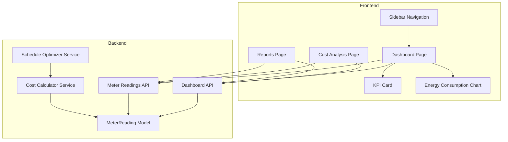
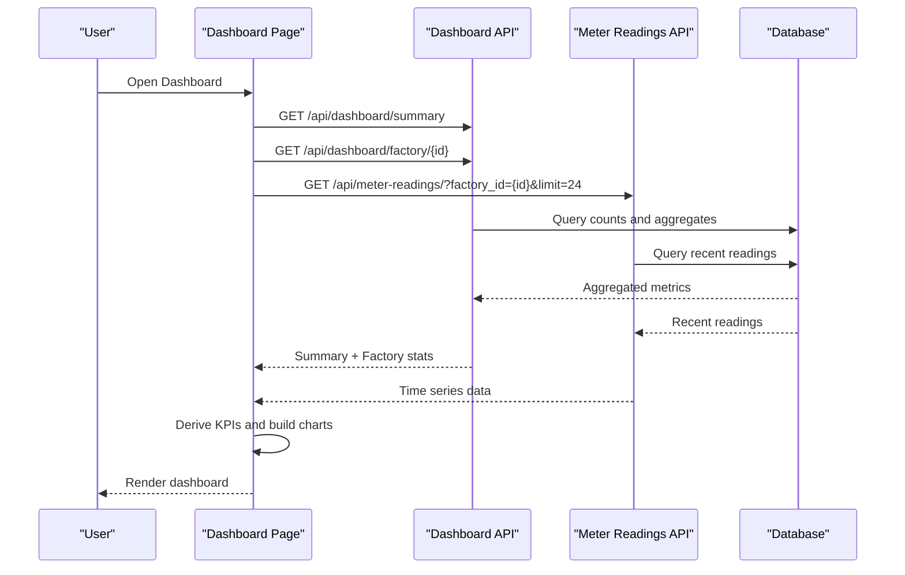
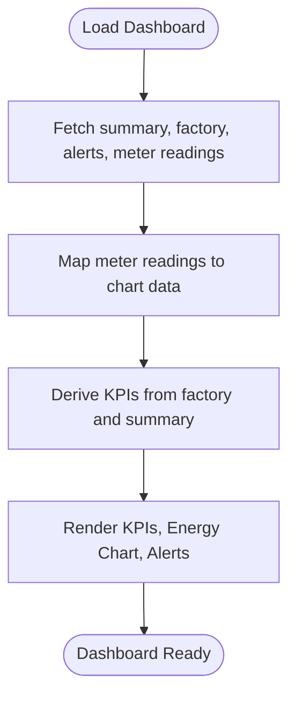
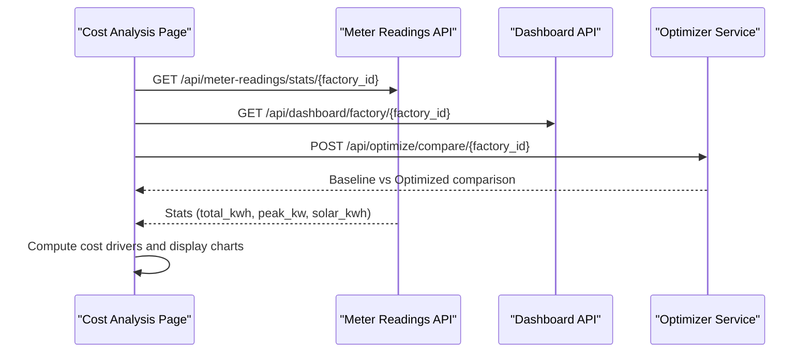
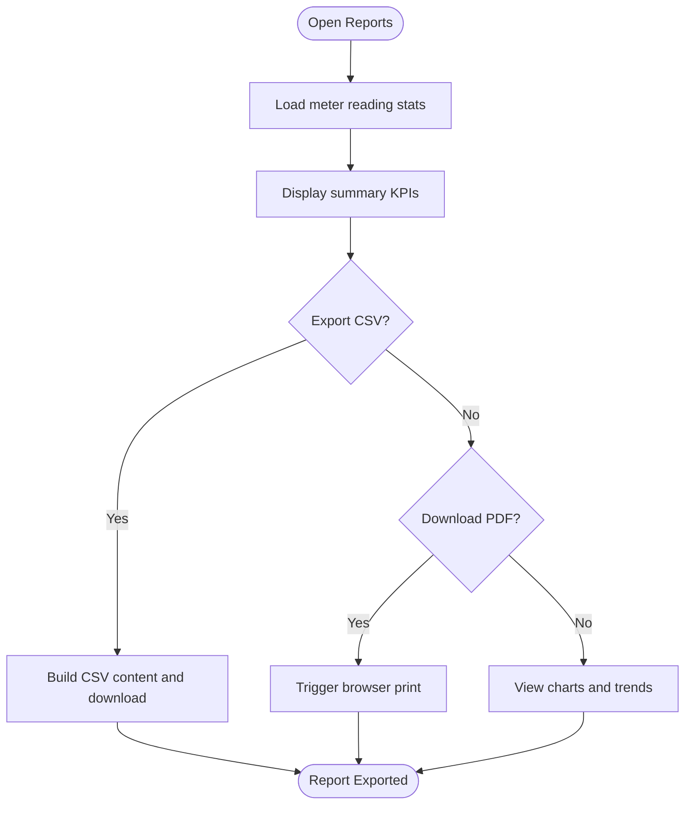
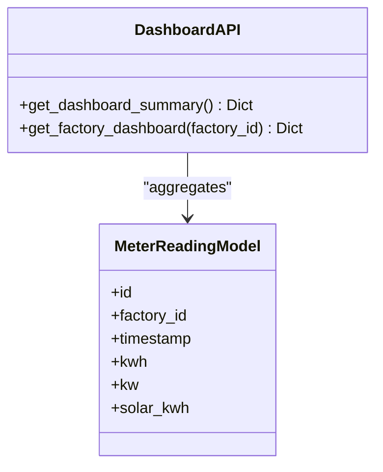
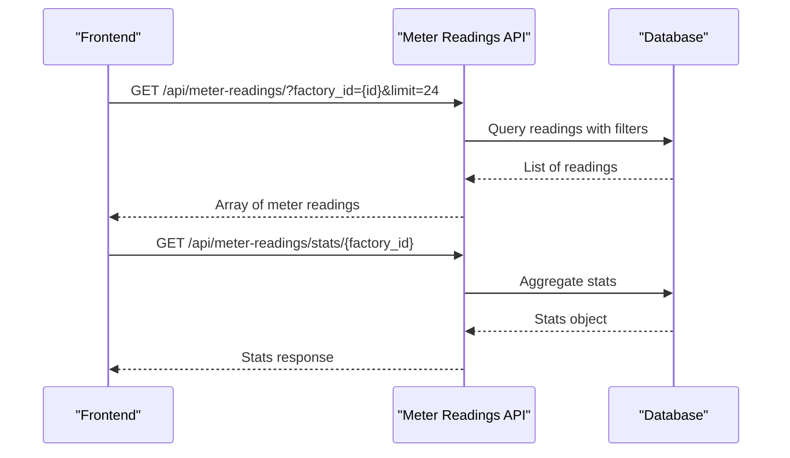
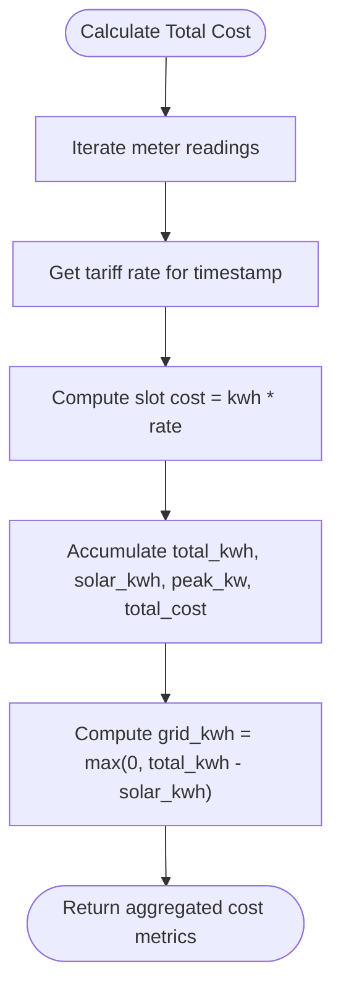
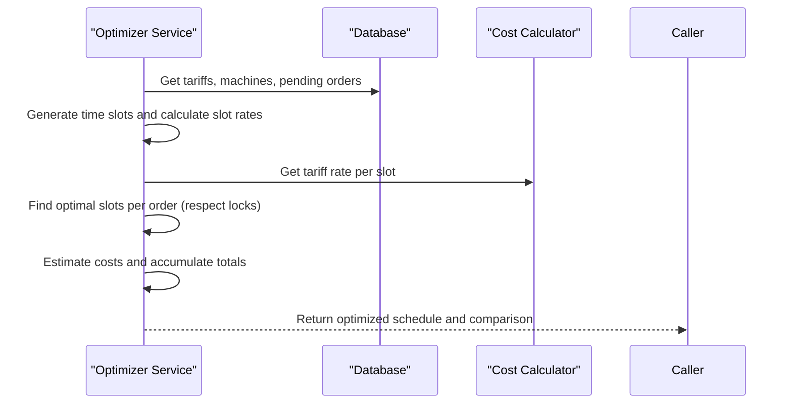
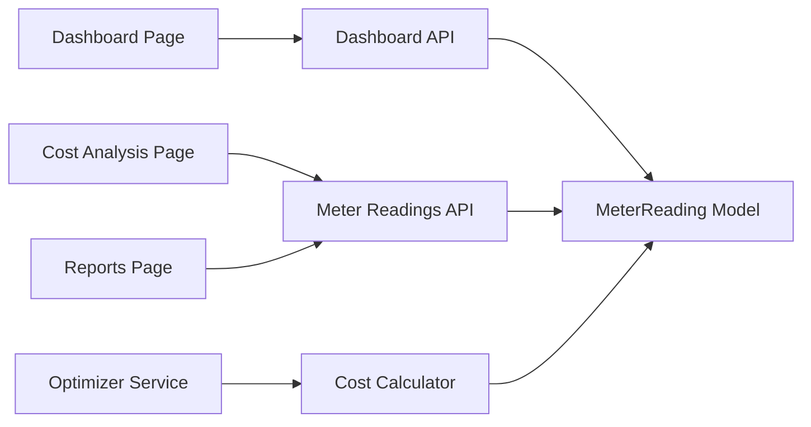

# Dashboard & Analytics

<cite>
**Referenced Files in This Document**
- [backend/app/api/dashboard.py](file://backend/app/api/dashboard.py)
- [backend/app/api/meter_reading.py](file://backend/app/api/meter_reading.py)
- [backend/app/services/cost_calculator.py](file://backend/app/services/cost_calculator.py)
- [backend/app/services/optimizer.py](file://backend/app/services/optimizer.py)
- [backend/app/models/meter_reading.py](file://backend/app/models/meter_reading.py)
- [frontend/app/dashboard/page.tsx](file://frontend/app/dashboard/page.tsx)
- [frontend/app/dashboard/cost_analysis/page.tsx](file://frontend/app/dashboard/cost_analysis/page.tsx)
- [frontend/app/dashboard/reports/page.tsx](file://frontend/app/dashboard/reports/page.tsx)
- [frontend/components/ui/kpi_card.tsx](file://frontend/components/ui/kpi_card.tsx)
- [frontend/components/charts/energy_consumption_chart.tsx](file://frontend/components/charts/energy_consumption_chart.tsx)
- [frontend/components/layout/sidebar.tsx](file://frontend/components/layout/sidebar.tsx)
- [frontend/types/index.ts](file://frontend/types/index.ts)
</cite>

## Table of Contents
1. Introduction
2. Project Structure
3. Core Components
4. Architecture Overview
5. Detailed Component Analysis
6. Dependency Analysis
7. Performance Considerations
8. Troubleshooting Guide
9. Conclusion
10. Appendices

## Introduction
This document explains the Dashboard & Analytics capabilities in TariffGuard, focusing on KPI visualization, energy consumption charts, cost analysis reports, and real-time data updates. It also documents dashboard layout and widget composition, backend API endpoints for aggregated metrics and trend analytics, practical examples for customization and reporting, advanced features like custom chart creation and metric filtering, common use cases, integration points with other system components, and performance optimization guidance.

## Project Structure
The dashboard spans both frontend and backend:
- Frontend pages render KPIs, charts, alerts, cost analysis, and reports using reusable UI components and Recharts visualizations.
- Backend provides FastAPI endpoints to aggregate metrics from factories, machines, production orders, tariffs, and meter readings.
- Services compute costs and optimize schedules based on tariff periods and consumption data.

**Diagram sources**
- [frontend/app/dashboard/page.tsx:1-172](file://frontend/app/dashboard/page.tsx#L1-L172)
- [frontend/app/dashboard/cost_analysis/page.tsx:1-226](file://frontend/app/dashboard/cost_analysis/page.tsx#L1-L226)
- [frontend/app/dashboard/reports/page.tsx:1-306](file://frontend/app/dashboard/reports/page.tsx#L1-L306)
- [frontend/components/ui/kpi_card.tsx:1-37](file://frontend/components/ui/kpi_card.tsx#L1-L37)
- [frontend/components/charts/energy_consumption_chart.tsx:1-65](file://frontend/components/charts/energy_consumption_chart.tsx#L1-L65)
- [frontend/components/layout/sidebar.tsx:1-98](file://frontend/components/layout/sidebar.tsx#L1-L98)
- [backend/app/api/dashboard.py:1-79](file://backend/app/api/dashboard.py#L1-L79)
- [backend/app/api/meter_reading.py:1-141](file://backend/app/api/meter_reading.py#L1-L141)
- [backend/app/services/cost_calculator.py:1-110](file://backend/app/services/cost_calculator.py#L1-L110)
- [backend/app/services/optimizer.py:1-238](file://backend/app/services/optimizer.py#L1-L238)
- [backend/app/models/meter_reading.py:1-17](file://backend/app/models/meter_reading.py#L1-L17)

**Section sources**
- [frontend/app/dashboard/page.tsx:1-172](file://frontend/app/dashboard/page.tsx#L1-L172)
- [backend/app/api/dashboard.py:1-79](file://backend/app/api/dashboard.py#L1-L79)
- [backend/app/api/meter_reading.py:1-141](file://backend/app/api/meter_reading.py#L1-L141)

## Core Components
- KPI Cards: Display daily energy cost, peak demand, solar utilization, and order compliance with deltas and contextual subtext.
- Energy Consumption Chart: Area chart showing grid usage and solar generation over time.
- Alerts Panel: Active alerts with severity indicators and timestamps.
- Cost Analysis: Bar charts comparing baseline vs optimized costs and peak vs off-peak consumption; cost drivers breakdown; AI recommendations.
- Reports: Summary KPIs, pie chart for cost breakdown, savings trend composed chart, CSV export, and PDF print.

Key implementation references:
- KPI card component structure and styling
- Energy consumption chart configuration and axes
- Dashboard page data fetching and KPI derivation
- Cost analysis page charts and recommendation cards
- Reports page export and trend visualization

**Section sources**
- [frontend/components/ui/kpi_card.tsx:1-37](file://frontend/components/ui/kpi_card.tsx#L1-L37)
- [frontend/components/charts/energy_consumption_chart.tsx:1-65](file://frontend/components/charts/energy_consumption_chart.tsx#L1-L65)
- [frontend/app/dashboard/page.tsx:1-172](file://frontend/app/dashboard/page.tsx#L1-L172)
- [frontend/app/dashboard/cost_analysis/page.tsx:1-226](file://frontend/app/dashboard/cost_analysis/page.tsx#L1-L226)
- [frontend/app/dashboard/reports/page.tsx:1-306](file://frontend/app/dashboard/reports/page.tsx#L1-L306)

## Architecture Overview
The dashboard aggregates data via backend APIs and renders it through React components. The flow includes:
- Fetching summary and factory-specific metrics
- Retrieving recent meter readings for energy charts
- Loading unresolved alerts
- Deriving KPIs from raw metrics
- Rendering charts and panels

**Diagram sources**
- [frontend/app/dashboard/page.tsx:16-62](file://frontend/app/dashboard/page.tsx#L16-L62)
- [backend/app/api/dashboard.py:15-79](file://backend/app/api/dashboard.py#L15-L79)
- [backend/app/api/meter_reading.py:90-111](file://backend/app/api/meter_reading.py#L90-L111)

## Detailed Component Analysis

### Dashboard Overview (Frontend)
- Loads summary, factory data, alerts, and recent meter readings concurrently.
- Builds energy chart data by mapping meter readings to time-series format.
- Derives KPIs such as daily cost, peak demand, solar utilization, and order compliance.
- Renders KPI cards, energy area chart, and active alerts panel.

**Diagram sources**
- [frontend/app/dashboard/page.tsx:16-62](file://frontend/app/dashboard/page.tsx#L16-L62)
- [frontend/app/dashboard/page.tsx:72-98](file://frontend/app/dashboard/page.tsx#L72-L98)
- [frontend/app/dashboard/page.tsx:100-169](file://frontend/app/dashboard/page.tsx#L100-L169)

**Section sources**
- [frontend/app/dashboard/page.tsx:1-172](file://frontend/app/dashboard/page.tsx#L1-L172)

### KPI Card Component
- Displays title, value, optional delta indicator, and subtext.
- Uses glass panel styling and accent color top border.
- Supports dynamic delta coloring based on positive or negative changes.

**Section sources**
- [frontend/components/ui/kpi_card.tsx:1-37](file://frontend/components/ui/kpi_card.tsx#L1-L37)

### Energy Consumption Chart
- Recharts-based area chart with two series: grid usage and solar generation.
- Configured with responsive container, gradient fills, tooltips, and formatted Y-axis labels.
- Consumes typed data structure for consistent rendering.

**Section sources**
- [frontend/components/charts/energy_consumption_chart.tsx:1-65](file://frontend/components/charts/energy_consumption_chart.tsx#L1-L65)
- [frontend/types/index.ts:41-45](file://frontend/types/index.ts#L41-L45)

### Cost Analysis Page
- Fetches meter reading statistics and compares baseline vs optimized costs.
- Displays weekly comparison bar chart and stacked peak/off-peak cost chart.
- Computes cost drivers and shows AI recommendations.

**Diagram sources**
- [frontend/app/dashboard/cost_analysis/page.tsx:56-74](file://frontend/app/dashboard/cost_analysis/page.tsx#L56-L74)
- [backend/app/services/optimizer.py:192-238](file://backend/app/services/optimizer.py#L192-L238)

**Section sources**
- [frontend/app/dashboard/cost_analysis/page.tsx:1-226](file://frontend/app/dashboard/cost_analysis/page.tsx#L1-L226)
- [backend/app/services/optimizer.py:192-238](file://backend/app/services/optimizer.py#L192-L238)

### Reports Page
- Generates report stats and displays summary KPIs.
- Provides CSV export and PDF print functionality.
- Visualizes cost breakdown via pie chart and savings trend via composed chart.

**Diagram sources**
- [frontend/app/dashboard/reports/page.tsx:41-72](file://frontend/app/dashboard/reports/page.tsx#L41-L72)
- [frontend/app/dashboard/reports/page.tsx:74-105](file://frontend/app/dashboard/reports/page.tsx#L74-L105)
- [frontend/app/dashboard/reports/page.tsx:116-306](file://frontend/app/dashboard/reports/page.tsx#L116-L306)

**Section sources**
- [frontend/app/dashboard/reports/page.tsx:1-306](file://frontend/app/dashboard/reports/page.tsx#L1-L306)

### Backend Dashboard API
- Provides overall summary including totals and order status breakdown.
- Returns factory-specific dashboard data with machine/order counts and energy stats.

**Diagram sources**
- [backend/app/api/dashboard.py:15-79](file://backend/app/api/dashboard.py#L15-L79)
- [backend/app/models/meter_reading.py:5-17](file://backend/app/models/meter_reading.py#L5-L17)

**Section sources**
- [backend/app/api/dashboard.py:1-79](file://backend/app/api/dashboard.py#L1-L79)

### Backend Meter Readings API
- Lists filtered meter readings with pagination and date range filters.
- Provides statistics endpoint aggregating total readings, consumption, average, peak, and solar usage.

**Diagram sources**
- [backend/app/api/meter_reading.py:90-111](file://backend/app/api/meter_reading.py#L90-L111)
- [backend/app/api/meter_reading.py:113-141](file://backend/app/api/meter_reading.py#L113-L141)

**Section sources**
- [backend/app/api/meter_reading.py:1-141](file://backend/app/api/meter_reading.py#L1-L141)

### Cost Calculation Service
- Determines applicable tariff rate based on timestamp and tariff periods.
- Calculates slot-level costs and total cost across readings, including peak detection and solar offset.

**Diagram sources**
- [backend/app/services/cost_calculator.py:52-90](file://backend/app/services/cost_calculator.py#L52-L90)
- [backend/app/services/cost_calculator.py:15-33](file://backend/app/services/cost_calculator.py#L15-L33)

**Section sources**
- [backend/app/services/cost_calculator.py:1-110](file://backend/app/services/cost_calculator.py#L1-L110)

### Schedule Optimizer Service
- Generates time slots and calculates rates per slot using tariff periods.
- Finds optimal consecutive slots for each pending order while respecting locked slots.
- Compares baseline vs optimized schedule to quantify savings.

**Diagram sources**
- [backend/app/services/optimizer.py:36-64](file://backend/app/services/optimizer.py#L36-L64)
- [backend/app/services/optimizer.py:66-95](file://backend/app/services/optimizer.py#L66-L95)
- [backend/app/services/optimizer.py:97-190](file://backend/app/services/optimizer.py#L97-L190)
- [backend/app/services/optimizer.py:192-238](file://backend/app/services/optimizer.py#L192-L238)

**Section sources**
- [backend/app/services/optimizer.py:1-238](file://backend/app/services/optimizer.py#L1-L238)

## Dependency Analysis
- Frontend depends on backend APIs for live data and uses Recharts for visualization.
- Backend dashboard API depends on models for aggregation queries.
- Cost calculation service depends on tariff definitions and meter readings.
- Optimizer service composes cost calculations and scheduling logic.

**Diagram sources**
- [frontend/app/dashboard/page.tsx:16-62](file://frontend/app/dashboard/page.tsx#L16-L62)
- [backend/app/api/dashboard.py:15-79](file://backend/app/api/dashboard.py#L15-L79)
- [backend/app/api/meter_reading.py:90-141](file://backend/app/api/meter_reading.py#L90-L141)
- [backend/app/services/cost_calculator.py:52-90](file://backend/app/services/cost_calculator.py#L52-L90)
- [backend/app/services/optimizer.py:97-190](file://backend/app/services/optimizer.py#L97-L190)

**Section sources**
- [frontend/app/dashboard/page.tsx:1-172](file://frontend/app/dashboard/page.tsx#L1-L172)
- [backend/app/api/dashboard.py:1-79](file://backend/app/api/dashboard.py#L1-L79)
- [backend/app/api/meter_reading.py:1-141](file://backend/app/api/meter_reading.py#L1-L141)
- [backend/app/services/cost_calculator.py:1-110](file://backend/app/services/cost_calculator.py#L1-L110)
- [backend/app/services/optimizer.py:1-238](file://backend/app/services/optimizer.py#L1-L238)

## Performance Considerations
- Prefer server-side aggregation for large datasets using database functions to reduce payload size.
- Use pagination and limits on meter reading queries to avoid heavy responses.
- Cache frequently accessed dashboard summaries and factory stats where appropriate.
- Defer non-critical chart rendering until after core KPIs are displayed.
- Minimize re-renders by memoizing chart data and avoiding unnecessary state updates.
- Use responsive containers and efficient chart configurations to maintain smooth interactions.

[No sources needed since this section provides general guidance]

## Troubleshooting Guide
- If dashboard fails to load, check network requests to summary, factory, alerts, and meter readings endpoints.
- Verify that meter reading stats return expected fields; handle empty results gracefully.
- For cost analysis issues, ensure optimizer compare endpoint is available or fallback to mock data with warnings.
- When exporting reports, confirm CSV generation and PDF print triggers execute without errors.
- Inspect alert counts and messages; validate severity mapping and timestamps.

**Section sources**
- [frontend/app/dashboard/page.tsx:16-62](file://frontend/app/dashboard/page.tsx#L16-L62)
- [frontend/app/dashboard/cost_analysis/page.tsx:56-74](file://frontend/app/dashboard/cost_analysis/page.tsx#L56-L74)
- [frontend/app/dashboard/reports/page.tsx:41-72](file://frontend/app/dashboard/reports/page.tsx#L41-L72)

## Conclusion
TariffGuard’s Dashboard & Analytics provide a comprehensive view of energy consumption, costs, and operational metrics. The frontend delivers intuitive KPIs and charts, while the backend supplies robust aggregation and optimization services. Users can monitor daily operations, generate monthly reports, and gain strategic insights through comparative analytics and AI-driven recommendations. Integration points with meter readings, tariffs, and scheduling enable end-to-end analytics coverage.

[No sources needed since this section summarizes without analyzing specific files]

## Appendices

### API Endpoints Reference
- Dashboard Summary: GET /api/dashboard/summary
- Factory Dashboard: GET /api/dashboard/factory/{factory_id}
- Meter Readings List: GET /api/meter-readings/?factory_id={id}&start_date={date}&end_date={date}&skip={n}&limit={n}
- Meter Readings Stats: GET /api/meter-readings/stats/{factory_id}
- Compare Baseline vs Optimized: POST /api/optimize/compare/{factory_id}

**Section sources**
- [backend/app/api/dashboard.py:15-79](file://backend/app/api/dashboard.py#L15-L79)
- [backend/app/api/meter_reading.py:90-141](file://backend/app/api/meter_reading.py#L90-L141)
- [backend/app/services/optimizer.py:192-238](file://backend/app/services/optimizer.py#L192-L238)

### Practical Examples
- Customize KPIs: Adjust derived values in the dashboard page to reflect different cost assumptions or thresholds.
- Generate Reports: Use the reports page to fetch stats, visualize trends, and export CSV or print PDF.
- Create Custom Charts: Extend the energy consumption chart with additional series or filters based on meter reading fields.
- Filter Metrics: Apply date ranges and factory filters on meter readings to tailor analytics views.
- Benchmark Performance: Use optimizer comparisons to evaluate baseline vs optimized schedules and quantify savings.

**Section sources**
- [frontend/app/dashboard/page.tsx:72-98](file://frontend/app/dashboard/page.tsx#L72-L98)
- [frontend/app/dashboard/reports/page.tsx:74-105](file://frontend/app/dashboard/reports/page.tsx#L74-L105)
- [frontend/components/charts/energy_consumption_chart.tsx:1-65](file://frontend/components/charts/energy_consumption_chart.tsx#L1-L65)
- [backend/app/api/meter_reading.py:90-111](file://backend/app/api/meter_reading.py#L90-L111)
- [backend/app/services/optimizer.py:192-238](file://backend/app/services/optimizer.py#L192-L238)