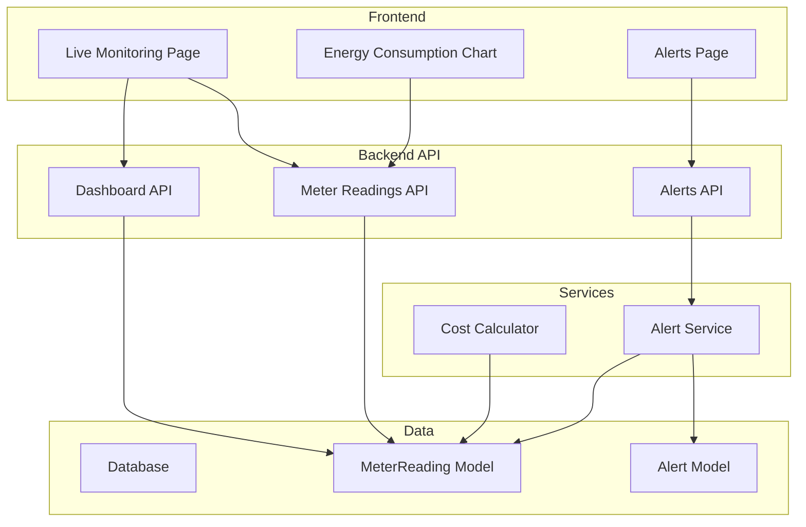
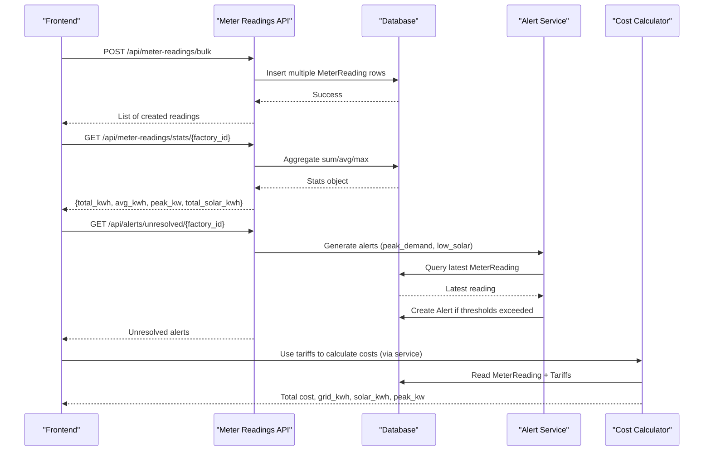
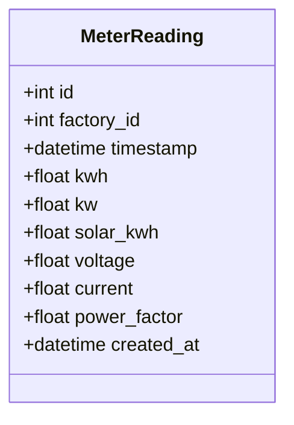
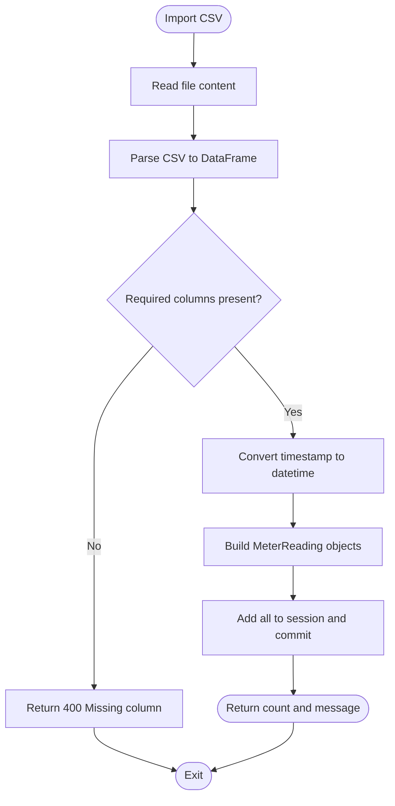
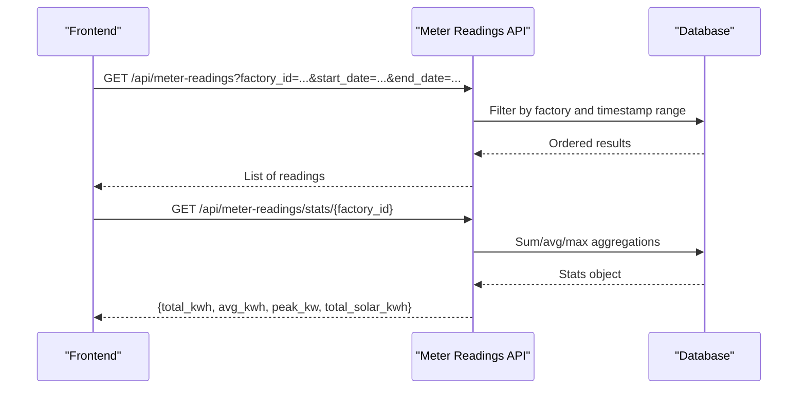
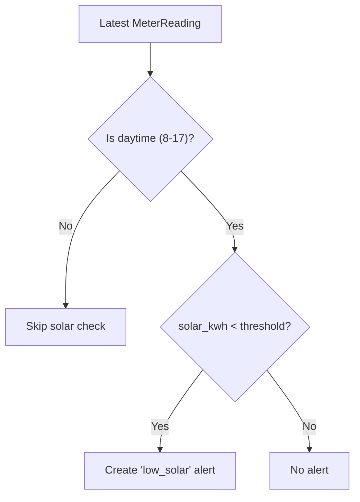
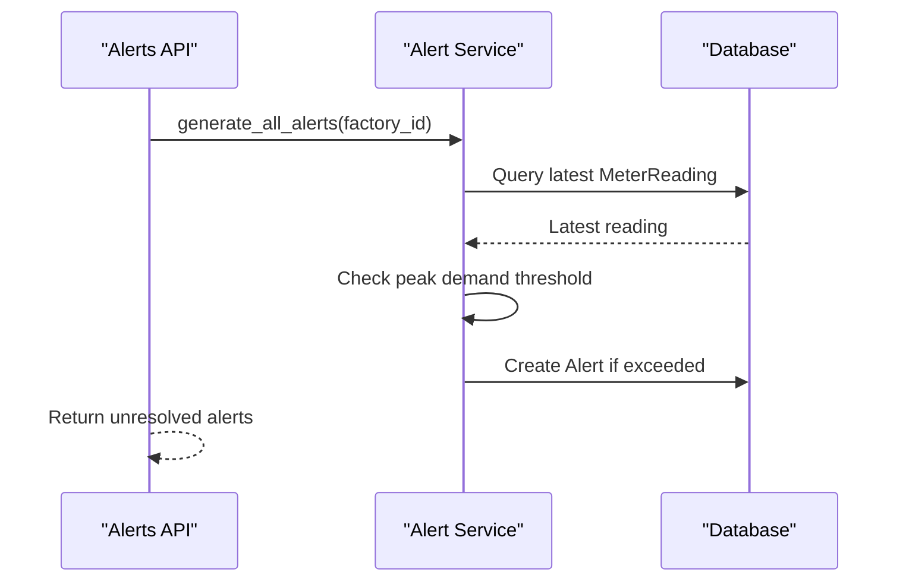
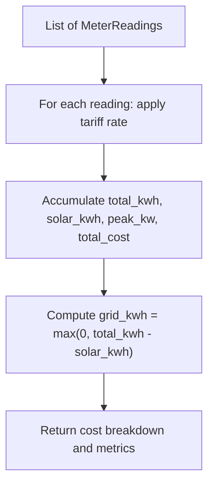
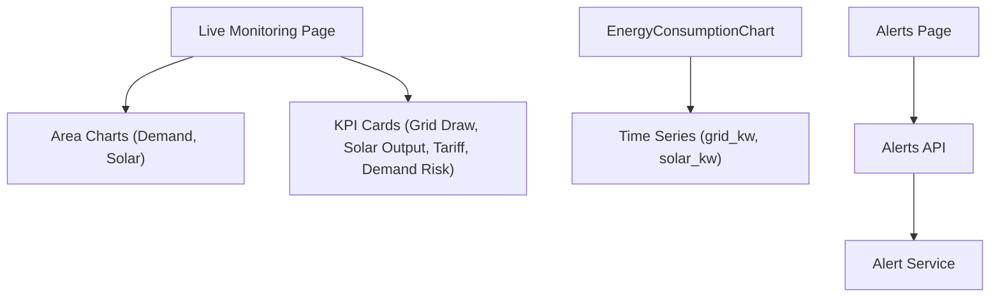
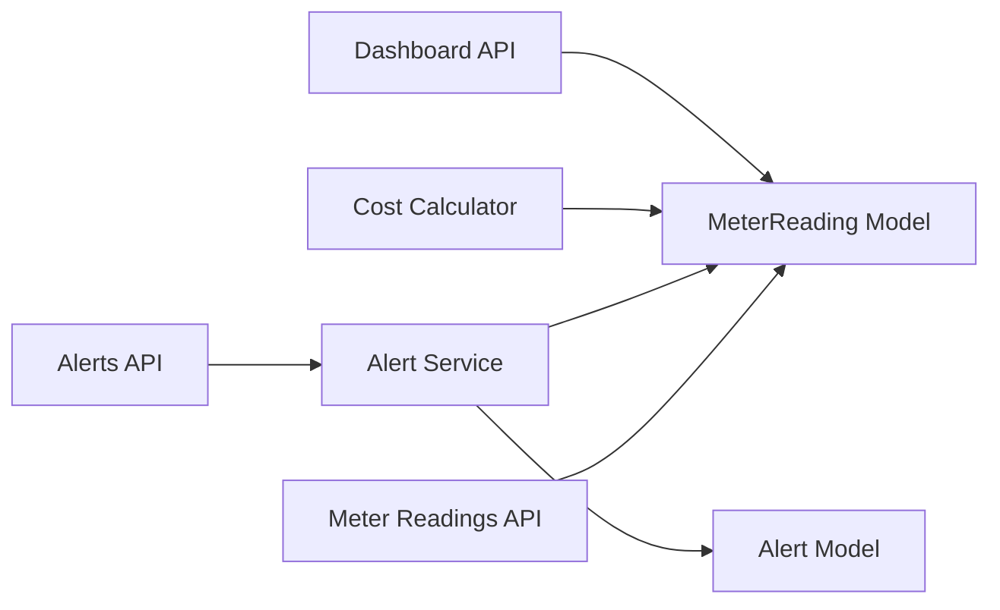

# Energy Monitoring

<cite>
**Referenced Files in This Document**
- [meter_reading.py](file://backend/app/api/meter_reading.py)
- [meter_reading_model.py](file://backend/app/models/meter_reading.py)
- [meter_reading_schema.py](file://backend/app/schemas/meter_reading.py)
- [alert_api.py](file://backend/app/api/alert.py)
- [alert_service.py](file://backend/app/services/alert_service.py)
- [cost_calculator.py](file://backend/app/services/cost_calculator.py)
- [dashboard_api.py](file://backend/app/api/dashboard.py)
- [live_monitoring_page.tsx](file://frontend/app/dashboard/live_monitoring/page.tsx)
- [energy_consumption_chart.tsx](file://frontend/components/charts/energy_consumption_chart.tsx)
- [alerts_page.tsx](file://frontend/app/dashboard/alerts/page.tsx)
- [types_index.ts](file://frontend/types/index.ts)
</cite>

## Table of Contents
1. Introduction
2. Project Structure
3. Core Components
4. Architecture Overview
5. Detailed Component Analysis
6. Dependency Analysis
7. Performance Considerations
8. Troubleshooting Guide
9. Conclusion
10. Appendices

## Introduction
This document explains the Energy Monitoring capabilities in TariffGuard, focusing on real-time consumption tracking, meter reading collection and aggregation, consumption pattern analysis, solar generation monitoring, net energy calculation, and integration with alerts and dashboards. It also covers the data model for meter readings, the complete API surface for meter reading operations, and practical workflows for setup, analysis, alert configuration, and cost optimization.

## Project Structure
Energy Monitoring spans backend APIs, models, services, and frontend dashboards:
- Backend API endpoints provide CRUD and bulk import for meter readings, statistics, and dashboard summaries.
- Data model defines timestamps, consumption values (kWh), instantaneous power (kW), solar generation (kWh), and electrical parameters (voltage, current, power factor).
- Services compute costs using tariff periods and generate proactive alerts for peak demand and low solar generation.
- Frontend pages visualize live demand, solar generation, and alerts; charts render grid vs solar usage.

**Diagram sources**
- [meter_reading.py:1-141](file://backend/app/api/meter_reading.py#L1-L141)
- [dashboard_api.py:1-79](file://backend/app/api/dashboard.py#L1-L79)
- [alert_api.py:1-107](file://backend/app/api/alert.py#L1-L107)
- [alert_service.py:1-140](file://backend/app/services/alert_service.py#L1-L140)
- [cost_calculator.py:1-110](file://backend/app/services/cost_calculator.py#L1-L110)
- [meter_reading_model.py:1-17](file://backend/app/models/meter_reading.py#L1-L17)
- [alert_api.py:1-107](file://backend/app/api/alert.py#L1-L107)

**Section sources**
- [meter_reading.py:1-141](file://backend/app/api/meter_reading.py#L1-L141)
- [dashboard_api.py:1-79](file://backend/app/api/dashboard.py#L1-L79)
- [alert_api.py:1-107](file://backend/app/api/alert.py#L1-L107)
- [alert_service.py:1-140](file://backend/app/services/alert_service.py#L1-L140)
- [cost_calculator.py:1-110](file://backend/app/services/cost_calculator.py#L1-L110)
- [meter_reading_model.py:1-17](file://backend/app/models/meter_reading.py#L1-L17)
- [live_monitoring_page.tsx:1-197](file://frontend/app/dashboard/live_monitoring/page.tsx#L1-L197)
- [energy_consumption_chart.tsx:1-65](file://frontend/components/charts/energy_consumption_chart.tsx#L1-L65)
- [alerts_page.tsx:1-314](file://frontend/app/dashboard/alerts/page.tsx#L1-L314)

## Core Components
- Meter Reading API: Create single or bulk readings, import CSV, list with filters, and fetch statistics per factory.
- Data Model: Stores timestamped consumption (kWh), instantaneous power (kW), solar generation (kWh), and optional electrical metrics.
- Cost Calculator: Applies tariff rates to consumption to compute slot-wise and total costs, tracks peak kW and solar contribution.
- Alert Service: Generates alerts for peak demand and low solar generation based on latest meter readings and thresholds.
- Dashboard API: Aggregates counts and energy stats for factory dashboards.
- Frontend Visualizations: Live monitoring page shows grid draw, solar output, tariff status, and demand trends; chart component renders grid vs solar over time; alerts page displays active alerts and anomaly insights.

**Section sources**
- [meter_reading.py:14-141](file://backend/app/api/meter_reading.py#L14-L141)
- [meter_reading_model.py:5-17](file://backend/app/models/meter_reading.py#L5-L17)
- [cost_calculator.py:15-110](file://backend/app/services/cost_calculator.py#L15-L110)
- [alert_service.py:19-140](file://backend/app/services/alert_service.py#L19-L140)
- [dashboard_api.py:15-79](file://backend/app/api/dashboard.py#L15-L79)
- [live_monitoring_page.tsx:34-197](file://frontend/app/dashboard/live_monitoring/page.tsx#L34-L197)
- [energy_consumption_chart.tsx:5-65](file://frontend/components/charts/energy_consumption_chart.tsx#L5-L65)
- [alerts_page.tsx:25-314](file://frontend/app/dashboard/alerts/page.tsx#L25-L314)

## Architecture Overview
The system collects meter readings into a relational database, exposes them via REST APIs, and powers dashboards and alerting. Real-time consumption is visualized through area charts; solar generation is tracked alongside grid usage to compute net energy. Alerts are generated by analyzing the latest readings against thresholds and can be managed from the UI.

**Diagram sources**
- [meter_reading.py:23-141](file://backend/app/api/meter_reading.py#L23-L141)
- [alert_api.py:35-57](file://backend/app/api/alert.py#L35-L57)
- [alert_service.py:19-140](file://backend/app/services/alert_service.py#L19-L140)
- [cost_calculator.py:52-110](file://backend/app/services/cost_calculator.py#L52-L110)

## Detailed Component Analysis

### Meter Reading Data Model
The MeterReading entity stores:
- Timestamps for each measurement
- Consumption in kWh
- Instantaneous power in kW
- Solar generation in kWh
- Optional voltage, current, and power factor
- Creation timestamp

This model supports both granular monitoring and aggregated analytics.

**Diagram sources**
- [meter_reading_model.py:5-17](file://backend/app/models/meter_reading.py#L5-L17)

**Section sources**
- [meter_reading_model.py:5-17](file://backend/app/models/meter_reading.py#L5-L17)

### Meter Reading API Surface
Endpoints:
- POST /api/meter-readings/: create a single reading
- POST /api/meter-readings/bulk: create multiple readings at once
- POST /api/meter-readings/import-csv: import readings from CSV with required columns timestamp and kwh; optional kw, solar_kwh, voltage, current, power_factor
- GET /api/meter-readings/: list readings with optional filters (factory_id, start_date, end_date), pagination skip/limit
- GET /api/meter-readings/stats/{factory_id}: aggregate stats including total_kwh, avg_kwh, peak_kw, total_solar_kwh

These endpoints support ingestion, querying, and summarization for dashboards and analysis.

**Section sources**
- [meter_reading.py:14-141](file://backend/app/api/meter_reading.py#L14-L141)

### Data Ingestion and CSV Import
CSV import validates required columns and converts timestamps, then persists rows with optional fields. Errors trigger rollback and HTTP error responses. Bulk creation allows efficient batch uploads.

**Diagram sources**
- [meter_reading.py:41-88](file://backend/app/api/meter_reading.py#L41-L88)

**Section sources**
- [meter_reading.py:41-88](file://backend/app/api/meter_reading.py#L41-L88)

### Consumption Pattern Analysis and Aggregation
- Listing endpoint supports filtering by factory and date range, enabling trend analysis across time windows.
- Stats endpoint provides totals, averages, peak power, and solar totals for quick KPIs.
- Dashboard API aggregates energy stats per factory for summary views.

**Diagram sources**
- [meter_reading.py:90-141](file://backend/app/api/meter_reading.py#L90-L141)
- [dashboard_api.py:44-79](file://backend/app/api/dashboard.py#L44-L79)

**Section sources**
- [meter_reading.py:90-141](file://backend/app/api/meter_reading.py#L90-L141)
- [dashboard_api.py:44-79](file://backend/app/api/dashboard.py#L44-L79)

### Solar Generation Monitoring and Net Energy Calculation
- Meter readings include solar_kwh to track renewable generation alongside total consumption.
- Cost calculator computes grid_kwh as total_kwh minus solar_kwh, enabling net energy accounting.
- Alert service checks solar generation during daytime hours and raises warnings when below expected thresholds.

**Diagram sources**
- [alert_service.py:93-122](file://backend/app/services/alert_service.py#L93-L122)
- [cost_calculator.py:52-90](file://backend/app/services/cost_calculator.py#L52-L90)

**Section sources**
- [alert_service.py:93-122](file://backend/app/services/alert_service.py#L93-L122)
- [cost_calculator.py:52-90](file://backend/app/services/cost_calculator.py#L52-L90)

### Peak Demand Detection and Alerts
- Alert service monitors the latest kW value and compares it to a threshold to detect peak demand.
- If exceeded, a critical or warning alert is created depending on severity multiplier.
- The alerts API exposes unresolved alerts and statistics for the UI.

**Diagram sources**
- [alert_api.py:35-57](file://backend/app/api/alert.py#L35-L57)
- [alert_service.py:19-50](file://backend/app/services/alert_service.py#L19-L50)

**Section sources**
- [alert_api.py:35-57](file://backend/app/api/alert.py#L35-L57)
- [alert_service.py:19-50](file://backend/app/services/alert_service.py#L19-L50)

### Cost Calculation and Optimization Insights
- Cost calculator applies tariff periods to each reading to compute slot-wise costs and totals.
- Tracks peak kW and solar contribution; derives grid consumption for accurate billing insights.
- Enables strategies like shifting loads to off-peak hours and leveraging solar generation.

**Diagram sources**
- [cost_calculator.py:15-110](file://backend/app/services/cost_calculator.py#L15-L110)

**Section sources**
- [cost_calculator.py:15-110](file://backend/app/services/cost_calculator.py#L15-L110)

### Dashboard Integration and Visualization
- Live Monitoring page displays current grid draw, solar output, tariff period, and demand risk; includes area charts for demand and solar generation.
- EnergyConsumptionChart component renders grid vs solar usage over time for detailed analysis.
- Alerts page integrates with alerts API to show unresolved alerts, severity, and actions to dismiss or mark all read.

**Diagram sources**
- [live_monitoring_page.tsx:34-197](file://frontend/app/dashboard/live_monitoring/page.tsx#L34-L197)
- [energy_consumption_chart.tsx:5-65](file://frontend/components/charts/energy_consumption_chart.tsx#L5-L65)
- [alerts_page.tsx:25-314](file://frontend/app/dashboard/alerts/page.tsx#L25-L314)
- [alert_api.py:14-57](file://backend/app/api/alert.py#L14-L57)

**Section sources**
- [live_monitoring_page.tsx:34-197](file://frontend/app/dashboard/live_monitoring/page.tsx#L34-L197)
- [energy_consumption_chart.tsx:5-65](file://frontend/components/charts/energy_consumption_chart.tsx#L5-L65)
- [alerts_page.tsx:25-314](file://frontend/app/dashboard/alerts/page.tsx#L25-L314)

## Dependency Analysis
- Meter Reading API depends on the MeterReading model and SQLAlchemy session.
- Alert Service depends on MeterReading and Alert models to evaluate thresholds and persist alerts.
- Cost Calculator depends on MeterReading and Tariff models to compute costs.
- Dashboard API aggregates counts and energy stats from Factory, Machine, ProductionOrder, Tariff, and MeterReading models.
- Frontend components consume APIs for live data and alerts.

**Diagram sources**
- [meter_reading.py:1-141](file://backend/app/api/meter_reading.py#L1-L141)
- [alert_api.py:1-107](file://backend/app/api/alert.py#L1-L107)
- [alert_service.py:1-140](file://backend/app/services/alert_service.py#L1-L140)
- [cost_calculator.py:1-110](file://backend/app/services/cost_calculator.py#L1-L110)
- [dashboard_api.py:1-79](file://backend/app/api/dashboard.py#L1-L79)
- [meter_reading_model.py:1-17](file://backend/app/models/meter_reading.py#L1-L17)

**Section sources**
- [meter_reading.py:1-141](file://backend/app/api/meter_reading.py#L1-L141)
- [alert_api.py:1-107](file://backend/app/api/alert.py#L1-L107)
- [alert_service.py:1-140](file://backend/app/services/alert_service.py#L1-L140)
- [cost_calculator.py:1-110](file://backend/app/services/cost_calculator.py#L1-L110)
- [dashboard_api.py:1-79](file://backend/app/api/dashboard.py#L1-L79)
- [meter_reading_model.py:1-17](file://backend/app/models/meter_reading.py#L1-L17)

## Performance Considerations
- Use bulk endpoints for high-volume ingestion to reduce round trips.
- Apply date-range filters and pagination when listing readings to limit payload size.
- Leverage server-side aggregations (stats endpoint) for KPIs instead of client-side computation.
- Ensure indexes on timestamp and factory_id for faster queries (recommendation beyond current code).
- For CSV imports, validate schemas early to avoid large rollbacks.

[No sources needed since this section provides general guidance]

## Troubleshooting Guide
Common issues and resolutions:
- CSV import failures: ensure required columns timestamp and kwh exist; verify timestamp format; errors trigger rollback and return HTTP 500 with details.
- No readings returned: confirm factory_id filter and date range; check ordering by timestamp descending.
- Alerts not generating: verify latest readings have kw or solar_kwh populated; ensure thresholds are set appropriately; check daytime window for solar checks.
- Dashboard stats missing: confirm readings exist for the factory; handle empty stats gracefully.

Operational tips:
- Use the alerts API to retrieve unresolved alerts and update their resolved status.
- Monitor peak demand via stats and alert thresholds; adjust scheduling to avoid spikes.
- Track solar contribution to identify underperformance and schedule maintenance.

**Section sources**
- [meter_reading.py:41-88](file://backend/app/api/meter_reading.py#L41-L88)
- [meter_reading.py:90-141](file://backend/app/api/meter_reading.py#L90-L141)
- [alert_api.py:35-80](file://backend/app/api/alert.py#L35-L80)
- [alert_service.py:19-140](file://backend/app/services/alert_service.py#L19-L140)

## Conclusion
TariffGuard’s Energy Monitoring provides robust ingestion, visualization, and alerting for industrial energy management. By capturing timestamped consumption and solar generation, computing net energy and costs, and proactively alerting on peak demand and low solar performance, it enables actionable insights for efficiency improvements and cost optimization. The modular architecture separates concerns between APIs, services, and models, while the frontend delivers intuitive dashboards and charts for operators.

[No sources needed since this section summarizes without analyzing specific files]

## Appendices

### Practical Setup Examples
- Ingesting meter readings:
  - Use bulk endpoint to upload multiple readings efficiently.
  - Alternatively, import CSV with required columns timestamp and kwh; optional fields include kw, solar_kwh, voltage, current, power_factor.
- Analyzing consumption patterns:
  - Query readings with factory_id and date filters to build time series.
  - Use stats endpoint to obtain total_kwh, avg_kwh, peak_kw, total_solar_kwh for KPIs.
- Configuring alerts:
  - Trigger alert generation for a factory; review unresolved alerts and mark them resolved after action.
  - Adjust thresholds in alert service logic to match operational constraints.

**Section sources**
- [meter_reading.py:23-88](file://backend/app/api/meter_reading.py#L23-L88)
- [meter_reading.py:90-141](file://backend/app/api/meter_reading.py#L90-L141)
- [alert_api.py:35-80](file://backend/app/api/alert.py#L35-L80)
- [alert_service.py:19-140](file://backend/app/services/alert_service.py#L19-L140)

### Common Scenarios and Strategies
- Peak demand detection:
  - Monitor latest kW values; configure thresholds to trigger warnings or critical alerts.
  - Shift non-critical loads to off-peak periods to reduce penalties.
- Energy waste identification:
  - Compare actual vs forecast solar generation; investigate drops during daytime.
  - Analyze anomalies in consumption trends to locate inefficiencies.
- Efficiency improvement strategies:
  - Utilize solar windows for high-power processes.
  - Optimize machine schedules to minimize simultaneous high-demand starts.
  - Improve power factor to avoid penalties.

**Section sources**
- [alert_service.py:19-140](file://backend/app/services/alert_service.py#L19-L140)
- [cost_calculator.py:15-110](file://backend/app/services/cost_calculator.py#L15-L110)
- [alerts_page.tsx:243-290](file://frontend/app/dashboard/alerts/page.tsx#L243-L290)