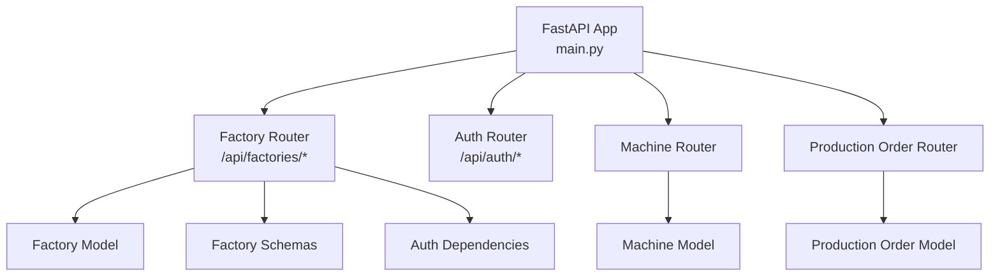
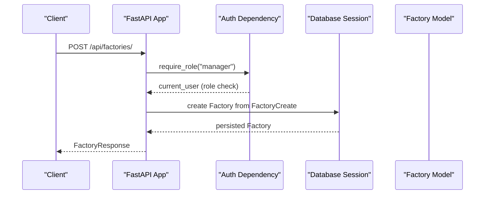
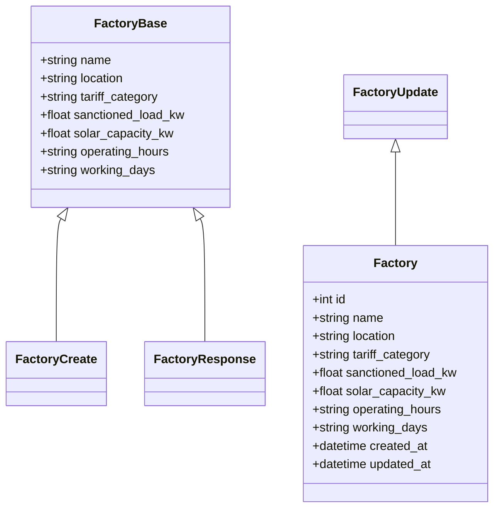
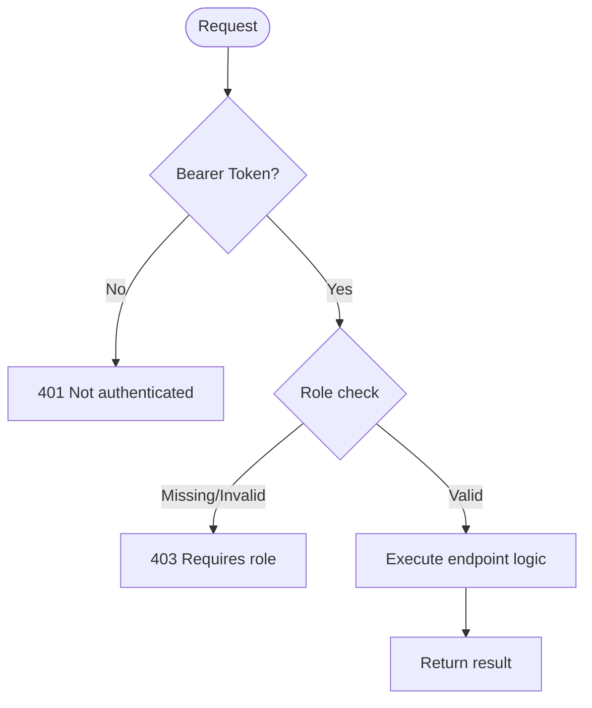
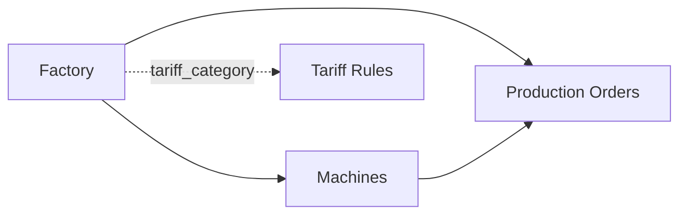
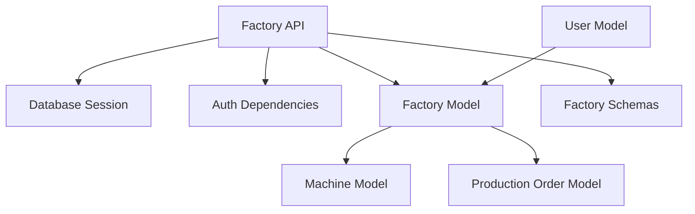

# Factory Management

<cite>
**Referenced Files in This Document**
- [main.py](file://backend/main.py)
- [factory.py](file://backend/app/api/factory.py)
- [auth.py](file://backend/app/api/auth.py)
- [factory_model.py](file://backend/app/models/factory.py)
- [factory_schema.py](file://backend/app/schemas/factory.py)
- [machine_model.py](file://backend/app/models/machine.py)
- [production_order_model.py](file://backend/app/models/production_order.py)
- [user_model.py](file://backend/app/models/user.py)
- [user_schema.py](file://backend/app/schemas/user.py)
- [factory_setup_form.tsx](file://frontend/components/forms/factory_setup_form.tsx)
</cite>

## Table of Contents
1. [Introduction](#introduction)
2. [Project Structure](#project-structure)
3. [Core Components](#core-components)
4. [Architecture Overview](#architecture-overview)
5. [Detailed Component Analysis](#detailed-component-analysis)
6. [Dependency Analysis](#dependency-analysis)
7. [Performance Considerations](#performance-considerations)
8. [Troubleshooting Guide](#troubleshooting-guide)
9. [Conclusion](#conclusion)
10. [Appendices](#appendices)

## Introduction
This document explains the Factory Management feature in TariffGuard, focusing on factory registration and configuration, location-based tariff categorization, capacity planning, resource allocation, and complete CRUD operations via REST endpoints. It also covers authentication and authorization requirements, practical setup workflows, integration with machines and production orders, and troubleshooting guidance for common scenarios such as multi-factory setups and capacity planning.

## Project Structure
The backend exposes a FastAPI application that registers routers for factories, machines, production orders, tariffs, meter readings, dashboard, optimization, auth, users, and alerts. The factory router provides endpoints under /api/factories/. Models define database tables, schemas define request/response contracts, and auth utilities enforce role-based access control.

**Diagram sources**
- [main.py:8-58](file://backend/main.py#L8-L58)
- [factory.py:11-81](file://backend/app/api/factory.py#L11-L81)
- [auth.py:63-89](file://backend/app/api/auth.py#L63-L89)
- [factory_model.py:5-17](file://backend/app/models/factory.py#L5-L17)
- [factory_schema.py:5-31](file://backend/app/schemas/factory.py#L5-L31)
- [machine_model.py:5-20](file://backend/app/models/machine.py#L5-L20)
- [production_order_model.py:5-20](file://backend/app/models/production_order.py#L5-L20)

**Section sources**
- [main.py:8-58](file://backend/main.py#L8-L58)

## Core Components
- Factory API endpoints (CRUD)
- Factory data model and schema
- Authentication and role-based authorization
- Integration points with machines and production orders

Key responsibilities:
- Create, list, retrieve, update, and delete factories
- Enforce manager/owner roles for write operations
- Provide pagination for listing
- Return consistent response models

**Section sources**
- [factory.py:13-81](file://backend/app/api/factory.py#L13-L81)
- [factory_model.py:5-17](file://backend/app/models/factory.py#L5-L17)
- [factory_schema.py:5-31](file://backend/app/schemas/factory.py#L5-L31)
- [auth.py:63-89](file://backend/app/api/auth.py#L63-L89)

## Architecture Overview
The factory management flow uses FastAPI dependencies to authenticate requests and enforce roles. Endpoints interact with SQLAlchemy models through a database session. Factories are linked to machines and production orders via foreign keys, enabling capacity planning and resource allocation across multiple factories.

**Diagram sources**
- [factory.py:13-24](file://backend/app/api/factory.py#L13-L24)
- [auth.py:83-89](file://backend/app/api/auth.py#L83-L89)
- [factory_model.py:5-17](file://backend/app/models/factory.py#L5-L17)
- [factory_schema.py:14-15](file://backend/app/schemas/factory.py#L14-L15)

## Detailed Component Analysis

### Factory Data Model and Schema
- Fields include name, location, tariff_category, sanctioned_load_kw, solar_capacity_kw, operating_hours, working_days, created_at, updated_at.
- Default values support typical industrial settings and enable quick setup.
- Response schema includes id and timestamps; update schema allows partial updates.

**Diagram sources**
- [factory_model.py:5-17](file://backend/app/models/factory.py#L5-L17)
- [factory_schema.py:5-31](file://backend/app/schemas/factory.py#L5-L31)

**Section sources**
- [factory_model.py:5-17](file://backend/app/models/factory.py#L5-L17)
- [factory_schema.py:5-31](file://backend/app/schemas/factory.py#L5-L31)

### REST API Endpoints and Authorization
- POST /api/factories/: Create factory. Requires manager or owner role.
- GET /api/factories/: List factories with skip/limit pagination. Requires authenticated user.
- GET /api/factories/{id}: Get factory by ID. Requires authenticated user.
- PUT /api/factories/{id}: Update factory fields. Requires manager or owner role.
- DELETE /api/factories/{id}: Delete factory. Requires owner role.

Authorization patterns:
- get_current_user validates bearer token and returns current user.
- require_role enforces specific role checks; owner role is allowed where manager is required.

**Diagram sources**
- [auth.py:63-89](file://backend/app/api/auth.py#L63-L89)
- [factory.py:13-81](file://backend/app/api/factory.py#L13-L81)

**Section sources**
- [factory.py:13-81](file://backend/app/api/factory.py#L13-L81)
- [auth.py:63-89](file://backend/app/api/auth.py#L63-L89)

### Location-Based Tariff Categorization
- Each factory has a tariff_category field used to associate location-specific tariff rules.
- Typical default is Industrial; adjust based on geographic zone or regulatory classification.
- Use this field to group factories and apply localized pricing strategies in downstream services.

Practical usage:
- Group factories by tariff_category for reporting and cost analysis.
- Configure tariff schedules per category to reflect regional energy rates.

**Section sources**
- [factory_model.py:5-17](file://backend/app/models/factory.py#L5-L17)
- [factory_schema.py:5-31](file://backend/app/schemas/factory.py#L5-L31)

### Capacity Planning and Resource Allocation
- sanctioned_load_kw defines maximum electrical load capacity for the factory.
- solar_capacity_kw indicates on-site generation capacity, influencing net consumption and cost optimization.
- operating_hours and working_days constrain when production can run, aligning with tariff periods.

Capacity planning workflow:
- Set sanctioned_load_kw to ensure compliance with utility constraints.
- Add solar_capacity_kw to reduce peak demand charges.
- Align operating_hours with low-tariff windows to minimize costs.

Resource allocation:
- Machines belong to a factory via factory_id, enabling per-factory scheduling.
- Production orders reference factory_id to allocate workloads within capacity limits.

**Diagram sources**
- [machine_model.py:5-20](file://backend/app/models/machine.py#L5-L20)
- [production_order_model.py:5-20](file://backend/app/models/production_order.py#L5-L20)
- [factory_model.py:5-17](file://backend/app/models/factory.py#L5-L17)

**Section sources**
- [machine_model.py:5-20](file://backend/app/models/machine.py#L5-L20)
- [production_order_model.py:5-20](file://backend/app/models/production_order.py#L5-L20)
- [factory_model.py:5-17](file://backend/app/models/factory.py#L5-L17)

### Authentication and User Roles
- Users have roles including viewer, manager, owner.
- Login issues a bearer token stored server-side for the session.
- require_role ensures only authorized roles can perform sensitive operations.

Roles and permissions:
- Manager: create/update factories.
- Owner: delete factories (and implicitly manage all).
- Viewer: read-only access to listed resources.

**Section sources**
- [user_model.py:5-16](file://backend/app/models/user.py#L5-L16)
- [user_schema.py:5-30](file://backend/app/schemas/user.py#L5-L30)
- [auth.py:37-89](file://backend/app/api/auth.py#L37-L89)

### Frontend Integration
- The frontend includes a placeholder component for factory setup forms.
- Integrate with backend endpoints to collect and submit factory configuration.

Integration steps:
- Authenticate via /api/auth/login to obtain bearer token.
- Call POST /api/factories/ with factory payload.
- Display confirmation and allow subsequent edits via PUT.

**Section sources**
- [factory_setup_form.tsx:1-8](file://frontend/components/forms/factory_setup_form.tsx#L1-L8)

## Dependency Analysis
- Factory endpoints depend on:
  - Database session via get_db
  - Auth dependencies for current user and role enforcement
  - Factory model and schemas for persistence and validation
- Factories relate to:
  - Machines (foreign key factory_id)
  - Production orders (foreign key factory_id)
  - Users (optional factory_id association)

**Diagram sources**
- [factory.py:1-81](file://backend/app/api/factory.py#L1-L81)
- [factory_model.py:5-17](file://backend/app/models/factory.py#L5-L17)
- [machine_model.py:5-20](file://backend/app/models/machine.py#L5-L20)
- [production_order_model.py:5-20](file://backend/app/models/production_order.py#L5-L20)
- [user_model.py:5-16](file://backend/app/models/user.py#L5-L16)

**Section sources**
- [factory.py:1-81](file://backend/app/api/factory.py#L1-L81)
- [factory_model.py:5-17](file://backend/app/models/factory.py#L5-L17)
- [machine_model.py:5-20](file://backend/app/models/machine.py#L5-L20)
- [production_order_model.py:5-20](file://backend/app/models/production_order.py#L5-L20)
- [user_model.py:5-16](file://backend/app/models/user.py#L5-L16)

## Performance Considerations
- Pagination: Use skip and limit parameters on GET /api/factories/ to avoid large payloads.
- Indexes: Ensure efficient queries by leveraging primary keys and indexes defined in models.
- Partial updates: Use PUT with optional fields to minimize payload size and processing overhead.
- Connection pooling: Rely on SQLAlchemy session management for efficient DB interactions.

[No sources needed since this section provides general guidance]

## Troubleshooting Guide
Common issues and resolutions:
- 401 Not authenticated: Ensure bearer token is present and valid. Re-login if expired.
- 403 Requires role: Verify user role matches endpoint requirements (manager/owner).
- 404 Factory not found: Confirm factory_id exists before update/delete operations.
- Validation errors: Check payload fields against FactoryCreate/FactoryUpdate schemas.

Operational tips:
- Use health and test endpoints to verify backend status and database connectivity.
- Log token lifecycle and role checks during development to diagnose authorization issues.

**Section sources**
- [auth.py:63-89](file://backend/app/api/auth.py#L63-L89)
- [factory.py:37-81](file://backend/app/api/factory.py#L37-L81)
- [main.py:78-91](file://backend/main.py#L78-L91)

## Conclusion
The Factory Management feature provides robust CRUD operations with clear role-based authorization, supports location-based tariff categorization, and integrates seamlessly with machines and production orders for capacity planning and resource allocation. By configuring sanctioned_load_kw, solar_capacity_kw, operating_hours, and working_days, operators can optimize energy costs and production schedules across single or multi-factory environments.

[No sources needed since this section summarizes without analyzing specific files]

## Appendices

### Practical Setup Workflow
- Register or log in to obtain a bearer token.
- Create a factory with name, location, tariff_category, sanctioned_load_kw, and optional solar_capacity_kw.
- Add machines to the factory and configure their availability windows.
- Create production orders referencing the factory and set deadlines aligned with tariff periods.
- Monitor and adjust operating_hours and working_days to match low-cost energy windows.

**Section sources**
- [factory.py:13-81](file://backend/app/api/factory.py#L13-L81)
- [machine_model.py:5-20](file://backend/app/models/machine.py#L5-L20)
- [production_order_model.py:5-20](file://backend/app/models/production_order.py#L5-L20)

### Multi-Factory Scenarios
- Assign distinct tariff_category values per region to apply localized pricing.
- Use separate factories for different business units or plants.
- Aggregate metrics by factory_id for per-location reporting and optimization.

**Section sources**
- [factory_model.py:5-17](file://backend/app/models/factory.py#L5-L17)
- [machine_model.py:5-20](file://backend/app/models/machine.py#L5-L20)
- [production_order_model.py:5-20](file://backend/app/models/production_order.py#L5-L20)

### Capacity Planning Examples
- Set sanctioned_load_kw to the maximum allowable load per utility contract.
- Add solar_capacity_kw to offset peak demand and reduce costs.
- Schedule high-consumption processes during off-peak hours using operating_hours and working_days.

**Section sources**
- [factory_model.py:5-17](file://backend/app/models/factory.py#L5-L17)