# Features Guide

<cite>
**Referenced Files in This Document**
- [README.md](file://README.md)
- [main.py](file://backend/main.py)
- [config.py](file://backend/app/core/config.py)
- [API.md](file://docs/API.md)
- [FRONTEND_BACKEND_MAPPING.md](file://FRONTEND_BACKEND_MAPPING.md)
- [factory.py](file://backend/app/api/factory.py)
- [machine.py](file://backend/app/api/machine.py)
- [production_order.py](file://backend/app/api/production_order.py)
- [tariff.py](file://backend/app/api/tariff.py)
- [optimization.py](file://backend/app/api/optimization.py)
- [factory_model.py](file://backend/app/models/factory.py)
- [machine_model.py](file://backend/app/models/machine.py)
- [production_order_model.py](file://backend/app/models/production_order.py)
- [tariff_model.py](file://backend/app/models/tariff.py)
- [optimizer_service.py](file://backend/app/services/optimizer.py)
</cite>

## Table of Contents
1. Introduction
2. Project Structure
3. Core Components
4. Architecture Overview
5. Detailed Component Analysis
6. Dependency Analysis
7. Performance Considerations
8. Troubleshooting Guide
9. Conclusion
10. Appendices

## Introduction
TariffGuard is an AI-powered energy and production optimization platform designed for small textile factories. It converts electricity tariffs, production requirements, solar availability, and maximum-demand constraints into actionable production schedules that minimize energy costs while meeting deadlines and respecting machine and operational constraints. The system provides factory and machine management, production order workflows, tariff configuration, schedule optimization, meter reading tracking, alerts, and dashboard analytics.

Key capabilities include:
- Factory and machine registration with capacity and power specifications
- Production order lifecycle with priority handling and deadline tracking
- Time-based tariff management with seasonal adjustments
- Schedule optimization to minimize energy costs under constraints
- Energy monitoring via meter readings and reporting
- Alerting for peak demand and anomalies
- Dashboard KPIs, consumption charts, and cost analysis

**Section sources**
- [README.md:6-49](file://README.md#L6-L49)

## Project Structure
The application follows a layered architecture:
- API layer (FastAPI routers) exposes REST endpoints for each feature area
- Data models define the database schema using SQLAlchemy
- Services encapsulate business logic such as optimization and cost calculation
- Core modules provide configuration, database initialization, and error handling
- Frontend pages map to backend endpoints for dashboards, scheduling, and reports

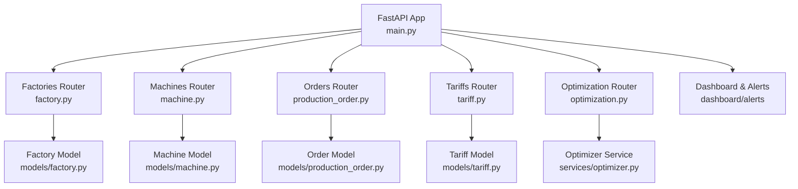

**Diagram sources**
- [main.py:48-58](file://backend/main.py#L48-L58)
- [factory.py:11-81](file://backend/app/api/factory.py#L11-L81)
- [machine.py:11-65](file://backend/app/api/machine.py#L11-L65)
- [production_order.py:11-66](file://backend/app/api/production_order.py#L11-L66)
- [tariff.py:10-90](file://backend/app/api/tariff.py#L10-L90)
- [optimization.py:9-48](file://backend/app/api/optimization.py#L9-L48)
- [factory_model.py:5-17](file://backend/app/models/factory.py#L5-L17)
- [machine_model.py:5-20](file://backend/app/models/machine.py#L5-L20)
- [production_order_model.py:5-20](file://backend/app/models/production_order.py#L5-L20)
- [tariff_model.py:5-19](file://backend/app/models/tariff.py#L5-L19)
- [optimizer_service.py:14-238](file://backend/app/services/optimizer.py#L14-L238)

**Section sources**
- [main.py:19-64](file://backend/main.py#L19-L64)
- [API.md:16-65](file://docs/API.md#L16-L65)
- [FRONTEND_BACKEND_MAPPING.md:8-25](file://FRONTEND_BACKEND_MAPPING.md#L8-L25)

## Core Components
This section summarizes the core features and their responsibilities:
- Factory Management: CRUD operations for factories including location, tariff category, sanctioned load, and solar capacity
- Machine Management: Equipment registration with power specs, availability windows, maintenance windows, and priorities
- Production Orders: Order creation, filtering by status and factory, and deletion; supports earliest start and deadlines
- Tariff Management: Create, update, delete tariffs with time periods, rates, and effective dates; query active tariffs per category
- Optimization: Generate optimized schedules and compare baseline vs optimized outcomes
- Meter Readings: Track consumption and retrieve statistics per factory
- Dashboard: Summary and factory-specific metrics
- Alerts: List, generate, and manage alerts

**Section sources**
- [factory.py:13-81](file://backend/app/api/factory.py#L13-L81)
- [machine.py:13-65](file://backend/app/api/machine.py#L13-L65)
- [production_order.py:13-66](file://backend/app/api/production_order.py#L13-L66)
- [tariff.py:12-90](file://backend/app/api/tariff.py#L12-L90)
- [optimization.py:11-48](file://backend/app/api/optimization.py#L11-L48)
- [API.md:48-65](file://docs/API.md#L48-L65)

## Architecture Overview
The system uses FastAPI routers to expose domain APIs, backed by SQLAlchemy models and services. Configuration is centralized, and startup initializes the database. CORS is enabled for frontend integration.

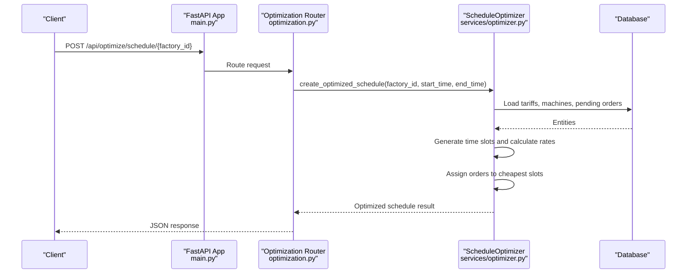

**Diagram sources**
- [main.py:48-58](file://backend/main.py#L48-L58)
- [optimization.py:11-29](file://backend/app/api/optimization.py#L11-L29)
- [optimizer_service.py:97-190](file://backend/app/services/optimizer.py#L97-L190)

**Section sources**
- [main.py:19-64](file://backend/main.py#L19-L64)
- [config.py:4-21](file://backend/app/core/config.py#L4-L21)

## Detailed Component Analysis

### Factory Management
- Registration: Create factories with name, location, tariff category, sanctioned load, solar capacity, operating hours, and working days
- Configuration: Update factory details; read single or list all factories
- Capacity Planning: Sanctioned load and solar capacity inform constraint checks during scheduling
- Access Control: Creation and updates require manager role; deletion requires owner role

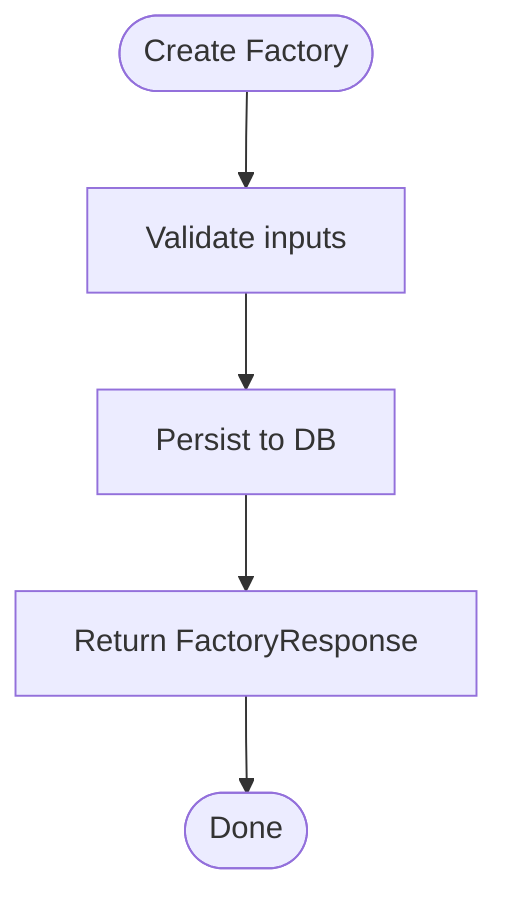

**Diagram sources**
- [factory.py:13-24](file://backend/app/api/factory.py#L13-L24)
- [factory_model.py:5-17](file://backend/app/models/factory.py#L5-L17)

**Section sources**
- [factory.py:13-81](file://backend/app/api/factory.py#L13-L81)
- [factory_model.py:5-17](file://backend/app/models/factory.py#L5-L17)

### Machine Management
- Equipment Registration: Register machines with type, power kW, min run minutes, setup time, shiftable flag, priority, availability windows, and maintenance windows
- Power Specifications: Power kW drives energy cost calculations in optimization
- Maintenance Tracking: Maintenance windows stored as JSON to constrain scheduling
- Querying: Filter by factory, list, get by ID, delete

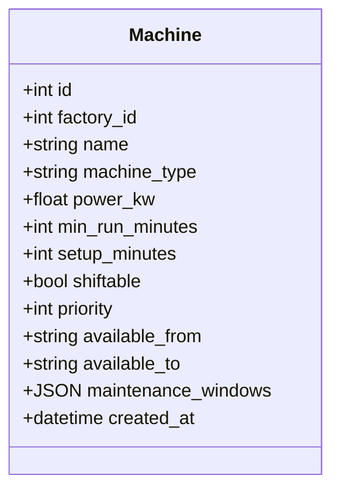

**Diagram sources**
- [machine_model.py:5-20](file://backend/app/models/machine.py#L5-L20)

**Section sources**
- [machine.py:13-65](file://backend/app/api/machine.py#L13-L65)
- [machine_model.py:5-20](file://backend/app/models/machine.py#L5-L20)

### Production Order Management
- Workflow Automation: Create orders with process, quantity, duration, earliest start, deadline, priority, and optional machine options; filter by factory and status
- Priority Handling: Orders carry priority values used in scheduling decisions
- Deadline Tracking: Deadlines ensure timely completion; earliest start allows flexible scheduling
- Deletion: Remove orders when necessary

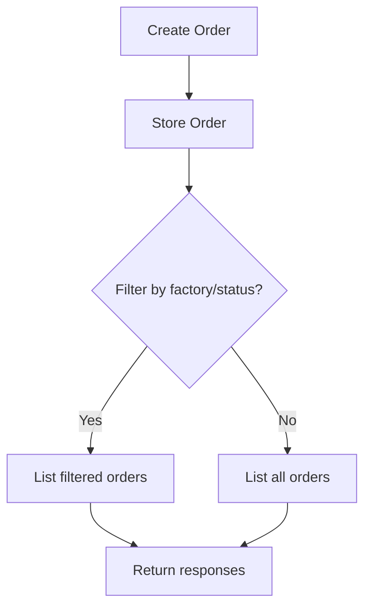

**Diagram sources**
- [production_order.py:13-39](file://backend/app/api/production_order.py#L13-L39)
- [production_order_model.py:5-20](file://backend/app/models/production_order.py#L5-L20)

**Section sources**
- [production_order.py:13-66](file://backend/app/api/production_order.py#L13-L66)
- [production_order_model.py:5-20](file://backend/app/models/production_order.py#L5-L20)

### Tariff Management
- Time-Based Pricing: Define periods with start/end times, rate per kWh, fixed charge per kW, and effective date ranges
- Rate Plan Management: Create, update, delete tariffs; list with filters for category and active-only
- Seasonal Adjustments: Use effective_from and effective_to to manage seasonal rate changes
- Active Tariff Lookup: Retrieve currently active tariff by category

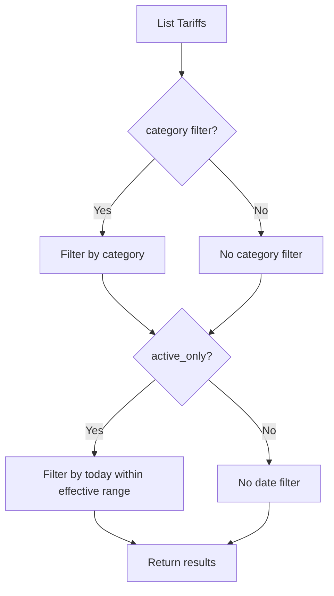

**Diagram sources**
- [tariff.py:21-42](file://backend/app/api/tariff.py#L21-L42)
- [tariff_model.py:5-19](file://backend/app/models/tariff.py#L5-L19)

**Section sources**
- [tariff.py:12-90](file://backend/app/api/tariff.py#L12-L90)
- [tariff_model.py:5-19](file://backend/app/models/tariff.py#L5-L19)

### Schedule Optimization
- AI-Powered Algorithms: The optimizer selects cheapest consecutive time slots for each order based on tariff rates
- Cost Minimization Strategies: Sorts slots by rate, avoids locked slots, assigns suitable machines by process type
- Constraint Satisfaction: Respects machine availability, maintenance windows, order durations, and deadlines
- Comparison Tool: Compare baseline (assumed peak rate) vs optimized schedule to quantify savings

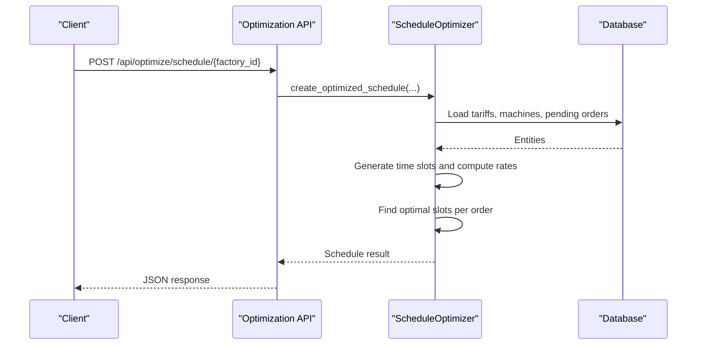

**Diagram sources**
- [optimization.py:11-29](file://backend/app/api/optimization.py#L11-L29)
- [optimizer_service.py:97-190](file://backend/app/services/optimizer.py#L97-L190)

**Section sources**
- [optimization.py:11-48](file://backend/app/api/optimization.py#L11-L48)
- [optimizer_service.py:21-238](file://backend/app/services/optimizer.py#L21-L238)

### Energy Monitoring
- Real-Time Consumption Tracking: Submit meter readings and retrieve lists
- Solar Generation Monitoring: Factory model includes solar capacity field to support solar-aware planning
- Peak Demand Management: Alerts and dashboard can highlight peak usage; sanitizer load informs constraints

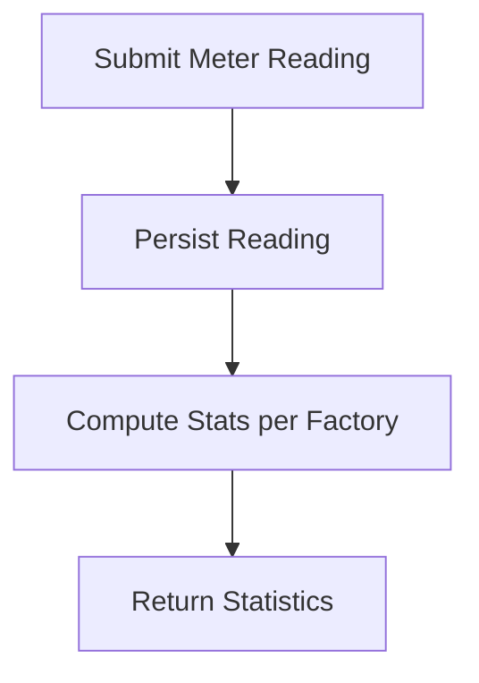

**Diagram sources**
- [API.md:48-53](file://docs/API.md#L48-L53)
- [factory_model.py:5-17](file://backend/app/models/factory.py#L5-L17)

**Section sources**
- [API.md:48-53](file://docs/API.md#L48-L53)
- [factory_model.py:5-17](file://backend/app/models/factory.py#L5-L17)

### Alert System
- Proactive Notifications: Generate alerts for a factory; list and manage alerts
- Anomaly Detection: Identify unusual patterns or threshold breaches (e.g., peak demand)
- Unresolved Alerts: Retrieve unresolved alerts per factory for remediation

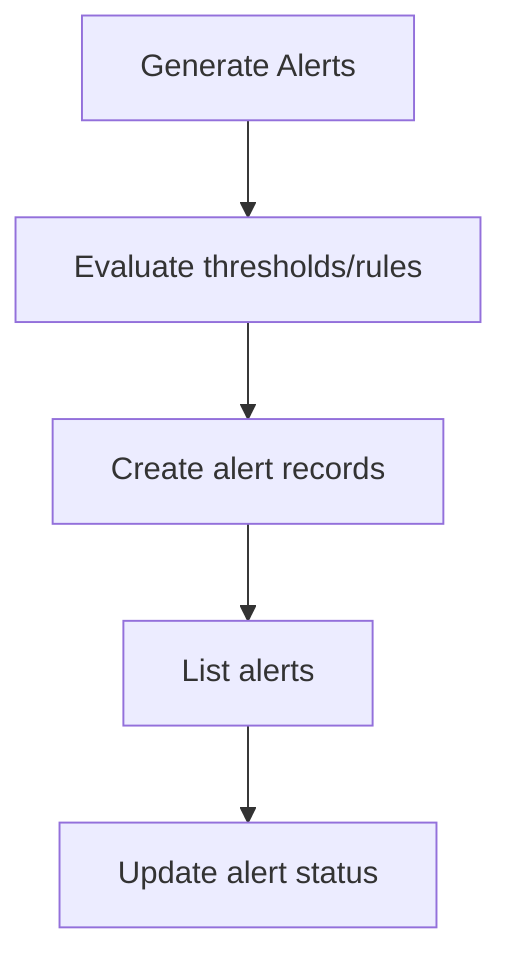

**Diagram sources**
- [API.md:161-169](file://docs/API.md#L161-L169)

**Section sources**
- [API.md:161-169](file://docs/API.md#L161-L169)

### Dashboard Analytics
- KPI Visualization: Overall summary and factory-specific dashboards
- Energy Consumption Charts: Time-series data from meter readings
- Cost Analysis Reports: Aggregated stats and comparisons between baseline and optimized schedules

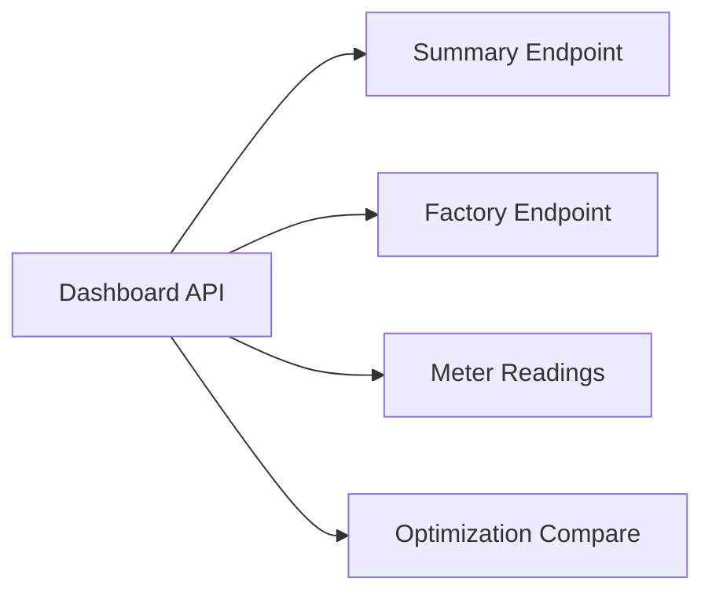

**Diagram sources**
- [API.md:55-65](file://docs/API.md#L55-L65)

**Section sources**
- [API.md:55-65](file://docs/API.md#L55-L65)

## Dependency Analysis
- API routers depend on models for persistence and services for business logic
- The optimization router depends on the optimizer service, which queries tariffs, machines, and orders
- Configuration centralizes environment variables and database URL
- Frontend pages map to backend endpoints; some features rely on mock data until fully implemented

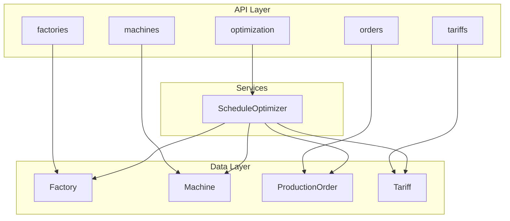

**Diagram sources**
- [factory.py:11-81](file://backend/app/api/factory.py#L11-L81)
- [machine.py:11-65](file://backend/app/api/machine.py#L11-L65)
- [production_order.py:11-66](file://backend/app/api/production_order.py#L11-L66)
- [tariff.py:10-90](file://backend/app/api/tariff.py#L10-L90)
- [optimization.py:9-48](file://backend/app/api/optimization.py#L9-L48)
- [optimizer_service.py:21-34](file://backend/app/services/optimizer.py#L21-L34)

**Section sources**
- [FRONTEND_BACKEND_MAPPING.md:8-25](file://FRONTEND_BACKEND_MAPPING.md#L8-L25)

## Performance Considerations
- Pagination: List endpoints support skip and limit parameters to control payload size
- Query Filtering: Use factory_id and status filters to reduce dataset size
- Slot Granularity: Optimization generates hourly slots by default; adjust interval if needed
- Database Indexes: Ensure indexes on foreign keys and frequently filtered columns (e.g., factory_id, status)
- Caching: Consider caching active tariffs and slot rates for repeated optimization calls

[No sources needed since this section provides general guidance]

## Troubleshooting Guide
- Validation Errors: Request validation errors return structured JSON with status and message
- Database Errors: SQLAlchemy exceptions are handled centrally to return consistent error responses
- Missing Resources: 404 responses indicate not found entities (e.g., factory, machine, order, tariff)
- Authentication: Some endpoints require roles; ensure proper user context when calling protected routes
- Frontend Mocks: Certain frontend features rely on mock data until backend endpoints are fully implemented

**Section sources**
- [main.py:25-38](file://backend/main.py#L25-L38)
- [factory.py:44-47](file://backend/app/api/factory.py#L44-L47)
- [machine.py:46-50](file://backend/app/api/machine.py#L46-L50)
- [production_order.py:47-51](file://backend/app/api/production_order.py#L47-L51)
- [tariff.py:47-50](file://backend/app/api/tariff.py#L47-L50)
- [API.md:76-80](file://docs/API.md#L76-L80)
- [FRONTEND_BACKEND_MAPPING.md:29-42](file://FRONTEND_BACKEND_MAPPING.md#L29-L42)

## Conclusion
TariffGuard integrates factory and machine management, production order workflows, tariff configuration, and schedule optimization to minimize energy costs while honoring operational constraints. The modular architecture enables clear separation of concerns, robust error handling, and extensibility for future enhancements such as advanced forecasting and real-time monitoring integrations.

[No sources needed since this section summarizes without analyzing specific files]

## Appendices

### User Workflows
- Factory Setup: Create factory, configure tariff category and capacities, then register machines
- Machine Onboarding: Add machines with power specs and maintenance windows; verify availability
- Order Entry: Create orders with deadlines and priorities; assign machine options if needed
- Tariff Configuration: Define time-based rates and effective periods; verify active tariffs
- Schedule Optimization: Run optimizer to generate cost-effective schedules; compare baseline vs optimized
- Monitoring and Alerts: Submit meter readings; review alerts and resolve issues

[No sources needed since this section provides general guidance]

### Configuration Examples
- Environment Variables: DATABASE_URL, ENVIRONMENT, DEBUG, and optional cloud keys
- Startup: Initialize database on app startup; serve static dashboard

**Section sources**
- [config.py:4-21](file://backend/app/core/config.py#L4-L21)
- [main.py:66-69](file://backend/main.py#L66-L69)

### API Quick Reference
- Factories: CRUD endpoints for factory management
- Machines: CRUD endpoints for equipment management
- Orders: CRUD endpoints for production orders
- Tariffs: CRUD and active lookup endpoints
- Optimization: Schedule generation and comparison
- Dashboard: Summary and factory-specific metrics
- Alerts: List, generate, and manage alerts

**Section sources**
- [API.md:16-65](file://docs/API.md#L16-L65)
- [API.md:161-169](file://docs/API.md#L161-L169)