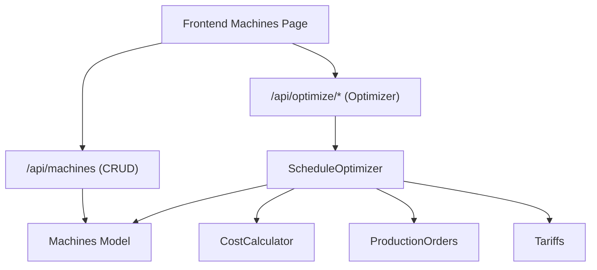
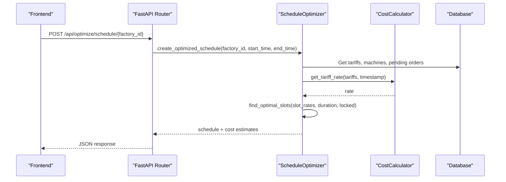
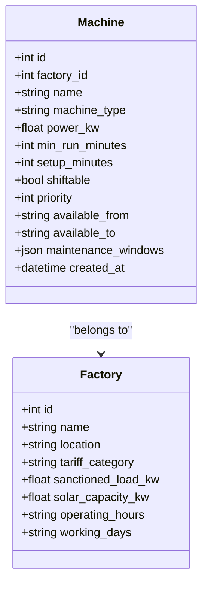
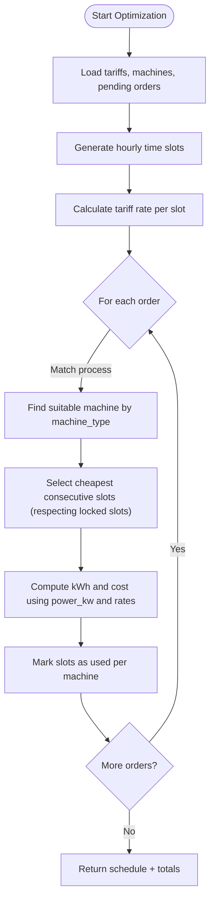
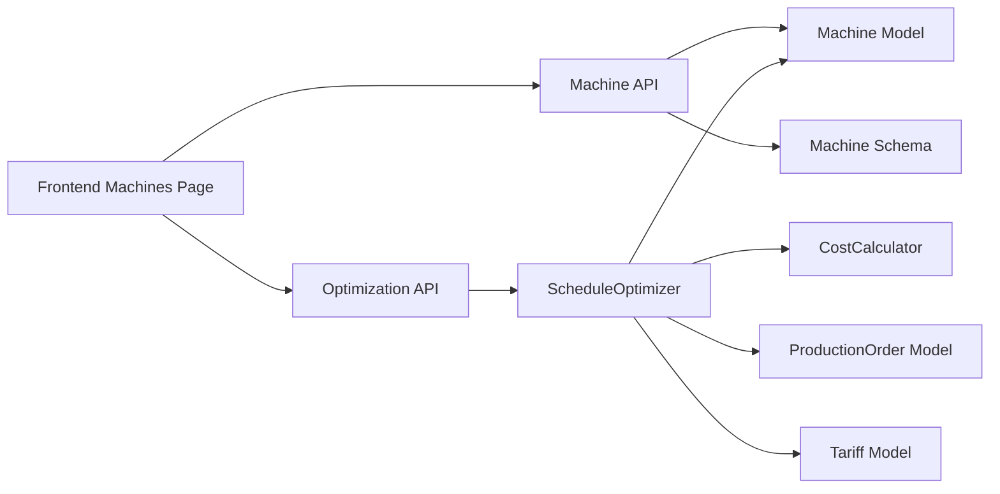

# Machine Management

<cite>
**Referenced Files in This Document**
- [machine.py](file://backend/app/api/machine.py)
- [machine.py](file://backend/app/models/machine.py)
- [machine.py](file://backend/app/schemas/machine.py)
- [optimization.py](file://backend/app/api/optimization.py)
- [optimizer.py](file://backend/app/services/optimizer.py)
- [cost_calculator.py](file://backend/app/services/cost_calculator.py)
- [factory.py](file://backend/app/models/factory.py)
- [production_order.py](file://backend/app/models/production_order.py)
- [tariff.py](file://backend/app/models/tariff.py)
- [page.tsx](file://frontend/app/dashboard/machines/page.tsx)
- [API.md](file://docs/API.md)
</cite>

## Table of Contents
1. [Introduction](#introduction)
2. [Project Structure](#project-structure)
3. [Core Components](#core-components)
4. [Architecture Overview](#architecture-overview)
5. [Detailed Component Analysis](#detailed-component-analysis)
6. [Dependency Analysis](#dependency-analysis)
7. [Performance Considerations](#performance-considerations)
8. [Troubleshooting Guide](#troubleshooting-guide)
9. [Conclusion](#conclusion)
10. [Appendices](#appendices)

## Introduction
This document explains the Machine Management feature in TariffGuard, focusing on how machines are registered, categorized by type for process matching, scheduled and monitored, and integrated with production scheduling and energy cost optimization. It covers the machine data model (power ratings, availability windows, maintenance windows), API endpoints for CRUD operations, and the integration points with the schedule optimizer and cost calculator services. Practical workflows for setup, power optimization, and maintenance planning are included, along with lifecycle management, performance monitoring, and troubleshooting guidance.

## Project Structure
The Machine Management feature spans backend models, schemas, APIs, services, and a frontend dashboard:
- Backend API exposes machine CRUD and optimization endpoints.
- Data model defines machine attributes including power rating, availability windows, and maintenance windows.
- Services implement schedule optimization and cost calculation using tariffs and machine profiles.
- Frontend provides a dashboard to view, add, and manage machines, visualize energy consumption, and interact with the optimizer.

**Diagram sources**
- [machine.py:1-65](file://backend/app/api/machine.py#L1-L65)
- [optimization.py:1-48](file://backend/app/api/optimization.py#L1-L48)
- [optimizer.py:1-238](file://backend/app/services/optimizer.py#L1-L238)
- [cost_calculator.py:1-110](file://backend/app/services/cost_calculator.py#L1-L110)
- [machine.py:1-20](file://backend/app/models/machine.py#L1-L20)
- [production_order.py:1-20](file://backend/app/models/production_order.py#L1-L20)
- [tariff.py:1-19](file://backend/app/models/tariff.py#L1-L19)
- [page.tsx:1-499](file://frontend/app/dashboard/machines/page.tsx#L1-L499)

**Section sources**
- [machine.py:1-65](file://backend/app/api/machine.py#L1-L65)
- [optimization.py:1-48](file://backend/app/api/optimization.py#L1-L48)
- [page.tsx:1-499](file://frontend/app/dashboard/machines/page.tsx#L1-L499)

## Core Components
- Machine API: Provides create, list, get, and delete endpoints for machines with role-based access control for write operations.
- Machine Model: Defines fields for factory association, name, type, power rating, minimum run time, setup time, shiftable flag, priority, availability window, and maintenance windows stored as JSON.
- Machine Schema: Pydantic models for request/response validation and serialization.
- Schedule Optimizer: Generates optimized schedules based on tariff rates, machine types, and order durations; integrates with cost calculations.
- Cost Calculator: Determines applicable tariff rates and computes costs per slot or total consumption.
- Frontend Machines Dashboard: Displays machine list, details, energy consumption chart, and allows adding new machines.

Key responsibilities:
- Registration: Create machines with equipment specs (name, type, power_kw), operational constraints (min_run_minutes, setup_minutes, available_from/to), and categorization (machine_type).
- Maintenance Scheduling: Store maintenance windows per machine; UI shows last/next maintenance and running hours.
- Status Tracking & Monitoring: Display status indicators and energy usage; integrate with alerts and dashboards.
- Integration: Feed machine profiles into the optimizer to match orders by process type and compute energy costs.

**Section sources**
- [machine.py:1-65](file://backend/app/api/machine.py#L1-L65)
- [machine.py:1-20](file://backend/app/models/machine.py#L1-L20)
- [machine.py:1-26](file://backend/app/schemas/machine.py#L1-L26)
- [optimizer.py:1-238](file://backend/app/services/optimizer.py#L1-L238)
- [cost_calculator.py:1-110](file://backend/app/services/cost_calculator.py#L1-L110)
- [page.tsx:1-499](file://frontend/app/dashboard/machines/page.tsx#L1-L499)

## Architecture Overview
The system uses a layered architecture:
- API Layer: FastAPI routers expose REST endpoints for machines and optimization.
- Service Layer: Business logic for scheduling and cost calculation.
- Data Layer: SQLAlchemy models for persistence.
- Frontend: React dashboard for user interactions and visualization.

**Diagram sources**
- [optimization.py:1-48](file://backend/app/api/optimization.py#L1-L48)
- [optimizer.py:1-238](file://backend/app/services/optimizer.py#L1-L238)
- [cost_calculator.py:1-110](file://backend/app/services/cost_calculator.py#L1-L110)

**Section sources**
- [optimization.py:1-48](file://backend/app/api/optimization.py#L1-L48)
- [optimizer.py:1-238](file://backend/app/services/optimizer.py#L1-L238)

## Detailed Component Analysis

### Machine Data Model
The Machine model captures essential equipment specifications and operational constraints:
- Identification and association: id, factory_id
- Equipment specs: name, machine_type (used for process matching), power_kw
- Operational constraints: min_run_minutes, setup_minutes, shiftable, priority
- Availability: available_from, available_to
- Maintenance: maintenance_windows (JSON array of time ranges)
- Timestamps: created_at

These fields enable:
- Type-based categorization for matching orders to suitable machines via process names.
- Power-based cost estimation and scheduling decisions.
- Availability windows to constrain scheduling within operating hours.
- Maintenance windows to plan downtime and avoid conflicts.

**Diagram sources**
- [machine.py:1-20](file://backend/app/models/machine.py#L1-L20)
- [factory.py:1-17](file://backend/app/models/factory.py#L1-L17)

**Section sources**
- [machine.py:1-20](file://backend/app/models/machine.py#L1-L20)
- [factory.py:1-17](file://backend/app/models/factory.py#L1-L17)

### Machine API Endpoints
The Machine API supports:
- Create machine: POST /api/machines/ (requires manager role)
- List machines: GET /api/machines/?factory_id=...&skip=&limit=
- Get machine: GET /api/machines/{machine_id}
- Delete machine: DELETE /api/machines/{machine_id} (requires manager role)

Authentication and authorization:
- Write operations require manager role; read operations accept any authenticated user.

Validation and responses:
- Request bodies validated against MachineCreate schema.
- Responses serialized via MachineResponse schema.

Error handling:
- Returns 404 when machine not found.

**Section sources**
- [machine.py:1-65](file://backend/app/api/machine.py#L1-L65)
- [machine.py:1-26](file://backend/app/schemas/machine.py#L1-L26)
- [API.md:25-31](file://docs/API.md#L25-L31)

### Schedule Optimization Integration
The optimizer consumes machine profiles to generate cost-minimized schedules:
- Retrieves machines by factory_id and matches orders by process type to machine_type.
- Uses tariff periods to calculate slot rates and selects cheapest consecutive slots for each order’s duration.
- Tracks used slots per machine to avoid double booking.
- Computes estimated kWh and cost per order using machine power and tariff rates.

Integration points:
- Machine model fields (power_kw, machine_type) directly influence cost and assignment.
- Tariff model defines time-based rates used by the cost calculator.
- ProductionOrder model provides duration, deadline, and process to match machines.

**Diagram sources**
- [optimizer.py:1-238](file://backend/app/services/optimizer.py#L1-L238)
- [cost_calculator.py:1-110](file://backend/app/services/cost_calculator.py#L1-L110)
- [production_order.py:1-20](file://backend/app/models/production_order.py#L1-L20)
- [tariff.py:1-19](file://backend/app/models/tariff.py#L1-L19)

**Section sources**
- [optimizer.py:1-238](file://backend/app/services/optimizer.py#L1-L238)
- [cost_calculator.py:1-110](file://backend/app/services/cost_calculator.py#L1-L110)
- [production_order.py:1-20](file://backend/app/models/production_order.py#L1-L20)
- [tariff.py:1-19](file://backend/app/models/tariff.py#L1-L19)

### Frontend Machine Management
The Machines page provides:
- Listing and selecting machines with key attributes (type, power, availability, shiftable).
- Adding new machines via a modal form that posts to the backend API.
- Energy consumption visualization and insights.
- Maintenance summary panel showing last/next maintenance and running hours.

User workflow:
- Load machines from backend with factory filter.
- Add machine by submitting form data (name, type, power_kw, priority, shiftable, availability).
- View selected machine details and energy metrics.

Note: The current implementation demonstrates creation and listing; update and delete flows can be extended similarly to existing patterns.

**Section sources**
- [page.tsx:1-499](file://frontend/app/dashboard/machines/page.tsx#L1-L499)

### Maintenance Scheduling and Status Tracking
- Maintenance windows are stored per machine as JSON, enabling flexible scheduling of downtime periods.
- The frontend displays maintenance status (last maintenance date, next scheduled date, running hours) to support operational monitoring.
- While explicit maintenance scheduling endpoints are not present in the provided code, the data model supports storing and querying maintenance windows for planning tools.

Operational monitoring:
- Status indicators (Running, Idle, Maintenance) are shown in the UI.
- Energy consumption charts help identify high-consumption machines for maintenance prioritization.

**Section sources**
- [machine.py:1-20](file://backend/app/models/machine.py#L1-L20)
- [page.tsx:1-499](file://frontend/app/dashboard/machines/page.tsx#L1-L499)

## Dependency Analysis
Component relationships:
- API depends on models and schemas for data validation and persistence.
- Optimizer service depends on models (Machine, ProductionOrder, Tariff) and the cost calculator service.
- Cost calculator depends on Tariff model to determine rates.
- Frontend depends on API endpoints to fetch and submit machine data and trigger optimization.

**Diagram sources**
- [machine.py:1-65](file://backend/app/api/machine.py#L1-L65)
- [optimization.py:1-48](file://backend/app/api/optimization.py#L1-L48)
- [optimizer.py:1-238](file://backend/app/services/optimizer.py#L1-L238)
- [cost_calculator.py:1-110](file://backend/app/services/cost_calculator.py#L1-L110)
- [machine.py:1-20](file://backend/app/models/machine.py#L1-L20)
- [production_order.py:1-20](file://backend/app/models/production_order.py#L1-L20)
- [tariff.py:1-19](file://backend/app/models/tariff.py#L1-L19)
- [page.tsx:1-499](file://frontend/app/dashboard/machines/page.tsx#L1-L499)

**Section sources**
- [machine.py:1-65](file://backend/app/api/machine.py#L1-L65)
- [optimization.py:1-48](file://backend/app/api/optimization.py#L1-L48)
- [optimizer.py:1-238](file://backend/app/services/optimizer.py#L1-L238)
- [cost_calculator.py:1-110](file://backend/app/services/cost_calculator.py#L1-L110)

## Performance Considerations
- Time slot generation and sorting: The optimizer generates hourly slots and sorts them by rate; for large time windows, consider batching or indexing timestamps to reduce computation.
- Slot locking: Used slots are tracked per machine to prevent conflicts; ensure efficient lookup structures (e.g., sets) for locked slots.
- Cost calculation: Tariff rate lookup is linear over tariffs; caching or indexing tariffs by time ranges can improve performance.
- Frontend rendering: Large machine lists should use pagination parameters (skip, limit) already supported by the list endpoint.

[No sources needed since this section provides general guidance]

## Troubleshooting Guide
Common issues and resolutions:
- Machine not found errors: Occur when accessing non-existent IDs; verify IDs and ensure proper authentication.
- Role-based access failures: Write operations require manager role; confirm user roles before attempting create/delete.
- Optimization failures: Ensure valid tariffs exist and orders have correct process values matching machine types; check availability windows and locked slots.
- High energy consumption alerts: Use the energy chart to identify top consumers; review maintenance windows and efficiency settings.

Debugging steps:
- Validate request payloads against schemas to catch missing or invalid fields.
- Check database queries for filters (factory_id, status) to ensure correct scoping.
- Inspect optimizer logs for slot selection and cost computations.

**Section sources**
- [machine.py:1-65](file://backend/app/api/machine.py#L1-L65)
- [optimizer.py:1-238](file://backend/app/services/optimizer.py#L1-L238)

## Conclusion
The Machine Management feature in TariffGuard provides a robust foundation for registering equipment, defining operational constraints, and integrating with production scheduling and energy cost optimization. The data model supports detailed machine profiles, while the optimizer leverages tariff periods to minimize energy costs. The frontend offers practical tools for managing machines and monitoring performance. Extending update/delete endpoints and enhancing maintenance scheduling will further strengthen operational capabilities.

[No sources needed since this section summarizes without analyzing specific files]

## Appendices

### API Reference Summary
- Machines:
  - POST /api/machines/ — Create machine
  - GET /api/machines/ — List machines (supports factory_id, skip, limit)
  - GET /api/machines/{id} — Get machine
  - DELETE /api/machines/{id} — Delete machine
- Optimization:
  - POST /api/optimize/schedule/{factory_id} — Generate optimized schedule
  - POST /api/optimize/compare/{factory_id} — Compare baseline vs optimized

**Section sources**
- [API.md:25-65](file://docs/API.md#L25-L65)

### Practical Workflows

#### Machine Setup Workflow
- Register machine with name, type, power rating, and availability window.
- Set shiftable flag and priority for scheduling flexibility.
- Define maintenance windows to plan downtime.
- Verify via list/get endpoints and frontend dashboard.

**Section sources**
- [machine.py:1-65](file://backend/app/api/machine.py#L1-L65)
- [page.tsx:1-499](file://frontend/app/dashboard/machines/page.tsx#L1-L499)

#### Power Optimization Strategy
- Configure tariffs to reflect peak/off-peak rates.
- Run optimizer to assign orders to cheapest slots based on machine power and duration.
- Monitor energy consumption and adjust machine profiles or availability windows.

**Section sources**
- [optimizer.py:1-238](file://backend/app/services/optimizer.py#L1-L238)
- [cost_calculator.py:1-110](file://backend/app/services/cost_calculator.py#L1-L110)

#### Maintenance Planning
- Store maintenance windows per machine.
- Use dashboard to track last/next maintenance and running hours.
- Align maintenance with low-demand periods identified by optimizer.

**Section sources**
- [machine.py:1-20](file://backend/app/models/machine.py#L1-L20)
- [page.tsx:1-499](file://frontend/app/dashboard/machines/page.tsx#L1-L499)