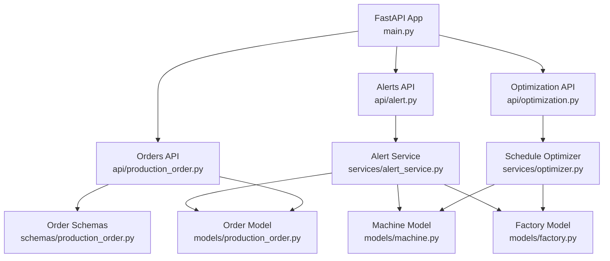
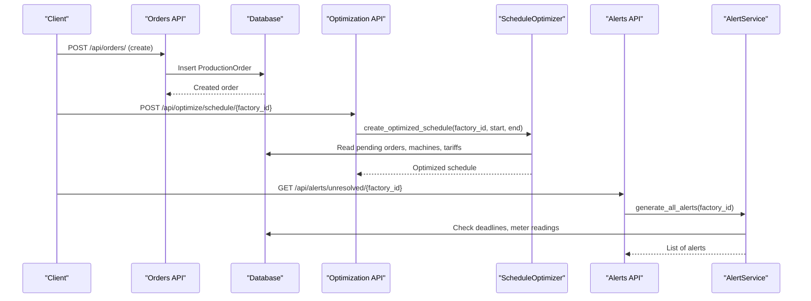
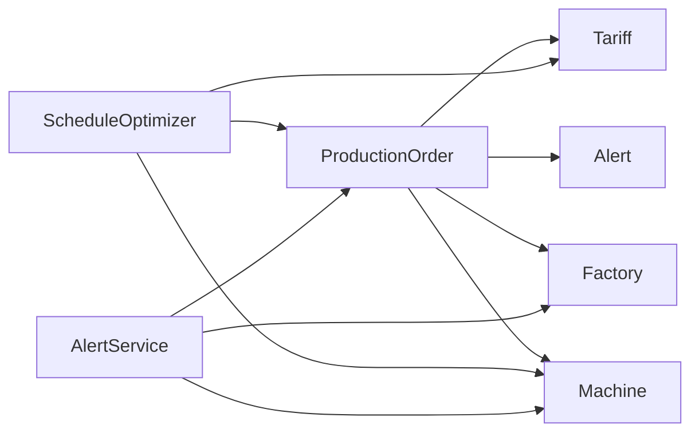

# Production Order Management

<cite>
**Referenced Files in This Document**
- [production_order.py](file://backend/app/models/production_order.py)
- [production_order.py](file://backend/app/schemas/production_order.py)
- [production_order.py](file://backend/app/api/production_order.py)
- [optimizer.py](file://backend/app/services/optimizer.py)
- [alert_service.py](file://backend/app/services/alert_service.py)
- [machine.py](file://backend/app/models/machine.py)
- [factory.py](file://backend/app/models/factory.py)
- [optimization.py](file://backend/app/api/optimization.py)
- [alert.py](file://backend/app/api/alert.py)
- [main.py](file://backend/main.py)
- [API.md](file://docs/API.md)
</cite>

## Table of Contents
1. [Introduction](#introduction)
2. [Project Structure](#project-structure)
3. [Core Components](#core-components)
4. [Architecture Overview](#architecture-overview)
5. [Detailed Component Analysis](#detailed-component-analysis)
6. [Dependency Analysis](#dependency-analysis)
7. [Performance Considerations](#performance-considerations)
8. [Troubleshooting Guide](#troubleshooting-guide)
9. [Conclusion](#conclusion)
10. [Appendices](#appendices)

## Introduction
This document explains how Production Orders are modeled, created, scheduled, and monitored in TariffGuard. It covers the order data model (quantity, deadlines, priorities, machine options), the API for order operations, integration with the scheduling optimizer and alert system, and practical workflows for managing orders from pending to completion. It also addresses advanced scenarios such as batch processing, modification workflows, reporting, rush orders, capacity conflicts, and proactive alerts.

## Project Structure
The production order feature spans models, schemas, APIs, services, and related integrations:
- Data model and schemas define order fields and request/response contracts.
- API endpoints expose CRUD operations for orders and integrate with authentication.
- Services implement optimization and alerting logic that consume order data.
- Related models (Machine, Factory) provide context for scheduling and constraints.

**Diagram sources**
- [main.py:48-58](file://backend/main.py#L48-L58)
- [production_order.py:1-66](file://backend/app/api/production_order.py#L1-L66)
- [production_order.py:5-20](file://backend/app/models/production_order.py#L5-L20)
- [production_order.py:5-26](file://backend/app/schemas/production_order.py#L5-L26)
- [optimizer.py:14-190](file://backend/app/services/optimizer.py#L14-L190)
- [alert_service.py:16-140](file://backend/app/services/alert_service.py#L16-L140)
- [machine.py:5-20](file://backend/app/models/machine.py#L5-L20)
- [factory.py:5-17](file://backend/app/models/factory.py#L5-L17)

**Section sources**
- [main.py:48-58](file://backend/main.py#L48-L58)
- [API.md:32-38](file://docs/API.md#L32-L38)

## Core Components
- ProductionOrder model: stores order identity, process type, quantity, duration, earliest start, deadline, priority, machine options, lock flag, status, and timestamps.
- Order schemas: define create and response payloads for orders.
- Orders API: endpoints to create, list, retrieve, and delete orders with role-based access control.
- ScheduleOptimizer: consumes pending orders, machines, and tariffs to generate cost-optimized schedules and compare baseline vs optimized plans.
- AlertService: monitors deadlines, peak demand, and solar generation; creates actionable alerts tied to factories and orders.

Key responsibilities:
- Orders API handles persistence and basic filtering by factory and status.
- Optimizer selects suitable machines based on process type and assigns time slots to minimize energy costs while respecting locked slots.
- Alerts proactively notify about upcoming deadlines and operational anomalies.

**Section sources**
- [production_order.py:5-20](file://backend/app/models/production_order.py#L5-L20)
- [production_order.py:5-26](file://backend/app/schemas/production_order.py#L5-L26)
- [production_order.py:13-66](file://backend/app/api/production_order.py#L13-L66)
- [optimizer.py:29-190](file://backend/app/services/optimizer.py#L29-L190)
- [alert_service.py:52-91](file://backend/app/services/alert_service.py#L52-L91)

## Architecture Overview
The system integrates order management with scheduling and alerting:
- Clients call Orders API to create/list/get/delete orders.
- Optimization API triggers schedule generation using pending orders, available machines, and tariff rates.
- Alerts API generates and manages alerts based on order deadlines and meter readings.

**Diagram sources**
- [production_order.py:13-24](file://backend/app/api/production_order.py#L13-L24)
- [optimization.py:11-29](file://backend/app/api/optimization.py#L11-L29)
- [optimizer.py:97-190](file://backend/app/services/optimizer.py#L97-L190)
- [alert.py:35-43](file://backend/app/api/alert.py#L35-L43)
- [alert_service.py:125-140](file://backend/app/services/alert_service.py#L125-L140)

## Detailed Component Analysis

### Production Order Data Model
- Fields:
  - Identity and scope: id, factory_id, order_no (unique).
  - Process and sizing: process, quantity, duration_minutes.
  - Timing constraints: earliest_start, deadline.
  - Prioritization and flexibility: priority (integer), machine_options (list of machine IDs), locked (boolean).
  - Lifecycle: status (default "pending"), created_at.

Complexity notes:
- JSON field for machine_options allows flexible selection of eligible machines per order.
- Status defaults to "pending", enabling downstream processes to pick up unscheduled work.

**Section sources**
- [production_order.py:5-20](file://backend/app/models/production_order.py#L5-L20)

### Order Schemas and API
- Create schema requires factory_id and order details; response includes id, factory_id, status, created_at.
- Endpoints:
  - POST /api/orders/: create order (manager-only via role guard).
  - GET /api/orders/: list orders with optional filters by factory_id and status.
  - GET /api/orders/{id}: get single order.
  - DELETE /api/orders/{id}: delete order (manager-only).

Authentication and authorization:
- Creation and deletion require manager role; listing and retrieval require authenticated user.

Error handling:
- Returns 404 when order not found; standard validation errors handled globally.

**Section sources**
- [production_order.py:5-26](file://backend/app/schemas/production_order.py#L5-L26)
- [production_order.py:13-66](file://backend/app/api/production_order.py#L13-L66)

### Scheduling and Optimization Integration
- The optimizer retrieves pending orders for a factory, matches them to machines by process type, and assigns consecutive hourly slots based on tariff rates to minimize cost.
- Locked slots are excluded to avoid conflicts with already scheduled or reserved times.
- Output includes per-order schedule details, estimated cost and kWh, and aggregate metrics.

Priority handling strategy:
- Current implementation sorts time slots by rate and picks cheapest available slots; it does not explicitly sort orders by priority. To prioritize rush orders, consider sorting orders by priority before assignment or reserving early slots for high-priority orders.

Deadline enforcement:
- Deadlines are stored but not enforced during scheduling; ensure selected slots do not exceed order deadlines. Consider adding a constraint that optimal start must be >= earliest_start and <= deadline.

Capacity conflict resolution:
- Used slots per machine are tracked to prevent double booking. If conflicts arise, the optimizer skips locked slots and continues selecting available ones.

Batch processing:
- The optimizer processes all pending orders in one run, producing a consolidated schedule.

**Section sources**
- [optimizer.py:29-190](file://backend/app/services/optimizer.py#L29-L190)

### Alert System Integration
- Deadline alerts: scans pending orders with deadlines within a configurable window and creates warnings or critical alerts depending on hours remaining.
- Peak demand alerts: monitors latest meter reading against thresholds and prevents duplicate alerts within an hour.
- Solar generation alerts: checks daytime solar output against expected capacity.

Proactive order management:
- Use deadline alerts to trigger rescheduling or expedite production for at-risk orders.
- Combine with optimization runs to re-optimize schedules after changes.

**Section sources**
- [alert_service.py:19-91](file://backend/app/services/alert_service.py#L19-L91)
- [alert_service.py:93-140](file://backend/app/services/alert_service.py#L93-L140)
- [alert.py:35-43](file://backend/app/api/alert.py#L35-L43)

### Practical Workflows and Examples

#### Order Lifecycle Management
- Create order: POST /api/orders/ with required fields including deadline and priority.
- List orders: GET /api/orders/?factory_id=...&status=pending to view pending work.
- Retrieve order: GET /api/orders/{id}.
- Delete order: DELETE /api/orders/{id} (manager-only).

Status management:
- Orders default to "pending". Downstream processes can update status to reflect progress (e.g., scheduled, running, completed). Ensure any updates are persisted via appropriate endpoints or service methods.

**Section sources**
- [production_order.py:13-66](file://backend/app/api/production_order.py#L13-L66)

#### Priority Handling Strategies
- Assign lower numeric values for higher priority (e.g., 1 = high).
- For rush orders, set priority=1 and tight deadlines; use alerts to surface risk.
- Consider modifying the optimizer to process higher-priority orders first or reserve earlier slots for them.

**Section sources**
- [production_order.py:16-16](file://backend/app/models/production_order.py#L16-L16)
- [optimizer.py:120-175](file://backend/app/services/optimizer.py#L120-L175)

#### Deadline Enforcement Mechanisms
- Store earliest_start and deadline to constrain scheduling windows.
- Use AlertService.check_deadlines to detect near-miss deadlines and escalate.
- Integrate with optimization runs to shift orders away from peak rates while honoring deadlines.

**Section sources**
- [production_order.py:14-15](file://backend/app/models/production_order.py#L14-L15)
- [alert_service.py:52-91](file://backend/app/services/alert_service.py#L52-L91)

#### Batch Order Processing
- Trigger optimization for a factory to process all pending orders into a consolidated schedule.
- Compare baseline vs optimized to quantify savings and plan adjustments.

**Section sources**
- [optimization.py:11-48](file://backend/app/api/optimization.py#L11-L48)
- [optimizer.py:97-238](file://backend/app/services/optimizer.py#L97-L238)

#### Order Modification Workflows
- Update order attributes (e.g., deadline, priority, machine_options) via a dedicated update endpoint if implemented; otherwise, delete and recreate to apply changes.
- After modifications, re-run optimization to reflect new constraints.

Note: An explicit update endpoint is not present in the current codebase; consider adding one for safe modifications.

**Section sources**
- [production_order.py:53-66](file://backend/app/api/production_order.py#L53-L66)

#### Reporting Capabilities
- Use alerts stats to monitor unresolved and critical alerts per factory.
- Leverage optimization results to report estimated costs, kWh, and average rates.

**Section sources**
- [alert.py:82-107](file://backend/app/api/alert.py#L82-L107)
- [optimizer.py:180-190](file://backend/app/services/optimizer.py#L180-L190)

#### Advanced Scenarios
- Rush order handling: Set high priority and short deadline; rely on deadline alerts and consider manual intervention to secure early slots.
- Capacity conflict resolution: The optimizer avoids locked slots; if conflicts persist, adjust machine availability or maintenance windows.
- Production planning: Run optimization over a planning horizon to visualize cost-effective schedules and compare against baseline.

**Section sources**
- [alert_service.py:52-91](file://backend/app/services/alert_service.py#L52-L91)
- [optimizer.py:120-175](file://backend/app/services/optimizer.py#L120-L175)

## Dependency Analysis
Production orders depend on:
- Machine model for process matching and power consumption.
- Factory model for context and operating constraints.
- Tariffs for cost calculations during optimization.
- Alert service for deadline monitoring and operational alerts.

**Diagram sources**
- [production_order.py:5-20](file://backend/app/models/production_order.py#L5-L20)
- [machine.py:5-20](file://backend/app/models/machine.py#L5-L20)
- [factory.py:5-17](file://backend/app/models/factory.py#L5-L17)
- [optimizer.py:9-12](file://backend/app/services/optimizer.py#L9-L12)
- [alert_service.py:11-14](file://backend/app/services/alert_service.py#L11-L14)

**Section sources**
- [optimizer.py:9-12](file://backend/app/services/optimizer.py#L9-L12)
- [alert_service.py:11-14](file://backend/app/services/alert_service.py#L11-L14)

## Performance Considerations
- Time slot granularity: The optimizer uses hourly slots; finer granularity may improve accuracy but increase computation.
- Sorting and selection: Slot selection sorts by rate; for large horizons, consider indexing or precomputing rates.
- Lock tracking: Used slots per machine are stored in memory during a run; ensure efficient lookups for large schedules.
- Alert deduplication: Prevents frequent duplicate alerts within an hour to reduce noise.

[No sources needed since this section provides general guidance]

## Troubleshooting Guide
Common issues and resolutions:
- Order not found: Ensure correct order_id and that the order exists; check database state.
- Unauthorized actions: Creation and deletion require manager role; verify user permissions.
- No schedule generated: Verify there are pending orders, suitable machines, and valid tariffs; check process-to-machine mapping.
- Deadline alerts missing: Confirm orders have deadlines within the configured window and are still pending.

Operational tips:
- Use health and test endpoints to validate backend connectivity.
- Review alert stats to identify unresolved critical issues.

**Section sources**
- [production_order.py:41-51](file://backend/app/api/production_order.py#L41-L51)
- [production_order.py:53-66](file://backend/app/api/production_order.py#L53-L66)
- [alert.py:82-107](file://backend/app/api/alert.py#L82-L107)
- [main.py:78-91](file://backend/main.py#L78-L91)

## Conclusion
TariffGuard’s Production Order Management integrates robust order modeling with cost-aware scheduling and proactive alerting. Orders capture essential constraints like deadlines, priorities, and machine options, while the optimizer produces efficient schedules aligned with tariff rates. Alerts ensure timely attention to deadlines and operational risks. Extending the system with explicit order updates, stricter deadline enforcement, and priority-driven scheduling will further enhance responsiveness and efficiency.

[No sources needed since this section summarizes without analyzing specific files]

## Appendices

### API Reference Summary
- Orders:
  - POST /api/orders/
  - GET /api/orders/
  - GET /api/orders/{id}
  - DELETE /api/orders/{id}
- Optimization:
  - POST /api/optimize/schedule/{factory_id}
  - POST /api/optimize/compare/{factory_id}
- Alerts:
  - GET /api/alerts/
  - POST /api/alerts/generate/{factory_id}
  - GET /api/alerts/unresolved/{factory_id}
  - PUT /api/alerts/{alert_id}
  - GET /api/alerts/stats/{factory_id}

**Section sources**
- [API.md:32-65](file://docs/API.md#L32-L65)
- [production_order.py:13-66](file://backend/app/api/production_order.py#L13-L66)
- [optimization.py:11-48](file://backend/app/api/optimization.py#L11-L48)
- [alert.py:14-107](file://backend/app/api/alert.py#L14-L107)