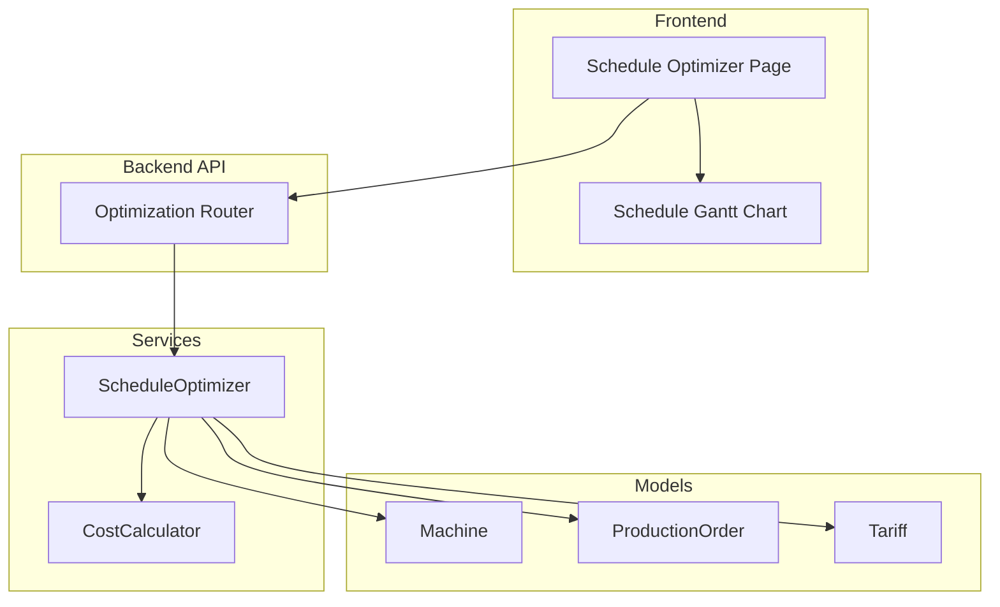
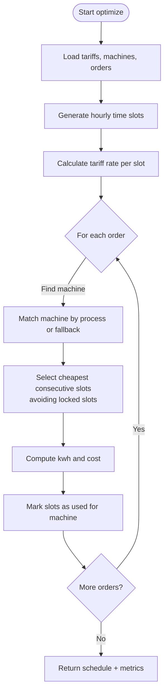
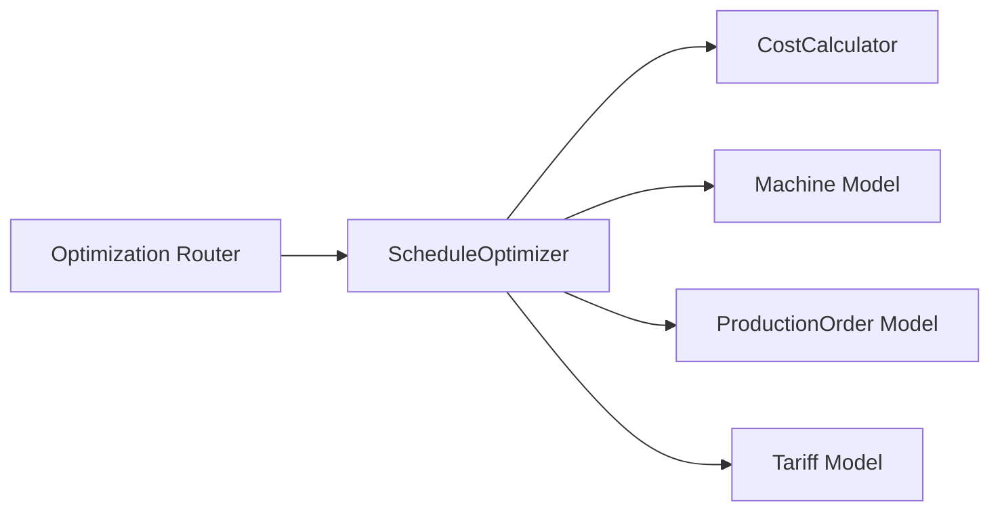

# Schedule Optimization

<cite>
**Referenced Files in This Document**
- [optimization.py](file://backend/app/api/optimization.py)
- [optimizer.py](file://backend/app/services/optimizer.py)
- [cost_calculator.py](file://backend/app/services/cost_calculator.py)
- [production_order.py](file://backend/app/models/production_order.py)
- [machine.py](file://backend/app/models/machine.py)
- [tariff.py](file://backend/app/models/tariff.py)
- [schedule_optimizer_page.tsx](file://frontend/app/dashboard/schedule_optimizer/page.tsx)
- [schedule_gantt.tsx](file://frontend/components/charts/schedule_gantt.tsx)
- [API.md](file://docs/API.md)
</cite>

## Table of Contents
1. [Introduction](#introduction)
2. [Project Structure](#project-structure)
3. [Core Components](#core-components)
4. [Architecture Overview](#architecture-overview)
5. [Detailed Component Analysis](#detailed-component-analysis)
6. [Dependency Analysis](#dependency-analysis)
7. [Performance Considerations](#performance-considerations)
8. [Troubleshooting Guide](#troubleshooting-guide)
9. [Conclusion](#conclusion)
10. [Appendices](#appendices)

## Introduction
This document explains the Schedule Optimization feature in TariffGuard, which uses AI-powered scheduling algorithms to minimize energy costs while respecting operational constraints such as machine availability, order deadlines, and tariff rates. It covers optimization objectives, constraint satisfaction techniques, API endpoints for generating optimized schedules, practical usage scenarios, what-if analysis, schedule comparison tools, manual adjustments, integration points with machines, production orders, and tariffs, plus troubleshooting and performance tuning guidance.

## Project Structure
The Schedule Optimization feature spans backend services, data models, API endpoints, and a frontend interface:
- Backend API exposes optimization endpoints under /api/optimize.
- The optimizer service coordinates data retrieval, slot generation, cost calculation, and schedule assignment.
- Data models define machines, production orders, and tariffs used by the optimizer.
- Frontend provides an interactive Gantt-based scheduler with baseline vs optimized views, locking jobs, and metrics.



**Diagram sources**
- [optimization.py:11-48](file://backend/app/api/optimization.py#L11-L48)
- [optimizer.py:14-238](file://backend/app/services/optimizer.py#L14-L238)
- [cost_calculator.py:12-110](file://backend/app/services/cost_calculator.py#L12-L110)
- [machine.py:5-20](file://backend/app/models/machine.py#L5-L20)
- [production_order.py:5-20](file://backend/app/models/production_order.py#L5-L20)
- [tariff.py:5-19](file://backend/app/models/tariff.py#L5-L19)
- [schedule_optimizer_page.tsx:72-171](file://frontend/app/dashboard/schedule_optimizer/page.tsx#L72-L171)
- [schedule_gantt.tsx:27-222](file://frontend/components/charts/schedule_gantt.tsx#L27-L222)

**Section sources**
- [optimization.py:11-48](file://backend/app/api/optimization.py#L11-L48)
- [API.md:61-66](file://docs/API.md#L61-L66)

## Core Components
- ScheduleOptimizer: Orchestrates optimization by retrieving tariffs, machines, and pending orders; generating time slots; calculating slot rates; selecting optimal slots per order; computing costs; and returning schedule results and comparisons.
- CostCalculator: Determines applicable tariff rates for timestamps and computes slot-level and aggregate costs.
- Models: Machine, ProductionOrder, and Tariff provide the domain data consumed by the optimizer.
- Frontend: Provides user controls to run optimization, view baseline vs optimized schedules, lock jobs, and see cost impact.

Key responsibilities:
- Constraint handling: machine type matching, per-machine slot locking, order duration alignment, and deadline awareness via model fields.
- Objective: minimize total estimated energy cost across scheduled orders within the specified window.
- What-if analysis: compare baseline (unoptimized) vs optimized schedules and quantify savings.

**Section sources**
- [optimizer.py:14-238](file://backend/app/services/optimizer.py#L14-L238)
- [cost_calculator.py:12-110](file://backend/app/services/cost_calculator.py#L12-L110)
- [machine.py:5-20](file://backend/app/models/machine.py#L5-L20)
- [production_order.py:5-20](file://backend/app/models/production_order.py#L5-L20)
- [tariff.py:5-19](file://backend/app/models/tariff.py#L5-L19)
- [schedule_optimizer_page.tsx:72-171](file://frontend/app/dashboard/schedule_optimizer/page.tsx#L72-L171)

## Architecture Overview
The optimization flow begins at the frontend, calls the backend API, which delegates to the optimizer service. The service queries models for tariffs, machines, and orders, generates hourly time slots, calculates rates using the cost calculator, selects cheapest available slots per order while avoiding conflicts, and returns both optimized schedule and comparison metrics.

```mermaid
sequenceDiagram
participant FE as "Frontend Page"
participant API as "Optimization Router"
participant OPT as "ScheduleOptimizer"
participant CC as "CostCalculator"
participant DB as "Database Models"
FE->>API : POST /api/optimize/compare/{factory_id}?start_time&end_time
API->>OPT : compare_baseline_vs_optimized(factory_id, start, end)
OPT->>DB : get_pending_orders()
OPT->>DB : get_available_machines()
OPT->>DB : get_available_tariffs()
OPT->>OPT : generate_time_slots(start, end)
OPT->>CC : get_tariff_rate(tariffs, timestamp) x N
OPT->>OPT : find_optimal_slots(slot_rates, duration, locked)
OPT-->>API : {baseline, optimized, savings, schedule}
API-->>FE : JSON response
```

**Diagram sources**
- [optimization.py:31-48](file://backend/app/api/optimization.py#L31-L48)
- [optimizer.py:97-238](file://backend/app/services/optimizer.py#L97-L238)
- [cost_calculator.py:15-33](file://backend/app/services/cost_calculator.py#L15-L33)

## Detailed Component Analysis

### ScheduleOptimizer
Responsibilities:
- Retrieve tariffs, machines, and pending orders for a factory.
- Generate hourly time slots between start and end times.
- Compute per-slot tariff rates.
- Select consecutive cheapest slots per order while avoiding per-machine slot conflicts.
- Calculate per-order energy consumption and cost.
- Provide baseline vs optimized comparison with savings metrics.

Algorithm highlights:
- Slot selection sorts all slots by rate and picks the cheapest available ones that fit the order’s duration, skipping locked slots already assigned to the same machine.
- Machine assignment prefers machines whose type matches the order process; otherwise falls back to the first available machine.
- Baseline comparison assumes a fixed peak rate for unoptimized scheduling to estimate potential savings.

Complexity considerations:
- Sorting slot rates is O(N log N) where N is number of slots in the window.
- Per-order slot selection iterates sorted slots once, O(N).
- Overall complexity per optimization call is roughly O(O * N), where O is number of pending orders.

Constraints handled:
- Machine availability via per-machine locked slots tracking.
- Order duration alignment into hourly slots.
- Process-to-machine matching.
- Deadline and earliest_start are modeled but not enforced in current selection logic.



**Diagram sources**
- [optimizer.py:97-190](file://backend/app/services/optimizer.py#L97-L190)

**Section sources**
- [optimizer.py:21-95](file://backend/app/services/optimizer.py#L21-L95)
- [optimizer.py:97-190](file://backend/app/services/optimizer.py#L97-L190)
- [optimizer.py:192-238](file://backend/app/services/optimizer.py#L192-L238)

### CostCalculator
Responsibilities:
- Determine the applicable tariff rate for any timestamp based on tariff periods, including overnight ranges.
- Compute slot-level costs and aggregate totals across meter readings.
- Estimate machine running costs given power, duration, and start time.

Key behaviors:
- Handles overnight tariffs by checking if current time is after start or before end when start > end.
- Defaults to a standard rate when no tariff matches.

**Section sources**
- [cost_calculator.py:15-33](file://backend/app/services/cost_calculator.py#L15-L33)
- [cost_calculator.py:35-90](file://backend/app/services/cost_calculator.py#L35-L90)
- [cost_calculator.py:92-110](file://backend/app/services/cost_calculator.py#L92-L110)

### Data Models
- Machine: Defines factory association, name, type, power consumption, minimum run time, setup time, shiftability, priority, availability windows, and maintenance windows.
- ProductionOrder: Captures order metadata, process type, quantity, duration, earliest start, deadline, priority, optional machine options, lock status, and lifecycle status.
- Tariff: Encapsulates category, period name, time range, rate, fixed charge, effective dates, source, verification timestamp.

These models supply the constraints and parameters required by the optimizer and cost calculator.

**Section sources**
- [machine.py:5-20](file://backend/app/models/machine.py#L5-L20)
- [production_order.py:5-20](file://backend/app/models/production_order.py#L5-L20)
- [tariff.py:5-19](file://backend/app/models/tariff.py#L5-L19)

### Frontend Integration
- The Schedule Optimizer page initializes machines and demo jobs, fetches optimization results, and displays baseline vs optimized schedules.
- Users can filter by machine, toggle baseline visibility, lock selected jobs, reset to initial state, and run optimization.
- The Gantt chart visualizes solar windows, peak tariff periods, current time, and job blocks with tooltips showing details.

Operational notes:
- Locking a job prevents it from being moved during optimization by marking it as locked locally.
- The page calls the compare endpoint to obtain baseline and optimized metrics and renders them in summary cards.

**Section sources**
- [schedule_optimizer_page.tsx:72-171](file://frontend/app/dashboard/schedule_optimizer/page.tsx#L72-L171)
- [schedule_gantt.tsx:27-222](file://frontend/components/charts/schedule_gantt.tsx#L27-L222)

## Dependency Analysis
The optimizer depends on:
- Database session for querying models.
- CostCalculator for tariff rate lookups and cost computations.
- Models for machines, orders, and tariffs.

Coupling and cohesion:
- High cohesion within ScheduleOptimizer around scheduling logic.
- Clear separation of concerns: API routing, service orchestration, cost computation, and data modeling.
- Potential circular dependencies are avoided by keeping services independent and using dependency injection via database sessions.

External integrations:
- Tariff system: tariff periods and rates drive cost calculations.
- Machine management: machine types and power ratings influence assignment and cost.
- Production orders: durations, deadlines, and priorities shape scheduling decisions.



**Diagram sources**
- [optimization.py:11-48](file://backend/app/api/optimization.py#L11-L48)
- [optimizer.py:14-238](file://backend/app/services/optimizer.py#L14-L238)
- [cost_calculator.py:12-110](file://backend/app/services/cost_calculator.py#L12-L110)
- [machine.py:5-20](file://backend/app/models/machine.py#L5-L20)
- [production_order.py:5-20](file://backend/app/models/production_order.py#L5-L20)
- [tariff.py:5-19](file://backend/app/models/tariff.py#L5-L19)

**Section sources**
- [optimization.py:11-48](file://backend/app/api/optimization.py#L11-L48)
- [optimizer.py:14-238](file://backend/app/services/optimizer.py#L14-L238)

## Performance Considerations
- Time slot granularity: Hourly slots balance accuracy and performance. Finer intervals increase computational load.
- Sorting overhead: Slot rate sorting dominates runtime; consider caching slot rates for repeated runs within short windows.
- Machine matching: Prefer pre-indexed queries on machine_type and factory_id to reduce lookup time.
- Concurrency: Batch optimization calls should be throttled to avoid database contention.
- Memory usage: Keep slot lists bounded by the optimization window size.

[No sources needed since this section provides general guidance]

## Troubleshooting Guide
Common issues and resolutions:
- No orders scheduled: Ensure there are pending orders for the factory and that suitable machines exist matching order processes.
- Unexpected high costs: Verify tariff periods are correctly configured and cover the optimization window; check default rate behavior when no tariff matches.
- Jobs not moving: Locked jobs are excluded from reassignment; unlock or adjust locks to allow movement.
- Comparison shows zero savings: Baseline assumes a fixed peak rate; ensure realistic baseline assumptions or adjust comparison logic to reflect actual historical patterns.

Diagnostics:
- Inspect returned schedule entries for missing slot assignments or zero-cost anomalies.
- Validate tariff coverage for the requested time window and confirm overnight tariff handling.

**Section sources**
- [optimizer.py:120-178](file://backend/app/services/optimizer.py#L120-L178)
- [cost_calculator.py:15-33](file://backend/app/services/cost_calculator.py#L15-L33)
- [schedule_optimizer_page.tsx:123-151](file://frontend/app/dashboard/schedule_optimizer/page.tsx#L123-L151)

## Conclusion
TariffGuard’s Schedule Optimization leverages tariff-aware scheduling to minimize energy costs while respecting machine capabilities and order requirements. The system provides clear APIs for generating optimized schedules and comparing baseline versus optimized outcomes, supported by an interactive frontend for what-if analysis and manual adjustments. With proper configuration of tariffs, machines, and orders, users can achieve meaningful cost reductions and improved capacity utilization.

[No sources needed since this section summarizes without analyzing specific files]

## Appendices

### Optimization API Endpoints
- POST /api/optimize/schedule/{factory_id}
  - Purpose: Generate an optimized schedule for a factory over a specified time window.
  - Parameters:
    - factory_id: integer
    - start_time: optional datetime
    - end_time: optional datetime
  - Behavior: Defaults to next 24 hours if times are omitted.

- POST /api/optimize/compare/{factory_id}
  - Purpose: Compare baseline (unoptimized) vs optimized schedule and return savings metrics.
  - Parameters:
    - factory_id: integer
    - start_time: optional datetime
    - end_time: optional datetime
  - Behavior: Defaults to next 24 hours if times are omitted.

Reference documentation:
- [API.md:61-66](file://docs/API.md#L61-L66)

**Section sources**
- [optimization.py:11-48](file://backend/app/api/optimization.py#L11-L48)
- [API.md:61-66](file://docs/API.md#L61-L66)

### Practical Examples and Scenarios
- Peak demand avoidance: Shift non-critical orders away from peak tariff periods to reduce costs.
- Solar utilization: Prioritize energy-intensive tasks during solar generation windows when possible.
- Capacity utilization: Balance machine loads by assigning orders to suitable machines and avoiding conflicts through per-machine slot locking.
- What-if analysis: Use the compare endpoint to evaluate potential savings against a baseline scenario.
- Manual adjustments: Lock critical jobs to prevent movement and re-run optimization to accommodate constraints.

[No sources needed since this section provides general guidance]

### Integration Points
- Machine Management: Machine types and power ratings inform assignment and cost estimation.
- Production Orders: Durations, deadlines, and priorities guide scheduling decisions.
- Tariff System: Periods and rates determine slot costs and optimization targets.

**Section sources**
- [machine.py:5-20](file://backend/app/models/machine.py#L5-L20)
- [production_order.py:5-20](file://backend/app/models/production_order.py#L5-L20)
- [tariff.py:5-19](file://backend/app/models/tariff.py#L5-L19)
- [optimizer.py:105-140](file://backend/app/services/optimizer.py#L105-L140)