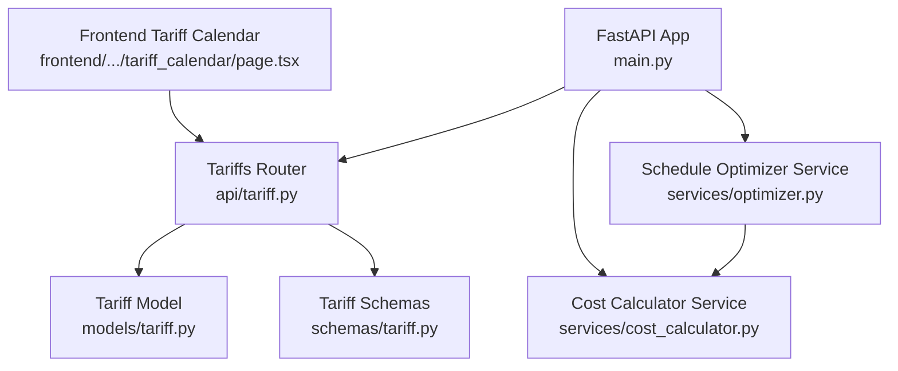
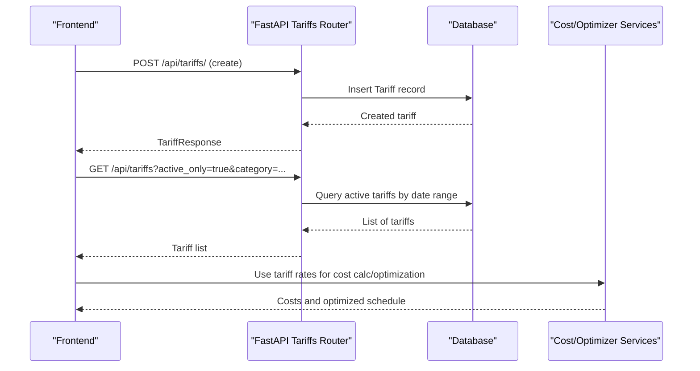
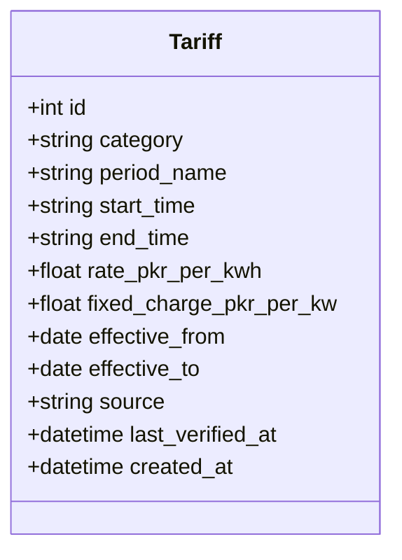
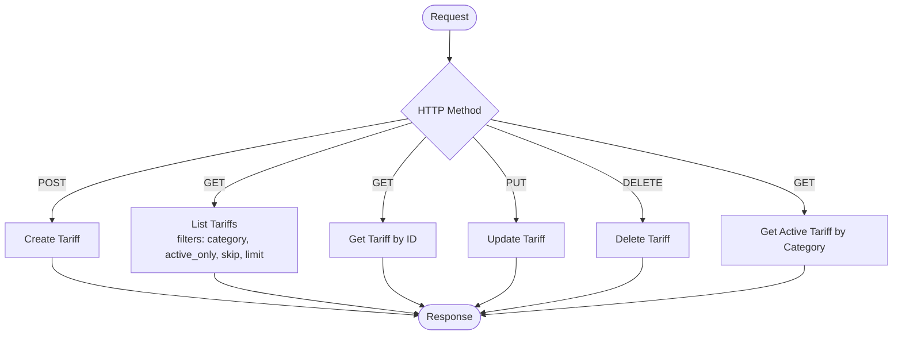
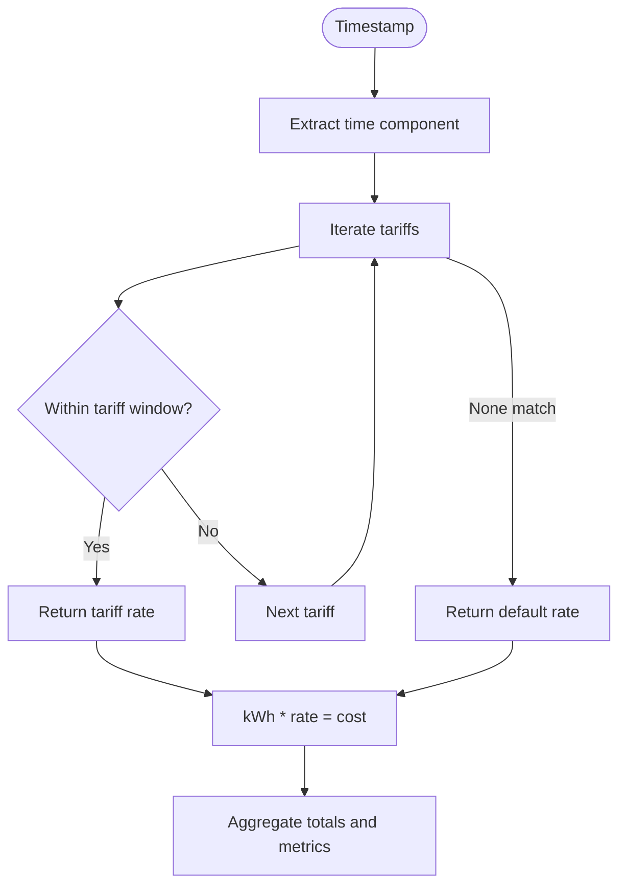
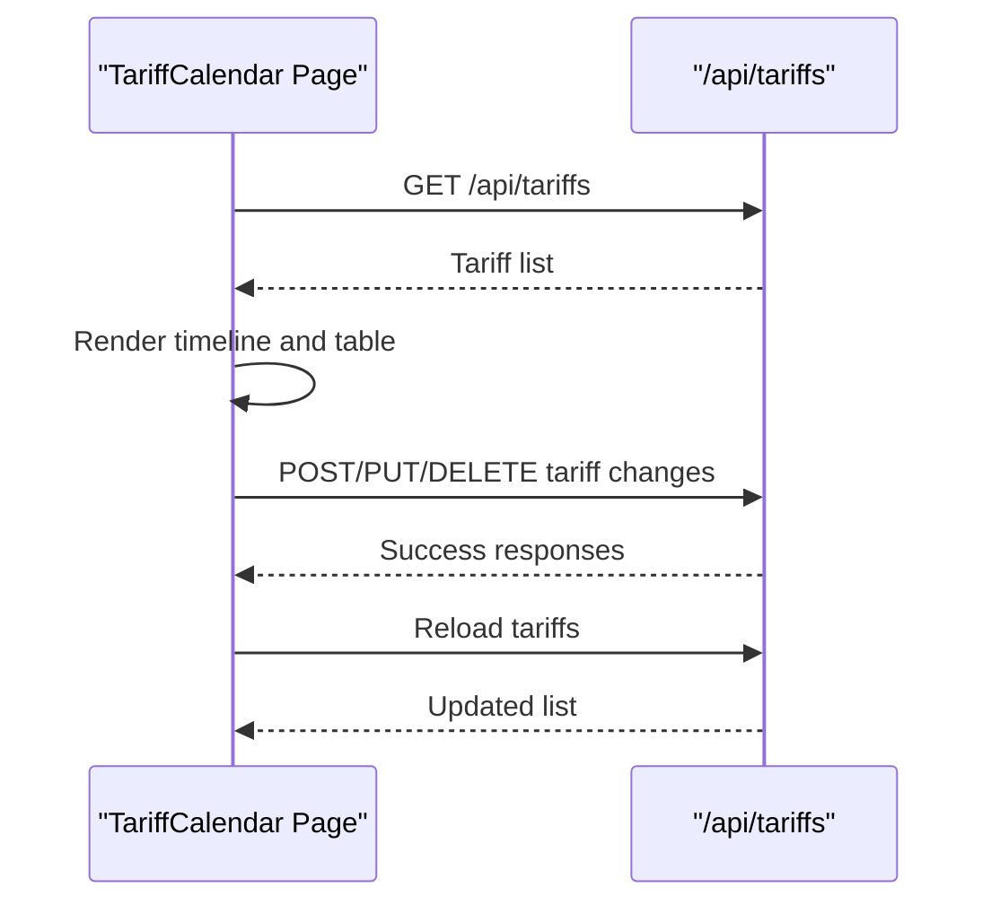
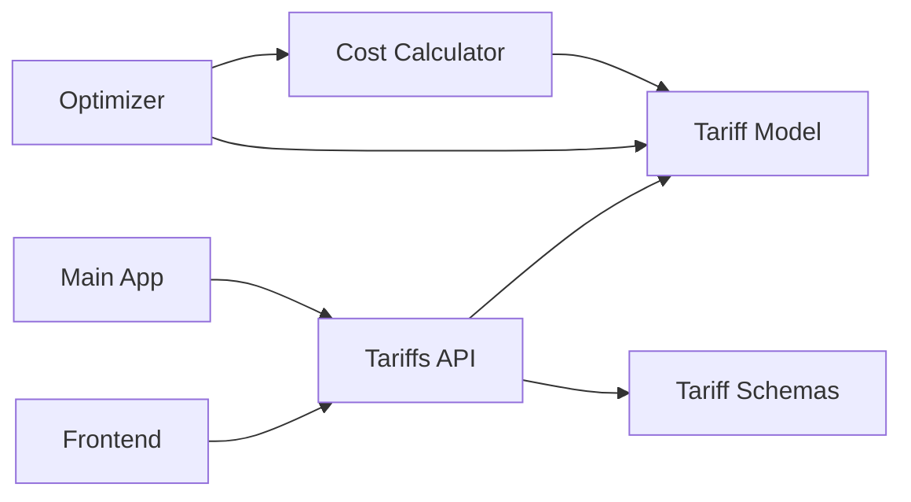

# Tariff Management

<cite>
**Referenced Files in This Document**
- [main.py](file://backend/main.py)
- [tariff.py](file://backend/app/api/tariff.py)
- [tariff.py](file://backend/app/models/tariff.py)
- [tariff.py](file://backend/app/schemas/tariff.py)
- [cost_calculator.py](file://backend/app/services/cost_calculator.py)
- [optimizer.py](file://backend/app/services/optimizer.py)
- [page.tsx](file://frontend/app/dashboard/tariff_calendar/page.tsx)
- [API.md](file://docs/API.md)
</cite>

## Table of Contents
1. Introduction
2. Project Structure
3. Core Components
4. Architecture Overview
5. Detailed Component Analysis
6. Dependency Analysis
7. Performance Considerations
8. Troubleshooting Guide
9. Conclusion
10. Appendices

## Introduction
This document explains how TariffGuard manages time-based electricity pricing and integrates it with cost calculation and scheduling optimization. It covers:
- Time-of-use tariff configuration (peak/off-peak/night periods), effective date ranges, and categories that act as geographic or customer segments
- The tariff data model for time periods, rate structures, and source tracking
- The complete API interface for CRUD operations on tariffs
- How tariffs influence energy cost calculations and schedule optimization
- Practical workflows for setting up rate plans and seasonal adjustments
- Advanced capabilities such as custom rate selection logic, validation rules, and historical rate tracking via effective dates and verification timestamps

## Project Structure
Tariff management spans the backend API, data models, schemas, services, and a frontend calendar UI. The FastAPI application mounts routers for each domain, including tariffs.



**Diagram sources**
- [main.py:48-58](file://backend/main.py#L48-L58)
- [tariff.py:10-90](file://backend/app/api/tariff.py#L10-L90)
- [cost_calculator.py:12-110](file://backend/app/services/cost_calculator.py#L12-L110)
- [optimizer.py:14-238](file://backend/app/services/optimizer.py#L14-L238)
- [tariff.py:5-19](file://backend/app/models/tariff.py#L5-L19)
- [tariff.py:5-35](file://backend/app/schemas/tariff.py#L5-L35)
- [page.tsx:31-123](file://frontend/app/dashboard/tariff_calendar/page.tsx#L31-L123)

**Section sources**
- [main.py:48-58](file://backend/main.py#L48-L58)
- [API.md:39-46](file://docs/API.md#L39-L46)

## Core Components
- Tariff Data Model: Defines time windows, rates, effective dates, category segmentation, and source metadata.
- Tariff API: Full CRUD plus listing with filters and an endpoint to retrieve the active tariff for a category.
- Cost Calculator: Determines the applicable rate for any timestamp based on configured tariffs and computes costs per slot and totals.
- Schedule Optimizer: Uses tariff rates to find low-cost time slots for production orders and compares baseline vs optimized schedules.
- Frontend Tariff Calendar: Visualizes daily and weekly tariff periods and allows adding/editing/deleting tariffs.

**Section sources**
- [tariff.py:5-19](file://backend/app/models/tariff.py#L5-L19)
- [tariff.py:12-90](file://backend/app/api/tariff.py#L12-L90)
- [cost_calculator.py:15-110](file://backend/app/services/cost_calculator.py#L15-L110)
- [optimizer.py:21-238](file://backend/app/services/optimizer.py#L21-L238)
- [page.tsx:10-123](file://frontend/app/dashboard/tariff_calendar/page.tsx#L10-L123)

## Architecture Overview
The system uses a layered architecture:
- API Layer: Exposes REST endpoints for tariff management and optimization.
- Service Layer: Encapsulates business logic for cost calculation and schedule optimization.
- Data Layer: SQLAlchemy models persist tariff definitions and related entities.
- Presentation Layer: Next.js frontend renders tariff calendars and forms.



**Diagram sources**
- [tariff.py:12-90](file://backend/app/api/tariff.py#L12-L90)
- [cost_calculator.py:15-110](file://backend/app/services/cost_calculator.py#L15-L110)
- [optimizer.py:21-238](file://backend/app/services/optimizer.py#L21-L238)

## Detailed Component Analysis

### Tariff Data Model
- Fields:
  - Identifier and categorization: id, category, period_name
  - Time window: start_time, end_time (HH:MM strings)
  - Pricing: rate_pkr_per_kwh, fixed_charge_pkr_per_kw
  - Validity: effective_from, effective_to (date range)
  - Provenance: source, last_verified_at, created_at
- Purpose:
  - Supports time-of-use pricing with peak/off-peak/night periods
  - Enables seasonal adjustments via effective date ranges
  - Allows multiple categories to represent different geographic zones or customer classes



**Diagram sources**
- [tariff.py:5-19](file://backend/app/models/tariff.py#L5-L19)

**Section sources**
- [tariff.py:5-19](file://backend/app/models/tariff.py#L5-L19)

### Tariff API Interface
Endpoints:
- Create tariff: POST /api/tariffs/
- List tariffs: GET /api/tariffs/?category=&active_only=&skip=&limit=
- Get tariff: GET /api/tariffs/{id}
- Update tariff: PUT /api/tariffs/{id}
- Delete tariff: DELETE /api/tariffs/{id}
- Active tariff: GET /api/tariffs/active/{category}

Behavior highlights:
- Listing supports filtering by category and whether the tariff is currently active based on today’s date against effective_from/effective_to
- Active endpoint returns the single current tariff for a given category



**Diagram sources**
- [tariff.py:12-90](file://backend/app/api/tariff.py#L12-L90)

**Section sources**
- [tariff.py:12-90](file://backend/app/api/tariff.py#L12-L90)
- [API.md:39-46](file://docs/API.md#L39-L46)

### Cost Calculation Integration
The cost calculator determines the applicable tariff rate for any timestamp and computes:
- Per-slot cost from kWh and matched rate
- Total cost across meter readings
- Peak demand and grid consumption accounting for solar generation
- Machine run-time cost estimation

Rate selection logic:
- Matches current time to tariff start/end windows
- Handles overnight periods where end time is earlier than start time
- Falls back to a default rate when no tariff matches



**Diagram sources**
- [cost_calculator.py:15-110](file://backend/app/services/cost_calculator.py#L15-L110)

**Section sources**
- [cost_calculator.py:15-110](file://backend/app/services/cost_calculator.py#L15-L110)

### Schedule Optimization Integration
The optimizer:
- Generates hourly time slots over a planning horizon
- Computes tariff rate for each slot using the cost calculator
- Selects consecutive cheapest slots for each order while respecting machine availability and locked slots
- Produces an optimized schedule with estimated costs and energy usage
- Compares baseline (assumed peak rate) vs optimized outcomes to quantify savings

```mermaid
sequenceDiagram
participant FE as "Frontend"
participant OPT as "ScheduleOptimizer"
participant CC as "CostCalculator"
participant DB as "Database"
FE->>OPT : create_optimized_schedule(factory_id, start, end)
OPT->>DB : Load tariffs, machines, pending orders
OPT->>OPT : Generate time slots
loop For each slot
OPT->>CC : get_tariff_rate(tariffs, slot_time)
CC-->>OPT : rate
end
OPT->>OPT : Find optimal consecutive slots per order
OPT-->>FE : Schedule with costs and KPIs
```

**Diagram sources**
- [optimizer.py:36-190](file://backend/app/services/optimizer.py#L36-L190)
- [cost_calculator.py:15-33](file://backend/app/services/cost_calculator.py#L15-L33)

**Section sources**
- [optimizer.py:36-190](file://backend/app/services/optimizer.py#L36-L190)

### Frontend Tariff Calendar
The tariff calendar page:
- Loads tariffs and sorts them by start time
- Renders a daily timeline showing period names and rates, with a “NOW” indicator
- Provides a weekly overview grid
- Allows adding, editing, and deleting tariffs with role-based controls
- Submits payloads to the backend tariff endpoints



**Diagram sources**
- [page.tsx:31-123](file://frontend/app/dashboard/tariff_calendar/page.tsx#L31-L123)
- [tariff.py:12-90](file://backend/app/api/tariff.py#L12-L90)

**Section sources**
- [page.tsx:31-123](file://frontend/app/dashboard/tariff_calendar/page.tsx#L31-L123)

## Dependency Analysis
- API depends on models and schemas for request/response validation and persistence
- Services depend on models and each other (optimizer uses cost calculator)
- Frontend depends on API endpoints for CRUD and visualization
- Main app wires routers and global error handling



**Diagram sources**
- [main.py:48-58](file://backend/main.py#L48-L58)
- [tariff.py:12-90](file://backend/app/api/tariff.py#L12-L90)
- [cost_calculator.py:15-110](file://backend/app/services/cost_calculator.py#L15-L110)
- [optimizer.py:21-238](file://backend/app/services/optimizer.py#L21-L238)

**Section sources**
- [main.py:48-58](file://backend/main.py#L48-L58)

## Performance Considerations
- Rate lookup is linear over the number of tariffs; keep the number of periods per category reasonable
- Use active_only filtering to reduce dataset size when only current tariffs are needed
- Batch operations (e.g., calculating total cost) should be used judiciously for large reading sets
- Consider caching frequently accessed active tariffs per category if read volume increases

[No sources needed since this section provides general guidance]

## Troubleshooting Guide
Common issues and resolutions:
- No active tariff found: Ensure effective_from <= today and (effective_to is null or >= today) for the category
- Unexpected default rate: Verify all time windows cover the target timestamp; check overnight period handling
- Validation errors: Confirm required fields like category, period_name, start_time, end_time, rate_pkr_per_kwh, effective_from are provided and valid
- 404 on update/delete: Verify the tariff ID exists before attempting mutation

Operational tips:
- Use the active tariff endpoint to quickly verify which period applies for a category
- Validate time formats (HH:MM) and ensure end_time > start_time unless modeling overnight periods
- Track source and last_verified_at to maintain auditability of rate changes

**Section sources**
- [tariff.py:44-90](file://backend/app/api/tariff.py#L44-L90)
- [cost_calculator.py:15-33](file://backend/app/services/cost_calculator.py#L15-L33)

## Conclusion
TariffGuard provides a robust foundation for managing time-based electricity pricing through configurable periods, effective date ranges, and category segmentation. The integrated cost calculator and schedule optimizer leverage these tariffs to compute accurate energy costs and generate cost-minimizing production schedules. The frontend enables intuitive configuration and visualization, while the API exposes full CRUD capabilities for automation and integration.

[No sources needed since this section summarizes without analyzing specific files]

## Appendices

### Tariff Data Model Reference
- category: Segment identifier for geographic zone or customer class
- period_name: Human-readable label (e.g., Peak, Off-Peak, Night)
- start_time/end_time: HH:MM window defining the period
- rate_pkr_per_kwh: Energy charge per kWh
- fixed_charge_pkr_per_kw: Demand-related fixed charge per kW (available for future demand charge modeling)
- effective_from/effective_to: Date range controlling seasonality and plan transitions
- source/last_verified_at: Audit fields for regulatory or utility source tracking

**Section sources**
- [tariff.py:5-19](file://backend/app/models/tariff.py#L5-L19)
- [tariff.py:5-35](file://backend/app/schemas/tariff.py#L5-L35)

### API Quick Reference
- POST /api/tariffs/ — Create tariff
- GET /api/tariffs/ — List tariffs (supports category, active_only, skip, limit)
- GET /api/tariffs/{id} — Get tariff by ID
- PUT /api/tariffs/{id} — Update tariff
- DELETE /api/tariffs/{id} — Delete tariff
- GET /api/tariffs/active/{category} — Get currently active tariff for a category

**Section sources**
- [API.md:39-46](file://docs/API.md#L39-L46)
- [tariff.py:12-90](file://backend/app/api/tariff.py#L12-L90)

### Practical Workflows

- Setup a new rate plan
  - Define categories for each geographic zone or customer class
  - Add periods (Peak, Off-Peak, Night) with start/end times and rates
  - Set effective_from and optional effective_to for seasonal validity
  - Verify via the active tariff endpoint for each category

- Seasonal adjustment strategy
  - Create new periods with updated rates and set effective_from to the change date
  - Keep prior periods for historical analysis; use effective_to to close old plans
  - Use source and last_verified_at to track regulatory updates

- Utility company integration
  - Map utility rate sheets to categories and periods
  - Use effective date ranges to align with utility billing cycles
  - Record source and verification timestamps for compliance

- Demand charge management
  - Configure fixed_charge_pkr_per_kw per period to reflect demand charges
  - Integrate with meter readings to compute peak demand and associated charges
  - Use optimizer insights to shift loads away from high-demand windows

- Renewable energy credits
  - Track solar_kwh in meter readings to adjust grid consumption and net costs
  - Use cost calculator outputs to quantify credit value and savings

- Historical rate tracking
  - Maintain past periods with closed effective_to ranges
  - Re-run cost calculations against historical tariffs for accurate reporting

[No sources needed since this section provides general guidance]