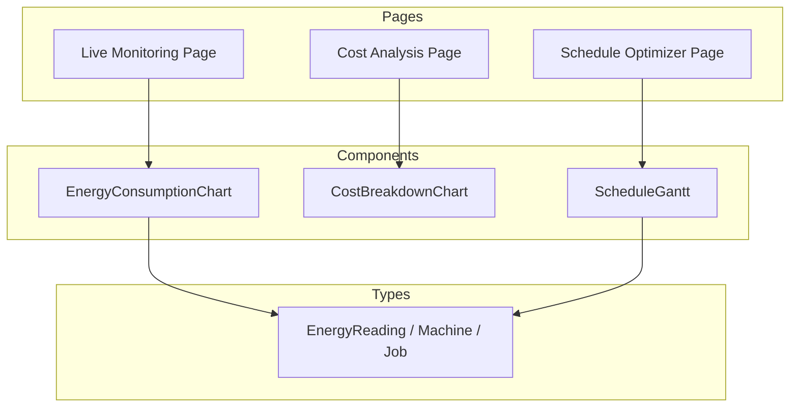
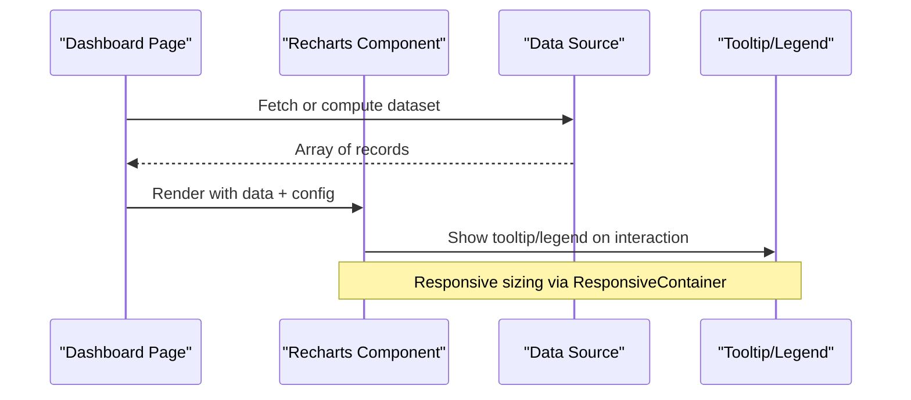
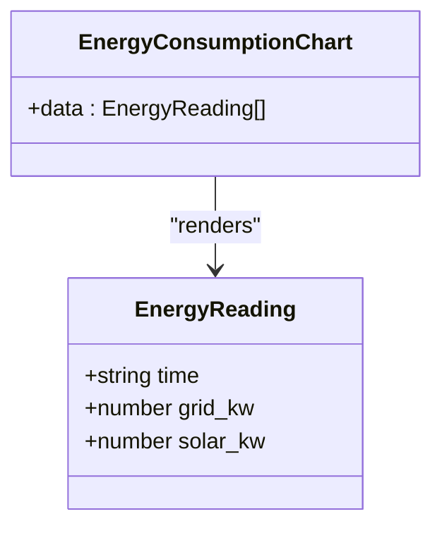
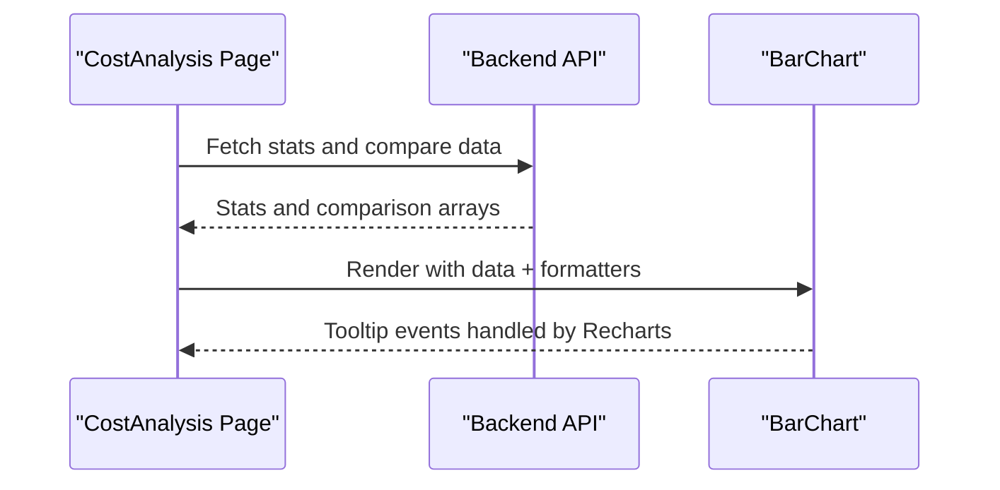
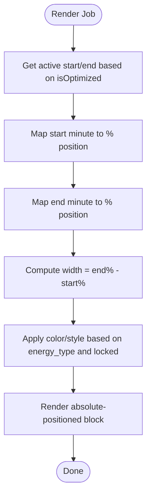
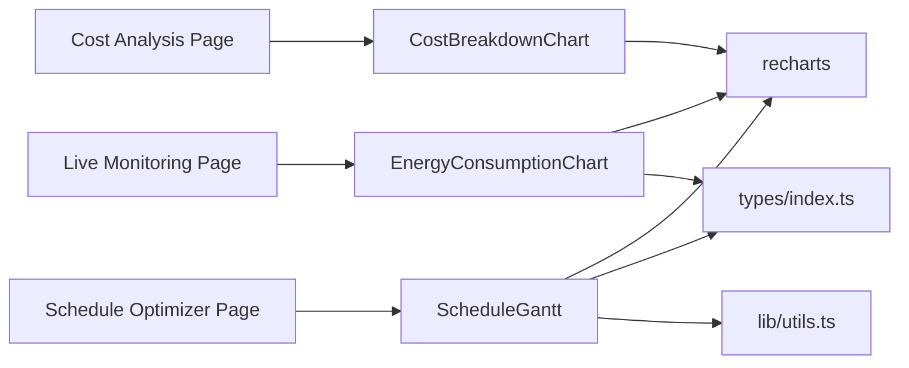

# Charts and Visualizations

<cite>
**Referenced Files in This Document**
- [energy_consumption_chart.tsx](file://frontend/components/charts/energy_consumption_chart.tsx)
- [cost_breakdown_chart.tsx](file://frontend/components/charts/cost_breakdown_chart.tsx)
- [schedule_gantt.tsx](file://frontend/components/charts/schedule_gantt.tsx)
- [index.ts](file://frontend/types/index.ts)
- [live_monitoring/page.tsx](file://frontend/app/dashboard/live_monitoring/page.tsx)
- [cost_analysis/page.tsx](file://frontend/app/dashboard/cost_analysis/page.tsx)
- [schedule_optimizer/page.tsx](file://frontend/app/dashboard/schedule_optimizer/page.tsx)
- [utils.ts](file://frontend/lib/utils.ts)
</cite>

## Table of Contents
1. Introduction
2. Project Structure
3. Core Components
4. Architecture Overview
5. Detailed Component Analysis
6. Dependency Analysis
7. Performance Considerations
8. Troubleshooting Guide
9. Conclusion

## Introduction
This document explains TariffGuard’s chart and visualization components built with Recharts, focusing on:
- Energy Consumption Chart for real-time and historical energy usage patterns
- Cost Breakdown Chart for electricity cost analysis
- Schedule Gantt Chart for production scheduling visualization

It covers configuration options, data formatting requirements, customization capabilities, handling large datasets, responsive design, interactive features (tooltips, zoom, filtering), integration with real-time data streams, event handling, and styling to match the application theme.

## Project Structure
The charts are implemented as reusable React components under frontend/components/charts and consumed by dashboard pages that provide data and user interactions.

**Diagram sources**
- [energy_consumption_chart.tsx:1-65](file://frontend/components/charts/energy_consumption_chart.tsx#L1-L65)
- [cost_breakdown_chart.tsx:1-8](file://frontend/components/charts/cost_breakdown_chart.tsx#L1-L8)
- [schedule_gantt.tsx:1-222](file://frontend/components/charts/schedule_gantt.tsx#L1-L222)
- [index.ts:1-46](file://frontend/types/index.ts#L1-L46)
- [live_monitoring/page.tsx:1-197](file://frontend/app/dashboard/live_monitoring/page.tsx#L1-L197)
- [cost_analysis/page.tsx:1-226](file://frontend/app/dashboard/cost_analysis/page.tsx#L1-L226)
- [schedule_optimizer/page.tsx:1-379](file://frontend/app/dashboard/schedule_optimizer/page.tsx#L1-L379)

**Section sources**
- [energy_consumption_chart.tsx:1-65](file://frontend/components/charts/energy_consumption_chart.tsx#L1-L65)
- [cost_breakdown_chart.tsx:1-8](file://frontend/components/charts/cost_breakdown_chart.tsx#L1-L8)
- [schedule_gantt.tsx:1-222](file://frontend/components/charts/schedule_gantt.tsx#L1-L222)
- [index.ts:1-46](file://frontend/types/index.ts#L1-L46)
- [live_monitoring/page.tsx:1-197](file://frontend/app/dashboard/live_monitoring/page.tsx#L1-L197)
- [cost_analysis/page.tsx:1-226](file://frontend/app/dashboard/cost_analysis/page.tsx#L1-L226)
- [schedule_optimizer/page.tsx:1-379](file://frontend/app/dashboard/schedule_optimizer/page.tsx#L1-L379)

## Core Components
- EnergyConsumptionChart: Area chart showing grid usage and solar generation over time with gradients, tooltips, and legend.
- CostBreakdownChart: Placeholder component awaiting implementation; current page uses inline bar charts for cost comparisons.
- ScheduleGantt: Custom timeline/Gantt view for machine schedules with baseline vs optimized views, hover tooltips, selection, and background shading for solar windows and peak tariff periods.

Key props and types:
- EnergyConsumptionChart expects an array of EnergyReading objects (time, grid_kw, solar_kw).
- ScheduleGantt expects machines, jobs, isOptimized, showBaseline, selectedJobId, and onJobClick callback. Jobs include baseline and optimized start/end times, locked state, and energy_type.

Styling:
- Uses CSS variables for colors and radii to align with the app theme.
- Tooltips and legends styled via Recharts props and Tailwind classes.

**Section sources**
- [energy_consumption_chart.tsx:1-65](file://frontend/components/charts/energy_consumption_chart.tsx#L1-L65)
- [cost_breakdown_chart.tsx:1-8](file://frontend/components/charts/cost_breakdown_chart.tsx#L1-L8)
- [schedule_gantt.tsx:1-222](file://frontend/components/charts/schedule_gantt.tsx#L1-L222)
- [index.ts:1-46](file://frontend/types/index.ts#L1-L46)

## Architecture Overview
Charts are composed using Recharts primitives and wrapped in ResponsiveContainer for responsiveness. Pages supply data and handle events, while components focus on rendering and interactivity.

**Diagram sources**
- [live_monitoring/page.tsx:130-157](file://frontend/app/dashboard/live_monitoring/page.tsx#L130-L157)
- [cost_analysis/page.tsx:116-135](file://frontend/app/dashboard/cost_analysis/page.tsx#L116-L135)
- [energy_consumption_chart.tsx:1-65](file://frontend/components/charts/energy_consumption_chart.tsx#L1-L65)

## Detailed Component Analysis

### Energy Consumption Chart
Purpose:
- Displays real-time and historical energy usage patterns with two series: grid usage and solar generation.

Configuration highlights:
- AreaChart with monotone curves, gradient fills, CartesianGrid, XAxis/YAxis, Tooltip, Legend.
- Y-axis formatted with kW units.
- CSS variable-driven colors for consistent theming.

Data format:
- Array of EnergyReading: { time: string, grid_kw: number, solar_kw: number }

Interactivity:
- Tooltip shows values per point.
- Legend toggles series visibility.

Responsiveness:
- ResponsiveContainer adapts to container size.

Large datasets:
- For many points, consider throttling updates, aggregating into intervals, or enabling domain-based sampling. The current component does not implement built-in zoom; add a brush or zoomable wrapper if needed.

Integration example:
- Live Monitoring page demonstrates similar area charts with ResponsiveContainer and custom tooltips.

**Section sources**
- [energy_consumption_chart.tsx:1-65](file://frontend/components/charts/energy_consumption_chart.tsx#L1-L65)
- [index.ts:41-46](file://frontend/types/index.ts#L41-L46)
- [live_monitoring/page.tsx:139-157](file://frontend/app/dashboard/live_monitoring/page.tsx#L139-L157)

#### Class Diagram

**Diagram sources**
- [energy_consumption_chart.tsx:1-65](file://frontend/components/charts/energy_consumption_chart.tsx#L1-L65)
- [index.ts:41-46](file://frontend/types/index.ts#L41-L46)

### Cost Breakdown Chart
Current state:
- Placeholder component returns a styled placeholder div. Actual cost breakdown visualizations are implemented inline in the Cost Analysis page using Recharts BarChart.

What to implement:
- Accept structured cost data (e.g., daily baseline vs optimized costs, peak/off-peak breakdowns, cost drivers).
- Provide configurable axes, tooltips, legends, and labels.
- Support responsive sizing and theme variables.

Data format suggestions:
- Comparison: [{ day: string, baseline: number, optimized: number }]
- Peak vs Off-Peak: [{ day: string, peak: number, offPeak: number }]
- Cost Drivers: [{ label: string, percent: number }]

Interactivity:
- Tooltips with currency formatting.
- Legends for series.
- Optional drill-down by day.

**Section sources**
- [cost_breakdown_chart.tsx:1-8](file://frontend/components/charts/cost_breakdown_chart.tsx#L1-L8)
- [cost_analysis/page.tsx:116-179](file://frontend/app/dashboard/cost_analysis/page.tsx#L116-L179)

#### Sequence Diagram (Cost Analysis Inline Charts)

**Diagram sources**
- [cost_analysis/page.tsx:56-74](file://frontend/app/dashboard/cost_analysis/page.tsx#L56-L74)
- [cost_analysis/page.tsx:116-135](file://frontend/app/dashboard/cost_analysis/page.tsx#L116-L135)
- [cost_analysis/page.tsx:141-159](file://frontend/app/dashboard/cost_analysis/page.tsx#L141-L159)

### Schedule Gantt Chart
Purpose:
- Visualizes production schedule across machines with baseline and optimized views, highlighting solar windows and peak tariff periods.

Props and behavior:
- machines: list of machines with id, name, type, power_kw.
- jobs: list of jobs with baseline and optimized start/end times, locked status, and energy_type.
- isOptimized: toggles between baseline and optimized bars.
- showBaseline: overlays ghost baseline when comparing.
- selectedJobId and onJobClick: enable selection and highlight.

Interactivity:
- Hover tooltips with job details and time ranges.
- Click to select a job; selection ring and scale applied.
- Background shading indicates solar window and peak tariff period.
- Current time indicator line.

Data format:
- Job: { id, machineId, name, baseline_start, baseline_end, optimized_start, optimized_end, locked, energy_type }
- Time represented in minutes from midnight; component maps to percentage positions within a fixed window (06:00–22:00).

Customization:
- Colors derived from CSS variables and Tailwind utilities.
- Use cn utility for conditional class merging.

Performance:
- Rendering is DOM-based; for very large numbers of jobs, consider virtualization or limiting visible rows via filters.

Filtering:
- Parent page provides machine filter dropdown; pass filtered machines to the component.

**Section sources**
- [schedule_gantt.tsx:1-222](file://frontend/components/charts/schedule_gantt.tsx#L1-L222)
- [schedule_optimizer/page.tsx:1-379](file://frontend/app/dashboard/schedule_optimizer/page.tsx#L1-L379)
- [utils.ts:1-10](file://frontend/lib/utils.ts#L1-L10)

#### Flowchart (Gantt Positioning Logic)

**Diagram sources**
- [schedule_gantt.tsx:27-40](file://frontend/components/charts/schedule_gantt.tsx#L27-L40)
- [schedule_gantt.tsx:111-173](file://frontend/components/charts/schedule_gantt.tsx#L111-L173)

## Dependency Analysis
- Components depend on Recharts primitives (AreaChart, BarChart, ResponsiveContainer, Tooltip, Legend, etc.).
- Types are centralized in index.ts and imported where needed.
- Utility function cn merges Tailwind classes safely.
- Pages orchestrate data fetching and pass props to components.

**Diagram sources**
- [energy_consumption_chart.tsx:1-65](file://frontend/components/charts/energy_consumption_chart.tsx#L1-L65)
- [cost_breakdown_chart.tsx:1-8](file://frontend/components/charts/cost_breakdown_chart.tsx#L1-L8)
- [schedule_gantt.tsx:1-222](file://frontend/components/charts/schedule_gantt.tsx#L1-L222)
- [index.ts:1-46](file://frontend/types/index.ts#L1-L46)
- [utils.ts:1-10](file://frontend/lib/utils.ts#L1-L10)
- [live_monitoring/page.tsx:1-197](file://frontend/app/dashboard/live_monitoring/page.tsx#L1-L197)
- [cost_analysis/page.tsx:1-226](file://frontend/app/dashboard/cost_analysis/page.tsx#L1-L226)
- [schedule_optimizer/page.tsx:1-379](file://frontend/app/dashboard/schedule_optimizer/page.tsx#L1-L379)

**Section sources**
- [energy_consumption_chart.tsx:1-65](file://frontend/components/charts/energy_consumption_chart.tsx#L1-L65)
- [cost_breakdown_chart.tsx:1-8](file://frontend/components/charts/cost_breakdown_chart.tsx#L1-L8)
- [schedule_gantt.tsx:1-222](file://frontend/components/charts/schedule_gantt.tsx#L1-L222)
- [index.ts:1-46](file://frontend/types/index.ts#L1-L46)
- [utils.ts:1-10](file://frontend/lib/utils.ts#L1-L10)
- [live_monitoring/page.tsx:1-197](file://frontend/app/dashboard/live_monitoring/page.tsx#L1-L197)
- [cost_analysis/page.tsx:1-226](file://frontend/app/dashboard/cost_analysis/page.tsx#L1-L226)
- [schedule_optimizer/page.tsx:1-379](file://frontend/app/dashboard/schedule_optimizer/page.tsx#L1-L379)

## Performance Considerations
- Large datasets:
  - Aggregate or downsample time-series data before rendering to avoid heavy DOM updates.
  - Use domain limits or brushing to focus on relevant time windows.
  - Debounce frequent updates for live streams.
- Responsiveness:
  - Wrap charts in ResponsiveContainer to adapt to container changes.
- Interactivity:
  - Keep tooltip content minimal; avoid heavy computations inside render.
  - Use memoization for expensive derived data in parent components.
- Scheduling Gantt:
  - Limit visible machines/jobs via filters to reduce layout calculations.
  - Avoid excessive re-renders by stabilizing keys and minimizing prop churn.

[No sources needed since this section provides general guidance]

## Troubleshooting Guide
Common issues and resolutions:
- Empty or malformed data:
  - Ensure data arrays conform to expected shapes (e.g., EnergyReading fields present).
  - Validate numeric fields for charts to prevent rendering errors.
- Tooltip not showing:
  - Confirm Tooltip is included and data has valid keys.
  - Check that ResponsiveContainer has explicit height/width.
- Gantt misalignment:
  - Verify time values are in minutes and within the configured window (06:00–22:00).
  - Ensure baseline and optimized times are ordered correctly (start < end).
- Styling inconsistencies:
  - Ensure CSS variables used in charts are defined in the global theme.
  - Use cn utility for dynamic classes to avoid conflicts.

**Section sources**
- [energy_consumption_chart.tsx:1-65](file://frontend/components/charts/energy_consumption_chart.tsx#L1-L65)
- [schedule_gantt.tsx:27-40](file://frontend/components/charts/schedule_gantt.tsx#L27-L40)
- [schedule_gantt.tsx:111-173](file://frontend/components/charts/schedule_gantt.tsx#L111-L173)
- [cost_analysis/page.tsx:116-179](file://frontend/app/dashboard/cost_analysis/page.tsx#L116-L179)

## Conclusion
TariffGuard’s visualization layer leverages Recharts for robust, responsive charts and a custom Gantt for production scheduling. The EnergyConsumptionChart provides clear insights into grid and solar usage, while the Cost Analysis page demonstrates effective cost breakdowns using bar charts. The ScheduleGantt enables operators to visualize and interact with optimized schedules, including baseline comparisons and contextual indicators like solar windows and peak tariffs. By following the documented data formats, configuration options, and performance tips, teams can extend these components to support additional metrics, real-time streaming, and advanced interactions such as zoom and filtering.

[No sources needed since this section summarizes without analyzing specific files]