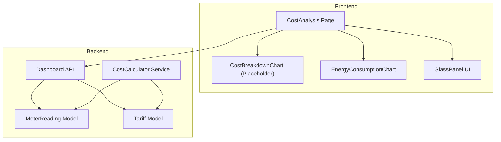
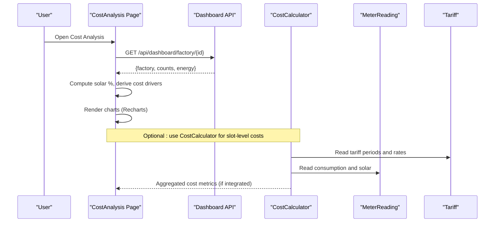
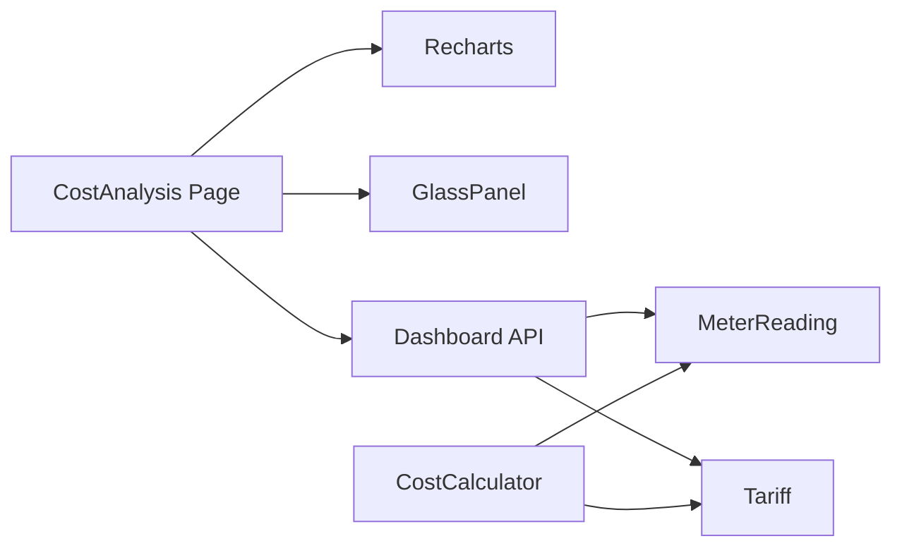

# Cost Breakdown Chart

<cite>
**Referenced Files in This Document**
- [cost_breakdown_chart.tsx](file://frontend/components/charts/cost_breakdown_chart.tsx)
- [page.tsx](file://frontend/app/dashboard/cost_analysis/page.tsx)
- [energy_consumption_chart.tsx](file://frontend/components/charts/energy_consumption_chart.tsx)
- [glass_panel.tsx](file://frontend/components/ui/glass_panel.tsx)
- [index.ts](file://frontend/types/index.ts)
- [cost_calculator.py](file://backend/app/services/cost_calculator.py)
- [dashboard.py](file://backend/app/api/dashboard.py)
- [meter_reading.py](file://backend/app/models/meter_reading.py)
- [tariff.py](file://backend/app/models/tariff.py)
</cite>

## Table of Contents
1. [Introduction](#introduction)
2. [Project Structure](#project-structure)
3. [Core Components](#core-components)
4. [Architecture Overview](#architecture-overview)
5. [Detailed Component Analysis](#detailed-component-analysis)
6. [Dependency Analysis](#dependency-analysis)
7. [Performance Considerations](#performance-considerations)
8. [Troubleshooting Guide](#troubleshooting-guide)
9. [Conclusion](#conclusion)
10. [Appendices](#appendices)

## Introduction
This document provides comprehensive documentation for the CostBreakdownChart component and its integration within the TariffGuard cost analysis workflow. It explains how to visualize electricity cost components (base rates, peak demand charges, solar offsets), define data structures for categories and time periods, configure chart appearance (colors, legend, tooltips with currency formatting), integrate with backend cost calculation services, handle dynamic updates, implement drill-downs, and ensure responsive, accessible, and customizable behavior.

## Project Structure
The cost analysis feature spans both frontend and backend:
- Frontend page orchestrates charts and displays derived metrics.
- A placeholder component exists for the dedicated CostBreakdownChart.
- Backend provides a cost calculator service and API endpoints that supply energy statistics used by the frontend.

**Diagram sources**
- [page.tsx:1-226](file://frontend/app/dashboard/cost_analysis/page.tsx#L1-L226)
- [cost_breakdown_chart.tsx:1-8](file://frontend/components/charts/cost_breakdown_chart.tsx#L1-L8)
- [energy_consumption_chart.tsx:1-65](file://frontend/components/charts/energy_consumption_chart.tsx#L1-L65)
- [glass_panel.tsx:1-20](file://frontend/components/ui/glass_panel.tsx#L1-L20)
- [dashboard.py:1-79](file://backend/app/api/dashboard.py#L1-L79)
- [cost_calculator.py:1-110](file://backend/app/services/cost_calculator.py#L1-L110)
- [meter_reading.py:1-17](file://backend/app/models/meter_reading.py#L1-L17)
- [tariff.py:1-19](file://backend/app/models/tariff.py#L1-L19)

**Section sources**
- [page.tsx:1-226](file://frontend/app/dashboard/cost_analysis/page.tsx#L1-L226)
- [cost_breakdown_chart.tsx:1-8](file://frontend/components/charts/cost_breakdown_chart.tsx#L1-L8)
- [dashboard.py:1-79](file://backend/app/api/dashboard.py#L1-L79)
- [cost_calculator.py:1-110](file://backend/app/services/cost_calculator.py#L1-L110)

## Core Components
- CostBreakdownChart: A placeholder component currently rendering a styled container. It is intended to host a detailed breakdown visualization of electricity costs.
- CostAnalysis Page: Implements multiple charts and panels using Recharts, including comparison bars, stacked peak/off-peak bars, and a cost drivers panel. It fetches dashboard stats and uses mock fallbacks when APIs do not provide required series.
- EnergyConsumptionChart: An area chart demonstrating recharts usage patterns (gradients, tooltip styling, legends).
- GlassPanel: A reusable UI wrapper providing consistent glassmorphism styling.

Key responsibilities:
- Fetching and preparing data for visualization.
- Configuring chart options (colors, legends, tooltips, axis formatting).
- Presenting cost insights and recommendations.

**Section sources**
- [cost_breakdown_chart.tsx:1-8](file://frontend/components/charts/cost_breakdown_chart.tsx#L1-L8)
- [page.tsx:1-226](file://frontend/app/dashboard/cost_analysis/page.tsx#L1-L226)
- [energy_consumption_chart.tsx:1-65](file://frontend/components/charts/energy_consumption_chart.tsx#L1-L65)
- [glass_panel.tsx:1-20](file://frontend/components/ui/glass_panel.tsx#L1-L20)

## Architecture Overview
The cost analysis flow integrates frontend charts with backend services:
- The page requests factory dashboard stats and optimization comparisons.
- Derived metrics (e.g., solar percentage) are computed locally to populate cost drivers.
- Charts render using Recharts with custom tooltips and legends.
- The backend cost calculator computes slot-level costs based on tariffs and meter readings.

**Diagram sources**
- [page.tsx:56-74](file://frontend/app/dashboard/cost_analysis/page.tsx#L56-L74)
- [dashboard.py:44-79](file://backend/app/api/dashboard.py#L44-L79)
- [cost_calculator.py:12-90](file://backend/app/services/cost_calculator.py#L12-L90)
- [meter_reading.py:5-17](file://backend/app/models/meter_reading.py#L5-L17)
- [tariff.py:5-19](file://backend/app/models/tariff.py#L5-L19)

## Detailed Component Analysis

### CostBreakdownChart Component
Current state:
- Placeholder implementation returning a styled container.
- Intended to be extended into a full Recharts-based visualization showing base rates, peak demand charges, and solar offsets.

Recommended capabilities:
- Visualization types: stacked bar or grouped bar for cost components; donut/pie for share of total; line overlay for trend if needed.
- Data structure requirements:
  - Categories: array of objects with label, value, color, optional drill-down metadata.
  - Time periods: optional grouping by day/hour/month with timestamps or period names.
  - Monetary values: numeric fields representing PKR amounts; formatted via tooltip formatter.
- Configuration options:
  - Colors: map category to CSS variables or theme tokens.
  - Legend positioning: top, right, bottom, or custom placement.
  - Tooltip formatting: currency display with locale-aware thousands separators and currency symbol.
- Integration points:
  - Use dashboard stats to compute shares (e.g., solar offset %).
  - Optionally consume CostCalculator outputs for granular slot costs.
- Accessibility:
  - Provide aria-labels, role="img", and descriptive titles.
  - Ensure keyboard navigation and focus management for interactive elements.
- Responsive behavior:
  - Use ResponsiveContainer to adapt to container size.
  - Adjust font sizes and legend layout on small screens.

Implementation references:
- Placeholder component definition and styling.
- Patterns from existing charts for Recharts configuration and tooltip styling.

**Section sources**
- [cost_breakdown_chart.tsx:1-8](file://frontend/components/charts/cost_breakdown_chart.tsx#L1-L8)
- [energy_consumption_chart.tsx:1-65](file://frontend/components/charts/energy_consumption_chart.tsx#L1-L65)

### CostAnalysis Page (Integration Context)
Responsibilities:
- Fetches dashboard stats and optimization comparison data.
- Computes cost drivers (including solar offset) and renders charts.
- Demonstrates Recharts usage: ResponsiveContainer, CartesianGrid, X/Y axes, Tooltip formatters, Legend, Bar stacks.

Data handling:
- Uses local mock arrays for weekly comparison and peak/off-peak when backend does not provide those series.
- Derives solar percentage from total kWh and solar kWh to inform cost drivers.

Tooltip and currency formatting:
- Custom tooltip content style and formatter to display PKR values with thousands separators.

Drill-down opportunities:
- Click handlers on bars can navigate to detailed views (e.g., per-day breakdown or machine-level costs).

**Section sources**
- [page.tsx:12-30](file://frontend/app/dashboard/cost_analysis/page.tsx#L12-L30)
- [page.tsx:56-74](file://frontend/app/dashboard/cost_analysis/page.tsx#L56-L74)
- [page.tsx:85-104](file://frontend/app/dashboard/cost_analysis/page.tsx#L85-L104)
- [page.tsx:116-179](file://frontend/app/dashboard/cost_analysis/page.tsx#L116-L179)

### Backend Cost Calculation Service
Purpose:
- Determines applicable tariff rate for a timestamp and calculates slot-level costs.
- Aggregates total kWh, grid kWh, solar kWh, peak kW, total cost, average rate, and slot costs.

Key methods:
- get_tariff_rate: selects rate based on tariff periods, including overnight ranges.
- calculate_slot_cost: returns timestamp, kwh, rate, cost for a single reading.
- calculate_total_cost: aggregates across readings and returns summary plus slot_costs.
- estimate_machine_cost: estimates cost for running a machine for a duration at a given start time.

Integration notes:
- Can be used to produce granular cost breakdowns for the CostBreakdownChart (e.g., base rate vs. peak vs. off-peak vs. solar offset).
- Requires tariff definitions and meter readings to function.

**Section sources**
- [cost_calculator.py:12-110](file://backend/app/services/cost_calculator.py#L12-L110)

### Data Models and Types
- MeterReading: includes timestamp, kwh, kw, solar_kwh, voltage, current, power_factor. Used by cost calculations and dashboard aggregation.
- Tariff: defines period_name, start_time, end_time, rate_pkr_per_kwh, fixed_charge_pkr_per_kw, effective dates, source, verification timestamps.
- Frontend types: include TariffPeriod, EnergyReading, KPI, Alert, Machine, ProductionOrder. Useful for typing chart inputs and API responses.

**Section sources**
- [meter_reading.py:5-17](file://backend/app/models/meter_reading.py#L5-L17)
- [tariff.py:5-19](file://backend/app/models/tariff.py#L5-L19)
- [index.ts:19-46](file://frontend/types/index.ts#L19-L46)

## Dependency Analysis
Component relationships:
- CostAnalysis Page depends on:
  - Dashboard API for energy stats.
  - Recharts for visualization.
  - GlassPanel for consistent card styling.
- CostBreakdownChart (placeholder) is independent but intended to be integrated into the page or other dashboards.
- Backend CostCalculator depends on Tariff and MeterReading models to compute costs.

**Diagram sources**
- [page.tsx:1-226](file://frontend/app/dashboard/cost_analysis/page.tsx#L1-L226)
- [dashboard.py:1-79](file://backend/app/api/dashboard.py#L1-L79)
- [cost_calculator.py:1-110](file://backend/app/services/cost_calculator.py#L1-L110)
- [meter_reading.py:1-17](file://backend/app/models/meter_reading.py#L1-L17)
- [tariff.py:1-19](file://backend/app/models/tariff.py#L1-L19)

**Section sources**
- [page.tsx:1-226](file://frontend/app/dashboard/cost_analysis/page.tsx#L1-L226)
- [dashboard.py:1-79](file://backend/app/api/dashboard.py#L1-L79)
- [cost_calculator.py:1-110](file://backend/app/services/cost_calculator.py#L1-L110)

## Performance Considerations
- Prefer server-side aggregation where possible to reduce payload size.
- Use memoization for expensive computations (e.g., cost driver percentages) when data changes frequently.
- Limit chart series to relevant time windows; paginate or aggregate daily/hourly data for large datasets.
- Avoid excessive re-renders by stabilizing props and using React.memo for chart wrappers.
- Optimize tooltip rendering by minimizing heavy computations inside formatter functions.

[No sources needed since this section provides general guidance]

## Troubleshooting Guide
Common issues and resolutions:
- Missing API data: The page logs a warning and falls back to mock arrays when certain series are unavailable. Ensure backend endpoints return expected fields or adjust frontend logic accordingly.
- Incorrect currency formatting: Verify tooltip formatter outputs correct thousands separators and currency symbols.
- Chart responsiveness: Confirm ResponsiveContainer dimensions and parent sizing; ensure no fixed heights conflict with dynamic content.
- Accessibility: Add aria attributes and labels to charts; test with screen readers and keyboard navigation.

**Section sources**
- [page.tsx:56-74](file://frontend/app/dashboard/cost_analysis/page.tsx#L56-L74)
- [page.tsx:124-128](file://frontend/app/dashboard/cost_analysis/page.tsx#L124-L128)
- [energy_consumption_chart.tsx:35-43](file://frontend/components/charts/energy_consumption_chart.tsx#L35-L43)

## Conclusion
The CostBreakdownChart is currently a placeholder ready to be implemented as a full-featured Recharts visualization. The surrounding CostAnalysis page demonstrates best practices for chart configuration, data derivation, and UI composition. By integrating with the backend CostCalculator and leveraging dashboard stats, you can deliver a robust, responsive, and accessible cost breakdown experience with clear currency formatting and actionable insights.

[No sources needed since this section summarizes without analyzing specific files]

## Appendices

### Data Structure Requirements
- Cost categories:
  - label: string (e.g., "Base Rate", "Peak Demand Charge", "Solar Offset")
  - value: number (PKR amount)
  - color: string (theme token or CSS variable)
  - metadata?: object (for drill-down details)
- Time periods:
  - period_name: string (e.g., "Mon", "Peak", "Off-Peak")
  - timestamp?: datetime (for precise slot mapping)
- Monetary values:
  - numeric fields for kwh, kw, solar_kwh, cost; formatted via tooltip formatter to PKR.

**Section sources**
- [index.ts:19-46](file://frontend/types/index.ts#L19-L46)
- [meter_reading.py:5-17](file://backend/app/models/meter_reading.py#L5-L17)
- [tariff.py:5-19](file://backend/app/models/tariff.py#L5-L19)

### Chart Configuration Options
- Color schemes:
  - Use CSS variables for consistency (e.g., --color-success, --color-warning, --color-energy).
- Legend positioning:
  - Place legend top/right/bottom; adjust wrapper styles for readability.
- Tooltip formatting:
  - Apply formatter to display PKR with thousands separators; customize background and border for clarity.

**Section sources**
- [page.tsx:124-128](file://frontend/app/dashboard/cost_analysis/page.tsx#L124-L128)
- [energy_consumption_chart.tsx:35-43](file://frontend/components/charts/energy_consumption_chart.tsx#L35-L43)

### Integration Examples
- Fetch dashboard stats and compute solar percentage to populate cost drivers.
- Use CostCalculator.calculate_total_cost to obtain aggregated metrics and slot_costs for detailed breakdowns.
- Map slot_costs to chart series (base rate, peak, off-peak, solar offset) for granular visualization.

**Section sources**
- [page.tsx:56-74](file://frontend/app/dashboard/cost_analysis/page.tsx#L56-L74)
- [page.tsx:85-104](file://frontend/app/dashboard/cost_analysis/page.tsx#L85-L104)
- [cost_calculator.py:52-90](file://backend/app/services/cost_calculator.py#L52-L90)

### Dynamic Updates and Drill-Down
- Dynamic updates:
  - Subscribe to real-time or periodic updates for meter readings; recompute cost drivers and refresh charts.
- Drill-down:
  - Implement click handlers on chart segments to navigate to detailed views (e.g., per-machine costs, hourly breakdowns).
  - Pass selected segment metadata to detail components for focused analysis.

[No sources needed since this section provides general guidance]

### Responsive Behavior and Accessibility
- Responsive:
  - Wrap charts in ResponsiveContainer; ensure parent containers have defined dimensions.
- Accessibility:
  - Provide aria-labels and roles for charts; ensure keyboard navigability and screen reader support.
  - Use high-contrast colors and readable fonts.

**Section sources**
- [energy_consumption_chart.tsx:8-10](file://frontend/components/charts/energy_consumption_chart.tsx#L8-L10)
- [energy_consumption_chart.tsx:35-43](file://frontend/components/charts/energy_consumption_chart.tsx#L35-L43)

### Styling Customization
- Use GlassPanel for consistent card styling.
- Leverage CSS variables for theme-driven colors and radii.
- Customize tooltip styles for better contrast and readability.

**Section sources**
- [glass_panel.tsx:1-20](file://frontend/components/ui/glass_panel.tsx#L1-L20)
- [page.tsx:116-179](file://frontend/app/dashboard/cost_analysis/page.tsx#L116-L179)