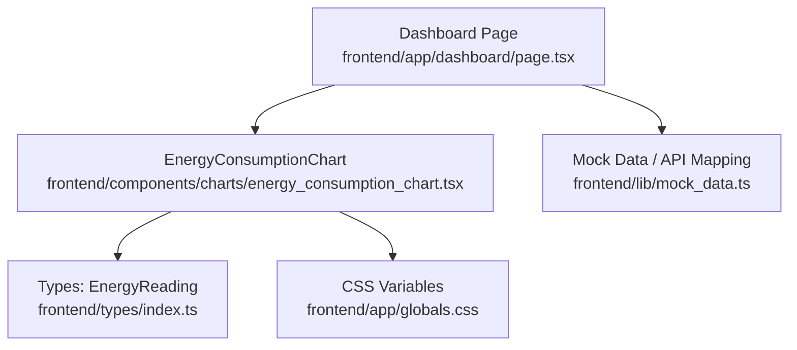
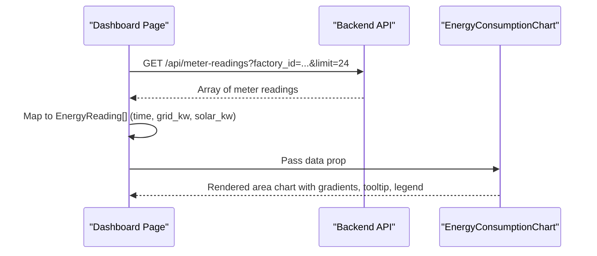
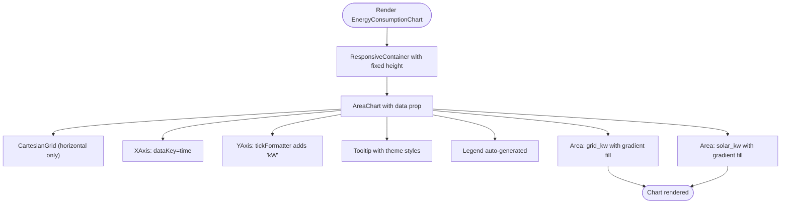
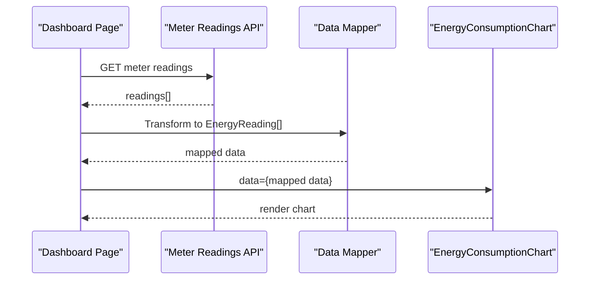
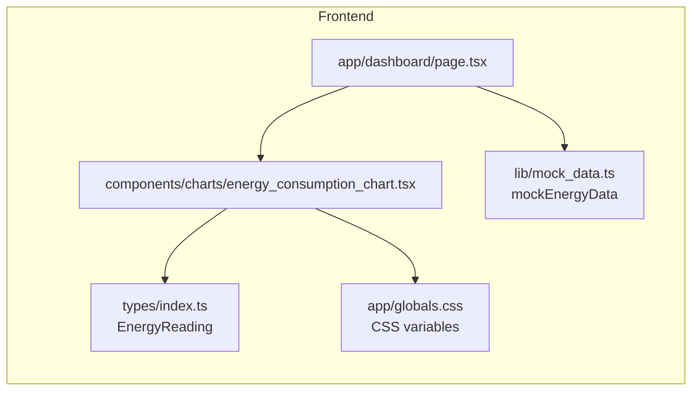

# Energy Consumption Chart

<cite>
**Referenced Files in This Document**
- [energy_consumption_chart.tsx](file://frontend/components/charts/energy_consumption_chart.tsx)
- [index.ts](file://frontend/types/index.ts)
- [page.tsx](file://frontend/app/dashboard/page.tsx)
- [mock_data.ts](file://frontend/lib/mock_data.ts)
- [globals.css](file://frontend/app/globals.css)
</cite>

## Table of Contents
1. [Introduction](#introduction)
2. [Project Structure](#project-structure)
3. [Core Components](#core-components)
4. [Architecture Overview](#architecture-overview)
5. [Detailed Component Analysis](#detailed-component-analysis)
6. [Dependency Analysis](#dependency-analysis)
7. [Performance Considerations](#performance-considerations)
8. [Troubleshooting Guide](#troubleshooting-guide)
9. [Conclusion](#conclusion)
10. [Appendices](#appendices)

## Introduction
The EnergyConsumptionChart component renders a responsive area chart that visualizes real-time and historical energy consumption over time. It displays two series: grid usage (kW) and solar generation (kW), with gradient fills, tooltips, and a legend. The chart is integrated into the dashboard to show the last 24 hours of energy data fetched from the backend or provided via mock data.

## Project Structure
The chart lives under the frontend components and consumes typed data defined in the shared types file. It is used by the dashboard page, which fetches meter readings and maps them to the chart’s expected shape. Styling uses CSS variables for consistent theming across the application.

**Diagram sources**
- [page.tsx:6-140](file://frontend/app/dashboard/page.tsx#L6-L140)
- [energy_consumption_chart.tsx:1-65](file://frontend/components/charts/energy_consumption_chart.tsx#L1-L65)
- [index.ts:41-45](file://frontend/types/index.ts#L41-L45)
- [globals.css:1-40](file://frontend/app/globals.css#L1-L40)
- [mock_data.ts:46-59](file://frontend/lib/mock_data.ts#L46-L59)

**Section sources**
- [energy_consumption_chart.tsx:1-65](file://frontend/components/charts/energy_consumption_chart.tsx#L1-L65)
- [page.tsx:1-172](file://frontend/app/dashboard/page.tsx#L1-L172)
- [index.ts:41-45](file://frontend/types/index.ts#L41-L45)
- [globals.css:1-40](file://frontend/app/globals.css#L1-L40)
- [mock_data.ts:46-59](file://frontend/lib/mock_data.ts#L46-L59)

## Core Components
- EnergyConsumptionChart: Renders an AreaChart with two areas (grid_kw and solar_kw), gradient fills, tooltip, legend, and axes.
- EnergyReading interface: Defines the required data shape with time, grid_kw, and solar_kw.
- Dashboard integration: Fetches meter readings, maps them to EnergyReading[], and passes to the chart.

Key responsibilities:
- Visualize power (kW) over time using area-based charts.
- Provide interactive tooltips and legends.
- Use CSS variables for colors and styling.

**Section sources**
- [energy_consumption_chart.tsx:1-65](file://frontend/components/charts/energy_consumption_chart.tsx#L1-L65)
- [index.ts:41-45](file://frontend/types/index.ts#L41-L45)
- [page.tsx:16-62](file://frontend/app/dashboard/page.tsx#L16-L62)

## Architecture Overview
The dashboard page retrieves meter readings and transforms them into the EnergyReading[] format expected by the chart. The chart then renders the data with Recharts primitives.

**Diagram sources**
- [page.tsx:21-47](file://frontend/app/dashboard/page.tsx#L21-L47)
- [energy_consumption_chart.tsx:5-64](file://frontend/components/charts/energy_consumption_chart.tsx#L5-L64)

## Detailed Component Analysis

### Data Model: EnergyReading
- time: string — X-axis label representing the timestamp (e.g., formatted hour:minute).
- grid_kw: number — Grid consumption in kilowatts at that time.
- solar_kw: number — Solar generation in kilowatts at that time.

This interface ensures consistent data flow from the dashboard mapping layer into the chart.

**Section sources**
- [index.ts:41-45](file://frontend/types/index.ts#L41-L45)

### Chart Rendering and Configuration
- Container: ResponsiveContainer adapts to parent width/height; fixed height class applied to container div.
- Axes:
  - XAxis bound to time field; styled with muted text color and no tick lines/axis line.
  - YAxis shows values with kW suffix via tickFormatter; styled similarly.
- Series:
  - Two Area elements: grid_kw and solar_kw.
  - Monotone curve type for smooth visualization.
  - Gradient fills defined via defs with CSS variables for colors and opacity stops.
- Interactivity:
  - Tooltip with themed background, border, radius, and shadow.
  - Legend automatically generated from series names.

**Diagram sources**
- [energy_consumption_chart.tsx:7-61](file://frontend/components/charts/energy_consumption_chart.tsx#L7-L61)

**Section sources**
- [energy_consumption_chart.tsx:7-61](file://frontend/components/charts/energy_consumption_chart.tsx#L7-L61)

### Styling and Theming
- Colors are driven by CSS variables:
  - --color-energy for grid usage stroke and gradient.
  - --color-success for solar generation stroke and gradient.
  - --color-text-muted for axis text.
  - --color-background-soft for tooltip background.
  - --radius-sm for tooltip border radius.
  - --color-neutral for tooltip border.
- These variables are defined in the global stylesheet and consumed directly in the chart’s inline styles and gradients.

**Section sources**
- [globals.css:1-40](file://frontend/app/globals.css#L1-L40)
- [energy_consumption_chart.tsx:10-42](file://frontend/components/charts/energy_consumption_chart.tsx#L10-L42)

### Integration with Dashboard and Data Mapping
- The dashboard fetches meter readings and maps each reading to EnergyReading:
  - time: formatted local time string.
  - grid_kw: rounded value from meter kw.
  - solar_kw: rounded value from meter solar_kwh (used as kW proxy in mapping).
- If no readings are available, it falls back to mock energy data.

**Diagram sources**
- [page.tsx:21-47](file://frontend/app/dashboard/page.tsx#L21-L47)
- [energy_consumption_chart.tsx:5-64](file://frontend/components/charts/energy_consumption_chart.tsx#L5-L64)

**Section sources**
- [page.tsx:21-47](file://frontend/app/dashboard/page.tsx#L21-L47)
- [mock_data.ts:46-59](file://frontend/lib/mock_data.ts#L46-L59)

### X-Axis Time Formatting
- XAxis uses the time field directly from data.
- In the dashboard, time is formatted to a localized hour:minute string before passing to the chart.
- No additional formatter is set on XAxis; formatting occurs upstream in the dashboard mapping.

**Section sources**
- [energy_consumption_chart.tsx:21-27](file://frontend/components/charts/energy_consumption_chart.tsx#L21-L27)
- [page.tsx:41-46](file://frontend/app/dashboard/page.tsx#L41-L46)

### Y-Axis Power Measurements
- YAxis displays numeric values with a “kW” suffix via tickFormatter.
- Values correspond to power in kilowatts for both grid usage and solar generation.

**Section sources**
- [energy_consumption_chart.tsx:28-34](file://frontend/components/charts/energy_consumption_chart.tsx#L28-L34)

### Interactive Features
- Tooltip: Themed background, border, radius, and shadow; displays values for both series at the hovered time point.
- Legend: Automatically generated from series names (“Grid Usage (kW)” and “Solar Generation (kW)”).

**Section sources**
- [energy_consumption_chart.tsx:35-43](file://frontend/components/charts/energy_consumption_chart.tsx#L35-L43)

## Dependency Analysis
- EnergyConsumptionChart depends on:
  - Recharts primitives: ResponsiveContainer, AreaChart, Area, XAxis, YAxis, CartesianGrid, Tooltip, Legend.
  - Types: EnergyReading from shared types.
  - CSS variables for styling.
- Dashboard depends on:
  - API client to fetch meter readings.
  - Mock data fallback when API returns empty.
  - Styles and layout components.

**Diagram sources**
- [energy_consumption_chart.tsx:1-65](file://frontend/components/charts/energy_consumption_chart.tsx#L1-L65)
- [index.ts:41-45](file://frontend/types/index.ts#L41-L45)
- [page.tsx:1-172](file://frontend/app/dashboard/page.tsx#L1-L172)
- [globals.css:1-40](file://frontend/app/globals.css#L1-L40)
- [mock_data.ts:46-59](file://frontend/lib/mock_data.ts#L46-L59)

**Section sources**
- [energy_consumption_chart.tsx:1-65](file://frontend/components/charts/energy_consumption_chart.tsx#L1-L65)
- [page.tsx:1-172](file://frontend/app/dashboard/page.tsx#L1-L172)
- [index.ts:41-45](file://frontend/types/index.ts#L41-L45)
- [globals.css:1-40](file://frontend/app/globals.css#L1-L40)
- [mock_data.ts:46-59](file://frontend/lib/mock_data.ts#L46-L59)

## Performance Considerations
- Data volume: For large datasets, consider limiting the number of points shown (e.g., last N hours) and aggregating older data to reduce rendering overhead.
- Responsiveness: ResponsiveContainer recalculates dimensions on resize; avoid excessive re-renders by memoizing derived data if needed.
- Gradients and tooltips: Keep gradient definitions minimal and reuse IDs; custom tooltip content should be lightweight.

[No sources needed since this section provides general guidance]

## Troubleshooting Guide
- Missing or incorrect data keys: Ensure data items include time, grid_kw, and solar_kw fields matching the EnergyReading interface.
- Empty chart: Verify that the dashboard mapping produces non-empty arrays and that time strings are valid.
- Styling issues: Confirm CSS variables (--color-energy, --color-success, --color-text-muted, --color-background-soft, --radius-sm, --color-neutral) are defined in the global stylesheet.
- Tooltip not visible: Check that ResponsiveContainer has a defined height and that no overlay blocks pointer events.

**Section sources**
- [energy_consumption_chart.tsx:7-61](file://frontend/components/charts/energy_consumption_chart.tsx#L7-L61)
- [globals.css:1-40](file://frontend/app/globals.css#L1-L40)
- [page.tsx:41-47](file://frontend/app/dashboard/page.tsx#L41-L47)

## Conclusion
The EnergyConsumptionChart provides a clear, responsive visualization of grid usage and solar generation over time. It relies on a simple, well-defined data structure and leverages CSS variables for consistent theming. Integration with the dashboard demonstrates how to map backend meter readings into the chart’s expected format and handle fallbacks. With careful data management and optional optimizations, the chart can effectively support real-time and historical energy monitoring.

[No sources needed since this section summarizes without analyzing specific files]

## Appendices

### Configuration Options Summary
- Container: Fixed height class and full-width responsive container.
- Axes:
  - XAxis: Bound to time; styled with muted text and no tick/axis lines.
  - YAxis: Displays kW units via tickFormatter.
- Series:
  - Areas use monotone curves and gradient fills based on CSS variables.
- Interactivity:
  - Tooltip with themed styling.
  - Legend auto-generated from series names.

**Section sources**
- [energy_consumption_chart.tsx:7-61](file://frontend/components/charts/energy_consumption_chart.tsx#L7-L61)
- [globals.css:1-40](file://frontend/app/globals.css#L1-L40)