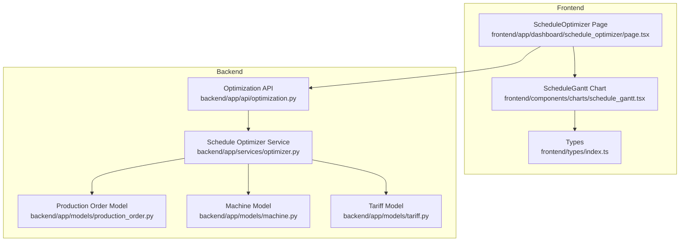
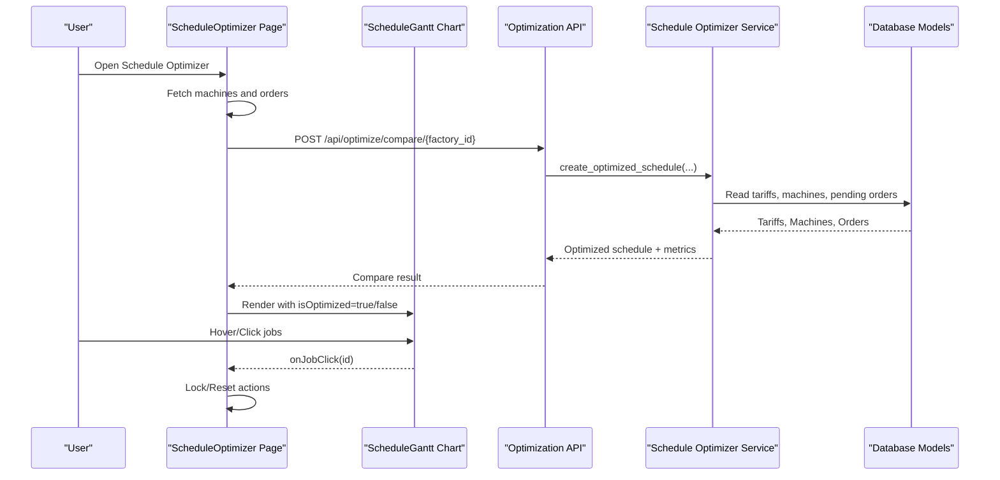
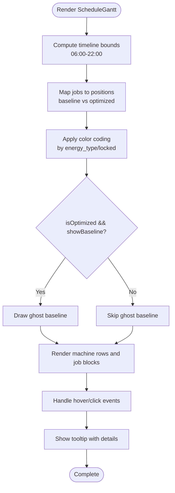
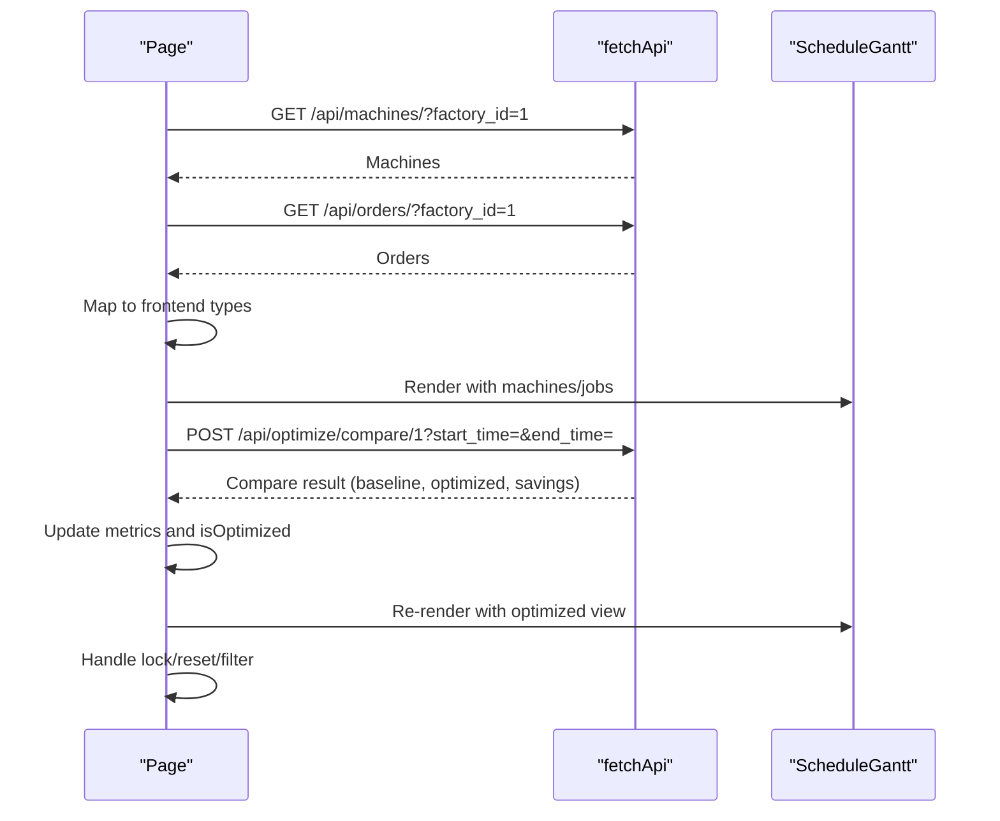
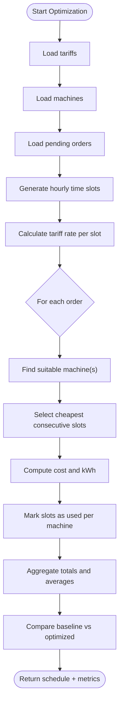
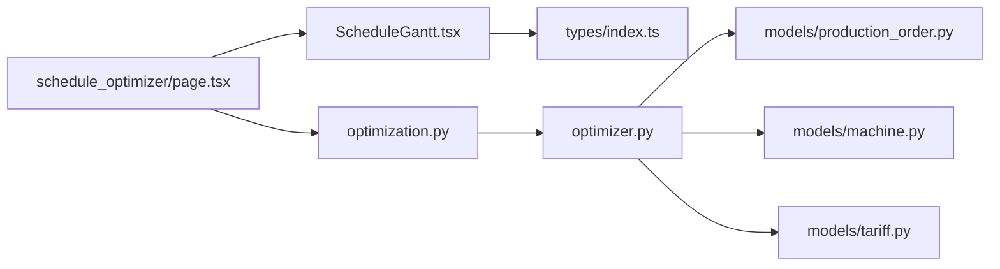

# Schedule Gantt Chart

<cite>
**Referenced Files in This Document**
- [schedule_gantt.tsx](file://frontend/components/charts/schedule_gantt.tsx)
- [index.ts](file://frontend/types/index.ts)
- [page.tsx](file://frontend/app/dashboard/schedule_optimizer/page.tsx)
- [optimizer.py](file://backend/app/services/optimizer.py)
- [optimization.py](file://backend/app/api/optimization.py)
- [production_order.py](file://backend/app/models/production_order.py)
- [production_order.py](file://backend/app/schemas/production_order.py)
- [machine.py](file://backend/app/models/machine.py)
- [tariff.py](file://backend/app/models/tariff.py)
</cite>

## Table of Contents
1. [Introduction](#introduction)
2. [Project Structure](#project-structure)
3. [Core Components](#core-components)
4. [Architecture Overview](#architecture-overview)
5. [Detailed Component Analysis](#detailed-component-analysis)
6. [Dependency Analysis](#dependency-analysis)
7. [Performance Considerations](#performance-considerations)
8. [Troubleshooting Guide](#troubleshooting-guide)
9. [Conclusion](#conclusion)
10. [Appendices](#appendices)

## Introduction
This document explains the ScheduleGanttChart component that visualizes production schedules and machine utilization timelines. It covers how production orders are mapped to time slots, how optimization results are compared with baseline schedules, and how users interact with the chart to lock or reset jobs. It also documents data structures, configuration options, integration points with optimization services, and performance considerations for large datasets.

## Project Structure
The schedule visualization is implemented as a client-side React component integrated into a dashboard page that orchestrates data fetching, optimization calls, and user interactions. The backend provides models, schemas, and an optimizer service exposed via API endpoints.

**Diagram sources**
- [page.tsx:1-379](file://frontend/app/dashboard/schedule_optimizer/page.tsx#L1-L379)
- [schedule_gantt.tsx:1-222](file://frontend/components/charts/schedule_gantt.tsx#L1-L222)
- [index.ts:1-46](file://frontend/types/index.ts#L1-L46)
- [optimization.py:1-48](file://backend/app/api/optimization.py#L1-L48)
- [optimizer.py:1-238](file://backend/app/services/optimizer.py#L1-L238)
- [production_order.py:1-20](file://backend/app/models/production_order.py#L1-L20)
- [machine.py:1-20](file://backend/app/models/machine.py#L1-L20)
- [tariff.py:1-19](file://backend/app/models/tariff.py#L1-L19)

**Section sources**
- [page.tsx:1-379](file://frontend/app/dashboard/schedule_optimizer/page.tsx#L1-L379)
- [schedule_gantt.tsx:1-222](file://frontend/components/charts/schedule_gantt.tsx#L1-L222)
- [index.ts:1-46](file://frontend/types/index.ts#L1-L46)
- [optimization.py:1-48](file://backend/app/api/optimization.py#L1-L48)
- [optimizer.py:1-238](file://backend/app/services/optimizer.py#L1-L238)
- [production_order.py:1-20](file://backend/app/models/production_order.py#L1-L20)
- [machine.py:1-20](file://backend/app/models/machine.py#L1-L20)
- [tariff.py:1-19](file://backend/app/models/tariff.py#L1-L19)

## Core Components
- ScheduleGanttChart: Renders a horizontal timeline per machine, showing job blocks for baseline and optimized schedules, background shading for solar windows and peak tariffs, current time indicator, tooltips, and selection highlighting.
- ScheduleOptimizer Page: Orchestrates data loading (machines and orders), runs optimization via backend API, toggles between baseline and optimized views, shows cost impact and key movements, and allows locking/resetting jobs.
- Backend Optimization Service: Computes optimal time slots based on tariff rates, assigns orders to suitable machines, calculates costs, and returns comparison metrics between baseline and optimized schedules.

Key responsibilities:
- Data mapping from backend models to frontend Job objects for visualization.
- Timeline scaling and rendering logic for minutes-based positions.
- Visual encoding by energy type and locked status.
- User interactions: click to select, hover for tooltip, toggle baseline visibility, run optimization, lock selected job, reset to initial state.

**Section sources**
- [schedule_gantt.tsx:6-25](file://frontend/components/charts/schedule_gantt.tsx#L6-L25)
- [schedule_gantt.tsx:27-222](file://frontend/components/charts/schedule_gantt.tsx#L27-L222)
- [page.tsx:72-179](file://frontend/app/dashboard/schedule_optimizer/page.tsx#L72-L179)
- [optimizer.py:97-190](file://backend/app/services/optimizer.py#L97-L190)

## Architecture Overview
The system integrates a React-based UI with a FastAPI backend. The frontend fetches machines and orders, optionally triggers optimization, and renders a Gantt chart comparing baseline vs optimized schedules. The backend uses tariff periods and machine power to compute cost-optimal scheduling.

**Diagram sources**
- [page.tsx:84-152](file://frontend/app/dashboard/schedule_optimizer/page.tsx#L84-L152)
- [optimization.py:11-48](file://backend/app/api/optimization.py#L11-L48)
- [optimizer.py:97-190](file://backend/app/services/optimizer.py#L97-L190)
- [schedule_gantt.tsx:111-173](file://frontend/components/charts/schedule_gantt.tsx#L111-L173)

## Detailed Component Analysis

### ScheduleGanttChart
- Timeline scaling: Fixed daily window from 06:00 to 22:00; minute-to-percentage conversion used to position job blocks.
- Background zones: Solar window (morning) and peak tariff (evening) shaded areas; current time vertical line.
- Job blocks: Color-coded by energy_type (energy, solar, locked); locked jobs visually distinct; ghost baseline shown when optimized view displays changes.
- Interactions: Click selects a job; hover shows tooltip with start/end times and status; selection highlights with ring and scale.
- Configuration props:
  - machines: list of machines to render rows.
  - jobs: list of jobs with baseline and optimized times.
  - isOptimized: switch between baseline and optimized display.
  - showBaseline: overlay ghost baseline when optimized is active.
  - selectedJobId: highlight specific job.
  - onJobClick: callback to handle selection.

**Diagram sources**
- [schedule_gantt.tsx:27-41](file://frontend/components/charts/schedule_gantt.tsx#L27-L41)
- [schedule_gantt.tsx:67-89](file://frontend/components/charts/schedule_gantt.tsx#L67-L89)
- [schedule_gantt.tsx:111-173](file://frontend/components/charts/schedule_gantt.tsx#L111-L173)
- [schedule_gantt.tsx:181-218](file://frontend/components/charts/schedule_gantt.tsx#L181-L218)

**Section sources**
- [schedule_gantt.tsx:6-25](file://frontend/components/charts/schedule_gantt.tsx#L6-L25)
- [schedule_gantt.tsx:27-222](file://frontend/components/charts/schedule_gantt.tsx#L27-L222)

### ScheduleOptimizer Page
- Data initialization: Fetches machines and orders; maps backend responses to frontend types; initializes demo jobs for visualization.
- Optimization flow: Calls compare endpoint to get baseline vs optimized metrics; updates state to reflect optimized view; displays savings and key movements.
- User controls: Filter by machine, toggle baseline overlay, lock selected job (role-gated), reset to initial state, run optimization.
- Visualization: Passes filtered machines and jobs to ScheduleGantt; manages selection and interactive states.

**Diagram sources**
- [page.tsx:84-152](file://frontend/app/dashboard/schedule_optimizer/page.tsx#L84-L152)
- [page.tsx:161-179](file://frontend/app/dashboard/schedule_optimizer/page.tsx#L161-L179)
- [page.tsx:263-277](file://frontend/app/dashboard/schedule_optimizer/page.tsx#L263-L277)

**Section sources**
- [page.tsx:72-179](file://frontend/app/dashboard/schedule_optimizer/page.tsx#L72-L179)
- [page.tsx:179-379](file://frontend/app/dashboard/schedule_optimizer/page.tsx#L179-L379)

### Backend Optimization Service
- Time slot generation: Creates hourly slots within a specified window.
- Rate calculation: Maps each slot to tariff rate using configured tariff periods.
- Slot selection: Chooses cheapest consecutive slots for each order’s duration while respecting locked slots.
- Schedule creation: Assigns orders to suitable machines based on process type; computes estimated cost and kWh; aggregates totals and average rate.
- Comparison: Calculates baseline cost assuming peak rate; compares with optimized cost to derive savings amount and percentage.

**Diagram sources**
- [optimizer.py:36-64](file://backend/app/services/optimizer.py#L36-L64)
- [optimizer.py:66-95](file://backend/app/services/optimizer.py#L66-L95)
- [optimizer.py:97-190](file://backend/app/services/optimizer.py#L97-L190)
- [optimizer.py:192-238](file://backend/app/services/optimizer.py#L192-L238)

**Section sources**
- [optimizer.py:1-238](file://backend/app/services/optimizer.py#L1-L238)
- [optimization.py:1-48](file://backend/app/api/optimization.py#L1-L48)

## Dependency Analysis
- Frontend dependencies:
  - ScheduleGantt depends on Machine type and utility functions for styling.
  - ScheduleOptimizer Page depends on fetchApi, UI components, icons, and auth context.
- Backend dependencies:
  - Optimization API depends on database session and Schedule Optimizer service.
  - Schedule Optimizer depends on Tariff, Machine, and ProductionOrder models and CostCalculator.

**Diagram sources**
- [schedule_gantt.tsx:1-5](file://frontend/components/charts/schedule_gantt.tsx#L1-L5)
- [index.ts:1-46](file://frontend/types/index.ts#L1-L46)
- [page.tsx:1-11](file://frontend/app/dashboard/schedule_optimizer/page.tsx#L1-L11)
- [optimization.py:1-48](file://backend/app/api/optimization.py#L1-L48)
- [optimizer.py:1-20](file://backend/app/services/optimizer.py#L1-L20)
- [production_order.py:1-20](file://backend/app/models/production_order.py#L1-L20)
- [machine.py:1-20](file://backend/app/models/machine.py#L1-L20)
- [tariff.py:1-19](file://backend/app/models/tariff.py#L1-L19)

**Section sources**
- [schedule_gantt.tsx:1-5](file://frontend/components/charts/schedule_gantt.tsx#L1-L5)
- [index.ts:1-46](file://frontend/types/index.ts#L1-L46)
- [page.tsx:1-11](file://frontend/app/dashboard/schedule_optimizer/page.tsx#L1-L11)
- [optimization.py:1-48](file://backend/app/api/optimization.py#L1-L48)
- [optimizer.py:1-20](file://backend/app/services/optimizer.py#L1-L20)
- [production_order.py:1-20](file://backend/app/models/production_order.py#L1-L20)
- [machine.py:1-20](file://backend/app/models/machine.py#L1-L20)
- [tariff.py:1-19](file://backend/app/models/tariff.py#L1-L19)

## Performance Considerations
- Rendering efficiency:
  - Jobs are filtered per machine row; ensure minimal re-renders by memoizing derived lists if needed.
  - Avoid excessive DOM nodes; consider virtualization for very large datasets.
- Timeline scaling:
  - Fixed window simplifies calculations; for zoom/pan, implement dynamic start/end minutes and recalculate positions accordingly.
- Large datasets:
  - Batch operations on the backend; paginate or filter orders by factory/status before sending to frontend.
  - Use efficient queries and indexes on foreign keys and status fields.
- Real-time updates:
  - Polling or WebSocket can refresh jobs and metrics; debounce updates to avoid frequent re-renders.
- Export capabilities:
  - Implement CSV/PDF export by serializing visible jobs and metrics; consider server-side generation for large reports.

[No sources needed since this section provides general guidance]

## Troubleshooting Guide
- No jobs displayed:
  - Verify machines and orders are fetched correctly; check mapping to frontend types.
  - Ensure jobs have valid baseline_start/baseline_end within the visible timeline window.
- Baseline not visible:
  - Confirm isOptimized is true and showBaseline is enabled; ghost baseline only appears when optimized differs from baseline.
- Lock button disabled:
  - Role restrictions may prevent locking; verify user role and selection state.
- Optimization errors:
  - Check API response for error messages; validate start_time and end_time parameters; ensure tariffs and machines exist.

**Section sources**
- [page.tsx:123-152](file://frontend/app/dashboard/schedule_optimizer/page.tsx#L123-L152)
- [page.tsx:161-179](file://frontend/app/dashboard/schedule_optimizer/page.tsx#L161-L179)
- [schedule_gantt.tsx:141-173](file://frontend/components/charts/schedule_gantt.tsx#L141-L173)

## Conclusion
The ScheduleGanttChart provides a clear, interactive visualization of production schedules across machines, supporting both baseline and optimized views. Integrated with a backend optimization service, it enables cost-aware scheduling by leveraging tariff periods and machine constraints. The design supports user interactions such as selection, locking, and resetting, with potential extensions for zoom/pan, real-time updates, and report exports.

[No sources needed since this section summarizes without analyzing specific files]

## Appendices

### Data Structures and Requirements
- Job object (frontend):
  - id: string identifier for the job.
  - machineId: number linking to a machine row.
  - name: human-readable job name.
  - baseline_start/baseline_end: minutes from midnight for original schedule.
  - optimized_start/optimized_end: minutes from midnight for proposed schedule.
  - locked: boolean indicating immovable job.
  - energy_type: 'energy' | 'solar' | 'locked' for color coding.
- Machine object (frontend):
  - id, name, type, power_kw, status.
- ProductionOrder model (backend):
  - Fields include order_no, process, quantity, duration_minutes, earliest_start, deadline, priority, machine_options, locked, status.
- Machine model (backend):
  - Fields include name, machine_type, power_kw, min_run_minutes, setup_minutes, shiftable, priority, available_from/to, maintenance_windows.
- Tariff model (backend):
  - Fields include category, period_name, start_time, end_time, rate_pkr_per_kwh, fixed_charge_pkr_per_kw, effective dates, source, verification timestamps.

**Section sources**
- [schedule_gantt.tsx:6-16](file://frontend/components/charts/schedule_gantt.tsx#L6-L16)
- [index.ts:1-46](file://frontend/types/index.ts#L1-L46)
- [production_order.py:5-20](file://backend/app/models/production_order.py#L5-L20)
- [machine.py:5-20](file://backend/app/models/machine.py#L5-L20)
- [tariff.py:5-19](file://backend/app/models/tariff.py#L5-L19)

### Integration Examples
- Running optimization:
  - Call compare endpoint with factory_id and optional time range; update UI state to show optimized view and metrics.
- Handling real-time updates:
  - Periodically refetch orders and machines; apply diffs to jobs; re-render chart efficiently.
- Implementing drag-and-drop rescheduling:
  - Extend Job type with draggable state; capture drop events to adjust baseline/optimized times; send updates to backend to persist changes.

**Section sources**
- [page.tsx:123-152](file://frontend/app/dashboard/schedule_optimizer/page.tsx#L123-L152)
- [optimizer.py:97-190](file://backend/app/services/optimizer.py#L97-L190)