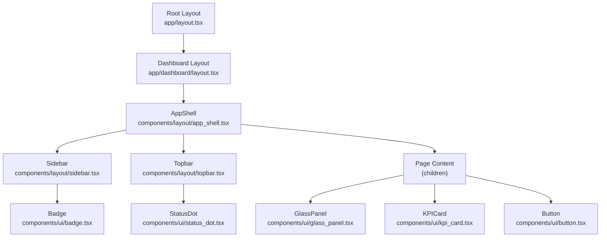
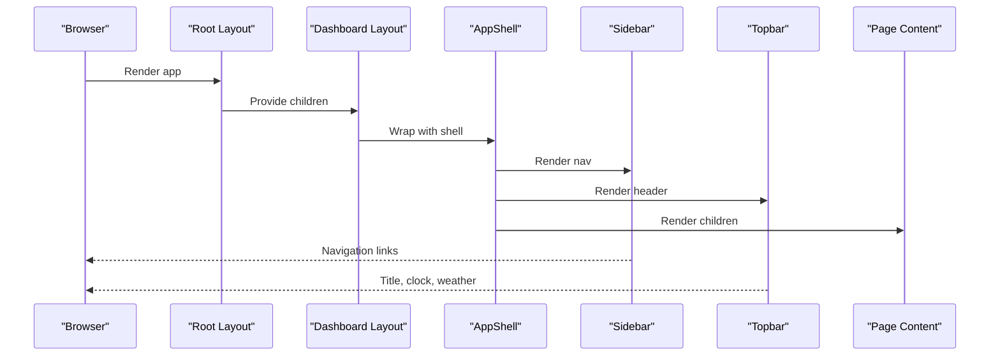
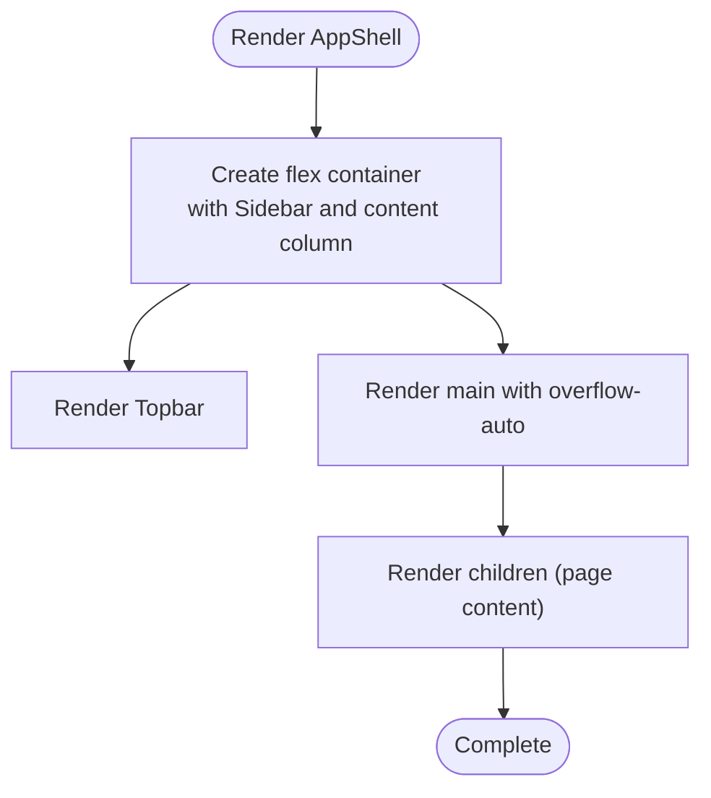
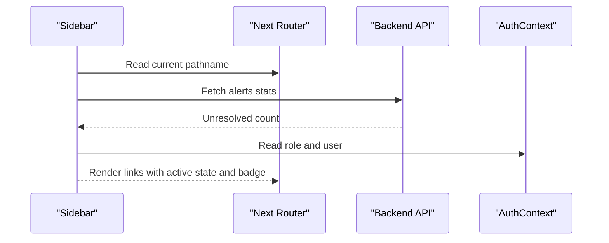
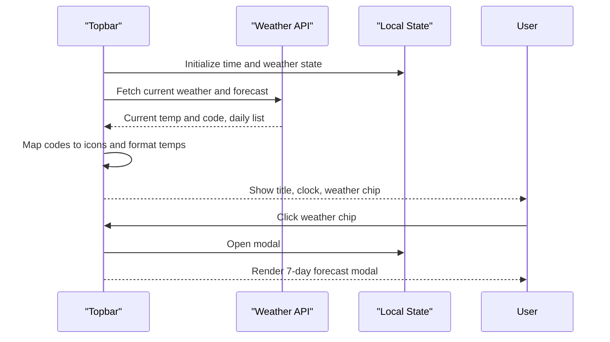
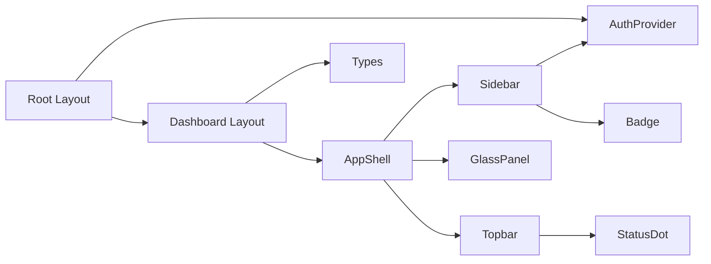

# Component Architecture

<cite>
**Referenced Files in This Document**
- [app_shell.tsx](file://frontend/components/layout/app_shell.tsx)
- [sidebar.tsx](file://frontend/components/layout/sidebar.tsx)
- [topbar.tsx](file://frontend/components/layout/topbar.tsx)
- [kpi_card.tsx](file://frontend/components/ui/kpi_card.tsx)
- [button.tsx](file://frontend/components/ui/button.tsx)
- [glass_panel.tsx](file://frontend/components/ui/glass_panel.tsx)
- [status_dot.tsx](file://frontend/components/ui/status_dot.tsx)
- [badge.tsx](file://frontend/components/ui/badge.tsx)
- [dashboard_layout.tsx](file://frontend/app/dashboard/layout.tsx)
- [root_layout.tsx](file://frontend/app/layout.tsx)
- [auth_context.tsx](file://frontend/context/auth_context.tsx)
- [globals.css](file://frontend/app/globals.css)
- [types_index.ts](file://frontend/types/index.ts)
</cite>

## Table of Contents
1. Introduction
2. Project Structure
3. Core Components
4. Architecture Overview
5. Detailed Component Analysis
6. Dependency Analysis
7. Performance Considerations
8. Troubleshooting Guide
9. Conclusion

## Introduction
This document explains TariffGuard’s React component architecture with a focus on the application shell and reusable UI primitives. It covers how layout components (AppShell, Sidebar, Topbar) compose the page chrome, how UI components (KPI cards, buttons, glass panels, status indicators, badges) are structured and styled, and how they integrate with Next.js routing, authentication context, and Tailwind CSS utilities. It also addresses responsive design, accessibility considerations, and performance techniques used across the components.

## Project Structure
The frontend is organized into:
- Layouts under components/layout that provide the application shell and navigation chrome.
- Reusable UI primitives under components/ui for consistent visual building blocks.
- App-level layouts under app that wrap pages with providers and shells.
- Global styles and theme tokens under app/globals.css.
- Shared types under types to describe domain models consumed by components.

**Diagram sources**
- [root_layout.tsx:10-24](file://frontend/app/layout.tsx#L10-L24)
- [dashboard_layout.tsx:4-9](file://frontend/app/dashboard/layout.tsx#L4-L9)
- [app_shell.tsx:5-16](file://frontend/components/layout/app_shell.tsx#L5-L16)
- [sidebar.tsx:26-96](file://frontend/components/layout/sidebar.tsx#L26-L96)
- [topbar.tsx:19-149](file://frontend/components/layout/topbar.tsx#L19-L149)
- [glass_panel.tsx:10-18](file://frontend/components/ui/glass_panel.tsx#L10-L18)
- [kpi_card.tsx:12-35](file://frontend/components/ui/kpi_card.tsx#L12-L35)
- [button.tsx:8-24](file://frontend/components/ui/button.tsx#L8-L24)
- [badge.tsx:10-26](file://frontend/components/ui/badge.tsx#L10-L26)
- [status_dot.tsx:8-23](file://frontend/components/ui/status_dot.tsx#L8-L23)

**Section sources**
- [root_layout.tsx:10-24](file://frontend/app/layout.tsx#L10-L24)
- [dashboard_layout.tsx:4-9](file://frontend/app/dashboard/layout.tsx#L4-L9)
- [app_shell.tsx:5-16](file://frontend/components/layout/app_shell.tsx#L5-L16)

## Core Components
- Application Shell (AppShell): Composes Sidebar and Topbar around page content, establishing a full-height flex layout with a scrollable main area and glass-styled panels.
- Sidebar: Provides navigation links with active state based on the current pathname, an alerts badge fetched from the API, and a user profile footer.
- Topbar: Displays the current page title derived from the pathname, a live clock, weather widget with a modal forecast, and a plant status indicator.
- UI Primitives:
  - GlassPanel: A themed container with glassmorphism styling; supports card mode via a prop.
  - KPICard: Presents a metric with title, value, optional delta, subtext, and accent color using GlassPanel.
  - Button: A varianted button supporting primary, outline, and ghost styles with accessible attributes.
  - StatusDot: A small dot indicating system status with optional animation.
  - Badge: A small label with variants for default, success, warning, and error states.

These components rely on shared utilities (cn), theme variables, and Tailwind classes defined globally.

**Section sources**
- [app_shell.tsx:5-16](file://frontend/components/layout/app_shell.tsx#L5-L16)
- [sidebar.tsx:26-96](file://frontend/components/layout/sidebar.tsx#L26-L96)
- [topbar.tsx:19-149](file://frontend/components/layout/topbar.tsx#L19-L149)
- [glass_panel.tsx:10-18](file://frontend/components/ui/glass_panel.tsx#L10-L18)
- [kpi_card.tsx:12-35](file://frontend/components/ui/kpi_card.tsx#L12-L35)
- [button.tsx:8-24](file://frontend/components/ui/button.tsx#L8-L24)
- [status_dot.tsx:8-23](file://frontend/components/ui/status_dot.tsx#L8-L23)
- [badge.tsx:10-26](file://frontend/components/ui/badge.tsx#L10-L26)

## Architecture Overview
TariffGuard uses a layered composition model:
- Root layout wraps the app with AuthProvider to supply authentication state.
- Dashboard layout wraps routes with AppShell to provide consistent chrome.
- AppShell composes Sidebar and Topbar and renders page-specific children in a scrollable main area.
- Pages consume UI primitives and data through props and context.

**Diagram sources**
- [root_layout.tsx:10-24](file://frontend/app/layout.tsx#L10-L24)
- [dashboard_layout.tsx:4-9](file://frontend/app/dashboard/layout.tsx#L4-L9)
- [app_shell.tsx:5-16](file://frontend/components/layout/app_shell.tsx#L5-L16)
- [sidebar.tsx:26-96](file://frontend/components/layout/sidebar.tsx#L26-L96)
- [topbar.tsx:19-149](file://frontend/components/layout/topbar.tsx#L19-L149)

## Detailed Component Analysis

### Application Shell (AppShell)
- Purpose: Establishes the application chrome and layout structure for dashboard routes.
- Composition: Renders Sidebar at the left, Topbar at the top, and a scrollable main area for page content.
- Styling: Uses Tailwind utility classes and global glass-panel class for consistent glassmorphism.
- Responsiveness: The flex layout adapts to available space; main area scrolls independently.

**Diagram sources**
- [app_shell.tsx:5-16](file://frontend/components/layout/app_shell.tsx#L5-L16)

**Section sources**
- [app_shell.tsx:5-16](file://frontend/components/layout/app_shell.tsx#L5-L16)

### Sidebar
- Navigation: Maps route entries to links with icons and active-state highlighting based on pathname.
- Alerts Badge: Fetches unresolved alert count and displays it on the Alerts & Anomalies item.
- User Footer: Shows role-based avatar initial and user info from AuthContext.
- Styling: Glass panel with border and rounded corners; active link uses accent color and subtle background.

**Diagram sources**
- [sidebar.tsx:26-96](file://frontend/components/layout/sidebar.tsx#L26-L96)
- [auth_context.tsx:19-87](file://frontend/context/auth_context.tsx#L19-L87)

**Section sources**
- [sidebar.tsx:26-96](file://frontend/components/layout/sidebar.tsx#L26-L96)
- [auth_context.tsx:19-87](file://frontend/context/auth_context.tsx#L19-L87)

### Topbar
- Page Title: Derives a human-readable title from the pathname segments.
- Clock: Updates time every minute.
- Weather Widget: Fetches current weather and a 7-day forecast; opens a modal when clicked.
- Plant Status: Displays a StatusDot indicating online status.
- Modal: Controlled by local state; closes on backdrop click or close button.

**Diagram sources**
- [topbar.tsx:19-149](file://frontend/components/layout/topbar.tsx#L19-L149)

**Section sources**
- [topbar.tsx:19-149](file://frontend/components/layout/topbar.tsx#L19-L149)

### UI Primitives

#### GlassPanel
- Props: children, className, asCard (boolean).
- Behavior: Applies glassmorphism styles via global utility classes; switches between panel and card variants.
- Usage: Base container for KPI cards and other elevated surfaces.

**Section sources**
- [glass_panel.tsx:10-18](file://frontend/components/ui/glass_panel.tsx#L10-L18)

#### KPICard
- Props: title, value, delta (optional), subtext (optional), accentColor (default theme variable).
- Behavior: Displays a metric with an accent stripe, formatted value, optional delta with color coding, and subtext.
- Composition: Wraps content in GlassPanel.

**Section sources**
- [kpi_card.tsx:12-35](file://frontend/components/ui/kpi_card.tsx#L12-L35)

#### Button
- Props: Standard HTML button attributes plus variant (primary | outline | ghost).
- Behavior: Applies base and variant styles; supports disabled state and custom className overrides.
- Accessibility: Inherits native button semantics and focus behavior.

**Section sources**
- [button.tsx:8-24](file://frontend/components/ui/button.tsx#L8-L24)

#### StatusDot
- Props: status (online | offline | warning | idle), animate (boolean).
- Behavior: Renders a colored dot with optional ping animation for non-offline statuses.
- Theming: Colors mapped to theme variables.

**Section sources**
- [status_dot.tsx:8-23](file://frontend/components/ui/status_dot.tsx#L8-L23)

#### Badge
- Props: children, variant (default | success | warning | error), className.
- Behavior: Small label with border and variant-specific colors; suitable for counts and tags.

**Section sources**
- [badge.tsx:10-26](file://frontend/components/ui/badge.tsx#L10-L26)

### Theme and Styling
- Global theme tokens define colors, fonts, radii, and shadows.
- Utility classes implement glassmorphism effects and fabric background.
- Components reference theme variables via CSS custom properties for consistent theming.

**Section sources**
- [globals.css:3-40](file://frontend/app/globals.css#L3-L40)
- [globals.css:42-76](file://frontend/app/globals.css#L42-L76)

## Dependency Analysis
- Root layout provides AuthProvider to all descendants.
- Dashboard layout wraps routes with AppShell.
- AppShell depends on Sidebar and Topbar.
- Sidebar depends on Next.js router, AuthContext, and Badge.
- Topbar depends on StatusDot and local state for modal and weather.
- UI primitives depend on shared cn utility and global theme classes.

**Diagram sources**
- [root_layout.tsx:10-24](file://frontend/app/layout.tsx#L10-L24)
- [dashboard_layout.tsx:4-9](file://frontend/app/dashboard/layout.tsx#L4-L9)
- [app_shell.tsx:5-16](file://frontend/components/layout/app_shell.tsx#L5-L16)
- [sidebar.tsx:26-96](file://frontend/components/layout/sidebar.tsx#L26-L96)
- [topbar.tsx:19-149](file://frontend/components/layout/topbar.tsx#L19-L149)
- [glass_panel.tsx:10-18](file://frontend/components/ui/glass_panel.tsx#L10-L18)
- [status_dot.tsx:8-23](file://frontend/components/ui/status_dot.tsx#L8-L23)
- [badge.tsx:10-26](file://frontend/components/ui/badge.tsx#L10-L26)
- [types_index.ts:1-46](file://frontend/types/index.ts#L1-L46)

**Section sources**
- [root_layout.tsx:10-24](file://frontend/app/layout.tsx#L10-L24)
- [dashboard_layout.tsx:4-9](file://frontend/app/dashboard/layout.tsx#L4-L9)
- [app_shell.tsx:5-16](file://frontend/components/layout/app_shell.tsx#L5-L16)
- [sidebar.tsx:26-96](file://frontend/components/layout/sidebar.tsx#L26-L96)
- [topbar.tsx:19-149](file://frontend/components/layout/topbar.tsx#L19-L149)
- [glass_panel.tsx:10-18](file://frontend/components/ui/glass_panel.tsx#L10-L18)
- [status_dot.tsx:8-23](file://frontend/components/ui/status_dot.tsx#L8-L23)
- [badge.tsx:10-26](file://frontend/components/ui/badge.tsx#L10-L26)
- [types_index.ts:1-46](file://frontend/types/index.ts#L1-L46)

## Performance Considerations
- Client-only features: Sidebar and Topbar use 'use client' directives to enable interactivity and browser APIs safely.
- Data fetching:
  - Sidebar fetches alert stats once per pathname change; consider debouncing or caching if needed.
  - Topbar fetches weather on mount; consider memoization or longer cache intervals for external calls.
- Rendering efficiency:
  - Use stable keys for lists (e.g., nav items keyed by name).
  - Avoid unnecessary re-renders by keeping state minimal and colocated.
- Styling performance:
  - Rely on Tailwind utilities and global classes to minimize runtime style computation.
  - Use CSS variables for theme values to avoid recalculating styles.
- Accessibility:
  - Buttons inherit native semantics; ensure keyboard focus and screen reader labels where appropriate.
  - Ensure sufficient color contrast for text and interactive elements.

[No sources needed since this section provides general guidance]

## Troubleshooting Guide
- Authentication errors:
  - If login/register fails, check network requests and localStorage updates in AuthProvider.
  - Verify token and user persistence after successful operations.
- Sidebar badge not updating:
  - Confirm the alerts endpoint returns expected data and that pathname changes trigger refetch.
- Topbar weather modal:
  - If modal does not open/close, verify event handlers and state toggles.
  - Check external API responses and error handling paths.
- Styling issues:
  - Ensure globals.css is imported and theme variables are defined.
  - Validate that glass-panel and glass-card classes are applied correctly.

**Section sources**
- [auth_context.tsx:35-72](file://frontend/context/auth_context.tsx#L35-L72)
- [sidebar.tsx:31-35](file://frontend/components/layout/sidebar.tsx#L31-L35)
- [topbar.tsx:26-70](file://frontend/components/layout/topbar.tsx#L26-L70)
- [globals.css:42-76](file://frontend/app/globals.css#L42-L76)

## Conclusion
TariffGuard’s component architecture centers on a clear separation between layout chrome (AppShell, Sidebar, Topbar) and reusable UI primitives (GlassPanel, KPICard, Button, StatusDot, Badge). The design leverages Next.js routing, a lightweight authentication context, and Tailwind CSS with global theme tokens to deliver a cohesive, accessible, and performant interface. By composing these components consistently, developers can build feature-rich pages while maintaining visual and behavioral consistency across the application.