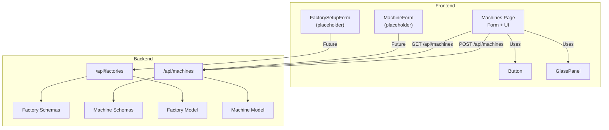
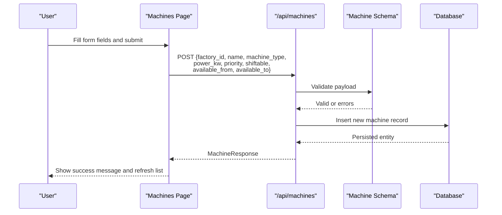
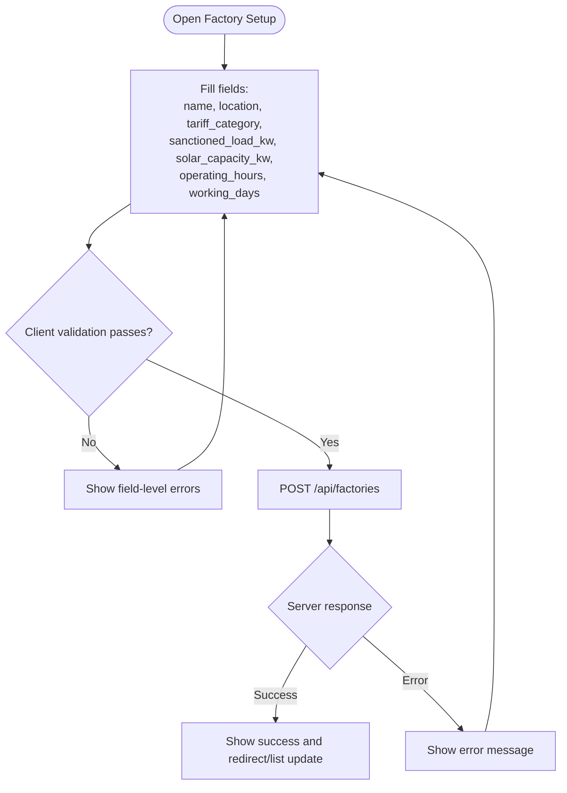
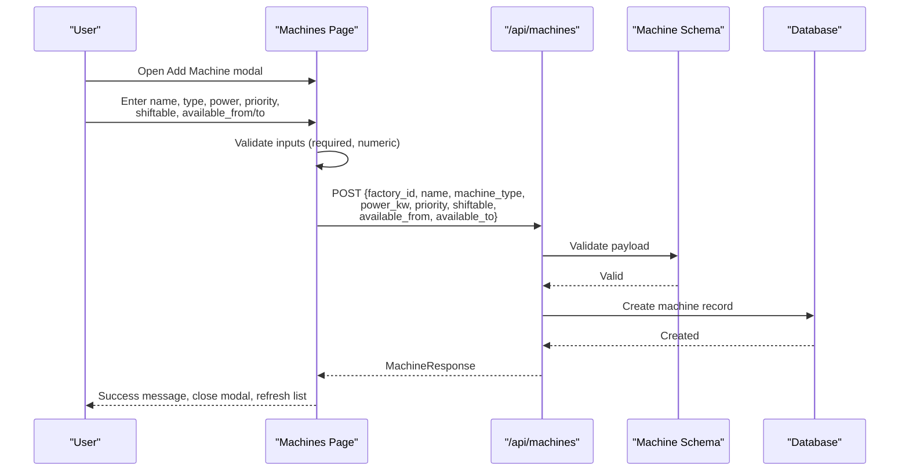
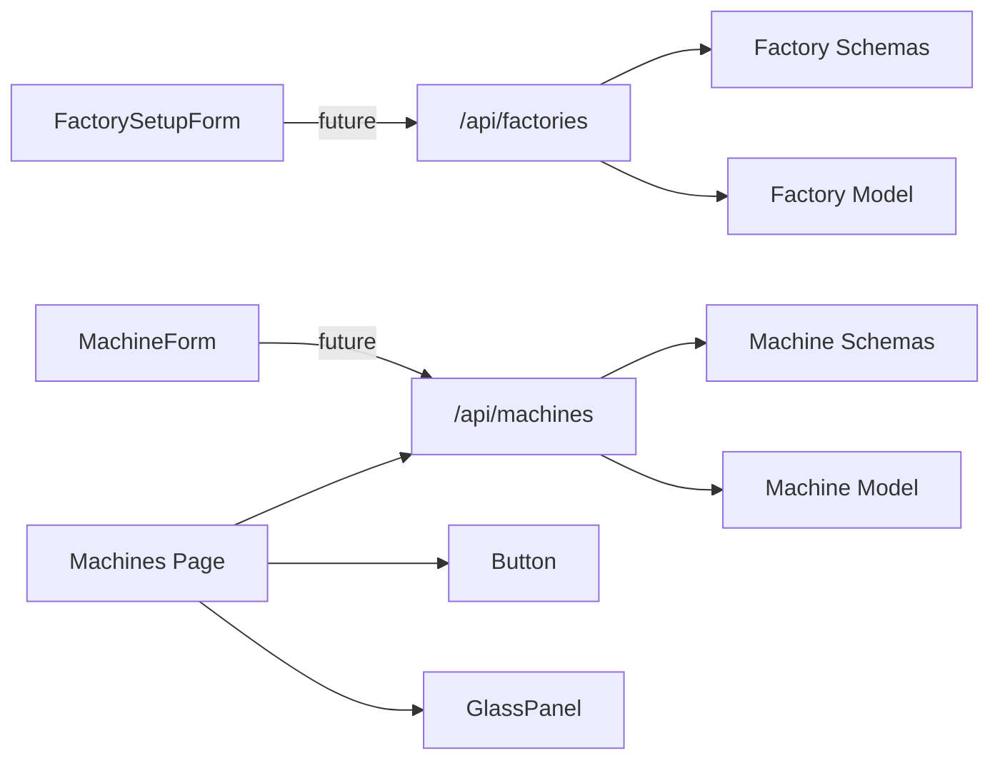

# Form Components

<cite>
**Referenced Files in This Document**
- [factory_setup_form.tsx](file://frontend/components/forms/factory_setup_form.tsx)
- [machine_form.tsx](file://frontend/components/forms/machine_form.tsx)
- [machines page](file://frontend/app/dashboard/machines/page.tsx)
- [factory API](file://backend/app/api/factory.py)
- [machine API](file://backend/app/api/machine.py)
- [Factory model](file://backend/app/models/factory.py)
- [Machine model](file://backend/app/models/machine.py)
- [Factory schemas](file://backend/app/schemas/factory.py)
- [Machine schemas](file://backend/app/schemas/machine.py)
- [Button component](file://frontend/components/ui/button.tsx)
- [GlassPanel component](file://frontend/components/ui/glass_panel.tsx)
- [Frontend types](file://frontend/types/index.ts)
</cite>

## Table of Contents
1. [Introduction](#introduction)
2. [Project Structure](#project-structure)
3. [Core Components](#core-components)
4. [Architecture Overview](#architecture-overview)
5. [Detailed Component Analysis](#detailed-component-analysis)
6. [Dependency Analysis](#dependency-analysis)
7. [Performance Considerations](#performance-considerations)
8. [Troubleshooting Guide](#troubleshooting-guide)
9. [Conclusion](#conclusion)
10. [Appendices](#appendices)

## Introduction
This document explains TariffGuard’s form components for data input and configuration, focusing on:
- Factory Setup Form for initial factory registration (location selection, capacity configuration, tariff mapping)
- Machine Form for equipment registration (power specifications, maintenance scheduling, operational parameters)
It also covers validation strategies, error handling, data binding patterns, backend integration, state management, user feedback, accessibility considerations, responsive design, and guidance for extending forms and adding custom validation rules.

## Project Structure
The frontend provides placeholder form components and a working machine registration flow within the Machines dashboard page. The backend exposes REST APIs for factories and machines with Pydantic schemas and SQLAlchemy models.

**Diagram sources**
- [machines page:1-499](file://frontend/app/dashboard/machines/page.tsx#L1-L499)
- [factory API:1-81](file://backend/app/api/factory.py#L1-L81)
- [machine API:1-65](file://backend/app/api/machine.py#L1-L65)
- [Factory schemas:1-31](file://backend/app/schemas/factory.py#L1-L31)
- [Machine schemas:1-26](file://backend/app/schemas/machine.py#L1-L26)
- [Factory model:1-17](file://backend/app/models/factory.py#L1-L17)
- [Machine model:1-20](file://backend/app/models/machine.py#L1-L20)
- [Button component:1-26](file://frontend/components/ui/button.tsx#L1-L26)
- [GlassPanel component:1-20](file://frontend/components/ui/glass_panel.tsx#L1-L20)

**Section sources**
- [machines page:1-499](file://frontend/app/dashboard/machines/page.tsx#L1-L499)
- [factory API:1-81](file://backend/app/api/factory.py#L1-L81)
- [machine API:1-65](file://backend/app/api/machine.py#L1-L65)
- [Factory schemas:1-31](file://backend/app/schemas/factory.py#L1-L31)
- [Machine schemas:1-26](file://backend/app/schemas/machine.py#L1-L26)
- [Factory model:1-17](file://backend/app/models/factory.py#L1-L17)
- [Machine model:1-20](file://backend/app/models/machine.py#L1-L20)
- [Button component:1-26](file://frontend/components/ui/button.tsx#L1-L26)
- [GlassPanel component:1-20](file://frontend/components/ui/glass_panel.tsx#L1-L20)

## Core Components
- FactorySetupForm: Placeholder component intended for initial factory registration. It is currently a stub and should be extended to capture location, tariff category, sanctioned load, solar capacity, operating hours, and working days.
- MachineForm: Placeholder component intended for machine registration. Currently a stub; the actual machine creation flow is implemented inline in the Machines dashboard page.

Key responsibilities:
- Collect and validate user inputs for factory and machine entities
- Bind form state to local component state
- Submit data to backend APIs and handle responses
- Provide user feedback via messages and loading states
- Ensure accessibility and responsive behavior

**Section sources**
- [factory_setup_form.tsx:1-8](file://frontend/components/forms/factory_setup_form.tsx#L1-L8)
- [machine_form.tsx:1-8](file://frontend/components/forms/machine_form.tsx#L1-L8)

## Architecture Overview
The form-to-API flow for machines is implemented directly in the Machines page. Factory setup is not yet implemented but will follow the same pattern.

**Diagram sources**
- [machines page:81-110](file://frontend/app/dashboard/machines/page.tsx#L81-L110)
- [machine API:13-24](file://backend/app/api/machine.py#L13-L24)
- [Machine schemas:5-23](file://backend/app/schemas/machine.py#L5-L23)
- [Machine model:5-20](file://backend/app/models/machine.py#L5-L20)

## Detailed Component Analysis

### Factory Setup Form
Purpose:
- Register a new factory with location, tariff category, capacity, and operational windows.

Current state:
- Placeholder component that renders a simple panel.

Recommended implementation:
- Fields:
  - Name (string, required)
  - Location (string, default “Faisalabad”)
  - Tariff category (string, default “Industrial”)
  - Sanctioned load kW (number, required)
  - Solar capacity kW (number, default 0)
  - Operating hours (string, default “08:00-22:00”)
  - Working days (string, default “Mon-Sat”)
- Validation:
  - Required fields enforced client-side
  - Numeric ranges validated (e.g., power > 0)
  - Time range format validated for operating hours
- Data binding:
  - Local state object bound to inputs
  - On submit, POST to /api/factories with FactoryCreate schema
- Backend integration:
  - Uses FastAPI endpoints for create/list/get/update/delete
  - Requires manager role for write operations
- User feedback:
  - Loading spinner during submission
  - Success/error messages displayed near the form
- Accessibility:
  - Labels associated with inputs
  - Keyboard navigation and focus management
  - ARIA attributes for dynamic messages
- Responsive design:
  - Grid layout adapts to screen size
  - Inputs stack vertically on small screens

**Diagram sources**
- [factory API:13-24](file://backend/app/api/factory.py#L13-L24)
- [Factory schemas:5-15](file://backend/app/schemas/factory.py#L5-L15)
- [Factory model:5-17](file://backend/app/models/factory.py#L5-L17)

**Section sources**
- [factory_setup_form.tsx:1-8](file://frontend/components/forms/factory_setup_form.tsx#L1-L8)
- [factory API:13-24](file://backend/app/api/factory.py#L13-L24)
- [Factory schemas:5-15](file://backend/app/schemas/factory.py#L5-L15)
- [Factory model:5-17](file://backend/app/models/factory.py#L5-L17)

### Machine Form
Purpose:
- Register equipment with power specs, availability windows, priority, and optional maintenance windows.

Current state:
- Placeholder component exists, but the functional form is embedded in the Machines dashboard page.

Functional flow in Machines page:
- State management:
  - Local state holds form values (name, type, power, status, priority, shiftable, availability)
  - Modal open/close state and submission state
- Data binding:
  - Controlled inputs update local state
- Submission:
  - POST to /api/machines with factory_id and mapped fields
  - On success, show message, reset form, close modal, refresh list
- Error handling:
  - Catches errors and displays user-friendly messages
- UI:
  - Glass panel modal with grid layout
  - Button variants for actions
  - Responsive table and charts

**Diagram sources**
- [machines page:39-110](file://frontend/app/dashboard/machines/page.tsx#L39-L110)
- [machine API:13-24](file://backend/app/api/machine.py#L13-L24)
- [Machine schemas:5-23](file://backend/app/schemas/machine.py#L5-L23)
- [Machine model:5-20](file://backend/app/models/machine.py#L5-L20)

**Section sources**
- [machine_form.tsx:1-8](file://frontend/components/forms/machine_form.tsx#L1-L8)
- [machines page:39-110](file://frontend/app/dashboard/machines/page.tsx#L39-L110)
- [machine API:13-24](file://backend/app/api/machine.py#L13-L24)
- [Machine schemas:5-23](file://backend/app/schemas/machine.py#L5-L23)
- [Machine model:5-20](file://backend/app/models/machine.py#L5-L20)

### Form Validation Strategies
- Client-side validation:
  - Required fields checked before submission
  - Numeric fields validated for positive values where applicable
  - Time fields validated for correct HH:mm format
- Server-side validation:
  - Pydantic schemas enforce types and constraints
  - Role-based authorization enforced by API decorators
- Field-level feedback:
  - Inline messages for invalid fields
  - Summary messages for overall form errors

**Section sources**
- [machines page:81-110](file://frontend/app/dashboard/machines/page.tsx#L81-L110)
- [Machine schemas:5-23](file://backend/app/schemas/machine.py#L5-L23)
- [Factory schemas:5-15](file://backend/app/schemas/factory.py#L5-L15)

### Error Handling
- Frontend:
  - Try/catch around fetch calls
  - Display success or error banners
  - Disable submit button while submitting
- Backend:
  - HTTPException for not found and other errors
  - Consistent JSON error responses

**Section sources**
- [machines page:81-110](file://frontend/app/dashboard/machines/page.tsx#L81-L110)
- [factory API:37-47](file://backend/app/api/factory.py#L37-L47)
- [machine API:40-50](file://backend/app/api/machine.py#L40-L50)

### Data Binding Patterns
- Controlled inputs:
  - Each input updates a single state object
  - onChange handlers merge new values into state
- Mapping to API payloads:
  - Transform UI values to backend schema fields (e.g., number conversion)
- Resetting state:
  - After successful submission, reset form to defaults

**Section sources**
- [machines page:39-110](file://frontend/app/dashboard/machines/page.tsx#L39-L110)

### Integration with Backend APIs
- Factories:
  - Endpoints for CRUD operations under /api/factories
  - Manager/Owner roles required for mutations
- Machines:
  - Endpoints for CRUD operations under /api/machines
  - List supports filtering by factory_id

**Section sources**
- [factory API:13-81](file://backend/app/api/factory.py#L13-L81)
- [machine API:13-65](file://backend/app/api/machine.py#L13-L65)

### Form State Management
- Local state per form/modal
- Separate loading and message states
- Selection state for detail panels (in Machines page)

**Section sources**
- [machines page:28-48](file://frontend/app/dashboard/machines/page.tsx#L28-L48)

### User Feedback Mechanisms
- Success/error banners
- Disabled submit button with spinner during submission
- Clear labels and placeholders

**Section sources**
- [machines page:138-142](file://frontend/app/dashboard/machines/page.tsx#L138-L142)
- [machines page:473-490](file://frontend/app/dashboard/machines/page.tsx#L473-L490)

### Accessibility Compliance
- Associate labels with inputs
- Use semantic HTML elements (form, input, select)
- Ensure keyboard operability and visible focus states
- Announce dynamic messages appropriately

**Section sources**
- [machines page:371-490](file://frontend/app/dashboard/machines/page.tsx#L371-L490)

### Responsive Design Considerations
- Grid layouts adapt to screen sizes
- Inputs stack on smaller viewports
- Charts and tables scroll horizontally when needed

**Section sources**
- [machines page:144-167](file://frontend/app/dashboard/machines/page.tsx#L144-L167)
- [machines page:271-325](file://frontend/app/dashboard/machines/page.tsx#L271-L325)

## Dependency Analysis
Forms depend on:
- UI primitives (Button, GlassPanel)
- Types/interfaces for consistency
- Backend APIs for persistence and validation

**Diagram sources**
- [machines page:1-499](file://frontend/app/dashboard/machines/page.tsx#L1-L499)
- [factory API:1-81](file://backend/app/api/factory.py#L1-L81)
- [machine API:1-65](file://backend/app/api/machine.py#L1-L65)
- [Factory schemas:1-31](file://backend/app/schemas/factory.py#L1-L31)
- [Machine schemas:1-26](file://backend/app/schemas/machine.py#L1-L26)
- [Factory model:1-17](file://backend/app/models/factory.py#L1-L17)
- [Machine model:1-20](file://backend/app/models/machine.py#L1-L20)
- [Button component:1-26](file://frontend/components/ui/button.tsx#L1-L26)
- [GlassPanel component:1-20](file://frontend/components/ui/glass_panel.tsx#L1-L20)

**Section sources**
- [machines page:1-499](file://frontend/app/dashboard/machines/page.tsx#L1-L499)
- [factory API:1-81](file://backend/app/api/factory.py#L1-L81)
- [machine API:1-65](file://backend/app/api/machine.py#L1-L65)
- [Factory schemas:1-31](file://backend/app/schemas/factory.py#L1-L31)
- [Machine schemas:1-26](file://backend/app/schemas/machine.py#L1-L26)
- [Factory model:1-17](file://backend/app/models/factory.py#L1-L17)
- [Machine model:1-20](file://backend/app/models/machine.py#L1-L20)
- [Button component:1-26](file://frontend/components/ui/button.tsx#L1-L26)
- [GlassPanel component:1-20](file://frontend/components/ui/glass_panel.tsx#L1-L20)

## Performance Considerations
- Debounce heavy validations if needed
- Minimize re-renders by memoizing derived values
- Paginate lists when scaling up
- Avoid unnecessary network calls; cache read-only data

[No sources needed since this section provides general guidance]

## Troubleshooting Guide
Common issues and resolutions:
- Validation errors:
  - Check required fields and formats
  - Review server schema constraints
- Network errors:
  - Verify endpoint URLs and authentication
  - Inspect error messages from backend
- State inconsistencies:
  - Ensure form resets after submission
  - Confirm list refreshes after mutations

**Section sources**
- [machines page:81-110](file://frontend/app/dashboard/machines/page.tsx#L81-L110)
- [machine API:40-50](file://backend/app/api/machine.py#L40-L50)
- [factory API:37-47](file://backend/app/api/factory.py#L37-L47)

## Conclusion
TariffGuard’s form architecture separates concerns between UI components and backend APIs. While FactorySetupForm and MachineForm are currently placeholders, the Machines page demonstrates a complete, production-ready flow for machine registration. Extending these components follows the established patterns: controlled state, robust validation, clear user feedback, and consistent API integration.

[No sources needed since this section summarizes without analyzing specific files]

## Appendices

### Extending Forms and Adding New Fields
Steps:
- Add new fields to the local state object
- Render inputs with labels and validation
- Map fields to backend schema properties
- Update submission payload and reset logic
- Add server-side validation in Pydantic schemas if needed

**Section sources**
- [machines page:39-110](file://frontend/app/dashboard/machines/page.tsx#L39-L110)
- [Machine schemas:5-23](file://backend/app/schemas/machine.py#L5-L23)
- [Factory schemas:5-15](file://backend/app/schemas/factory.py#L5-L15)

### Implementing Custom Validation Rules
Approach:
- Client-side:
  - Validate in onChange/onSubmit
  - Show inline errors and disable submit until valid
- Server-side:
  - Enforce constraints in Pydantic models
  - Return descriptive errors

**Section sources**
- [machines page:81-110](file://frontend/app/dashboard/machines/page.tsx#L81-L110)
- [Machine schemas:5-23](file://backend/app/schemas/machine.py#L5-L23)
- [Factory schemas:5-15](file://backend/app/schemas/factory.py#L5-L15)