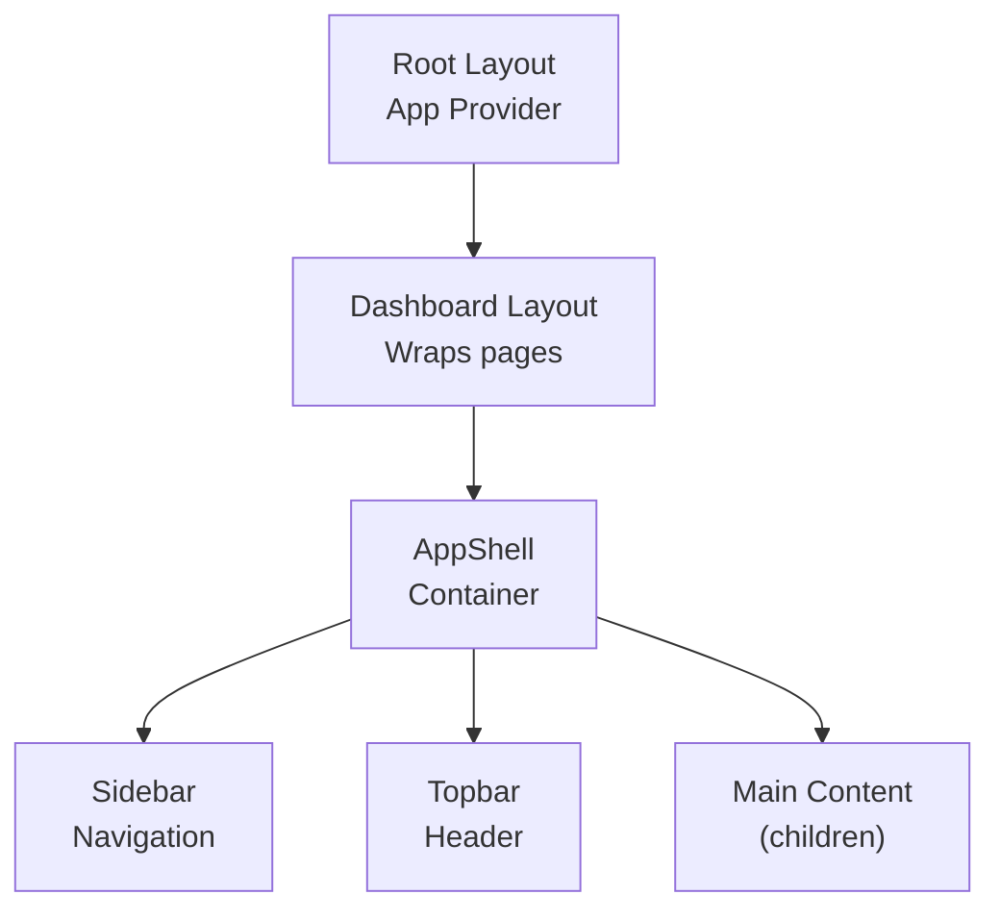
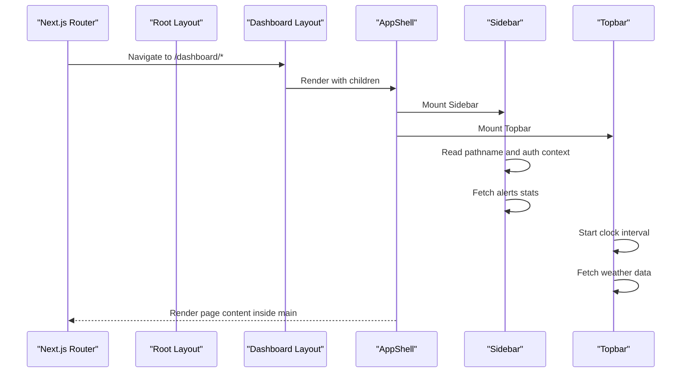
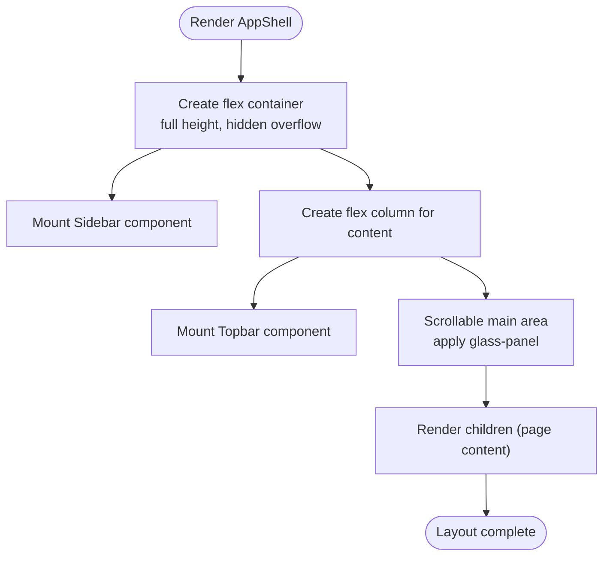
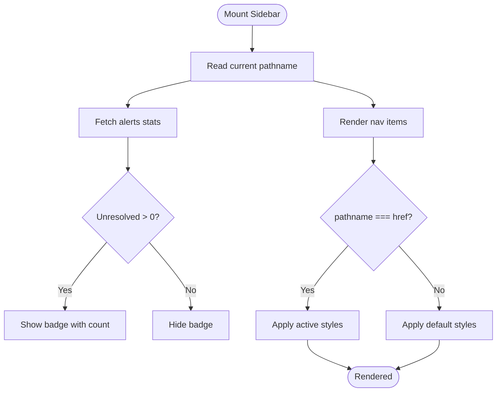
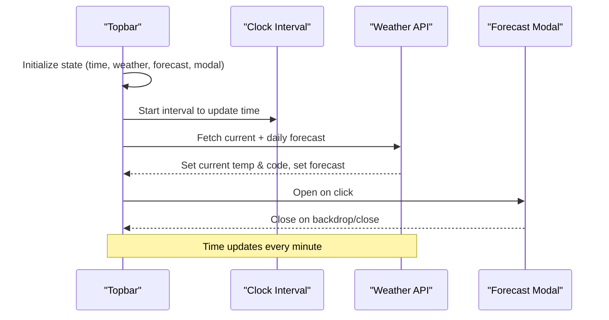
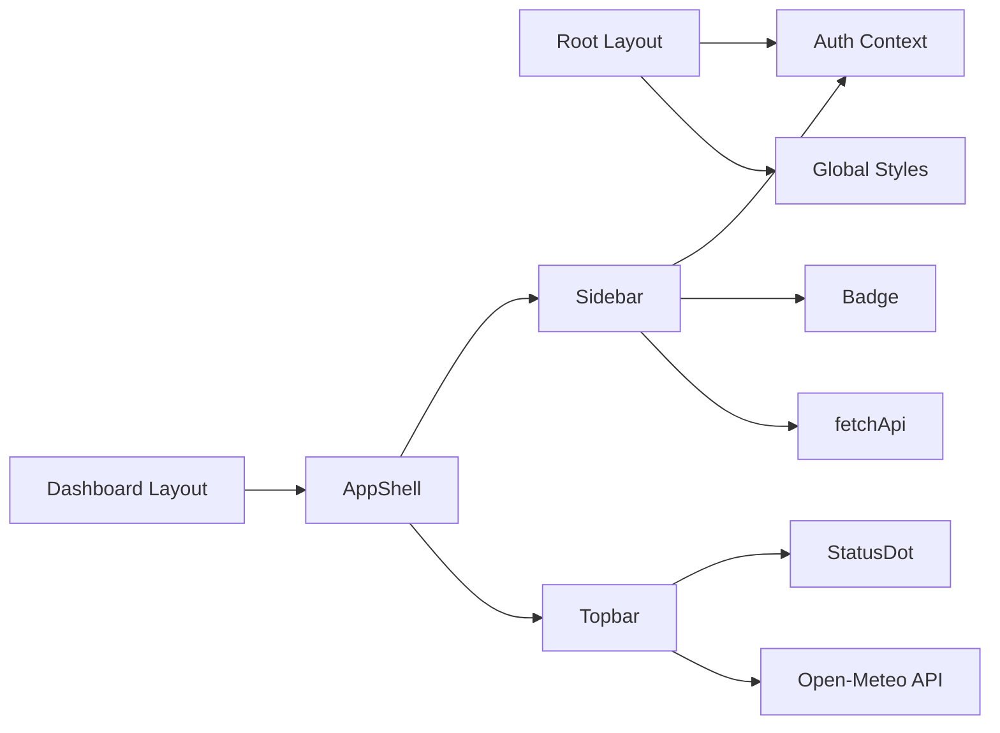

# Layout Components

<cite>
**Referenced Files in This Document**
- [app_shell.tsx](file://frontend/components/layout/app_shell.tsx)
- [sidebar.tsx](file://frontend/components/layout/sidebar.tsx)
- [topbar.tsx](file://frontend/components/layout/topbar.tsx)
- [dashboard_layout.tsx](file://frontend/app/dashboard/layout.tsx)
- [root_layout.tsx](file://frontend/app/layout.tsx)
- [globals.css](file://frontend/app/globals.css)
- [glass_panel.tsx](file://frontend/components/ui/glass_panel.tsx)
- [badge.tsx](file://frontend/components/ui/badge.tsx)
- [status_dot.tsx](file://frontend/components/ui/status_dot.tsx)
- [auth_context.tsx](file://frontend/context/auth_context.tsx)
</cite>

## Table of Contents
1. [Introduction](#introduction)
2. [Project Structure](#project-structure)
3. [Core Components](#core-components)
4. [Architecture Overview](#architecture-overview)
5. [Detailed Component Analysis](#detailed-component-analysis)
6. [Dependency Analysis](#dependency-analysis)
7. [Performance Considerations](#performance-considerations)
8. [Troubleshooting Guide](#troubleshooting-guide)
9. [Conclusion](#conclusion)
10. [Appendices](#appendices)

## Introduction
This document explains TariffGuard’s application shell layout components that structure the dashboard experience. It focuses on AppShell as the main container, Sidebar for navigation, and Topbar for contextual information and controls. The documentation covers responsive design using flexbox, glass panel styling, prop interfaces, event handling patterns, integration with Next.js routing, and guidance for customization and consistent spacing across the app.

## Project Structure
The layout is composed of three primary components under a shared UI system:
- AppShell: Orchestrates the page shell with Sidebar and Topbar and renders page content in a scrollable main area.
- Sidebar: Provides navigation links, active state highlighting, and user context at the bottom.
- Topbar: Displays the current page title, time, weather widget, and plant status indicator.

These components are integrated into Next.js via a dashboard layout wrapper and the root layout provides global providers and theme variables.

**Diagram sources**
- [root_layout.tsx:10-24](file://frontend/app/layout.tsx#L10-L24)
- [dashboard_layout.tsx:1-11](file://frontend/app/dashboard/layout.tsx#L1-L11)
- [app_shell.tsx:5-17](file://frontend/components/layout/app_shell.tsx#L5-L17)

**Section sources**
- [root_layout.tsx:10-24](file://frontend/app/layout.tsx#L10-L24)
- [dashboard_layout.tsx:1-11](file://frontend/app/dashboard/layout.tsx#L1-L11)
- [app_shell.tsx:5-17](file://frontend/components/layout/app_shell.tsx#L5-L17)

## Core Components
- AppShell
  - Purpose: Provides the overall shell layout for authenticated dashboard pages.
  - Layout: Uses a full-height flex container with a fixed-width Sidebar and a flexible content area containing Topbar and a scrollable main region.
  - Styling: Applies glass-panel styling to panels and uses CSS custom properties for radii and colors.
  - Integration: Consumed by the dashboard layout to wrap all child routes.

- Sidebar
  - Purpose: Renders navigation items with icons, active state based on the current pathname, and an alerts badge fetched from the API.
  - Data: Reads auth context for user role and username; fetches alert stats to show unresolved count.
  - Navigation: Uses Next.js Link for client-side navigation and highlights the active route.

- Topbar
  - Purpose: Shows the current page title derived from the pathname, live clock, weather widget (current and 7-day forecast), and plant status indicator.
  - Interactions: Opens a modal to display the 7-day forecast; updates time periodically.

**Section sources**
- [app_shell.tsx:5-17](file://frontend/components/layout/app_shell.tsx#L5-L17)
- [sidebar.tsx:13-98](file://frontend/components/layout/sidebar.tsx#L13-L98)
- [topbar.tsx:19-149](file://frontend/components/layout/topbar.tsx#L19-L149)

## Architecture Overview
The layout architecture follows a clear hierarchy:
- Root layout wraps the app with AuthProvider and global styles.
- Dashboard layout wraps each dashboard page with AppShell.
- AppShell composes Sidebar and Topbar around the page content.
- Sidebar and Topbar consume shared UI primitives (Badge, StatusDot) and utilities (cn).

**Diagram sources**
- [root_layout.tsx:10-24](file://frontend/app/layout.tsx#L10-L24)
- [dashboard_layout.tsx:1-11](file://frontend/app/dashboard/layout.tsx#L1-L11)
- [app_shell.tsx:5-17](file://frontend/components/layout/app_shell.tsx#L5-L17)
- [sidebar.tsx:26-35](file://frontend/components/layout/sidebar.tsx#L26-L35)
- [topbar.tsx:26-70](file://frontend/components/layout/topbar.tsx#L26-L70)

## Detailed Component Analysis

### AppShell
- Responsibilities
  - Compose the shell layout with Sidebar and Topbar.
  - Provide a scrollable main area for page content.
  - Apply glass-panel styling and consistent spacing.
- Props
  - children: ReactNode — the page content rendered inside the main area.
- Layout behavior
  - Full viewport height with hidden overflow on the outer container.
  - Flex row with a fixed-width Sidebar and a flex-1 content column.
  - Topbar is fixed height; main area grows to fill remaining space and scrolls independently.
- Styling
  - Uses Tailwind classes for flex layout and spacing.
  - Glass panel class applied to main content area for visual consistency.

**Diagram sources**
- [app_shell.tsx:5-17](file://frontend/components/layout/app_shell.tsx#L5-L17)

**Section sources**
- [app_shell.tsx:5-17](file://frontend/components/layout/app_shell.tsx#L5-L17)

### Sidebar
- Responsibilities
  - Display navigation menu with icons and labels.
  - Highlight the active link based on the current pathname.
  - Show an alerts badge with unresolved count fetched from the API.
  - Display user info and role at the bottom.
- Data and state
  - Reads pathname via Next.js navigation hook.
  - Reads role and user from AuthContext.
  - Maintains unresolved alert count in local state.
- Events and side effects
  - On mount and pathname change, fetches alert stats and updates badge count.
  - Links use Next.js Link for client-side navigation.
- Styling and accessibility
  - Active state uses left border accent and background tint.
  - Icons and text follow consistent spacing and typography tokens.

**Diagram sources**
- [sidebar.tsx:26-35](file://frontend/components/layout/sidebar.tsx#L26-L35)
- [sidebar.tsx:46-74](file://frontend/components/layout/sidebar.tsx#L46-L74)

**Section sources**
- [sidebar.tsx:13-98](file://frontend/components/layout/sidebar.tsx#L13-L98)

### Topbar
- Responsibilities
  - Display dynamic page title derived from pathname.
  - Show a live clock updated every minute.
  - Present current weather with icon and temperature.
  - Provide a modal to view a 7-day forecast.
  - Indicate plant status with a pulsing dot.
- Data and state
  - Local state for time, current weather, forecast array, and modal visibility.
  - Effects to update time and fetch weather data on mount.
- Events and interactions
  - Click handler opens/closes the forecast modal.
  - Modal closes when clicking backdrop or close button.
- Styling
  - Glass-panel header with consistent spacing and typography.
  - Weather icons selected based on weather code mapping.

**Diagram sources**
- [topbar.tsx:26-70](file://frontend/components/layout/topbar.tsx#L26-L70)
- [topbar.tsx:82-149](file://frontend/components/layout/topbar.tsx#L82-L149)

**Section sources**
- [topbar.tsx:19-149](file://frontend/components/layout/topbar.tsx#L19-L149)

### UI Primitives and Theming
- GlassPanel
  - Reusable container that applies glass-card or glass-panel classes based on props.
  - Accepts className for additional overrides.
- Badge
  - Supports variants: default, success, warning, error.
  - Used in Sidebar for alert counts.
- StatusDot
  - Visual indicator with optional animation for online states.
  - Used in Topbar to show plant status.

**Section sources**
- [glass_panel.tsx:4-19](file://frontend/components/ui/glass_panel.tsx#L4-L19)
- [badge.tsx:4-27](file://frontend/components/ui/badge.tsx#L4-L27)
- [status_dot.tsx:3-24](file://frontend/components/ui/status_dot.tsx#L3-L24)

## Dependency Analysis
- AppShell depends on:
  - Sidebar and Topbar for composition.
  - Global styles for glass-panel utility classes.
- Sidebar depends on:
  - Next.js navigation hooks and Link for routing.
  - AuthContext for user role and name.
  - API utility to fetch alert stats.
  - Badge for displaying counts.
- Topbar depends on:
  - Next.js navigation hook for pathname-based title.
  - External weather API for current and forecast data.
  - StatusDot for plant status indicator.
- Root and Dashboard layouts provide:
  - AuthProvider context for authentication state.
  - Wrapper for AppShell to standardize layout across dashboard routes.

**Diagram sources**
- [root_layout.tsx:10-24](file://frontend/app/layout.tsx#L10-L24)
- [dashboard_layout.tsx:1-11](file://frontend/app/dashboard/layout.tsx#L1-L11)
- [app_shell.tsx:5-17](file://frontend/components/layout/app_shell.tsx#L5-L17)
- [sidebar.tsx:26-35](file://frontend/components/layout/sidebar.tsx#L26-L35)
- [topbar.tsx:26-70](file://frontend/components/layout/topbar.tsx#L26-L70)

**Section sources**
- [root_layout.tsx:10-24](file://frontend/app/layout.tsx#L10-L24)
- [dashboard_layout.tsx:1-11](file://frontend/app/dashboard/layout.tsx#L1-L11)
- [app_shell.tsx:5-17](file://frontend/components/layout/app_shell.tsx#L5-L17)
- [sidebar.tsx:26-35](file://frontend/components/layout/sidebar.tsx#L26-L35)
- [topbar.tsx:26-70](file://frontend/components/layout/topbar.tsx#L26-L70)

## Performance Considerations
- Minimize re-renders
  - Keep sidebar navigation static; avoid unnecessary state updates.
  - Debounce or throttle frequent updates if adding more dynamic elements.
- Network requests
  - Cache weather data locally if needed to reduce external calls.
  - Consider error boundaries around API-dependent widgets.
- Rendering efficiency
  - Use stable keys for list rendering in Sidebar and Topbar forecast lists.
  - Avoid heavy computations in render paths; move to memoized functions if necessary.

[No sources needed since this section provides general guidance]

## Troubleshooting Guide
- Sidebar alerts badge not updating
  - Ensure the API endpoint returns expected data shape and handle errors gracefully.
  - Verify that pathname changes trigger refetch if required.
- Topbar weather not loading
  - Check network connectivity and CORS policies for the external weather API.
  - Inspect console for fetch errors and ensure fallback states are displayed.
- Modal not closing
  - Confirm event handlers are attached to backdrop and close button.
  - Ensure stopPropagation is used to prevent unintended closures.
- Authentication context issues
  - Verify AuthProvider is present in the root layout.
  - Ensure localStorage contains valid token and user data after login.

**Section sources**
- [sidebar.tsx:31-35](file://frontend/components/layout/sidebar.tsx#L31-L35)
- [topbar.tsx:34-70](file://frontend/components/layout/topbar.tsx#L34-L70)
- [topbar.tsx:116-149](file://frontend/components/layout/topbar.tsx#L116-L149)
- [auth_context.tsx:23-33](file://frontend/context/auth_context.tsx#L23-L33)

## Conclusion
TariffGuard’s layout system centers around a clean, composable shell built with AppShell, Sidebar, and Topbar. The design leverages flexbox for responsive structure and glass-panel styling for a cohesive look. Integration with Next.js routing and global context ensures consistent navigation and user state across dashboard pages. By following the guidelines and patterns outlined here, you can customize layouts, manage responsive behavior, and maintain consistent spacing and styling throughout the application.

[No sources needed since this section summarizes without analyzing specific files]

## Appendices

### Prop Interfaces Summary
- AppShell
  - children: ReactNode — Page content rendered within the main area.
- Sidebar
  - No explicit props; reads pathname and auth context internally.
- Topbar
  - No explicit props; manages internal state for time, weather, and modal.

**Section sources**
- [app_shell.tsx:5-17](file://frontend/components/layout/app_shell.tsx#L5-L17)
- [sidebar.tsx:26-98](file://frontend/components/layout/sidebar.tsx#L26-L98)
- [topbar.tsx:19-149](file://frontend/components/layout/topbar.tsx#L19-L149)

### Customization Examples
- Adding a new navigation item
  - Extend the navigation array in Sidebar with a name, href, and icon.
  - Ensure the href matches a valid Next.js route under the dashboard group.
- Changing glass panel appearance
  - Adjust CSS custom properties in globals.css for colors and radii.
  - Use the GlassPanel component where appropriate for consistent styling.
- Handling responsive breakpoints
  - Introduce conditional classes based on screen size to collapse Sidebar or adjust spacing.
  - Consider mobile-first approaches with Tailwind responsive prefixes.

**Section sources**
- [sidebar.tsx:13-24](file://frontend/components/layout/sidebar.tsx#L13-L24)
- [globals.css:3-40](file://frontend/app/globals.css#L3-L40)
- [glass_panel.tsx:4-19](file://frontend/components/ui/glass_panel.tsx#L4-L19)

### Routing Integration Notes
- Next.js Link usage
  - Sidebar uses Link for client-side navigation between dashboard routes.
- Pathname-based active state
  - Active link detection relies on exact match with current pathname.
- Layout wrapping
  - Dashboard pages are wrapped by DashboardLayout which injects AppShell.

**Section sources**
- [sidebar.tsx:46-74](file://frontend/components/layout/sidebar.tsx#L46-L74)
- [dashboard_layout.tsx:1-11](file://frontend/app/dashboard/layout.tsx#L1-L11)