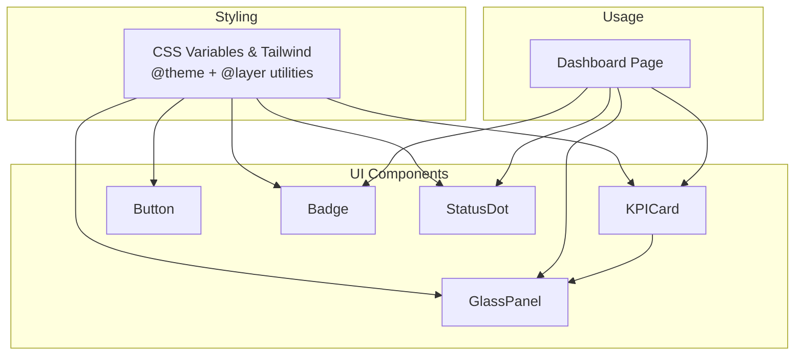
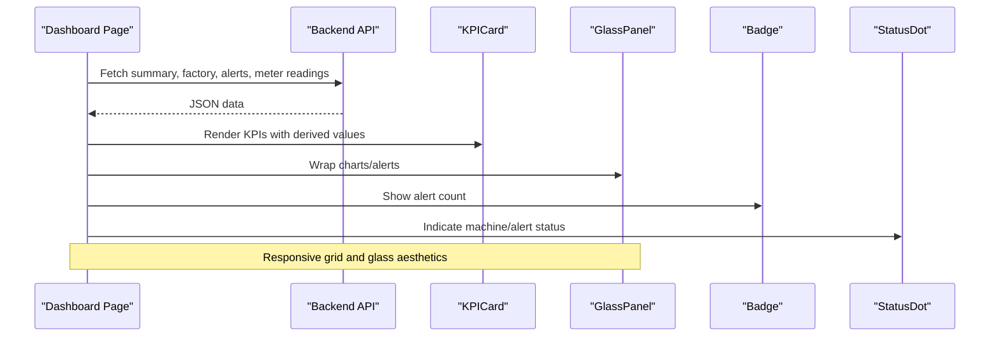
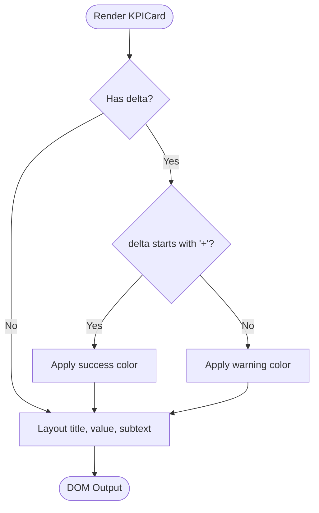
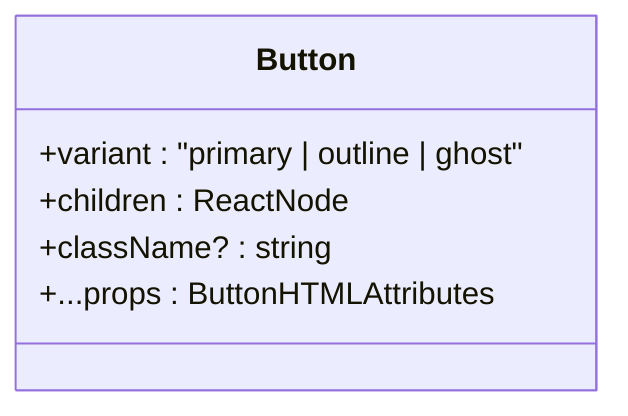
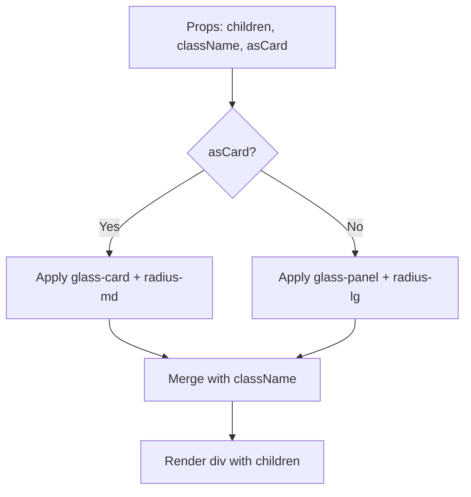
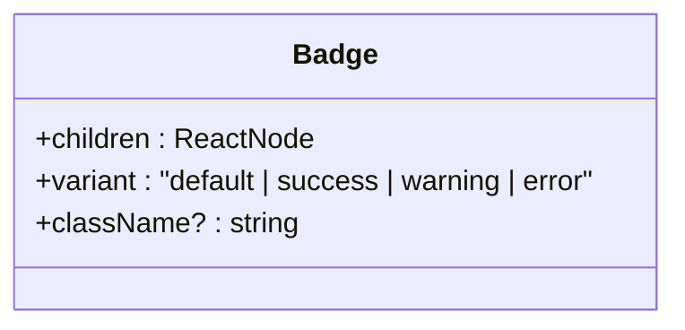
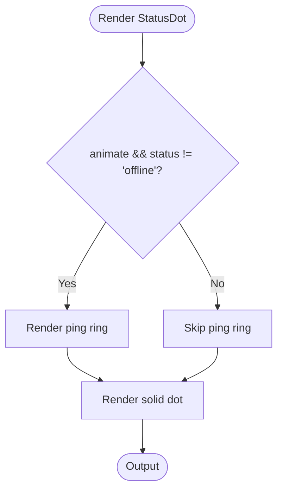
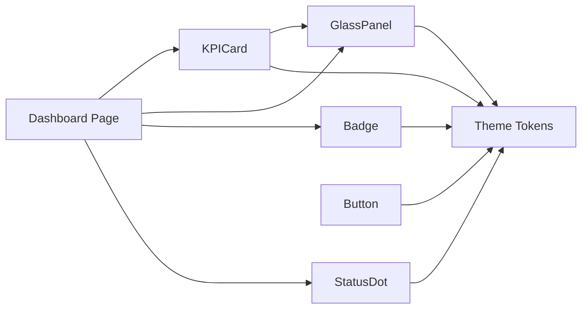

# UI Components

<cite>
**Referenced Files in This Document**
- [kpi_card.tsx](file://frontend/components/ui/kpi_card.tsx)
- [button.tsx](file://frontend/components/ui/button.tsx)
- [glass_panel.tsx](file://frontend/components/ui/glass_panel.tsx)
- [badge.tsx](file://frontend/components/ui/badge.tsx)
- [status_dot.tsx](file://frontend/components/ui/status_dot.tsx)
- [globals.css](file://frontend/app/globals.css)
- [dashboard/page.tsx](file://frontend/app/dashboard/page.tsx)
- [index.ts](file://frontend/types/index.ts)
</cite>

## Table of Contents
1. Introduction
2. Project Structure
3. Core Components
4. Architecture Overview
5. Detailed Component Analysis
6. Dependency Analysis
7. Performance Considerations
8. Troubleshooting Guide
9. Conclusion

## Introduction
This document describes TariffGuard’s reusable UI component library with a focus on the KPI card, Button, Glass Panel, Badge, and Status Dot components. It explains prop interfaces, styling customization via Tailwind CSS and CSS variables, theme integration, usage patterns, composition strategies, state management considerations, and performance implications. The goal is to help developers implement consistent, accessible, and responsive UI elements across the application.

## Project Structure
The UI components live under frontend/components/ui and are styled using Tailwind CSS utilities combined with custom CSS variables defined in the global stylesheet. A dashboard page demonstrates how these components compose together to present real-time data and status indicators.

**Diagram sources**
- [kpi_card.tsx:1-37](file://frontend/components/ui/kpi_card.tsx#L1-L37)
- [button.tsx:1-26](file://frontend/components/ui/button.tsx#L1-L26)
- [glass_panel.tsx:1-20](file://frontend/components/ui/glass_panel.tsx#L1-L20)
- [badge.tsx:1-28](file://frontend/components/ui/badge.tsx#L1-L28)
- [status_dot.tsx:1-25](file://frontend/components/ui/status_dot.tsx#L1-L25)
- [globals.css:1-85](file://frontend/app/globals.css#L1-L85)
- [dashboard/page.tsx:1-172](file://frontend/app/dashboard/page.tsx#L1-L172)

**Section sources**
- [kpi_card.tsx:1-37](file://frontend/components/ui/kpi_card.tsx#L1-L37)
- [button.tsx:1-26](file://frontend/components/ui/button.tsx#L1-L26)
- [glass_panel.tsx:1-20](file://frontend/components/ui/glass_panel.tsx#L1-L20)
- [badge.tsx:1-28](file://frontend/components/ui/badge.tsx#L1-L28)
- [status_dot.tsx:1-25](file://frontend/components/ui/status_dot.tsx#L1-L25)
- [globals.css:1-85](file://frontend/app/globals.css#L1-L85)
- [dashboard/page.tsx:1-172](file://frontend/app/dashboard/page.tsx#L1-L172)

## Core Components
- KPICard: Displays a title, value, optional delta indicator, and subtext inside a glass-styled container with an accent color bar. Supports dynamic data binding and conditional formatting for positive/negative deltas.
- Button: Accessible button with variants (primary, outline, ghost), consistent sizing, and disabled states. Uses CSS variables for colors and radii.
- GlassPanel: Provides frosted glass backgrounds and borders via utility classes; can render as a card or panel.
- Badge: Small label with semantic variants (default, success, warning, error) and border styling.
- StatusDot: Circular indicator with optional ping animation for non-offline statuses.

Key styling foundations:
- Theme tokens (colors, fonts, radii, shadows) are defined in the global stylesheet and consumed by components via CSS variables.
- Tailwind utility classes provide layout, spacing, typography, and transitions.
- Utility classes for glass effects are defined in the styles layer.

**Section sources**
- [kpi_card.tsx:4-36](file://frontend/components/ui/kpi_card.tsx#L4-L36)
- [button.tsx:4-24](file://frontend/components/ui/button.tsx#L4-L24)
- [glass_panel.tsx:4-18](file://frontend/components/ui/glass_panel.tsx#L4-L18)
- [badge.tsx:4-26](file://frontend/components/ui/badge.tsx#L4-L26)
- [status_dot.tsx:3-23](file://frontend/components/ui/status_dot.tsx#L3-L23)
- [globals.css:3-40](file://frontend/app/globals.css#L3-L40)
- [globals.css:42-76](file://frontend/app/globals.css#L42-L76)

## Architecture Overview
Components are lightweight presentational primitives that rely on shared theme tokens and Tailwind utilities. Higher-level pages compose these components to build dashboards and feature screens. Data flows from API responses into component props, enabling dynamic updates and conditional rendering.

**Diagram sources**
- [dashboard/page.tsx:16-62](file://frontend/app/dashboard/page.tsx#L16-L62)
- [dashboard/page.tsx:100-168](file://frontend/app/dashboard/page.tsx#L100-L168)
- [kpi_card.tsx:12-35](file://frontend/components/ui/kpi_card.tsx#L12-L35)
- [glass_panel.tsx:10-18](file://frontend/components/ui/glass_panel.tsx#L10-L18)
- [badge.tsx:10-26](file://frontend/components/ui/badge.tsx#L10-L26)
- [status_dot.tsx:8-23](file://frontend/components/ui/status_dot.tsx#L8-L23)

## Detailed Component Analysis

### KPICard
Purpose:
- Present key metrics with a title, value, optional delta, and subtext.
- Provide visual emphasis via an accent color bar at the top.
- Conditionally format delta text based on sign (+/-).

Props:
- title: string — Label for the metric.
- value: string | number — Primary metric value.
- delta?: string — Optional change indicator; positive starts with “+”.
- subtext?: string — Optional secondary description.
- accentColor?: string — CSS variable or color for the top accent bar.

Behavior:
- Conditional delta color: positive uses success color; negative/neutral uses warning color.
- Composes GlassPanel for frosted background and rounded corners.
- Uses CSS variables for consistent typography and colors.

Accessibility:
- Semantic heading hierarchy with h3 for value and p for labels.
- Color contrast relies on theme tokens; ensure sufficient contrast when customizing.

Composition:
- Wraps content in GlassPanel with padding and flex layout to align items vertically.

Performance:
- Minimal re-renders; only props change triggers updates.
- Avoid heavy computations in render; precompute formatted values in parent if needed.

Usage example path:
- [dashboard/page.tsx:104-131](file://frontend/app/dashboard/page.tsx#L104-L131)

**Diagram sources**
- [kpi_card.tsx:12-35](file://frontend/components/ui/kpi_card.tsx#L12-L35)

**Section sources**
- [kpi_card.tsx:4-36](file://frontend/components/ui/kpi_card.tsx#L4-L36)
- [dashboard/page.tsx:104-131](file://frontend/app/dashboard/page.tsx#L104-L131)

### Button
Purpose:
- Provide interactive controls with consistent appearance and behavior.

Props:
- variant?: 'primary' | 'outline' | 'ghost' — Visual style.
- All standard HTML button attributes via inheritance.

Behavior:
- Base styles include rounded corners, padding, font size, transition, and disabled states.
- Variant-specific color schemes use CSS variables for consistency.

Accessibility:
- Native <button> element ensures keyboard navigation and screen reader support.
- Disabled state sets opacity and pointer-events to indicate unavailability.

Customization:
- Override via className prop.
- Extend variants by adding new entries in the component’s style map.

Performance:
- Stateless functional component; cheap to render.
- Use memoization in parent if necessary to avoid unnecessary re-renders.

Usage example path:
- [button.tsx:4-24](file://frontend/components/ui/button.tsx#L4-L24)

**Diagram sources**
- [button.tsx:4-24](file://frontend/components/ui/button.tsx#L4-L24)

**Section sources**
- [button.tsx:4-24](file://frontend/components/ui/button.tsx#L4-L24)

### GlassPanel
Purpose:
- Provide a frosted glass container with subtle borders and shadow.
- Support two modes: panel and card.

Props:
- children: ReactNode
- className?: string
- asCard?: boolean — When true, applies card-specific glass styling.

Behavior:
- Applies utility classes for backdrop blur, transparency, and border.
- Rounds corners using theme radius tokens.

Theming:
- Relies on CSS variables for radius and colors.
- Glass effects defined in the utilities layer.

Performance:
- Pure presentational wrapper; no state or side effects.

Usage example path:
- [dashboard/page.tsx:137-146](file://frontend/app/dashboard/page.tsx#L137-L146)

**Diagram sources**
- [glass_panel.tsx:4-18](file://frontend/components/ui/glass_panel.tsx#L4-L18)
- [globals.css:42-56](file://frontend/app/globals.css#L42-L56)

**Section sources**
- [glass_panel.tsx:4-18](file://frontend/components/ui/glass_panel.tsx#L4-L18)
- [globals.css:42-56](file://frontend/app/globals.css#L42-L56)

### Badge
Purpose:
- Display small status or category labels with semantic variants.

Props:
- children: ReactNode
- variant?: 'default' | 'success' | 'warning' | 'error'
- className?: string

Behavior:
- Applies variant-specific background, text, and border colors.
- Uses rounded-full shape and compact padding.

Accessibility:
- Semantic span with meaningful text content.
- Ensure color contrast meets accessibility standards.

Performance:
- Stateless; minimal DOM footprint.

Usage example path:
- [dashboard/page.tsx:148](file://frontend/app/dashboard/page.tsx#L148)

**Diagram sources**
- [badge.tsx:4-26](file://frontend/components/ui/badge.tsx#L4-L26)

**Section sources**
- [badge.tsx:4-26](file://frontend/components/ui/badge.tsx#L4-L26)
- [dashboard/page.tsx:148](file://frontend/app/dashboard/page.tsx#L148)

### StatusDot
Purpose:
- Indicate system or device status with a colored dot and optional pulse animation.

Props:
- status: 'online' | 'offline' | 'warning' | 'idle'
- animate?: boolean — Enables ping animation for non-offline statuses.

Behavior:
- Maps status to specific colors using CSS variables.
- Renders a ping ring when animate is true and status is not offline.

Accessibility:
- Use aria-label or surrounding context to convey meaning to assistive technologies.

Performance:
- Lightweight; animation uses CSS transforms and opacity.

Usage example path:
- [status_dot.tsx:3-23](file://frontend/components/ui/status_dot.tsx#L3-L23)

**Diagram sources**
- [status_dot.tsx:8-23](file://frontend/components/ui/status_dot.tsx#L8-L23)

**Section sources**
- [status_dot.tsx:3-23](file://frontend/components/ui/status_dot.tsx#L3-L23)

## Dependency Analysis
- KPICard depends on GlassPanel for presentation and on theme tokens for colors and typography.
- Button, Badge, and StatusDot depend on theme tokens and Tailwind utilities.
- Dashboard composes multiple components and binds data to props.

**Diagram sources**
- [dashboard/page.tsx:100-168](file://frontend/app/dashboard/page.tsx#L100-L168)
- [kpi_card.tsx:12-35](file://frontend/components/ui/kpi_card.tsx#L12-L35)
- [button.tsx:11-15](file://frontend/components/ui/button.tsx#L11-L15)
- [badge.tsx:11-16](file://frontend/components/ui/badge.tsx#L11-L16)
- [status_dot.tsx:9-14](file://frontend/components/ui/status_dot.tsx#L9-L14)
- [globals.css:3-40](file://frontend/app/globals.css#L3-L40)

**Section sources**
- [dashboard/page.tsx:100-168](file://frontend/app/dashboard/page.tsx#L100-L168)
- [globals.css:3-40](file://frontend/app/globals.css#L3-L40)

## Performance Considerations
- Prefer deriving computed values (e.g., percentages, formatted strings) in parent components to keep UI components pure and fast.
- Use CSS animations (ping) sparingly; they are GPU-accelerated but still add overhead.
- Keep GlassPanel usage appropriate; excessive backdrop-filter can impact rendering on low-end devices.
- Memoize expensive lists or charts where applicable; components themselves are lightweight.
- Avoid inline styles for frequent changes; prefer CSS variables and Tailwind classes for better caching and reduced reflows.

[No sources needed since this section provides general guidance]

## Troubleshooting Guide
- Colors not applying: Ensure CSS variables are defined and referenced correctly in components and theme.
- Glass effect missing: Verify browser support for backdrop-filter and that the utility classes are included.
- Delta color logic: Confirm delta string starts with “+” for positive cases; otherwise it will be treated as negative/warning.
- Accessibility issues: Add descriptive aria-labels around StatusDot and ensure Badge text conveys clear meaning.
- Disabled states: For Button, ensure disabled prop is passed to leverage built-in disabled styles.

**Section sources**
- [globals.css:42-56](file://frontend/app/globals.css#L42-L56)
- [kpi_card.tsx:23-30](file://frontend/components/ui/kpi_card.tsx#L23-L30)
- [status_dot.tsx:16-22](file://frontend/components/ui/status_dot.tsx#L16-L22)
- [button.tsx:8-24](file://frontend/components/ui/button.tsx#L8-L24)

## Conclusion
TariffGuard’s UI component library offers a cohesive set of presentational primitives powered by a consistent theme and Tailwind utilities. The KPI card, Button, Glass Panel, Badge, and Status Dot enable rapid development of modern, accessible, and responsive interfaces. By composing these components thoughtfully and leveraging CSS variables and utilities, teams can maintain visual consistency while optimizing for performance and accessibility.

[No sources needed since this section summarizes without analyzing specific files]