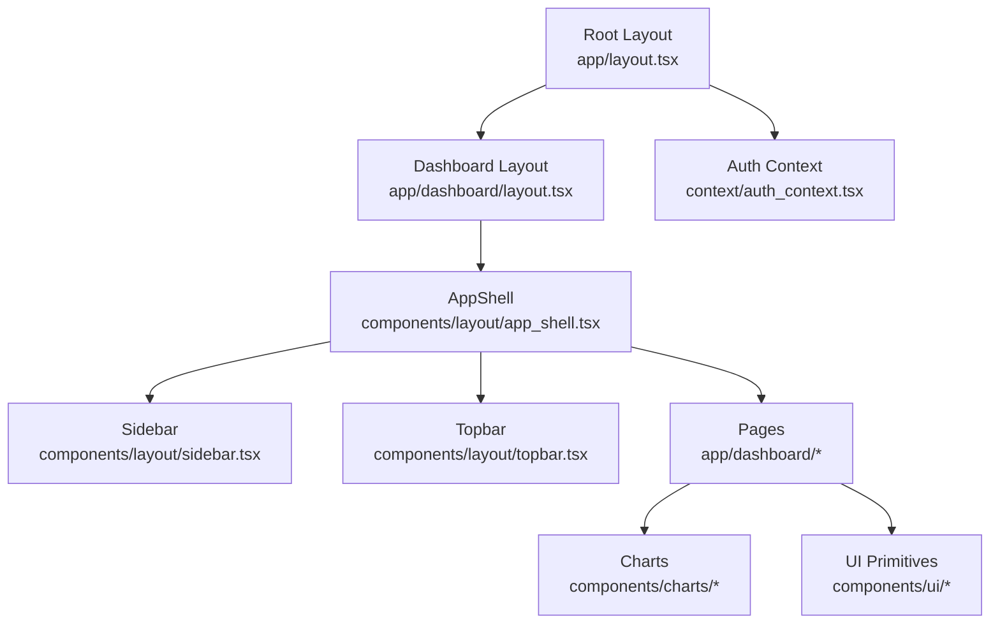
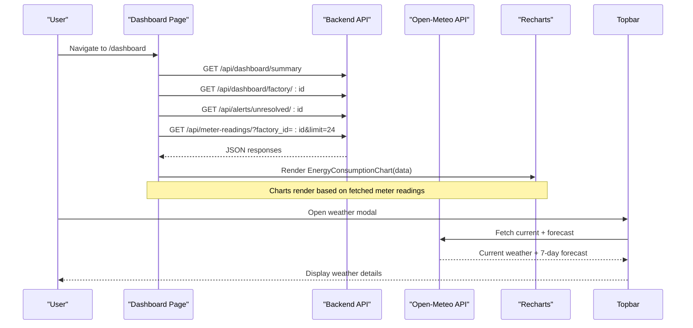
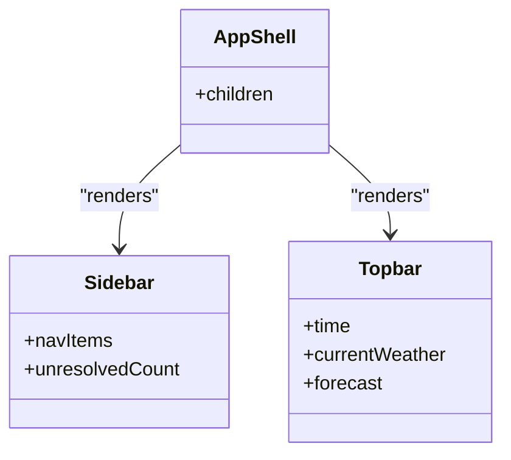
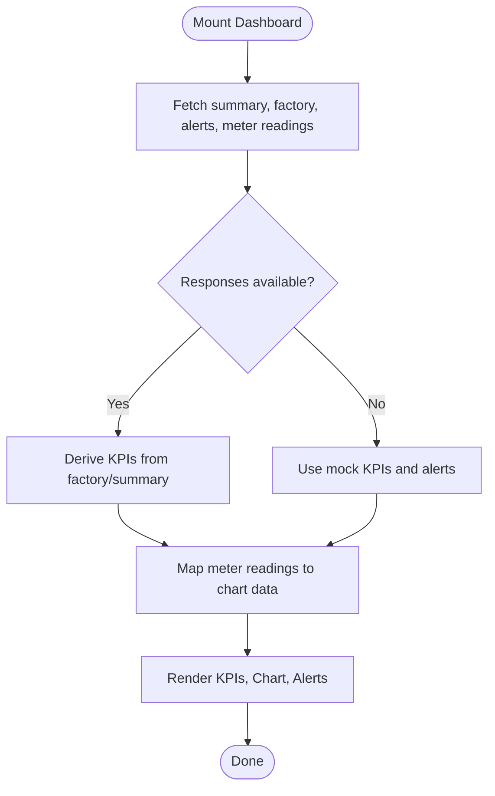
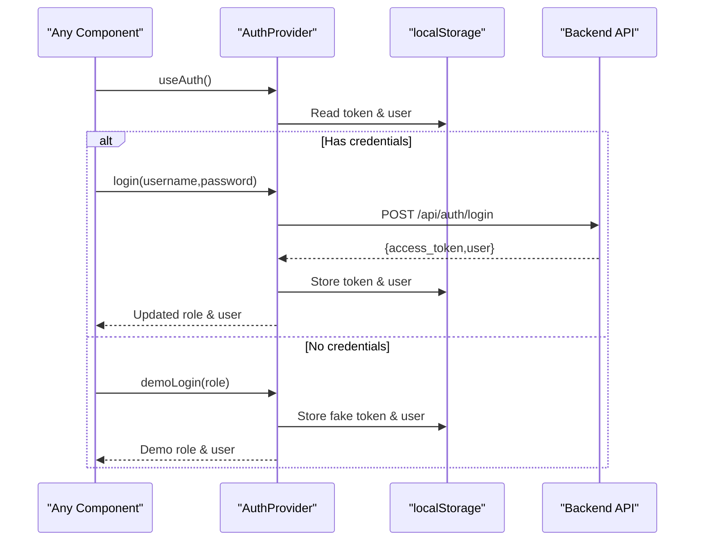
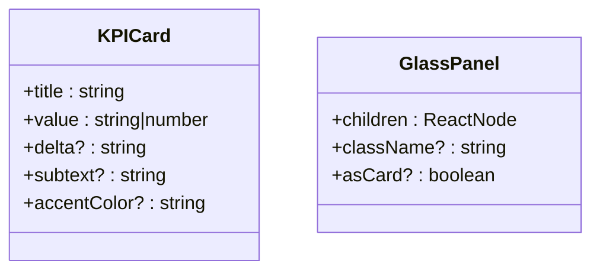
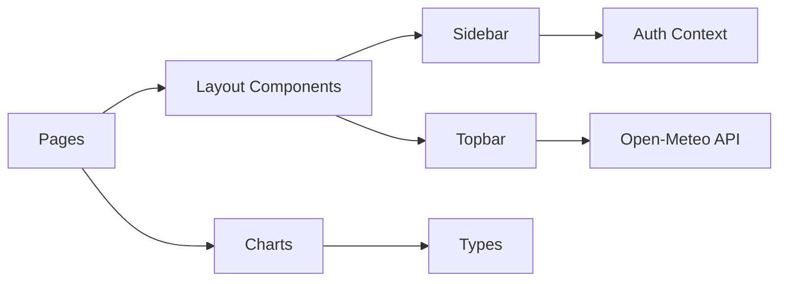

# Frontend Application

<cite>
**Referenced Files in This Document**
- [package.json](file://frontend/package.json)
- [README.md](file://frontend/README.md)
- [layout.tsx](file://frontend/app/layout.tsx)
- [dashboard layout.tsx](file://frontend/app/dashboard/layout.tsx)
- [auth_context.tsx](file://frontend/context/auth_context.tsx)
- [app_shell.tsx](file://frontend/components/layout/app_shell.tsx)
- [sidebar.tsx](file://frontend/components/layout/sidebar.tsx)
- [topbar.tsx](file://frontend/components/layout/topbar.tsx)
- [dashboard page.tsx](file://frontend/app/dashboard/page.tsx)
- [energy_consumption_chart.tsx](file://frontend/components/charts/energy_consumption_chart.tsx)
- [cost_breakdown_chart.tsx](file://frontend/components/charts/cost_breakdown_chart.tsx)
- [schedule_gantt.tsx](file://frontend/components/charts/schedule_gantt.tsx)
- [kpi_card.tsx](file://frontend/components/ui/kpi_card.tsx)
- [glass_panel.tsx](file://frontend/components/ui/glass_panel.tsx)
- [types index.ts](file://frontend/types/index.ts)
</cite>

## Table of Contents
1. Introduction
2. Project Structure
3. Core Components
4. Architecture Overview
5. Detailed Component Analysis
6. Dependency Analysis
7. Performance Considerations
8. Troubleshooting Guide
9. Conclusion

## Introduction
This document describes the TariffGuard Next.js frontend application. It explains the component architecture (app shell, sidebar, topbar), dashboard components (KPI cards, charts, forms), reusable UI components, page structure and routing for features such as live monitoring, schedule optimizer, tariff calendar, alerts, reports, and cost analysis. It also documents state management via React Context for authentication and global state, charting with Recharts, composition patterns, prop interfaces, event handling, Tailwind CSS styling, responsive design, accessibility considerations, performance optimizations, and integration with backend APIs including real-time updates.

## Project Structure
The project is a Next.js App Router application with:
- Root layout providing metadata and an AuthProvider wrapper around all pages.
- A dashboard route group that wraps content in an AppShell containing Sidebar and Topbar.
- Feature pages under app/dashboard for live monitoring, schedule optimizer, tariff calendar, alerts, reports, cost analysis, machines, chat, and settings.
- Shared components under components organized by feature area: charts, forms, layout, and ui.
- Global types and context for auth state.



**Diagram sources**
- [layout.tsx:10-24](file://frontend/app/layout.tsx#L10-L24)
- [dashboard layout.tsx:4-9](file://frontend/app/dashboard/layout.tsx#L4-L9)
- [app_shell.tsx:5-16](file://frontend/components/layout/app_shell.tsx#L5-L16)
- [sidebar.tsx:13-24](file://frontend/components/layout/sidebar.tsx#L13-L24)
- [topbar.tsx:19-113](file://frontend/components/layout/topbar.tsx#L19-L113)
- [dashboard page.tsx:12-171](file://frontend/app/dashboard/page.tsx#L12-L171)

**Section sources**
- [README.md:1-37](file://frontend/README.md#L1-L37)
- [package.json:1-38](file://frontend/package.json#L1-L38)
- [layout.tsx:1-25](file://frontend/app/layout.tsx#L1-L25)
- [dashboard layout.tsx:1-11](file://frontend/app/dashboard/layout.tsx#L1-L11)

## Core Components
- Root layout sets site metadata and wraps children with AuthProvider to provide authentication state globally.
- Dashboard layout composes AppShell to provide consistent chrome (sidebar, topbar, main content).
- AppShell arranges Sidebar and Topbar and renders page content in a scrollable main area.
- Sidebar provides navigation links for all features and displays user info and alert badge counts.
- Topbar shows current page title, time, weather widget, and plant status indicator.
- Dashboard overview page aggregates KPIs, energy consumption chart, and active alerts from backend or mock data.

Key responsibilities:
- Authentication state and persistence via localStorage and API calls are provided by AuthContext.
- Navigation and role-based UI cues are handled in Sidebar using Next.js router hooks.
- Data fetching for dashboard metrics uses parallel requests and fallbacks to mock data when needed.

**Section sources**
- [layout.tsx:10-24](file://frontend/app/layout.tsx#L10-L24)
- [dashboard layout.tsx:4-9](file://frontend/app/dashboard/layout.tsx#L4-L9)
- [app_shell.tsx:5-16](file://frontend/components/layout/app_shell.tsx#L5-L16)
- [sidebar.tsx:13-98](file://frontend/components/layout/sidebar.tsx#L13-L98)
- [topbar.tsx:19-150](file://frontend/components/layout/topbar.tsx#L19-L150)
- [dashboard page.tsx:12-171](file://frontend/app/dashboard/page.tsx#L12-L171)
- [auth_context.tsx:19-87](file://frontend/context/auth_context.tsx#L19-L87)

## Architecture Overview
The application follows a layered approach:
- Presentation layer: Pages and layout components compose UI primitives and charts.
- State layer: React Context manages authentication and user session across the app.
- Data layer: API client fetches dashboard, meter readings, alerts, and other resources; external weather API is used in Topbar.
- Routing: Next.js App Router organizes routes under app/dashboard for feature areas.



**Diagram sources**
- [dashboard page.tsx:16-62](file://frontend/app/dashboard/page.tsx#L16-L62)
- [energy_consumption_chart.tsx:5-64](file://frontend/components/charts/energy_consumption_chart.tsx#L5-L64)
- [topbar.tsx:34-70](file://frontend/components/layout/topbar.tsx#L34-L70)

## Detailed Component Analysis

### App Shell and Layout Components
- AppShell composes Sidebar and Topbar and provides a main content area with glass panel styling.
- Sidebar renders navigation items with icons, highlights the active route, and shows unresolved alert count fetched from the backend.
- Topbar computes page title from pathname, displays local time, integrates weather data, and includes a modal for 7-day forecast.



**Diagram sources**
- [app_shell.tsx:5-16](file://frontend/components/layout/app_shell.tsx#L5-L16)
- [sidebar.tsx:13-98](file://frontend/components/layout/sidebar.tsx#L13-L98)
- [topbar.tsx:19-150](file://frontend/components/layout/topbar.tsx#L19-L150)

**Section sources**
- [app_shell.tsx:5-16](file://frontend/components/layout/app_shell.tsx#L5-L16)
- [sidebar.tsx:13-98](file://frontend/components/layout/sidebar.tsx#L13-L98)
- [topbar.tsx:19-150](file://frontend/components/layout/topbar.tsx#L19-L150)

### Dashboard Overview Page
- Aggregates multiple backend endpoints concurrently and maps results into KPIs, alerts, and chart data.
- Uses fallback mock data when backend responses are unavailable.
- Renders KPI cards, energy consumption chart, and active alerts list.



**Diagram sources**
- [dashboard page.tsx:16-98](file://frontend/app/dashboard/page.tsx#L16-L98)
- [dashboard page.tsx:100-171](file://frontend/app/dashboard/page.tsx#L100-L171)

**Section sources**
- [dashboard page.tsx:12-171](file://frontend/app/dashboard/page.tsx#L12-L171)

### Authentication Context
- Provides login, register, demoLogin, logout, and isAuthenticated state.
- Persists token and user to localStorage and restores them on mount.
- Throws if used outside AuthProvider.



**Diagram sources**
- [auth_context.tsx:19-87](file://frontend/context/auth_context.tsx#L19-L87)

**Section sources**
- [auth_context.tsx:1-88](file://frontend/context/auth_context.tsx#L1-L88)

### Charts and Visualization
- EnergyConsumptionChart renders an area chart with grid and solar generation series using Recharts ResponsiveContainer.
- CostBreakdownChart is a placeholder ready for future implementation.
- ScheduleGantt visualizes machine schedules with baseline vs optimized views, tooltips, and time markers.

```mermaid
classDiagram
class EnergyConsumptionChart {
+data : EnergyReading[]
}
class CostBreakdownChart {
+placeholder
}
class ScheduleGantt {
+machines : Machine[]
+jobs : Job[]
+isOptimized : boolean
+showBaseline : boolean
+selectedJobId : string|null
+onJobClick(id) : void
}
EnergyConsumptionChart --> "uses" Recharts
ScheduleGantt --> "uses" Types(Machine, Job)
```

**Diagram sources**
- [energy_consumption_chart.tsx:5-64](file://frontend/components/charts/energy_consumption_chart.tsx#L5-L64)
- [cost_breakdown_chart.tsx:1-8](file://frontend/components/charts/cost_breakdown_chart.tsx#L1-L8)
- [schedule_gantt.tsx:6-25](file://frontend/components/charts/schedule_gantt.tsx#L6-L25)

**Section sources**
- [energy_consumption_chart.tsx:1-65](file://frontend/components/charts/energy_consumption_chart.tsx#L1-L65)
- [cost_breakdown_chart.tsx:1-8](file://frontend/components/charts/cost_breakdown_chart.tsx#L1-L8)
- [schedule_gantt.tsx:1-222](file://frontend/components/charts/schedule_gantt.tsx#L1-L222)

### Reusable UI Components
- KPICard displays metric value, delta, and subtext with accent color and glass panel background.
- GlassPanel provides consistent glassmorphism styling and optional card mode.



**Diagram sources**
- [kpi_card.tsx:4-36](file://frontend/components/ui/kpi_card.tsx#L4-L36)
- [glass_panel.tsx:4-19](file://frontend/components/ui/glass_panel.tsx#L4-L19)

**Section sources**
- [kpi_card.tsx:1-37](file://frontend/components/ui/kpi_card.tsx#L1-L37)
- [glass_panel.tsx:1-20](file://frontend/components/ui/glass_panel.tsx#L1-L20)

### Page Structure and Routing
- Routes are defined by Next.js App Router file conventions:
  - /dashboard: Overview with KPIs, chart, alerts.
  - /dashboard/live_monitoring: Live monitoring page.
  - /dashboard/schedule_optimizer: Schedule optimization with Gantt visualization.
  - /dashboard/tariff_calendar: Tariff periods and rates.
  - /dashboard/alerts: Alert management and stats.
  - /dashboard/reports: Reporting views.
  - /dashboard/cost_analysis: Cost breakdown and insights.
  - /dashboard/machines: Machine management.
  - /dashboard/chat: AI chat interface.
  - /dashboard/settings: Settings configuration.
- The dashboard layout applies AppShell to all nested pages.

**Section sources**
- [dashboard layout.tsx:4-9](file://frontend/app/dashboard/layout.tsx#L4-L9)
- [sidebar.tsx:13-24](file://frontend/components/layout/sidebar.tsx#L13-L24)

## Dependency Analysis
- External dependencies include Next.js, React, Recharts, Tailwind CSS, and Lucide icons.
- Internal dependencies:
  - Pages depend on layout components and charts.
  - Sidebar depends on auth context and API client for alert stats.
  - Topbar depends on external weather API.
  - Charts depend on shared types for data structures.



**Diagram sources**
- [package.json:12-19](file://frontend/package.json#L12-L19)
- [sidebar.tsx:31-35](file://frontend/components/layout/sidebar.tsx#L31-L35)
- [topbar.tsx:34-70](file://frontend/components/layout/topbar.tsx#L34-L70)
- [types index.ts:1-46](file://frontend/types/index.ts#L1-L46)

**Section sources**
- [package.json:12-19](file://frontend/package.json#L12-L19)
- [sidebar.tsx:31-35](file://frontend/components/layout/sidebar.tsx#L31-L35)
- [topbar.tsx:34-70](file://frontend/components/layout/topbar.tsx#L34-L70)
- [types index.ts:1-46](file://frontend/types/index.ts#L1-L46)

## Performance Considerations
- Parallel data fetching: Dashboard page uses concurrent requests to reduce load time.
- Conditional rendering: Loading states prevent unnecessary re-renders until data arrives.
- Responsive charts: Recharts ResponsiveContainer adapts to container size efficiently.
- Minimal reflows: Glass panels and Tailwind utilities minimize layout shifts.
- Debounced updates: Time updates in Topbar occur at reasonable intervals to avoid excessive state changes.
- Mock fallbacks: Graceful degradation ensures UI remains usable when backend is down.

[No sources needed since this section provides general guidance]

## Troubleshooting Guide
- Authentication errors: If login/register fails, verify network connectivity and backend availability; check localStorage for stale tokens.
- Missing data: Dashboard falls back to mock data; confirm endpoint paths and query parameters for factory_id and limits.
- Weather API failures: Topbar handles fetch errors gracefully; ensure CORS and network access to Open-Meteo.
- Chart rendering issues: Ensure data shape matches expected types (EnergyReading); validate time and numeric fields.
- Navigation mismatches: Active link highlighting relies on exact pathname matching; verify href values in Sidebar.

**Section sources**
- [auth_context.tsx:35-52](file://frontend/context/auth_context.tsx#L35-L52)
- [dashboard page.tsx:16-62](file://frontend/app/dashboard/page.tsx#L16-L62)
- [topbar.tsx:34-70](file://frontend/components/layout/topbar.tsx#L34-L70)
- [energy_consumption_chart.tsx:5-64](file://frontend/components/charts/energy_consumption_chart.tsx#L5-L64)
- [sidebar.tsx:47-73](file://frontend/components/layout/sidebar.tsx#L47-L73)

## Conclusion
TariffGuard’s frontend leverages Next.js App Router for structured routing, React Context for centralized authentication, and Recharts for rich data visualization. The modular component architecture separates concerns between layout, charts, and UI primitives, enabling scalable development. Robust error handling and fallbacks ensure resilience, while Tailwind CSS and glassmorphism deliver a modern, responsive user experience. Future enhancements can expand chart implementations, integrate real-time updates via WebSockets or polling, and refine accessibility and performance further.