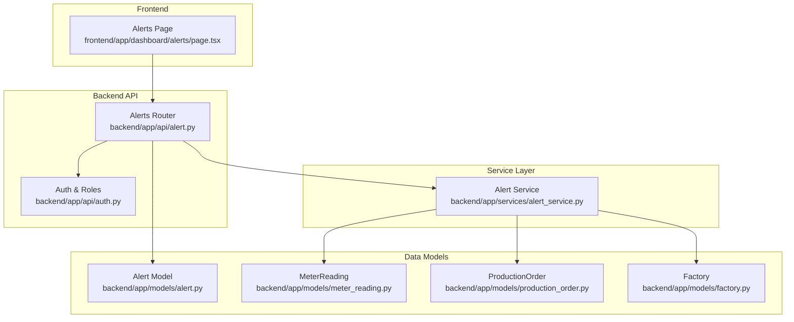
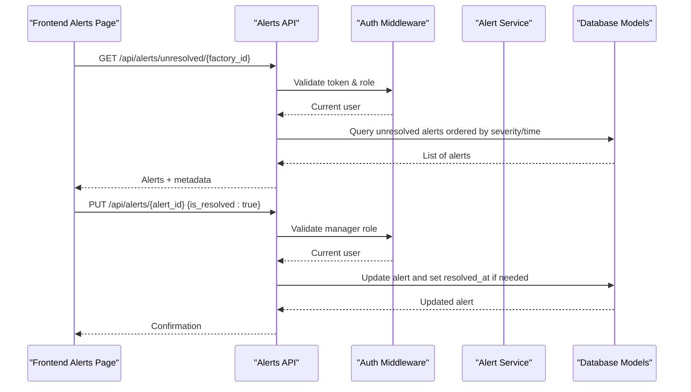
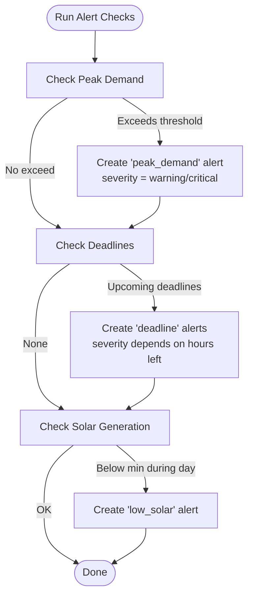
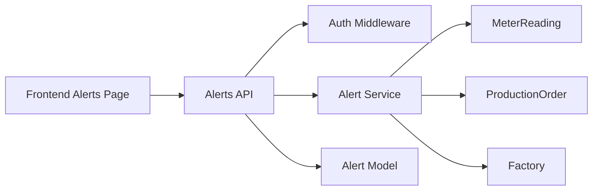

# Alerts Management

<cite>
**Referenced Files in This Document**
- [alert.py](file://backend/app/api/alert.py)
- [alert_service.py](file://backend/app/services/alert_service.py)
- [alert.py (model)](file://backend/app/models/alert.py)
- [alert.py (schema)](file://backend/app/schemas/alert.py)
- [factory.py](file://backend/app/models/factory.py)
- [meter_reading.py](file://backend/app/models/meter_reading.py)
- [production_order.py](file://backend/app/models/production_order.py)
- [auth.py](file://backend/app/api/auth.py)
- [alerts page.tsx](file://frontend/app/dashboard/alerts/page.tsx)
</cite>

## Table of Contents
1. [Introduction](#introduction)
2. [Project Structure](#project-structure)
3. [Core Components](#core-components)
4. [Architecture Overview](#architecture-overview)
5. [Detailed Component Analysis](#detailed-component-analysis)
6. [Dependency Analysis](#dependency-analysis)
7. [Performance Considerations](#performance-considerations)
8. [Troubleshooting Guide](#troubleshooting-guide)
9. [Conclusion](#conclusion)
10. [Appendices](#appendices)

## Introduction
This document explains the Alerts Management feature for TariffGuard, focusing on proactive alert generation, notification workflows, and alert resolution. It covers alert types (deadline warnings, energy consumption limits, equipment issues), severity levels, filtering/search capabilities, bulk operations, historical tracking, thresholds, escalation rules, and user preferences. It also outlines integration points with external notification systems and provides guidance for configuring thresholds and escalation behavior.

## Project Structure
The Alerts Management feature spans backend API endpoints, a service layer that generates alerts from live data, data models for persistence, schemas for request/response validation, and a frontend dashboard page to view and manage alerts.

**Diagram sources**
- [alert.py](file://backend/app/api/alert.py)
- [alert_service.py](file://backend/app/services/alert_service.py)
- [alert.py (model)](file://backend/app/models/alert.py)
- [meter_reading.py](file://backend/app/models/meter_reading.py)
- [production_order.py](file://backend/app/models/production_order.py)
- [factory.py](file://backend/app/models/factory.py)
- [alerts page.tsx](file://frontend/app/dashboard/alerts/page.tsx)

**Section sources**
- [alert.py](file://backend/app/api/alert.py)
- [alert_service.py](file://backend/app/services/alert_service.py)
- [alert.py (model)](file://backend/app/models/alert.py)
- [meter_reading.py](file://backend/app/models/meter_reading.py)
- [production_order.py](file://backend/app/models/production_order.py)
- [factory.py](file://backend/app/models/factory.py)
- [alerts page.tsx](file://frontend/app/dashboard/alerts/page.tsx)

## Core Components
- Alert model: Stores alert type, severity, message, value, threshold, read/resolved flags, and timestamps.
- Alert service: Proactively checks meter readings, production deadlines, and solar generation to create alerts with appropriate severity and thresholds.
- API endpoints: List, filter, generate, update (resolve/read), and get stats for alerts; protected by role-based auth.
- Frontend page: Displays active alerts, summary metrics, anomaly detection panel, and supports filtering, search, and bulk mark-as-read/dismiss.

Key responsibilities:
- Proactive generation: The service inspects current conditions and creates alerts when thresholds are breached or deadlines approach.
- Resolution workflow: Users can resolve or mark alerts as read via the API; resolved alerts capture a timestamp.
- Filtering and search: Backend supports filtering by factory, severity, and resolved status; frontend includes UI filters and a search input.
- Historical tracking: All alerts persist with created_at and resolved_at timestamps for audit and reporting.

**Section sources**
- [alert.py (model):5-18](file://backend/app/models/alert.py#L5-L18)
- [alert_service.py:19-140](file://backend/app/services/alert_service.py#L19-L140)
- [alert.py (API):14-107](file://backend/app/api/alert.py#L14-L107)
- [alerts page.tsx:25-314](file://frontend/app/dashboard/alerts/page.tsx#L25-L314)

## Architecture Overview
The system follows a layered architecture:
- Frontend calls REST APIs to fetch unresolved alerts and statistics, and to update alert status.
- API enforces authentication and roles, then delegates to the service for business logic.
- Service queries related models (meter readings, production orders, factories) to evaluate thresholds and create alerts.
- Alerts are persisted and returned to the frontend for display and management.

**Diagram sources**
- [alert.py (API):45-80](file://backend/app/api/alert.py#L45-L80)
- [auth.py:63-89](file://backend/app/api/auth.py#L63-L89)
- [alert_service.py:124-140](file://backend/app/services/alert_service.py#L124-L140)

## Detailed Component Analysis

### Alert Data Model and Schemas
- Alert model fields include type (e.g., peak_demand, deadline, low_solar), severity (info, warning, critical), message, value, threshold, is_read, is_resolved, created_at, resolved_at.
- Schemas define request/response contracts for creating, updating, and returning alerts.

Complexity considerations:
- Queries typically filter by factory_id and boolean flags; indexing on factory_id and created_at improves performance for listing and stats.

**Section sources**
- [alert.py (model):5-18](file://backend/app/models/alert.py#L5-L18)
- [alert.py (schema):5-28](file://backend/app/schemas/alert.py#L5-L28)

### Proactive Alert Generation
The service implements three core checks:
- Peak demand: Compares latest kW against a threshold; escalates to critical if exceeding 1.2x threshold; prevents duplicate alerts within an hour.
- Deadline warnings: Scans pending orders due within a configurable window; sets severity based on hours remaining; avoids duplicates per order number.
- Low solar generation: During daytime hours, compares actual solar kWh against a minimum; warns if below expected capacity.

Thresholds and escalation:
- Peak demand default threshold and escalation factor are defined in code; deadline window and severity thresholds are parameterized.
- Solar check uses factory’s solar capacity and a minimum threshold during operational hours.

**Diagram sources**
- [alert_service.py:19-140](file://backend/app/services/alert_service.py#L19-L140)

**Section sources**
- [alert_service.py:19-140](file://backend/app/services/alert_service.py#L19-L140)

### API Endpoints and Access Control
- List alerts: Supports filtering by factory_id, severity, and is_resolved; returns sorted results with limit.
- Generate alerts: Triggers proactive checks for a factory; requires manager role.
- Unresolved alerts: Returns only open alerts, prioritized by severity and time.
- Update alert: Allows marking as read/resolved; sets resolved_at when resolved; requires manager role.
- Stats: Aggregates total, unresolved, critical, and resolved counts per factory.

Authentication and roles:
- Uses token-based auth; require_role ensures only authorized users can perform sensitive actions like generating alerts or resolving them.

**Section sources**
- [alert.py (API):14-107](file://backend/app/api/alert.py#L14-L107)
- [auth.py:63-89](file://backend/app/api/auth.py#L63-L89)

### Frontend Alerts Page
Features:
- Loads unresolved alerts and stats concurrently.
- Displays summary cards for total, high severity, medium severity, and resolved counts.
- Provides filter bar with search input and dropdowns for severity, type, and time range.
- Active alerts list shows icon, message, severity badge, value/threshold, source context, and actions (View Schedule, Dismiss).
- Bulk operation: Mark all read/dismiss for non-supervisor roles.
- Anomaly detection panel visualizes recent consumption anomalies with AI insights.
- Recently resolved section shows historical resolutions.

User interactions:
- Dismiss triggers PUT to mark alert resolved.
- Mark all read performs parallel updates across all displayed alerts.

**Section sources**
- [alerts page.tsx:25-314](file://frontend/app/dashboard/alerts/page.tsx#L25-L314)

### Alert Types, Severity Levels, and Thresholds
- Types:
  - peak_demand: Energy consumption spikes above configured kW threshold.
  - deadline: Upcoming production order deadlines approaching within a configured window.
  - low_solar: Solar generation below expected during operational hours.
- Severity levels:
  - info, warning, critical.
  - Escalation logic:
    - Peak demand becomes critical when exceeding 1.2x threshold.
    - Deadline severity escalates to critical when fewer than 2 hours remain.
- Thresholds:
  - Peak demand threshold defaults to a fixed value in code.
  - Deadline window defaults to a fixed number of hours ahead.
  - Solar minimum threshold defaults to a fixed value during daytime.

Note: These defaults are embedded in the service implementation and can be extended to support dynamic configuration per factory or user preference.

**Section sources**
- [alert_service.py:19-140](file://backend/app/services/alert_service.py#L19-L140)

### Notification System and External Integrations
Current state:
- The service persists alerts but does not send notifications directly.
- Integration points exist to add external channels (email, webhooks, SMS) by extending the service after alert creation.

Recommended integration pattern:
- After creating an alert in the service, call a notification adapter that routes messages to configured channels based on severity and user preferences.
- Use environment variables to configure provider credentials and endpoints.
- Implement retry and idempotency to avoid duplicate notifications.

[No sources needed since this section proposes integrations beyond current implementation]

### Alert Filtering, Search, and Historical Tracking
- Backend filtering:
  - Factory scope via factory_id.
  - Severity filter via query parameter.
  - Resolved status filter via boolean flag.
  - Limiting results for pagination control.
- Frontend search and filters:
  - Text search input for alert content.
  - Dropdowns for severity, type, and time range.
- Historical tracking:
  - created_at and resolved_at timestamps enable auditing and trend analysis.
  - Stats endpoint provides aggregated metrics for dashboards.

**Section sources**
- [alert.py (API):14-107](file://backend/app/api/alert.py#L14-L107)
- [alerts page.tsx:129-167](file://frontend/app/dashboard/alerts/page.tsx#L129-L167)

### User Preferences and Role-Based Controls
- Roles:
  - Manager: Can generate alerts and update alert status.
  - Supervisor: Cannot use bulk mark-all-read action on the frontend.
- Preferences:
  - No explicit per-user alert preferences in current code; could be added to store notification channel preferences and threshold overrides.

**Section sources**
- [auth.py:83-89](file://backend/app/api/auth.py#L83-L89)
- [alerts page.tsx:158-167](file://frontend/app/dashboard/alerts/page.tsx#L158-L167)

## Dependency Analysis
The alert system has clear dependencies between layers:
- API depends on auth middleware and service layer.
- Service depends on data models for meter readings, production orders, and factories.
- Frontend depends on API endpoints for data retrieval and updates.

**Diagram sources**
- [alert.py (API):1-107](file://backend/app/api/alert.py#L1-L107)
- [alert_service.py:1-140](file://backend/app/services/alert_service.py#L1-L140)
- [alerts page.tsx:1-314](file://frontend/app/dashboard/alerts/page.tsx#L1-L314)

**Section sources**
- [alert.py (API):1-107](file://backend/app/api/alert.py#L1-L107)
- [alert_service.py:1-140](file://backend/app/services/alert_service.py#L1-L140)
- [alerts page.tsx:1-314](file://frontend/app/dashboard/alerts/page.tsx#L1-L314)

## Performance Considerations
- Query efficiency:
  - Filter by factory_id and booleans; ensure indexes on factory_id and created_at for faster sorting and filtering.
- Duplicate prevention:
  - Peak demand alerts deduplicate within an hour to reduce noise.
  - Deadline alerts deduplicate per order number until resolved.
- Batch operations:
  - Frontend marks all read using parallel requests; consider server-side batch update for large alert sets.
- Time windows:
  - Daytime checks for solar generation limit unnecessary queries outside operational hours.

[No sources needed since this section provides general guidance]

## Troubleshooting Guide
Common issues and resolutions:
- Authentication failures:
  - Ensure Bearer token is present and valid; invalid tokens result in 401 errors.
- Authorization errors:
  - Non-manager roles attempting to generate or resolve alerts receive 403; verify user role.
- Missing alerts:
  - Verify meter readings and production orders exist for the factory; service relies on these inputs.
- Duplicate alerts:
  - Check deduplication windows; peak demand alerts suppress duplicates within one hour.
- Frontend errors:
  - Network or API errors surface in error banners; inspect console and network tab for details.

**Section sources**
- [auth.py:63-89](file://backend/app/api/auth.py#L63-L89)
- [alert.py (API):67-80](file://backend/app/api/alert.py#L67-L80)
- [alert_service.py:27-48](file://backend/app/services/alert_service.py#L27-L48)
- [alerts page.tsx:48-69](file://frontend/app/dashboard/alerts/page.tsx#L48-L69)

## Conclusion
The Alerts Management feature provides proactive monitoring through automated checks on energy usage, production deadlines, and solar generation. It offers robust filtering, search, and bulk operations on the frontend, while the backend enforces secure access and maintains comprehensive historical records. Extending the system with external notifications and user preferences will further enhance responsiveness and personalization.

[No sources needed since this section summarizes without analyzing specific files]

## Appendices

### API Reference Summary
- GET /api/alerts: List alerts with optional filters (factory_id, severity, is_resolved, limit).
- POST /api/alerts/generate/{factory_id}: Generate alerts for a factory (manager role required).
- GET /api/alerts/unresolved/{factory_id}: Get unresolved alerts ordered by severity and time.
- PUT /api/alerts/{alert_id}: Update alert status (read/resolved); sets resolved_at when resolved (manager role required).
- GET /api/alerts/stats/{factory_id}: Return alert statistics (total, unresolved, critical, resolved).

**Section sources**
- [alert.py (API):14-107](file://backend/app/api/alert.py#L14-L107)

### Configuration Notes
- Default thresholds and windows are embedded in the service; consider moving to environment variables or per-factory settings for flexibility.
- Add notification provider configuration via environment variables for email/webhook/SMS integration.

**Section sources**
- [alert_service.py:19-140](file://backend/app/services/alert_service.py#L19-L140)
- [config.py:4-21](file://backend/app/core/config.py#L4-L21)