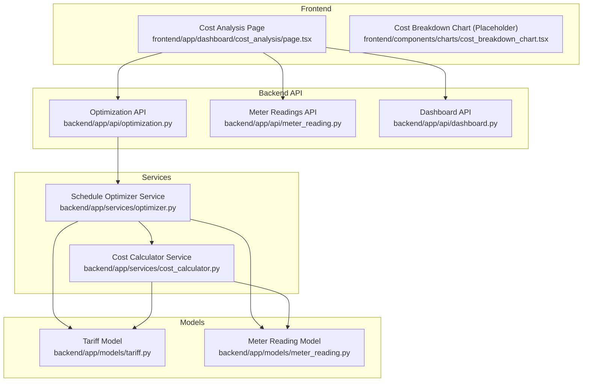
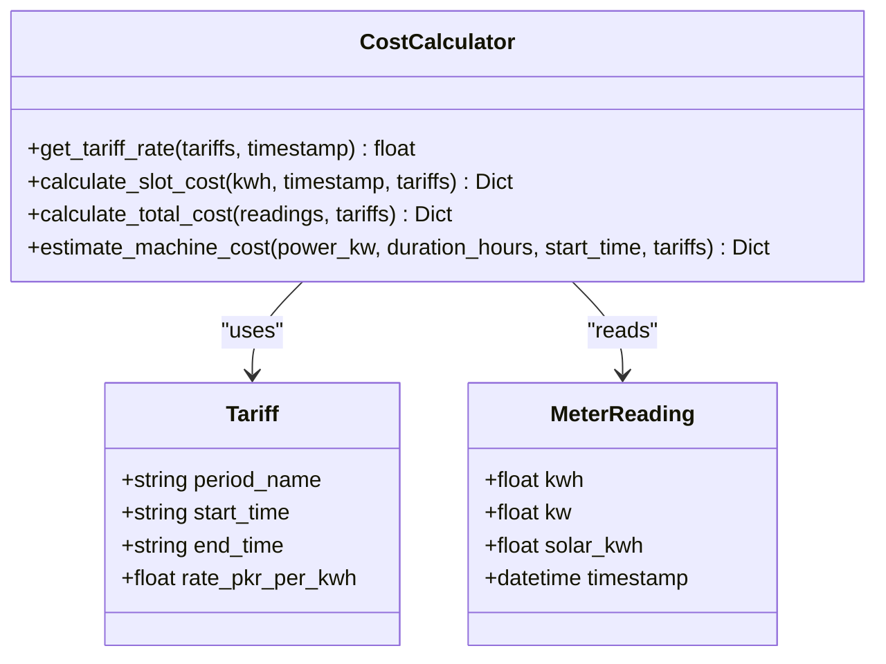
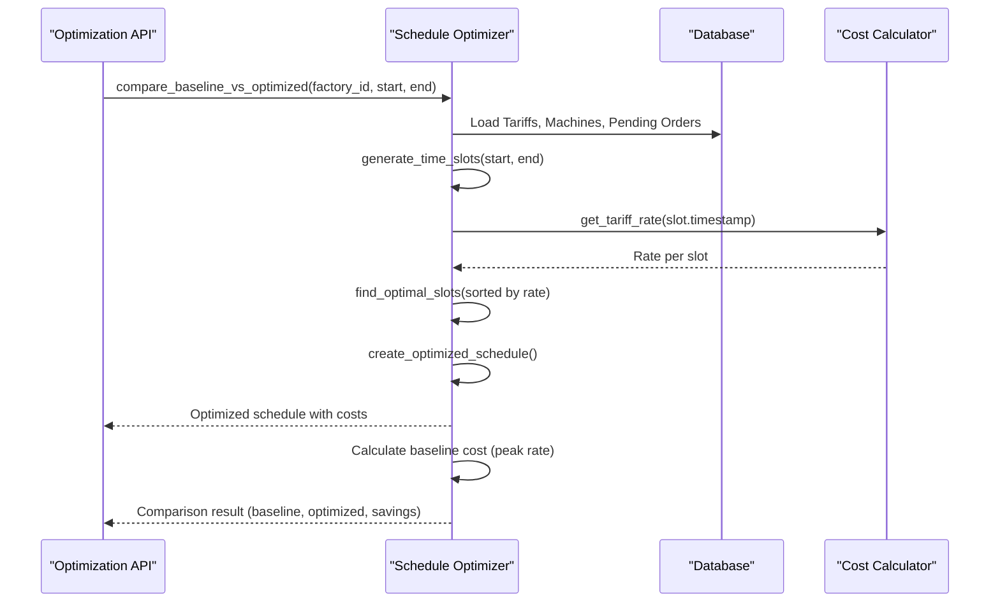
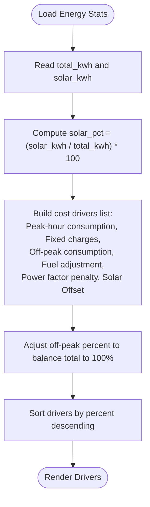
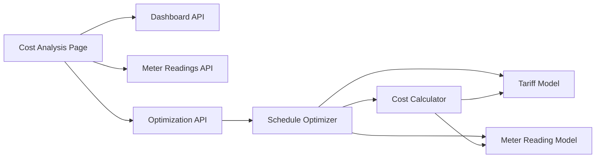

# Cost Analysis

<cite>
**Referenced Files in This Document**
- [page.tsx](file://frontend/app/dashboard/cost_analysis/page.tsx)
- [cost_breakdown_chart.tsx](file://frontend/components/charts/cost_breakdown_chart.tsx)
- [cost_calculator.py](file://backend/app/services/cost_calculator.py)
- [optimizer.py](file://backend/app/services/optimizer.py)
- [optimization.py](file://backend/app/api/optimization.py)
- [meter_reading.py](file://backend/app/api/meter_reading.py)
- [dashboard.py](file://backend/app/api/dashboard.py)
- [tariff.py](file://backend/app/models/tariff.py)
- [meter_reading_model.py](file://backend/app/models/meter_reading.py)
- [index.ts](file://frontend/types/index.ts)
</cite>

## Table of Contents
1. [Introduction](#introduction)
2. [Project Structure](#project-structure)
3. [Core Components](#core-components)
4. [Architecture Overview](#architecture-overview)
5. [Detailed Component Analysis](#detailed-component-analysis)
6. [Dependency Analysis](#dependency-analysis)
7. [Performance Considerations](#performance-considerations)
8. [Troubleshooting Guide](#troubleshooting-guide)
9. [Conclusion](#conclusion)
10. [Appendices](#appendices)

## Introduction
This document explains the Cost Analysis page and how it computes multi-factor costs, visualizes cost breakdowns, provides optimization recommendations, and compares scheduling strategies. It also details integration points with cost calculation services, tariff rate data, meter readings, and production scheduling to support scenario analysis, budget forecasting, and cost reduction strategies.

## Project Structure
The Cost Analysis feature spans frontend UI components and backend services:
- Frontend: A dedicated page that fetches dashboard stats and schedule comparison results, renders charts for baseline vs optimized costs, peak vs off-peak consumption, and cost drivers, and displays AI-driven recommendations.
- Backend: Services compute energy costs using tariffs, optimize schedules to minimize costs, and expose APIs for comparison and statistics.



**Diagram sources**
- [page.tsx:56-74](file://frontend/app/dashboard/cost_analysis/page.tsx#L56-L74)
- [optimization.py:11-48](file://backend/app/api/optimization.py#L11-L48)
- [meter_reading.py:113-141](file://backend/app/api/meter_reading.py#L113-L141)
- [dashboard.py:44-79](file://backend/app/api/dashboard.py#L44-L79)
- [optimizer.py:14-238](file://backend/app/services/optimizer.py#L14-L238)
- [cost_calculator.py:12-110](file://backend/app/services/cost_calculator.py#L12-L110)
- [tariff.py:5-19](file://backend/app/models/tariff.py#L5-L19)
- [meter_reading_model.py:5-17](file://backend/app/models/meter_reading.py#L5-L17)

**Section sources**
- [page.tsx:56-74](file://frontend/app/dashboard/cost_analysis/page.tsx#L56-L74)
- [optimization.py:11-48](file://backend/app/api/optimization.py#L11-L48)
- [meter_reading.py:113-141](file://backend/app/api/meter_reading.py#L113-L141)
- [dashboard.py:44-79](file://backend/app/api/dashboard.py#L44-L79)
- [optimizer.py:14-238](file://backend/app/services/optimizer.py#L14-L238)
- [cost_calculator.py:12-110](file://backend/app/services/cost_calculator.py#L12-L110)
- [tariff.py:5-19](file://backend/app/models/tariff.py#L5-L19)
- [meter_reading_model.py:5-17](file://backend/app/models/meter_reading.py#L5-L17)

## Core Components
- Cost Calculation Service: Computes per-slot and total energy costs based on time-of-use tariffs, tracks peak demand, and accounts for solar generation offsets.
- Schedule Optimizer: Generates optimal production schedules by selecting cheapest time slots, estimates costs, and compares baseline vs optimized scenarios.
- APIs: Expose schedule optimization and comparison endpoints; provide meter reading statistics and factory-level energy summaries.
- Frontend Cost Analysis Page: Fetches stats and comparison data, derives cost drivers, and renders comparative charts and recommendations.

Key responsibilities:
- Base electricity rates: Determined by tariff periods and timestamps.
- Peak demand charges: Derived from maximum kW observed in meter readings.
- Solar generation offsets: Subtracted from grid consumption to estimate savings.
- Production-related costs: Estimated per machine and order duration using power ratings and selected tariff slots.

**Section sources**
- [cost_calculator.py:15-110](file://backend/app/services/cost_calculator.py#L15-L110)
- [optimizer.py:21-238](file://backend/app/services/optimizer.py#L21-L238)
- [optimization.py:11-48](file://backend/app/api/optimization.py#L11-L48)
- [meter_reading.py:113-141](file://backend/app/api/meter_reading.py#L113-L141)
- [dashboard.py:44-79](file://backend/app/api/dashboard.py#L44-L79)
- [page.tsx:56-104](file://frontend/app/dashboard/cost_analysis/page.tsx#L56-L104)

## Architecture Overview
The Cost Analysis workflow integrates multiple services and models to compute and visualize costs:

```mermaid
sequenceDiagram
participant FE as "Cost Analysis Page"
participant DASH as "Dashboard API"
participant META as "Meter Readings API"
participant OPT as "Optimization API"
participant SO as "Schedule Optimizer"
participant CC as "Cost Calculator"
participant DB as "Database (Tariffs, Meter Readings)"
FE->>DASH : GET /api/dashboard/factory/{id}
DASH-->>FE : Factory energy stats (total_kwh, peak_kw, solar_kwh)
FE->>META : GET /api/meter-readings/stats/{id}
META-->>FE : Stats (total_kwh, avg_kwh, peak_kw, solar_kwh)
FE->>OPT : POST /api/optimize/compare/{id}
OPT->>SO : compare_baseline_vs_optimized(factory_id, start, end)
SO->>DB : Load Tariffs, Machines, Orders
SO->>CC : get_tariff_rate(timestamp)
CC-->>SO : Rate per slot
SO-->>OPT : Baseline vs Optimized costs and schedule
OPT-->>FE : Comparison result
Note over FE,OPT : Frontend renders baseline vs optimized bar chart,<br/>peak vs off-peak stacked bars, and cost drivers.
```

**Diagram sources**
- [page.tsx:56-74](file://frontend/app/dashboard/cost_analysis/page.tsx#L56-L74)
- [dashboard.py:44-79](file://backend/app/api/dashboard.py#L44-L79)
- [meter_reading.py:113-141](file://backend/app/api/meter_reading.py#L113-L141)
- [optimization.py:31-48](file://backend/app/api/optimization.py#L31-L48)
- [optimizer.py:192-238](file://backend/app/services/optimizer.py#L192-L238)
- [cost_calculator.py:15-50](file://backend/app/services/cost_calculator.py#L15-L50)

## Detailed Component Analysis

### Cost Calculation Service
Responsibilities:
- Determine applicable tariff rate for a timestamp across time-of-use periods, including overnight ranges.
- Compute per-slot cost and aggregate totals, tracking peak demand and solar offsets.
- Estimate machine run costs given power rating, duration, and start time.

Algorithm highlights:
- Time-of-use matching handles wrap-around periods.
- Grid consumption is derived by subtracting solar generation from total consumption.
- Average rate computed as total cost divided by total kWh.

Complexity:
- Per-slot cost computation is O(1).
- Total cost aggregation is O(n) over meter readings.

Error handling:
- Defaults to a base rate when no tariff matches.
- Ensures non-negative grid consumption.

**Section sources**
- [cost_calculator.py:15-110](file://backend/app/services/cost_calculator.py#L15-L110)

#### Class Diagram


**Diagram sources**
- [cost_calculator.py:12-110](file://backend/app/services/cost_calculator.py#L12-L110)
- [tariff.py:5-19](file://backend/app/models/tariff.py#L5-L19)
- [meter_reading_model.py:5-17](file://backend/app/models/meter_reading.py#L5-L17)

### Schedule Optimizer
Responsibilities:
- Generate time slots within a window and compute tariff rates per slot.
- Find optimal consecutive slots for each order while respecting locked slots per machine.
- Create an optimized schedule with estimated costs and kWh per order.
- Compare baseline (assumed peak-rate execution) vs optimized schedule to quantify savings.

Processing logic:
- Sorts slots by rate to select cheapest windows.
- Tracks used slots per machine to avoid conflicts.
- Aggregates total cost and kWh across orders.

Comparison method:
- Baseline cost uses a fixed peak rate assumption.
- Savings are calculated as difference between baseline and optimized costs.

**Section sources**
- [optimizer.py:21-238](file://backend/app/services/optimizer.py#L21-L238)

#### Sequence Diagram: Compare Baseline vs Optimized


**Diagram sources**
- [optimization.py:31-48](file://backend/app/api/optimization.py#L31-L48)
- [optimizer.py:192-238](file://backend/app/services/optimizer.py#L192-L238)
- [cost_calculator.py:15-50](file://backend/app/services/cost_calculator.py#L15-L50)

### Frontend Cost Analysis Page
Responsibilities:
- Fetch factory energy stats and meter reading statistics.
- Request schedule comparison to obtain baseline vs optimized costs.
- Derive cost drivers from energy stats (including solar offset percentage).
- Render:
  - Baseline vs optimized cost comparison chart (last 7 days).
  - Peak vs off-peak consumption stacked chart.
  - Cost drivers visualization with percentages.
  - AI recommendations panel highlighting actionable savings opportunities.

Data flow:
- Uses dashboard and meter reading APIs for stats.
- Calls optimization comparison endpoint for schedule-based savings.
- Falls back to mock timeseries arrays when detailed daily breakdowns are unavailable.

**Section sources**
- [page.tsx:56-104](file://frontend/app/dashboard/cost_analysis/page.tsx#L56-L104)
- [page.tsx:115-179](file://frontend/app/dashboard/cost_analysis/page.tsx#L115-L179)
- [page.tsx:181-221](file://frontend/app/dashboard/cost_analysis/page.tsx#L181-L221)

#### Flowchart: Cost Drivers Derivation


**Diagram sources**
- [page.tsx:85-104](file://frontend/app/dashboard/cost_analysis/page.tsx#L85-L104)

### Cost Breakdown Chart Component
A placeholder component exists for rendering a cost breakdown chart. It can be extended to integrate with actual cost data returned by the backend or derived from meter readings and tariffs.

**Section sources**
- [cost_breakdown_chart.tsx:1-8](file://frontend/components/charts/cost_breakdown_chart.tsx#L1-L8)

## Dependency Analysis
Coupling and cohesion:
- The Cost Analysis Page depends on Dashboard and Meter Reading APIs for stats and on Optimization API for schedule comparisons.
- The Schedule Optimizer depends on Tariff and Meter Reading models and uses the Cost Calculator service for rate lookups.
- The Cost Calculator service depends on Tariff definitions to determine rates and on Meter Reading data for aggregations.

External integrations:
- Tariff database provides time-of-use rates and fixed charges.
- Meter reading ingestion supports CSV import and bulk creation for historical analysis.

Potential circular dependencies:
- None detected; services are layered with clear separation.



**Diagram sources**
- [page.tsx:56-74](file://frontend/app/dashboard/cost_analysis/page.tsx#L56-L74)
- [optimization.py:11-48](file://backend/app/api/optimization.py#L11-L48)
- [optimizer.py:14-238](file://backend/app/services/optimizer.py#L14-L238)
- [cost_calculator.py:12-110](file://backend/app/services/cost_calculator.py#L12-L110)
- [tariff.py:5-19](file://backend/app/models/tariff.py#L5-L19)
- [meter_reading_model.py:5-17](file://backend/app/models/meter_reading.py#L5-L17)

**Section sources**
- [page.tsx:56-74](file://frontend/app/dashboard/cost_analysis/page.tsx#L56-L74)
- [optimization.py:11-48](file://backend/app/api/optimization.py#L11-L48)
- [optimizer.py:14-238](file://backend/app/services/optimizer.py#L14-L238)
- [cost_calculator.py:12-110](file://backend/app/services/cost_calculator.py#L12-L110)
- [tariff.py:5-19](file://backend/app/models/tariff.py#L5-L19)
- [meter_reading_model.py:5-17](file://backend/app/models/meter_reading.py#L5-L17)

## Performance Considerations
- Time-of-use rate lookup is constant-time per slot; total cost aggregation scales linearly with number of meter readings.
- Schedule optimization sorts time slots by rate; complexity is O(n log n) where n is number of slots.
- Avoid excessive granularity in time slots to reduce computational overhead.
- Cache tariff rates per day if repeated queries occur within short intervals.
- Use pagination and limits on meter reading queries to prevent large payloads.

[No sources needed since this section provides general guidance]

## Troubleshooting Guide
Common issues and resolutions:
- Missing daily breakdown data: The frontend logs a warning when detailed 7-day breakdowns are not provided by APIs and falls back to mock data. Ensure backend endpoints return complete timeseries data for accurate visualization.
- No tariff matches: If no tariff period matches a timestamp, a default rate is applied. Verify tariff periods cover all operating hours, including overnight ranges.
- Zero or negative grid consumption: Ensure solar_kwh does not exceed total_kwh; the service clamps grid consumption to non-negative values.
- API errors: Handle HTTP exceptions gracefully in the frontend and display user-friendly messages.

**Section sources**
- [page.tsx:56-74](file://frontend/app/dashboard/cost_analysis/page.tsx#L56-L74)
- [cost_calculator.py:15-34](file://backend/app/services/cost_calculator.py#L15-L34)
- [cost_calculator.py:79-80](file://backend/app/services/cost_calculator.py#L79-L80)

## Conclusion
The Cost Analysis page integrates tariff-aware cost calculations, production scheduling optimization, and rich visualizations to help users understand and reduce energy costs. By leveraging time-of-use rates, peak demand insights, and solar offsets, the system provides actionable recommendations and comparative analyses between baseline and optimized schedules. Extending the cost breakdown chart and enriching API responses will further enhance scenario analysis, budget forecasting, and reporting capabilities.

[No sources needed since this section summarizes without analyzing specific files]

## Appendices

### Multi-Factor Cost Calculation Details
- Base electricity rates: Determined by tariff periods matched to timestamps, including overnight ranges.
- Peak demand charges: Derived from maximum kW observed in meter readings.
- Solar generation offsets: Subtracted from total consumption to estimate grid usage and savings.
- Production-related costs: Estimated per machine and order duration using power ratings and selected tariff slots.

**Section sources**
- [cost_calculator.py:15-110](file://backend/app/services/cost_calculator.py#L15-L110)
- [optimizer.py:97-190](file://backend/app/services/optimizer.py#L97-L190)

### Cost Breakdown Visualizations
- Baseline vs optimized cost comparison chart shows daily cost differences and savings percentages.
- Peak vs off-peak stacked chart illustrates cost distribution across high and low tariff periods.
- Cost drivers visualization breaks down contributions from peak-hour consumption, fixed charges, off-peak consumption, fuel adjustments, power factor penalties, and solar offsets.

**Section sources**
- [page.tsx:115-179](file://frontend/app/dashboard/cost_analysis/page.tsx#L115-L179)

### Comparative Analysis Between Scheduling Strategies
- Baseline assumes all orders run at peak rate.
- Optimized schedule selects cheapest consecutive slots per machine, avoiding conflicts.
- Comparison returns baseline cost, optimized cost, and savings amount and percentage.

**Section sources**
- [optimizer.py:192-238](file://backend/app/services/optimizer.py#L192-L238)
- [optimization.py:31-48](file://backend/app/api/optimization.py#L31-L48)

### Integration Points
- Tariff rate database: Provides time-of-use rates and fixed charges for cost calculations.
- Meter reading ingestion: Supports CSV import and bulk creation for historical analysis.
- Production cost models: Machine power ratings and order durations drive cost estimations.

**Section sources**
- [tariff.py:5-19](file://backend/app/models/tariff.py#L5-L19)
- [meter_reading.py:41-88](file://backend/app/api/meter_reading.py#L41-L88)
- [optimizer.py:120-178](file://backend/app/services/optimizer.py#L120-L178)

### Examples of Scenario Analysis, Budget Forecasting, and Cost Reduction Strategies
- Scenario analysis: Use schedule comparison to simulate shifting loads to off-peak hours and quantify savings.
- Budget forecasting: Aggregate optimized costs over planning horizons using tariff rates and expected production volumes.
- Cost reduction strategies: Shift operations to solar windows, install power factor correction, and reduce peak starts.

**Section sources**
- [page.tsx:181-221](file://frontend/app/dashboard/cost_analysis/page.tsx#L181-L221)
- [optimizer.py:192-238](file://backend/app/services/optimizer.py#L192-L238)

### Cost Allocation Methods and Reporting Capabilities
- Cost allocation: Assign costs per order and machine based on selected slots and power ratings.
- Reporting: Export CSV with key metrics such as total energy cost, savings, average peak demand, and solar utilization.

**Section sources**
- [optimizer.py:160-178](file://backend/app/services/optimizer.py#L160-L178)
- [reports page reference:68-103](file://frontend/app/dashboard/reports/page.tsx#L68-L103)