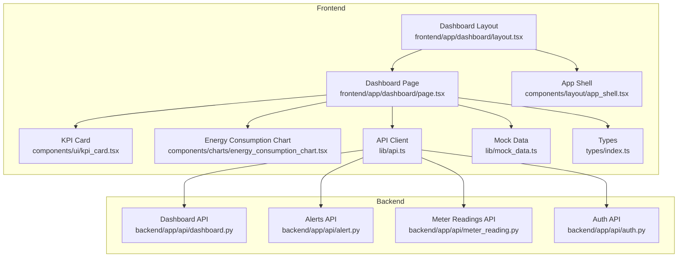
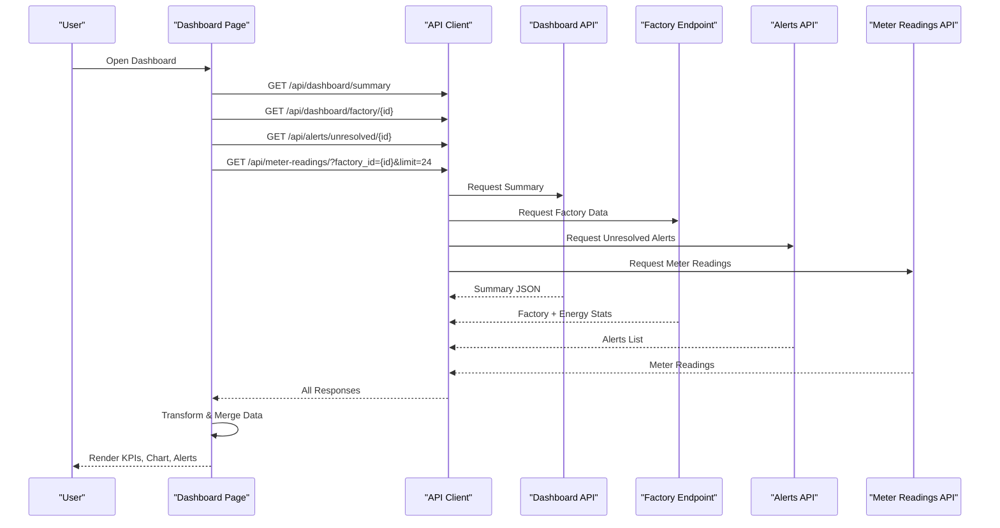
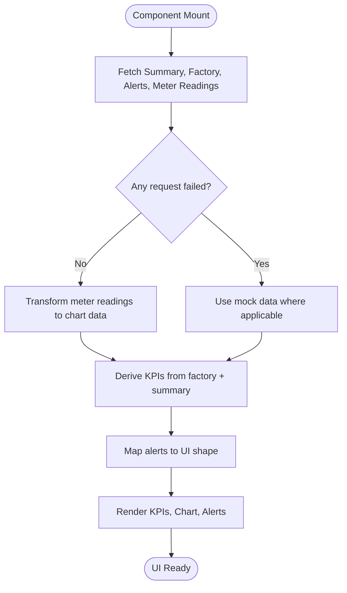
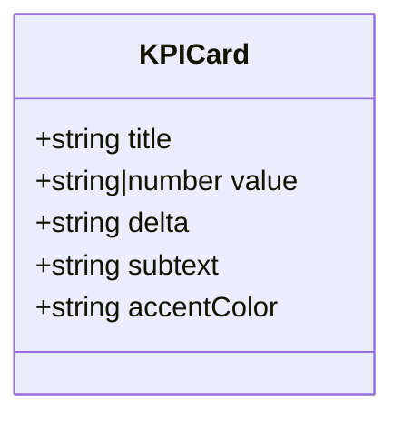
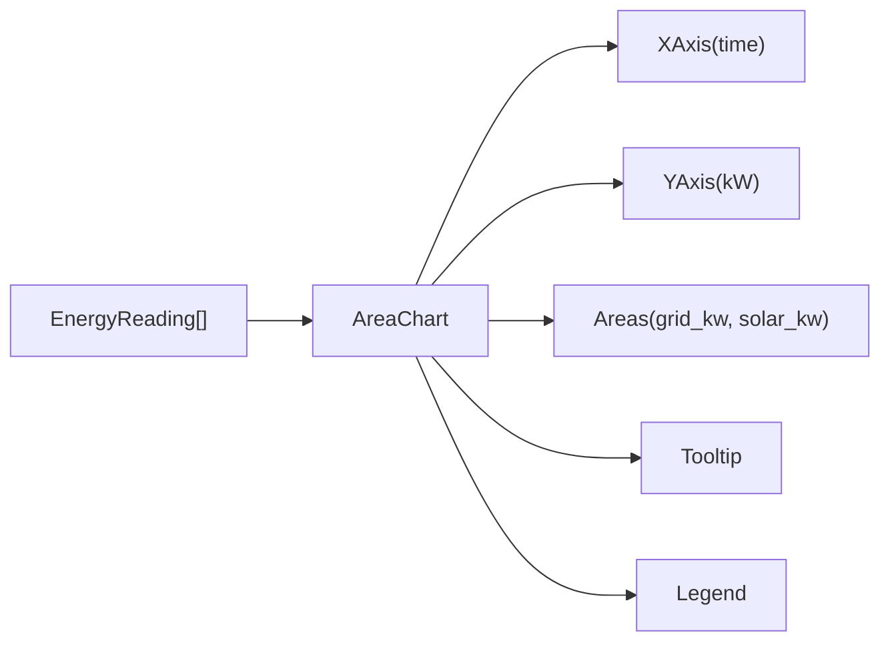
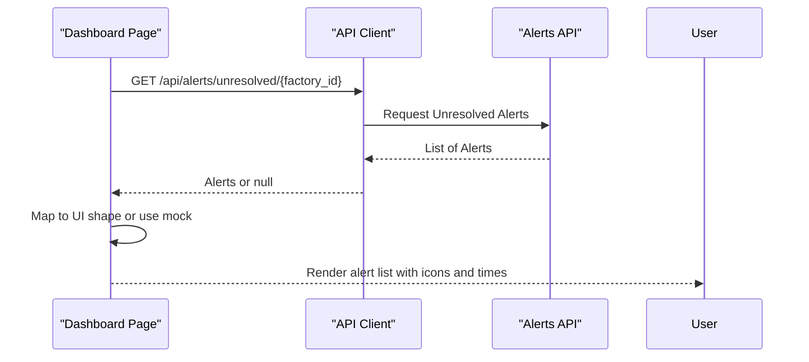
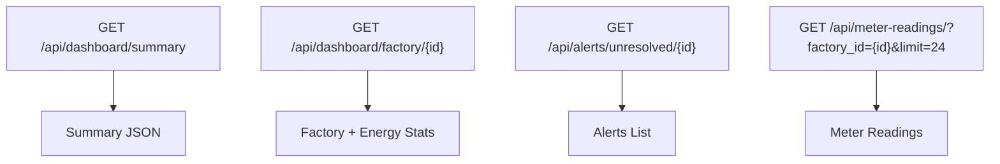
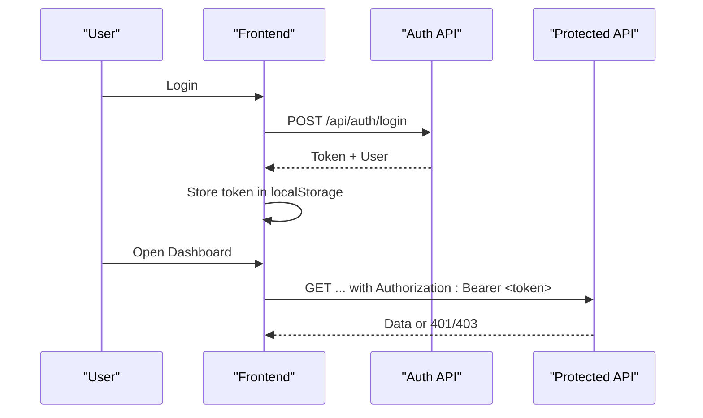
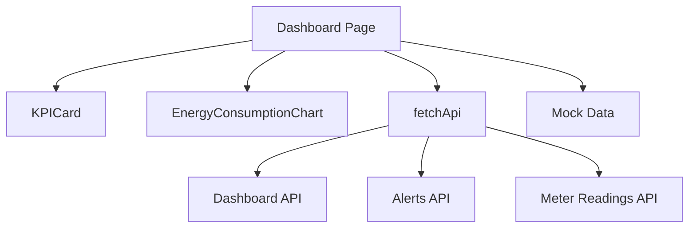

# Dashboard Overview

<cite>
**Referenced Files in This Document**
- [page.tsx](file://frontend/app/dashboard/page.tsx)
- [dashboard.py](file://backend/app/api/dashboard.py)
- [alert.py](file://backend/app/api/alert.py)
- [meter_reading.py](file://backend/app/api/meter_reading.py)
- [auth.py](file://backend/app/api/auth.py)
- [kpi_card.tsx](file://frontend/components/ui/kpi_card.tsx)
- [energy_consumption_chart.tsx](file://frontend/components/charts/energy_consumption_chart.tsx)
- [api.ts](file://frontend/lib/api.ts)
- [mock_data.ts](file://frontend/lib/mock_data.ts)
- [index.ts](file://frontend/types/index.ts)
- [app_shell.tsx](file://frontend/components/layout/app_shell.tsx)
- [layout.tsx](file://frontend/app/dashboard/layout.tsx)
</cite>

## Table of Contents
1. Introduction
2. Project Structure
3. Core Components
4. Architecture Overview
5. Detailed Component Analysis
6. Dependency Analysis
7. Performance Considerations
8. Troubleshooting Guide
9. Conclusion

## Introduction
This document explains the Dashboard Overview page that presents key operational metrics and real-time energy insights for a factory. It covers:
- KPI cards for daily energy cost, peak demand, solar utilization, and order compliance
- Real-time data fetching from backend endpoints (dashboard summary, factory data, alerts, meter readings)
- Energy consumption chart integration and alert panel behavior
- Responsive grid layout and user interactions
- Data transformation, error handling with fallback to mock data, loading states
- Authentication requirements and role-based access control

## Project Structure
The dashboard is implemented as a client-side Next.js page that composes UI components and fetches data from a FastAPI backend. The layout wraps content in an application shell providing sidebar and topbar.

**Diagram sources**
- [page.tsx:1-172](file://frontend/app/dashboard/page.tsx#L1-L172)
- [layout.tsx:1-11](file://frontend/app/dashboard/layout.tsx#L1-L11)
- [app_shell.tsx:1-18](file://frontend/components/layout/app_shell.tsx#L1-L18)
- [kpi_card.tsx:1-37](file://frontend/components/ui/kpi_card.tsx#L1-L37)
- [energy_consumption_chart.tsx:1-65](file://frontend/components/charts/energy_consumption_chart.tsx#L1-L65)
- [api.ts:1-71](file://frontend/lib/api.ts#L1-L71)
- [dashboard.py:1-79](file://backend/app/api/dashboard.py#L1-L79)
- [alert.py:1-107](file://backend/app/api/alert.py#L1-L107)
- [meter_reading.py:1-141](file://backend/app/api/meter_reading.py#L1-L141)
- [auth.py:1-89](file://backend/app/api/auth.py#L1-L89)

**Section sources**
- [page.tsx:1-172](file://frontend/app/dashboard/page.tsx#L1-L172)
- [layout.tsx:1-11](file://frontend/app/dashboard/layout.tsx#L1-L11)
- [app_shell.tsx:1-18](file://frontend/components/layout/app_shell.tsx#L1-L18)

## Core Components
- Dashboard Page: Orchestrates data fetching, state management, and rendering of KPIs, chart, and alerts.
- KPI Card: Displays metric title, value, delta indicator, and contextual subtext with accent color.
- Energy Consumption Chart: Renders a responsive area chart showing grid usage and solar generation over time.
- API Client: Handles authentication headers, error mapping, and returns JSON responses; includes helper methods returning mock data when needed.
- Mock Data: Provides fallback datasets for KPIs, alerts, and energy readings.
- Types: Defines TypeScript interfaces for consistent data contracts across frontend modules.

Key responsibilities:
- Fetch multiple endpoints concurrently and merge results into a cohesive view.
- Transform raw meter readings into chart-friendly format.
- Derive KPI values from backend data with safe fallbacks to mock data.
- Present alerts with severity icons and timestamps.
- Show a loading spinner while data loads.

**Section sources**
- [page.tsx:12-172](file://frontend/app/dashboard/page.tsx#L12-L172)
- [kpi_card.tsx:4-37](file://frontend/components/ui/kpi_card.tsx#L4-L37)
- [energy_consumption_chart.tsx:5-65](file://frontend/components/charts/energy_consumption_chart.tsx#L5-L65)
- [api.ts:7-49](file://frontend/lib/api.ts#L7-L49)
- [mock_data.ts:32-59](file://frontend/lib/mock_data.ts#L32-L59)
- [index.ts:27-45](file://frontend/types/index.ts#L27-L45)

## Architecture Overview
The dashboard page performs parallel requests to four backend endpoints:
- Dashboard summary: overall counts and order status breakdown
- Factory dashboard: factory details and aggregated energy stats
- Unresolved alerts: active alerts for the selected factory
- Meter readings: recent readings used to build the energy profile chart

**Diagram sources**
- [page.tsx:16-62](file://frontend/app/dashboard/page.tsx#L16-L62)
- [dashboard.py:15-79](file://backend/app/api/dashboard.py#L15-L79)
- [alert.py:45-57](file://backend/app/api/alert.py#L45-L57)
- [meter_reading.py:90-111](file://backend/app/api/meter_reading.py#L90-L111)
- [api.ts:7-49](file://frontend/lib/api.ts#L7-L49)

## Detailed Component Analysis

### Dashboard Page: Data Fetching and Rendering
- Concurrent fetching: Uses Promise.all to call summary, factory, alerts, and meter readings endpoints simultaneously. Each request is wrapped with .catch to avoid failing the entire load if one endpoint errors.
- Loading state: Shows a spinner until all requests complete or fail.
- Data transformation:
  - Meter readings are reversed and mapped to chart entries with formatted time and rounded kW values.
  - KPIs are derived from factory energy stats and summary order status, with safe defaults from mock data.
  - Alerts are mapped to include severity type and localized timestamp; falls back to mock alerts if none returned.
- Rendering:
  - KPI row uses a responsive grid (1 column on small screens, up to 4 on large).
  - Main area splits into a 2-column chart and 1-column alerts panel on large screens.
  - Glass panels provide consistent card styling.

**Diagram sources**
- [page.tsx:16-99](file://frontend/app/dashboard/page.tsx#L16-L99)

**Section sources**
- [page.tsx:16-99](file://frontend/app/dashboard/page.tsx#L16-L99)

### KPI Cards
- Props: title, value, optional delta, subtext, accentColor.
- Visuals: Accent bar at top, large monospace value, delta colored by sign, contextual subtext.
- Usage: Four cards display Daily Energy Cost, Peak Demand, Solar Utilization, Orders on Time. Values are computed from backend data with fallbacks.

**Diagram sources**
- [kpi_card.tsx:4-37](file://frontend/components/ui/kpi_card.tsx#L4-L37)

**Section sources**
- [kpi_card.tsx:4-37](file://frontend/components/ui/kpi_card.tsx#L4-L37)
- [page.tsx:103-132](file://frontend/app/dashboard/page.tsx#L103-L132)

### Energy Consumption Chart
- Library: Recharts AreaChart with responsive container.
- Series: Grid Usage (kW) and Solar Generation (kW) with gradient fills.
- Axes: X-axis shows time labels; Y-axis formats values with kW units.
- Tooltip: Styled tooltip with background and border.
- Data contract: Array of objects with time, grid_kw, solar_kw.

**Diagram sources**
- [energy_consumption_chart.tsx:5-65](file://frontend/components/charts/energy_consumption_chart.tsx#L5-L65)
- [index.ts:41-45](file://frontend/types/index.ts#L41-L45)

**Section sources**
- [energy_consumption_chart.tsx:5-65](file://frontend/components/charts/energy_consumption_chart.tsx#L5-L65)
- [page.tsx:134-141](file://frontend/app/dashboard/page.tsx#L134-L141)

### Alerts Panel
- Displays unresolved alerts for the factory with severity icons and timestamps.
- Badge shows count of new alerts.
- Falls back to mock alerts if no data is returned.

**Diagram sources**
- [page.tsx:90-98](file://frontend/app/dashboard/page.tsx#L90-L98)
- [alert.py:45-57](file://backend/app/api/alert.py#L45-L57)

**Section sources**
- [page.tsx:143-167](file://frontend/app/dashboard/page.tsx#L143-L167)
- [alert.py:45-57](file://backend/app/api/alert.py#L45-L57)

### Backend Endpoints Used by Dashboard
- Dashboard Summary: Returns totals and order status breakdown used to compute orders-on-time percentage.
- Factory Dashboard: Returns factory metadata and aggregated energy stats (total kWh, peak kW, total solar kWh).
- Alerts: Unresolved alerts filtered by factory, sorted by severity and time.
- Meter Readings: Recent readings filtered by factory and limit, used to build the 24-hour energy profile.

**Diagram sources**
- [dashboard.py:15-79](file://backend/app/api/dashboard.py#L15-L79)
- [alert.py:45-57](file://backend/app/api/alert.py#L45-L57)
- [meter_reading.py:90-111](file://backend/app/api/meter_reading.py#L90-L111)

**Section sources**
- [dashboard.py:15-79](file://backend/app/api/dashboard.py#L15-L79)
- [alert.py:45-57](file://backend/app/api/alert.py#L45-L57)
- [meter_reading.py:90-111](file://backend/app/api/meter_reading.py#L90-L111)

### Authentication and Role-Based Access Control
- Frontend:
  - API client attaches Authorization header with Bearer token stored in localStorage after login.
  - Error handling maps 401 to “Please login again” and 403 to permission errors.
- Backend:
  - Login endpoint issues a token tied to a user; logout removes token from active tokens store.
  - Some endpoints require current user context; others may enforce roles via dependency.
  - Role enforcement ensures only authorized users can perform sensitive actions.

**Diagram sources**
- [api.ts:7-49](file://frontend/lib/api.ts#L7-L49)
- [auth.py:37-89](file://backend/app/api/auth.py#L37-L89)

**Section sources**
- [api.ts:7-49](file://frontend/lib/api.ts#L7-L49)
- [auth.py:37-89](file://backend/app/api/auth.py#L37-L89)

### Responsive Grid Layout
- KPI row: CSS grid adapts from 1 column on mobile to 4 columns on large screens.
- Main area: Two-column layout on large screens (chart takes 2/3, alerts 1/3), stacking vertically on smaller screens.
- Panels: Glass panels provide consistent visual grouping and spacing.

**Section sources**
- [page.tsx:101-168](file://frontend/app/dashboard/page.tsx#L101-L168)

## Dependency Analysis
- Frontend dependencies:
  - Dashboard page depends on KPI card, chart, API client, and mock data.
  - API client depends on environment variables and local storage for auth.
- Backend dependencies:
  - Dashboard endpoints depend on database models and SQLAlchemy aggregations.
  - Alerts and meter reading endpoints filter by factory and return lists or stats.

**Diagram sources**
- [page.tsx:1-172](file://frontend/app/dashboard/page.tsx#L1-L172)
- [api.ts:1-71](file://frontend/lib/api.ts#L1-L71)
- [dashboard.py:1-79](file://backend/app/api/dashboard.py#L1-L79)
- [alert.py:1-107](file://backend/app/api/alert.py#L1-L107)
- [meter_reading.py:1-141](file://backend/app/api/meter_reading.py#L1-L141)

**Section sources**
- [page.tsx:1-172](file://frontend/app/dashboard/page.tsx#L1-L172)
- [api.ts:1-71](file://frontend/lib/api.ts#L1-L71)

## Performance Considerations
- Parallel requests: Using Promise.all reduces total latency by fetching independent endpoints concurrently.
- Minimal transformations: Mapping meter readings to chart data is lightweight; rounding avoids excessive precision overhead.
- Fallback strategy: Graceful degradation to mock data prevents UI stalls when backend endpoints are unavailable.
- Chart rendering: Recharts’ ResponsiveContainer optimizes sizing; consider memoizing chart data if re-renders become frequent.
- Database queries: Aggregations in dashboard and meter endpoints use efficient SQL functions; ensure indexes on factory_id and timestamp fields for large datasets.

[No sources needed since this section provides general guidance]

## Troubleshooting Guide
Common issues and resolutions:
- Network or backend errors:
  - The API client throws descriptive errors for 401 and 403; handle these in UI to prompt re-login or show permission messages.
  - Individual endpoint failures are caught per-request; dashboard continues with available data and falls back to mocks.
- Missing or empty data:
  - If meter readings are empty, the chart displays mock data to maintain visual continuity.
  - If alerts are empty, the panel shows zero new alerts and uses mock data for demonstration.
- Authentication problems:
  - Ensure token is present in localStorage after login; verify Authorization header is attached to requests.
  - Backend requires valid token; expired or invalid tokens result in 401 responses.

**Section sources**
- [api.ts:27-49](file://frontend/lib/api.ts#L27-L49)
- [page.tsx:16-62](file://frontend/app/dashboard/page.tsx#L16-L62)
- [auth.py:63-89](file://backend/app/api/auth.py#L63-L89)

## Conclusion
The Dashboard Overview page integrates multiple backend services to deliver a comprehensive view of energy costs, demand, solar utilization, and order compliance. It employs robust error handling with fallbacks, concurrent data fetching, and a responsive layout to ensure usability across devices. Authentication and role-based access control protect sensitive operations, while clear UI patterns guide users through metrics and alerts.

[No sources needed since this section summarizes without analyzing specific files]