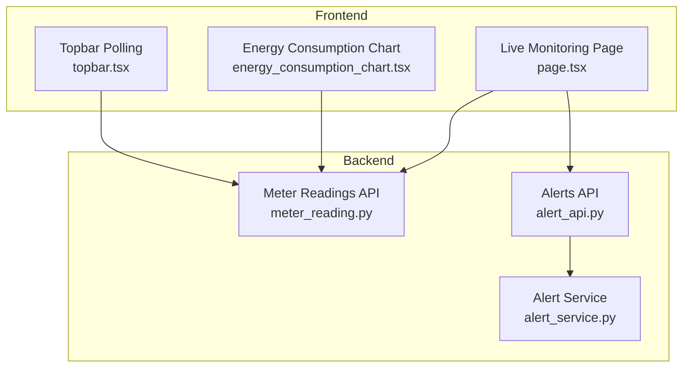
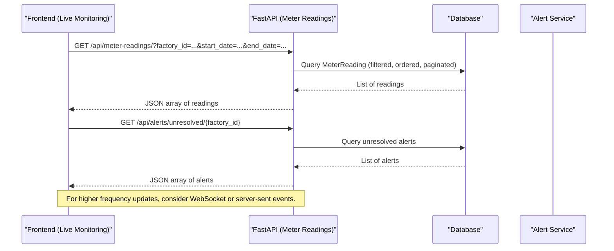
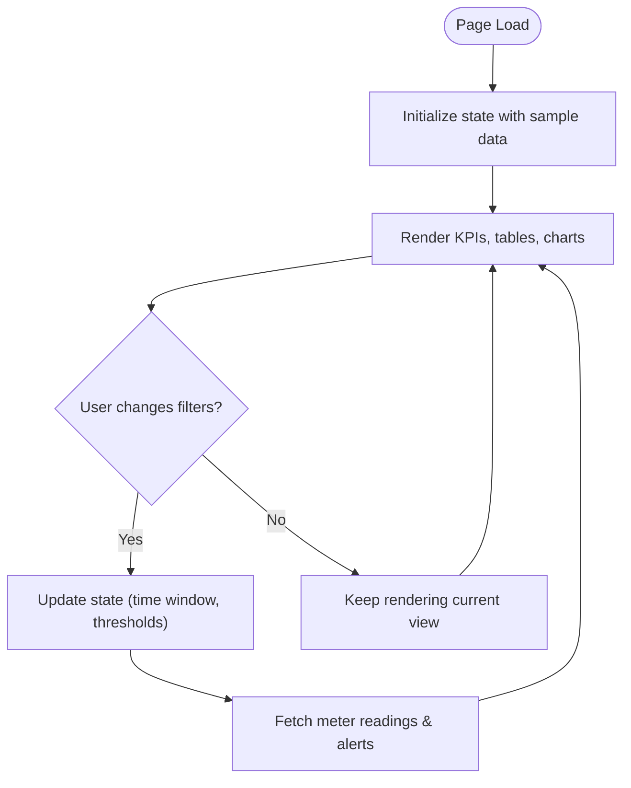
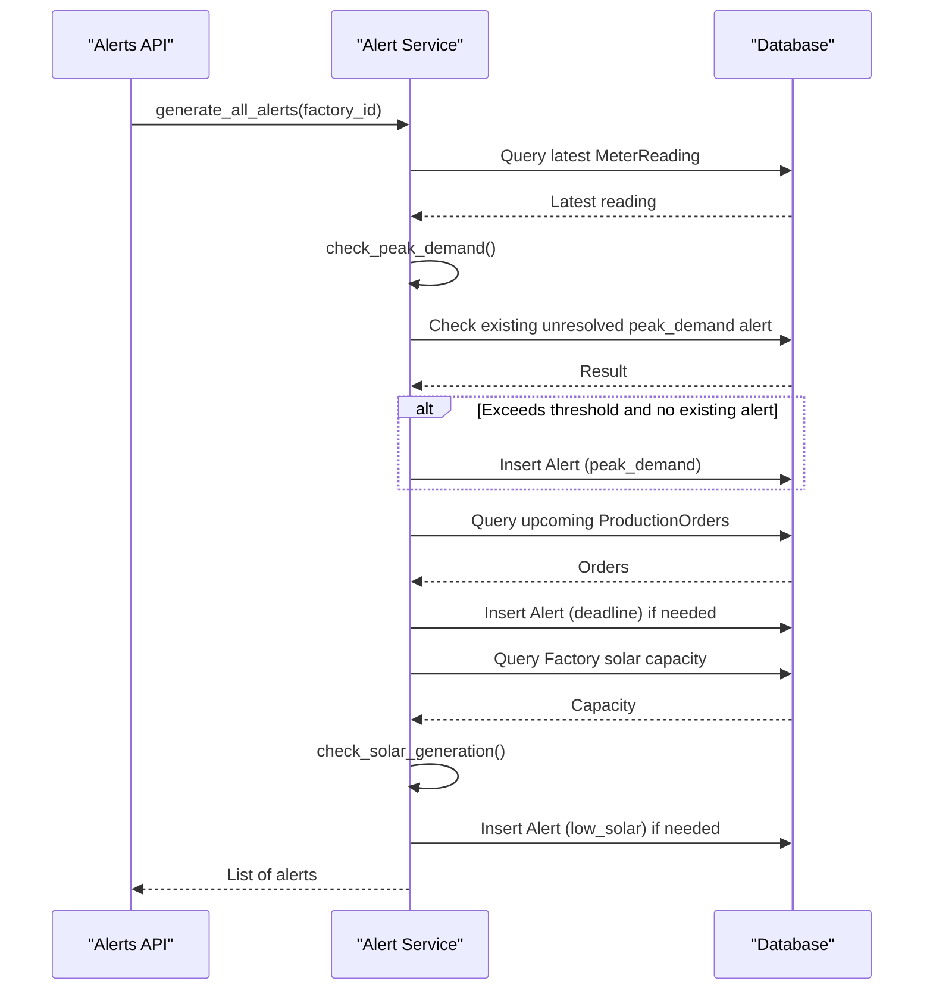
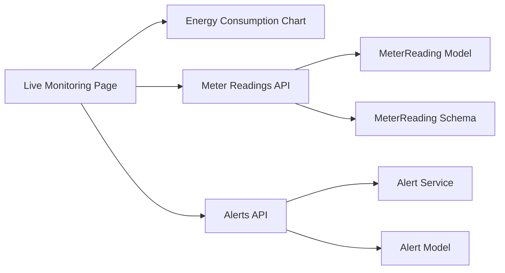

# Live Monitoring

<cite>
**Referenced Files in This Document**
- [page.tsx](file://frontend/app/dashboard/live_monitoring/page.tsx)
- [energy_consumption_chart.tsx](file://frontend/components/charts/energy_consumption_chart.tsx)
- [index.ts](file://frontend/types/index.ts)
- [meter_reading.py](file://backend/app/api/meter_reading.py)
- [meter_reading_model.py](file://backend/app/models/meter_reading.py)
- [meter_reading_schema.py](file://backend/app/schemas/meter_reading.py)
- [alert_api.py](file://backend/app/api/alert.py)
- [alert_service.py](file://backend/app/services/alert_service.py)
- [alert_model.py](file://backend/app/models/alert.py)
- [topbar.tsx](file://frontend/components/layout/topbar.tsx)
</cite>

## Table of Contents
1. [Introduction](#introduction)
2. [Project Structure](#project-structure)
3. [Core Components](#core-components)
4. [Architecture Overview](#architecture-overview)
5. [Detailed Component Analysis](#detailed-component-analysis)
6. [Dependency Analysis](#dependency-analysis)
7. [Performance Considerations](#performance-considerations)
8. [Troubleshooting Guide](#troubleshooting-guide)
9. [Conclusion](#conclusion)
10. [Appendices](#appendices)

## Introduction
This document explains the Live Monitoring page and how it visualizes real-time energy consumption, meter readings, and alerts. It covers:
- Real-time data streaming strategies (polling vs. WebSockets)
- Chart rendering for energy demand and solar generation
- Alert triggering for threshold violations
- Integration with meter reading APIs
- Data refresh strategies and performance optimization for high-frequency updates
- Examples of real-time chart updates, alert notifications, and user controls

## Project Structure
The Live Monitoring feature spans frontend UI components and backend APIs:
- Frontend: A Next.js page renders live metrics, charts, and machine status; a reusable chart component displays energy consumption trends.
- Backend: FastAPI endpoints provide meter readings and statistics; an alert service generates alerts based on thresholds.

**Diagram sources**
- [page.tsx:34-196](file://frontend/app/dashboard/live_monitoring/page.tsx#L34-L196)
- [energy_consumption_chart.tsx:5-64](file://frontend/components/charts/energy_consumption_chart.tsx#L5-L64)
- [meter_reading.py:12-141](file://backend/app/api/meter_reading.py#L12-L141)
- [alert_api.py:12-107](file://backend/app/api/alert.py#L12-L107)
- [alert_service.py:16-140](file://backend/app/services/alert_service.py#L16-L140)
- [topbar.tsx:30-32](file://frontend/components/layout/topbar.tsx#L30-L32)

**Section sources**
- [page.tsx:34-196](file://frontend/app/dashboard/live_monitoring/page.tsx#L34-L196)
- [meter_reading.py:12-141](file://backend/app/api/meter_reading.py#L12-L141)
- [alert_api.py:12-107](file://backend/app/api/alert.py#L12-L107)
- [alert_service.py:16-140](file://backend/app/services/alert_service.py#L16-L140)
- [topbar.tsx:30-32](file://frontend/components/layout/topbar.tsx#L30-L32)

## Core Components
- Live Monitoring Page: Displays current grid draw, solar output, tariff period, demand risk, a machine status table, real-time demand area chart, and solar generation chart.
- Energy Consumption Chart: Reusable area chart that plots grid usage and solar generation over time.
- Meter Readings API: Endpoints to create, bulk-create, import CSV, list, and compute stats for meter readings.
- Alerts API and Service: Generate and manage alerts for peak demand, deadlines, and low solar generation.

Key responsibilities:
- UI: Render KPIs, charts, and tables; support future real-time updates via state changes.
- Data: Fetch and display meter readings; compute or request aggregated stats.
- Alerts: Evaluate thresholds and persist alert events for later display.

**Section sources**
- [page.tsx:34-196](file://frontend/app/dashboard/live_monitoring/page.tsx#L34-L196)
- [energy_consumption_chart.tsx:5-64](file://frontend/components/charts/energy_consumption_chart.tsx#L5-L64)
- [meter_reading.py:14-141](file://backend/app/api/meter_reading.py#L14-L141)
- [alert_api.py:14-107](file://backend/app/api/alert.py#L14-L107)
- [alert_service.py:19-140](file://backend/app/services/alert_service.py#L19-L140)

## Architecture Overview
The system uses HTTP polling from the frontend to fetch meter readings and alerts. The backend exposes REST endpoints for CRUD and aggregation. An alert service evaluates thresholds against recent meter readings and production deadlines to generate alerts.

**Diagram sources**
- [meter_reading.py:90-111](file://backend/app/api/meter_reading.py#L90-L111)
- [alert_api.py:45-57](file://backend/app/api/alert.py#L45-L57)

## Detailed Component Analysis

### Live Monitoring Page
- Displays current KPIs: grid draw, solar output, tariff period, demand risk.
- Shows a machine status table with id, name, status, power, since, next job.
- Renders two area charts:
  - Real-Time Demand: shows last 6 hours of actual demand with a reference threshold line.
  - Solar Generation: overlays actual vs forecast lines.
- Uses static sample data currently; can be wired to dynamic state for live updates.

Real-time update strategy options:
- Polling: Use setInterval to periodically call meter readings and alerts endpoints.
- WebSocket/SSE: Replace polling with a persistent connection for push-based updates.

User controls to implement:
- Time window selector for charts (e.g., last 1h, 6h, 24h).
- Threshold configuration for demand alerts.
- Toggle visibility of solar forecast.
- Machine filters (by status or group).

**Section sources**
- [page.tsx:34-196](file://frontend/app/dashboard/live_monitoring/page.tsx#L34-L196)

#### Live Monitoring Page Flowchart

[No sources needed since this diagram shows conceptual workflow]

### Energy Consumption Chart Component
- Reusable area chart that accepts an array of readings with time, grid_kw, and solar_kw.
- Provides tooltips, legends, and styled axes.
- Designed for frequent updates; should be used with memoization and efficient re-renders when integrating live data.

Integration example:
- Map backend MeterReadingResponse fields to { time, grid_kw, solar_kw } for chart input.
- Debounce or throttle incoming updates to avoid excessive re-renders.

**Section sources**
- [energy_consumption_chart.tsx:5-64](file://frontend/components/charts/energy_consumption_chart.tsx#L5-L64)
- [index.ts:41-45](file://frontend/types/index.ts#L41-L45)

### Meter Readings API
- Create single or bulk meter readings.
- Import CSV with validation and conversion.
- List readings with filters (factory_id, start_date, end_date), ordering by timestamp descending, with pagination.
- Compute stats (total readings, total kWh, average kWh, peak kW, total solar kWh).

Typical usage for live monitoring:
- Poll GET /api/meter-readings/ with appropriate time windows to populate charts.
- Use GET /api/meter-readings/stats/{factory_id} for summary KPIs.

**Section sources**
- [meter_reading.py:14-141](file://backend/app/api/meter_reading.py#L14-L141)
- [meter_reading_model.py:5-17](file://backend/app/models/meter_reading.py#L5-L17)
- [meter_reading_schema.py:5-27](file://backend/app/schemas/meter_reading.py#L5-L27)

### Alerts API and Service
- List alerts with filters (factory_id, severity, resolved status).
- Get unresolved alerts for a factory.
- Generate alerts based on rules:
  - Peak demand exceeds threshold.
  - Upcoming order deadlines within a configurable window.
  - Low solar generation during daytime hours.
- Update alert status (mark resolved).

Threshold logic highlights:
- Peak demand: compares latest kw against threshold; creates warning or critical depending on magnitude.
- Deadlines: checks pending orders due soon; severity depends on remaining hours.
- Solar: checks if solar_kwh is below minimum during operational hours.

**Section sources**
- [alert_api.py:14-107](file://backend/app/api/alert.py#L14-L107)
- [alert_service.py:19-140](file://backend/app/services/alert_service.py#L19-L140)
- [alert_model.py:5-18](file://backend/app/models/alert.py#L5-L18)

#### Alert Generation Sequence

**Diagram sources**
- [alert_service.py:19-140](file://backend/app/services/alert_service.py#L19-L140)
- [alert_api.py:35-43](file://backend/app/api/alert.py#L35-L43)

## Dependency Analysis
- Frontend dependencies:
  - Live Monitoring Page depends on UI panels and Recharts for visualization.
  - Energy Consumption Chart depends on shared types for consistent data shapes.
- Backend dependencies:
  - Meter Readings API depends on SQLAlchemy models and Pydantic schemas.
  - Alerts API depends on AlertService for business rules and database access.

**Diagram sources**
- [page.tsx:34-196](file://frontend/app/dashboard/live_monitoring/page.tsx#L34-L196)
- [energy_consumption_chart.tsx:5-64](file://frontend/components/charts/energy_consumption_chart.tsx#L5-L64)
- [meter_reading.py:12-141](file://backend/app/api/meter_reading.py#L12-L141)
- [alert_api.py:12-107](file://backend/app/api/alert.py#L12-L107)
- [alert_service.py:16-140](file://backend/app/services/alert_service.py#L16-L140)
- [meter_reading_model.py:5-17](file://backend/app/models/meter_reading.py#L5-L17)
- [meter_reading_schema.py:5-27](file://backend/app/schemas/meter_reading.py#L5-L27)
- [alert_model.py:5-18](file://backend/app/models/alert.py#L5-L18)

**Section sources**
- [page.tsx:34-196](file://frontend/app/dashboard/live_monitoring/page.tsx#L34-L196)
- [meter_reading.py:12-141](file://backend/app/api/meter_reading.py#L12-L141)
- [alert_api.py:12-107](file://backend/app/api/alert.py#L12-L107)
- [alert_service.py:16-140](file://backend/app/services/alert_service.py#L16-L140)

## Performance Considerations
- Polling interval:
  - Use a reasonable interval (e.g., 5–15 seconds) to balance freshness and load.
  - Avoid overly aggressive intervals that cause unnecessary network and render overhead.
- Data shaping:
  - On the frontend, map backend responses to minimal chart-friendly structures.
  - Debounce or batch updates to reduce chart re-renders.
- Pagination and limits:
  - Use limit and skip parameters to cap dataset size for charts.
  - Request only necessary fields to minimize payload size.
- Caching:
  - Cache recent readings client-side to avoid redundant requests during short intervals.
  - Invalidate cache on user actions (e.g., changing time window).
- Chart optimization:
  - Use memoized components and stable keys for list items.
  - Consider down-sampling time series for large datasets before rendering.
- Alerts:
  - Deduplicate alerts within a time window to prevent spamming.
  - Throttle alert generation and UI notifications.

[No sources needed since this section provides general guidance]

## Troubleshooting Guide
Common issues and resolutions:
- No data displayed:
  - Verify factory_id and date range filters are correct.
  - Ensure meter readings exist in the database for the requested period.
- Charts not updating:
  - Confirm polling is active and endpoints return valid JSON.
  - Check browser console for network errors or CORS issues.
- Alerts not generated:
  - Validate thresholds in AlertService and ensure latest readings have required fields (kw, solar_kwh).
  - Confirm alert deduplication logic does not suppress expected alerts.
- High CPU/memory usage:
  - Reduce polling frequency or increase debounce delay.
  - Limit chart data points using server-side pagination or client-side sampling.

**Section sources**
- [meter_reading.py:90-111](file://backend/app/api/meter_reading.py#L90-L111)
- [alert_service.py:19-140](file://backend/app/services/alert_service.py#L19-L140)

## Conclusion
The Live Monitoring page provides a comprehensive view of energy consumption, machine status, and alerts. While currently using static data for demonstration, it is structured to integrate with backend APIs for real-time updates. Implementing robust polling or WebSocket connections, along with careful performance tuning, will enable smooth, high-frequency updates for charts and alerts.

[No sources needed since this section summarizes without analyzing specific files]

## Appendices

### Real-Time Data Streaming Options
- Polling:
  - Simple to implement; use setInterval to call meter readings and alerts endpoints at fixed intervals.
  - Example pattern: poll every 10 seconds, merge new data into chart state, and update UI.
- WebSocket/SSE:
  - Push-based updates reduce latency and network overhead.
  - Requires server-side implementation to broadcast meter readings and alerts.

[No sources needed since this section provides general guidance]

### Example: Integrating Polling for Live Updates
- Set up an effect to poll meter readings and alerts.
- Merge new data into chart state while preserving time-series continuity.
- Debounce updates to avoid excessive re-renders.
- Handle errors gracefully with retry logic and user feedback.

[No sources needed since this section provides general guidance]

### Example: Alert Notifications
- Fetch unresolved alerts periodically.
- Display notifications with severity indicators.
- Allow users to mark alerts as resolved via API.

[No sources needed since this section provides general guidance]

### Example: User Controls for Monitoring Parameters
- Time window selector for charts (last 1h, 6h, 24h).
- Threshold sliders for demand alerts.
- Toggles for showing/hiding solar forecast.
- Filters for machine status and groups.

[No sources needed since this section provides general guidance]