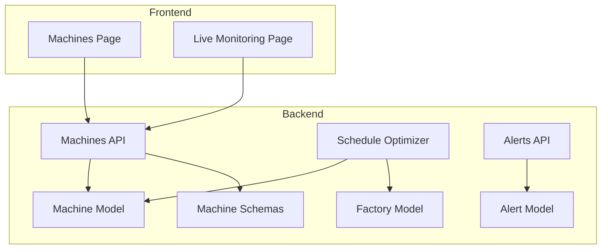
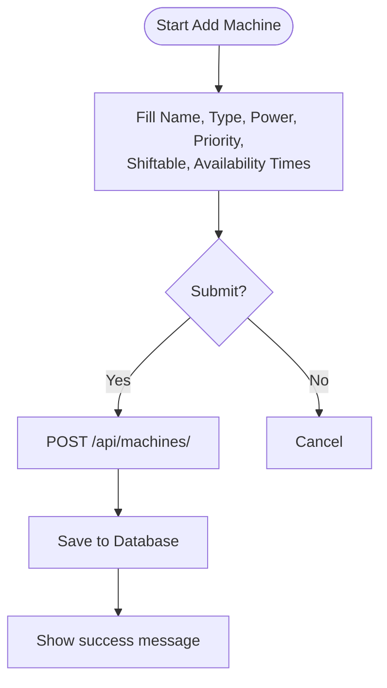
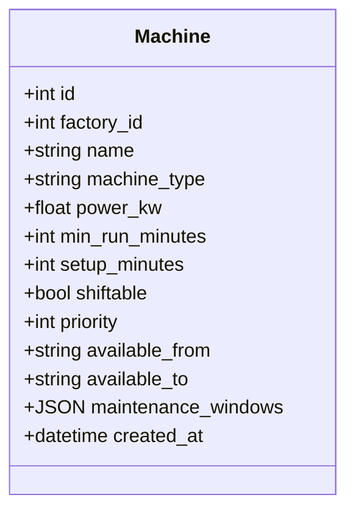
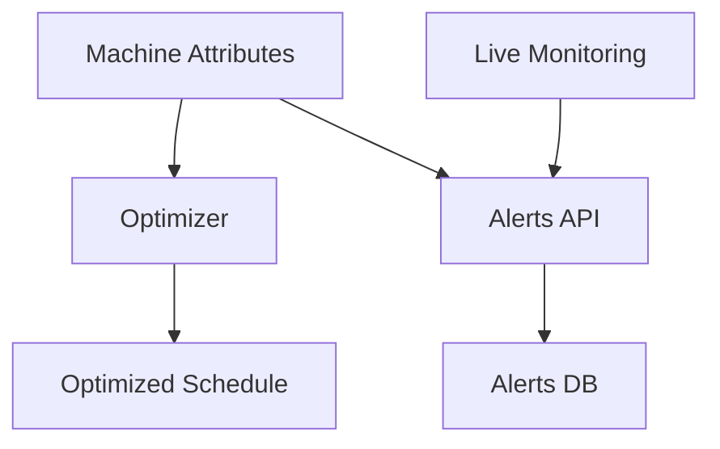
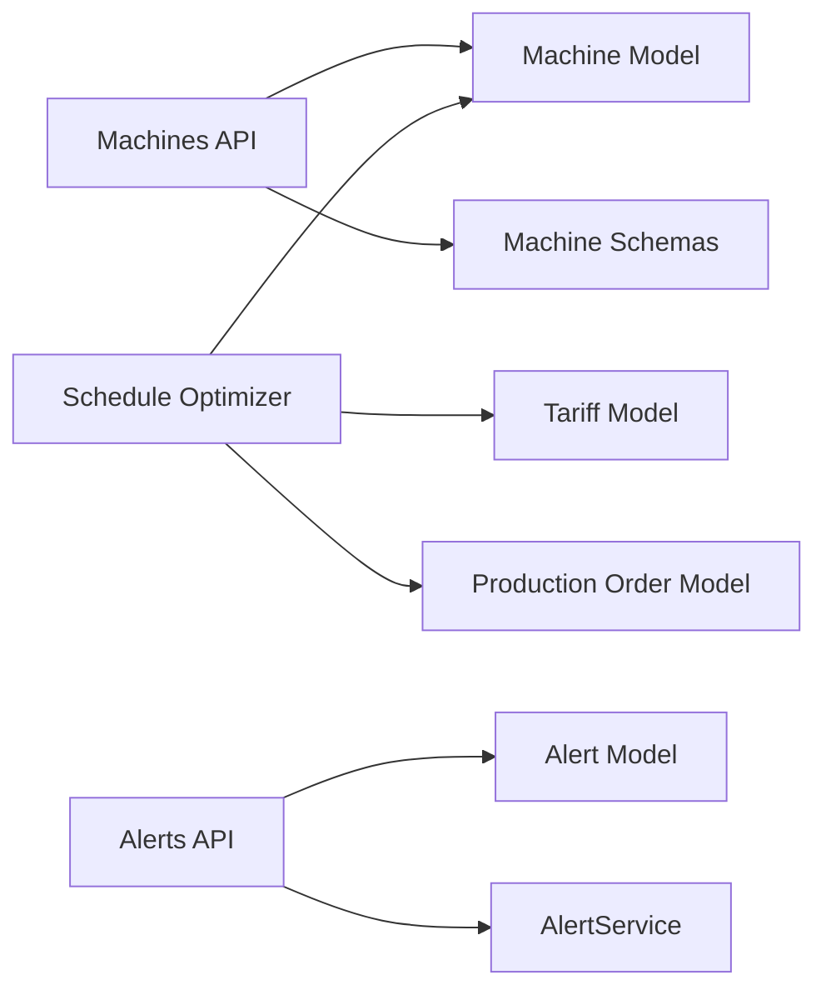

# Machines Management

<cite>
**Referenced Files in This Document**
- [machine.py](file://backend/app/api/machine.py)
- [machine.py](file://backend/app/models/machine.py)
- [machine.py](file://backend/app/schemas/machine.py)
- [page.tsx](file://frontend/app/dashboard/machines/page.tsx)
- [machine_form.tsx](file://frontend/components/forms/machine_form.tsx)
- [factory.py](file://backend/app/models/factory.py)
- [optimizer.py](file://backend/app/services/optimizer.py)
- [alert.py](file://backend/app/models/alert.py)
- [alert.py](file://backend/app/api/alert.py)
- [alert_service.py](file://backend/app/services/alert_service.py)
- [page.tsx](file://frontend/app/dashboard/live_monitoring/page.tsx)
- [index.ts](file://frontend/types/index.ts)
- [README.md](file://README.md)
</cite>

## Table of Contents
1. Introduction
2. Project Structure
3. Core Components
4. Architecture Overview
5. Detailed Component Analysis
6. Dependency Analysis
7. Performance Considerations
8. Troubleshooting Guide
9. Conclusion
10. Appendices

## Introduction
This document explains the Machines Management page and its supporting backend, covering machine registration, power specification management, maintenance scheduling fields, operational status tracking, categorization by type, capacity planning, resource allocation, integration with monitoring and alerts, performance analytics, lifecycle considerations, depreciation tracking, and replacement planning. It provides end-to-end workflows for setup, scheduling, and monitoring, grounded in the repository’s code.

## Project Structure
The Machines Management feature spans:
- Backend API endpoints for machines (CRUD), models and schemas for data validation and persistence, and services that integrate machines into optimization and alerting.
- Frontend pages for managing machines, viewing energy consumption, and live monitoring dashboards.



**Diagram sources**
- [machine.py:1-65](file://backend/app/api/machine.py#L1-L65)
- [machine.py:1-20](file://backend/app/models/machine.py#L1-L20)
- [machine.py:1-26](file://backend/app/schemas/machine.py#L1-L26)
- [optimizer.py:1-238](file://backend/app/services/optimizer.py#L1-L238)
- [alert.py:1-18](file://backend/app/models/alert.py#L1-L18)
- [alert.py:1-107](file://backend/app/api/alert.py#L1-L107)
- [factory.py:1-17](file://backend/app/models/factory.py#L1-L17)
- [page.tsx:1-499](file://frontend/app/dashboard/machines/page.tsx#L1-L499)
- [page.tsx:1-197](file://frontend/app/dashboard/live_monitoring/page.tsx#L1-L197)

**Section sources**
- [README.md:19-50](file://README.md#L19-L50)

## Core Components
- Machine CRUD API: Create, list, get, delete machines with role-based access control.
- Machine Data Model: Stores factory association, type, power rating, run constraints, availability windows, and maintenance windows.
- Machine Schemas: Validate inputs and responses for machine operations.
- Frontend Machines Page: Lists machines, shows details, supports adding new machines via a modal form, and displays energy consumption charts.
- Schedule Optimizer: Uses machine attributes to plan production in low-cost time slots.
- Alerts System: Tracks peak demand, deadlines, and solar generation issues; integrates with factory context.
- Live Monitoring: Displays real-time grid draw, solar output, tariff state, and machine statuses.

**Section sources**
- [machine.py:1-65](file://backend/app/api/machine.py#L1-L65)
- [machine.py:1-20](file://backend/app/models/machine.py#L1-L20)
- [machine.py:1-26](file://backend/app/schemas/machine.py#L1-L26)
- [page.tsx:1-499](file://frontend/app/dashboard/machines/page.tsx#L1-L499)
- [optimizer.py:1-238](file://backend/app/services/optimizer.py#L1-L238)
- [alert.py:1-18](file://backend/app/models/alert.py#L1-L18)
- [alert.py:1-107](file://backend/app/api/alert.py#L1-L107)
- [page.tsx:1-197](file://frontend/app/dashboard/live_monitoring/page.tsx#L1-L197)

## Architecture Overview
The Machines Management workflow connects frontend UI to backend APIs and services:

```mermaid
sequenceDiagram
participant User as "User"
participant FE as "Machines Page"
participant API as "Machines API"
participant DB as "Database"
participant OPT as "Schedule Optimizer"
participant ALERT as "Alerts API"
User->>FE : Open Machines Page
FE->>API : GET /api/machines/?factory_id=...
API->>DB : Query machines
DB-->>API : List of machines
API-->>FE : Machines list
FE->>API : POST /api/machines/ (create)
API->>DB : Insert machine
DB-->>API : Created machine
API-->>FE : Success response
FE->>OPT : Use machine attributes for scheduling
FE->>ALERT : Generate/list alerts if needed
```

**Diagram sources**
- [machine.py:1-65](file://backend/app/api/machine.py#L1-L65)
- [optimizer.py:97-190](file://backend/app/services/optimizer.py#L97-L190)
- [alert.py:14-43](file://backend/app/api/alert.py#L14-L43)

## Detailed Component Analysis

### Machine Registration and Power Specification Management
- Registration: The Machines API exposes create, list, get, and delete endpoints. Creation requires manager or owner role; listing and retrieval are available to authenticated users.
- Power Specifications: The Machine model includes power_kw, min_run_minutes, setup_minutes, shiftable flag, priority, availability windows, and maintenance_windows JSON field. These fields enable capacity planning and scheduling constraints.
- Frontend Form: The Machines Page includes an “Add Machine” modal that collects name, type, power rating, status, priority, shiftable flag, and availability times, then posts to the backend.



**Diagram sources**
- [machine.py:13-24](file://backend/app/api/machine.py#L13-L24)
- [machine.py:5-20](file://backend/app/models/machine.py#L5-L20)
- [page.tsx:81-110](file://frontend/app/dashboard/machines/page.tsx#L81-L110)

**Section sources**
- [machine.py:1-65](file://backend/app/api/machine.py#L1-L65)
- [machine.py:1-20](file://backend/app/models/machine.py#L1-L20)
- [machine.py:1-26](file://backend/app/schemas/machine.py#L1-L26)
- [page.tsx:81-110](file://frontend/app/dashboard/machines/page.tsx#L81-L110)

### Maintenance Scheduling and Operational Status Tracking
- Maintenance Windows: The Machine model stores maintenance_windows as a JSON array of time ranges, enabling scheduled downtime configuration per machine.
- Status Display: The Machines Page maps backend fields to a user-friendly view, including status indicators (Running, Idle, Maintenance). While the current API does not expose a status field on the model, the frontend uses a mapped status for display purposes.
- Live Monitoring: The Live Monitoring Page shows machine statuses, power usage, and next job timing, providing operational visibility.



**Diagram sources**
- [machine.py:5-20](file://backend/app/models/machine.py#L5-L20)

**Section sources**
- [machine.py:1-20](file://backend/app/models/machine.py#L1-L20)
- [page.tsx:169-252](file://frontend/app/dashboard/machines/page.tsx#L169-L252)
- [page.tsx:25-33](file://frontend/app/dashboard/live_monitoring/page.tsx#L25-L33)

### Categorization by Type and Capacity Planning
- Categorization: Machines are categorized by machine_type (e.g., Dyeing, Spinning, Finishing). The optimizer matches orders to suitable machines based on process type.
- Capacity Planning: Power ratings and availability windows inform how much load can be scheduled within operating hours. Min run times and setup minutes constrain feasible schedules.
- Resource Allocation: The optimizer assigns jobs to machines while avoiding locked slots and respecting duration requirements.

```mermaid
sequenceDiagram
participant FE as "Scheduler UI"
participant OPT as "Schedule Optimizer"
participant DB as "Database"
FE->>OPT : Request optimized schedule for factory/time range
OPT->>DB : Get tariffs, machines, pending orders
OPT->>OPT : Generate time slots and rates
OPT->>OPT : Find cheapest consecutive slots per order
OPT-->>FE : Return schedule with cost and kWh estimates
```

**Diagram sources**
- [optimizer.py:97-190](file://backend/app/services/optimizer.py#L97-L190)

**Section sources**
- [optimizer.py:25-34](file://backend/app/services/optimizer.py#L25-L34)
- [optimizer.py:120-175](file://backend/app/services/optimizer.py#L120-L175)

### Integration with Machine Monitoring Systems, Maintenance Alerts, and Performance Analytics
- Monitoring Integration: The Live Monitoring Page visualizes grid draw, solar output, tariff state, and machine statuses, complementing machine management.
- Maintenance Alerts: The Alert system tracks peak demand, deadlines, and low solar generation. Alerts are generated and listed via the Alerts API, tied to factories.
- Performance Analytics: The Machines Page includes an energy consumption chart showing weekly usage per machine, highlighting high consumers and potential savings insights.



**Diagram sources**
- [page.tsx:1-197](file://frontend/app/dashboard/live_monitoring/page.tsx#L1-L197)
- [alert.py:14-43](file://backend/app/api/alert.py#L14-L43)
- [alert_service.py:124-140](file://backend/app/services/alert_service.py#L124-L140)

**Section sources**
- [alert.py:1-107](file://backend/app/api/alert.py#L1-L107)
- [alert_service.py:34-140](file://backend/app/services/alert_service.py#L34-L140)
- [page.tsx:327-356](file://frontend/app/dashboard/machines/page.tsx#L327-L356)

### Examples of Workflows

#### Machine Setup Workflow
- Navigate to Machines Page and click “Add Machine.”
- Fill in required fields: name, type, power rating, priority, shiftable flag, availability window.
- Submit to create the machine; the system persists it and updates the list.

**Section sources**
- [page.tsx:81-110](file://frontend/app/dashboard/machines/page.tsx#L81-L110)
- [machine.py:13-24](file://backend/app/api/machine.py#L13-L24)

#### Maintenance Scheduling Workflow
- Configure maintenance_windows per machine using the Machine model’s JSON field to define time ranges when the machine is unavailable.
- Use the Live Monitoring and Machines Page to visualize upcoming maintenance and adjust schedules accordingly.

**Section sources**
- [machine.py:17-20](file://backend/app/models/machine.py#L17-L20)
- [page.tsx:230-252](file://frontend/app/dashboard/machines/page.tsx#L230-L252)

#### Performance Monitoring Workflow
- View energy consumption by machine on the Machines Page chart to identify high consumers.
- Use Live Monitoring to track real-time grid draw and solar output, and check Alerts for peak demand warnings.

**Section sources**
- [page.tsx:327-356](file://frontend/app/dashboard/machines/page.tsx#L327-L356)
- [page.tsx:42-84](file://frontend/app/dashboard/live_monitoring/page.tsx#L42-L84)

### Lifecycle Management, Depreciation Tracking, and Replacement Planning
- Lifecycle Management: The Machine model includes creation timestamp and maintenance windows, supporting basic lifecycle tracking. Status indicators and availability windows help manage operational phases.
- Depreciation Tracking: Not implemented in the current codebase. No depreciation fields exist on the Machine model or related schemas.
- Replacement Planning: Not implemented in the current codebase. There are no explicit replacement triggers or planning features tied to machine age or usage metrics.

Recommendations:
- Extend the Machine model with fields such as purchase_date, expected_lifetime_months, last_maintenance_date, and cumulative_runtime_hours to support depreciation and replacement planning.
- Introduce alert rules for approaching end-of-life or exceeding maintenance thresholds.

**Section sources**
- [machine.py:1-20](file://backend/app/models/machine.py#L1-L20)

## Dependency Analysis
- Coupling:
  - Machines API depends on Machine model and schemas for request/response handling.
  - Schedule Optimizer depends on Machine, Tariff, and Production Order models to generate cost-aware schedules.
  - Alerts API depends on Alert model and AlertService for generating and managing alerts.
- Cohesion:
  - Each module has a focused responsibility: API routes handle HTTP concerns; models define data structures; services encapsulate business logic.
- External Integrations:
  - Database interactions via SQLAlchemy sessions.
  - Frontend consumes APIs to render dashboards and forms.



**Diagram sources**
- [machine.py:1-65](file://backend/app/api/machine.py#L1-L65)
- [machine.py:1-20](file://backend/app/models/machine.py#L1-L20)
- [machine.py:1-26](file://backend/app/schemas/machine.py#L1-L26)
- [optimizer.py:1-238](file://backend/app/services/optimizer.py#L1-L238)
- [alert.py:1-18](file://backend/app/models/alert.py#L1-L18)
- [alert.py:1-107](file://backend/app/api/alert.py#L1-L107)

**Section sources**
- [optimizer.py:1-238](file://backend/app/services/optimizer.py#L1-L238)
- [alert.py:1-107](file://backend/app/api/alert.py#L1-L107)

## Performance Considerations
- Pagination: The Machines API supports skip and limit parameters for efficient listing.
- Optimization Efficiency: The optimizer sorts time slots by rate and selects consecutive slots; ensure tariff granularity and slot intervals are tuned for performance.
- Chart Rendering: Energy consumption charts use client-side rendering; consider lazy loading or pagination for large datasets.
- Alert Generation: Alert checks run periodically; batch processing and deduplication reduce database writes.

[No sources needed since this section provides general guidance]

## Troubleshooting Guide
- Machine Not Found: When retrieving or deleting a machine by ID, a 404 error is returned if the machine does not exist.
- Role Restrictions: Creating or deleting machines requires manager or owner roles; unauthorized attempts will fail.
- Alert Issues: If alerts are not generated, verify factory context and thresholds; use the Alerts API to list unresolved alerts and stats.

**Section sources**
- [machine.py:40-65](file://backend/app/api/machine.py#L40-L65)
- [alert.py:59-80](file://backend/app/api/alert.py#L59-L80)

## Conclusion
The Machines Management feature provides robust CRUD operations, power specification management, maintenance scheduling fields, and operational status visualization. It integrates with schedule optimization and alert systems to support capacity planning and resource allocation. While lifecycle and depreciation tracking are not fully implemented, the existing structure allows straightforward extension to support advanced maintenance planning and replacement strategies.

[No sources needed since this section summarizes without analyzing specific files]

## Appendices

### API Reference for Machines
- POST /api/machines/: Create a machine (Manager/Owner only)
- GET /api/machines/: List machines (authenticated)
- GET /api/machines/{id}: Get machine details (authenticated)
- DELETE /api/machines/{id}: Delete machine (Manager/Owner only)

**Section sources**
- [machine.py:13-65](file://backend/app/api/machine.py#L13-L65)
- [README.md:103-110](file://README.md#L103-L110)

### Data Models Summary
- Machine: Includes identity, factory association, type, power rating, run constraints, availability windows, maintenance windows, and timestamps.
- Factory: Provides sanctioned load and operating hours context for capacity planning.
- Alert: Captures severity, messages, thresholds, and resolution status for operational monitoring.

**Section sources**
- [machine.py:1-20](file://backend/app/models/machine.py#L1-L20)
- [factory.py:1-17](file://backend/app/models/factory.py#L1-L17)
- [alert.py:1-18](file://backend/app/models/alert.py#L1-L18)

### Frontend Types
- Machine interface defines id, name, type, power_kw, and status for client-side typing.

**Section sources**
- [index.ts:1-7](file://frontend/types/index.ts#L1-L7)