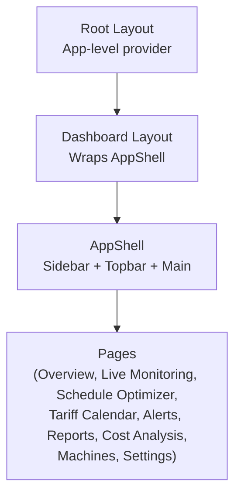
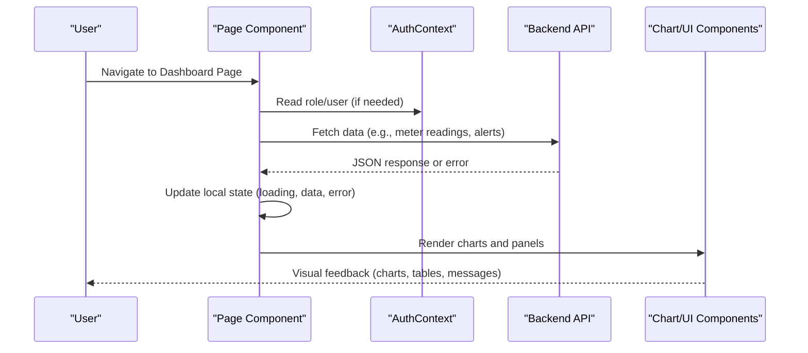
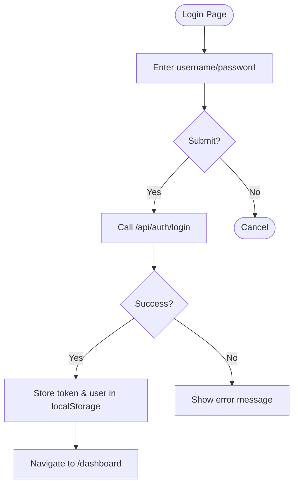
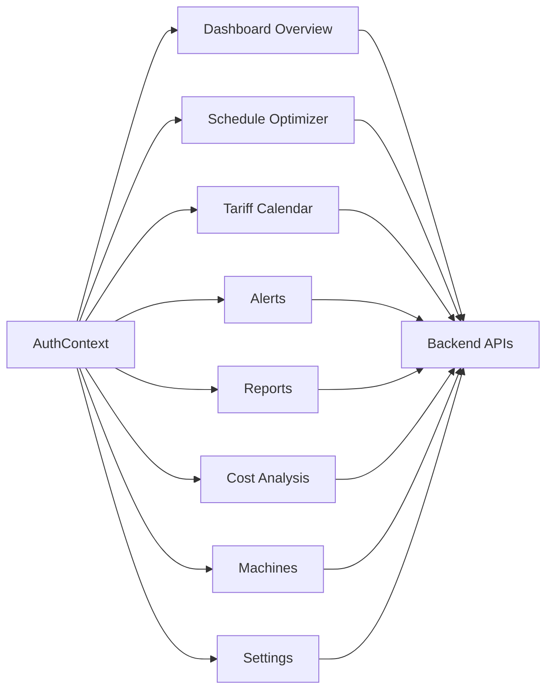

# Pages and Routes

<cite>
**Referenced Files in This Document**
- [layout.tsx](file://frontend/app/layout.tsx)
- [dashboard_layout.tsx](file://frontend/app/dashboard/layout.tsx)
- [app_shell.tsx](file://frontend/components/layout/app_shell.tsx)
- [sidebar.tsx](file://frontend/components/layout/sidebar.tsx)
- [auth_context.tsx](file://frontend/context/auth_context.tsx)
- [login_page.tsx](file://frontend/app/(auth)/login/page.tsx)
- [dashboard_page.tsx](file://frontend/app/dashboard/page.tsx)
- [live_monitoring_page.tsx](file://frontend/app/dashboard/live_monitoring/page.tsx)
- [schedule_optimizer_page.tsx](file://frontend/app/dashboard/schedule_optimizer/page.tsx)
- [tariff_calendar_page.tsx](file://frontend/app/dashboard/tariff_calendar/page.tsx)
- [alerts_page.tsx](file://frontend/app/dashboard/alerts/page.tsx)
- [reports_page.tsx](file://frontend/app/dashboard/reports/page.tsx)
- [cost_analysis_page.tsx](file://frontend/app/dashboard/cost_analysis/page.tsx)
- [machines_page.tsx](file://frontend/app/dashboard/machines/page.tsx)
- [settings_page.tsx](file://frontend/app/dashboard/settings/page.tsx)
</cite>

## Table of Contents
1. Introduction
2. Project Structure
3. Core Components
4. Architecture Overview
5. Detailed Component Analysis
6. Dependency Analysis
7. Performance Considerations
8. Troubleshooting Guide
9. Conclusion

## Introduction
This document explains TariffGuard’s Next.js page structure and routing system for the dashboard area. It covers each major page (Live Monitoring, Schedule Optimizer, Tariff Calendar, Alerts, Reports, Cost Analysis, Machines Management, Settings), how routes are organized, navigation patterns, data fetching strategies, local state management, error handling, loading states, authentication guards, role-based access control, and responsive design practices used across pages.

## Project Structure
TariffGuard uses Next.js App Router conventions:
- Root layout wraps the app with global metadata and an AuthProvider to manage authentication state.
- The dashboard group is a route segment that shares a common layout wrapping content in an AppShell (Sidebar + Topbar + main content area).
- Each feature page lives under its own folder within the dashboard route group, enabling clean URL paths like /dashboard/live_monitoring, /dashboard/schedule_optimizer, etc.
- Shared UI components (GlassPanel, KPI cards, charts) and layout components (Sidebar, Topbar) are reused across pages.

**Diagram sources**
- [layout.tsx:10-24](file://frontend/app/layout.tsx#L10-L24)
- [dashboard_layout.tsx:4-10](file://frontend/app/dashboard/layout.tsx#L4-L10)
- [app_shell.tsx:5-17](file://frontend/components/layout/app_shell.tsx#L5-L17)

**Section sources**
- [layout.tsx:1-24](file://frontend/app/layout.tsx#L1-L24)
- [dashboard_layout.tsx:1-10](file://frontend/app/dashboard/layout.tsx#L1-L10)
- [app_shell.tsx:1-17](file://frontend/components/layout/app_shell.tsx#L1-L17)

## Core Components
- Authentication context: Provides login/logout, demo login, user and role state persisted in localStorage, and exposes methods for API calls via a shared fetch helper.
- Sidebar navigation: Centralized list of routes with active state highlighting and badge counts; integrates with auth context to show current user and role.
- AppShell: Composes Sidebar and Topbar around the page content, providing consistent layout and spacing.

Key responsibilities:
- AuthContext: Manages authentication lifecycle and role information consumed by pages and components.
- Sidebar: Defines navigation items and routes; fetches alert stats to display badges; highlights active route based on pathname.
- AppShell: Ensures consistent chrome for all dashboard pages.

**Section sources**
- [auth_context.tsx:19-87](file://frontend/context/auth_context.tsx#L19-L87)
- [sidebar.tsx:13-97](file://frontend/components/layout/sidebar.tsx#L13-L97)
- [app_shell.tsx:5-17](file://frontend/components/layout/app_shell.tsx#L5-L17)

## Architecture Overview
The dashboard follows a client-side architecture where pages:
- Fetch data from backend APIs using a shared fetch helper.
- Manage local state for UI interactions (loading, errors, selections).
- Render reusable chart components and panels.
- Enforce role-based visibility and actions through the auth context.

**Diagram sources**
- [dashboard_page.tsx:16-62](file://frontend/app/dashboard/page.tsx#L16-L62)
- [alerts_page.tsx:33-57](file://frontend/app/dashboard/alerts/page.tsx#L33-L57)
- [schedule_optimizer_page.tsx:84-114](file://frontend/app/dashboard/schedule_optimizer/page.tsx#L84-L114)
- [tariff_calendar_page.tsx:31-44](file://frontend/app/dashboard/tariff_calendar/page.tsx#L31-L44)

## Detailed Component Analysis

### Route Organization and Navigation
- Grouped routes:
  - /dashboard — Overview
  - /dashboard/live_monitoring — Real-time energy and machine status
  - /dashboard/schedule_optimizer — AI-driven schedule optimization
  - /dashboard/tariff_calendar — Configure tariff periods and rates
  - /dashboard/alerts — Active alerts and anomaly detection
  - /dashboard/reports — Summaries, trends, export options
  - /dashboard/cost_analysis — Cost breakdown and recommendations
  - /dashboard/machines — Machine inventory and details
  - /dashboard/settings — Factory profile, team, preferences
- Navigation is centralized in the Sidebar with active path detection and optional badges.

**Section sources**
- [sidebar.tsx:13-24](file://frontend/components/layout/sidebar.tsx#L13-L24)
- [sidebar.tsx:26-74](file://frontend/components/layout/sidebar.tsx#L26-L74)

### Authentication and Role-Based Access Control
- Login flow:
  - User submits credentials; context authenticates via API and stores token and user info in localStorage.
  - On success, navigates to /dashboard.
- Demo mode:
  - Allows quick entry with predefined roles without real credentials.
- Role checks:
  - Many pages disable or hide features for supervisors (e.g., locking jobs, exporting reports, adding machines, editing settings).
  - Some actions require manager/owner privileges (e.g., inviting users, changing roles).

**Diagram sources**
- [login_page.tsx:34-56](file://frontend/app/(auth)/login/page.tsx#L34-L56)
- [auth_context.tsx:35-65](file://frontend/context/auth_context.tsx#L35-L65)

**Section sources**
- [login_page.tsx:14-56](file://frontend/app/(auth)/login/page.tsx#L14-L56)
- [auth_context.tsx:19-87](file://frontend/context/auth_context.tsx#L19-L87)

### Dashboard Overview (/dashboard)
- Loads summary, factory data, unresolved alerts, and recent meter readings concurrently.
- Derives KPIs and maps alerts into UI-friendly structures.
- Displays energy consumption chart and active alerts panel.
- Uses fallback mock data when APIs are unavailable.

Data fetching strategy:
- Parallel requests with Promise.all and per-call error handling to ensure partial data still renders.
- Loading spinner shown until all data resolves.

Error handling:
- Catches and logs failures per endpoint; continues rendering with available data.

Responsive design:
- Grid layouts adapt from single column on small screens to multi-column on larger screens.

**Section sources**
- [dashboard_page.tsx:12-171](file://frontend/app/dashboard/page.tsx#L12-L171)

### Live Monitoring (/dashboard/live_monitoring)
- Presents current grid draw, solar output, tariff period, and demand risk.
- Shows live machine status table and real-time demand chart with threshold reference line.
- Includes solar generation chart comparing actual vs forecast.

Local state:
- Static sample datasets for immediate visualization; can be extended to fetch live streams.

Responsive design:
- Responsive grid and charts scale across breakpoints.

**Section sources**
- [live_monitoring_page.tsx:34-196](file://frontend/app/dashboard/live_monitoring/page.tsx#L34-L196)

### Schedule Optimizer (/dashboard/schedule_optimizer)
- Loads machines and orders; initializes baseline schedule; supports running optimization against backend compare endpoint.
- Displays Gantt chart with baseline and optimized views; shows cost impact metrics and key movements.
- Role-based controls:
  - Lock selected job and reset changes disabled for supervisors.
  - Run optimization disabled for supervisors.

Data fetching strategy:
- Fetches machines and orders on mount; calls optimize compare endpoint with date range parameters.

Error handling:
- Displays error banner if optimization fails; resets state appropriately.

Responsive design:
- Two-column layout on large screens; stacks vertically on smaller screens.

**Section sources**
- [schedule_optimizer_page.tsx:72-359](file://frontend/app/dashboard/schedule_optimizer/page.tsx#L72-L359)

### Tariff Calendar (/dashboard/tariff_calendar)
- Loads tariffs and sorts them by start time; visualizes today’s schedule with a current-time indicator and weekly overview blocks.
- Supports CRUD operations for tariff periods via modal form; updates list after mutations.
- Role-based restrictions:
  - Add/Edit/Delete buttons disabled for supervisors.

Data fetching strategy:
- GET tariffs on mount; POST/PUT/DELETE for mutations; re-fetch and sort after changes.

Error handling:
- Success/error messages displayed inline; errors caught and shown to user.

Responsive design:
- Tables and timeline adapt to screen size; modal overlays for forms.

**Section sources**
- [tariff_calendar_page.tsx:10-436](file://frontend/app/dashboard/tariff_calendar/page.tsx#L10-L436)

### Alerts (/dashboard/alerts)
- Loads unresolved alerts and stats; displays severity cards, filter bar, and active alerts list.
- Supports dismissing individual alerts and marking all read; includes anomaly detection panel with chart.

Data fetching strategy:
- Parallel fetch for alerts and stats; refresh after dismiss actions.

Error handling:
- Error banners for failed operations; graceful empty states.

Role-based access:
- Mark all read disabled for supervisors.

Responsive design:
- Cards and lists stack on smaller screens; charts resize responsively.

**Section sources**
- [alerts_page.tsx:25-313](file://frontend/app/dashboard/alerts/page.tsx#L25-L313)

### Reports (/dashboard/reports)
- Loads meter reading stats; generates report data; exports CSV and PDF (via print).
- Displays summary KPIs, cost breakdown pie chart, and savings trend composed chart.

Data fetching strategy:
- Fetch stats on mount; regenerate report by calling endpoints again.

Error handling:
- Error banners for failures; safe defaults for missing data.

Role-based access:
- Export actions disabled for supervisors.

Responsive design:
- Charts and panels adjust to viewport; print styles included for PDF export.

**Section sources**
- [reports_page.tsx:33-305](file://frontend/app/dashboard/reports/page.tsx#L33-L305)

### Cost Analysis (/dashboard/cost_analysis)
- Loads stats and compare data; derives cost drivers and peak/off-peak breakdown; presents comparison bars and stacked bars.
- Shows AI recommendations with potential savings and recovery timelines.

Data fetching strategy:
- Parallel fetch for stats, factory data, and optimize compare; falls back to mock timeseries arrays when backend lacks daily breakdown.

Error handling:
- Logs and warns when backend data is incomplete; continues with fallbacks.

Responsive design:
- Two-column layout on large screens; stacks on smaller screens.

**Section sources**
- [cost_analysis_page.tsx:51-225](file://frontend/app/dashboard/cost_analysis/page.tsx#L51-L225)

### Machines Management (/dashboard/machines)
- Loads machines; selects one to view details including availability window and maintenance info.
- Adds new machines via modal form; displays energy consumption chart by machine.

Data fetching strategy:
- Fetch machines on mount; POST to add new machine; reload list after creation.

Error handling:
- Success/error messages; graceful empty state if no machines found.

Role-based access:
- Add machine button disabled for supervisors.

Responsive design:
- Table and detail panels adapt; modal overlays for forms.

**Section sources**
- [machines_page.tsx:28-498](file://frontend/app/dashboard/machines/page.tsx#L28-L498)

### Settings (/dashboard/settings)
- Loads factory profile and team members; allows editing factory details, tariff category, operating hours, working days.
- Invites team members and manages roles; restricts certain actions by role (supervisor cannot edit settings; owner-only user management).

Data fetching strategy:
- GET factory and users on mount; PUT to save settings; POST invite; DELETE user; PUT role change.

Error handling:
- Inline success/error messages; safe defaults for missing fields.

Responsive design:
- Form grids adapt; modals overlay on all sizes.

**Section sources**
- [settings_page.tsx:15-584](file://frontend/app/dashboard/settings/page.tsx#L15-L584)

## Dependency Analysis
Pages depend on:
- AuthContext for role and user state.
- Shared fetch helper for API calls.
- Reusable UI components (GlassPanel, Button, Badge, KPI card).
- Chart libraries (Recharts) for visualizations.

**Diagram sources**
- [auth_context.tsx:19-87](file://frontend/context/auth_context.tsx#L19-L87)
- [dashboard_page.tsx:16-62](file://frontend/app/dashboard/page.tsx#L16-L62)
- [schedule_optimizer_page.tsx:84-114](file://frontend/app/dashboard/schedule_optimizer/page.tsx#L84-L114)
- [tariff_calendar_page.tsx:31-44](file://frontend/app/dashboard/tariff_calendar/page.tsx#L31-L44)
- [alerts_page.tsx:33-57](file://frontend/app/dashboard/alerts/page.tsx#L33-L57)
- [reports_page.tsx:41-72](file://frontend/app/dashboard/reports/page.tsx#L41-L72)
- [cost_analysis_page.tsx:56-74](file://frontend/app/dashboard/cost_analysis/page.tsx#L56-L74)
- [machines_page.tsx:50-79](file://frontend/app/dashboard/machines/page.tsx#L50-L79)
- [settings_page.tsx:46-88](file://frontend/app/dashboard/settings/page.tsx#L46-L88)

**Section sources**
- [auth_context.tsx:19-87](file://frontend/context/auth_context.tsx#L19-L87)

## Performance Considerations
- Use parallel data fetching (Promise.all) to reduce total load time on dashboards and reports.
- Implement per-endpoint error handling to avoid blocking entire page renders.
- Prefer lightweight chart configurations and reuse chart components to minimize re-renders.
- Debounce or throttle frequent updates for live monitoring if integrating real-time streams.
- Cache static configuration (e.g., tariff categories) locally to reduce redundant requests.

[No sources needed since this section provides general guidance]

## Troubleshooting Guide
Common issues and remedies:
- Authentication failures:
  - Check network connectivity and API availability; verify credentials and tokens stored in localStorage.
  - Review error messages returned by login endpoint and handle invalid credentials gracefully.
- Data loading errors:
  - Inspect console logs for failed API calls; ensure correct factory IDs and query parameters.
  - Provide fallbacks or mock data to keep UI functional during outages.
- Role-based action disabled:
  - Confirm user role from AuthContext; adjust permissions or inform users about limitations.
- Chart rendering issues:
  - Validate data shapes and keys; ensure responsive container dimensions are computed correctly.

**Section sources**
- [login_page.tsx:34-56](file://frontend/app/(auth)/login/page.tsx#L34-L56)
- [dashboard_page.tsx:16-62](file://frontend/app/dashboard/page.tsx#L16-L62)
- [alerts_page.tsx:33-57](file://frontend/app/dashboard/alerts/page.tsx#L33-L57)
- [schedule_optimizer_page.tsx:123-152](file://frontend/app/dashboard/schedule_optimizer/page.tsx#L123-L152)
- [tariff_calendar_page.tsx:72-123](file://frontend/app/dashboard/tariff_calendar/page.tsx#L72-L123)
- [machines_page.tsx:81-110](file://frontend/app/dashboard/machines/page.tsx#L81-L110)
- [settings_page.tsx:90-157](file://frontend/app/dashboard/settings/page.tsx#L90-L157)

## Conclusion
TariffGuard’s dashboard leverages Next.js App Router segments for clear routing, a shared layout for consistent UX, and a robust authentication context for role-based access. Pages follow consistent patterns for data fetching, local state management, error handling, and responsive design. The sidebar centralizes navigation, while reusable components and charts streamline development. Role-based controls ensure appropriate access levels across features, and fallback strategies maintain usability even when backend services are partially unavailable.